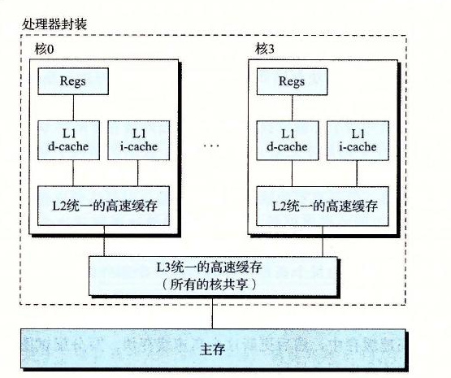

# 6.4.6 一个真实的高速缓存层次结构的解剖

到目前为止，我们一直假设高速缓存只保存程序数据。不过，实际上，高速缓存既保存数据，也保存指令。只保存指令的高速缓存称为 i-cache。只保存程序数据的高速缓存称为 d-cache。既保存指令又包括数据的高速缓存称为统一的高速缓存（unified cache）。现代处理器包括独立的 i-cache 和 d-cache。这样做有很多原因。有两个独立的高速缓存，处理器能够同时读一个指令字和一个数据字。i-cache 通常是只读的，因此比较简单。通常会针对不同的访问模式来优化这两个高速缓存，它们可以有不同的块大小、相联度和容量。使用不同的高速缓存也确保了数据访问不会与指令访问形成冲突不命中，反过来也是一样，代价就是可能会引起容量不命中增加。

图 6-38 给出了 Intel Core i7 处理器的高速缓存层次结构。每个 CPU 芯片有四个核。每个核有自己私有的 L1 i-cache、L1 d-cache 和 L2 统一的高速缓存。所有的核共享片上 L3 统一的高速缓存。这个层次结构的一个有趣的特性是所有的 SRAM 高速缓存存储器都在 CPU 芯片上。

**图 6-38** Intel Core i7 的高速缓存层次结构

图 6-39 总结了 Core i7 高速缓存的基本特性。

| 高速缓存类型 | 访问时间（周期） | 高速缓存大小（C） | 相联度（E） | 块大小（B） | 组数（S） |
| --- | ---: | ---: | ---: | ---: | ---: |
| L1 i-cache | 4 | 32KB | 8 | 64B | 64 |
| L1 d-cache | 4 | 32KB | 8 | 64B | 64 |
| L2 统一的高速缓存 | 10 | 256KB | 8 | 64B | 512 |
| L3 统一的高速缓存 | 40～75 | 8MB | 16 | 64B | 8192 |

**图 6-39** Core i7 高速缓存层次结构的特性
