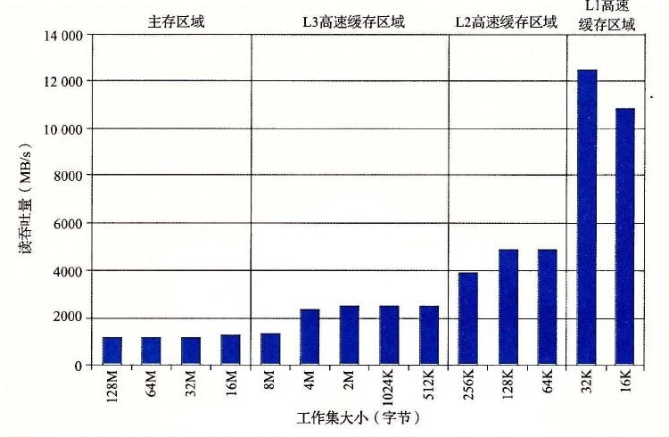

# 6.6.1 存储器山

一个程序从存储系统中读数据的速率称为读吞吐量（read throughput），或者有时称为读带宽（read bandwidth）。如果一个程序在 *s* 秒的时间段内读 *n* 个字节，那么这段时间内的读吞吐量就等于 *n* / *s*，通常以兆字节每秒（MB/s）为单位。

如果我们要编写一个程序，它从一个紧密程序循环（tight program loop）中发出一系列读请求，那么测量出的读吞吐量能让我们看到对于这个读序列来说的存储系统的性能。图 6-40 给出了一对测量某个读序列读吞吐量的函数。

```c
long data[MAXELEMS];  /* The global array we'll be traversing */

/*
 * test - Iterate over first "elems" elements of array "data" with
 *        stride of "stride", using 4 x 4 loop unrolling.
 */
int test(int elems, int stride)
{
    long i, sx2 = stride*2, sx3 = stride*3, sx4 = stride*4;
    long acc0 = 0, acc1 = 0, acc2 = 0, acc3 = 0;
    long length = elems;
    long limit = length - sx4;

    /* Combine 4 elements at a time */
    for (i = 0; i < limit; i += sx4) {
        acc0 = acc0 + data[i];
        acc1 = acc1 + data[i+stride];
        acc2 = acc2 + data[i+sx2];
        acc3 = acc3 + data[i+sx3];
    }

    /* Finish any remaining elements */
    for (; i < length; i += stride) {
        acc0 = acc0 + data[i];
    }
    return ((acc0 + acc1) + (acc2 + acc3));
}

/*
 * run - Run test(elems, stride) and return read throughput (MB/s).
 *       "size" is in bytes, "stride" is in array elements, and Mhz is
 *       CPU clock frequency in Mhz.
 */
double run(int size, int stride, double Mhz)
{
    double cycles;
    int elems = size / sizeof(double);

    test(elems, stride);                      /* Warm up the cache */
    cycles = fcyc2(test, elems, stride, 0);   /* Call test(elems,stride) */
    return (size / stride) / (cycles / Mhz);  /* Convert cycles to MB/s */
}
```

**图 6-40** 测量和计算读吞吐量的函数。我们可以通过以不同的 `size`（对应于时间局部性）和 `stride`（对应于空间局部性）的值来调用 `run` 函数，产生某台计算机的存储器山。

`test` 函数通过以步长 `stride` 扫描一个数组的头 `elems` 个元素来产生读序列。为了提高内循环中可用的并行性，使用了 4 × 4 展开（见 5.9 节）。`run` 函数是一个包装函数，调用 `test` 函数，并返回测量出的读吞吐量。第 37 行对 `test` 函数的调用会对高速缓存做暖身。第 38 行的 `fcyc2` 函数以参数 `elems` 调用 `test` 函数，并估计 `test` 函数的运行时间，以 CPU 周期为单位。注意，`run` 函数的参数 `size` 是以字节为单位的，而 `test` 函数对应的参数 `elems` 是以数组元素为单位的。另外，注意第 39 行将 MB/s 计算为 10<sup>6</sup> 字节/秒，而不是 2<sup>20</sup> 字节/秒。

`run` 函数的参数 `size` 和 `stride` 允许我们控制产生出的读序列的时间和空间局部性程度。`size` 的值越小，得到的工作集越小，因此时间局部性越好。`stride` 的值越小，得到的空间局部性越好。如果我们反复以不同的 `size` 和 `stride` 值调用 `run` 函数，那么我们就能得到一个读带宽的时间和空间局部性的二维函数，称为存储器山（memory mountain）[112]。

每个计算机都有表明它存储器系统的能力特色的唯一的存储器山。例如，图 6-41 展示了 Intel Core i7 系统的存储器山。在这个例子中，`size` 从 16KB 变到 128MB，`stride` 从 1 变到 12 个元素，每个元素是一个 8 个字节的 `long int`。


**图 6-41** 存储器山。展示了读吞吐量，它是时间和空间局部性的函数。

这座 Core i7 山的地形地势展现了一个很丰富的结构。垂直于大小轴的是四条山脊，分别对应于工作集完全在 L1 高速缓存、L2 高速缓存、L3 高速缓存和主存内的时间局部性区域。注意，L1 山脊的最高点（那里 CPU 读速率为 14GB/s）与主存山脊的最低点（那里 CPU 读速率为 900MB/s）之间的差别有一个数量级。

在 L2、L3 和主存山脊上，随着步长的增加，有一个空间局部性的斜坡，空间局部性下降。注意，即使当工作集太大，不能全都装进任何一个高速缓存时，主存山脊的最高点也比它的最低点高 8 倍。因此，即使是当程序的时间局部性很差时，空间局部性仍然能补救，并且是非常重要的。

有一条特别有趣的平坦的山脊线，对于步长 1 垂直于步长轴，此时读吞吐量相对保持不变，为 12GB/s，即使工作集超出了 L1 和 L2 的大小。这显然是由于 Core i7 存储器系统中的硬件预取（prefetching）机制，它会自动地识别顺序的、步长为 1 的引用模式，试图在一些块被访问之前，将它们取到高速缓存中。虽然文档里没有记录这种预取算法的细节，但是从存储器山可以明显地看到这个算法对小步长效果最好——这也是代码中要使用步长为 1 的顺序访问的另一个理由。

如果我们从这座山中取出一个片段，保持步长为常数，如图 6-42 所示，我们就能很清楚地看到高速缓存的大小和时间局部性对性能的影响了。大小最大为 32KB 的工作集完全能放进 L1 d-cache 中，因此，读都是由 L1 来服务的，吞吐量保持在峰值 12GB/s 处。大小最大为 256KB 的工作集完全能放进统一的 L2 高速缓存中，对于大小最大为 8MB，工作集完全能放进统一的 L3 高速缓存中。更大的工作集大小主要由主存来服务。



**图 6-42** 存储器山中时间局部性的山脊。这幅图展示了图 6-41 中 `stride = 8` 时的一个片段。

L2 和 L3 高速缓存区域最左边的边缘上读吞吐量的下降很有趣，此时工作集大小为 256KB 和 8MB，等于对应的高速缓存的大小。为什么会出现这样的下降，还不是完全清楚。要确认的唯一方法就是执行一个详细的高速缓存模拟，但是这些下降很有可能是与其他数据和代码行的冲突造成的。

以相反的方向横切这座山，保持工作集大小不变，我们从中能看到空间局部性对读吞吐量的影响。例如，图 6-43 展示了工作集大小固定为 4MB 时的片段。这个片段是沿着图 6-41 中的 L3 山脊切的，这里，工作集完全能够放到 L3 高速缓存中，但是对 L2 高速缓存来说太大了。

注意随着步长从 1 个字增长到 8 个字，读吞吐量是如何平稳地下降的。在山的这个区域中，L2 中的读不命中会导致一个块从 L3 传送到 L2。后面在 L2 中这个块上会有一定数量的命中，这是取决于步长的。随着步长的增加，L2 不命中与 L2 命中的比值也增加了。因为服务不命中要比命中更慢，所以读吞吐量也下降了。一旦步长达到了 8 个字，在这个系统上就等于块的大小 64 个字节了，每个读请求在 L2 中都会不命中，必须从 L3 服务。因此，对于至少为 8 个字的步长来说，读吞吐量是一个常数速率，是由从 L3 传送高速缓存块到 L2 的速率决定的。


**图 6-43** 一个空间局部性的斜坡。这幅图展示了图 6-41 中大小 = 4MB 时的一个片段。

总结一下我们对存储器山的讨论，存储器系统的性能不是一个数字就能描述的。相反，它是一座时间和空间局部性的山，这座山的上升高度差别可以超过一个数量级。明智的程序员会试图构造他们的程序，使得程序运行在山峰而不是低谷。目标就是利用时间局部性，使得频繁使用的字从 L1 中取出，还要利用空间局部性，使得尽可能多的字从一个 L1 高速缓存行中访问到。

**练习题 6.21**　利用图 6-41 中的存储器山来估计从 L1 d-cache 中读一个 8 字节的字所需要的时间（以 CPU 周期为单位）。
