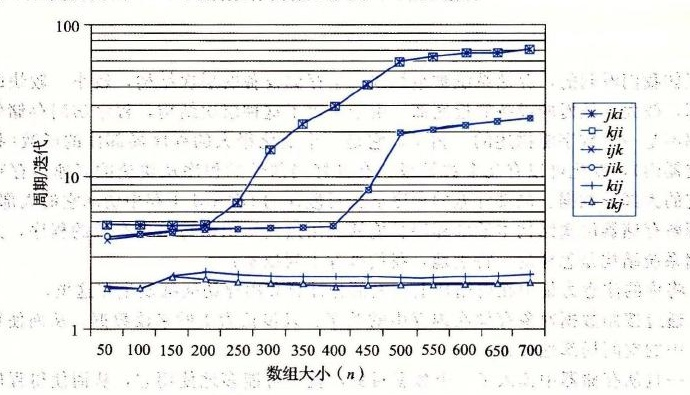

# 6.6.2 重新排列循环以提高空间局部性

考虑一对 *n* × *n* 矩阵相乘的问题：*C* = *AB*。例如，如果 *n* = 2，那么

```text
[ c₁₁  c₁₂ ]   [ a₁₁  a₁₂ ][ b₁₁  b₁₂ ]
[ c₂₁  c₂₂ ] = [ a₂₁  a₂₂ ][ b₂₁  b₂₂ ]
```

其中

```text
c₁₁ = a₁₁b₁₁ + a₁₂b₂₁
c₁₂ = a₁₁b₁₂ + a₁₂b₂₂
c₂₁ = a₂₁b₁₁ + a₂₂b₂₁
c₂₂ = a₂₁b₁₂ + a₂₂b₂₂
```

矩阵乘法函数通常是用 3 个嵌套的循环来实现的，分别用索引 `i`、`j` 和 `k` 来标识。如果改变循环的次序，对代码进行一些其他的小改动，我们就能得到矩阵乘法的 6 个在功能上等价的版本，如图 6-44 所示。每个版本都以它循环的顺序来唯一地标识。

在高层次来看，这 6 个版本是非常相似的。如果加法是可结合的，那么每个版本计算出的结果完全一样。每个版本总共都执行 O(*n*<sup>3</sup>) 个操作，而加法和乘法的数量相同。*A* 和 *B* 的 *n*<sup>2</sup> 个元素中的每一个都要读 *n* 次；计算 *C* 的 *n*<sup>2</sup> 个元素中的每一个都要对 *n* 个值求和。不过，如果分析最里层循环迭代的行为，我们发现在访问数量和局部性上还是有区别的。

> ① 正如我们在第 2 章中学到的，浮点加法是可交换的，但是通常是不可结合的。实际上，如果矩阵不把极大的数和极小的数混在一起——存储物理属性的矩阵常常这样，那么假设浮点加法是可结合的也是合理的。

为了分析，我们做了如下假设：

- 每个数组都是一个 `double` 类型的 *n* × *n* 的数组，`sizeof(double) == 8`。
- 只有一个高速缓存，其块大小为 32 字节（*B* = 32）。
- 数组大小 *n* 很大，以至于矩阵的一行都不能完全装进 L1 高速缓存中。
- 编译器将局部变量存储到寄存器中，因此循环内对局部变量的引用不需要任何加载或存储指令。

**a) `ijk` 版本**

```c
for (i = 0; i < n; i++)
    for (j = 0; j < n; j++) {
        sum = 0.0;
        for (k = 0; k < n; k++)
            sum += A[i][k] * B[k][j];
        C[i][j] += sum;
    }
```

**b) `jik` 版本**

```c
for (j = 0; j < n; j++)
    for (i = 0; i < n; i++) {
        sum = 0.0;
        for (k = 0; k < n; k++)
            sum += A[i][k] * B[k][j];
        C[i][j] += sum;
    }
```

**c) `jki` 版本**

```c
for (j = 0; j < n; j++)
    for (k = 0; k < n; k++) {
        r = B[k][j];
        for (i = 0; i < n; i++)
            C[i][j] += A[i][k] * r;
    }
```

**d) `kji` 版本**

```c
for (k = 0; k < n; k++)
    for (j = 0; j < n; j++) {
        r = B[k][j];
        for (i = 0; i < n; i++)
            C[i][j] += A[i][k] * r;
    }
```

**e) `kij` 版本**

```c
for (k = 0; k < n; k++)
    for (i = 0; i < n; i++) {
        r = A[i][k];
        for (j = 0; j < n; j++)
            C[i][j] += r * B[k][j];
    }
```

**f) `ikj` 版本**

```c
for (i = 0; i < n; i++)
    for (k = 0; k < n; k++) {
        r = A[i][k];
        for (j = 0; j < n; j++)
            C[i][j] += B[k][j] * r;
    }
```

**图 6-44** 矩阵乘法的六个版本。每个版本都以它循环的顺序来唯一地标识。

图 6-45 总结了我们对内循环的分析结果。注意 6 个版本成对地形成了 3 个等价类，用内循环中访问的矩阵对来表示每个类。例如，版本 `ijk` 和 `jik` 是类 AB 的成员，因为它们在最内层的循环中引用的是矩阵 *A* 和 *B*（而不是 *C*）。对于每个类，我们统计了每个内循环迭代中加载（读）和存储（写）的数量，每次循环迭代中对 *A*、*B* 和 *C* 的引用在高速缓存中不命中的数量，以及每次迭代缓存不命中的总数。

| 矩阵乘法版本（类） | 加载次数 | 存储次数 | *A* 不命中次数 | *B* 不命中次数 | *C* 不命中次数 | 不命中总次数 |
|---|---:|---:|---:|---:|---:|---:|
| `ijk` 和 `jik`（AB） | 2 | 0 | 0.25 | 1.00 | 0.00 | 1.25 |
| `jki` 和 `kji`（AC） | 2 | 1 | 1.00 | 0.00 | 1.00 | 2.00 |
| `kij` 和 `ikj`（BC） | 2 | 1 | 0.00 | 0.25 | 0.25 | 0.50 |

**图 6-45** 矩阵乘法内循环的分析。6 个版本分为 3 个等价类，用内循环中访问的数组对来表示。

类 AB 例程的内循环（图 6-44a 和图 6-44b）以步长 1 扫描数组 *A* 的一行。因为每个高速缓存块保存四个 8 字节的字，*A* 的不命中率是每次迭代不命中 0.25 次。另一方面，内循环以步长 *n* 扫描数组 *B* 的一列。因为 *n* 很大，每次对数组 *B* 的访问都会不命中，所以每次迭代总共会有 1.25 次不命中。

类 AC 例程的内循环（图 6-44c 和图 6-44d）有一些问题。每次迭代执行两个加载和一个存储（相对于类 AB 例程，它们执行 2 个加载而没有存储）。内循环以步长 *n* 扫描 *A* 和 *C* 的列。结果是每次加载都会不命中，所以每次迭代总共有两个不命中。注意，与类 AB 例程相比，交换循环降低了空间局部性。

BC 例程（图 6-44e 和图 6-44f）展示了一个很有趣的折中：使用了两个加载和一个存储，它们比 AB 例程多需要一个内存操作。另一方面，因为内循环以步长为 1 的访问模式按行扫描 *B* 和 *C*，每次迭代每个数组上的不命中率只有 0.25 次不命中，所以每次迭代总共有 0.50 个不命中。

图 6-46 小结了一个 Core i7 系统上矩阵乘法各个版本的性能。这个图画出了测量出的每次内循环迭代所需的 CPU 周期数作为数组大小（*n*）的函数。



**图 6-46** Core i7 矩阵乘法性能。

对于这幅图有很多有意思的地方值得注意：

- 对于大的 *n* 值，即使每个版本都执行相同数量的浮点算术操作，最快的版本比最慢的版本运行得快几乎 40 倍。
- 每次迭代内存引用和不命中数量都相同的一对版本，有大致相同的测量性能。
- 内存行为最糟糕的两个版本，就每次迭代的访问数量和不命中数量而言，明显地比其他 4 个版本运行得慢，其他 4 个版本有较少的不命中次数或者较少的访问次数，或者兼而有之。
- 在这个情况中，与内存访问总数相比，不命中率是一个更好的性能预测指标。例如，即使类 BC 例程（2 个加载和 1 个存储）在内循环中比类 AB 例程（2 个加载）执行更多的内存引用，类 BC 例程（每次迭代有 0.5 个不命中）比类 AB 例程（每次迭代有 1.25 个不命中）性能还是要好很多。
- 对于大的 *n* 值，最快的一对版本（`kij` 和 `ikj`）的性能保持不变。虽然这个数组远大于任何 SRAM 高速缓存存储器，但预取硬件足够聪明，能够认出步长为 1 的访问模式，而且速度足够快能够跟上内循环中的内存访问。这是设计这个内存系统的 Intel 的工程师所做的一项极好成就，向程序员提供了甚至更多的鼓励，鼓励他们开发出具有良好空间局部性的程序。

> **网络旁注 MEM:BLOCKING　使用分块来提高时间局部性**
>
> 有一项很有趣的技术，称为分块（blocking），它可以提高内循环的时间局部性。分块的大致思想是将一个程序中的数据结构组织成大的片（chunk），称为块（block）。（在这个上下文中，“块”指的是一个应用级的数据组块，而不是高速缓存块。）这样构造程序，使得能够将一个片加载到 L1 高速缓存中，并在这个片中进行所需的所有的读和写，然后丢掉这个片，加载下一个片，依此类推。
>
> 与为提高空间局部性所做的简单循环变换不同，分块使得代码更难阅读和理解。由于这个原因，它最适合于优化编译器或者频繁执行的库函数。由于 Core i7 有完善的预取硬件，分块不会提高矩阵乘在 Core i7 上的性能。不过，学习和理解这项技术还是很有趣的，因为它是一个通用的概念，可以在一些没有预取的系统上获得极大的性能收益。
