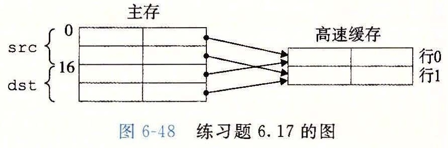

# 练习题答案

## 练习题 6.1

这里的思想是通过使纵横比 max(r, c)/min(r, c) 最小，使得地址位数最小。换句话说，数组越接近于正方形，地址位数越少。

| 组织 | r | c | b<sub>r</sub> | b<sub>c</sub> | max(b<sub>r</sub>, b<sub>c</sub>) |
| --- | --- | --- | --- | --- | --- |
| 16×1 | 4 | 4 | 2 | 2 | 2 |
| 16×4 | 4 | 4 | 2 | 2 | 2 |
| 128×8 | 16 | 8 | 4 | 3 | 4 |
| 512×4 | 32 | 16 | 5 | 4 | 5 |
| 1024×4 | 32 | 32 | 5 | 5 | 5 |

## 练习题 6.2

这个小练习的主旨是确保你理解柱面和磁道之间的关系。一旦你弄明白了这个关系，那问题就很简单了：

```text
磁盘容量 = (512 字节 / 扇区) × (400 扇区数 / track)
         × (10 000 磁道数 / 表面) × (2 表面数 / 盘片) × (2 盘片数 / 磁盘)
         = 8 192 000 000 字节
         = 8.192GB
```

## 练习题 6.3

对这个问题的解答是对磁盘访问时间公式的直接应用。平均旋转时间（以 ms 为单位）为

T<sub>avg rotation</sub> = 1/2 × T<sub>max rotation</sub> = 1/2 × (60s/15 000RPM) × 1000ms/s ≈ 2ms

平均传送时间为

T<sub>avg transfer</sub> = (60s/15 000RPM) × 1/(500 扇区/磁道) × 1000ms/s ≈ 0.008ms

总的来说，总的预计访问时间为

T<sub>access</sub> = T<sub>avg seek</sub> + T<sub>avg rotation</sub> + T<sub>avg transfer</sub> = 8ms + 2ms + 0.008ms ≈ 10ms

## 练习题 6.4

这道题很好的检查了你对影响磁盘性能的因素的理解。首先我们需要确定这个文件和磁盘的一些基本属性。这个文件由 2000 个 512 字节的逻辑块组成。对于磁盘，T<sub>avg seek</sub> = 5ms，T<sub>max rotation</sub> = 6ms，而 T<sub>avg rotation</sub> = 3ms。

A. 最好情况：在好的情况中，块被映射到连续的扇区，在同一柱面上，那样就可以一块接一块地读，不用移动读/写头。一旦读/写头定位到了第一个扇区，需要磁盘转两整圈（每圈 1000 个扇区）来读所有 2000 个块。所以，读这个文件的总时间为 T<sub>avg seek</sub> + T<sub>avg rotation</sub> + 2 × T<sub>max rotation</sub> = 5+3+12 = 20ms。

B. 随机的情况：在这种情况中，块被随机地映射到扇区上，读 2000 块中的每一块都需要 T<sub>avg seek</sub> + T<sub>avg rotation</sub> ms，所以读这个文件的总时间为 (T<sub>avg seek</sub> + T<sub>avg rotation</sub>) × 2000 = 16 000ms（16 秒！）。

你现在可以看到为什么清理磁盘碎片是个好主意！

## 练习题 6.5

这是一个简单的练习，让你对 SSD 的可行性有一些有趣的了解。回想一下对于磁盘，1PB = 10<sup>9</sup> MB。那么下面对单位的直接翻译得到了下面的每种情况的预测时间：

A. 最糟糕情况顺序写（470MB/s）：(10<sup>9</sup> × 128) × (1/470) × (1/(86 400 × 365)) ≈ 8 年。

B. 最糟糕情况随机写（303MB/s）：(10<sup>9</sup> × 128) × (1/303) × (1/(86 400 × 365)) ≈ 13 年。

C. 平均情况（20GB/天）：(10<sup>9</sup> × 128) × (1/20 000) × (1/365) ≈ 17 535 年。

所以即使 SSD 连续工作，也能持续至少 8 年时间，这大于大多数计算机的预期寿命。

## 练习题 6.6

在 2005 年到 2015 年的 10 年间，旋转磁盘的单位价格下降了大约 166 倍，这意味着价格大约每 18 个月下降 2 倍。假设这个趋势一直持续，1PB 的存储设备，在 2015 年花费 30 000 美元，在 7 次这种 2 倍的下降之后会降到 500 美元以下。因为这种下降每 18 个月发生一次，我们可以预期在大约 2025 年，可以用 500 美元买到 1PB 的存储设备。

## 练习题 6.7

为了创建一个步长为 1 的引用模式，必须改变循环的次序，使得最右边的索引变化得最快：

```c
 1 int sumarray3d(int a[N][N][N])
 2 {
 3     int i, j, k, sum = 0;
 4
 5     for (k = 0; k < N; k++) {
 6         for (i = 0; i < N; i++) {
 7             for (j = 0; j < N; j++) {
 8                 sum += a[k][i][j];
 9             }
10         }
11     }
12     return sum;
13 }
```

这是一个很重要的思想。要保证你理解了为什么这种循环次序改变就能得到一个步长为 1 的访问模式。

## 练习题 6.8

解决这个问题的关键在于想象出数组是如何在内存中排列的，然后分析引用模式。函数 `clear1` 以步长为 1 的引用模式访问数组，因此明显地具有最好的空间局部性。函数 `clear2` 依次扫描 N 个结构中的每一个，这是好的，但是在每个结构中，它以步长不为 1 的模式跳到下列相对于结构起始位置的偏移处：0、12、4、16、8、20。所以 `clear2` 的空间局部性比 `clear1` 的要差。函数 `clear3` 不仅在每个结构中跳来跳去，而且还从结构跳到结构，所以 `clear3` 的空间局部性比 `clear2` 和 `clear1` 都要差。

## 练习题 6.9

这个解答是对图 6-26 中各种高速缓存参数定义的直接应用。不那么令人兴奋，但是在能真正理解高速缓存如何工作之前，你需要理解高速缓存的结构是如何导致这样划分地址位的。

| 高速缓存 | m | C | B | E | S | t | s | b |
| --- | --- | --- | --- | --- | --- | --- | --- | --- |
| 1. | 32 | 1024 | 4 | 1 | 256 | 22 | 8 | 2 |
| 2. | 32 | 1024 | 8 | 4 | 32 | 24 | 5 | 3 |
| 3. | 32 | 1024 | 32 | 32 | 1 | 27 | 0 | 5 |

## 练习题 6.10

填充消除了冲突不命中。因此，四分之三的引用是命中的。

## 练习题 6.11

有时候，理解为什么某种思想是不好的，能够帮助你理解为什么另一种是好的。这里，我们看到的坏的想法是用高位来索引高速缓存，而不是用中间的位。

A. 用高位做索引，每个连续的数组片（chunk）由 2<sup>t</sup> 个块组成，这里 t 是标记位数。因此，数组头 2<sup>t</sup> 个连续的块都会映射到组 0，接下来的 2<sup>t</sup> 个块会映射到组 1，依此类推。

B. 对于直接映射高速缓存 (S, E, B, m) = (512, 1, 32, 32)，高速缓存容量是 512 个 32 字节的块，每个高速缓存行中有 t = 18 个标记位。因此，数组中头 2<sup>18</sup> 个块会映射到组 0，接下来 2<sup>18</sup> 个块会映射到组 1。因为我们的数组只由 (4096 × 4)/32 = 512 个块组成，所以数组中所有的块都被映射到组 0。因此，在任何时刻，高速缓存至多只能保存一个数组块，即使数组足够小，能够完全放到高速缓存中。很明显，用高位做索引不能充分利用高速缓存。

## 练习题 6.12

两个低位是块偏移（CO），然后是 3 位的组索引（CI），剩下的位作为标记（CT）：

| 12 | 11 | 10 | 9 | 8 | 7 | 6 | 5 | 4 | 3 | 2 | 1 | 0 |
| --- | --- | --- | --- | --- | --- | --- | --- | --- | --- | --- | --- | --- |
| CT | CT | CT | CT | CT | CT | CT | CT | CI | CI | CI | CO | CO |

## 练习题 6.13

地址：`0x0E34`

A. 地址格式（每个小格子表示一个位）：

| 12 | 11 | 10 | 9 | 8 | 7 | 6 | 5 | 4 | 3 | 2 | 1 | 0 |
| --- | --- | --- | --- | --- | --- | --- | --- | --- | --- | --- | --- | --- |
| 0 | 1 | 1 | 1 | 0 | 0 | 0 | 1 | 1 | 0 | 1 | 0 | 0 |
| CT | CT | CT | CT | CT | CT | CT | CT | CI | CI | CI | CO | CO |

B. 内存引用：

| 参数 | 值 |
| --- | --- |
| 高速缓存块偏移（CO） | 0x0 |
| 高速缓存组索引（CI） | 0x5 |
| 高速缓存标记（CT） | 0x71 |
| 高速缓存命中？（是/否） | 是 |
| 高速缓存返回的字节 | 0xB |

## 练习题 6.14

地址：`0x0DD5`

A. 地址格式（每个小格子表示一个位）：

| 12 | 11 | 10 | 9 | 8 | 7 | 6 | 5 | 4 | 3 | 2 | 1 | 0 |
| --- | --- | --- | --- | --- | --- | --- | --- | --- | --- | --- | --- | --- |
| 0 | 1 | 1 | 0 | 1 | 1 | 1 | 0 | 1 | 0 | 1 | 0 | 1 |
| CT | CT | CT | CT | CT | CT | CT | CT | CI | CI | CI | CO | CO |

B. 内存引用：

| 参数 | 值 |
| --- | --- |
| 高速缓存块偏移（CO） | 0x1 |
| 高速缓存组索引（CI） | 0x5 |
| 高速缓存标记（CT） | 0x6E |
| 高速缓存命中？（是/否） | 否 |
| 返回的高速缓存字节 | — |

## 练习题 6.15

地址：`0x1FF4`

A. 地址格式（每个小格子表示一个位）：

| 12 | 11 | 10 | 9 | 8 | 7 | 6 | 5 | 4 | 3 | 2 | 1 | 0 |
| --- | --- | --- | --- | --- | --- | --- | --- | --- | --- | --- | --- | --- |
| 1 | 1 | 1 | 1 | 1 | 1 | 1 | 1 | 0 | 0 | 1 | 0 | 0 |
| CT | CT | CT | CT | CT | CT | CT | CT | CI | CI | CI | CO | CO |

B. 内存引用：

| 参数 | 值 |
| --- | --- |
| 高速缓存块偏移（CO） | 0x0 |
| 高速缓存组索引（CI） | 0x1 |
| 高速缓存标记（CT） | 0xFF |
| 高速缓存命中？（是/否） | 否 |
| 返回的高速缓存字节 | — |

## 练习题 6.16

这个问题是练习题 6.12～练习题 6.15 的一种逆过程，要求你反向工作，从高速缓存的内容推出会在某个组中命中的地址。在这种情况中，组 3 包含一个有效行，标记为 `0x32`。因为组中只有一个有效行，4 个地址会命中。这些地址的二进制形式为 `0011 0010 011xx`。因此，在组 3 中命中的 4 个十六进制地址是：`0x064C`、`0x064D`、`0x064E` 和 `0x064F`。

## 练习题 6.17

A. 解决这个问题的关键是想象出图 6-48 中的图像。注意，每个高速缓存行只包含数组的一个行，高速缓存正好只够保存一个数组，而且对于所有的 i，`src` 和 `dst` 的行 i 映射到同一个高速缓存行。因为高速缓存不够大，不足以容纳这两个数组，所以对一个数组的引用总是驱逐出另一个数组的有用的行。例如，对 `dst[0][0]` 写会驱逐当我们读 `src[0][0]` 时加载进来的那一行。所以，当我们接下来读 `src[0][1]` 时，会有一个不命中。



B. 当高速缓存为 32 字节时，它足够大，能容纳这两个数组。因此，所有的不命中都是开始时的冷不命中。

| | dst 数组：列 0 | dst 数组：列 1 | src 数组：列 0 | src 数组：列 1 |
| --- | --- | --- | --- | --- |
| 行 0 | m | m | m | m |
| 行 1 | m | m | m | h |

| | dst 数组：列 0 | dst 数组：列 1 | src 数组：列 0 | src 数组：列 1 |
| --- | --- | --- | --- | --- |
| 行 0 | m | h | m | h |
| 行 1 | m | h | m | h |

## 练习题 6.18

每个 16 字节的高速缓存行包含着两个连续的 `algae_position` 结构。每个循环按照内存顺序访问这些结构，每次读一个整数元素。所以，每个循环的模式就是不命中、命中、不命中、命中，依此类推。注意，对于这个问题，我们不必实际列举出读和不命中的总数，就能预测出不命中率。

A. 读总数是多少？512 个读。

B. 缓存不命中的读总数是多少？256 个不命中。

C. 不命中率是多少？256/512 = 50%。

## 练习题 6.19

对这个问题的关键是注意到这个高速缓存只能保存数组的 1/2。所以，按照列顺序来扫描数组的第二部分会驱逐扫描第一部分时加载进来的那些行。例如，读 `grid[8][0]` 的第一个元素会驱逐当我们读 `grid[0][0]` 的元素时加载进来的那一行。这一行也包含 `grid[0][1]`。所以，当我们开始扫描下一列时，对 `grid[0][1]` 第一个元素的引用会不命中。

A. 读总数是多少？512 个读。

B. 缓存不命中的读总数是多少？256 个不命中。

C. 不命中率是多少？256/512 = 50%。

D. 如果高速缓存有两倍大，那么不命中率会是多少呢？如果高速缓存有现在的两倍大，那么它能够保存整个 `grid` 数组。所有的不命中都会是开始时的冷不命中，而不命中率会是 1/4 = 25%。

## 练习题 6.20

这个循环有很好的步长为 1 的引用模式，因此所有的不命中都是最开始时的冷不命中。

A. 读总数是多少？512 个读。

B. 缓存不命中的读总数是多少？128 个不命中。

C. 不命中率是多少？128/512 = 25%。

D. 如果高速缓存有两倍大，那么不命中率会是多少呢？无论高速缓存的大小增加多少，都不会改变不命中率，因为冷不命中是不可避免的。

## 练习题 6.21

从 L1 的吞吐量峰值是大约 12 000MB/s，时钟频率是 2100MHz，而每次读访问都是以 8 字节 `long` 类型为单位的。所以，从这张图中我们可以估计出在这台机器上从 L1 访问一个字需要大约 2100/12 000 × 8 = 1.4 ≈ 1.5 周期，比正常访问 L1 的延迟 4 周期快大约 2.5 倍。这是由于 4×4 的循环展开得到的并行允许同时进行多个加载操作。
