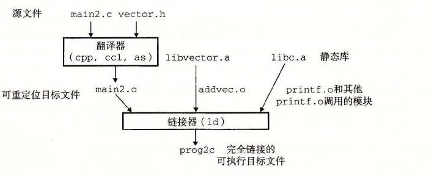

# 7.6.2 与静态库链接

迄今为止，我们都是假设链接器读取一组可重定位目标文件，并把它们链接起来，形成一个输出的可执行文件。实际上，所有的编译系统都提供一种机制，将所有相关的目标模块打包成为一个单独的文件，称为静态库（static library），它可以用做链接器的输入。当链接器构造一个输出的可执行文件时，它只复制静态库里被应用程序引用的目标模块。

为什么系统要支持库的概念呢？以 ISO C99 为例，它定义了一组广泛的标准 I/O、字符串操作和整数数学函数，例如 `atoi`、`printf`、`scanf`、`strcpy` 和 `rand`。它们在 `libc.a` 库中，对每个 C 程序来说都是可用的。ISO C99 还在 `libm.a` 库中定义了一组广泛的浮点数学函数，例如 `sin`、`cos` 和 `sqrt`。

让我们来看看如果不使用静态库，编译器开发人员会使用什么方法来向用户提供这些函数。一种方法是让编译器辨认出对标准函数的调用，并直接生成相应的代码。Pascal（只提供了一小部分标准函数）采用的就是这种方法，但是这种方法对 C 而言是不合适的，因为 C 标准定义了大量的标准函数。这种方法将给编译器增加显著的复杂性，而且每次添加、删除或修改一个标准函数时，就需要一个新的编译器版本。然而，对于应用程序员而言，这种方法会是非常方便的，因为标准函数将总是可用的。

另一种方法是将所有的标准 C 函数都放在一个单独的可重定位目标模块中（比如说 `libc.o` 中），应用程序员可以把这个模块链接到他们的可执行文件中：

```text
linux> gcc main.c /usr/lib/libc.o
```

这种方法的优点是它将编译器的实现与标准函数的实现分离开来，并且仍然对程序员保持适度的便利。然而，一个很大的缺点是系统中每个可执行文件现在都包含着一份标准函数集合的完全副本，这对磁盘空间是很大的浪费。（在一个典型的系统上，`libc.a` 大约是 5MB，而 `libm.a` 大约是 2MB。）更糟的是，每个正在运行的程序都将它自己的这些函数的副本放在内存中，这是对内存的极度浪费。另一个大的缺点是，对任何标准函数的任何改变，无论多么小的改变，都要求库的开发人员重新编译整个源文件，这是一个非常耗时的操作，使得标准函数的开发和维护变得很复杂。

我们可以通过为每个标准函数创建一个独立的可重定位文件，把它们存放在一个为大家都知道的目录中来解决其中的一些问题。然而，这种方法要求应用程序员显式地链接合适的目标模块到它们的可执行文件中，这是一个容易出错而且耗时的过程：

```text
linux> gcc main.c /usr/lib/printf.o /usr/lib/scanf.o ...
```

静态库概念被提出来，以解决这些不同方法的缺点。相关的函数可以被编译为独立的目标模块，然后封装成一个单独的静态库文件。然后，应用程序可以通过在命令行上指定单独的文件名字来使用这些在库中定义的函数。比如，使用 C 标准库和数学库中函数的程序可以用形式如下的命令行来编译和链接：

```text
linux> gcc main.c /usr/lib/libm.a /usr/lib/libc.a
```

在链接时，链接器将只复制被程序引用的目标模块，这就减少了可执行文件在磁盘和内存中的大小。另一方面，应用程序员只需要包含较少的库文件的名字（实际上，C 编译器驱动程序总是传送 `libc.a` 给链接器，所以前面提到的对 `libc.a` 的引用是不必要的）。

在 Linux 系统中，静态库以一种称为存档（archive）的特殊文件格式存放在磁盘中。存档文件是一组连接起来的可重定位目标文件的集合，有一个头部用来描述每个成员目标文件的大小和位置。存档文件名由后缀 `.a` 标识。

为了使我们对库的讨论更加形象具体，考虑图 7-6 中的两个向量例程。每个例程，定义在它自己的目标模块中，对两个输入向量进行一个向量操作，并把结果存放在一个输出向量中。每个例程有一个副作用，会记录它自己被调用的次数，每次被调用会把一个全局变量加 1。（当我们在 7.12 节中解释位置无关代码的思想时会起作用。）

**a）`addvec.o`**

`code/link/addvec.c`

```c
int addcnt = 0;

void addvec(int *x, int *y,
            int *z, int n)
{
    int i;

    addcnt++;

    for (i = 0; i < n; i++)
        z[i] = x[i] + y[i];
}
```

**b）`multvec.o`**

`code/link/multvec.c`

```c
int multcnt = 0;

void multvec(int *x, int *y,
             int *z, int n)
{
    int i;

    multcnt++;

    for (i = 0; i < n; i++)
        z[i] = x[i] * y[i];
}
```

**图 7-6** `libvector` 库中的成员目标文件

要创建这些函数的一个静态库，我们将使用 AR 工具，如下：

```text
linux> gcc -c addvec.c multvec.c
linux> ar rcs libvector.a addvec.o multvec.o
```

为了使用这个库，我们可以编写一个应用，比如图 7-7 中的 `main2.c`，它调用 `addvec` 库例程。包含（或头）文件 `vector.h` 定义了 `libvector.a` 中例程的函数原型。

`code/link/main2.c`

```c
#include <stdio.h>
#include "vector.h"

int x[2] = {1, 2};
int y[2] = {3, 4};
int z[2];

int main()
{
    addvec(x, y, z, 2);
    printf("z = [%d %d]\n", z[0], z[1]);
    return 0;
}
```

**图 7-7** 示例程序 2。这个程序调用 `libvector` 库中的函数

为了创建这个可执行文件，我们要编译和链接输入文件 `main.o` 和 `libvector.a`：

```text
linux> gcc -c main2.c
linux> gcc -static -o prog2c main2.o ./libvector.a
```

或者等价地使用：

```text
linux> gcc -c main2.c
linux> gcc -static -o prog2c main2.o -L. -lvector
```

图 7-8 概括了链接器的行为。`-static` 参数告诉编译器驱动程序，链接器应该构建一个完全链接的可执行目标文件，它可以加载到内存并运行，在加载时无须更进一步的链接。`-lvector` 参数是 `libvector.a` 的缩写，`-L.` 参数告诉链接器在当前目录下查找 `libvector.a`。



**图 7-8** 与静态库链接

当链接器运行时，它判定 `main2.o` 引用了 `addvec.o` 定义的 `addvec` 符号，所以复制 `addvec.o` 到可执行文件。因为程序不引用任何由 `multvec.o` 定义的符号，所以链接器就不会复制这个模块到可执行文件。链接器还会复制 `libc.a` 中的 `printf.o` 模块，以及许多 C 运行时系统中的其他模块。
