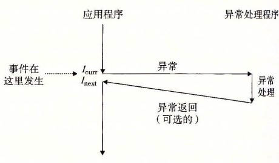

# 8.1 异常

异常是异常控制流的一种形式，它一部分由硬件实现，一部分由操作系统实现。因为它们有一部分是由硬件实现的，所以具体细节将随系统的不同而有所不同。然而，对于每个系统而言，基本的思想都是相同的。在这一节中我们的目的是让你对异常和异常处理有一个一般性的了解，并且向你揭示现代计算机系统的一个经常令人感到迷惑的方面。

异常（exception）就是控制流中的突变，用来响应处理器状态中的某些变化。图 8-1 展示了基本的思想。

在图中，当处理器状态中发生一个重要的变化时，处理器正在执行某个当前指令 Icurr。在处理器中，状态被编码为不同的位和信号。状态变化称为事件（event）。事件可能和当前指令的执行直接相关。比如，发生虚拟内存缺页、算术溢出，或者一条指令试图除以零。另一方面，事件也可能和当前指令的执行没有关系。比如，一个系统定时器产生信号或者一个 I/O 请求完成。

**图 8-1** 异常的剖析。处理器状态中的变化（事件）触发从应用程序到异常处理程序的突发的控制转移（异常）。在异常处理程序完成处理后，它将控制返回给被中断的程序或者终止

在任何情况下，当处理器检测到有事件发生时，它就会通过一张叫做异常表（exception table）的跳转表，进行一个间接过程调用（异常），到一个专门设计用来处理这类事件的操作系统子程序（异常处理程序（exception handler））。当异常处理程序完成处理后，根据引起异常的事件的类型，会发生以下 3 种情况中的一种：

1. 处理程序将控制返回给当前指令 Icurr，即当事件发生时正在执行的指令。
2. 处理程序将控制返回给 Inext，如果没有发生异常将会执行的下一条指令。
3. 处理程序终止被中断的程序。

8.1.2 节将讲述关于这些可能性的更多内容。

> **旁注 硬件异常与软件异常**
>
> C++ 和 Java 的程序员会注意到术语“异常”也用来描述由 C++ 和 Java 以 `catch`、`throw` 和 `try` 语句形式提供的应用级 ECF。如果想严格清晰，我们必须区别“硬件”和“软件”异常，但这通常是不必要的，因为从上下文中就能够很清楚地知道是哪种含义。
