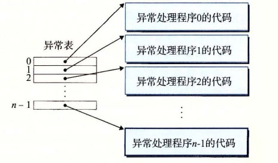
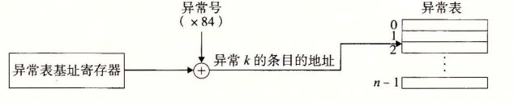

# 8.1.1 异常处理

异常可能会难以理解，因为处理异常需要硬件和软件紧密合作。很容易搞混哪个部分执行哪个任务。让我们更详细地来看看硬件和软件的分工吧。

系统中可能的每种类型的异常都分配了一个唯一的非负整数的异常号（exception number）。其中一些号码是由处理器的设计者分配的，其他号码是由操作系统内核（操作系统常驻内存的部分）的设计者分配的。前者的示例包括被零除、缺页、内存访问违例、断点以及算术运算溢出。后者的示例包括系统调用和来自外部 I/O 设备的信号。

在系统启动时（当计算机重启或者加电时），操作系统分配和初始化一张称为异常表的跳转表，使得表目 k 包含异常 k 的处理程序的地址。图 8-2 展示了异常表的格式。

**图 8-2** 异常表。异常表是一张跳转表，其中表目 k 包含异常 k 的处理程序代码的地址

在运行时（当系统在执行某个程序时），处理器检测到发生了一个事件，并且确定了相应的异常号 k。随后，处理器触发异常，方法是执行间接过程调用，通过异常表的表目 k，转到相应的处理程序。图 8-3 展示了处理器如何使用异常表来形成适当的异常处理程序的地址。异常号是到异常表中的索引，异常表的起始地址放在一个叫做异常表基址寄存器（exception table base register）的特殊 CPU 寄存器里。

**图 8-3** 生成异常处理程序的地址。异常号是到异常表中的索引

异常类似于过程调用，但是有一些重要的不同之处：

- 过程调用时，在跳转到处理程序之前，处理器将返回地址压入栈中。然而，根据异常的类型，返回地址要么是当前指令（当事件发生时正在执行的指令），要么是下一条指令（如果事件不发生，将会在当前指令后执行的指令）。
- 处理器也把一些额外的处理器状态压到栈里，在处理程序返回时，重新开始执行被中断的程序会需要这些状态。比如，x86-64 系统会将包含当前条件码的 EFLAGS 寄存器和其他内容压入栈中。
- 如果控制从用户程序转移到内核，所有这些项目都被压到内核栈中，而不是压到用户栈中。
- 异常处理程序运行在内核模式下（见 8.2.4 节），这意味着它们对所有的系统资源都有完全的访问权限。

一旦硬件触发了异常，剩下的工作就是由异常处理程序在软件中完成。在处理程序处理完事件之后，它通过执行一条特殊的“从中断返回”指令，可选地返回到被中断的程序，该指令将适当的状态弹回到处理器的控制和数据寄存器中，如果异常中断的是一个用户程序，就将状态恢复为用户模式（见 8.2.4 节），然后将控制返回给被中断的程序。
