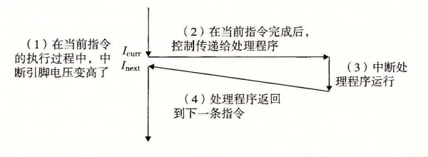
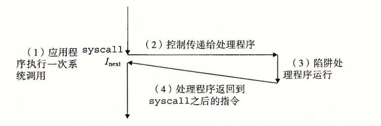
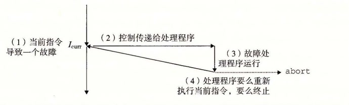
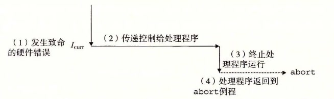

# 8.1.2 异常的类别

异常可以分为四类：中断（interrupt）、陷阱（trap）、故障（fault）和终止（abort）。图 8-4 中的表对这些类别的属性做了小结。

| 类别 | 原因 | 异步/同步 | 返回行为 |
| --- | --- | --- | --- |
| 中断 | 来自 I/O 设备的信号 | 异步 | 总是返回到下一条指令 |
| 陷阱 | 有意的异常 | 同步 | 总是返回到下一条指令 |
| 故障 | 潜在可恢复的错误 | 同步 | 可能返回到当前指令 |
| 终止 | 不可恢复的错误 | 同步 | 不会返回 |

**图 8-4** 异常的类别。异步异常是由处理器外部的 I/O 设备中的事件产生的。同步异常是执行一条指令的直接产物

## 1. 中断

中断是异步发生的，是来自处理器外部的 I/O 设备的信号的结果。硬件中断不是由任何一条专门的指令造成的，从这个意义上来说它是异步的。硬件中断的异常处理程序常常称为中断处理程序（interrupt handler）。

图 8-5 概述了一个中断的处理。I/O 设备，例如网络适配器、磁盘控制器和定时器芯片，通过向处理器芯片上的一个引脚发信号，并将异常号放到系统总线上，来触发中断，这个异常号标识了引起中断的设备。

**图 8-5** 中断处理。中断处理程序将控制返回给应用程序控制流中的下一条指令

在当前指令完成执行之后，处理器注意到中断引脚的电压变高了，就从系统总线读取异常号，然后调用适当的中断处理程序。当处理程序返回时，它就将控制返回给下一条指令（也即如果没有发生中断，在控制流中会在当前指令之后的那条指令）。结果是程序继续执行，就好像没有发生过中断一样。

剩下的异常类型（陷阱、故障和终止）是同步发生的，是执行当前指令的结果。我们把这类指令叫做故障指令（faulting instruction）。

## 2. 陷阱和系统调用

陷阱是有意的异常，是执行一条指令的结果。就像中断处理程序一样，陷阱处理程序将控制返回到下一条指令。陷阱最重要的用途是在用户程序和内核之间提供一个像过程一样的接口，叫做系统调用。

用户程序经常需要向内核请求服务，比如读一个文件（`read`）、创建一个新的进程（`fork`）、加载一个新的程序（`execve`），或者终止当前进程（`exit`）。为了允许对这些内核服务的受控的访问，处理器提供了一条特殊的“`syscall n`”指令，当用户程序想要请求服务 n 时，可以执行这条指令。执行 `syscall` 指令会导致一个到异常处理程序的陷阱，这个处理程序解析参数，并调用适当的内核程序。图 8-6 概述了一个系统调用的处理。

**图 8-6** 陷阱处理。陷阱处理程序将控制返回给应用程序控制流中的下一条指令

从程序员的角度来看，系统调用和普通的函数调用是一样的。然而，它们的实现非常不同。普通的函数运行在用户模式中，用户模式限制了函数可以执行的指令的类型，而且它们只能访问与调用函数相同的栈。系统调用运行在内核模式中，内核模式允许系统调用执行特权指令，并访问定义在内核中的栈。8.2.4 节会更详细地讨论用户模式和内核模式。

## 3. 故障

故障由错误情况引起，它可能能够被故障处理程序修正。当故障发生时，处理器将控制转移给故障处理程序。如果处理程序能够修正这个错误情况，它就将控制返回到引起故障的指令，从而重新执行它。否则，处理程序返回到内核中的 `abort` 例程，`abort` 例程会终止引起故障的应用程序。图 8-7 概述了一个故障的处理。

**图 8-7** 故障处理。根据故障是否能够被修复，故障处理程序要么重新执行引起故障的指令，要么终止

一个经典的故障示例是缺页异常，当指令引用一个虚拟地址，而与该地址相对应的物理页面不在内存中，因此必须从磁盘中取出时，就会发生故障。就像我们将在第 9 章中看到的那样，一个页面就是虚拟内存的一个连续的块（典型的是 4KB）。缺页处理程序从磁盘加载适当的页面，然后将控制返回给引起故障的指令。当指令再次执行时，相应的物理页面已经驻留在内存中了，指令就可以没有故障地运行完成了。

## 4. 终止

终止是不可恢复的致命错误造成的结果，通常是一些硬件错误，比如 DRAM 或者 SRAM 位被损坏时发生的奇偶错误。终止处理程序从不将控制返回给应用程序。如图 8-8 所示，处理程序将控制返回给一个 `abort` 例程，该例程会终止这个应用程序。

**图 8-8** 终止处理。终止处理程序将控制传递给一个内核 `abort` 例程，该例程会终止这个应用程序
