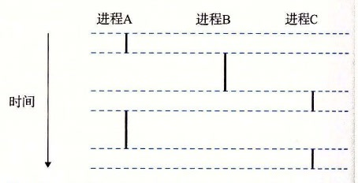

# 8.2.1 逻辑控制流

即使在系统中通常有许多其他程序在运行，进程也可以向每个程序提供一种假象，好像它在独占地使用处理器。如果想用调试器单步执行程序，我们会看到一系列的程序计数器（PC）的值，这些值唯一地对应于包含在程序的可执行目标文件中的指令，或是包含在运行时动态链接到程序的共享对象中的指令。这个 PC 值的序列叫做逻辑控制流，或者简称逻辑流。

考虑一个运行着三个进程的系统，如图 8-12 所示。处理器的一个物理控制流被分成了三个逻辑流，每个进程一个。每个竖直的条表示一个进程的逻辑流的一部分。在这个例子中，三个逻辑流的执行是交错的。

**图 8-12** 逻辑控制流。进程为每个程序提供了一种假象，好像程序在独占地使用处理器。每个竖直的条表示一个进程的逻辑控制流的一部分

进程 A 运行了一会儿，然后是进程 B 开始运行到完成。然后，进程 C 运行了一会儿，进程 A 接着运行直到完成。最后，进程 C 可以运行到结束了。

图 8-12 的关键点在于进程是轮流使用处理器的。每个进程执行它的流的一部分，然后被抢占（preempted）（暂时挂起），然后轮到其他进程。对于一个运行在这些进程之一的上下文中的程序，它看上去就像是在独占地使用处理器。唯一的反面例证是，如果我们精确地测量每条指令使用的时间，会发现在程序中一些指令的执行之间，CPU 好像会周期性地停顿。然而，每次处理器停顿，它随后会继续执行我们的程序，并不改变程序内存位置或寄存器的内容。
