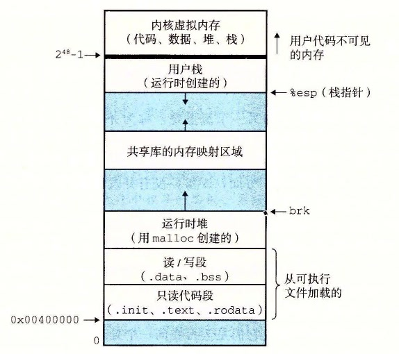

# 8.2.3 私有地址空间

进程也为每个程序提供一种假象，好像它独占地使用系统地址空间。在一台 n 位地址的机器上，地址空间是 2n 个可能地址的集合，0, 1, …, 2n − 1。进程为每个程序提供它自己的私有地址空间。一般而言，和这个空间中某个地址相关联的那个内存字节是不能被其他进程读或者写的，从这个意义上说，这个地址空间是私有的。

尽管和每个私有地址空间相关联的内存的内容一般是不同的，但是每个这样的空间都有相同的通用结构。比如，图 8-13 展示了一个 x86-64 Linux 进程的地址空间的组织结构。

地址空间底部是保留给用户程序的，包括通常的代码、数据、堆和栈段。代码段总是从地址 `0x400000` 开始。地址空间顶部保留给内核（操作系统常驻内存的部分）。地址空间的这个部分包含内核在代表进程执行指令时（比如当应用程序执行系统调用时）使用的代码、数据和栈。

**图 8-13** 进程地址空间
