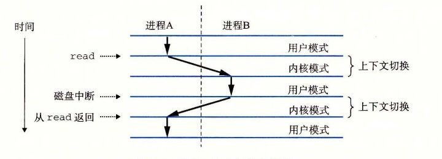

# 8.2.5 上下文切换

操作系统内核使用一种称为上下文切换（context switch）的较高层形式的异常控制流来实现多任务。上下文切换机制是建立在 8.1 节中已经讨论过的那些较低层异常机制之上的。

内核为每个进程维持一个上下文（context）。上下文就是内核重新启动一个被抢占的进程所需的状态。它由一些对象的值组成，这些对象包括通用目的寄存器、浮点寄存器、程序计数器、用户栈、状态寄存器、内核栈和各种内核数据结构，比如描述地址空间的页表、包含有关当前进程信息的进程表，以及包含进程已打开文件的信息的文件表。

在进程执行的某些时刻，内核可以决定抢占当前进程，并重新开始一个先前被抢占了的进程。这种决策就叫做调度（scheduling），是由内核中称为调度器（scheduler）的代码处理的。当内核选择一个新的进程运行时，我们说内核调度了这个进程。在内核调度了一个新的进程运行后，它就抢占当前进程，并使用一种称为上下文切换的机制来将控制转移到新的进程，上下文切换 1）保存当前进程的上下文，2）恢复某个先前被抢占的进程被保存的上下文，3）将控制传递给这个新恢复的进程。

当内核代表用户执行系统调用时，可能会发生上下文切换。如果系统调用因为等待某个事件发生而阻塞，那么内核可以让当前进程休眠，切换到另一个进程。比如，如果一个 `read` 系统调用需要访问磁盘，内核可以选择执行上下文切换，运行另外一个进程，而不是等待数据从磁盘到达。另一个示例是 `sleep` 系统调用，它显式地请求让调用进程休眠。一般而言，即使系统调用没有阻塞，内核也可以决定执行上下文切换，而不是将控制返回给调用进程。

中断也可能引发上下文切换。比如，所有的系统都有某种产生周期性定时器中断的机制，通常为每 1 毫秒或每 10 毫秒。每次发生定时器中断时，内核就能判定当前进程已经运行了足够长的时间，并切换到一个新的进程。

图 8-14 展示了一对进程 A 和 B 之间上下文切换的示例。在这个例子中，进程 A 初始运行在用户模式中，直到它通过执行系统调用 `read` 陷入到内核。内核中的陷阱处理程序请求来自磁盘控制器的 DMA 传输，并且安排在磁盘控制器完成从磁盘到内存的数据传输后，磁盘中断处理器。

**图 8-14** 进程上下文切换的剖析

磁盘取数据要用一段相对较长的时间（数量级为几十毫秒），所以内核执行从进程 A 到进程 B 的上下文切换，而不是在这个间歇时间内等待，什么都不做。注意在切换之前，内核正在代表进程 A 在用户模式下执行指令（即没有单独的内核进程）。在切换的第一部分中，内核代表进程 A 在内核模式下执行指令。然后在某一时刻，它开始代表进程 B（仍然是内核模式下）执行指令。在切换之后，内核代表进程 B 在用户模式下执行指令。

随后，进程 B 在用户模式下运行一会儿，直到磁盘发出一个中断信号，表示数据已经从磁盘传送到了内存。内核判定进程 B 已经运行了足够长的时间，就执行一个从进程 B 到进程 A 的上下文切换，将控制返回给进程 A 中紧随在系统调用 `read` 之后的那条指令。进程 A 继续运行，直到下一次异常发生，依此类推。
