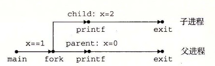
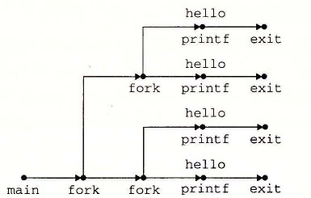

# 8.4.2 创建和终止进程

从程序员的角度，我们可以认为进程总是处于下面三种状态之一：

- **运行。** 进程要么在 CPU 上执行，要么在等待被执行且最终会被内核调度。
- **停止。** 进程的执行被挂起（suspended），且不会被调度。当收到 `SIGSTOP`、`SIGTSTP`、`SIGTTIN` 或者 `SIGTTOU` 信号时，进程就停止，并且保持停止直到它收到一个 `SIGCONT` 信号，在这个时刻，进程再次开始运行。（信号是一种软件中断的形式，将在 8.5 节中详细描述。）
- **终止。** 进程永远地停止了。进程会因为三种原因终止：1）收到一个信号，该信号的默认行为是终止进程，2）从主程序返回，3）调用 `exit` 函数。

```c
#include <stdlib.h>

void exit(int status);
```

**该函数不返回。**

`exit` 函数以 `status` 退出状态来终止进程（另一种设置退出状态的方法是从主程序中返回一个整数值）。

父进程通过调用 `fork` 函数创建一个新的运行的子进程。

```c
#include <sys/types.h>
#include <unistd.h>

pid_t fork(void);
```

**返回：** 子进程返回 0，父进程返回子进程的 PID，如果出错，则为 -1。

新创建的子进程几乎但不完全与父进程相同。子进程得到与父进程用户级虚拟地址空间相同的（但是独立的）一份副本，包括代码和数据段、堆、共享库以及用户栈。子进程还获得与父进程任何打开文件描述符相同的副本，这就意味着当父进程调用 `fork` 时，子进程可以读写父进程中打开的任何文件。父进程和新创建的子进程之间最大的区别在于它们有不同的 PID。

`fork` 函数是有趣的（也常常令人迷惑），因为它只被调用一次，却会返回两次：一次是在调用进程（父进程）中，一次是在新创建的子进程中。在父进程中，`fork` 返回子进程的 PID。在子进程中，`fork` 返回 0。因为子进程的 PID 总是为非零，返回值就提供一个明确的方法来分辨程序是在父进程还是在子进程中执行。

图 8-15 展示了一个使用 `fork` 创建子进程的父进程的示例。当 `fork` 调用在第 6 行返回时，在父进程和子进程中 `x` 的值都为 1。子进程在第 8 行加一并输出它的 `x` 的副本。相似地，父进程在第 13 行减一并输出它的 `x` 的副本。

`code/ecf/fork.c`

```c
int main()
{
    pid_t pid;
    int x = 1;

    pid = Fork();
    if (pid == 0) {  /* Child */
        printf("child : x=%d\n", ++x);
        exit(0);
    }

    /* Parent */
    printf("parent: x=%d\n", --x);
    exit(0);
}
```

**图 8-15** 使用 `fork` 创建一个新进程

当在 Unix 系统上运行这个程序时，我们得到下面的结果：

```text
linux> ./fork
parent: x=0
child : x=2
```

这个简单的例子有一些微妙的方面。

- **调用一次，返回两次。** `fork` 函数被父进程调用一次，但是却返回两次——一次是返回到父进程，一次是返回到新创建的子进程。对于只创建一个子进程的程序来说，这还是相当简单直接的。但是具有多个 `fork` 实例的程序可能就会令人迷惑，需要仔细地推敲了。
- **并发执行。** 父进程和子进程是并发运行的独立进程。内核能够以任意方式交替执行它们的逻辑控制流中的指令。在我们的系统上运行这个程序时，父进程先完成它的 `printf` 语句，然后是子进程。然而，在另一个系统上可能正好相反。一般而言，作为程序员，我们决不能对不同进程中指令的交替执行做任何假设。
- **相同但是独立的地址空间。** 如果能够在 `fork` 函数在父进程和子进程中返回后立即暂停这两个进程，我们会看到两个进程的地址空间都是相同的。每个进程有相同的用户栈、相同的本地变量值、相同的堆、相同的全局变量值，以及相同的代码。因此，在我们的示例程序中，当 `fork` 函数在第 6 行返回时，本地变量 `x` 在父进程和子进程中都为 1。然而，因为父进程和子进程是独立的进程，它们都有自己的私有地址空间。后面，父进程和子进程对 `x` 所做的任何改变都是独立的，不会反映在另一个进程的内存中。这就是为什么当父进程和子进程调用它们各自的 `printf` 语句时，它们中的变量 `x` 会有不同的值。
- **共享文件。** 当运行这个示例程序时，我们注意到父进程和子进程都把它们的输出显示在屏幕上。原因是子进程继承了父进程所有的打开文件。当父进程调用 `fork` 时，`stdout` 文件是打开的，并指向屏幕。子进程继承了这个文件，因此它的输出也是指向屏幕的。

如果你是第一次学习 `fork` 函数，画进程图通常会有所帮助，进程图是刻画程序语句的偏序的一种简单的前趋图。每个顶点 a 对应于一条程序语句的执行。有向边 a→b 表示语句 a 发生在语句 b 之前。边上可以标记出一些信息，例如一个变量的当前值。对应于 `printf` 语句的顶点可以标记上 `printf` 的输出。每张图从一个顶点开始，对应于调用 `main` 的父进程。这个顶点没有入边，并且只有一个出边。每个进程的顶点序列结束于一个对应于 `exit` 调用的顶点。这个顶点只有一条入边，没有出边。

例如，图 8-16 展示了图 8-15 中示例程序的进程图。初始时，父进程将变量 `x` 设置为 1。父进程调用 `fork`，创建一个子进程，它在自己的私有地址空间中与父进程并发执行。



**图 8-16** 图 8-15 中示例程序的进程图

对于运行在单处理器上的程序，对应进程图中所有顶点的拓扑排序（topological sort）表示程序中语句的一个可行的全序排列。下面是一个理解拓扑排序概念的简单方法：给定进程图中顶点的一个排列，把顶点序列从左到右写成一行，然后画出每条有向边。排列是一个拓扑排序，当且仅当画出的每条边的方向都是从左往右的。因此，在图 8-15 的示例程序中，父进程和子进程的 `printf` 语句可以以任意先后顺序执行，因为每种顺序都对应于图顶点的某种拓扑排序。

进程图特别有助于理解带有嵌套 `fork` 调用的程序。例如，图 8-17 中的程序源码中两次调用了 `fork`。对应的进程图可帮助我们看清这个程序运行了四个进程，每个都调用了一次 `printf`，这些 `printf` 可以以任意顺序执行。

```c
int main()
{
    Fork();
    Fork();
    printf("hello\n");
    exit(0);
}
```



**图 8-17** 嵌套 `fork` 的进程图

> **练习题 8.2** 考虑下面的程序：
>
> `code/ecf/forkprob0.c`
>
> ```c
> int main()
> {
>     int x = 1;
>
>     if (Fork() == 0)
>         printf("p1: x=%d\n", ++x);
>     printf("p2: x=%d\n", --x);
>     exit(0);
> }
> ```
>
> A. 子进程的输出是什么？
>
> B. 父进程的输出是什么？
