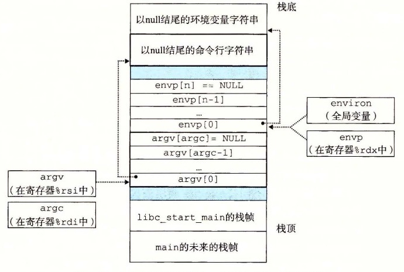

# 8.4.5 加载并运行程序

`execve` 函数在当前进程的上下文中加载并运行一个新程序。

```c
#include <unistd.h>

int execve(const char *filename, const char *argv[],
           const char *envp[]);
```

**返回：** 如果成功，则不返回，如果错误，则返回 -1。

`execve` 函数加载并运行可执行目标文件 `filename`，且带参数列表 `argv` 和环境变量列表 `envp`。只有当出现错误时，例如找不到 `filename`，`execve` 才会返回到调用程序。所以，与 `fork` 一次调用返回两次不同，`execve` 调用一次并从不返回。

参数列表是用图 8-20 中的数据结构表示的。`argv` 变量指向一个以 null 结尾的指针数组，其中每个指针都指向一个参数字符串。按照惯例，`argv[0]` 是可执行目标文件的名字。

| `argv` 指向的 `argv[]` 元素 | 元素指向的参数字符串 |
|---|---|
| `argv[0]` | `"ls"` |
| `argv[1]` | `"-lt"` |
| `...` | `...` |
| `argv[argc - 1]` | `"/user/include"` |
| `NULL` |  |

**图 8-20** 参数列表的组织结构

环境变量的列表是由一个类似的数据结构表示的，如图 8-21 所示。`envp` 变量指向一个以 null 结尾的指针数组，其中每个指针指向一个环境变量字符串，每个串都是形如 `"name=value"` 的名字-值对。

| `envp` 指向的 `envp[]` 元素 | 元素指向的环境变量字符串 |
|---|---|
| `envp[0]` | `"PWD=/usr/droh"` |
| `envp[1]` | `"PRINTER=iron"` |
| `...` | `...` |
| `envp[n - 1]` | `"USER=droh"` |
| `NULL` |  |

**图 8-21** 环境变量列表的组织结构

在 `execve` 加载了 `filename` 之后，它调用 7.9 节中描述的启动代码。启动代码设置栈，并将控制传递给新程序的主函数，该主函数有如下形式的原型

```c
int main(int argc, char **argv, char **envp);
```

或者等价的

```c
int main(int argc, char *argv[], char *envp[]);
```

当 `main` 开始执行时，用户栈的组织结构如图 8-22 所示。让我们从栈底（高地址）往栈顶（低地址）依次看一看。首先是参数和环境字符串。栈往上紧随其后的是以 null 结尾的指针数组，其中每个指针都指向栈中的一个环境变量字符串。全局变量 `environ` 指向这些指针中的第一个 `envp[0]`。紧随环境变量数组之后的是以 null 结尾的 `argv[]` 数组，其中每个元素都指向栈中的一个参数字符串。在栈的顶部是系统启动函数 `libc_start_main`（见 7.9 节）的栈帧。



**图 8-22** 一个新程序开始时，用户栈的典型组织结构

`main` 函数有 3 个参数：1）`argc`，它给出 `argv[]` 数组中非空指针的数量，2）`argv`，指向 `argv[]` 数组中的第一个条目，3）`envp`，指向 `envp[]` 数组中的第一个条目。

Linux 提供了几个函数来操作环境数组：

```c
#include <stdlib.h>

char *getenv(const char *name);
```

**返回：** 若存在则为指向 `name` 的指针，若无匹配的，则为 `NULL`。

`getenv` 函数在环境数组中搜索字符串 `"name=value"`。如果找到了，它就返回一个指向 `value` 的指针，否则它就返回 `NULL`。

```c
#include <stdlib.h>

int setenv(const char *name, const char *newvalue, int overwrite);
```

**返回：** 若成功则为 0，若错误则为 -1。

```c
void unsetenv(const char *name);
```

**返回：** 无。

如果环境数组包含一个形如 `"name=oldvalue"` 的字符串，那么 `unsetenv` 会删除它，而 `setenv` 会用 `newvalue` 代替 `oldvalue`，但是只有在 `overwrite` 非零时才会这样。如果 `name` 不存在，那么 `setenv` 就把 `"name=newvalue"` 添加到数组中。

> **旁注 程序与进程**
>
> 这是一个适当的地方，停下来，确认一下你理解了程序和进程之间的区别。程序是一堆代码和数据；程序可以作为目标文件存在于磁盘上，或者作为段存在于地址空间中。进程是执行中程序的一个具体的实例；程序总是运行在某个进程的上下文中。如果你想要理解 `fork` 和 `execve` 函数，理解这个差异是很重要的。`fork` 函数在新的子进程中运行相同的程序，新的子进程是父进程的一个复制品。`execve` 函数在当前进程的上下文中加载并运行一个新的程序。它会覆盖当前进程的地址空间，但并没有创建一个新进程。新的程序仍然有相同的 PID，并且继承了调用 `execve` 函数时已打开的所有文件描述符。

> **练习题 8.6** 编写一个叫做 `myecho` 的程序，打印出它的命令行参数和环境变量。例如：
>
> ```text
> linux> ./myecho arg1 arg2
> Command-line arguments:
>     argv[ 0]: myecho
>     argv[ 1]: arg1
>     argv[ 2]: arg2
> Environment variables:
>     envp[ 0]: PWD=/usr0/droh/ics/code/ecf
>     envp[ 1]: TERM=emacs
>     ...
>     envp[25]: USER=droh
>     envp[26]: SHELL=/usr/local/bin/tcsh
>     envp[27]: HOME=/usr0/droh
> ```
