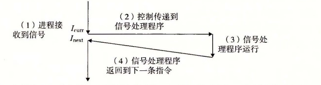

# 8.5.1 信号术语

传送一个信号到目的进程是由两个不同步骤组成的：

- **发送信号。** 内核通过更新目的进程上下文中的某个状态，发送（递送）一个信号给目的进程。发送信号可以有如下两种原因：1）内核检测到一个系统事件，比如除零错误或者子进程终止。2）一个进程调用了 kill 函数（在下一节中讨论），显式地要求内核发送一个信号给目的进程。一个进程可以发送信号给它自己。
- **接收信号。** 当目的进程被内核强迫以某种方式对信号的发送做出反应时，它就接收了信号。进程可以忽略这个信号，终止或者通过执行一个称为信号处理程序（signal handler）的用户层函数捕获这个信号。图 8-27 给出了信号处理程序捕获信号的基本思想。

**图 8-27** 信号处理。接收到信号会触发控制转移到信号处理程序。在信号处理程序完成处理之后，它将控制返回给被中断的程序

一个发出而没有被接收的信号叫做待处理信号（pending signal）。在任何时刻，一种类型至多只会有一个待处理信号。如果一个进程有一个类型为 k 的待处理信号，那么任何接下来发送到这个进程的类型为 k 的信号都不会排队等待；它们只是被简单地丢弃。一个进程可以有选择性地阻塞接收某种信号。当一种信号被阻塞时，它仍可以被发送，但是产生的待处理信号不会被接收，直到进程取消对这种信号的阻塞。

一个待处理信号最多只能被接收一次。内核为每个进程在 pending 位向量中维护着待处理信号的集合，而在 blocked 位向量①中维护着被阻塞的信号集合。只要传送了一个类型为 k 的信号，内核就会设置 pending 中的第 k 位，而只要接收了一个类型为 k 的信号，内核就会清除 pending 中的第 k 位。

> ① 也称为信号掩码（signal mask）。
