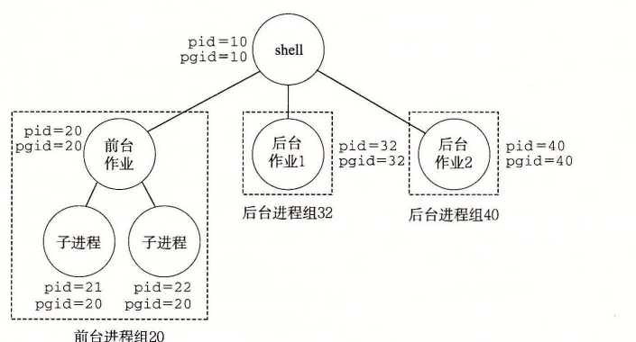

# 8.5.2 发送信号

Unix 系统提供了大量向进程发送信号的机制。所有这些机制都是基于进程组（process group）这个概念的。

## 1. 进程组

每个进程都只属于一个进程组，进程组是由一个正整数进程组 ID 来标识的。`getpgrp` 函数返回当前进程的进程组 ID：

```c
#include <unistd.h>

pid_t getpgrp(void);
```

**返回：** 调用进程的进程组 ID。

默认地，一个子进程和它的父进程同属于一个进程组。一个进程可以通过使用 `setpgid` 函数来改变自己或者其他进程的进程组：

```c
#include <unistd.h>

int setpgid(pid_t pid, pid_t pgid);
```

**返回：** 若成功则为 0，若错误则为 -1。

`setpgid` 函数将进程 `pid` 的进程组改为 `pgid`。如果 `pid` 是 0，那么就使用当前进程的 PID。如果 `pgid` 是 0，那么就用 `pid` 指定的进程的 PID 作为进程组 ID。例如，如果进程 15213 是调用进程，那么

```c
setpgid(0, 0);
```

会创建一个新的进程组，其进程组 ID 是 15213，并且把进程 15213 加入到这个新的进程组中。

## 2. 用 /bin/kill 程序发送信号

`/bin/kill` 程序可以向另外的进程发送任意的信号。比如，命令

```text
linux> /bin/kill -9 15213
```

发送信号 9（SIGKILL）给进程 15213。一个为负的 PID 会导致信号被发送到进程组 PID 中的每个进程。比如，命令

```text
linux> /bin/kill -9 -15213
```

发送一个 SIGKILL 信号给进程组 15213 中的每个进程。注意，在此我们使用完整路径 `/bin/kill`，因为有些 Unix shell 有自己内置的 kill 命令。

## 3. 从键盘发送信号

Unix shell 使用作业（job）这个抽象概念来表示为对一条命令行求值而创建的进程。在任何时刻，至多只有一个前台作业和 0 个或多个后台作业。比如，键入

```text
linux> ls | sort
```

会创建一个由两个进程组成的前台作业，这两个进程是通过 Unix 管道连接起来的：一个进程运行 `ls` 程序，另一个运行 `sort` 程序。shell 为每个作业创建一个独立的进程组。进程组 ID 通常取自作业中父进程中的一个。比如，图 8-28 展示了有一个前台作业和两个后台作业的 shell。前台作业中的父进程 PID 为 20，进程组 ID 也为 20。父进程创建两个子进程，每个也都是进程组 20 的成员。



**图 8-28** 前台和后台进程组

在键盘上输入 Ctrl+C 会导致内核发送一个 SIGINT 信号到前台进程组中的每个进程。默认情况下，结果是终止前台作业。类似地，输入 Ctrl+Z 会发送一个 SIGTSTP 信号到前台进程组中的每个进程。默认情况下，结果是停止（挂起）前台作业。

## 4. 用 kill 函数发送信号

进程通过调用 `kill` 函数发送信号给其他进程（包括它们自己）。

```c
#include <sys/types.h>
#include <signal.h>

int kill(pid_t pid, int sig);
```

**返回：** 若成功则为 0，若错误则为 -1。

如果 `pid` 大于零，那么 `kill` 函数发送信号号码 `sig` 给进程 `pid`。如果 `pid` 等于零，那么 `kill` 发送信号 `sig` 给调用进程所在进程组中的每个进程，包括调用进程自己。如果 `pid` 小于零，`kill` 发送信号 `sig` 给进程组 |`pid`|（`pid` 的绝对值）中的每个进程。图 8-29 展示了一个示例，父进程用 `kill` 函数发送 SIGKILL 信号给它的子进程。

`code/ecf/kill.c`

```c
#include "csapp.h"

int main()
{
    pid_t pid;

    /* Child sleeps until SIGKILL signal received, then dies */
    if ((pid = Fork()) == 0) {
        pause(); /* Wait for a signal to arrive */
        printf("control should never reach here!\n");
        exit(0);
    }

    /* Parent sends a SIGKILL signal to a child */
    Kill(pid, SIGKILL);
    exit(0);
}
```

**图 8-29** 使用 kill 函数发送信号给子进程

## 5. 用 alarm 函数发送信号

进程可以通过调用 `alarm` 函数向它自己发送 SIGALRM 信号。

```c
#include <unistd.h>

unsigned int alarm(unsigned int secs);
```

**返回：** 前一次闹钟剩余的秒数，若以前没有设定闹钟，则为 0。

`alarm` 函数安排内核在 `secs` 秒后发送一个 SIGALRM 信号给调用进程。如果 `secs` 是零，那么不会调度安排新的闹钟（alarm）。在任何情况下，对 `alarm` 的调用都将取消任何待处理的（pending）闹钟，并且返回任何待处理的闹钟在被发送前还剩下的秒数（如果这次对 `alarm` 的调用没有取消它的话）；如果没有任何待处理的闹钟，就返回零。
