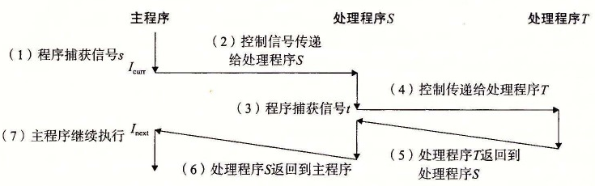

# 8.5.3 接收信号

当内核把进程 p 从内核模式切换到用户模式时（例如，从系统调用返回或是完成了一次上下文切换），它会检查进程 p 的未被阻塞的待处理信号的集合（`pending & ~blocked`）。如果这个集合为空（通常情况下），那么内核将控制传递到 p 的逻辑控制流中的下一条指令（I<sub>next</sub>）。然而，如果集合是非空的，那么内核选择集合中的某个信号 k（通常是最小的 k），并且强制 p 接收信号 k。收到这个信号会触发进程采取某种行为。一旦进程完成了这个行为，那么控制就传递回 p 的逻辑控制流中的下一条指令（I<sub>next</sub>）。每个信号类型都有一个预定义的默认行为，是下面中的一种：

- 进程终止。
- 进程终止并转储内存。
- 进程停止（挂起）直到被 SIGCONT 信号重启。
- 进程忽略该信号。

图 8-26 展示了与每个信号类型相关联的默认行为。比如，收到 SIGKILL 的默认行为就是终止接收进程。另外，接收到 SIGCHLD 的默认行为就是忽略这个信号。进程可以通过使用 `signal` 函数修改和信号相关联的默认行为。唯一的例外是 SIGSTOP 和 SIGKILL，它们的默认行为是不能修改的。

```c
#include <signal.h>

typedef void (*sighandler_t)(int);

sighandler_t signal(int signum, sighandler_t handler);
```

**返回：** 若成功则为指向前次处理程序的指针，若出错则为 `SIG_ERR`（不设置 `errno`）。

`signal` 函数可以通过下列三种方法之一来改变和信号 `signum` 相关联的行为：

- 如果 `handler` 是 `SIG_IGN`，那么忽略类型为 `signum` 的信号。
- 如果 `handler` 是 `SIG_DFL`，那么类型为 `signum` 的信号行为恢复为默认行为。
- 否则，`handler` 就是用户定义的函数的地址，这个函数被称为信号处理程序，只要进程接收到一个类型为 `signum` 的信号，就会调用这个程序。通过把处理程序的地址传递到 `signal` 函数从而改变默认行为，这叫做设置信号处理程序（installing the handler）。调用信号处理程序被称为捕获信号。执行信号处理程序被称为处理信号。

当一个进程捕获了一个类型为 k 的信号时，会调用为信号 k 设置的处理程序，一个整数参数被设置为 k。这个参数允许同一个处理函数捕获不同类型的信号。

当处理程序执行它的 `return` 语句时，控制（通常）传递回控制流中进程被信号接收中断位置处的指令。我们说“通常”是因为在某些系统中，被中断的系统调用会立即返回一个错误。

图 8-30 展示了一个程序，它捕获用户在键盘上输入 Ctrl+C 时发送的 SIGINT 信号。SIGINT 的默认行为是立即终止该进程。在这个示例中，我们将默认行为修改为捕获信号，输出一条消息，然后终止该进程。

`code/ecf/sigint.c`

```c
#include "csapp.h"

void sigint_handler(int sig) /* SIGINT handler */
{
    printf("Caught SIGINT!\n");
    exit(0);
}

int main()
{
    /* Install the SIGINT handler */
    if (signal(SIGINT, sigint_handler) == SIG_ERR)
        unix_error("signal error");

    pause(); /* Wait for the receipt of a signal */

    return 0;
}
```

**图 8-30** 一个用信号处理程序捕获 SIGINT 信号的程序

信号处理程序可以被其他信号处理程序中断，如图 8-31 所示。在这个例子中，主程序捕获到信号 s，该信号会中断主程序，将控制转移到处理程序 S。S 在运行时，程序捕获信号 t≠s，该信号会中断 S，控制转移到处理程序 T。当 T 返回时，S 从它被中断的地方继续执行。最后，S 返回，控制传送回主程序，主程序从它被中断的地方继续执行。



**图 8-31** 信号处理程序可以被其他信号处理程序中断

**练习题 8.7** 编写一个叫做 `snooze` 的程序，它有一个命令行参数，用这个参数调用练习题 8.5 中的 `snooze` 函数，然后终止。编写程序，使得用户可以通过在键盘上输入 Ctrl+C 中断 `snooze` 函数。比如：

```text
linux> ./snooze 5
CTRL+C
Slept for 3 of 5 secs.
linux>
```

> User hits Ctrl+C after 3 seconds
