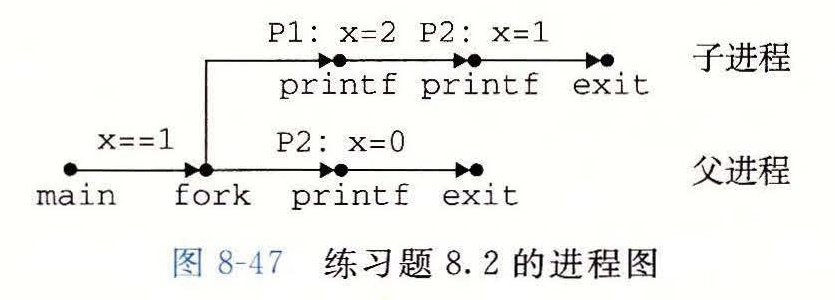
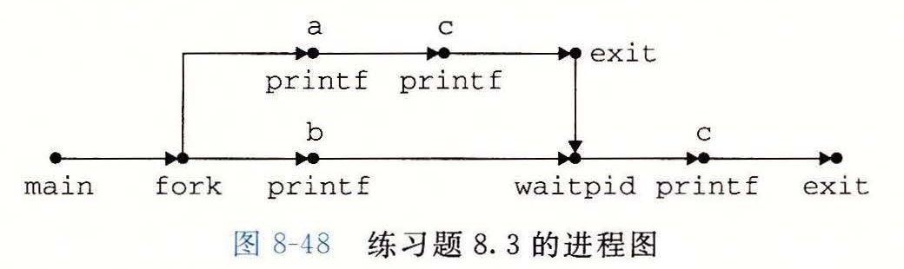
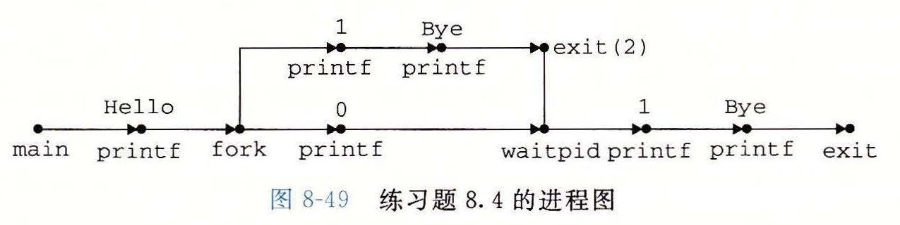

# 练习题答案

## 练习题 8.1

进程 A 和 B 是互相并发的，就像 B 和 C 一样，因为它们各自的执行是重叠的，也就是一个进程在另一个进程结束前开始。进程 A 和 C 不是并发的，因为它们的执行没有重叠；A 在 C 开始之前就结束了。

## 练习题 8.2

在图 8-15 的示例程序中，父子进程执行无关的指令集合。然而，在这个程序中，父子进程执行的指令集合是相关的，这是有可能的，因为父子进程有相同的代码段。这会是一个概念上的障碍，所以请确认你理解了本题的答案。图 8-47 给出了进程图。

A. 这里的关键点是子进程执行了两个 `printf` 语句。在 `fork` 返回之后，它执行第 6 行的 `printf`。然后它从 `if` 语句中出来，执行第 7 行的 `printf` 语句。下面是子进程产生的输出：

```text
p1: x=2
p2: x=1
```

B. 父进程只执行第 7 行的 `printf`：

```text
p2: x=0
```



## 练习题 8.3

我们知道序列 acbc、abcc 和 bacc 是可能的，因为它们对应有进程图的拓扑排序（图 8-48）。而像 bcac 和 cbca 这样的序列不对应有任何拓扑排序，因此它们是不可行的。



## 练习题 8.4

A. 只简单地计算进程图（图 8-49）中 `printf` 顶点的个数就能确定输出行数。在这里，有 6 个这样的顶点，因此程序会打印 6 行输出。

B. 任何对应有进程图的拓扑排序的输出序列都是可能的。例如：Hello、1、0、Bye、2、Bye 是可能的。



## 练习题 8.5

`code/ecf/snooze.c`

```c
unsigned int snooze(unsigned int secs) {
    unsigned int rc = sleep(secs);

    printf("Slept for %d of %d secs.\n", secs-rc, secs);
    return rc;
}
```

## 练习题 8.6

`code/ecf/myecho.c`

```c
#include "csapp.h"

int main(int argc, char *argv[], char *envp[])
{
    int i;

    printf("Command-line arguments:\n");
    for (i=0; argv[i] != NULL; i++)
        printf("    argv[%2d]: %s\n", i, argv[i]);

    printf("\n");
    printf("Environment variables:\n");
    for (i=0; envp[i] != NULL; i++)
        printf("    envp[%2d]: %s\n", i, envp[i]);

    exit(0);
}
```

## 练习题 8.7

只要休眠进程收到一个未被忽略的信号，`sleep` 函数就会提前返回。但是，因为收到一个 SIGINT 信号的默认行为就是终止进程（图 8-26），我们必须设置一个 SIGINT 处理程序来允许 `sleep` 函数返回。处理程序简单地捕获 SIGNAL，并将控制返回给 `sleep` 函数，该函数会立即返回。

`code/ecf/snooze.c`

```c
#include "csapp.h"

/* SIGINT handler */
void handler(int sig)
{
    return; /* Catch the signal and return */
}

unsigned int snooze(unsigned int secs) {
    unsigned int rc = sleep(secs);

    printf("Slept for %d of %d secs.\n", secs-rc, secs);
    return rc;
}

int main(int argc, char **argv) {

    if (argc != 2) {
        fprintf(stderr, "usage: %s <secs>\n", argv[0]);
        exit(0);
    }

    if (signal(SIGINT, handler) == SIG_ERR) /* Install SIGINT */
        unix_error("signal error\n");      /* handler        */
    (void)snooze(atoi(argv[1]));
    exit(0);
}
```

## 练习题 8.8

这个程序打印字符串“213”，这是卡内基-梅隆大学 CS: APP 课程的缩写名。父进程开始时打印“2”，然后创建子进程，子进程会陷入一个无限循环。然后父进程向子进程发送一个信号，并等待它终止。子进程捕获这个信号（中断这个无限循环），对计数器值（从初始值 2）减一，打印“1”，然后终止。在父进程回收子进程之后，它对计数器值（从初始值 2）加一，打印“3”，并且终止。
