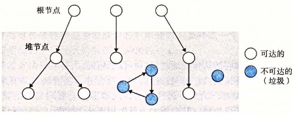
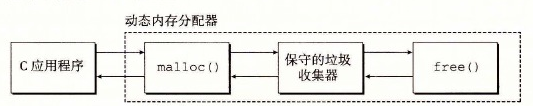

# 9.10.1 垃圾收集器的基本知识

垃圾收集器将内存视为一张有向可达图（reachability graph），其形式如图 9-49 所示。该图的节点被分成一组根节点（root node）和一组堆节点（heap node）。每个堆节点对应于堆中的一个已分配块。有向边 p→q 意味着块 p 中的某个位置指向块 q 中的某个位置。根节点对应于这样一种不在堆中的位置，它们中包含指向堆中的指针。这些位置可以是寄存器、栈里的变量，或者是虚拟内存中读写数据区域内的全局变量。

**图 9-49** 垃圾收集器将内存视为一张有向图

当存在一条从任意根节点出发并到达 p 的有向路径时，我们说节点 p 是可达的（reachable）。在任何时刻，不可达节点对应于垃圾，是不能被应用再次使用的。垃圾收集器的角色是维护可达图的某种表示，并通过释放不可达节点且将它们返回给空闲链表，来定期地回收它们。

像 ML 和 Java 这样的语言的垃圾收集器，对应用如何创建和使用指针有很严格的控制，能够维护可达图的一种精确的表示，因此也就能够回收所有垃圾。然而，诸如 C 和 C++ 这样的语言的收集器通常不能维持可达图的精确表示。这样的收集器也叫做保守的垃圾收集器（conservative garbage collector）。从某种意义上来说它们是保守的，即每个可达块都被正确地标记为可达了，而一些不可达节点却可能被错误地标记为可达。

收集器可以按需提供它们的服务，或者它们可以作为一个和应用并行的独立线程，不断地更新可达图和回收垃圾。例如，考虑如何将一个 C 程序的保守的收集器加入到已存在的 `malloc` 包中，如图 9-50 所示。

**图 9-50** 将一个保守的垃圾收集器加入到 C 的 `malloc` 包中

无论何时需要堆空间时，应用都会用通常的方式调用 `malloc`。如果 `malloc` 找不到一个合适的空闲块，那么它就调用垃圾收集器，希望能够回收一些垃圾到空闲链表。收集器识别出垃圾块，并通过调用 `free` 函数将它们返回给堆。关键的思想是收集器代替应用去调用 `free`。当对收集器的调用返回时，`malloc` 重试，试图发现一个合适的空闲块。如果还是失败了，那么它就会向操作系统要求额外的内存。最后，`malloc` 返回一个指向请求块的指针（如果成功）或者返回一个空指针（如果不成功）。
