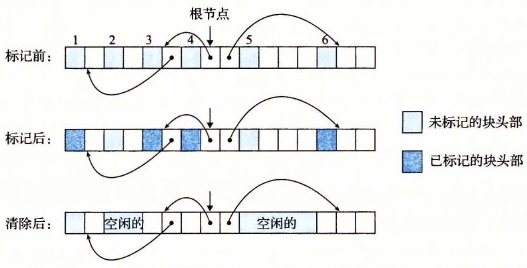

# 9.10.2 Mark & Sweep 垃圾收集器

Mark&Sweep 垃圾收集器由标记（mark）阶段和清除（sweep）阶段组成，标记阶段标记出根节点的所有可达的和已分配的后继，而后面的清除阶段释放每个未被标记的已分配块。块头部中空闲的低位中的一位通常用来表示这个块是否被标记了。

我们对 Mark&Sweep 的描述将假设使用下列函数，其中 `ptr` 定义为 `typedef void *ptr`：

- `ptr isPtr(ptr p)`。如果 `p` 指向一个已分配块中的某个字，那么就返回一个指向这个块的起始位置的指针 `b`。否则返回 `NULL`。
- `int blockMarked(ptr b)`。如果块 `b` 是已标记的，那么就返回 `true`。
- `int blockAllocated(ptr b)`。如果块 `b` 是已分配的，那么就返回 `true`。
- `void markBlock(ptr b)`。标记块 `b`。
- `int length(b)`。返回块 `b` 的以字为单位的长度（不包括头部）。
- `void unmarkBlock(ptr b)`。将块 `b` 的状态由已标记的改为未标记的。
- `ptr nextBlock(ptr b)`。返回堆中块 `b` 的后继。

标记阶段为每个根节点调用一次图 9-51a 所示的 `mark` 函数。如果 `p` 不指向一个已分配并且未标记的堆块，`mark` 函数就立即返回。否则，它就标记这个块，并对块中的每个字递归地调用它自己。每次对 `mark` 函数的调用都标记某个根节点的所有未标记并且可达的后继节点。在标记阶段的末尾，任何未标记的已分配块都被认定为是不可达的，是垃圾，可以在清除阶段回收。

清除阶段是对图 9-51b 所示的 `sweep` 函数的一次调用。`sweep` 函数在堆中每个块上反复循环，释放它所遇到的所有未标记的已分配块（也就是垃圾）。

图 9-52 展示了一个小堆的 Mark&Sweep 的图形化解释。块边界用粗线条表示。每个方块对应于内存中的一个字。每个块有一个字的头部，要么是已标记的，要么是未标记的。

```c
void mark(ptr p) {
    if ((b = isPtr(p)) == NULL)
        return;
    if (blockMarked(b))
        return;
    markBlock(b);
    len = length(b);
    for (i = 0; i < len; i++)
        mark(b[i]);
    return;
}
```

**a) `mark` 函数**

```c
void sweep(ptr b, ptr end) {
    while (b < end) {
        if (blockMarked(b))
            unmarkBlock(b);
        else if (blockAllocated(b))
            free(b);
        b = nextBlock(b);
    }
    return;
}
```

**b) `sweep` 函数**

**图 9-51** `mark` 和 `sweep` 函数的伪代码



**图 9-52** Mark&Sweep 示例。注意这个示例中的箭头表示内存引用，而不是空闲链表指针

初始情况下，图 9-52 中的堆由六个已分配块组成，其中每个块都是未分配的。第 3 块包含一个指向第 1 块的指针。第 4 块包含指向第 3 块和第 6 块的指针。根指向第 4 块。在标记阶段之后，第 1 块、第 3 块、第 4 块和第 6 块被做了标记，因为它们是从根节点可达的。第 2 块和第 5 块是未标记的，因为它们是不可达的。在清除阶段之后，这两个不可达块被回收到空闲链表。
