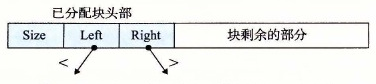

# 9.10.3 C 程序的保守 Mark & Sweep

Mark&Sweep 对 C 程序的垃圾收集是一种合适的方法，因为它可以就地工作，而不需要移动任何块。然而，C 语言为 `isPtr` 函数的实现造成了一些有趣的挑战。

第一，C 不会用任何类型信息来标记内存位置。因此，对 `isPtr` 没有一种明显的方式来判断它的输入参数 `p` 是不是一个指针。第二，即使我们知道 `p` 是一个指针，对 `isPtr` 也没有明显的方式来判断 `p` 是否指向一个已分配块的有效载荷中的某个位置。

对后一问题的解决方法是将已分配块集合维护成一棵平衡二叉树，这棵树保持着这样一个属性：左子树中的所有块都放在较小的地址处，而右子树中的所有块都放在较大的地址处。如图 9-53 所示，这就要求每个已分配块的头部里有两个附加字段（`left` 和 `right`）。每个字段指向某个已分配块的头部。`isPtr(ptr p)` 函数用树来执行对已分配块的二分查找。在每一步中，它依赖于块头部中的大小字段来判断 `p` 是否落在这个块的范围之内。

**图 9-53** 一棵已分配块的平衡树中的左右指针

平衡树方法保证会标记所有从根节点可达的节点，从这个意义上来说它是正确的。这是一个必要的保证，因为应用程序的用户当然不会喜欢把他们的已分配块过早地返回给空闲链表。然而，这种方法从某种意义上而言又是保守的，因为它可能不正确地标记实际上不可达的块，因此它可能不会释放某些垃圾。虽然这并不影响应用程序的正确性，但是这可能导致不必要的外部碎片。

C 程序的 Mark & Sweep 收集器必须是保守的，其根本原因是 C 语言不会用类型信息来标记内存位置。因此，像 `int` 或者 `float` 这样的标量可以伪装成指针。例如，假设某个可达的已分配块在它的有效载荷中包含一个 `int`，其值碰巧对应于某个其他已分配块 `b` 的有效载荷中的一个地址。对收集器而言，是没有办法推断出这个数据实际上是 `int` 而不是指针。因此，分配器必须保守地将块 `b` 标记为可达，尽管事实上它可能是不可达的。
