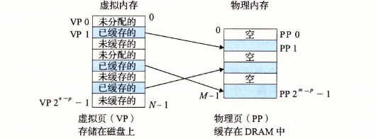

# 9.3 虚拟内存作为缓存的工具

概念上而言，虚拟内存被组织为一个由存放在磁盘上的 N 个连续的字节大小的单元组成的数组。每字节都有一个唯一的虚拟地址，作为到数组的索引。磁盘上数组的内容被缓存在主存中。和存储器层次结构中其他缓存一样，磁盘（较低层）上的数据被分割成块，这些块作为磁盘和主存（较高层）之间的传输单元。VM 系统通过将虚拟内存分割为称为虚拟页（Virtual Page，VP）的大小固定的块来处理这个问题。每个虚拟页的大小为 P=2p 字节。类似地，物理内存被分割为物理页（Physical Page，PP），大小也为 P 字节（物理页也被称为页帧（page frame））。

在任意时刻，虚拟页面的集合都分为三个不相交的子集：

- **未分配的：** VM 系统还未分配（或者创建）的页。未分配的块没有任何数据和它们相关联，因此也就不占用任何磁盘空间。
- **缓存的：** 当前已缓存在物理内存中的已分配页。
- **未缓存的：** 未缓存在物理内存中的已分配页。

图 9-3 的示例展示了一个有 8 个虚拟页的小虚拟内存。虚拟页 0 和 3 还没有被分配，因此在磁盘上还不存在。虚拟页 1、4 和 6 被缓存在物理内存中。页 2、5 和 7 已经被分配了，但是当前并未缓存在主存中。

**图 9-3** 一个 VM 系统是如何使用主存作为缓存的
