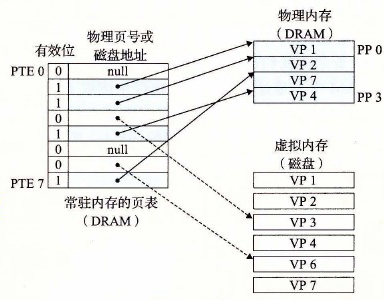

# 9.3.2 页表

同任何缓存一样，虚拟内存系统必须有某种方法来判定一个虚拟页是否缓存在 DRAM 中的某个地方。如果是，系统还必须确定这个虚拟页存放在哪个物理页中。如果不命中，系统必须判断这个虚拟页存放在磁盘的哪个位置，在物理内存中选择一个牺牲页，并将虚拟页从磁盘复制到 DRAM 中，替换这个牺牲页。

这些功能是由软硬件联合提供的，包括操作系统软件、MMU（内存管理单元）中的地址翻译硬件和一个存放在物理内存中叫做页表（page table）的数据结构，页表将虚拟页映射到物理页。每次地址翻译硬件将一个虚拟地址转换为物理地址时，都会读取页表。操作系统负责维护页表的内容，以及在磁盘与 DRAM 之间来回传送页。

图 9-4 展示了一个页表的基本组织结构。页表就是一个页表条目（Page Table Entry，PTE）的数组。虚拟地址空间中的每个页在页表中一个固定偏移量处都有一个 PTE。为了我们的目的，我们将假设每个 PTE 是由一个有效位（valid bit）和一个 n 位地址字段组成的。有效位表明了该虚拟页当前是否被缓存在 DRAM 中。如果设置了有效位，那么地址字段就表示 DRAM 中相应的物理页的起始位置，这个物理页中缓存了该虚拟页。如果没有设置有效位，那么一个空地址表示这个虚拟页还未被分配。否则，这个地址就指向该虚拟页在磁盘上的起始位置。

**图 9-4** 页表

图 9-4 中的示例展示了一个有 8 个虚拟页和 4 个物理页的系统的页表。四个虚拟页（VP 1、VP 2、VP 4 和 VP 7）当前被缓存在 DRAM 中。两个页（VP 0 和 VP 5）还未被分配，而剩下的页（VP 3 和 VP 6）已经被分配了，但是当前还未被缓存。图 9-4 中有一个要点要注意，因为 DRAM 缓存是全相联的，所以任意物理页都可以包含任意虚拟页。

> **练习题 9.2** 确定下列虚拟地址大小（n）和页大小（P）的组合所需要的 PTE 数量：
>
> | n | P=2p | PTE 数量 |
> |---:|---:|---:|
> | 16 | 4K |  |
> | 16 | 8K |  |
> | 32 | 4K |  |
> | 32 | 8K |  |
