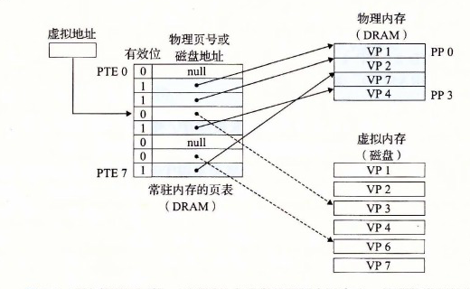
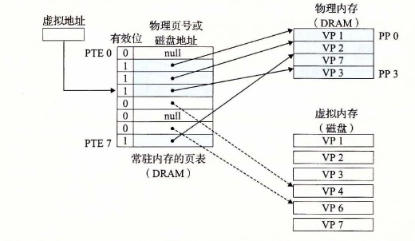

# 9.3.4 缺页

在虚拟内存的习惯说法中，DRAM 缓存不命中称为缺页（page fault）。图 9-6 展示了在缺页之前我们的示例页表的状态。CPU 引用了 VP 3 中的一个字，VP 3 并未缓存在 DRAM 中。地址翻译硬件从内存中读取 PTE 3，从有效位推断出 VP 3 未被缓存，并且触发一个缺页异常。缺页异常调用内核中的缺页异常处理程序，该程序会选择一个牺牲页，在此例中就是存放在 PP 3 中的 VP 4。如果 VP 4 已经被修改了，那么内核就会将它复制回磁盘。无论哪种情况，内核都会修改 VP 4 的页表条目，反映出 VP 4 不再缓存在主存中这一事实。

**图 9-6** VM 缺页（之前）。对 VP 3 中的字的引用会不命中，从而触发了缺页

接下来，内核从磁盘复制 VP 3 到内存中的 PP 3，更新 PTE 3，随后返回。当异常处理程序返回时，它会重新启动导致缺页的指令，该指令会把导致缺页的虚拟地址重发送到地址翻译硬件。但是现在，VP 3 已经缓存在主存中了，那么页命中也能由地址翻译硬件正常处理了。图 9-7 展示了在缺页之后我们的示例页表的状态。

**图 9-7** VM 缺页（之后）。缺页处理程序选择 VP 4 作为牺牲页，并从磁盘上用 VP 3 的副本取代它。在缺页处理程序重新启动导致缺页的指令之后，该指令将从内存中正常地读取字，而不会再产生异常

虚拟内存是在 20 世纪 60 年代早期发明的，远在 CPU—内存之间差距的加大引发产生 SRAM 缓存之前。因此，虚拟内存系统使用了和 SRAM 缓存不同的术语，即使它们的许多概念是相似的。在虚拟内存的习惯说法中，块被称为页。在磁盘和内存之间传送页的活动叫做交换（swapping）或者页面调度（paging）。页从磁盘换入（或者页面调入）DRAM 和从 DRAM 换出（或者页面调出）磁盘。一直等待，直到最后时刻，也就是当有不命中发生时，才换入页面的这种策略称为按需页面调度（demand paging）。也可以采用其他的方法，例如尝试着预测不命中，在页面实际被引用之前就换入页面。然而，所有现代系统都使用的是按需页面调度的方式。
