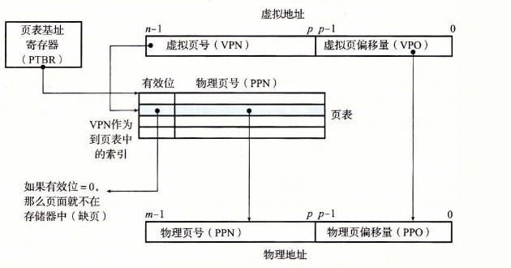
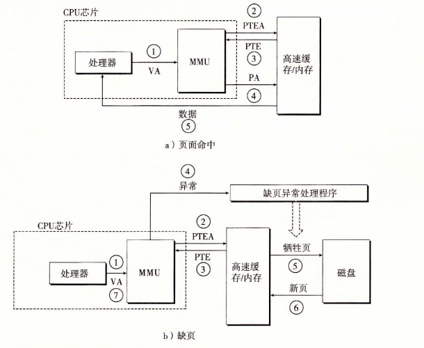

# 9.6 地址翻译

这一节讲述的是地址翻译的基础知识。我们的目标是让你了解硬件在支持虚拟内存中的角色，并给出足够多的细节使得你可以亲手演示一些具体的示例。不过，要记住我们省略了大量的细节，尤其是和时序相关的细节，虽然这些细节对硬件设计者来说是非常重要的，但是超出了我们讨论的范围。图 9-11 概括了我们在这节里将要使用的所有符号，供读者参考。

| 基本参数 | 描述 |
|---|---|
| N=2<sup>n</sup> | 虚拟地址空间中的地址数量 |
| M=2<sup>m</sup> | 物理地址空间中的地址数量 |
| P=2<sup>p</sup> | 页的大小（字节） |

| 虚拟地址（VA）的组成部分 | 描述 |
|---|---|
| VPO | 虚拟页面偏移量（字节） |
| VPN | 虚拟页号 |
| TLBI | TLB 索引 |
| TLBT | TLB 标记 |

| 物理地址（PA）的组成部分 | 描述 |
|---|---|
| PPO | 物理页面偏移量（字节） |
| PPN | 物理页号 |
| CO | 缓存块内的字节偏移量 |
| CI | 高速缓存索引 |
| CT | 高速缓存标记 |

**图 9-11** 地址翻译符号小结

形式上来说，地址翻译是一个 N 元素的虚拟地址空间（VAS）中的元素和一个 M 元素的物理地址空间（PAS）中元素之间的映射，

```text
MAP: VAS → PAS ∪ ∅
```

这里

```text
         A′  如果虚拟地址 A 处的数据在 PAS 的物理地址 A′ 处
MAP(A) = {
         ∅   如果虚拟地址 A 处的数据不在物理内存中
```

图 9-12 展示了 MMU 如何利用页表来实现这种映射。CPU 中的一个控制寄存器，页表基址寄存器（Page Table Base Register，PTBR）指向当前页表。n 位的虚拟地址包含两个部分：一个 p 位的虚拟页面偏移（Virtual Page Offset，VPO）和一个（n−p）位的虚拟页号（Virtual Page Number，VPN）。



**图 9-12** 使用页表的地址翻译

MMU 利用 VPN 来选择适当的 PTE。例如，VPN 0 选择 PTE 0，VPN 1 选择 PTE 1，以此类推。将页表条目中物理页号（Physical Page Number，PPN）和虚拟地址中的 VPO 串联起来，就得到相应的物理地址。注意，因为物理和虚拟页面都是 P 字节的，所以物理页面偏移（Physical Page Offset，PPO）和 VPO 是相同的。

图 9-13a 展示了当页面命中时，CPU 硬件执行的步骤。

- 第 1 步：处理器生成一个虚拟地址，并把它传送给 MMU。
- 第 2 步：MMU 生成 PTE 地址，并从高速缓存/主存请求得到它。
- 第 3 步：高速缓存/主存向 MMU 返回 PTE。
- 第 4 步：MMU 构造物理地址，并把它传送给高速缓存/主存。
- 第 5 步：高速缓存/主存返回所请求的数据字给处理器。



**图 9-13** 页面命中和缺页的操作图（VA：虚拟地址。PTEA：页表条目地址。PTE：页表条目。PA：物理地址）

页面命中完全是由硬件来处理的，与之不同的是，处理缺页要求硬件和操作系统内核协作完成，如图 9-13b 所示。

- 第 1 步到第 3 步：和图 9-13a 中的第 1 步到第 3 步相同。
- 第 4 步：PTE 中的有效位是零，所以 MMU 触发了一次异常，传递 CPU 中的控制到操作系统内核中的缺页异常处理程序。
- 第 5 步：缺页处理程序确定出物理内存中的牺牲页，如果这个页面已经被修改了，则把它换出到磁盘。
- 第 6 步：缺页处理程序页面调入新的页面，并更新内存中的 PTE。
- 第 7 步：缺页处理程序返回到原来的进程，再次执行导致缺页的指令。CPU 将引起缺页的虚拟地址重新发送给 MMU。因为虚拟页面现在缓存在物理内存中，所以就会命中，在 MMU 执行了图 9-13b 中的步骤之后，主存就会将所请求字返回给处理器。

> **练习题 9.3** 给定一个 32 位的虚拟地址空间和一个 24 位的物理地址，对于下面的页面大小 P，确定 VPN、VPO、PPN 和 PPO 中的位数：
>
> | P | VPN 位数 | VPO 位数 | PPN 位数 | PPO 位数 |
> |---:|---:|---:|---:|---:|
> | 1KB |  |  |  |  |
> | 2KB |  |  |  |  |
> | 4KB |  |  |  |  |
> | 8KB |  |  |  |  |
