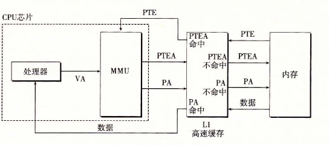

# 9.6.1 结合高速缓存和虚拟内存

在任何既使用虚拟内存又使用 SRAM 高速缓存的系统中，都有应该使用虚拟地址还是使用物理地址来访问 SRAM 高速缓存的问题。尽管关于这个折中的详细讨论已经超出了我们的讨论范围，但是大多数系统是选择物理寻址的。使用物理寻址，多个进程同时在高速缓存中有存储块和共享来自相同虚拟页面的块成为很简单的事情。而且，高速缓存无需处理保护问题，因为访问权限的检查是地址翻译过程的一部分。

图 9-14 展示了一个物理寻址的高速缓存如何和虚拟内存结合起来。主要的思路是地址翻译发生在高速缓存查找之前。注意，页表条目可以缓存，就像其他的数据字一样。

**图 9-14** 将 VM 与物理寻址的高速缓存结合起来（VA：虚拟地址。PTEA：页表条目地址。PTE：页表条目。PA：物理地址）
