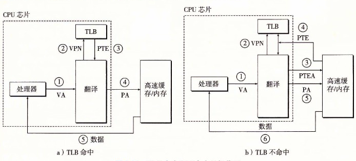

# 9.6.2 利用 TLB 加速地址翻译

正如我们看到的，每次 CPU 产生一个虚拟地址，MMU 就必须查阅一个 PTE，以便将虚拟地址翻译为物理地址。在最糟糕的情况下，这会要求从内存多取一次数据，代价是几十到几百个周期。如果 PTE 碰巧缓存在 L1 中，那么开销就下降到 1 个或 2 个周期。然而，许多系统都试图消除即使是这样的开销，它们在 MMU 中包括了一个关于 PTE 的小的缓存，称为翻译后备缓冲器（Translation Lookaside Buffer，TLB）。

TLB 是一个小的、虚拟寻址的缓存，其中每一行都保存着一个由单个 PTE 组成的块。TLB 通常有高度的相联度。如图 9-15 所示，用于组选择和行匹配的索引和标记字段是从虚拟地址中的虚拟页号中提取出来的。

| 位范围 | n−1 … p+t | p+t−1 … p | p−1 … 0 |
|---|---|---|---|
| 字段 | TLB 标记（TLBT） | TLB 索引（TLBI） | VPO |
| 所属部分 | VPN | VPN | VPO |

**图 9-15** 虚拟地址中用以访问 TLB 的组成部分

如果 TLB 有 T=2t 个组，那么 TLB 索引（TLBI）是由 VPN 的 t 个最低位组成的，而 TLB 标记（TLBT）是由 VPN 中剩余的位组成的。

图 9-16a 展示了当 TLB 命中时（通常情况）所包括的步骤。这里的关键点是，所有的地址翻译步骤都是在芯片上的 MMU 中执行的，因此非常快。

- 第 1 步：CPU 产生一个虚拟地址。
- 第 2 步和第 3 步：MMU 从 TLB 中取出相应的 PTE。
- 第 4 步：MMU 将这个虚拟地址翻译成一个物理地址，并且将它发送到高速缓存/主存。
- 第 5 步：高速缓存/主存将所请求的数据字返回给 CPU。

当 TLB 不命中时，MMU 必须从 L1 缓存中取出相应的 PTE，如图 9-16b 所示。新取出的 PTE 存放在 TLB 中，可能会覆盖一个已经存在的条目。

**图 9-16** TLB 命中和不命中的操作图
