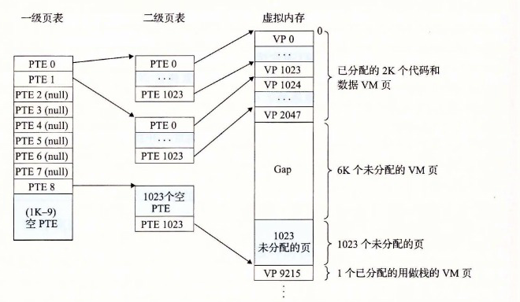
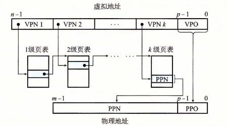

# 9.6.3 多级页表

到目前为止，我们一直假设系统只用一个单独的页表来进行地址翻译。但是如果我们有一个 32 位的地址空间、4KB 的页面和一个 4 字节的 PTE，那么即使应用所引用的只是虚拟地址空间中很小的一部分，也总是需要一个 4MB 的页表驻留在内存中。对于地址空间为 64 位的系统来说，问题将变得更复杂。

用来压缩页表的常用方法是使用层次结构的页表。用一个具体的示例是最容易理解这个思想的。假设 32 位虚拟地址空间被分为 4KB 的页，而每个页表条目都是 4 字节。还假设在这一时刻，虚拟地址空间有如下形式：内存的前 2K 个页面分配给了代码和数据，接下来的 6K 个页面还未分配，再接下来的 1023 个页面也未分配，接下来的 1 个页面分配给了用户栈。图 9-17 展示了我们如何为这个虚拟地址空间构造一个两级的页表层次结构。

一级页表中的每个 PTE 负责映射虚拟地址空间中一个 4MB 的片（chunk），这里每一片都是由 1024 个连续的页面组成的。比如，PTE 0 映射第一片，PTE 1 映射接下来的一个片，以此类推。假设地址空间是 4GB，1024 个 PTE 已经足够覆盖整个空间了。

如果片 i 中的每个页面都未被分配，那么一级 PTE i 就为空。例如，图 9-17 中，片 2～7 是未被分配的。然而，如果在片 i 中至少有一个页是分配了的，那么一级 PTE i 就指向一个二级页表的基址。例如，在图 9-17 中，片 0、1 和 8 的所有或者部分已被分配，所以它们的一级 PTE 就指向二级页表。

**图 9-17** 一个两级页表层次结构。注意地址是从上往下增加的

二级页表中的每个 PTE 都负责映射一个 4KB 的虚拟内存页面，就像我们查看只有一级的页表一样。注意，使用 4 字节的 PTE，每个一级和二级页表都是 4KB 字节，这刚好和一个页面的大小是一样的。

这种方法从两个方面减少了内存要求。第一，如果一级页表中的一个 PTE 是空的，那么相应的二级页表就根本不会存在。这代表着一种巨大的潜在节约，因为对于一个典型的程序，4GB 的虚拟地址空间的大部分都会是未分配的。第二，只有一级页表才需要总是在主存中；虚拟内存系统可以在需要时创建、页面调入或调出二级页表，这就减少了主存的压力；只有最经常使用的二级页表才需要缓存在主存中。

图 9-18 描述了使用 K 级页表层次结构的地址翻译。虚拟地址被划分成为 K 个 VPN 和 1 个 VPO。每个 VPNi 都是一个到第 i 级页表的索引，其中 1≤i≤k。第 j 级页表中的每个 PTE，1≤j≤k−1，都指向第 j+1 级的某个页表的基址。第 K 级页表中的每个 PTE 包含某个物理页面的 PPN，或者一个磁盘块的地址。为了构造物理地址，在能够确定 PPN 之前，MMU 必须访问 K 个 PTE。对于只有一级的页表结构，PPO 和 VPO 是相同的。

**图 9-18** 使用 K 级页表的地址翻译

访问 k 个 PTE，第一眼看上去昂贵而不切实际。然而，这里 TLB 能够起作用，正是通过将不同层次上页表的 PTE 缓存起来。实际上，带多级页表的地址翻译并不比单级页表慢很多。
