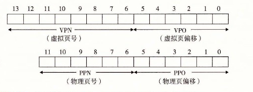
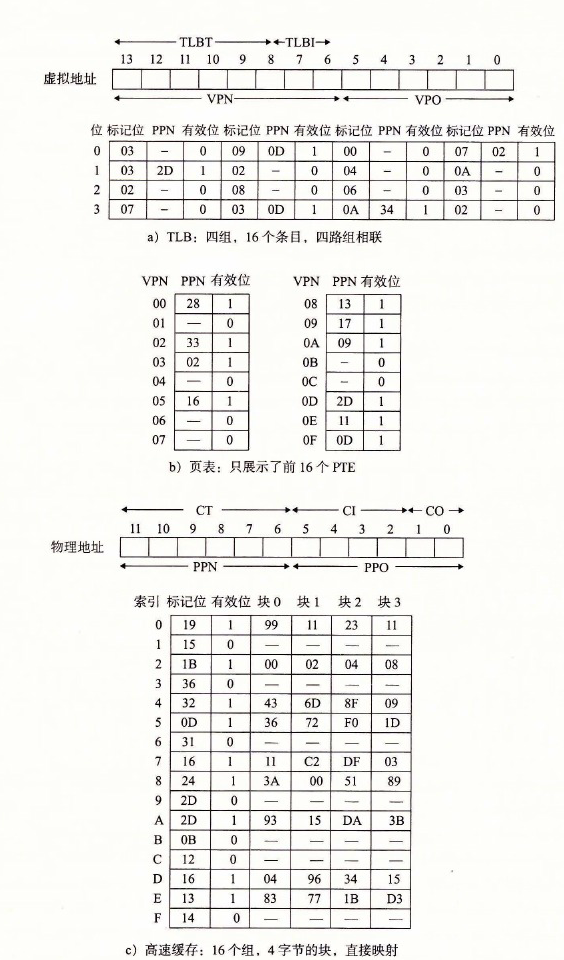

# 9.6.4 综合：端到端的地址翻译

在这一节里，我们通过一个具体的端到端的地址翻译示例，来综合一下我们刚学过的这些内容，这个示例运行在有一个 TLB 和 L1 d-cache 的小系统上。为了保证可管理性，我们做出如下假设：

- 内存是按字节寻址的。
- 内存访问是针对 1 字节的字的（不是 4 字节的字）。
- 虚拟地址是 14 位长的（n=14）。
- 物理地址是 12 位长的（m=12）。
- 页面大小是 64 字节（P=64）。
- TLB 是四路组相联的，总共有 16 个条目。
- L1 d-cache 是物理寻址、直接映射的，行大小为 4 字节，而总共有 16 个组。

图 9-19 展示了虚拟地址和物理地址的格式。因为每个页面是 26=64 字节，所以虚拟地址和物理地址的低 6 位分别作为 VPO 和 PPO。虚拟地址的高 8 位作为 VPN。物理地址的高 6 位作为 PPN。

**图 9-19** 小内存系统的寻址。假设 14 位的虚拟地址（n=14），12 位的物理地址（m=12）和 64 字节的页面（P=64）

图 9-20 展示了小内存系统的一个快照，包括 TLB（图 9-20a）、页表的一部分（图 9-20b）和 L1 高速缓存（图 9-20c）。在 TLB 和高速缓存的图上面，我们还展示了访问这些设备时硬件是如何划分虚拟地址和物理地址的位的。

- **TLB。** TLB 是利用 VPN 的位进行虚拟寻址的。因为 TLB 有 4 个组，所以 VPN 的低 2 位就作为组索引（TLBI）。VPN 中剩下的高 6 位作为标记（TLBT），用来区别可能映射到同一个 TLB 组的不同的 VPN。
- **页表。** 这个页表是一个单级设计，一共有 28=256 个页表条目（PTE）。然而，我们只对这些条目中的开头 16 个感兴趣。为了方便，我们用索引它的 VPN 来标识每个 PTE；但是要记住这些 VPN 并不是页表的一部分，也不储存在内存中。另外，注意每个无效 PTE 的 PPN 都用一个破折号来表示，以加强一个概念：无论刚好这里存储的是什么位值，都是没有任何意义的。
- **高速缓存。** 直接映射的缓存是通过物理地址中的字段来寻址的。因为每个块都是 4 字节，所以物理地址的低 2 位作为块偏移（CO）。因为有 16 组，所以接下来的 4 位就用来表示组索引（CI）。剩下的 6 位作为标记（CT）。

**图 9-20** 小内存系统的 TLB、页表以及缓存。TLB、页表和缓存中所有的值都是十六进制表示的

给定了这种初始化设定，让我们来看看当 CPU 执行一条读地址 `0x03d4` 处字节的加载指令时会发生什么。（回想一下我们假定 CPU 读取 1 字节的字，而不是 4 字节的字。）为了开始这种手工的模拟，我们发现写下虚拟地址的各个位，标识出我们会需要的各种字段，并确定它们的十六进制值，是非常有帮助的。当硬件解码地址时，它也执行相似的任务。

| 字段 | 位范围 | 值 |
|---|---:|---:|
| TLBT | 13～8 | `0x03` |
| TLBI | 7～6 | `0x03` |
| VPN | 13～6 | `0x0f` |
| VPO | 5～0 | `0x14` |

| 位位置 | 13 | 12 | 11 | 10 | 9 | 8 | 7 | 6 | 5 | 4 | 3 | 2 | 1 | 0 |
|---|---:|---:|---:|---:|---:|---:|---:|---:|---:|---:|---:|---:|---:|---:|
| VA=`0x03d4` | 0 | 0 | 0 | 0 | 1 | 1 | 1 | 1 | 0 | 1 | 0 | 1 | 0 | 0 |

开始时，MMU 从虚拟地址中抽取出 VPN（`0x0F`），并且检查 TLB，看它是否因为前面的某个内存引用缓存了 PTE `0x0F` 的一个副本。TLB 从 VPN 中抽取出 TLB 索引（`0x03`）和 TLB 标记（`0x3`），组 `0x3` 的第二个条目中有效匹配，所以命中，然后将缓存的 PPN（`0x0D`）返回给 MMU。

如果 TLB 不命中，那么 MMU 就需要从主存中取出相应的 PTE。然而，在这种情况中，我们很幸运，TLB 会命中。现在，MMU 有了形成物理地址所需要的所有东西。它通过将来自 PTE 的 PPN（`0x0D`）和来自虚拟地址的 VPO（`0x14`）连接起来，这就形成了物理地址（`0x354`）。

接下来，MMU 发送物理地址给缓存，缓存从物理地址中抽取出缓存偏移 CO（`0x0`）、缓存组索引 CI（`0x5`）以及缓存标记 CT（`0x0D`）。

| 字段 | 位范围 | 值 |
|---|---:|---:|
| CT | 11～6 | `0x0d` |
| CI | 5～2 | `0x05` |
| CO | 1～0 | `0x0` |
| PPN | 11～6 | `0x0d` |
| PPO | 5～0 | `0x14` |

| 位位置 | 11 | 10 | 9 | 8 | 7 | 6 | 5 | 4 | 3 | 2 | 1 | 0 |
|---|---:|---:|---:|---:|---:|---:|---:|---:|---:|---:|---:|---:|
| PA=`0x354` | 0 | 0 | 1 | 1 | 0 | 1 | 0 | 1 | 0 | 1 | 0 | 0 |

因为组 `0x5` 中的标记与 CT 相匹配，所以缓存检测到一个命中，读出在偏移量 CO 处的数据字节（`0x36`），并将它返回给 MMU，随后 MMU 将它传递回 CPU。

翻译过程的其他路径也是可能的。例如，如果 TLB 不命中，那么 MMU 必须从页表中的 PTE 中取出 PPN。如果得到的 PTE 是无效的，那么就产生一个缺页，内核必须调入合适的页面，重新运行这条加载指令。另一种可能性是 PTE 是有效的，但是所需要的内存块在缓存中不命中。

> **练习题 9.4** 说明 9.6.4 节中的示例内存系统是如何将一个虚拟地址翻译成一个物理地址和访问缓存的。对于给定的虚拟地址，指明访问的 TLB 条目、物理地址和返回的缓存字节值。指出是否发生了 TLB 不命中，是否发生了缺页，以及是否发生了缓存不命中。如果是缓存不命中，在“返回的缓存字节”栏中输入“—”。如果有缺页，则在“PPN”一栏中输入“—”，并且将 C 部分和 D 部分空着。
>
> **虚拟地址：** `0x03d7`
>
> **A. 虚拟地址格式**
>
> | 位位置 | 13 | 12 | 11 | 10 | 9 | 8 | 7 | 6 | 5 | 4 | 3 | 2 | 1 | 0 |
> |---|---:|---:|---:|---:|---:|---:|---:|---:|---:|---:|---:|---:|---:|---:|
> | 位值 |  |  |  |  |  |  |  |  |  |  |  |  |  |  |
>
> **B. 地址翻译**
>
> | 参数 | 值 |
> |---|---|
> | VPN |  |
> | TLB 索引 |  |
> | TLB 标记 |  |
> | TLB 命中？（是/否） |  |
> | 缺页？（是/否） |  |
> | PPN |  |
>
> **C. 物理地址格式**
>
> | 位位置 | 11 | 10 | 9 | 8 | 7 | 6 | 5 | 4 | 3 | 2 | 1 | 0 |
> |---|---:|---:|---:|---:|---:|---:|---:|---:|---:|---:|---:|---:|
> | 位值 |  |  |  |  |  |  |  |  |  |  |  |  |
>
> **D. 物理内存引用**
>
> | 参数 | 值 |
> |---|---|
> | 字节偏移 |  |
> | 缓存索引 |  |
> | 缓存标记 |  |
> | 缓存命中？（是/否） |  |
> | 返回的缓存字节 |  |
