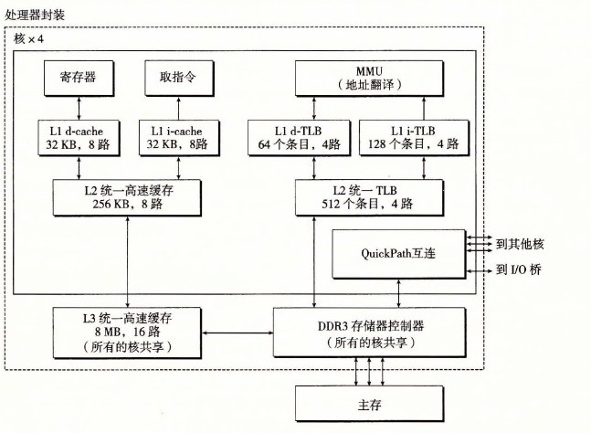

# 9.7 案例研究：Intel Core i7/Linux 内存系统

我们以一个实际系统的案例研究来总结我们对虚拟内存的讨论：一个运行 Linux 的 Intel Core i7。虽然底层的 Haswell 微体系结构允许完全的 64 位虚拟和物理地址空间，而现在的（以及可预见的未来的）Core i7 实现支持 48 位（256TB）虚拟地址空间和 52 位（4PB）物理地址空间，还有一个兼容模式，支持 32 位（4GB）虚拟和物理地址空间。

图 9-21 给出了 Core i7 内存系统的重要部分。处理器封装（processor package）包括四个核、一个大的所有核共享的 L3 高速缓存，以及一个 DDR3 内存控制器。每个核包含一个层次结构的 TLB、一个层次结构的数据和指令高速缓存，以及一组快速的点到点链路，这种链路基于 QuickPath 技术，是为了让一个核与其他核和外部 I/O 桥直接通信。TLB 是虚拟寻址的，是四路组相联的。L1、L2 和 L3 高速缓存是物理寻址的，块大小为 64 字节。L1 和 L2 是 8 路组相联的，而 L3 是 16 路组相联的。页大小可以在启动时被配置为 4KB 或 4MB。Linux 使用的是 4KB 的页。

**图 9-21** Core i7 的内存系统
