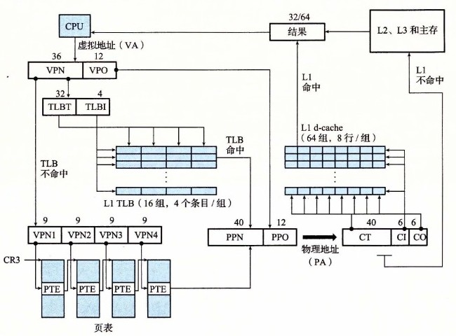
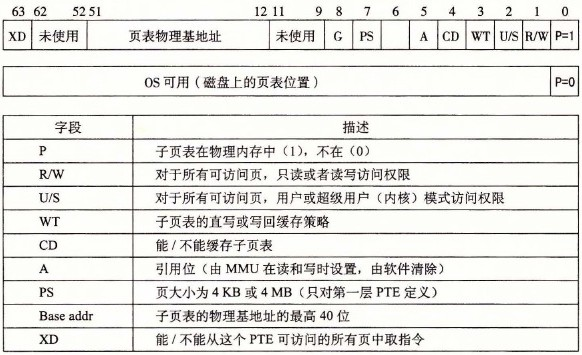
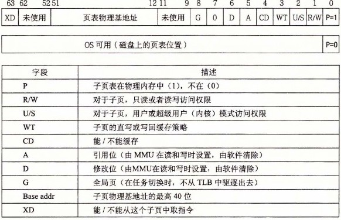
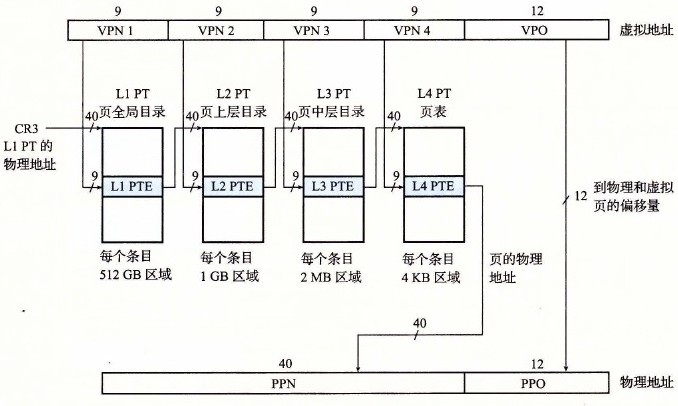

# 9.7.1 Core i7 地址翻译

图 9-22 总结了完整的 Core i7 地址翻译过程，从 CPU 产生虚拟地址的时刻一直到来自内存的数据字到达 CPU。Core i7 采用四级页表层次结构。每个进程有它自己私有的页表层次结构。当一个 Linux 进程在运行时，虽然 Core i7 体系结构允许页表换进换出，但是与已分配了的页相关联的页表都是驻留在内存中的。CR3 控制寄存器指向第一级页表（L1）的起始位置。CR3 的值是每个进程上下文的一部分，每次上下文切换时，CR3 的值都会被恢复。

**图 9-22** Core i7 地址翻译的概况。为了简化，没有显示 i-cache、i-TLB 和 L2 统一 TLB

图 9-23 给出了第一级、第二级或第三级页表中条目的格式。当 P=1 时（Linux 中就总是如此），地址字段包含一个 40 位物理页号（PPN），它指向适当的页表的开始处。注意，这强加了一个要求，要求物理页表 4KB 对齐。

**图 9-23** 第一级、第二级和第三级页表条目格式。每个条目引用一个 4KB 子页表

图 9-24 给出了第四级页表中条目的格式。当 P=1 时，地址字段包括一个 40 位 PPN，它指向物理内存中某一页的基地址。这又强加了一个要求，要求物理页 4KB 对齐。

**图 9-24** 第四级页表条目的格式。每个条目引用一个 4KB 子页

PTE 有三个权限位，控制对页的访问。R/W 位确定页的内容是可以读写的还是只读的。U/S 位确定是否能够在用户模式中访问该页，从而保护操作系统内核中的代码和数据不被用户程序访问。XD（禁止执行）位是在 64 位系统中引入的，可以用来禁止从某些内存页取指令。这是一个重要的新特性，通过限制只能执行只读代码段，使得操作系统内核降低了缓冲区溢出攻击的风险。

当 MMU 翻译每一个虚拟地址时，它还会更新另外两个内核缺页处理程序会用到的位。每次访问一个页时，MMU 都会设置 A 位，称为引用位（reference bit）。内核可以用这个引用位来实现它的页替换算法。每次对一个页进行了写之后，MMU 都会设置 D 位，又称修改位或脏位（dirty bit）。修改位告诉内核在复制替换页之前是否必须写回牺牲页。内核可以通过调用一条特殊的内核模式指令来清除引用位或修改位。

图 9-25 给出了 Core i7 MMU 如何使用四级的页表来将虚拟地址翻译成物理地址。36 位 VPN 被划分成四个 9 位的片，每个片被用作到一个页表的偏移量。CR3 寄存器包含 L1 页表的物理地址。VPN 1 提供到一个 L1 PTE 的偏移量，这个 PTE 包含 L2 页表的基地址。VPN 2 提供到一个 L2 PTE 的偏移量，以此类推。

**图 9-25** Core i7 页表翻译（PT：页表，PTE：页表条目，VPN：虚拟页号，VPO：虚拟页偏移，PPN：物理页号，PPO：物理页偏移量。图中还给出了这四级页表的 Linux 名字）

> **旁注 优化地址翻译**
>
> 在对地址翻译的讨论中，我们描述了一个顺序的两个步骤的过程，1）MMU 将虚拟地址翻译成物理地址，2）将物理地址传送到 L1 高速缓存。然而，实际的硬件实现使用了一个灵活的技巧，允许这些步骤部分重叠，因此也就加速了对 L1 高速缓存的访问。
>
> 例如，页面大小为 4KB 的 Core i7 系统上的一个虚拟地址有 12 位的 VPO，并且这些位和相应物理地址中的 PPO 的 12 位是相同的。因为八路组相联的、物理寻址的 L1 高速缓存有 64 个组和大小为 64 字节的缓存块，每个物理地址有 6 个（log₂ 64）缓存偏移位和 6 个（log₂ 64）索引位。这 12 位恰好符合虚拟地址的 VPO 部分，这绝不是偶然！当 CPU 需要翻译一个虚拟地址时，它就发送 VPN 到 MMU，发送 VPO 到高速 L1 缓存。当 MMU 向 TLB 请求一个页表条目时，L1 高速缓存正忙着利用 VPO 位查找相应的组，并读出这个组里的 8 个标记和相应的数据字。当 MMU 从 TLB 得到 PPN 时，缓存已经准备好试着把这个 PPN 与这 8 个标记中的一个进行匹配了。
