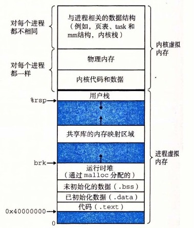
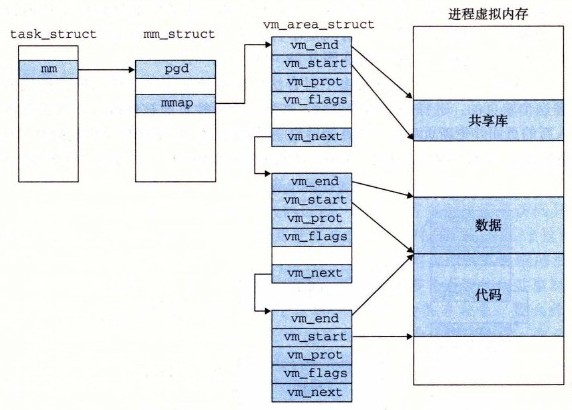
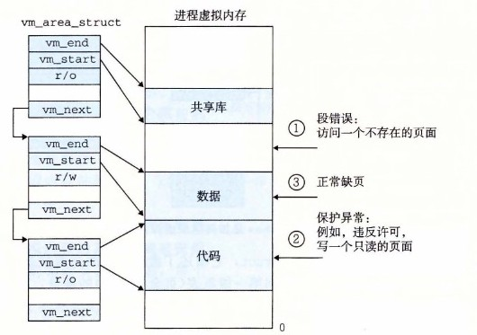

# 9.7.2 Linux 虚拟内存系统

一个虚拟内存系统要求硬件和内核软件之间的紧密协作。版本与版本之间细节都不尽相同，对此完整的阐释超出了我们讨论的范围。但是，在这一小节中我们的目标是对 Linux 的虚拟内存系统做一个描述，使你能够大致了解一个实际的操作系统是如何组织虚拟内存，以及如何处理缺页的。

Linux 为每个进程维护了一个单独的虚拟地址空间，形式如图 9-26 所示。我们已经多次看到过这幅图了，包括它那些熟悉的代码、数据、堆、共享库以及栈段。既然我们理解了地址翻译，就能够填入更多的关于内核虚拟内存的细节了，这部分虚拟内存位于用户栈之上。

内核虚拟内存包含内核中的代码和数据结构。内核虚拟内存的某些区域被映射到所有进程共享的物理页面。例如，每个进程共享内核的代码和全局数据结构。有趣的是，Linux 也将一组连续的虚拟页面（大小等于系统中 DRAM 的总量）映射到相应的一组连续的物理页面。这就为内核提供了一种便利的方法来访问物理内存中任何特定的位置，例如，当它需要访问页表，或在一些设备上执行内存映射的 I/O 操作，而这些设备被映射到特定的物理内存位置时。

**图 9-26** 一个 Linux 进程的虚拟内存

内核虚拟内存的其他区域包含每个进程都不相同的数据。比如说，页表、内核在进程的上下文中执行代码时使用的栈，以及记录虚拟地址空间当前组织的各种数据结构。

## 1. Linux 虚拟内存区域

Linux 将虚拟内存组织成一些区域（也叫做段）的集合。一个区域（area）就是已经存在着的（已分配的）虚拟内存的连续片（chunk），这些页是以某种方式相关联的。例如，代码段、数据段、堆、共享库段，以及用户栈都是不同的区域。每个存在的虚拟页面都保存在某个区域中，而不属于某个区域的虚拟页是不存在的，并且不能被进程引用。区域的概念很重要，因为它允许虚拟地址空间有间隙。内核不用记录那些不存在的虚拟页，而这样的页也不占用内存、磁盘或者内核本身中的任何额外资源。

图 9-27 强调了记录一个进程中虚拟内存区域的内核数据结构。内核为系统中的每个进程维护一个单独的任务结构（源代码中的 `task_struct`）。任务结构中的元素包含或者指向内核运行该进程所需要的所有信息（例如，PID、指向用户栈的指针、可执行目标文件的名字，以及程序计数器）。

**图 9-27** Linux 是如何组织虚拟内存的

任务结构中的一个条目指向 `mm_struct`，它描述了虚拟内存的当前状态。我们感兴趣的两个字段是 `pgd` 和 `mmap`，其中 `pgd` 指向第一级页表（页全局目录）的基址，而 `mmap` 指向一个 `vm_area_structs`（区域结构）的链表，其中每个 `vm_area_structs` 都描述了当前虚拟地址空间的一个区域。当内核运行这个进程时，就将 `pgd` 存放在 CR3 控制寄存器中。

为了我们的目的，一个具体区域的区域结构包含下面的字段：

- `vm_start`：指向这个区域的起始处。
- `vm_end`：指向这个区域的结束处。
- `vm_prot`：描述这个区域内包含的所有页的读写许可权限。
- `vm_flags`：描述这个区域内的页面是与其他进程共享的，还是这个进程私有的（还描述了其他一些信息）。
- `vm_next`：指向链表中下一个区域结构。

## 2. Linux 缺页异常处理

假设 MMU 在试图翻译某个虚拟地址 A 时，触发了一个缺页。这个异常导致控制转移到内核的缺页处理程序，处理程序随后就执行下面的步骤：

1）虚拟地址 A 是合法的吗？换句话说，A 在某个区域结构定义的区域内吗？为了回答这个问题，缺页处理程序搜索区域结构的链表，把 A 和每个区域结构中的 `vm_start` 和 `vm_end` 做比较。如果这个指令是不合法的，那么缺页处理程序就触发一个段错误，从而终止这个进程。这个情况在图 9-28 中标识为“1”。

因为一个进程可以创建任意数量的新虚拟内存区域（使用在下一节中描述的 `mmap` 函数），所以顺序搜索区域结构的链表花销可能会很大。因此在实际中，Linux 使用某些我们没有显示出来的字段，Linux 在链表中构建了一棵树，并在这棵树上进行查找。

2）试图进行的内存访问是否合法？换句话说，进程是否有读、写或者执行这个区域内页面的权限？例如，这个缺页是不是由一条试图对这个代码段里的只读页面进行写操作的存储指令造成的？这个缺页是不是因为一个运行在用户模式中的进程试图从内核虚拟内存中读取字造成的？如果试图进行的访问是不合法的，那么缺页处理程序会触发一个保护异常，从而终止这个进程。这种情况在图 9-28 中标识为“2”。

3）此刻，内核知道了这个缺页是由于对合法的虚拟地址进行合法的操作造成的。它是这样来处理这个缺页的：选择一个牺牲页面，如果这个牺牲页面被修改过，那么就将它交换出去，换入新的页面并更新页表。当缺页处理程序返回时，CPU 重新启动引起缺页的指令，这条指令将再次发送 A 到 MMU。这次，MMU 就能正常地翻译 A，而不会再产生缺页中断了。

**图 9-28** Linux 缺页处理
