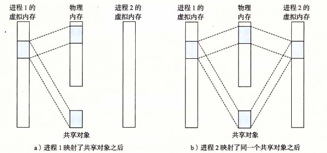
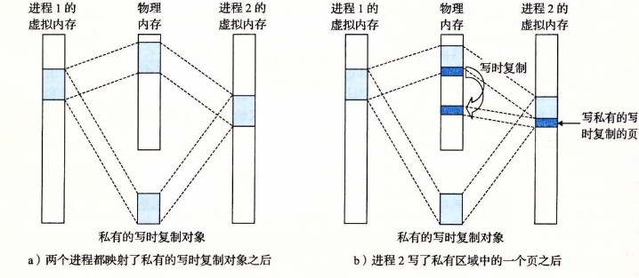

# 9.8.1 再看共享对象

内存映射的概念来源于一个聪明的发现：如果虚拟内存系统可以集成到传统的文件系统中，那么就能提供一种简单而高效的把程序和数据加载到内存中的方法。

正如我们已经看到的，进程这一抽象能够为每个进程提供自己私有的虚拟地址空间，可以免受其他进程的错误读写。不过，许多进程有同样的只读代码区域。例如，每个运行 Linux shell 程序 `bash` 的进程都有相同的代码区域。而且，许多程序需要访问只读运行时库代码的相同副本。例如，每个 C 程序都需要来自标准 C 库的诸如 `printf` 这样的函数。那么，如果每个进程都在物理内存中保持这些常用代码的副本，那就是极端的浪费了。幸运的是，内存映射给我们提供了一种清晰的机制，用来控制多个进程如何共享对象。

一个对象可以被映射到虚拟内存的一个区域，要么作为共享对象，要么作为私有对象。如果一个进程将一个共享对象映射到它的虚拟地址空间的一个区域内，那么这个进程对这个区域的任何写操作，对于那些也把这个共享对象映射到它们虚拟内存的其他进程而言，也是可见的。而且，这些变化也会反映在磁盘上的原始对象中。

另一方面，对于一个映射到私有对象的区域做的改变，对于其他进程来说是不可见的，并且进程对这个区域所做的任何写操作都不会反映在磁盘上的对象中。一个映射到共享对象的虚拟内存区域叫做共享区域。类似地，也有私有区域。

假设进程 1 将一个共享对象映射到它的虚拟内存的一个区域中，如图 9-29a 所示。现在假设进程 2 将同一个共享对象映射到它的地址空间（并不一定要和进程 1 在相同的虚拟地址处，如图 9-29b 所示）。

**图 9-29** 一个共享对象（注意，物理页面不一定是连续的）

因为每个对象都有一个唯一的文件名，内核可以迅速地判定进程 1 已经映射了这个对象，而且可以使进程 2 中的页表条目指向相应的物理页面。关键点在于即使对象被映射到了多个共享区域，物理内存中也只需要存放共享对象的一个副本。为了方便，我们将物理页面显示为连续的，但是在一般情况下当然不是这样的。

私有对象使用一种叫做写时复制（copy-on-write）的巧妙技术被映射到虚拟内存中。一个私有对象开始生命周期的方式基本上与共享对象的一样，在物理内存中只保存有私有对象的一份副本。比如，图 9-30a 展示了一种情况，其中两个进程将一个私有对象映射到它们虚拟内存的不同区域，但是共享这个对象同一个物理副本。对于每个映射私有对象的进程，相应私有区域的页表条目都被标记为只读，并且区域结构被标记为私有的写时复制。只要没有进程试图写它自己的私有区域，它们就可以继续共享物理内存中对象的一个单独副本。然而，只要有一个进程试图写私有区域内的某个页面，那么这个写操作就会触发一个保护故障。

当故障处理程序注意到保护异常是由于进程试图写私有的写时复制区域中的一个页面而引起的，它就会在物理内存中创建这个页面的一个新副本，更新页表条目指向这个新的副本，然后恢复这个页面的可写权限，如图 9-30b 所示。当故障处理程序返回时，CPU 重新执行这个写操作，现在在新创建的页面上这个写操作就可以正常执行了。

**图 9-30** 一个私有的写时复制对象

通过延迟私有对象中的副本直到最后可能的时刻，写时复制最充分地使用了稀有的物理内存。
