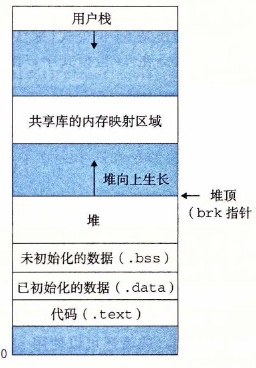

# 9.9 动态内存分配

虽然可以使用低级的 `mmap` 和 `munmap` 函数来创建和删除虚拟内存的区域，但是 C 程序员还是会觉得当运行时需要额外虚拟内存时，用动态内存分配器（dynamic memory allocator）更方便，也有更好的可移植性。

动态内存分配器维护着一个进程的虚拟内存区域，称为堆（heap）（见图 9-33）。系统之间细节不同，但是不失通用性，假设堆是一个请求二进制零的区域，它紧接在未初始化的数据区域后开始，并向上生长（向更高的地址）。对于每个进程，内核维护着一个变量 `brk`（读做“break”），它指向堆的顶部。

**图 9-33** 堆

分配器将堆视为一组不同大小的块（block）的集合来维护。每个块就是一个连续的虚拟内存片（chunk），要么是已分配的，要么是空闲的。已分配的块显式地保留为供应用程序使用。空闲块可用来分配。空闲块保持空闲，直到它显式地被应用所分配。一个已分配的块保持已分配状态，直到它被释放，这种释放要么是应用程序显式执行的，要么是内存分配器自身隐式执行的。

分配器有两种基本风格。两种风格都要求应用显式地分配块。它们的不同之处在于由哪个实体来负责释放已分配的块。

- **显式分配器（explicit allocator）**，要求应用显式地释放任何已分配的块。例如，C 标准库提供一种叫做 `malloc` 程序包的显式分配器。C 程序通过调用 `malloc` 函数来分配一个块，并通过调用 `free` 函数来释放一个块。C++ 中的 `new` 和 `delete` 操作符与 C 中的 `malloc` 和 `free` 相当。
- **隐式分配器（implicit allocator）**，另一方面，要求分配器检测一个已分配块何时不再被程序所使用，那么就释放这个块。隐式分配器也叫做垃圾收集器（garbage collector），而自动释放未使用的已分配的块的过程叫做垃圾收集（garbage collection）。例如，诸如 Lisp、ML 以及 Java 之类的高级语言就依赖垃圾收集来释放已分配的块。

本节剩下的部分讨论的是显式分配器的设计和实现。我们将在 9.10 节中讨论隐式分配器。为了更具体，我们的讨论集中于管理堆内存的分配器。然而，应该明白内存分配是一个普遍的概念，可以出现在各种上下文中。例如，图形处理密集的应用程序就经常使用标准分配器来要求获得一大块虚拟内存，然后使用与应用相关的分配器来管理内存，在该块中创建和销毁图形的节点。
