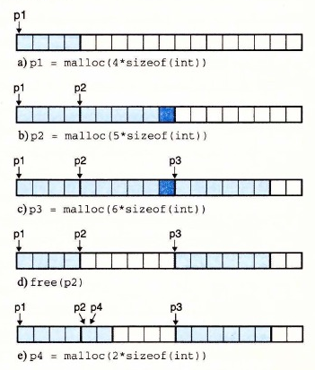

# 9.9.1 `malloc` 和 `free` 函数

C 标准库提供了一个称为 `malloc` 程序包的显式分配器。程序通过调用 `malloc` 函数来从堆中分配块。

```c
#include <stdlib.h>

void *malloc(size_t size);
```

**返回：** 若成功则为已分配块的指针，若出错则为 `NULL`。

`malloc` 函数返回一个指针，指向大小为至少 `size` 字节的内存块，这个块会为可能包含在这个块内的任何数据对象类型做对齐。实际中，对齐依赖于编译代码在 32 位模式（`gcc -m32`）还是 64 位模式（默认的）中运行。在 32 位模式中，`malloc` 返回的块的地址总是 8 的倍数。在 64 位模式中，该地址总是 16 的倍数。

> **旁注 一个字有多大**
>
> 回想一下在第 3 章中我们对机器代码的讨论，Intel 将 4 字节对象称为双字。然而，在本节中，我们会假设字是 4 字节的对象，而双字是 8 字节的对象，这和传统术语是一致的。

如果 `malloc` 遇到问题（例如，程序要求的内存块比可用的虚拟内存还要大），那么它就返回 `NULL`，并设置 `errno`。`malloc` 不初始化它返回的内存。那些想要已初始化的动态内存的应用程序可以使用 `calloc`，`calloc` 是一个基于 `malloc` 的瘦包装函数，它将分配的内存初始化为零。想要改变一个以前已分配块的大小，可以使用 `realloc` 函数。

动态内存分配器，例如 `malloc`，可以通过使用 `mmap` 和 `munmap` 函数，显式地分配和释放堆内存，或者还可以使用 `sbrk` 函数：

```c
#include <unistd.h>

void *sbrk(intptr_t incr);
```

**返回：** 若成功则为旧的 `brk` 指针，若出错则为 -1。

`sbrk` 函数通过将内核的 `brk` 指针增加 `incr` 来扩展和收缩堆。如果成功，它就返回 `brk` 的旧值，否则，它就返回 -1，并将 `errno` 设置为 `ENOMEM`。如果 `incr` 为零，那么 `sbrk` 就返回 `brk` 的当前值。用一个为负的 `incr` 来调用 `sbrk` 是合法的，而且很巧妙，因为返回值（`brk` 的旧值）指向距新堆顶向上 `abs(incr)` 字节处。

程序是通过调用 `free` 函数来释放已分配的堆块。

```c
#include <stdlib.h>

void free(void *ptr);
```

**返回：** 无。

`ptr` 参数必须指向一个从 `malloc`、`calloc` 或者 `realloc` 获得的已分配块的起始位置。如果不是，那么 `free` 的行为就是未定义的。更糟的是，既然它什么都不返回，`free` 就不会告诉应用出现了错误。就像我们将在 9.11 节里看到的，这会产生一些令人迷惑的运行时错误。

图 9-34 展示了一个 `malloc` 和 `free` 的实现是如何管理一个 C 程序的 16 字的（非常）小的堆的。每个方框代表了一个 4 字节的字。粗线标出的矩形对应于已分配块（有阴影的）和空闲块（无阴影的）。初始时，堆是由一个大小为 16 个字的、双字对齐的、空闲块组成的。（本节中，我们假设分配器返回的块是 8 字节双字边界对齐的。）

- 图 9-34a：程序请求一个 4 字的块。`malloc` 的响应是：从空闲块的前部切出一个 4 字的块，并返回一个指向这个块的第一字的指针。
- 图 9-34b：程序请求一个 5 字的块。`malloc` 的响应是：从空闲块的前部分配一个 6 字的块。在本例中，`malloc` 在块里填充了一个额外的字，是为了保持空闲块是双字边界对齐的。
- 图 9-34c：程序请求一个 6 字的块，而 `malloc` 就从空闲块的前部切出一个 6 字的块。
- 图 9-34d：程序释放在图 9-34b 中分配的那个 6 字的块。注意，在调用 `free` 返回之后，指针 `p2` 仍然指向被释放了的块。应用有责任在它被一个新的 `malloc` 调用重新初始化之前，不再使用 `p2`。
- 图 9-34e：程序请求一个 2 字的块。在这种情况中，`malloc` 分配在前一步中被释放了的块的一部分，并返回一个指向这个新块的指针。



**图 9-34** 用 `malloc` 和 `free` 分配和释放块。每个方框对应于一个字。每个粗线标出的矩形对应于一个块。阴影部分是已分配的块。已分配的块的填充区域是深阴影的。无阴影部分是空闲块。堆地址是从左往右增加的
