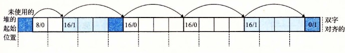

# 9.9.10 合并空闲块

当分配器释放一个已分配块时，可能有其他空闲块与这个新释放的空闲块相邻。这些邻接的空闲块可能引起一种现象，叫做假碎片（false fragmentation），就是有许多可用的空闲块被切割成为小的、无法使用的空闲块。比如，图 9-38 展示了释放图 9-37 中分配的块后得到的结果。结果是两个相邻的空闲块，每一个的有效载荷都为 3 个字。因此，接下来一个对 4 字有效载荷的请求就会失败，即使两个空闲块的合计大小足够大，可以满足这个请求。

**图 9-38** 假碎片的示例。阴影部分是已分配块。没有阴影的部分是空闲块。头部标记为（大小（字节）/已分配位）

为了解决假碎片问题，任何实际的分配器都必须合并相邻的空闲块，这个过程称为合并（coalescing）。这就出现了一个重要的策略决定，那就是何时执行合并。分配器可以选择立即合并（immediate coalescing），也就是在每次一个块被释放时，就合并所有的相邻块。或者它也可以选择推迟合并（deferred coalescing），也就是等到某个稍晚的时候再合并空闲块。例如，分配器可以推迟合并，直到某个分配请求失败，然后扫描整个堆，合并所有的空闲块。

立即合并很简单明了，可以在常数时间内执行完成，但是对于某些请求模式，这种方式会产生一种形式的抖动，块会反复地合并，然后马上分割。例如，在图 9-38 中，反复地分配和释放一个 3 个字的块将产生大量不必要的分割和合并。在对分配器的讨论中，我们会假设使用立即合并，但是你应该了解，快速的分配器通常会选择某种形式的推迟合并。
