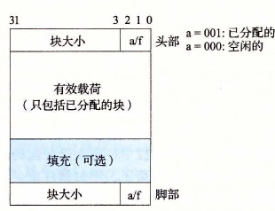
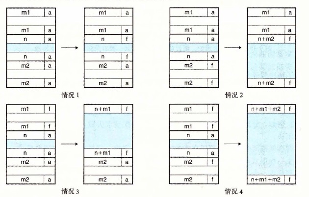

# 9.9.11 带边界标记的合并

分配器是如何实现合并的？让我们称想要释放的块为当前块。那么，合并（内存中的）下一个空闲块很简单而且高效。当前块的头部指向下一个块的头部，可以检查这个指针以判断下一个块是否是空闲的。如果是，就将它的大小简单地加到当前块头部的大小上，这两个块在常数时间内被合并。

但是我们该如何合并前面的块呢？给定一个带头部的隐式空闲链表，唯一的选择将是搜索整个链表，记住前面块的位置，直到我们到达当前块。使用隐式空闲链表，这意味着每次调用 `free` 需要的时间都与堆的大小成线性关系。即使使用更复杂精细的空闲链表组织，搜索时间也不会是常数。

Knuth 提出了一种聪明而通用的技术，叫做边界标记（boundary tag），允许在常数时间内进行对前面块的合并。这种思想，如图 9-39 所示，是在每个块的结尾处添加一个脚部（footer，边界标记），其中脚部就是头部的一个副本。如果每个块包括这样一个脚部，那么分配器就可以通过检查它的脚部，判断前面一个块的起始位置和状态，这个脚部总是在距当前块开始位置一个字的距离。

**图 9-39** 使用边界标记的堆块的格式

考虑当分配器释放当前块时所有可能存在的情况：

1. 前面的块和后面的块都是已分配的。
2. 前面的块是已分配的，后面的块是空闲的。
3. 前面的块是空闲的，而后面的块是已分配的。
4. 前面的和后面的块都是空闲的。

图 9-40 展示了我们如何对这四种情况进行合并。

**图 9-40** 使用边界标记的合并（情况 1：前面的和后面块都已分配。情况 2：前面块已分配，后面块空闲。情况 3：前面块空闲，后面块已分配。情况 4：后面块和前面块都空闲）

在情况 1 中，两个邻接的块都是已分配的，因此不可能进行合并。所以当前块的状态只是简单地从已分配变成空闲。在情况 2 中，当前块与后面的块合并。用当前块和后面块的大小的和来更新当前块的头部和后面块的脚部。在情况 3 中，前面的块和当前块合并。用两个块大小的和来更新前面块的头部和当前块的脚部。在情况 4 中，要合并所有的三个块形成一个单独的空闲块，用三个块大小的和来更新前面块的头部和后面块的脚部。在每种情况中，合并都是在常数时间内完成的。

边界标记的概念是简单优雅的，它对许多不同类型的分配器和空闲链表组织都是通用的。然而，它也存在一个潜在的缺陷。它要求每个块都保持一个头部和一个脚部，在应用程序操作许多个小块时，会产生显著的内存开销。例如，如果一个图形应用通过反复调用 `malloc` 和 `free` 来动态地创建和销毁图形节点，并且每个图形节点都只要求两个内存字，那么头部和脚部将占用每个已分配块的一半的空间。

幸运的是，有一种非常聪明的边界标记的优化方法，能够使得在已分配块中不再需要脚部。回想一下，当我们试图在内存中合并当前块以及前面的块和后面的块时，只有在前面的块是空闲时，才会需要用到它的脚部。如果我们把前面块的已分配/空闲位存放在当前块中多出来的低位中，那么已分配的块就不需要脚部了，这样我们就可以将这个多出来的空间用作有效载荷了。不过请注意，空闲块仍然需要脚部。

> **练习题 9.7** 确定下面每种对齐要求和块格式的组合的最小的块大小。假设：隐式空闲链表，不允许有效载荷为零，头部和脚部存放在 4 字节的字中。
>
> | 对齐要求 | 已分配的块 | 空闲块 | 最小块大小（字节） |
> | --- | --- | --- | --- |
> | 单字 | 头部和脚部 | 头部和脚部 |  |
> | 单字 | 头部，但是无脚部 | 头部和脚部 |  |
> | 双字 | 头部和脚部 | 头部和脚部 |  |
> | 双字 | 头部，但是没有脚部 | 头部和脚部 |  |
