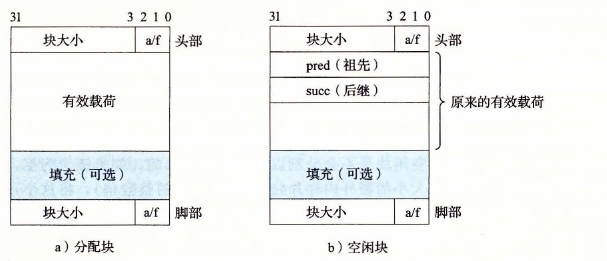

# 9.9.13 显式空闲链表

隐式空闲链表为我们提供了一种介绍一些基本分配器概念的简单方法。然而，因为块分配与堆块的总数呈线性关系，所以对于通用的分配器，隐式空闲链表是不适合的（尽管对于堆块数量预先就知道是很小的特殊的分配器来说它是可以的）。

一种更好的方法是将空闲块组织为某种形式的显式数据结构。因为根据定义，程序不需要一个空闲块的主体，所以实现这个数据结构的指针可以存放在这些空闲块的主体里面。例如，堆可以组织成一个双向空闲链表，在每个空闲块中，都包含一个 `pred`（前驱）和 `succ`（后继）指针，如图 9-48 所示。

**图 9-48** 使用双向空闲链表的堆块的格式

使用双向链表而不是隐式空闲链表，使首次适配的分配时间从块总数的线性时间减少到了空闲块数量的线性时间。不过，释放一个块的时间可以是线性的，也可能是个常数，这取决于我们所选择的空闲链表中块的排序策略。

一种方法是用后进先出（LIFO）的顺序维护链表，将新释放的块放置在链表的开始处。使用 LIFO 的顺序和首次适配的放置策略，分配器会最先检查最近使用过的块。在这种情况下，释放一个块可以在常数时间内完成。如果使用了边界标记，那么合并也可以在常数时间内完成。

另一种方法是按照地址顺序来维护链表，其中链表中每个块的地址都小于它后继的地址。在这种情况下，释放一个块需要线性时间的搜索来定位合适的前驱。平衡点在于，按照地址排序的首次适配比 LIFO 排序的首次适配有更高的内存利用率，接近最佳适配的利用率。

一般而言，显式链表的缺点是空闲块必须足够大，以包含所有需要的指针，以及头部和可能的脚部。这就导致了更大的最小块大小，也潜在地提高了内部碎片的程度。
