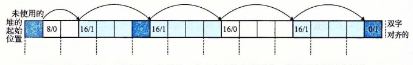

# 9.9.8 分割空闲块

一旦分配器找到一个匹配的空闲块，它就必须做另一个策略决定，那就是分配这个空闲块中多少空间。一个选择是用整个空闲块。虽然这种方式简单而快捷，但是主要的缺点就是它会造成内部碎片。如果放置策略趋向于产生好的匹配，那么额外的内部碎片也是可以接受的。

然而，如果匹配不太好，那么分配器通常会选择将这个空闲块分割为两部分。第一部分变成分配块，而剩下的变成一个新的空闲块。图 9-37 展示了分配器如何分割图 9-36 中 8 个字的空闲块，来满足一个应用的对堆内存 3 个字的请求。

**图 9-37** 分割一个空闲块，以满足一个 3 个字的分配请求。阴影部分是已分配块。没有阴影的部分是空闲块。头部标记为（大小（字节）/已分配位）
