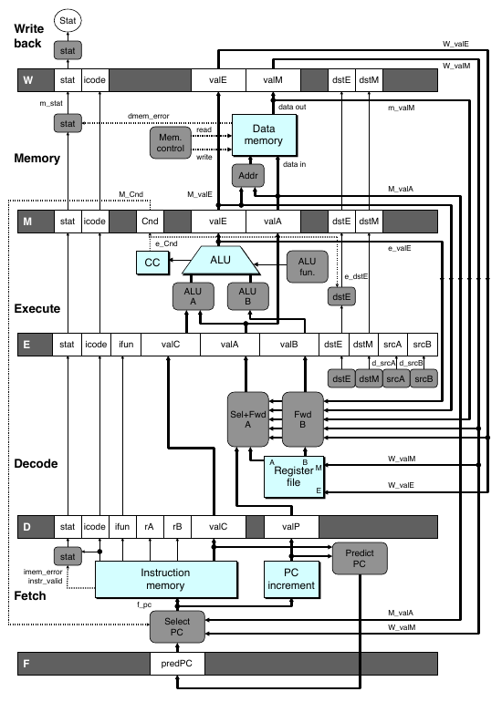
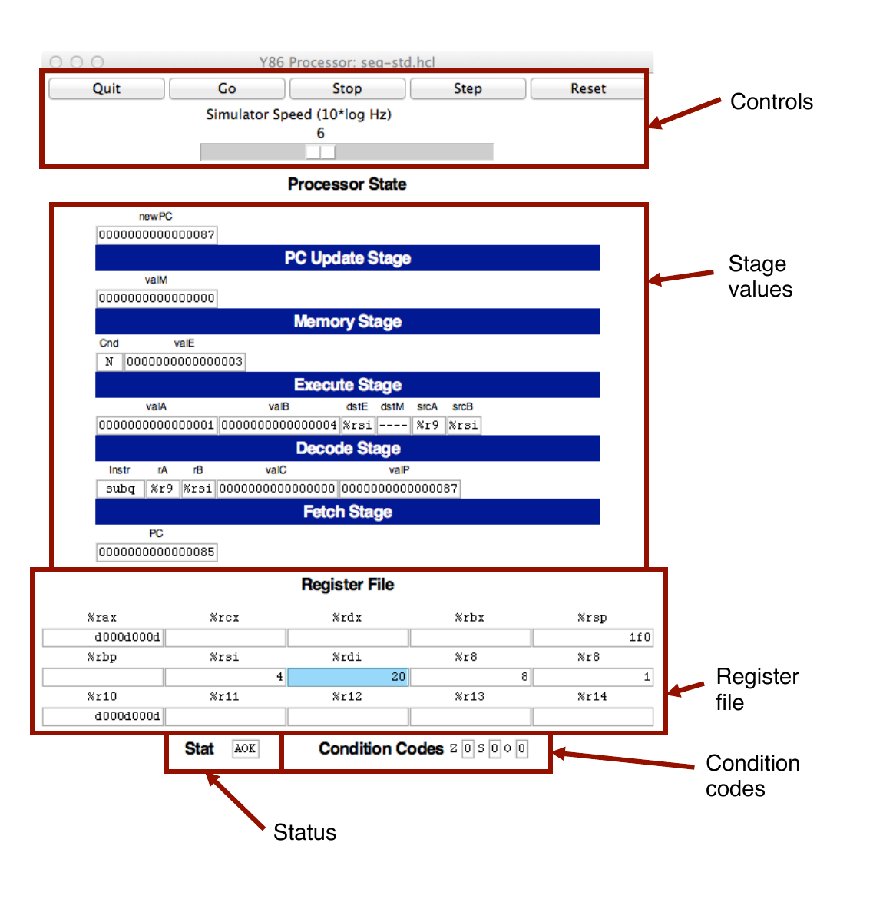
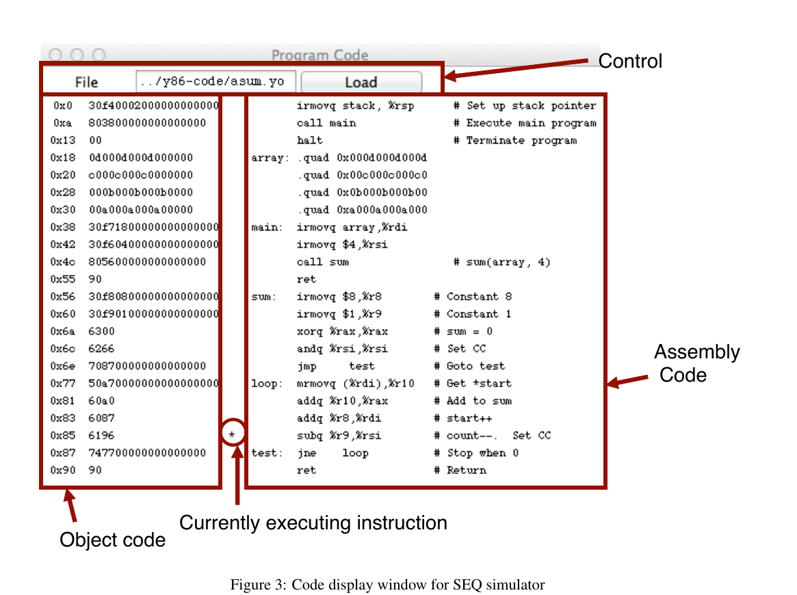
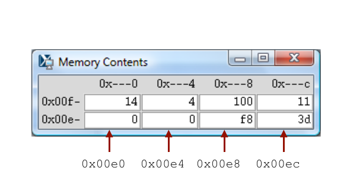
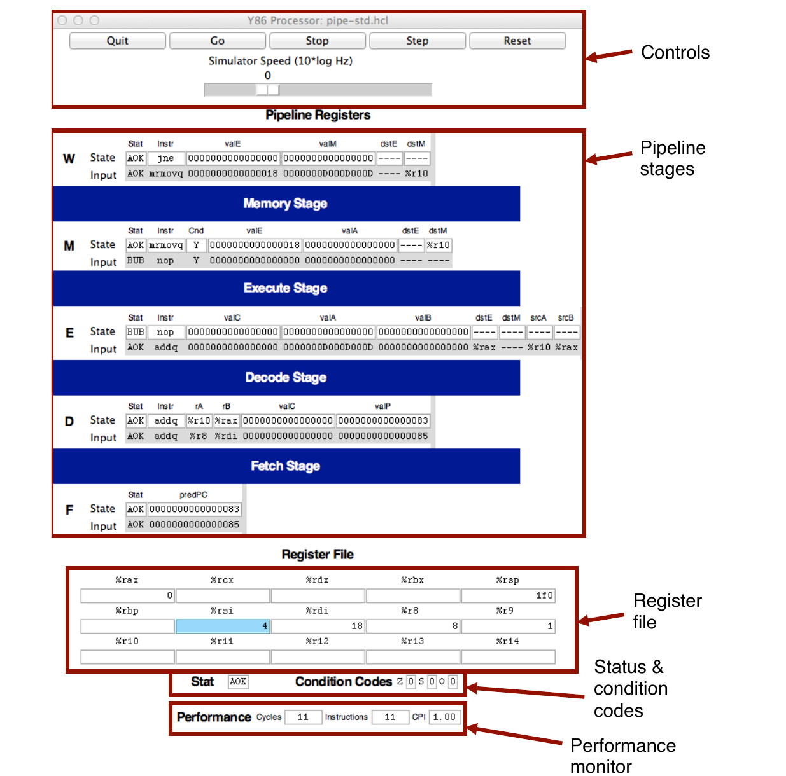
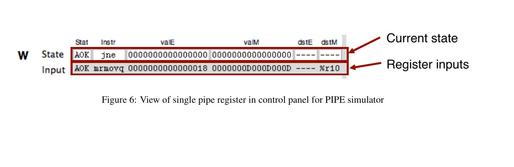
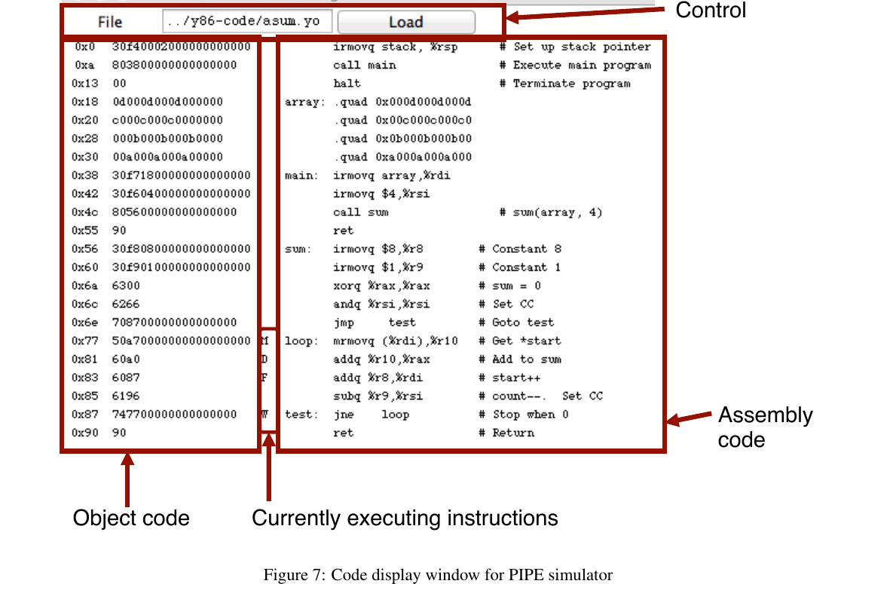

# CS:APP3e Y86-64 处理器模拟器指南

**Randal E. Bryant**  
**David R. O'Hallaron**  
**2015 年 4 月 1 日**

> 版权所有 (c) 2002、2011、2015 R. E. Bryant、D. R. O'Hallaron。保留所有权利。



本文介绍《深入理解计算机系统（原书第 3 版）》第 4 章讲解 Y86-64 处理器体系结构时配套使用的处理器模拟器。这些模拟器对三种不同的处理器设计进行建模：SEQ、SEQ+ 和 PIPE。

## 1 安装

模拟器代码以名为 `sim.tar` 的 tar 格式文件发布。你可以从 CS:APP3e 网站（`csapp.cs.cmu.edu`）获取该文件。

将 tar 文件放到准备安装代码的目录中后，应当可以执行以下操作：

```console
linux> tar xf sim.tar
linux> cd sim
linux> make clean
linux> make
```

默认情况下，这些命令会生成模拟器的 GUI（图形用户界面）版本，因此系统中必须安装 Tcl/Tk。如果没有安装 Tcl/Tk，也可以只安装 TTY 版本；该版本会以 ASCII 文本形式将输出写到标准输出。有关生成 GUI 和 TTY 版本的方法，请参阅 `README` 文件。

`sim` 目录包含以下子目录：

- **`misc`**：YAS（Y86-64 汇编器）、YIS（Y86-64 指令集模拟器）和 HCL2C（HCL 到 C 的转换器）等实用程序的源代码文件。其中还包含所有处理器模拟器都会使用的源文件 `isa.c`。
- **`seq`**：SEQ 和 SEQ+ 模拟器的源代码。包含家庭作业题 4.52 所需的 HCL 文件。有关编译各个模拟器版本的方法，请参阅 `README` 文件。
- **`pipe`**：PIPE 模拟器的源代码。包含家庭作业题 4.54--4.58 所需的 HCL 文件。有关编译各个模拟器版本的方法，请参阅 `README` 文件。
- **`y86-code`**：本章许多示例程序的 Y86-64 汇编代码。你可以用这些基准程序自动测试修改后的模拟器。有关运行测试的方法，请参阅 `README` 文件。本文将使用该子目录中的 `asum.ys` 程序作为贯穿全文的示例。该程序见 CS:APP3e 图 4-7，其编译结果见图 1。
- **`ptest`**：用于系统生成回归测试的脚本，覆盖不同指令、不同跳转情况和不同冒险情况。这些脚本非常善于发现作业解答中的错误。有关运行测试的方法，请参阅 `README` 文件。

```text
 1 | # 从地址 0 开始执行
 2 0x000: | .pos 0
 3 0x000: 30f40002000000000000 | irmovq stack, %rsp # 设置栈指针
 4 0x00a: 803800000000000000   | call main          # 执行 main 程序
 5 0x013: 00                   | halt               # 终止程序
 6 |
 7 | # 含 4 个元素的数组
 8 0x018: | .align 8
 9 0x018: 0d000d000d000000 | array: .quad 0x000d000d000d
10 0x020: c000c000c0000000 |        .quad 0x00c000c000c0
11 0x028: 000b000b000b0000 |        .quad 0x0b000b000b00
12 0x030: 00a000a000a00000 |        .quad 0xa000a000a000
13 |
14 0x038: 30f71800000000000000 | main: irmovq array,%rdi
15 0x042: 30f60400000000000000 |       irmovq $4,%rsi
16 0x04c: 805600000000000000   |       call sum       # sum(array, 4)
17 0x055: 90                   |       ret
18 |
19 | # long sum(long *start, long count)
20 | # start 位于 %rdi，count 位于 %rsi
21 0x056: 30f80800000000000000 | sum:  irmovq $8,%r8   # 常数 8
22 0x060: 30f90100000000000000 |       irmovq $1,%r9   # 常数 1
23 0x06a: 6300                 |       xorq %rax,%rax  # sum = 0
24 0x06c: 6266                 |       andq %rsi,%rsi  # 设置条件码
25 0x06e: 708700000000000000   |       jmp test       # 转到 test
26 0x077: 50a70000000000000000 | loop: mrmovq (%rdi),%r10 # 取 *start
27 0x081: 60a0                 |       addq %r10,%rax  # 加到 sum
28 0x083: 6087                 |       addq %r8,%rdi   # start++
29 0x085: 6196                 |       subq %r9,%rsi   # count--，设置条件码
30 0x087: 747700000000000000   | test: jne loop       # 为 0 时停止
31 0x090: 90                   |       ret            # 返回
32 |
33 | # 栈从这里开始，并向较小的地址增长
34 0x200: | .pos 0x200
35 0x200: | stack:
```

**图 1：目标代码文件示例。** 这段代码位于 `y86-code` 子目录中的 `asum.yo` 文件内。

## 2 实用程序

安装完成后，`misc` 目录中会包含两个实用程序：

### YAS

YAS 是 Y86-64 汇编器。它接收扩展名为 `.ys` 的 Y86-64 汇编代码文件，并生成扩展名为 `.yo` 的文件。生成的文件包含目标代码的 ASCII 表示形式，如图 1 所示（与 CS:APP3e 图 4-8 中的程序相同，只是格式略有不同）。调用汇编器最简便的方法是在 `y86-code` 子目录中使用或创建汇编代码文件。例如，要汇编该目录中的 `asum.ys`，可以使用：

```console
linux> make asum.yo
```

### YIS

YIS 是 Y86-64 指令模拟器。它按照指令集定义执行 Y86-64 机器级程序中的指令。例如，假设要在 `y86-code` 子目录中运行程序 `asum.yo`，只需执行：

```console
linux> ../misc/yis asum.yo
```

YIS 会模拟程序的执行，然后在终端上打印所有发生变化的寄存器或内存位置，具体参见 CS:APP3e 第 4.1 节。

## 3 处理器模拟器

针对 SEQ、SEQ+ 和 PIPE 这三种处理器，分别提供了模拟器 SSIM、SSIM+ 和 PSIM。每个模拟器都可以在 TTY 或 GUI 模式下运行：

- **TTY 模式**：使用面向终端的最简界面，全部信息都打印到终端输出。它不太便于调试，但可以安装在任何系统上，也可以用于自动化测试。所有模拟器默认都使用此模式。
- **GUI 模式**：具有下文将介绍的图形用户界面。它非常有助于观察处理器活动以及调试修改后的设计版本。系统中必须安装 Tcl/Tk。通过命令行选项 `-g` 启用。GUI 模式只能从可执行模拟器程序所在的目录（`pipe` 或 `seq`）中运行。

### 3.1 模拟器命令行选项

三个模拟器都可以通过命令行指定若干选项：

- **`-h`**：打印所有命令行选项的摘要。
- **`-g`**：以 GUI 模式运行模拟器（默认模式为 TTY）。
- **`-t`**（仅限 TTY 模式）：同时运行处理器模拟器和 ISA 模拟器，并比较二者得到的内存、寄存器文件和条件码。如果没有发现差异，则打印消息 `ISA Check Succeeds`；否则打印寄存器文件或内存中不同字的信息。该功能对测试处理器设计非常有用。
- **`-l m`**（仅限 TTY 模式）：设置指令数上限；在停止前最多执行 `m` 条指令（默认上限为 10,000 条）。
- **`-v n`**（仅限 TTY 模式）：将详细程度设置为 `n`；`n` 必须介于 0 和 2 之间，默认值为 2。

以 GUI 模式运行的模拟器必须在命令行中给出目标文件名。在 TTY 模式下，目标文件名可以省略，默认从标准输入读取。

以下是在 `seq` 子目录中调用模拟器的几个典型示例：

```console
linux> ./ssim -h
linux> ./ssim+ -t < ../y86-code/asum.yo
linux> ./ssim -g ../y86-code/asum.yo
```

第一条命令打印 SSIM 的命令行选项摘要。第二条命令在 TTY 模式下运行 SSIM+，从标准输入读取目标文件 `asum.yo`，并将得到的寄存器值和内存值与较高层 ISA 模拟器的结果进行比较。第三条命令以 GUI 模式运行 SSIM，执行 `y86-code` 子目录中目标代码文件 `asum.yo` 的指令。在 `pipe` 子目录中，可以用相同方式调用 PIPE 模拟器 PSIM。

### 3.2 SEQ 模拟器的 GUI 版本

在 `seq` 子目录中，通过命令行给出目标代码文件名即可启动 SEQ 处理器模拟器的 GUI 版本：

```console
linux> ./ssim -g ../y86-code/asum.yo &
```

命令行末尾的 `&` 使模拟器在后台运行。模拟程序启动后会创建三个窗口，如图 2--4 所示。

第一个窗口（图 2）是主控制面板。如果 HCL 文件由 HCL2C 使用 `-n name` 选项编译，主控制窗口的标题将显示为 `Y86-64 Processor: name`；否则只显示 `Y86-64 Processor`。

主控制窗口中既有控制模拟器的按钮，也有处理器状态信息。图中各部分的含义如下：



**图 2：SEQ 模拟器的主控制面板。** 图中标注依次为：`Controls`（控制区）、`Stage values`（阶段值）、`Register file`（寄存器文件）、`Condition codes`（条件码）和 `Status`（状态）。

- **控制区（Control）**：顶部按钮用于控制模拟器。单击 `Quit` 退出；单击 `Go` 开始运行；单击 `Stop` 暂停；单击 `Step` 执行一条指令后停止；单击 `Reset` 返回初始状态。初始状态下，程序计数器位于地址 0，寄存器全部清零，除程序所占区域外的内存被清空，条件码设置为 ZF = 1、CF = 0、OF = 0，程序状态设置为 AOK。按钮下方的滑块用于在模拟器运行时控制速度；向右移动会使模拟器运行得更快。这里的 `CF` 按原文保留；同页后文将三个条件码列为 ZF、SF 和 OF。
- **阶段值（Stage values）**：显示当前指令求值期间不同处理器信号的值。这些信号几乎与 CS:APP3e 图 4-23 中的信号完全相同。主要区别在于，模拟器会在标为 `Instr` 的字段中显示指令名称，而不是 `icode` 和 `ifun` 的数值。类似地，所有寄存器标识符都以名称显示，而不是数值；`----` 表示不需要访问寄存器。
- **寄存器文件（Register file）**：显示 15 个程序寄存器的值。最近更新的寄存器以浅蓝色突出显示。寄存器内容只有在首次被设置为非零值后才会显示。请注意，当一条指令写程序寄存器时，寄存器文件要到下一个时钟周期开始时才会更新。因此，必须让模拟器再单步执行一次，才能看到更新发生。
- **状态（Stat）**：显示当前正在执行的指令状态。可能的值如下：
  - **AOK**：未遇到问题。
  - **ADR**：读取指令或读写数据时发生寻址错误。地址不得超过 `0x0FFF`。
  - **INS**：遇到非法指令。
  - **HLT**：遇到 `halt` 指令。
- **条件码（Condition codes）**：显示三个条件码 ZF、SF 和 OF 的值。请注意，当一条指令改变条件码时，条件码寄存器要到下一个时钟周期开始时才会更新。因此，必须让模拟器再单步执行一次，才能看到更新发生。

图 2 所示的处理器状态对应图 1 中 `asum.yo` 程序第 29 行的第一次执行。可以看到，程序计数器为 `0x085`，正在处理指令 `addq %r8, %rdi`；寄存器 `%rax` 保存 `0xd000d000d`，即第一个数组元素的和；`%rsi` 保存 4，即即将被递减的计数。寄存器 `%rdi` 保存 `0x020`，即第二个数组元素的地址。当前还有一次将 `0x03` 写入 `%rsi` 的待处理操作（因为 `dstE` 被设置为 `%rsi`，而 `valE` 被设置为 `0x03`）。这次写入会在下一个时钟周期开始时发生。



**图 3：SEQ 模拟器的代码显示窗口。** 图中标注为：`Control`（控制区）、`Object code`（目标代码）、`Assembly Code`（汇编代码）和 `Currently executing instruction`（当前正在执行的指令）。

图 3 所示窗口显示模拟器正在执行的目标代码文件。编辑框标识当前程序的文件名。可以在该窗口中编辑文件名，再单击 `Load` 按钮载入新程序。显示区左侧是正在执行的目标代码，右侧是汇编代码文件中的文本；中间用星号（`*`）指出当前正在模拟的指令。这里对应图 1 中 `asum.yo` 程序的第 29 行。



**图 4：SEQ 模拟器的内存显示窗口。** 图中箭头文字为 `0x00e0`、`0x00e4`、`0x00e8` 和 `0x00ec`；正文随后把该示例中的栈位置描述为 `0x01f0` 和 `0x01f8`。图文差异按原 PDF 保留。

图 4 所示窗口显示内存内容。它只显示程序开始执行后发生过变化的地址范围，即最小已变地址与最大已变地址之间的位置。每一行显示两个内存字的内容，也就是 16 个内存字节；这些字节地址之间只有最低十六进制位不同。内存值左侧是“根”地址，其最低位以 `-` 显示。每列分别对应最低地址位为 `0x0` 和 `0x8` 的字。原图示例中的箭头指出内存位置 `0x01f0` 和 `0x01f8`。

图中的内存内容是图 1 所示 `asum.yo` 程序执行 `sum` 过程时的栈内容。根据到此时为止发生的栈操作可以看出，`%rsp` 在第 3 行被初始化为 `0x200`。第 4 行对 `main` 的调用将返回指针 `0x013` 压栈，写入地址 `0x01f8`。过程 `main` 在第 16 行调用 `sum`，使返回指针 `0x055` 被写入地址 `0x01f0`。这就解释了该内存窗口中显示的所有字，也解释了为什么栈指针被设置为 `0x01f0`。

### 3.3 PIPE 模拟器

PIPE 模拟器同样会生成三个窗口。图 5 显示其控制面板。它具有相同的一组控制按钮，也同样显示寄存器文件、状态和条件码。中间部分显示流水线寄存器的状态，各字段与 CS:APP3e 图 4-52 中的字段对应。面板底部还会显示已经模拟的周期数（不包括让流水线开始流动所需的初始周期）、已经完成的指令数，以及由此得到的 CPI。



**图 5：PIPE 模拟器的主控制面板。** 图中标注为：`Controls`（控制区）、`Pipeline stages`（流水线阶段）、`Register file`（寄存器文件）、`Status & condition codes`（状态与条件码）和 `Performance monitor`（性能监视器）。

如图 6 的局部放大图所示，每个流水线寄存器分为两部分显示。白色方框中的上排数值是流水线寄存器的当前值；灰色背景中的下排数值是流水线寄存器的输入。除非该寄存器被插入气泡或暂停，否则这些输入会在下一个时钟周期装入寄存器。



**图 6：PIPE 模拟器控制面板中的单个流水线寄存器。** `Current state` 表示当前状态，`Register inputs` 表示寄存器输入。

PIPE 模拟器中的数值流动与 SEQ 模拟器很不相同。对于 SEQ，控制面板显示执行一条指令得到的数值，模拟器每执行一步就完成一整条指令。对于 PIPE，控制面板显示同时流经流水线的多条指令的数值，模拟器每执行一步只为每条指令完成一个阶段的计算。



**图 7：PIPE 模拟器的代码显示窗口。** 格式与 SEQ 类似，但不是只用一个标记指出正在执行的指令，而是用 `F`、`D`、`E`、`M` 和 `W` 指出分别位于取指、译码、执行、访存和写回阶段的指令。图中其余标注为：`Control`（控制区）、`Object code`（目标代码）、`Assembly code`（汇编代码）和 `Currently executing instructions`（当前正在执行的指令）。

PIPE 模拟器还会生成一个显示内存内容的窗口，其格式与 SEQ 的内存窗口（图 4）完全相同。

图 5 和图 7 显示执行图 1 第 26--30 行循环时的流水线状态。模拟器先跳到测试部分（第 30 行），随后已经开始循环的第一次迭代。各阶段的状态如下：

- **写回（Write back）**：初始测试中的 `jne` 指令（第 30 行）即将完成。
- **访存（Memory）**：`mrmovq` 指令（第 26 行）刚刚从地址 `0x018` 读出 `0x0D000D000D`。在流水线寄存器 M 的 `valE` 中可以看到该地址，在流水线寄存器 W 的 `valM` 输入处可以看到从内存读出的值。
- **执行（Execute）**：该阶段包含一个气泡。由于 `mrmovq` 指令（第 26 行）和 `addq` 指令（第 27 行）之间存在加载/使用相关，因此插入了这个气泡。可以看到，该气泡的行为与 `nop` 指令相同。这解释了图 7 中为什么没有标为 `E` 的指令。
- **译码（Decode）**：`addq` 指令（第 27 行）刚刚从寄存器 `%rax` 读出 `0x0`。它还从寄存器 `%r10` 读出了 `0x00D`，但转发逻辑改为使用刚刚从内存读出的 `0x0D000D000D`（可在流水线寄存器 W 的 `valM` 输入处看到）作为 `valA` 的新值（可在流水线寄存器 E 的 `valA` 输入处看到）。
- **取指（Fetch）**：刚刚从地址 `0x083` 取出一条 `addq` 指令（第 28 行），预测的新 PC 值为 `0x085`。

每个阶段都有一个状态字段 `Stat`，用于显示该流水线阶段中指令的状态。AOK 表示没有遇到异常；BUB 表示该阶段中是一个气泡，而不是正常指令。其他可能的状态值包括：ADR，引用了无效内存位置；INS，遇到非法指令编码；PIP，流水线中出现问题（当某个流水线寄存器的暂停信号和气泡信号同时被置为 1 时发生）；HLT，遇到 `halt` 指令。当后四种情况中的任何一种到达写回阶段时，模拟器都会停止。

将单条指令的状态与该指令的其余信息一起在流水线中传递，可以精确处理不同的异常条件，具体参见 CS:APP3e 第 4.5.6 节。

## 4 一些建议

下面是使用这些模拟器积累的一些零散经验。

- **熟悉模拟器的操作。** 尝试运行 `y86-code` 目录中的一些示例程序。对于较小的示例，要确保理解每条指令的处理过程。留意分支预测错误、加载互锁和过程返回等有意思的情况。
- **需要在不同位置查找信息。** 数据转发的效果尤其难以观察。流水线寄存器 E 的信号 `valA` 有 7 个可能来源，信号 `valB` 有 6 个可能来源。要判断实际选择了哪一个来源，需要把这些流水线寄存器字段的输入与所有可能来源的值进行比较。可能的来源如下：

| 来源 | 含义 |
|---|---|
| `R[d_srcA]` | 源寄存器由流水线寄存器 E 中 `srcA` 的输入标识；寄存器内容显示在面板底部。 |
| `R[d_srcB]` | 源寄存器由流水线寄存器 E 中 `srcB` 的输入标识；寄存器内容显示在面板底部。 |
| `D_valP` | 该值是流水线寄存器 D 状态的一部分。 |
| `e_valE` | 该值位于流水线寄存器 M 的 `valE` 字段输入处。 |
| `M_valE` | 该值是流水线寄存器 M 状态的一部分。 |
| `m_valM` | 该值位于流水线寄存器 W 的 `valM` 字段输入处。 |
| `W_valE` | 该值是流水线寄存器 W 状态的一部分。 |
| `W_valM` | 该值是流水线寄存器 M 状态的一部分（原文如此）。 |

- **不要覆盖自己的代码。** 数据和代码共享同一地址空间，因此程序很容易覆盖部分代码，并在尝试执行被覆盖的指令时造成完全混乱。必须把栈设置在离代码足够远的位置，避免发生这种情况。
- **避免使用过大的地址值。** 模拟器不允许任何地址大于 `0x0FFF`。此外，如果修改的内存位置跨越很大的地址范围，内存显示窗口也会变得难以使用。
- **注意 GUI 模式模拟器（SSIM、SSIM+ 和 PSIM）的一些“特性”。**
  - 必须从模拟器各自所在的目录执行程序。也就是说，运行 SSIM 或 SSIM+ 时必须位于 `seq` 目录；运行 PSIM 时必须位于 `pipe` 子目录。这是因为 Tcl 解释器会按这种方式查找模拟器的配置文件。
  - 如果在 Unix 机器上以 GUI 模式运行，请记得初始化 `DISPLAY` 环境变量：

    ```console
    unix> setenv DISPLAY myhost.edu:0
    ```

  - 对于某些 Unix X 窗口管理器，`Program Code`（程序代码）窗口启动时只是一个收起的图标。如果模拟器启动后看不到该窗口，需要单击图标手动展开。
  - 对于某些 Microsoft Windows X 服务器，`Memory Contents`（内存内容）窗口不会在内存内容变化时自动调整大小。这种情况下，需要手动调整窗口大小才能看到内存内容。
  - 如果要求模拟器执行一个无效的 Y86-64 目标文件，模拟器会因段错误而终止。
