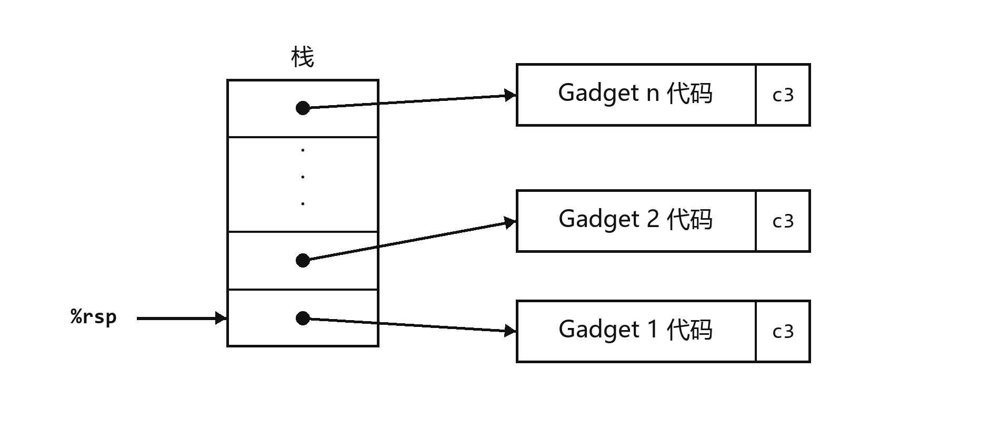
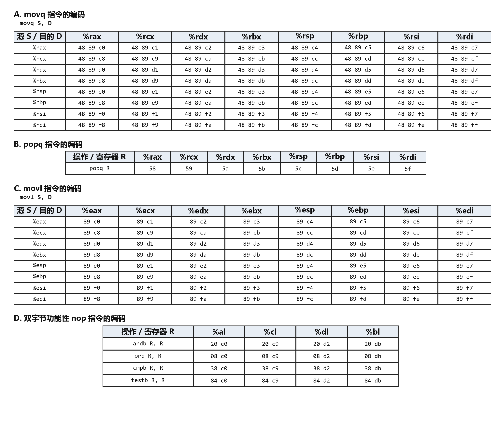

# Attack Lab：理解缓冲区溢出漏洞

原文：[官方实验说明](https://csapp.cs.cmu.edu/3e/attacklab.pdf)  
实验包：[target1.tar](target1.tar)

自学包说明：[运行配置与原说明的差异](../COMPATIBILITY.md)

**15-213，20xx 秋季**

布置时间：9 月 29 日，星期二  
截止时间：10 月 8 日，星期四，美国东部夏令时间 23:59  
最晚提交时间：10 月 11 日，星期日，美国东部夏令时间 23:59

> 译注：课程日期及下文的课程专用地址或占位符来自官方说明模板，不是本仓库的截止日期或提交要求。

## 1 引言

本实验要求你针对两个具有不同安全漏洞的程序，总共实施五次攻击。完成本实验后，你将获得以下收获：

- 你将了解：当程序没有充分防范缓冲区溢出时，攻击者可以采用哪些不同方式利用其中的安全漏洞。
- 通过这些实践，你将更好地理解如何编写更安全的程序，以及编译器和操作系统提供了哪些机制来降低程序遭受攻击的可能性。
- 你将更深入地理解 x86-64 机器代码中的栈和参数传递机制。
- 你将更深入地理解 x86-64 指令的编码方式。
- 你将获得更多使用 GDB、OBJDUMP 等调试工具的经验。

**注意：** 在本实验中，你将亲身体验利用操作系统和网络服务器安全弱点的方法。我们的目的是帮助你学习程序在运行时的工作方式，并理解这些安全弱点的本质，从而在编写系统代码时避免它们。我们不赞同使用任何其他形式的攻击来未经授权地访问任何系统资源。

建议学习《深入理解计算机系统（第 3 版）》第 3.10.3 节和第 3.10.4 节，作为本实验的参考材料。

## 2 实验安排

和往常一样，这是一个个人项目。你将针对专门为你定制生成的目标程序实施攻击。

### 2.1 获取文件

在 Web 浏览器中访问以下地址即可获取你的文件：

```text
http://$Attacklab::SERVER_NAME:15513/
```

> **教师说明：** `$Attacklab::SERVER_NAME` 是运行 Attack Lab 服务器的机器。你需要在 `attacklab/Attacklab.pm` 和 `attacklab/src/build/driverhdrs.h` 中定义它。

服务器会构建你的文件，并通过浏览器返回一个名为 `targetk.tar` 的 tar 文件，其中 `k` 是你的目标程序的唯一编号。

**注意：** 构建和下载目标文件需要几秒钟，请耐心等待。

将 `targetk.tar` 保存到你准备开展实验的某个受保护 Linux 目录中，然后执行命令 `tar -xvf targetk.tar`。该命令会解压出目录 `targetk`，其中包含下述文件。

你只应下载一套文件。如果由于某种原因下载了多个目标，请选择其中一个目标进行实验，并删除其余目标。

**警告：** 如果你在 PC 上解压 `targetk.tar`，例如使用 WinZip 或让浏览器自动解压，可能会重置可执行文件的权限位。

`targetk` 中的文件包括：

- `README.txt`：说明目录内容的文件。
- `ctarget`：易受代码注入攻击的可执行程序。
- `rtarget`：易受面向返回编程攻击的可执行程序。
- `cookie.txt`：一个 8 位十六进制代码，在攻击中用作你的唯一标识符。
- `farm.c`：你的目标程序中“gadget 农场”的源代码；生成面向返回编程攻击时会用到它。
- `hex2raw`：用于生成攻击字符串的工具。

在后续说明中，我们假定你已将这些文件复制到一个受保护的本地目录，并且会在该目录中执行程序。

### 2.2 重要事项

下面汇总了本实验中关于有效解答的一些重要规则。第一次阅读本文档时，这些规则可能不太容易理解。开始实验后，你可以把这里作为统一的规则参考。

- 你必须在与生成目标程序所用机器相似的机器上完成本实验。
- 你的解答不得通过攻击绕过程序中的验证代码。具体来说，攻击字符串中供 `ret` 指令使用的任何地址，都应当指向以下目标之一：
  - 函数 `touch1`、`touch2` 或 `touch3` 的地址。
  - 你所注入代码的地址。
  - gadget 农场中某个 gadget 的地址。
- 你只能使用 `rtarget` 文件中地址位于函数 `start_farm` 和 `end_farm` 之间的代码来构造 gadget。

## 3 目标程序

`CTARGET` 和 `RTARGET` 都从标准输入读取字符串。它们使用下面定义的函数 `getbuf` 来完成读取：

```c
unsigned getbuf()
{
    char buf[BUFFER_SIZE];
    Gets(buf);
    return 1;
}
```

函数 `Gets` 与标准库函数 `gets` 类似：它从标准输入读取一个字符串（以 `\n` 或文件结束符终止），并将其连同结尾的空字符一起保存到指定目标位置。在这段代码中，目标位置是数组 `buf`，声明的大小为 `BUFFER_SIZE` 字节。生成目标程序时，`BUFFER_SIZE` 是一个针对你的程序版本确定的编译时常量。

函数 `Gets()` 和 `gets()` 都无法判断目标缓冲区是否足够大，能否容纳所读取的字符串。它们只是复制字节序列，因此可能越过为目标位置分配的存储空间边界。

如果用户输入并由 `getbuf` 读取的字符串足够短，那么 `getbuf` 显然会返回 1，如下面的运行示例所示：

```text
unix> ./ctarget
Cookie: 0x1a7dd803
Type string: Keep it short!
No exploit. Getbuf returned 0x1
Normal return
```

通常，输入较长字符串时会发生错误：

```text
unix> ./ctarget
Cookie: 0x1a7dd803
Type string: This is not a very interesting string, but it has the property ...
Ouch!: You caused a segmentation fault!
Better luck next time
```

（注意：示例中显示的 cookie 值会与你的不同。）程序 `RTARGET` 的行为相同。正如错误消息所示，缓冲区溢出通常会破坏程序状态，进而导致内存访问错误。你的任务是更巧妙地设计提供给 `CTARGET` 和 `RTARGET` 的字符串，使程序执行一些更有意思的操作。这些字符串称为攻击字符串（exploit strings）。

`CTARGET` 和 `RTARGET` 都接受以下几个不同的命令行参数：

- `-h`：打印可用命令行参数列表。
- `-q`：不向评分服务器发送结果。
- `-i FILE`：从文件而非标准输入读取输入。

攻击字符串通常包含与可打印字符的 ASCII 值不对应的字节值。程序 `HEX2RAW` 可以帮助你生成这种原始字符串。有关 `HEX2RAW` 的使用方法，请参阅附录 A。

**重要事项：**

- 攻击字符串的中间位置不得包含字节值 `0x0a`，因为它是换行符（`\n`）的 ASCII 编码。`Gets` 遇到该字节时，会认为你想要终止字符串。
- `HEX2RAW` 要求使用两位十六进制数，并以一个或多个空白字符分隔。因此，若要生成十六进制值为 0 的字节，必须写成 `00`。若要生成字 `0xdeadbeef`，应向 `HEX2RAW` 输入 `ef be ad de`（注意，小端字节序要求反转字节顺序）。

正确解决某一级别后，目标程序会自动向评分服务器发送通知。例如：

```text
unix> ./hex2raw < ctarget.l2.txt | ./ctarget
Cookie: 0x1a7dd803
Type string:Touch2!: You called touch2(0x1a7dd803)
Valid solution for level 2 with target ctarget
PASSED: Sent exploit string to server to be validated.
NICE JOB!
```

| 阶段 | 程序 | 级别 | 方法 | 函数 | 分值 |
|---:|---|---:|:---:|---|---:|
| 1 | CTARGET | 1 | CI | `touch1` | 10 |
| 2 | CTARGET | 2 | CI | `touch2` | 25 |
| 3 | CTARGET | 3 | CI | `touch3` | 25 |
| 4 | RTARGET | 2 | ROP | `touch2` | 35 |
| 5 | RTARGET | 3 | ROP | `touch3` | 5 |

CI：代码注入（Code Injection）  
ROP：面向返回编程（Return-Oriented Programming）

*图 1：攻击实验各阶段汇总。*

服务器会测试你的攻击字符串，确保它确实有效，并更新 Attack Lab 计分板页面，表明你的用户 ID（为了匿名，页面上以目标编号表示）已经完成该阶段。

可以在 Web 浏览器中访问以下地址查看计分板：

```text
http://$Attacklab::SERVER_NAME:15513/scoreboard
```

与拆弹实验（Bomb Lab）不同，在本实验中出错不会受到惩罚。你可以尽管使用任意字符串反复尝试 `CTARGET` 和 `RTARGET`。

**重要说明：** 你可以在任意 Linux 机器上编写解答，但提交解答时，必须在以下机器之一上运行：

> **教师说明：** 请在此处插入你在 `buflab/src/config.c` 中设置的合法域名列表。

图 1 汇总了本实验的五个阶段。可以看到，前三个阶段针对 `CTARGET` 进行代码注入（CI）攻击，后两个阶段针对 `RTARGET` 进行面向返回编程（ROP）攻击。

## 4 第一部分：代码注入攻击

前三个阶段的攻击字符串都将攻击 `CTARGET`。该程序经过特殊设置，使栈位置在不同运行之间保持一致，并使栈中的数据可以被当作可执行代码。由于这些特性，攻击字符串可以包含可执行代码的字节编码，从而使程序容易受到此类攻击。

### 4.1 第 1 级

在阶段 1 中，你不会注入新代码，而是使用攻击字符串将程序重定向到一个已有过程。

在 `CTARGET` 中，函数 `getbuf` 由函数 `test` 调用，其 C 代码如下：

```c
void test()
{
    int val;
    val = getbuf();
    printf("No exploit. Getbuf returned 0x%x\n", val);
}
```

当 `getbuf` 执行其 `return` 语句（`getbuf` 的第 5 行）时，程序通常会回到函数 `test` 中继续执行（即该函数的第 5 行）。我们希望改变这一行为。文件 `ctarget` 中包含函数 `touch1` 的代码，其 C 语言表示如下：

```c
void touch1()
{
    vlevel = 1;    /* Part of validation protocol */
    printf("Touch1!: You called touch1()\n");
    validate(1);
    exit(0);
}
```

你的任务是让 `CTARGET` 在 `getbuf` 执行 `return` 语句时执行 `touch1` 的代码，而不是返回 `test`。请注意，攻击字符串也可能破坏栈中与本阶段没有直接关系的部分，但这不会造成问题，因为 `touch1` 会直接终止程序。

**一些建议：**

- 设计本级别攻击字符串所需的全部信息，都可以通过检查 `CTARGET` 的反汇编版本得到。使用 `objdump -d` 可获得该反汇编结果。
- 核心思路是：把 `touch1` 起始地址的字节表示放到适当位置，使 `getbuf` 代码末尾的 `ret` 指令将控制转移到 `touch1`。
- 注意字节顺序。
- 可以使用 GDB 单步执行 `getbuf` 的最后几条指令，确认程序行为是否正确。
- `buf` 在 `getbuf` 栈帧中的位置取决于编译时常量 `BUFFER_SIZE` 的值，也取决于 GCC 的分配策略。你需要检查反汇编代码来确定其位置。

### 4.2 第 2 级

阶段 2 要求把少量代码作为攻击字符串的一部分注入程序。

文件 `ctarget` 中包含函数 `touch2` 的代码，其 C 语言表示如下：

```c
void touch2(unsigned val)
{
    vlevel = 2;    /* Part of validation protocol */
    if (val == cookie) {
        printf("Touch2!: You called touch2(0x%.8x)\n", val);
        validate(2);
    } else {
        printf("Misfire: You called touch2(0x%.8x)\n", val);
        fail(2);
    }
    exit(0);
}
```

你的任务是让 `CTARGET` 执行 `touch2` 的代码，而不是返回 `test`。不过在本阶段中，你还必须让 `touch2` 看起来像是以你的 cookie 作为参数被调用。

**一些建议：**

- 你需要把所注入代码地址的字节表示放到适当位置，使 `getbuf` 代码末尾的 `ret` 指令将控制转移到该代码。
- 回想一下，函数的第一个参数通过寄存器 `%rdi` 传递。
- 注入的代码应当把该寄存器设置为你的 cookie，然后使用 `ret` 指令将控制转移到 `touch2` 的第一条指令。
- 不要尝试在攻击代码中使用 `jmp` 或 `call` 指令。这些指令的目标地址编码很难构造。所有控制转移都应使用 `ret` 指令，即使该控制转移并不是从一次调用中返回。
- 有关如何使用工具生成指令序列的字节级表示，请参阅附录 B。

### 4.3 第 3 级

阶段 3 同样是代码注入攻击，但需要传递一个字符串参数。

文件 `ctarget` 中包含函数 `hexmatch` 和 `touch3` 的代码，其 C 语言表示如下：

```c
/* Compare string to hex representation of unsigned value */
int hexmatch(unsigned val, char *sval)
{
    char cbuf[110];
    /* Make position of check string unpredictable */
    char *s = cbuf + random() % 100;
    sprintf(s, "%.8x", val);
    return strncmp(sval, s, 9) == 0;
}

void touch3(char *sval)
{
    vlevel = 3;    /* Part of validation protocol */
    if (hexmatch(cookie, sval)) {
        printf("Touch3!: You called touch3(\"%s\")\n", sval);
        validate(3);
    } else {
        printf("Misfire: You called touch3(\"%s\")\n", sval);
        fail(3);
    }
    exit(0);
}
```

你的任务是让 `CTARGET` 执行 `touch3` 的代码，而不是返回 `test`。你必须让 `touch3` 看起来像是以你的 cookie 的字符串表示作为参数被调用。

**一些建议：**

- 你需要在攻击字符串中包含 cookie 的字符串表示。该字符串应由 8 个十六进制数字组成，按从最高有效位到最低有效位的顺序排列，且不带开头的 `0x`。
- 回想一下，C 语言中的字符串表示为一串字节，末尾再跟一个值为 0 的字节。在任意 Linux 机器上输入 `man ascii`，即可查看所需字符的字节表示。
- 注入的代码应将寄存器 `%rdi` 设置为该字符串的地址。
- 调用函数 `hexmatch` 和 `strncmp` 时，它们会向栈中压入数据，覆盖原先存放 `getbuf` 所用缓冲区的部分内存。因此，你必须谨慎选择 cookie 字符串表示的存放位置。

## 5 第二部分：面向返回编程

对程序 `RTARGET` 实施代码注入攻击，要比攻击 `CTARGET` 困难得多，因为它采用了两种技术来阻止此类攻击：

- 它采用随机化，使栈位置在每次运行时都不同，因此无法确定注入代码会位于何处。
- 它将保存栈的内存区域标记为不可执行。因此，即使能够把程序计数器设置到注入代码的起始位置，程序也会因为段错误而失败。

幸运的是，人们已经设计出一些策略，可以通过执行程序中已有的代码而不是注入新代码，来完成有用的操作。其中最通用的一种形式称为面向返回编程（return-oriented programming，ROP）[1, 2]。ROP 的策略是在现有程序中寻找这样的字节序列：它由一条或多条指令组成，并以 `ret` 指令结束。这样的代码片段称为 gadget。



*图 2：组织 gadget 执行序列。字节值 `0xc3` 编码 `ret` 指令。*

图 2 展示了如何设置栈，以执行由 `n` 个 gadget 组成的序列。图中，栈保存着一系列 gadget 地址。每个 gadget 由一串指令字节组成，最后一个字节都是 `0xc3`，它编码 `ret` 指令。当程序在这种配置下执行一条 `ret` 指令时，就会启动一条 gadget 执行链；每个 gadget 末尾的 `ret` 指令都会使程序跳到下一个 gadget 的起始位置。

gadget 可以利用编译器生成的、与汇编语言语句对应的代码，特别是函数末尾的代码。实际程序中可能存在一些这种形式的有用 gadget，但数量通常不足以实现许多重要操作。例如，编译后的函数几乎不可能在 `ret` 之前把 `popq %rdi` 作为最后一条指令。幸运的是，对于 x86-64 这种面向字节的指令集，通常可以从指令字节序列的其他部分提取模式，从而找到 gadget。

例如，某个版本的 `rtarget` 包含由下面的 C 函数生成的代码：

```c
void setval_210(unsigned *p)
{
    *p = 3347663060U;
}
```

这个函数看起来几乎不可能对攻击系统有用。但是，该函数的反汇编机器代码显示出一段有趣的字节序列：

```text
0000000000400f15 <setval_210>:
  400f15: c7 07 d4 48 89 c7    movl   $0xc78948d4,(%rdi)
  400f1b: c3                   retq
```

字节序列 `48 89 c7` 编码指令 `movq %rax, %rdi`。（有用的 `movq` 指令编码见图 3A。）该序列之后紧跟字节值 `c3`，它编码 `ret` 指令。函数从地址 `0x400f15` 开始，而这段序列从函数的第 4 个字节开始。因此，这段代码中包含一个起始地址为 `0x400f18` 的 gadget，它会把寄存器 `%rax` 中的 64 位值复制到寄存器 `%rdi`。

你的 `RTARGET` 代码在一段称为 gadget 农场的区域中，包含许多与上述 `setval_210` 类似的函数。你的任务是识别 gadget 农场中有用的 gadget，并使用它们完成与阶段 2、阶段 3 类似的攻击。

**重要：** 在你的 `rtarget` 中，gadget 农场由函数 `start_farm` 和 `end_farm` 划定。不要尝试使用程序代码的其他部分来构造 gadget。

### 5.1 第 2 级

在阶段 4 中，你要重复阶段 2 的攻击，但这次是在程序 `RTARGET` 上使用 gadget 农场中的 gadget 来实现。构造解答时，只能使用由以下指令类型组成的 gadget，并且只能使用前 8 个 x86-64 寄存器（`%rax` 至 `%rdi`）。

- `movq`：编码见图 3A。
- `popq`：编码见图 3B。
- `ret`：该指令由单字节 `0xc3` 编码。
- `nop`：该指令读作“no op”，是“no operation”（无操作）的缩写，由单字节 `0x90` 编码。它唯一的作用是使程序计数器加 1。

**一些建议：**

- 所需的全部 gadget 都可以在 `rtarget` 中由函数 `start_farm` 和 `mid_farm` 划定的代码区域内找到。
- 只使用两个 gadget 即可完成这次攻击。
- 当 gadget 使用 `popq` 指令时，它会从栈中弹出数据。因此，攻击字符串将同时包含 gadget 地址和数据。

### 5.2 第 3 级

在开始阶段 5 之前，请停下来回顾一下你已经完成的工作。在阶段 2 和阶段 3 中，你使程序执行了自己设计的机器代码。如果 `CTARGET` 是一台网络服务器，你就可能把自己的代码注入远程机器。在阶段 4 中，你绕过了现代系统用来阻止缓冲区溢出攻击的两种主要机制。尽管你没有注入自己的代码，但你仍成功注入了一类通过拼接现有代码序列来运行的程序。此时你已经得到本实验 100 分中的 95 分，这已经是很好的成绩。如果还有其他紧迫任务，可以考虑现在就停下来。

阶段 5 要求你对 `RTARGET` 实施 ROP 攻击，以指向 cookie 字符串表示的指针作为参数调用函数 `touch3`。这看起来可能不会比使用 ROP 攻击调用 `touch2` 困难多少，但我们特意提高了它的难度。此外，阶段 5 只有 5 分，这并不能真实反映完成它所需的工作量。对于希望超越课程常规要求的人，可以把它看作一道额外加分题。



*图 3：指令的字节编码。所有数值均以十六进制表示。*

要解决阶段 5，可以使用 `rtarget` 中由函数 `start_farm` 和 `end_farm` 划定的代码区域内的 gadget。除阶段 4 使用的 gadget 外，这个扩展后的农场还包含不同 `movl` 指令的编码，如图 3C 所示。该部分农场中的字节序列还包含一些可充当功能性 nop 的双字节指令，也就是说，它们不会改变任何寄存器值或内存值。图 3D 中的 `andb %al,%al` 等指令就是这种情况：它们对某些寄存器的低位字节执行操作，但不会改变寄存器的值。

**一些建议：**

- 建议复习 `movl` 指令对寄存器高 4 字节的影响，教材第 183 页对此有说明。
- 官方解答需要使用 8 个 gadget（其中并非所有 gadget 都互不相同）。

祝你好运，玩得开心！

## 附录 A 使用 HEX2RAW

`HEX2RAW` 的输入是一个按十六进制格式书写的字符串。在这种格式中，每个字节值用两个十六进制数字表示。例如，字符串 `012345` 可以用十六进制格式输入为 `30 31 32 33 34 35 00`。（回想一下，十进制数字字符 `x` 的 ASCII 编码为 `0x3x`，并且字符串末尾由空字节标记。）

传递给 `HEX2RAW` 的十六进制字符应使用空白字符（空格或换行）分隔。在设计攻击字符串时，建议使用换行将不同部分分开。`HEX2RAW` 支持 C 风格的块注释，因此可以给攻击字符串的不同部分加上标记。例如：

```text
48 c7 c1 f0 11 40 00 /* mov $0x40011f0,%rcx */
```

务必在起始和结束注释字符串（`/*`、`*/`）两侧都留出空格，确保注释能被正确忽略。

如果在文件 `exploit.txt` 中生成了十六进制格式的攻击字符串，可以通过以下几种方式把原始字符串提供给 `CTARGET` 或 `RTARGET`：

1. 建立一系列管道，让字符串通过 `HEX2RAW`：

   ```text
   unix> cat exploit.txt | ./hex2raw | ./ctarget
   ```

2. 将原始字符串保存到文件中，并使用 I/O 重定向：

   ```text
   unix> ./hex2raw < exploit.txt > exploit-raw.txt
   unix> ./ctarget < exploit-raw.txt
   ```

   在 GDB 内部运行时也可以使用这种方法：

   ```text
   unix> gdb ctarget
   (gdb) run < exploit-raw.txt
   ```

3. 将原始字符串保存到文件中，再通过命令行参数提供文件名：

   ```text
   unix> ./hex2raw < exploit.txt > exploit-raw.txt
   unix> ./ctarget -i exploit-raw.txt
   ```

   在 GDB 内部运行时同样可以使用这种方法。

## 附录 B 生成字节码

使用 GCC 作为汇编器、使用 OBJDUMP 作为反汇编器，可以很方便地生成指令序列的字节码。例如，假设你编写了文件 `example.s`，其中包含以下汇编代码：

```asm
# Example of hand-generated assembly code
pushq $0xabcdef    # Push value onto stack
addq  $17,%rax     # Add 17 to %rax
movl  %eax,%edx    # Copy lower 32 bits to %edx
```

代码中可以混合包含指令和数据。字符 `#` 右侧的所有内容都是注释。

现在可以对该文件进行汇编和反汇编：

```text
unix> gcc -c example.s
unix> objdump -d example.o > example.d
```

生成的文件 `example.d` 包含以下内容：

```text
example.o:     file format elf64-x86-64

Disassembly of section .text:

0000000000000000 <.text>:
   0: 68 ef cd ab 00          pushq  $0xabcdef
   5: 48 83 c0 11             add    $0x11,%rax
   9: 89 c2                   mov    %eax,%edx
```

底部各行显示由汇编语言指令生成的机器代码。每行左侧的十六进制数表示该指令的起始地址（从 0 开始），冒号 `:` 后面的十六进制数字则表示该指令的字节码。因此可以看到，指令 `push $0xABCDEF` 的十六进制格式字节码为 `68 ef cd ab 00`。

从该文件可以得到以下代码字节序列：

```text
68 ef cd ab 00 48 83 c0 11 89 c2
```

随后可以把该字符串交给 `HEX2RAW`，为目标程序生成输入字符串。也可以编辑 `example.d`，删除无关内容并加入 C 风格注释以提高可读性，得到：

```text
68 ef cd ab 00    /* pushq $0xabcdef */
48 83 c0 11       /* add   $0x11,%rax */
89 c2             /* mov   %eax,%edx */
```

这同样是有效输入，可以先交给 `HEX2RAW`，再发送给某个目标程序。

## 参考文献

[1] R. Roemer、E. Buchanan、H. Shacham 和 S. Savage，Return-oriented programming: Systems, languages, and applications，*ACM Transactions on Information System Security*，15(1):2:1-2:34，2012 年 3 月。

[2] E. J. Schwartz、T. Avgerinos 和 D. Brumley，Q: Exploit hardening made easy，载于 *USENIX Security Symposium*，2011 年。
