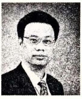

# 序章

[返回总目录](../README.md) · [下一章](../第01章-计算机系统漫游/README.md) · [按小节阅读](README.md)

## 本章目录

- [出版者的话](#出版者的话)
- [中文版序一](#中文版序一)
- [中文版序二](#中文版序二)
- [译者序](#译者序)
- [前言](#前言)
- [如何阅读此书](#如何阅读此书)
- [本书概述](#本书概述)
- [本版新增内容](#本版新增内容)
- [本书的起源](#本书的起源)
- [写给指导教师们：可以基于本书的课程](#写给指导教师们可以基于本书的课程)
- [写给指导教师们：经过课堂验证的实验练习](#写给指导教师们经过课堂验证的实验练习)
- [第3版的致谢](#第3版的致谢)
- [第2版的致谢](#第2版的致谢)
- [第1版的致谢](#第1版的致谢)
- [关于作者](#关于作者)

## 出版者的话

文艺复兴以来，源远流长的科学精神和逐步形成的学术规范，使西方国家在自然科学的各个领域取得了垄断性的优势；也正是这样的优势，使美国在信息技术发展的六十多年间名家辈出、独领风骚。在商业化的进程中，美国的产业界与教育界越来越紧密地结合，计算机学科中的许多泰山北斗同时身处科研和教学的最前线，由此而产生的经典科学著作，不仅擘划了研究的范畴，还揭示了学术的源变，既遵循学术规范，又自有学者个性，其价值并不会因年月的流逝而减退。

近年，在全球信息化大潮的推动下，我国的计算机产业发展迅猛，对专业人才的需求日益迫切。这对计算机教育界和出版界都既是机遇，也是挑战；而专业教材的建设在教育战略上显得举足轻重。在我国信息技术发展时间较短的现状下，美国等发达国家在其计算机科学发展的几十年间积淀和发展的经典教材仍有许多值得借鉴之处。因此，引进一批国外优秀计算机教材将对我国计算机教育事业的发展起到积极的推动作用，也是与世界接轨、建设真正的世界一流大学的必由之路。

机械工业出版社华章公司较早意识到“出版要为教育服务”。自1998年开始，我们就将工作重点放在了遴选、移译国外优秀教材上。经过多年的不懈努力，我们与 Pearson、McGraw-Hill、Elsevier、MIT、John Wiley & Sons、Cengage 等世界著名出版公司建立了良好的合作关系，从他们现有的数百种教材中甄选出 Andrew S. Tanenbaum、Bjarne Stroustrup、Brian W. Kernighan、Dennis Ritchie、Jim Gray、Alfred V. Aho、John E. Hopcroft、Jeffrey D. Ullman、Abraham Silberschatz、William Stallings、Donald E. Knuth、John L. Hennessy、Larry L. Peterson 等大师名家的一批经典作品，以“计算机科学丛书”为总称出版，供读者学习、研究及珍藏。大理石纹理的封面，也正体现了这套丛书的品位和格调。

“计算机科学丛书”的出版工作得到了国内外学者的鼎力相助，国内的专家不仅提供了中肯的选题指导，还不辞劳苦地担任了翻译和审校的工作；而原书的作者也相当关注其作品在中国的传播，有的还专门为其书的中译本作序。迄今，“计算机科学丛书”已经出版了近两百个品种，这些书籍在读者中树立了良好的口碑，并被许多高校采用为正式教材和参考书籍。其影印版“经典原版书库”作为姊妹篇也被越来越多实施双语教学的学校所采用。

权威的作者、经典的教材、一流的译者、严格的审校、精细的编辑，这些因素使我们的图书有了质量的保证。随着计算机科学与技术专业学科建设的不断完善和教材改革的逐渐深化，教育界对国外计算机教材的需求和应用都将步入一个新的阶段，我们的目标是尽善尽美，而反馈的意见正是我们达到这一终极目标的重要帮助。华章公司欢迎老师和读者对我们的工作提出建议或给予指正，我们的联系方法如下：

华章网站：www.hzbook.com  
电子邮件：hzjsj@hzbook.com  
联系电话：(010)88379604  
联系地址：北京市西城区百万庄南街1号  
邮政编码：100037

华章教育  
华章科技图书出版中心

## 中文版序一

**梅宏**  
中国科学院院士  
发展中国家科学院院士


华章公司温莉芳女士邀我为即将出版的《Computer Systems: A Programmer’s Perspective》第3版的中文译本《深入理解计算机系统》写个序，出于两方面的考虑，欣然允之。

一是源于我个人的背景和兴趣。我长期从事软件工程和系统软件领域的研究，对计算机学科的认识可概括为两大方面：计算系统的构建和基于计算系统的计算技术应用。出于信息时代国家掌握关键核心技术的重大需求以及我个人专业的本位视角，我一直对系统级技术的研发给予更多关注，由于这种“偏爱”和研究习惯的养成，以至于自己在面对非本专业领域问题时，也常常喜欢从“系统观”来看待问题和解决问题。我自己也和《深入理解计算机系统》有过“亲密接触”。2012年，我还在北京大学信息科学技术学院院长任上，学院从更好地培养适应新技术、发展具有系统设计和系统应用能力的计算机专门人才出发，在调查若干国外高校计算机学科本科生教学体系基础上，决定加强计算机系统能力培养，在本科生二年级增设了一门系统级课程，即“计算机系统导论”。其时，学校正在倡导小班课教学模式，这门课也被选为学院的第一个小班课教学试点。为了体现学院的重视，我亲自担任了这门课的主持人，带领一个18人组成的“豪华”教学团队负责该课程的教学工作，将学生分成14个小班，每个小班不超过15人。同时，该课程涉及教师集体备课组合授课、大班授课基础上的小班课教学和讨论、定期教学会议、学生自主习题课和实验课等新教学模式的探索，其中一项非常重要的举措就是选用了卡内基-梅隆大学 Randal E. Bryant 教授和 David R. O’Hallaron 教授编写的《Computer Systems: A Programmer’s Perspective》（第2版）作为教材。虽然这门课程我只主持了一次，但对这本教材的印象颇深颇佳。

二是源于我和华章公司已有的良好合作和相互了解。2000年前后，我先后翻译了华章公司引进（机械工业出版社出版）的 Roger Pressman 编写的《Software Engineering: A Practitioner’s Approach》一书的第4版和第5版。其后，在计算机学会软件工程专业委员会和系统软件专业委员会的诸多学术活动中也和华章公司及温莉芳女士本人有不少合作。近二十年来，华章公司的编辑们引进出版了大量计算机学科的优秀教材和学术著作，对国内高校计算机学科的教学改革起到了积极的促进作用，本书的翻译出版仍是这项工作的延续。这是一项值得褒扬的工作，我也想借此机会代表计算机界同仁表达对华章公司的感谢！

计算机系统类别的课程一直是计算机科学与技术专业的主要教学内容之一。由于历史原因，我国的计算机专业的课程体系曾广泛参考 ACM 和 IEEE 制订的计算机科学与技术专业教学计划（Computing Curricula）设计，计算机系统类课程也参照该计划分为汇编语言、操作系统、组成原理、体系结构、计算机网络等多门课程。应该说，该课程体系在历史上对我国的计算机专业教育起了很好的引导作用。

进入新世纪以来，计算技术发生了重要的发展和变化，我国的信息技术和产业也得到了迅猛发展，对计算机专业的毕业生提出了更高要求。重新审视原来我们参照 ACM/IEEE 计算机专业计划的课程体系，会发现存在以下几个方面的主要问题。

1）课程体系中缺乏一门独立的能够贯穿整个计算机系统的基础课程。计算机系统方面的基础知识被分成了很多门独立的课程，课程内容彼此之间缺乏关联和系统性。学生学习之后，虽然在计算机系统的各个部分理解了很多概念和方法，但往往会忽视各个部分之间的关联，难以系统性地理解整个计算机系统的工作原理和方法。

2）现有课程往往偏重理论，和实践关联较少。如现有的系统课程中通常会介绍函数调用过程中的压栈和退栈方式，但较少和实践关联来理解压栈和退栈过程的主要作用。实际上，压栈和退栈与理解 C 等高级语言的工作原理息息相关，也是常用的攻击手段 Buffer Overflow 的主要技术基础。

3）教学内容比较传统和陈旧，基本上是早期 PC 时代的内容。比如，现在的主流台式机 CPU 都已经是 x86-64 指令集，但较多课程还在教授80386甚至更早的指令集。对于近年来出现的多核/众核处理器、SSD 硬盘等实际应用中遇到的内容更是涉及较少。

4）课程大多数从设计者的角度出发，而不是从使用者的角度出发。对于大多数学生来说，毕业之后并不会成为专业的 CPU 设计人员、操作系统开发人员等，而是会成为软件开发工程师。对他们而言，最重要的是理解主流计算机系统的整体设计以及这些设计因素对于应用软件开发和运行的影响。

这本教材很好地克服了上述传统课程的不足，这也是当初北大计算机学科本科生教学改革时选择该教材的主要考量。其一，该教材系统地介绍了整个计算机系统的工作原理，可帮助学生系统性地理解计算机如何执行程序、存储信息和通信；其二，该教材非常强调实践，全书包括9个配套的实验，在这些实验中，学生需要攻破计算机系统、设计 CPU、实现命令行解释器、根据缓存优化程序等，在新鲜有趣的实验中理解系统原理，培养动手能力；其三，该教材紧跟时代的发展，加入了 x86-64 指令集、Intel Core i7 的虚拟地址结构、SSD 磁盘、IPv6 等新技术内容；其四，该教材从程序员的角度看待计算机系统，重点讨论系统的不同结构对于上层应用软件编写、执行和数据存储的影响，以培养程序员在更广阔空间应用计算机系统知识的能力。

基于该教材的北大“计算机系统导论”课程实施已有五年，得到了学生的广泛赞誉，学生们通过这门课程的学习建立了完整的计算机系统的知识体系和整体知识框架，养成了良好的编程习惯并获得了编写高性能、可移植和健壮的程序的能力，奠定了后续学习操作系统、编译、计算机体系结构等专业课程的基础。北大的教学实践表明，这是一本值得推荐采用的好教材。

该书的第3版相对于第2版进行了较大程度的修改和扩充。第3版从一开始就采用最新 x86-64 架构来贯穿各部分知识，在内存技术、网络技术上也有一系列更新，并且重组了之前的一些比较难懂的内容。我相信，该书的出版，将有助于国内计算机系统教学的进一步改进，为培养从事系统级创新的计算机人才奠定很好的基础。

梅宏  
2016年10月8日

## 中文版序二

**臧斌宇**  
上海交通大学软件学院院长



2002年8月本书第1版首次印刷。一个月之后，我在复旦大学软件学院开设了“计算机系统基础”课程，成为国内第一个采用这本教材授课的老师。这本教材有四个特点。第一，涉及面广，覆盖了二进制、汇编、组成、体系结构、操作系统、网络与并发程序设计等计算机系统最重要的方面。第二，具有相当的深度，本书从程序出发逐步深入到系统领域的重要问题，而非点到为止，学完本书后读者可以很好地理解计算机系统的工作原理。第三，它是面向低年级学生的教材，在过去的教学体系中这本书所涉及的很多内容只能在高年级讲授，而本书通过合理的安排将计算机系统领域最核心的内容巧妙地展现给学生（例如，不需要掌握逻辑设计与硬件描述语言的完整知识，就可以体验处理器设计）。第四，本书配备了非常实用、有趣的实验。例如，模仿硬件仅用位操作完成复杂的运算，模仿 tracker 和 hacker 去破解密码以及攻击自身的程序，设计处理器，实现简单但功能强大的 Shell 和 Proxy 等。这些实验既强化了学生对书本知识的理解，也进一步激发了学生探究计算机系统的热情。

以低年级开设“深入理解计算机系统”课程为基础，我先后在复旦大学和上海交通大学软件学院主导了激进的教学改革。必修课时被大量压缩，现在软件工程专业必修课由问题求解、计算机系统基础、应用开发基础、软件工程四个模块9门课构成。其他传统的必修课如操作系统、编译原理、数字逻辑等都成为方向课。课程体系的变化，减少了学生修读课程的总数和总课时，因而为大幅度增加实验总量、提高实验难度和强度、增强实验的综合性和创新性提供了有力保障。现在我的课题组的青年教师全部是首批经历此项教学改革的学生。本科的扎实基础为他们从事系统软件研究打下了良好基础，他们实现了亚洲学术界在操作系统旗舰会议 SOSP 上论文发表零的突破，目前研究成果在国际上具有较大的影响力。师资力量的补充，又为全面推进更加激进的教学改革创造了条件。

本书的出版标志着国际上计算机教学进入了第三阶段。从历史来看，国际上计算机教学先后经历了三个主要阶段。第一阶段是上世纪70年代中期至80年代中期，那时理论、技术还不成熟，系统不稳定，因此教材主要围绕若干重要问题讲授不同流派的观点，学生解决实际问题的能力不强。第二阶段是上世纪80年代中期至本世纪初，当时计算机单机系统的理论和技术已逐步趋于成熟，主流系统稳定，因此教材主要围绕主流系统讲解理论和技术，学生的理论基础扎实，动手能力强。第三阶段从本世纪初开始，主要背景是随着互联网的兴起，信息技术开始渗透到人类工作和生活的方方面面。技术爆炸迫使教学者必须重构传统的以计算机单机系统为主导的课程体系。新的体系大面积调整了核心课程的内容。核心课程承担了帮助学生构建专业知识框架的任务，为学生在毕业后相当长时间内的专业发展奠定坚实基础。现在一般认为问题抽象、系统抽象和数据抽象是计算机类专业毕业生的核心能力。而本书担负起了系统抽象的重任，因此美国的很多高校都采用了该书作为计算机系统核心课程的教材。第三阶段的教材与第二阶段的教材是互补关系。第三阶段的教材主要强调坚实而宽广的基础，第二阶段的教材主要强调深入系统的专门知识，因此依然在本科高年级方向课和研究生专业课中占据重要地位。

上世纪80年代初，我国借鉴美国经验建立了自己的计算机教学体系并引进了大量教材。从21世纪初开始，一些学校开始借鉴美国第二阶段的教学方法，采用了部分第二阶段的著名教材，这些改革正在走向成熟并得以推广。2012年北京大学计算机专业采用本书作为教材后，采用本教材开设“计算机系统基础”课程的高校快速增加。以此为契机，国内的计算机教学也有望全面进入第三阶段。

本书的第3版完全按照 x86-64 系统进行改写。此外，第2版中删除了以 x87 呈现的浮点指令，在第3版中浮点指令又以标量 AVX2 的形式得以恢复。第3版更加强调并发，增加了较大篇幅用于讨论信号处理程序与主程序间并发时的正确性保障。总体而言，本书的三个版本在结构上没有太大变化，不同版本的出现主要是为了在细节上能够更好地反映技术的最新变化。

当然本书的某些部分对于初学者而言还是有些难以阅读。本书涉及大量重要概念，但一些概念首次亮相时并没有编排好顺序。例如寄存器的概念、汇编指令的顺序执行模式、PC 的概念等对于初学者而言非常陌生，但这些介绍仅仅出现在第1章的总览中，而当第3章介绍汇编时完全没有进一步的展开就假设读者已经非常清楚这些概念。事实上这些概念原本就介绍得过于简单，短暂亮相之后又立即退场，相隔较长时间后，当这些概念再次登场时，初学者早已忘却了它们是什么。同样，第8章对进程、并发等概念的介绍也存在类似问题。因此，中文翻译版将配备导读部分，希望这些导读能够帮助初学者顺利阅读。

臧斌宇  
2016年10月15日

## 译者序

本书第1版出版于2003年，第2版出版于2011年，去年发行的已经是原书第3版了。第3版还是采用以下组合方式：在经典的 x86 架构机器上运行 Linux 操作系统，采用 C 语言编程。这样的组合经受住了时间的考验。这一版的一个明显变化就是从讲解 IA32 和 x86-64 转变为完全以 x86-64 为基础，相应地修改了第3、4、5、6和7章。同时，还改写了第2章，使之更易读、好懂；用近期的新技术更新了第6、11和12章。这些变化使得本书既和新技术保持了同步，又保留了描述系统本质的内容以及从程序员角度出发的特色。

除了翻译本书，我们也开始以本书为教材讲授“计算机系统基础”课程，对这本书的理解也随之越来越深入，意识到除了阅读之外，动手实践更是学习计算机系统的必经之路。本书的官网提供了很多实验作业（Lab Assignment），其中不乏有趣且有一定难度的实验，比如 Bomb Lab。有兴趣的读者除了阅读本书的内容之外，还应该试着去完成这些实验，让纸面上的内容在实际动手中得到巩固和加强。本书的官方博客也不断更新着有关这本书和配套课程的最新变化，这也是对本书的有益补充。

第3版从翻译的角度来说，我们尽量做到更流畅，更符合中文表达的习惯。对于一些术语，比如 memory，以前怕出错就统一翻译成存储器，现在则尽可能地按照语境去区分，翻译成内存或者存储器。

在此，要感谢本书的编辑朱劼、姚蕾以及和静，有她们的支持、鼓励和耐心细致的工作，才能让本书如期与读者见面。

由于本书内容多，翻译时间紧迫，尽管我们尽量做到认真仔细，但还是难以避免出现错误和不尽如人意的地方。在此欢迎广大读者批评指正。我们也会一如既往地维护勘误表，及时在网上更新，方便大家阅读。（另外，本版第1次印刷时，我们已经根据官网2016年3月1日前发布的勘误进行了修正，就不在中文勘误中再翻译了。）

龚奕利　贺莲  
2016年5月于珞珈山

## 前言

本书（简称 CS:APP）的主要读者是计算机科学家、计算机工程师，以及那些想通过学习计算机系统的内在运作而能够写出更好程序的人。

我们的目的是解释所有计算机系统的本质概念，并向你展示这些概念是如何实实在在地影响应用程序的正确性、性能和实用性的。其他的系统类书籍都是从构建者的角度来写的，讲述如何实现硬件或系统软件，包括操作系统、编译器和网络接口。而本书是从程序员的角度来写的，讲述应用程序员如何能够利用系统知识来编写出更好的程序。当然，学习一个计算机系统应该做些什么，是学习如何构建一个计算机系统的很好的出发点，所以，对于希望继续学习系统软硬件实现的人来说，本书也是一本很有价值的介绍性读物。大多数系统书籍还倾向于重点关注系统的某一个方面，比如：硬件架构、操作系统、编译器或者网络。本书则以程序员的视角统一覆盖了上述所有方面的内容。

如果你研究和领会了这本书里的概念，你将开始成为极少数的“牛人”，这些“牛人”知道事情是如何运作的，也知道当事情出现故障时如何修复。你写的程序将能够更好地利用操作系统和系统软件提供的功能，对各种操作条件和运行时参数都能正确操作，运行起来更快，并能避免出现使程序容易受到网络攻击的缺陷。同时，你也要做好更深入探究的准备，研究像编译器、计算机体系结构、操作系统、嵌入式系统、网络互联和网络安全这样的高级题目。

### 读者应具备的背景知识

本书的重点是执行 x86-64 机器代码的系统。对英特尔及其竞争对手而言，x86-64 是他们自1978年起，以8086微处理器为代表，不断进化的最新成果。按照英特尔微处理器产品线的命名规则，这类微处理器俗称为“x86”。随着半导体技术的演进，单芯片上集成了更多的晶体管，这些处理器的计算能力和内存容量有了很大的增长。在这个过程中，它们从处理16位字，发展到引入 IA32 处理器处理32位字，再到最近的 x86-64 处理64位字。

我们考虑的是这些机器如何在 Linux 操作系统上运行 C 语言程序。Linux 是众多继承自最初由贝尔实验室开发的 Unix 的操作系统中的一种。这类操作系统的其他成员包括 Solaris、FreeBSD 和 MacOS X。近年来，由于 Posix 和标准 Unix 规范的标准化努力，这些操作系统保持了高度兼容性。因此，本书内容几乎直接适用于这些“类 Unix”操作系统。

文中包含大量已在 Linux 系统上编译和运行过的程序示例。我们假设你能访问一台这样的机器，并且能够登录，做一些诸如切换目录之类的简单操作。如果你的计算机运行的是 Microsoft Windows 系统，我们建议你选择安装一个虚拟机环境（例如 VirtualBox 或者 VMWare），以便为一种操作系统（客户 OS）编写的程序能在另一种系统（宿主 OS）上运行。

我们还假设你对 C 和 C++ 有一定的了解。如果你以前只有 Java 经验，那么你需要付出更多的努力来完成这种转换，不过我们也会帮助你。Java 和 C 有相似的语法和控制语句。不过，有一些 C 语言的特性（特别是指针、显式的动态内存分配和格式化 I/O）在 Java 中都是没有的。所幸的是，C 是一个较小的语言，在 Brian Kernighan 和 Dennis Ritchie 经典的“K&R”文献中得到了清晰优美的描述[61]。无论你的编程背景如何，都应该考虑将 K&R 作为个人系统藏书的一部分。如果你只有使用解释性语言的经验，如 Python、Ruby 或 Perl，那么在使用本书之前，需要花费一些时间来学习 C。

本书的前几章揭示了 C 语言程序和它们相对应的机器语言程序之间的交互作用。机器语言示例都是用运行在 x86-64 处理器上的 GNU GCC 编译器生成的。我们不需要你以前有任何硬件、机器语言或是汇编语言编程的经验。

> **给 C 语言初学者　关于 C 编程语言的建议**
>
> 为了帮助 C 语言编程背景薄弱（或全无背景）的读者，我们在书中加入了这样一些专门的注释来突出 C 中一些特别重要的特性。我们假设你熟悉 C++ 或 Java。

## 如何阅读此书

从程序员的角度学习计算机系统是如何工作的会非常有趣，主要是因为你可以主动地做这件事情。无论何时你学到一些新的东西，都可以马上试验并且直接看到运行结果。事实上，我们相信学习系统的唯一方法就是做（do）系统，即在真正的系统上解决具体的问题，或是编写和运行程序。

这个主题观念贯穿全书。当引入一个新概念时，将会有一个或多个练习题紧随其后，你应该马上做一做来检验你的理解。这些练习题的解答在每章的末尾。当你阅读时，尝试自己来解答每个问题，然后再查阅答案，看自己的答案是否正确。除第1章外，每章后面都有难度不同的家庭作业。对每个家庭作业题，我们标注了难度级别：

\*　只需要几分钟。几乎或完全不需要编程。

\*\*　可能需要将近20分钟。通常包括编写和测试一些代码。（许多都源自我们在考试中出的题目。）

\*\*\*　需要很大的努力，也许是1～2个小时。一般包括编写和测试大量的代码。

\*\*\*\*　一个实验作业，需要将近10个小时。

文中每段代码示例都是由经过 GCC 编译的 C 程序直接生成并在 Linux 系统上进行了测试，没有任何人为的改动。当然，你的系统上 GCC 的版本可能不同，或者根本就是另外一种编译器，那么可能生成不一样的机器代码，但是整体行为表现应该是一样的。所有的源程序代码都可以从 csapp.cs.cmu.edu 上的 CS:APP 主页上获取。在本书中，源程序的文件名列在两条水平线的右边，水平线之间是格式化的代码。比如，图1中的程序能在 `code/intro/` 目录下的 `hello.c` 文件中找到。当遇到这些示例程序时，我们鼓励你在自己的系统上试着运行它们。

`code/intro/hello.c`

```c
#include <stdio.h>

int main()
{
    printf("hello, world\n");
    return 0;
}
```

**图 1** 一个典型的代码示例

为了避免本书体积过大、内容过多，我们添加了许多网络旁注（Web aside），包括一些对本书主要内容的补充资料。本书中用 `CHAP:TOP` 这样的标记形式来引用这些旁注，这里 `CHAP` 是该章主题的缩写编码，而 `TOP` 是涉及的话题的缩写编码。例如，网络旁注 `DATA:BOOL` 包含对第2章中数据表示里面有关布尔代数内容的补充资料；而网络旁注 `ARCH:VLOG` 包含的是用 Verilog 硬件描述语言进行处理器设计的资料，是对第4章中处理器设计部分的补充。所有的网络旁注都可以从 CS:APP 的主页上获取。

> **旁注　什么是旁注**
>
> 在整本书中，你将会遇到很多以这种形式出现的旁注。旁注是附加说明，能使你对当前讨论的主题多一些了解。旁注可以有很多用处。一些是小的历史故事。例如，C 语言、Linux 和 Internet 是从何而来的？有些旁注则是用来澄清学生们经常感到疑惑的问题。例如，高速缓存的行、组和块有什么区别？还有些旁注给出了一些现实世界的例子。例如，一个浮点错误怎么毁掉了法国的一枚火箭，或是给出市面上出售的一个磁盘驱动器的几何和运行参数。最后，还有一些旁注仅仅就是一些有趣的内容，例如，什么是“hoinky”？

## 本书概述

本书由12章组成，旨在阐述计算机系统的核心概念。内容概述如下：

- 第1章：计算机系统漫游。这一章通过研究“hello, world”这个简单程序的生命周期，介绍计算机系统的主要概念和主题。

- 第2章：信息的表示和处理。我们讲述了计算机的算术运算，重点描述了会对程序员有影响的无符号数和数的补码表示的特性。我们考虑数字是如何表示的，以及由此确定对于一个给定的字长，其可能编码值的范围。我们探讨有符号和无符号数字之间类型转换的效果，还阐述算术运算的数学特性。菜鸟级程序员经常很惊奇地了解到（用补码表示的）两个正数的和或者积可能为负。另一方面，补码的算术运算满足很多整数运算的代数特性，因此，编译器可以很安全地把一个常量乘法转化为一系列的移位和加法。我们用 C 语言的位级操作来说明布尔代数的原理和应用。我们从两个方面讲述了 IEEE 标准的浮点格式：一是如何用它来表示数值，一是浮点运算的数学属性。

  对计算机的算术运算有深刻的理解是写出可靠程序的关键。比如，程序员和编译器不能用表达式 `(x-y<0)` 来替代 `(x<y)`，因为前者可能会产生溢出。甚至也不能用表达式 `(-y<-x)` 来替代，因为在补码表示中负数和正数的范围是不对称的。算术溢出是造成程序错误和安全漏洞的一个常见根源，然而很少有书从程序员的角度来讲述计算机算术运算的特性。

- 第3章：程序的机器级表示。我们教读者如何阅读由 C 编译器生成的 x86-64 机器代码。我们说明为不同控制结构（比如条件、循环和开关语句）生成的基本指令模式。我们还讲述过程的实现，包括栈分配、寄存器使用惯例和参数传递。我们讨论不同数据结构（如结构、联合和数组）的分配和访问方式。我们还说明实现整数和浮点数算术运算的指令。我们还以分析程序在机器级的样子作为途径，来理解常见的代码安全漏洞（例如缓冲区溢出），以及理解程序员、编译器和操作系统可以采取的减轻这些威胁的措施。学习本章的概念能够帮助读者成为更好的程序员，因为你们懂得程序在机器上是如何表示的。另外一个好处就在于读者会对指针有非常全面而具体的理解。

- 第4章：处理器体系结构。这一章讲述基本的组合和时序逻辑元素，并展示这些元素如何在数据通路中组合到一起，来执行 x86-64 指令集的一个称为“Y86-64”的简化子集。我们从设计单时钟周期数据通路开始。这个设计概念上非常简单，但是运行速度不会太快。然后我们引入流水线的思想，将处理一条指令所需要的不同步骤实现为独立的阶段。这个设计中，在任何时刻，每个阶段都可以处理不同的指令。我们的五阶段处理器流水线更加实用。本章中处理器设计的控制逻辑是用一种称为 HCL 的简单硬件描述语言来描述的。用 HCL 写的硬件设计能够编译和链接到本书提供的模拟器中，还可以根据这些设计生成 Verilog 描述，它适合合成到实际可以运行的硬件上去。

- 第5章：优化程序性能。在这一章里，我们介绍了许多提高代码性能的技术，主要思想就是让程序员通过使编译器能够生成更有效的机器代码来学习编写 C 代码。我们一开始介绍的是减少程序需要做的工作的变换，这些是在任何机器上写任何程序时都应该遵循的。然后讲的是增加生成的机器代码中指令级并行度的变换，因而提高了程序在现代“超标量”处理器上的性能。为了解释这些变换行之有效的原理，我们介绍了一个简单的操作模型，它描述了现代乱序处理器是如何工作的，然后给出了如何根据一个程序的图形化表示中的关键路径来测量一个程序可能的性能。你会惊讶于对 C 代码做一些简单的变换能给程序带来多大的速度提升。

- 第6章：存储器层次结构。对应用程序员来说，存储器系统是计算机系统中最直接可见的部分之一。到目前为止，读者一直认同这样一个存储器系统概念模型，认为它是一个有一致访问时间的线性数组。实际上，存储器系统是一个由不同容量、造价和访问时间的存储设备组成的层次结构。我们讲述不同类型的随机存取存储器（RAM）和只读存储器（ROM），以及磁盘和固态硬盘[^ssd]的几何形状和组织构造。我们描述这些存储设备是如何放置在层次结构中的，讲述访问局部性是如何使这种层次结构成为可能的。我们通过一个独特的观点使这些理论具体化，那就是将存储器系统视为一个“存储器山”，山脊是时间局部性，而斜坡是空间局部性。最后，我们向读者阐述如何通过改善程序的时间局部性和空间局部性来提高应用程序的性能。

- 第7章：链接。本章讲述静态和动态链接，包括的概念有可重定位的和可执行的目标文件、符号解析、重定位、静态库、共享目标库、位置无关代码，以及库打桩。大多数讲述系统的书中都不讲链接，我们要讲述它是出于以下原因。第一，程序员遇到的最令人迷惑的问题中，有一些和链接时的小故障有关，尤其是对那些大型软件包来说。第二，链接器生成的目标文件是与一些像加载、虚拟内存和内存映射这样的概念相关的。

- 第8章：异常控制流。在本书的这个部分，我们通过介绍异常控制流（即除正常分支和过程调用以外的控制流的变化）的一般概念，打破单一程序的模型。我们给出存在于系统所有层次的异常控制流的例子，从底层的硬件异常和中断，到并发进程的上下文切换，到由于接收 Linux 信号引起的控制流突变，到 C 语言中破坏栈原则的非本地跳转。

  在这一章，我们介绍进程的基本概念，进程是对一个正在执行的程序的一种抽象。读者会学习进程是如何工作的，以及如何在应用程序中创建和操纵进程。我们会展示应用程序员如何通过 Linux 系统调用来使用多个进程。学完本章之后，读者就能够编写带作业控制的 Linux shell 了。同时，这里也会向读者初步展示程序的并发执行会引起不确定的行为。

- 第9章：虚拟内存。我们讲述虚拟内存系统是希望读者对它是如何工作的以及它的特性有所了解。我们想让读者了解为什么不同的并发进程各自都有一个完全相同的地址范围，能共享某些页，而又独占另外一些页。我们还讲了一些管理和操纵虚拟内存的问题。特别地，我们讨论了存储分配操作，就像标准库的 `malloc` 和 `free` 操作。阐述这些内容是出于下面几个目的。它加强了这样一个概念，那就是虚拟内存空间只是一个字节数组，程序可以把它划分成不同的存储单元。它可以帮助读者理解当程序包含存储泄漏和非法指针引用等内存引用错误时的后果。最后，许多应用程序员编写自己的优化了的存储分配操作来满足应用程序的需要和特性。这一章比其他任何一章都更能展现将计算机系统中的硬件和软件结合起来阐述的优点。而传统的计算机体系结构和操作系统书籍都只讲述虚拟内存的某一方面。

- 第10章：系统级 I/O。我们讲述 Unix I/O 的基本概念，例如文件和描述符。我们描述如何共享文件，I/O 重定向是如何工作的，还有如何访问文件的元数据。我们还开发了一个健壮的带缓冲区的 I/O 包，可以正确处理一种称为 short counts 的奇特行为，也就是库函数只读取一部分的输入数据。我们阐述 C 的标准 I/O 库，以及它与 Linux I/O 的关系，重点谈到标准 I/O 的局限性，这些局限性使之不适合网络编程。总的来说，本章的主题是后面两章——网络和并发编程的基础。

- 第11章：网络编程。对编程而言，网络是非常有趣的 I/O 设备，它将许多我们前面文中学习的概念（比如进程、信号、字节顺序、内存映射和动态内存分配）联系在一起。网络程序还为下一章的主题——并发，提供了一个很令人信服的上下文。本章只是网络编程的一个很小的部分，使读者能够编写一个简单的 Web 服务器。我们还讲述位于所有网络程序底层的客户端-服务器模型。我们展现了一个程序员对 Internet 的观点，并且教读者如何用套接字接口来编写 Internet 客户端和服务器。最后，我们介绍超文本传输协议（HTTP），并开发了一个简单的迭代式 Web 服务器。

- 第12章：并发编程。这一章以 Internet 服务器设计为例介绍了并发编程。我们比较对照了三种编写并发程序的基本机制（进程、I/O 多路复用和线程），并且展示如何用它们来建造并发 Internet 服务器。我们探讨了用 P、V 信号量操作来实现同步、线程安全和可重入、竞争条件以及死锁等的基本原则。对大多数服务器应用来说，写并发代码都是很关键的。我们还讲述了线程级编程的使用方法，用这种方法来表达应用程序中的并行性，使得程序在多核处理器上能执行得更快。使用所有的核解决同一个计算问题需要很小心谨慎地协调并发线程，既要保证正确性，又要争取获得高性能。

[^ssd]: 直译应为固态驱动器，但固态硬盘一词已经被大家接受，所以沿用。——译者注

## 本版新增内容

本书的第1版于2003年出版，第2版在2011年出版。考虑到计算机技术发展如此迅速，这本书的内容还算是保持得很好。事实证明 Intel x86 的机器上运行 Linux（以及相关操作系统），加上采用 C 语言编程，是一种能够涵盖当今许多系统的组合。然而，硬件技术、编译器和程序库接口的变化，以及很多教师教授这些内容的经验，都促使我们做了大量的修改。

第2版以来的最大整体变化是，我们的介绍从以 IA32 和 x86-64 为基础，转变为完全以 x86-64 为基础。这种重心的转移影响了很多章节的内容。下面列出一些明显的变化：

- 第1章。我们将第5章对 Amdahl 定理的讨论移到了本章。
- 第2章。读者和评论家的反馈是一致的，本章的一些内容有点令人不知所措。因此，我们澄清了一些知识点，用更加数学的方式来描述，使得这些内容更容易理解。这使得读者能先略过数学细节，获得高层次的总体概念，然后回过头来进行更细致深入的阅读。
- 第3章。我们将之前基于 IA32 和 x86-64 的表现形式转换为完全基于 x86-64，还更新了近期版本 GCC 产生的代码。其结果是大量的重写工作，包括修改了一些概念提出的顺序。同时，我们还首次介绍了对处理浮点数据的程序的机器级支持。由于历史原因，我们给出了一个网络旁注描述 IA32 机器码。
- 第4章。我们将之前基于32位架构的处理器设计修改为支持64位字和操作的设计。
- 第5章。我们更新了内容以反映最近几代 x86-64 处理器的性能。通过引入更多的功能单元和更复杂的控制逻辑，我们开发的基于程序数据流表示的程序性能模型，其性能预测变得比之前更加可靠。
- 第6章。我们对内容进行了更新，以反映更多的近期技术。
- 第7章。针对 x86-64，我们重写了本章，扩充了关于用 GOT 和 PLT 创建位置无关代码的讨论，新增了一节描述更加强大的链接技术，比如库打桩。
- 第8章。我们增加了对信号处理程序更细致的描述，包括异步信号安全的函数，编写信号处理程序的具体指导原则，以及用 `sigsuspend` 等待处理程序。
- 第9章。本章变化不大。
- 第10章。我们新增了一节说明文件和文件的层次结构，除此之外，本章的变化不大。
- 第11章。我们介绍了采用最新 `getaddrinfo` 和 `getnameinfo` 函数的、与协议无关和线程安全的网络编程，取代过时的、不可重入的 `gethostbyname` 和 `gethostbyaddr` 函数。
- 第12章。我们扩充了利用线程级并行性使得程序在多核机器上更快运行的内容。

此外，我们还增加和修改了很多练习题和家庭作业。

## 本书的起源

本书起源于1998年秋季，我们在卡内基-梅隆（CMU）大学开设的一门编号为15-213的介绍性课程：计算机系统导论（Introduction to Computer System，ICS）[14]。从那以后，每学期都开设了 ICS 这门课程，每学期有超过400名学生上课，这些学生从本科二年级到硕士研究生都有，所学专业也很广泛。这门课程是卡内基-梅隆大学计算机科学系（CS）以及电子和计算机工程系（ECE）所有本科生的必修课，也是 CS 和 ECE 大多数高级系统课程的先行必修课。

ICS 这门课程的宗旨是用一种不同的方式向学生介绍计算机。因为，我们的学生中几乎没有人有机会亲自去构造一个计算机系统。另一方面，大多数学生，甚至包括所有的计算机科学家和计算机工程师，也需要日常使用计算机和编写计算机程序。所以我们决定从程序员的角度来讲解系统，并采用这样的原则过滤要讲述的内容：我们只讨论那些影响用户级 C 语言程序的性能、正确性或实用性的主题。

比如，我们排除了诸如硬件加法器和总线设计这样的主题。虽然我们谈及了机器语言，但是重点并不在于如何手工编写汇编语言，而是关注 C 语言编译器是如何将 C 语言的结构翻译成机器代码的，包括编译器是如何翻译指针、循环、过程调用以及开关（switch）语句的。更进一步地，我们将更广泛和全盘地看待系统，包括硬件和系统软件，涵盖了包括链接、加载、进程、信号、性能优化、虚拟内存、I/O 以及网络与并发编程等在内的主题。

这种做法使得我们讲授 ICS 课程的方式对学生来讲既实用、具体，还能动手操作，同时也非常能调动学生的积极性。很快地，我们收到来自学生和教职工非常热烈而积极的反响，我们意识到卡内基-梅隆大学以外的其他人也可以从我们的方法中获益。因此，这本书从 ICS 课程的笔记中应运而生了，而现在我们对它做了修改，使之能够反映科学技术以及计算机系统实现中的变化和进步。

通过本书的多个版本和多种语言译本，ICS 和许多相似课程已经成为世界范围内数百所高校的计算机科学和计算机工程课程的一部分。

## 写给指导教师们：可以基于本书的课程

指导教师可以使用本书来讲授五种不同类型的系统课程（见图2）。具体每门课程则有赖于课程大纲的要求、个人喜好、学生的背景和能力。图中的课程从左往右越来越强调以程序员的角度来看待系统。以下是简单的描述。

- **ORG：** 一门以非传统风格讲述传统主题的计算机组成原理课程。传统的主题包括逻辑设计、处理器体系结构、汇编语言和存储器系统，然而这里更多地强调了对程序员的影响。例如，要反过来考虑数据表示对 C 语言程序的数据类型和操作的影响。又例如，对汇编代码的讲解是基于 C 语言编译器产生的机器代码，而不是手工编写的汇编代码。
- **ORG+：** 一门特别强调硬件对应用程序性能影响的 ORG 课程。和 ORG 课程相比，学生要更多地学习代码优化和改进 C 语言程序的内存性能。
- **ICS：** 基本的 ICS 课程，旨在培养一类程序员，他们能够理解硬件、操作系统和编译系统对应用程序的性能和正确性的影响。和 ORG+ 课程的一个显著不同是，本课程不涉及低层次的处理器体系结构。相反，程序员只同现代乱序处理器的高级模型打交道。ICS 课程非常适合安排到一个10周的小学期，如果期望步调更从容一些，也可以延长到一个15周的学期。
- **ICS+：** 在基本的 ICS 课程基础上，额外论述一些系统编程的问题，比如系统级 I/O、网络编程和并发编程。这是卡内基-梅隆大学的一门一学期时长的课程，会讲述本书中除了低级处理器体系结构以外的所有章。
- **SP：** 一门系统编程课程。和 ICS+ 课程相似，但是剔除了浮点和性能优化的内容，更加强调系统编程，包括进程控制、动态链接、系统级 I/O、网络编程和并发编程。指导教师可能会想从其他渠道对某些高级主题做些补充，比如守护进程（daemon）、终端控制和 Unix IPC（进程间通信）。

| 章号 | 主题 | ORG | ORG+ | ICS | ICS+ | SP |
| ---: | --- | :---: | :---: | :---: | :---: | :---: |
| 1 | 系统漫游 | ● | ● | ● | ● | ● |
| 2 | 数据表示 | ● | ● | ● | ● | ⊙ (d) |
| 3 | 机器语言 | ● | ● | ● | ● | ● |
| 4 | 处理器体系结构 | ● | ● |  |  |  |
| 5 | 代码优化 |  | ● | ● | ● |  |
| 6 | 存储器层次结构 | ⊙ (a) | ● | ● | ● | ⊙ (a) |
| 7 | 链接 |  | ● | ⊙ (c) | ⊙ (c) | ● |
| 8 | 异常控制流 |  |  | ● | ● | ● |
| 9 | 虚拟内存 | ⊙ (b) | ● | ● | ● | ● |
| 10 | 系统级 I/O |  |  |  | ● | ● |
| 11 | 网络编程 |  |  |  | ● | ● |
| 12 | 并发编程 |  |  |  | ● | ● |

**图 2** 五类基于本书的课程

注：符号 ⊙ 表示覆盖部分章节，其中：（a）只有硬件；（b）无动态存储分配；（c）无动态链接；（d）无浮点数。ICS+ 是卡内基-梅隆的15-213课程。

图2要表达的主要信息是本书给了学生和指导教师多种选择。如果你希望学生更多地了解低层次的处理器体系结构，那么通过 ORG 和 ORG+ 课程可以达到目的。另一方面，如果你想将当前的计算机组成原理课程转换成 ICS 或者 ICS+ 课程，但是又对突然做这样剧烈的变化感到担心，那么你可以逐步递增转向 ICS 课程。你可以从 ORG 课程开始，它以一种非传统的方式教授传统的问题。一旦你对这些内容感到驾轻就熟了，就可以转到 ORG+，最终转到 ICS。如果学生没有 C 语言的经验（比如他们只用 Java 编写过程序），你可以花几周的时间在 C 语言上，然后再讲述 ORG 或者 ICS 课程的内容。

最后，我们认为 ORG+ 和 SP 课程适合安排为两期（两个小学期或者两个学期）。或者你可以考虑按照一期 ICS 和一期 SP 的方式来教授 ICS+ 课程。

## 写给指导教师们：经过课堂验证的实验练习

ICS+ 课程在卡内基-梅隆大学得到了学生很高的评价。学生对这门课程的评价，中值分数一般为5.0/5.0，平均分数一般为4.6/5.0。学生们说这门课非常有趣，令人兴奋，主要就是因为相关的实验练习。这些实验练习可以从 CS:APP 的主页上获得。下面是本书提供的一些实验的示例。

- 数据实验。这个实验要求学生实现简单的逻辑和算术运算函数，但是只能使用一个非常有限的 C 语言子集。比如，只能用位级操作来计算一个数字的绝对值。这个实验可帮助学生了解 C 语言数据类型的位级表示，以及数据操作的位级行为。
- 二进制炸弹实验。二进制炸弹是一个作为目标代码文件提供给学生的程序。运行时，它提示用户输入6个不同的字符串。如果其中的任何一个不正确，炸弹就会“爆炸”，打印出一条错误消息，并且在一个打分服务器上记录事件日志。学生必须通过对程序反汇编和逆向工程来测定应该是哪6个串，从而解除各自炸弹的雷管。该实验能教会学生理解汇编语言，并且强制他们学习怎样使用调试器。
- 缓冲区溢出实验。它要求学生通过利用一个缓冲区溢出漏洞，来修改一个二进制可执行文件的运行时行为。这个实验可教会学生栈的原理，并让他们了解写那种易于遭受缓冲区溢出攻击的代码的危险性。
- 体系结构实验。第4章的几个家庭作业能够组合成一个实验作业，在实验中，学生修改处理器的 HCL 描述，增加新的指令，修改分支预测策略，或者增加、删除旁路路径和寄存器端口。修改后的处理器能够被模拟，并通过运行自动化测试检测出大多数可能的错误。这个实验使学生能够体验处理器设计中令人激动的部分，而不需要掌握逻辑设计和硬件描述语言的完整知识。
- 性能实验。学生必须优化应用程序的核心函数（比如卷积积分或矩阵转置）的性能。这个实验可非常清晰地表明高速缓存的特性，并带给学生低级程序优化的经验。
- cache 实验。这个实验类似于性能实验，学生编写一个通用高速缓存模拟器，并优化小型矩阵转置核心函数，以最小化对模拟的高速缓存的不命中次数。我们使用 Valgrind 为矩阵转置核心函数生成真实的地址访问记录。
- shell 实验。学生实现他们自己的带有作业控制的 Unix shell 程序，包括 Ctrl+C 和 Ctrl+Z 按键，`fg`、`bg` 和 `jobs` 命令。这是学生第一次接触并发，并且让他们对 Unix 的进程控制、信号和信号处理有清晰的了解。
- malloc 实验。学生实现他们自己的 `malloc`、`free` 和 `realloc`（可选）版本。这个实验可让学生们清晰地理解数据的布局和组织，并且要求他们评估时间和空间效率的各种权衡及折中。
- 代理实验。实现一个位于浏览器和万维网其他部分之间的并行 Web 代理。这个实验向学生们揭示了 Web 客户端和服务器这样的主题，并且把课程中的许多概念联系起来，比如字节排序、文件 I/O、进程控制、信号、信号处理、内存映射、套接字和并发。学生很高兴能够看到他们的程序在真实的 Web 浏览器和 Web 服务器之间起到的作用。

CS:APP 的教师手册中有对实验的详细讨论，还有关于下载支持软件的说明。

## 第3版的致谢

很荣幸在此感谢那些帮助我们完成本书第3版的人们。

- 我们要感谢卡内基-梅隆大学的同事们，他们已经教授了 ICS 课程多年，并提供了富有见解的反馈意见，给了我们极大的鼓励：Guy Blelloch、Roger Dannenberg、David Eckhardt、Franz Franchetti、Greg Ganger、Seth Goldstein、Khaled Harras、Greg Kesden、Bruce Maggs、Todd Mowry、Andreas Nowatzyk、Frank Pfenning、Markus Pueschel 和 Anthony Rowe。David Winters 在安装和配置参考 Linux 机器方面给予了我们很大的帮助。

Jason Fritts（圣路易斯大学，St. Louis University）和 Cindy Norris（阿帕拉契州立大学，Appalachian State）对第2版提供了细致周密的评论。龚奕利（武汉大学，Wuhan University）翻译了中文版，并为其维护勘误，同时还贡献了一些错误报告。Godmar Back（弗吉尼亚理工大学，Virginia Tech）向我们介绍了异步信号安全以及与协议无关的网络编程，帮助我们显著提升了本书质量。

非常感谢目光敏锐的读者们，他们报告了第2版中的错误：Rami Ammari、Paul Anagnostopoulos、Lucas Bärenfänger、Godmar Back、Ji Bin、Sharbel Bousemaan、Richard Callahan、Seth Chaiken、Cheng Chen、Libo Chen、Tao Du、Pascal Garcia、Yili Gong、Ronald Greenberg、Dorukhan Gülöz、Dong Han、Dominik Helm、Ronald Jones、Mustafa Kazdagli、Gordon Kindlmann、Sankar Krishnan、Kanak Kshetri、Junlin Lu、Qiangqiang Luo、Sebastian Luy、Lei Ma、Ashwin Nanjappa、Gregoire Paradis、Jonas Pfenninger、Karl Pichotta、David Ramsey、Kaustabh Roy、David Selvaraj、Sankar Shanmugam、Dominique Smulkowska、Dag Sørbø、Michael Spear、Yu Tanaka、Steven Tricanowicz、Scott Wright、Waiki Wright、Han Xu、Zhengshan Yan、Firo Yang、Shuang Yang、John Ye、Taketo Yoshida、Yan Zhu 和 Michael Zink。

还要感谢对实验做出贡献的读者，他们是：Godmar Back（弗吉尼亚理工大学，Virginia Tech）、Taymon Beal（伍斯特理工学院，Worcester Polytechnic Institute）、Aran Clauson（西华盛顿大学，Western Washington University）、Cary Gray（威顿学院，Wheaton College）、Paul Haiduk（德州农机大学，West Texas A&M University）、Len Hamey（麦考瑞大学，Macquarie University）、Eddie Kohler（哈佛大学，Harvard）、Hugh Lauer（伍斯特理工学院，Worcester Polytechnic Institute）、Robert Marmorstein（朗沃德大学，Longwood University）和 James Riely（德保罗大学，DePaul University）。

再次感谢 Windfall 软件公司的 Paul Anagnostopoulos 在本书排版和先进的制作过程中所做的精湛工作。非常感谢 Paul 和他的优秀团队：Richard Camp（文字编辑）、Jennifer McClain（校对）、Laurel Muller（美术制作）以及 Ted Laux（索引制作）。Paul 甚至找出了我们对缩写 BSS 的起源描述中的一个错误，这个错误从第1版起一直没有被发现！

最后，我们要感谢 Prentice Hall 出版社的朋友们。Marcia Horton 和我们的编辑 Matt Goldstein 一直坚定不移地给予我们支持和鼓励，非常感谢他们。

## 第2版的致谢

我们深深地感谢那些帮助我们写出 CS:APP 第2版的人们。

首先，我们要感谢在卡内基-梅隆大学教授 ICS 课程的同事们，感谢你们见解深刻的反馈意见和鼓励：Guy Blelloch、Roger Dannenberg、David Eckhardt、Greg Ganger、Seth Goldstein、Greg Kesden、Bruce Maggs、Todd Mowry、Andreas Nowatzyk、Frank Pfenning 和 Markus Pueschel。

还要感谢报告第1版勘误的目光敏锐的读者们：Daniel Amelang、Rui Baptista、Quarup Barreirinhas、Michael Bombyk、Jörg Brauer、Jordan Brough、Yixin Cao、James Caroll、Rui Carvalho、Hyoung-Kee Choi、Al Davis、Grant Davis、Christian Dufour、Mao Fan、Tim Freeman、Inge Frick、Max Gebhardt、Jeff Goldblat、Thomas Gross、Anita Gupta、John Hampton、Hiep Hong、Greg Israelsen、Ronald Jones、Haudy Kazemi、Brian Kell、Constantine Kousoulis、Sacha Krakowiak、Arun Krishnaswamy、Martin Kulas、Michael Li、Zeyang Li、Ricky Liu、Mario Lo Conte、Dirk Maas、Devon Macey、Carl Marcinik、Will Marrero、Simone Martins、Tao Men、Mark Morrissey、Venkata Naidu、Bhas Nalabothula、Thomas Niemann、Eric Peskin、David Po、Anne Rogers、John Ross、Michael Scott、Seiki、Ray Shih、Darren Shultz、Erik Silkensen、Suryanto、Emil Tarazi、Nawanan Theera-Ampornpunt、Joe Trdinich、Michael Trigoboff、James Troup、Martin Vopatek、Alan West、Betsy Wolff、Tim Wong、James Woodruff、Scott Wright、Jackie Xiao、Guanpeng Xu、Qing Xu、Caren Yang、Yin Yongsheng、Wang Yuanxuan、Steven Zhang 和 Day Zhong。特别感谢 Inge Frick，他发现了我们加锁复制（lock-and-copy）例子中一个极不明显但很深刻的错误，还要特别感谢 Ricky Liu，他的校对水平真的很高。

我们 Intel 实验室的同事 Andrew Chien 和 Limor Fix 在本书的写作过程中一直非常支持。非常感谢 Steve Schlosser 提供了一些关于磁盘驱动器的总结描述，Casey Helfrich 和 Michael Ryan 安装并维护了新的 Core i7 机器。Michael Kozuch、Babu Pillai 和 Jason Campbell 对存储器系统性能、多核系统和能量墙问题提出了很有价值的见解。Phil Gibbons 和 Shimin Chen 跟我们分享了大量关于固态硬盘设计的专业知识。

我们还有机会邀请了 Wen-Mei Hwu、Markus Pueschel 和 Jiri Simsa 这样的高人给予了一些针对具体问题的意见和高层次的建议。James Hoe 帮助我们写了 Y86 处理器的 Verilog 描述，还完成了所有将设计合成到可运行的硬件上的工作。

非常感谢审阅本书草稿的同事们：James Archibald（百翰杨大学，Brigham Young University）、Richard Carver（乔治梅森大学，George Mason University）、Mirela Damian（维拉诺瓦大学，Villanova University）、Peter Dinda（西北大学）、John Fiore（坦普尔大学，Temple University）、Jason Fritts（圣路易斯大学，St. Louis University）、John Greiner（莱斯大学）、Brian Harvey（加州大学伯克利分校）、Don Heller（宾夕法尼亚州立大学）、Wei Chung Hsu（明尼苏达大学）、Michelle Hugue（马里兰大学）、Jeremy Johnson（德雷克塞尔大学，Drexel University）、Geoff Kuenning（哈维马德学院，Harvey Mudd College）、Ricky Liu、Sam Madden（麻省理工学院）、Fred Martin（马萨诸塞大学洛厄尔分校，University of Massachusetts, Lowell）、Abraham Matta（波士顿大学）、Markus Pueschel（卡内基-梅隆大学）、Norman Ramsey（塔夫茨大学，Tufts University）、Glenn Reinmann（加州大学洛杉矶分校）、Michela Taufer（特拉华大学，University of Delaware）和 Craig Zilles（伊利诺伊大学香槟分校）。

Windfall 软件公司的 Paul Anagnostopoulos 出色地完成了本书的排版，并领导了制作团队。非常感谢 Paul 和他超棒的团队：Rick Camp（文字编辑）、Joe Snowden（排版）、MaryEllen N. Oliver（校对）、Laurel Muller（美术）和 Ted Laux（索引制作）。

最后，我们要感谢 Prentice Hall 出版社的朋友们。Marcia Horton 总是支持着我们。我们的编辑 Matt Goldstein 由始至终表现出了一流的领导才能。我们由衷地感谢他们的帮助、鼓励和真知灼见。

## 第1版的致谢

我们衷心地感谢那些给了我们中肯批评和鼓励的众多朋友及同事。特别感谢我们15-213课程的学生们，他们充满感染力的精力和热情鞭策我们前行。Nick Carter 和 Vinny Furia 无私地提供了他们的 `malloc` 程序包。

Guy Blelloch、Greg Kesden、Bruce Maggs 和 Todd Mowry 已教授此课多个学期，他们给了我们鼓励并帮助改进课程内容。Herb Derby 提供了早期的精神指导和鼓励。Allan Fisher、Garth Gibson、Thomas Gross、Satya、Peter Steenkiste 和 Hui Zhang 从一开始就鼓励我们开设这门课程。Garth 早期给的建议促使本书的工作得以开展，并且在 Allan Fisher 领导的小组的帮助下又细化和修订了本书的工作。Mark Stehlik 和 Peter Lee 提供了极大的支持，使得这些内容成为本科生课程的一部分。Greg Kesden 针对 ICS 在操作系统课程上的影响提供了有益的反馈意见。Greg Ganger 和 Jiri Schindler 提供了一些磁盘驱动的描述说明，并回答了我们关于现代磁盘的疑问。Tom Striker 向我们展示了存储器山的比喻。James Hoe 在处理器体系结构方面提出了很多有用的建议和反馈。

有一群特殊的学生极大地帮助我们发展了这门课程的内容，他们是 Khalil Amiri、Angela Demke Brown、Chris Colohan、Jason Crawford、Peter Dinda、Julio Lopez、Bruce Lowekamp、Jeff Pierce、Sanjay Rao、Balaji Sarpeshkar、Blake Scholl、Sanjit Seshia、Greg Steffan、Tiankai Tu、Kip Walker 和 Yinglian Xie。尤其是 Chris Colohan 建立了愉悦的氛围并持续到今天，还发明了传奇般的“二进制炸弹”，这是一个对教授机器语言代码和调试概念非常有用的工具。

Chris Bauer、Alan Cox、Peter Dinda、Sandhya Dwarkadis、John Greiner、Bruce Jacob、Barry Johnson、Don Heller、Bruce Lowekamp、Greg Morrisett、Brian Noble、Bobbie Othmer、Bill Pugh、Michael Scott、Mark Smotherman、Greg Steffan 和 Bob Wier 花费了大量时间阅读此书的早期草稿，并给予我们建议。特别感谢 Peter Dinda（西北大学）、John Greiner（莱斯大学）、Wei Hsu（明尼苏达大学）、Bruce Lowekamp（威廉 & 玛丽大学）、Bobbie Othmer（明尼苏达大学）、Michael Scott（罗彻斯特大学）和 Bob Wier（落基山学院）在教学中测试此书的试用版。同样特别感谢他们的学生们！

我们还要感谢 Prentice Hall 出版社的同事。感谢 Marcia Horton、Eric Frank 和 Harold Stone 不懈的支持和远见。Harold 还帮我们提供了对 RISC 和 CISC 处理器体系结构准确的历史观点。Jerry Ralya 有惊人的见识，并教会了我们很多如何写作的知识。

最后，我们衷心感谢伟大的技术作家 Brian Kernighan 以及后来的 W. Richard Stevens，他们向我们证明了技术书籍也能写得如此优美。

谢谢你们所有的人。

Randal E. Bryant  
David R. O’Hallaron  
于匹兹堡，宾夕法尼亚州

## 关于作者

**Randal E. Bryant** 1973年于密歇根大学获得学士学位，随即就读于麻省理工学院研究生院，并在1981年获计算机科学博士学位。他在加州理工学院做了三年助教，从1984年至今一直是卡内基-梅隆大学的教师。这其中有五年的时间，他是计算机科学系主任，有十年的时间是计算机科学学院院长。他现在是计算机科学学院的院长、教授。他同时还受邀任职于电子与计算机工程系。

他教授本科生和研究生计算机系统方面的课程近40年。在讲授计算机体系结构课程多年后，他开始把关注点从如何设计计算机转移到程序员如何在更好地了解系统的情况下编写出更有效和更可靠的程序。他和 O’Hallaron 教授一起在卡内基-梅隆大学开设了15-213课程“计算机系统导论”，那便是此书的基础。他还教授一些有关算法、编程、计算机网络、分布式系统和 VLSI（超大规模集成电路）设计方面的课程。

Bryant 教授的主要研究内容是设计软件工具来帮助软件和硬件设计者验证其系统正确性。其中，包括几种类型的模拟器，以及用数学方法来证明设计正确性的形式化验证工具。他发表了150多篇技术论文。包括 Intel、IBM、Fujitsu 和 Microsoft 在内的主要计算机制造商都使用着他的研究成果。他还因他的研究获得过数项大奖。其中包括 Semiconductor Research Corporation 颁发的两个发明荣誉奖和一个技术成就奖，ACM 颁发的 Kanellakis 理论与实践奖，还有 IEEE 颁发的 W. R. G. Baker 奖、Emmanuel Piore 奖和 Phil Kaufman 奖。他还是 ACM 院士、IEEE 院士、美国国家工程院院士和美国人文与科学研究院院士。

**David R. O’Hallaron** 卡内基-梅隆大学计算机科学和电子与计算机工程系教授。在弗吉尼亚大学获得计算机科学博士学位，2007～2010年为 Intel 匹兹堡实验室主任。

20年来，他教授本科生和研究生计算机系统方面的课程，例如计算机体系结构、计算机系统导论、并行处理器设计和 Internet 服务。他和 Bryant 教授一起在卡内基-梅隆大学开设了作为本书基础的“计算机系统导论”课程。2004年他获得了卡内基-梅隆大学计算机科学学院颁发的 Herbert Simon 杰出教学奖，这个奖项的获得者是基于学生的投票产生的。

O’Hallaron 教授从事计算机系统领域的研究，主要兴趣在于科学计算、数据密集型计算和虚拟化方面的软件系统。其中最著名的是 Quake 项目，该项目是一群计算机科学家、土木工程师和地震学家为提高对强烈地震中大地运动的预测能力而开发的。2003年，他同 Quake 项目中其他成员一起获得了高性能计算领域中的最高国际奖项——Gordon Bell 奖。他目前的工作重点是自动分级（autograding）概念，即评价其他程序质量的程序。

---

[返回总目录](../README.md) · [下一章](../第01章-计算机系统漫游/README.md) · [按小节阅读](README.md)
