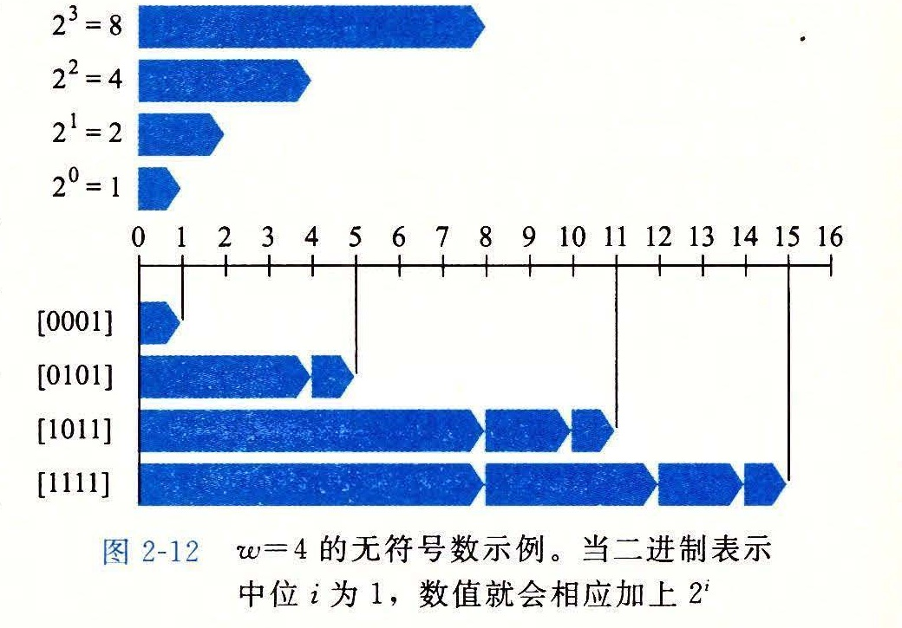

### 2.2.2 无符号数的编码

假设有一个整数数据类型有 w 位。我们可以将位向量写成 x，表示整个向量，或者写成 [x_w-1, x_w-2, ..., x_0]，表示向量中的每一位。把 x 看做一个二进制表示的数，就获得了 x 的无符号表示。在这个编码中，每个位 x_i 都取值为 0 或 1，后一种取值意味着数值 2^i 应为数字值的一部分。我们用一个函数 B2U_w（Binary to Unsigned 的缩写，长度为 w）来表示：

**原理：无符号数编码的定义**

对向量 x = [x_w-1, x_w-2, ..., x_0]：

> B2Uw(x) ≐ ∑i=0w-1 xi2i　（2.1）

在这个等式中，符号“≐”表示左边被定义为等于右边。函数 B2U_w 将一个长度为 w 的 0、1 串映射到非负整数。举一个示例，图 2-12 展示的是下面几种情况下 B2U 给出的从位向量到整数的映射：

**示例（2.2）**

| 位向量 | B2U4 的取值 |
| --- | --- |
| [0001] | 0 · 23 + 0 · 22 + 0 · 21 + 1 · 20 = 0 + 0 + 0 + 1 = 1 |
| [0101] | 0 · 23 + 1 · 22 + 0 · 21 + 1 · 20 = 0 + 4 + 0 + 1 = 5 |
| [1011] | 1 · 23 + 0 · 22 + 1 · 21 + 1 · 20 = 8 + 0 + 2 + 1 = 11 |
| [1111] | 1 · 23 + 1 · 22 + 1 · 21 + 1 · 20 = 8 + 4 + 2 + 1 = 15 |

在图中，我们用长度为 2^i 的指向右侧箭头的条表示每个位的位置 i。每个位向量对应的数值就等于所有值为 1 的位对应的条的长度之和。

让我们来考虑一下 w 位所能表示的值的范围。最小值是用位向量 [00...0] 表示，也就是整数值 0，而最大值是用位向量 [11...1] 表示，也就是整数值：

> UMaxw ≐ ∑i=0w-1 2i = 2w - 1

以 4 位情况为例，UMax_4 = B2U_4([1111]) = 2^4 - 1 = 15。因此，函数 B2U_w 能够被定义为一个映射 B2U_w: {0, 1}^w -> {0, ..., 2^w - 1}。

无符号数的二进制表示有一个很重要的属性，也就是每个介于 0 到 2^w - 1 之间的数都有唯一一个 w 位的值编码。例如，十进制值 11 作为无符号数，只有一个 4 位的表示，即 [1011]。我们用数学原理来重点讲述它，先表述原理再解释。

**原理：无符号数编码的唯一性**

函数 B2U_w 是一个双射。

数学术语双射是指一个函数 f 有两面：它将数值 x 映射为数值 y，即 y = f(x)，但它也可以反向操作，因为对每一个 y 而言，都有唯一一个数值 x 使得 f(x) = y。这可以用反函数 f^-1 来表示，在本例中，即 x = f^-1(y)。函数 B2U_w 将每一个长度为 w 的位向量都映射为 0 到 2^w - 1 之间的一个唯一值；反过来，我们称其为 U2B_w（即“无符号数到二进制”），在 0 到 2^w - 1 之间的每一个整数都可以映射为一个唯一的长度为 w 的位模式。
