# 第 2 章 信息的表示和处理

[返回总目录](../README.md) · [上一章](../第01章-计算机系统漫游/README.md) · [下一章](../第03章-程序的机器级表示/README.md) · [按小节阅读](README.md) · [练习题答案](练习题答案.md)

## 本章目录

- [第一部分 程序结构和执行](#第一部分-程序结构和执行)
- [第 2 章 信息的表示和处理](#第-2-章-信息的表示和处理)
  - [2.1 信息存储](#21-信息存储)
    - [2.1.1 十六进制表示法](#211-十六进制表示法)
    - [2.1.2 字数据大小](#212-字数据大小)
    - [2.1.3 寻址和字节顺序](#213-寻址和字节顺序)
    - [2.1.4 表示字符串](#214-表示字符串)
    - [2.1.5 表示代码](#215-表示代码)
    - [2.1.6 布尔代数简介](#216-布尔代数简介)
    - [2.1.7 C 语言中的位级运算](#217-c-语言中的位级运算)
    - [2.1.8 C 语言中的逻辑运算](#218-c-语言中的逻辑运算)
    - [2.1.9 C 语言中的移位运算](#219-c-语言中的移位运算)
  - [2.2 整数表示](#22-整数表示)
    - [2.2.1 整型数据类型](#221-整型数据类型)
    - [2.2.2 无符号数的编码](#222-无符号数的编码)
    - [2.2.3 补码编码](#223-补码编码)
    - [2.2.4 有符号数和无符号数之间的转换](#224-有符号数和无符号数之间的转换)
    - [2.2.5 C 语言中的有符号数与无符号数](#225-c-语言中的有符号数与无符号数)
    - [2.2.6 扩展一个数字的位表示](#226-扩展一个数字的位表示)
    - [2.2.7 截断数字](#227-截断数字)
    - [2.2.8 关于有符号数与无符号数的建议](#228-关于有符号数与无符号数的建议)
  - [2.3 整数运算](#23-整数运算)
    - [2.3.1 无符号加法](#231-无符号加法)
    - [2.3.2 补码加法](#232-补码加法)
    - [2.3.3 补码的非](#233-补码的非)
    - [2.3.4 无符号乘法](#234-无符号乘法)
    - [2.3.5 补码乘法](#235-补码乘法)
    - [2.3.6 乘以常数](#236-乘以常数)
    - [2.3.7 除以 2 的幂](#237-除以-2-的幂)
    - [2.3.8 关于整数运算的最后思考](#238-关于整数运算的最后思考)
  - [2.4 浮点数](#24-浮点数)
    - [2.4.1 二进制小数](#241-二进制小数)
    - [2.4.2 IEEE 浮点表示](#242-ieee-浮点表示)
    - [2.4.3 数字示例](#243-数字示例)
    - [2.4.4 舍入](#244-舍入)
    - [2.4.5 浮点运算](#245-浮点运算)
    - [2.4.6 C 语言中的浮点数](#246-c-语言中的浮点数)
  - [2.5 小结](#25-小结)
- [第 2 章家庭作业：2.55～2.60](#第-2-章家庭作业255260)
- [第 2 章家庭作业：2.61～2.81](#第-2-章家庭作业261281)
- [第 2 章家庭作业：2.82～2.91](#第-2-章家庭作业282291)
- [第 2 章家庭作业：2.92～2.97](#第-2-章家庭作业292297)

## 第一部分 程序结构和执行

我们对计算机系统的探索是从学习计算机本身开始的，它由处理器和存储器子系统组成。在核心部分，我们需要方法来表示基本数据类型，比如整数和实数运算的近似值。然后，我们考虑机器级指令如何操作这样的数据，以及编译器又如何将 C 程序翻译成这样的指令。接下来，研究几种实现处理器的方法，帮助我们更好地了解硬件资源如何被用来执行指令。一旦理解了编译器和机器级代码，我们就能了解如何通过编写 C 程序以及编译它们来最大化程序的性能。本部分以存储器子系统的设计作为结束，这是现代计算机系统最复杂的部分之一。

本书的这一部分将领着你深入了解如何表示和执行应用程序。你将学会一些技巧，来帮助你写出安全、可靠且充分利用计算资源的程序。

## 第 2 章 信息的表示和处理

现代计算机存储和处理的信息以二值信号表示。这些微不足道的二进制数字，或者称为位（bit），形成了数字革命的基础。大家熟悉并使用了 1000 多年的十进制（以 10 为基数）起源于印度，在 12 世纪被阿拉伯数学家改进，并在 13 世纪被意大利数学家 Leonardo Pisano（大约公元 1170-1250，更为大家所熟知的名字是 Fibonacci）带到西方。对于有 10 个手指的人类来说，使用十进制表示法是很自然的事情，但是当构造存储和处理信息的机器时，二进制值工作得更好。二值信号能够很容易地被表示、存储和传输，例如，可以表示为穿孔卡片上有洞或无洞、导线上的高电压或低电压，或者顺时针或逆时针的磁场。对二值信号进行存储和执行计算的电子电路非常简单和可靠，制造商能够在一个单独的硅片上集成数百万甚至数十亿个这样的电路。

孤立地讲，单个的位不是非常有用。然而，当把位组合在一起，再加上某种解释（interpretation），即赋予不同的可能位模式以含意，我们就能够表示任何有限集合的元素。比如，使用一个二进制数字系统，我们能够用位组来编码非负数。通过使用标准的字符码，我们能够对文档中的字母和符号进行编码。在本章中，我们将讨论这两种编码，以及负数表示和实数近似值的编码。

我们研究三种最重要的数字表示。无符号（unsigned）编码基于传统的二进制表示法，表示大于或者等于零的数字。补码（two's-complement）编码是表示有符号整数的最常见的方式，有符号整数就是可以为正或者为负的数字。浮点数（floating-point）编码是表示实数的科学记数法的以 2 为基数的版本。计算机用这些不同的表示方法实现算术运算，例如加法和乘法，类似于对应的整数和实数运算。

计算机的表示法是用有限数量的位来对一个数字编码，因此，当结果太大以至不能表示时，某些运算就会溢出（overflow）。溢出会导致某些令人吃惊的后果。例如，在今天的大多数计算机上（使用 32 位来表示数据类型 `int`），计算表达式 `200*300*400*500` 会得出结果 `-884901888`。这违背了整数运算的特性，计算一组正数的乘积不应产生一个负的结果。

另一方面，整数的计算机运算满足人们所熟知的真正整数运算的许多性质。例如，利用乘法的结合律和交换律，计算下面任何一个 C 表达式，都会得出结果 `-884901888`：

```text
(500 * 400) * (300 * 200)
((500 * 400) * 300) * 200
((200 * 500) * 300) * 400
400 * (200 * (300 * 500))
```

计算机可能没有产生期望的结果，但是至少它是一致的！

浮点运算有完全不同的数学属性。虽然溢出会产生特殊的值 +∞，但是一组正数的乘积总是正的。由于表示的精度有限，浮点运算是不可结合的。例如，在大多数机器上，C 表达式 `(3.14+1e20)-1e20` 求得的值会是 `0.0`，而 `3.14+(1e20-1e20)` 求得的值会是 `3.14`。整数运算和浮点数运算会有不同的数学属性，是因为它们处理数字表示有限性的方式不同：整数的表示虽然只能编码一个相对较小的数值范围，但是这种表示是精确的；而浮点数虽然可以编码一个较大的数值范围，但是这种表示只是近似的。

通过研究数字的实际表示，我们能够了解可以表示的值的范围和不同算术运算的属性。为了使编写的程序能在全部数值范围内正确工作，而且具有可以跨越不同机器、操作系统和编译器组合的可移植性，了解这种属性是非常重要的。后面我们会讲到，大量计算机的安全漏洞都是由于计算机算术运算的微妙细节引发的。在早期，当人们碰巧触发了程序漏洞，只会给人们带来一些不便，但是现在，有众多的黑客企图利用他们能找到的任何漏洞，不经过授权就进入他人的系统。这就要求程序员有更多的责任和义务，去了解他们的程序如何工作，以及如何被迫产生不良的行为。

计算机用几种不同的二进制表示形式来编码数值。随着第 3 章进入机器级编程，你需要熟悉这些表示方式。在本章中，我们描述这些编码，并且教你如何推出数字的表示。

通过直接操作数字的位级表示，我们得到了几种进行算术运算的方式。理解这些技术对于理解编译器产生的机器级代码是很重要的，编译器会试图优化算术表达式求值的性能。

我们对这部分内容的处理是基于一组核心的数学原理的。从编码的基本定义开始，然后得出一些属性，例如可表示的数字的范围、它们的位级表示以及算术运算的属性。我们相信从这样一个抽象的观点来分析这些内容，对你来说是很重要的，因为程序员需要对计算机运算与更为人熟悉的整数和实数运算之间的关系有清晰的理解。

> **怎样阅读本章**
>
> 本章我们研究在计算机上如何表示数字和其他形式数据的基本属性，以及计算机对这些数据执行操作的属性。这就要求我们深入研究数学语言，编写公式和方程式，以及展示重要属性的推导。
>
> 为了帮助你阅读，这部分内容安排如下：首先给出以数学形式表示的属性，作为原理。然后，用例子和非形式化的讨论来解释这个原理。我们建议你反复阅读原理描述和它的示例与讨论，直到你对该属性的说明内容及其重要性有了牢固的直觉。对于更加复杂的属性，还会提供推导，其结构看上去将会像一个数学证明。虽然最终你应该尝试理解这些推导，但在第一次阅读时你可以跳过它们。
>
> 我们也鼓励你在阅读正文的过程中完成练习题，这会促使你主动学习，帮助你理论联系实际。有了这些例题和练习题作为背景知识，再返回推导，你将发现理解起来会容易许多。同时，请放心，掌握好高中代数知识的人都具备理解这些内容所需要的数学技能。

C++ 编程语言建立在 C 语言基础之上，它们使用完全相同的数字表示和运算。本章中关于 C 的所有内容对 C++ 都有效。另一方面，Java 语言创造了一套新的数字表示和运算标准。C 标准的设计允许多种实现方式，而 Java 标准在数据的格式和编码上是非常精确具体的。本章中多处着重介绍了 Java 支持的表示和运算。

> **C 编程语言的演变**
>
> 前面提到过，C 编程语言是贝尔实验室的 Dennis Ritchie 最早开发出来的，目的是和 Unix 操作系统一起使用（Unix 也是贝尔实验室开发的）。在那个时候，大多数系统程序，例如操作系统，为了访问不同数据类型的低级表示，都必须大量地使用汇编代码。比如说，像 `malloc` 库函数提供的内存分配功能，用当时的其他高级语言是无法编写的。
>
> Brian Kernighan 和 Dennis Ritchie 的著作的第 1 版 [60] 记录了最初贝尔实验室的 C 语言版本。随着时间的推移，经过多个标准化组织的努力，C 语言也在不断地演变。1989 年，美国国家标准学会下的一个工作组推出了 ANSI C 标准，对最初的贝尔实验室的 C 语言做了重大修改。ANSI C 与贝尔实验室的 C 有了很大的不同，尤其是函数声明的方式。Brian Kernighan 和 Dennis Ritchie 在著作的第 2 版 [61] 中描述了 ANSI C，这本书至今仍被公认为关于 C 语言最好的参考手册之一。
>
> 国际标准化组织接替了对 C 语言进行标准化的任务，在 1990 年推出了一个几乎和 ANSI C 一样的版本，称为“ISO C90”。该组织在 1999 年又对 C 语言做了更新，推出“ISO C99”。在这一版本中，引入了一些新的数据类型，对使用不符合英语语言字符的文本字符串提供了支持。更新的版本 2011 年得到批准，称为“ISO C11”，其中再次添加了更多的数据类型和特性。最近增加的大多数内容都可以向后兼容，这意味着根据早期标准（至少可以回溯到 ISO C90）编写的程序按新标准编译时会有同样的行为。
>
> GNU 编译器套装（GNU Compiler Collection，GCC）可以基于不同的命令行选项，依照多个不同版本的 C 语言规则来编译程序，如图 2-1 所示。
>
> 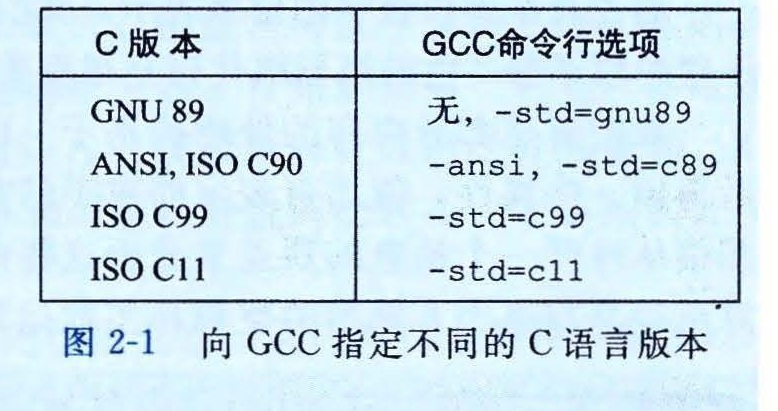
>
> 比如，根据 ISO C11 来编译程序 `prog.c`，我们就使用命令行：
>
> ```text
> linux> gcc -std=c11 prog.c
> ```
>
> 编译选项 `-ansi` 和 `-std=c89` 的用法是一样的——会根据 ANSI 或者 ISO C90 标准来编译程序。（C90 有时也称为“C89”，这是因为它的标准化工作是从 1989 年开始的。）编译选项 `-std=c99` 会让编译器按照 ISO C99 的规则进行编译。
>
> 本书中，没有指定任何编译选项时，程序会按照基于 ISO C90 的 C 语言版本进行编译，但是也包括一些 C99、C11 的特性，一些 C++ 的特性，还有一些是与 GCC 相关的特性。GNU 项目正在开发一个结合了 ISO C11 和其他一些特性的版本，可以通过命令行选项 `-std=gnu11` 来指定。（目前，这个实现还未完成。）今后，这个版本会成为默认的版本。

### 2.1 信息存储

大多数计算机使用 8 位的块，或者字节（byte），作为最小的可寻址的内存单位，而不是访问内存中单独的位。机器级程序将内存视为一个非常大的字节数组，称为虚拟内存（virtual memory）。内存的每个字节都由一个唯一的数字来标识，称为它的地址（address），所有可能地址的集合就称为虚拟地址空间（virtual address space）。

顾名思义，这个虚拟地址空间只是一个展现给机器级程序的概念性映像。实际的实现（见第 9 章）是将动态随机访问存储器（DRAM）、闪存、磁盘存储器、特殊硬件和操作系统软件结合起来，为程序提供一个看上去统一的字节数组。

在接下来的几章中，我们将讲述编译器和运行时系统是如何将存储器空间划分为更可管理的单元，来存放不同的程序对象（program object），即程序数据、指令和控制信息。可以用各种机制来分配和管理程序不同部分的存储。这种管理完全是在虚拟地址空间里完成的。

例如，C 语言中一个指针的值（无论它指向一个整数、一个结构或是某个其他程序对象）都是某个存储块的第一个字节的虚拟地址。C 编译器还把每个指针和类型信息联系起来，这样就可以根据指针值的类型，生成不同的机器级代码来访问存储在指针所指向位置处的值。尽管 C 编译器维护着这个类型信息，但是它生成的实际机器级程序并不包含关于数据类型的信息。每个程序对象可以简单地视为一个字节块，而程序本身就是一个字节序列。

> **给 C 语言初学者：C 语言中指针的作用**
>
> 指针是 C 语言的一个重要特性。它提供了引用数据结构（包括数组）的元素的机制。与变量类似，指针也有两个方面：值和类型。它的值表示某个对象的位置，而它的类型表示那个位置上所存储对象的类型（比如整数或者浮点数）。
>
> 真正理解指针需要查看它们在机器级上的表示以及实现。这将是第 3 章的重点之一，3.10.1 节将对其进行深入介绍。

#### 2.1.1 十六进制表示法

一个字节由 8 位组成。在二进制表示法中，它的值域是 00000000₂ ~ 11111111₂。如果看成十进制整数，它的值域就是 0₁₀ ~ 255₁₀。两种符号表示法对于描述位模式来说都不是非常方便。二进制表示法太冗长，而十进制表示法与位模式的互相转化很麻烦。替代的方法是，以 16 为基数，或者叫做十六进制（hexadecimal）数，来表示位模式。十六进制（简写为 “hex”）使用数字 `0`-`9` 以及字符 `A`-`F` 来表示 16 个可能的值。图 2-2 展示了 16 个十六进制数字对应的十进制值和二进制值。用十六进制书写，一个字节的值域为 00₁₆ ~ FF₁₆。

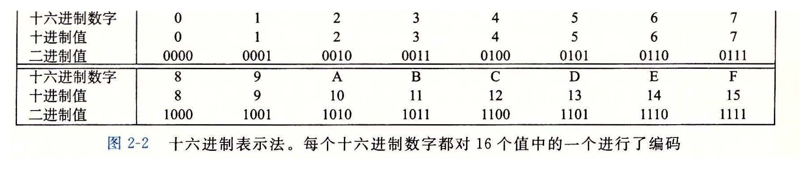

在 C 语言中，以 `0x` 或 `0X` 开头的数字常量被认为是十六进制的值。字符 `A`-`F` 既可以是大写，也可以是小写。例如，我们可以将数字 FA1D37B₁₆ 写作 `0xFA1D37B`，或者 `0xfa1d37b`，甚至是大小写混合，比如 `0xFa1D37b`。在本书中，我们将使用 C 表示法来表示十六进制值。

编写机器级程序的一个常见任务就是在位模式的十进制、二进制和十六进制表示之间人工转换。二进制和十六进制之间的转换比较简单直接，因为可以一次执行一个十六进制数字的转换。数字的转换可以参考如图 2-2 所示的表。一个简单的窍门是，记住十六进制数字 A、C 和 F 相应的十进制值。而对于把十六进制值 B、D 和 E 转换成十进制值，则可以通过计算它们与前三个值的相对关系来完成。

比如，假设给你一个数字 `0x173A4C`。可以通过展开每个十六进制数字，将它转换为二进制格式，如下所示：

| 十六进制 | 1 | 7 | 3 | A | 4 | C |
|---|---|---|---|---|---|---|
| 二进制 | 0001 | 0111 | 0011 | 1010 | 0100 | 1100 |

这样就得到了二进制表示 `000101110011101001001100`。

反过来，如果给定一个二进制数字 `1111001010110110110011`，可以通过首先把它分为每 4 位一组来转换为十六进制。不过要注意，如果位总数不是 4 的倍数，最左边的一组可以少于 4 位，前面用 0 补足。然后将每个 4 位组转换为相应的十六进制数字：

| 二进制 | 11 | 1100 | 1010 | 1101 | 1011 | 0011 |
|---|---|---|---|---|---|---|
| 十六进制 | 3 | C | A | D | B | 3 |

**练习题 2.1**

完成下面的数字转换：

A. 将 `0x39A7F8` 转换为二进制。

B. 将二进制 `1100100101111011` 转换为十六进制。

C. 将 `0xD5E4C` 转换为二进制。

D. 将二进制 `1001101110011110110101` 转换为十六进制。

当值 x 是 2 的非负整数 n 次幂时，也就是 x = 2<sup>n</sup>，我们可以很容易地将 x 写成十六进制形式，只要记住 x 的二进制表示就是 1 后面跟 n 个 0。十六进制数字 0 代表 4 个二进制 0。所以，当 n 表示成 i + 4j 的形式，其中 0 ≤ i ≤ 3，我们可以把 x 写成开头的十六进制数字为 1(i = 0)、2(i = 1)、4(i = 2) 或者 8(i = 3)，后面跟随着 j 个十六进制的 0。比如，x = 2048 = 2<sup>11</sup>，我们有 n = 11 = 3 + 4 · 2，从而得到十六进制表示 `0x800`。

**练习题 2.2**

填写下表中的空白项，给出 2 的不同次幂的二进制和十六进制表示：

| n | 2<sup>n</sup>（十进制） | 2<sup>n</sup>（十六进制） |
|---:|---:|---:|
| 9 | 512 | `0x200` |
| 19 |  |  |
|  | 16 384 |  |
|  |  | `0x10000` |
| 17 |  |  |
|  | 32 |  |
|  |  | `0x80` |

十进制和十六进制表示之间的转换需要使用乘法或者除法来处理一般情况。将一个十进制数字 x 转换为十六进制，可以反复地用 16 除 x，得到一个商 q 和一个余数 r，也就是 x = q · 16 + r。然后，我们用十六进制数字表示的 r 作为最低位数字，并且通过对 q 反复进行这个过程得到剩下的数字。例如，考虑十进制 314 156 的转换：

```text
314 156 = 19 634 · 16 + 12   (C)
 19 634 =  1 227 · 16 +  2   (2)
  1 227 =     76 · 16 + 11   (B)
     76 =      4 · 16 + 12   (C)
      4 =      0 · 16 +  4   (4)
```

从这里，我们能读出十六进制表示为 `0x4CB2C`。

反过来，将一个十六进制数字转换为十进制数字，我们可以用相应的 16 的幂乘以每个十六进制数字。比如，给定数字 `0x7AF`，我们计算它对应的十进制值为：

```text
7 · 16² + 10 · 16 + 15
= 7 · 256 + 10 · 16 + 15
= 1792 + 160 + 15
= 1967
```

**练习题 2.3**

一个字节可以用两个十六进制数字来表示。填写下表中缺失的项，给出不同字节模式的十进制、二进制和十六进制值：

| 十进制 | 二进制 | 十六进制 |
|---:|---:|---:|
| 0 | `0000 0000` | `0x00` |
| 167 |  |  |
| 62 |  |  |
| 188 |  |  |
|  | `0011 0111` |  |
|  | `1000 1000` |  |
|  | `1111 0011` |  |
|  |  | `0x52` |
|  |  | `0xAC` |
|  |  | `0xE7` |

> **旁注：十进制和十六进制间的转换**
>
> 较大数值的十进制和十六进制之间的转换，最好是让计算机或者计算器来完成。有大量的工具可以完成这个工作。一个简单的方法就是利用任何标准的搜索引擎，比如查询：
>
> ```text
> 把 0xabcd 转换为十进制数
> ```
>
> 或
>
> ```text
> 把 123 用十六进制表示
> ```

**练习题 2.4**

不将数字转换为十进制或者二进制，试着解答下面的算术题，答案要用十六进制表示。提示：只要将执行十进制加法和减法所使用的方法改成以 16 为基数。

A. `0x503c + 0x8 =`

B. `0x503c - 0x40 =`

C. `0x503c + 64 =`

D. `0x50ea - 0x503c =`

#### 2.1.2 字数据大小

每台计算机都有一个字长（word size），指明指针数据的标称大小（nominal size）。因为虚拟地址是以这样的一个字来编码的，所以字长决定的最重要的系统参数就是虚拟地址空间的最大大小。也就是说，对于一个字长为 w 位的机器而言，虚拟地址的范围为 0 ~ 2<sup>w</sup> - 1，程序最多访问 2<sup>w</sup> 个字节。

最近这些年，出现了大规模的从 32 位字长机器到 64 位字长机器的迁移。这种情况首先出现在为大型科学和数据库应用设计的高端机器上，之后是台式机和笔记本电脑，最近则出现在智能手机的处理器上。32 位字长限制虚拟地址空间为 4 千兆字节（写作 4GB），也就是说，刚刚超过 4 × 10<sup>9</sup> 字节。扩展到 64 位字长使得虚拟地址空间为 16EB，大约是 1.84 × 10<sup>19</sup> 字节。

大多数 64 位机器也可以运行为 32 位机器编译的程序，这是一种向后兼容。因此，举例来说，当程序 `prog.c` 用如下伪指令编译后：

```text
linux> gcc -m32 prog.c
```

该程序就可以在 32 位或 64 位机器上正确运行。另一方面，若程序用下述伪指令编译：

```text
linux> gcc -m64 prog.c
```

那就只能在 64 位机器上运行。因此，我们将程序称为“32 位程序”或“64 位程序”时，区别在于该程序是如何编译的，而不是其运行的机器类型。

计算机和编译器支持多种不同方式编码的数字格式，如不同长度的整数和浮点数。比如，许多机器都有处理单个字节的指令，也有处理表示为 2 字节、4 字节或者 8 字节整数的指令，还有些指令支持表示为 4 字节和 8 字节的浮点数。

C 语言支持整数和浮点数的多种数据格式。图 2-3 展示了为 C 语言各种数据类型分配的字节数。（我们在 2.2 节讨论 C 标准保证的字节数和典型的字节数之间的关系。）有些数据类型的确切字节数依赖于程序是如何被编译的。我们给出的是 32 位和 64 位程序的典型值。

| C 声明 | 32 位字节数 | 64 位字节数 |
|---|---:|---:|
| `[signed] char` / `unsigned char` | 1 | 1 |
| `short` / `unsigned short` | 2 | 2 |
| `int` / `unsigned` | 4 | 4 |
| `long` / `unsigned long` | 4 | 8 |
| `int32_t` / `uint32_t` | 4 | 4 |
| `int64_t` / `uint64_t` | 8 | 8 |
| `char *` | 4 | 8 |
| `float` | 4 | 4 |
| `double` | 8 | 8 |

图 2-3 基本 C 数据类型的典型大小（以字节为单位）。分配的字节数受程序是如何编译的影响而变化。本图给出的是 32 位和 64 位程序的典型值。

整数或者为有符号的，即可以表示负数、零和正数；或者为无符号的，即只能表示非负数。C 的数据类型 `char` 表示一个单独的字节。尽管 `char` 是由于它被用来存储文本串中的单个字符这一事实而得名，但它也能被用来存储整数值。数据类型 `short`、`int` 和 `long` 可以提供各种数据大小。即使是为 64 位系统编译，数据类型 `int` 通常也只有 4 个字节。数据类型 `long` 一般在 32 位程序中为 4 字节，在 64 位程序中则为 8 字节。

为了避免由于依赖“典型”大小和不同编译器设置带来的奇怪行为，ISO C99 引入了一类数据类型，其数据大小是固定的，不随编译器和机器设置而变化。其中就有数据类型 `int32_t` 和 `int64_t`，它们分别为 4 个字节和 8 个字节。使用确定大小的整数类型是程序员准确控制数据表示的最佳途径。

大部分数据类型都编码为有符号数值，除非有前缀关键字 `unsigned` 或对确定大小的数据类型使用了特定的无符号声明。数据类型 `char` 是一个例外。尽管大多数编译器和机器将它们视为有符号数，但 C 标准不保证这一点。相反，正如方括号指示的那样，程序员应该用有符号字符的声明来保证其为一个字节的有符号数值。不过，在很多情况下，程序行为对数据类型 `char` 是有符号的还是无符号的并不敏感。

对关键字的顺序以及包括还是省略可选关键字来说，C 语言允许存在多种形式。比如，下面所有的声明都是一个意思：

```text
unsigned long
unsigned long int
long unsigned
long unsigned int
```

我们将始终使用图 2-3 给出的格式。

图 2-3 还展示了指针（例如一个被声明为类型为 `char *` 的变量）使用程序的全字长。大多数机器还支持两种不同的浮点数格式：单精度（在 C 中声明为 `float`）和双精度（在 C 中声明为 `double`）。这些格式分别使用 4 字节和 8 字节。

> **给 C 语言初学者：声明指针**
>
> 对于任何数据类型 `T`，声明：
>
> ```text
> T *p;
> ```
>
> 表明 `p` 是一个指针变量，指向一个类型为 `T` 的对象。例如：
>
> ```text
> char *p;
> ```
>
> 就将一个指针声明为指向一个 `char` 类型的对象。

程序员应该力图使他们的程序在不同的机器和编译器上可移植。可移植性的一个方面就是使程序对不同数据类型的确切大小不敏感。C 语言标准对不同数据类型的数字范围设置了下界（这点在后面还将讲到），但是却没有上界。因为从 1980 年左右到 2010 年左右，32 位机器和 32 位程序是主流的组合，许多程序的编写都假设为图 2-3 中 32 位程序的字节分配。随着 64 位机器的日益普及，在将这些程序移植到新机器上时，许多隐藏的对字长的依赖性就会显现出来，成为错误。比如，许多程序员假设一个声明为 `int` 类型的程序对象能被用来存储一个指针。这在大多数 32 位的机器上能正常工作，但是在一台 64 位的机器上却会导致问题。

#### 2.1.3 寻址和字节顺序

对于跨越多字节的程序对象，我们必须建立两个规则：这个对象的地址是什么，以及在内存中如何排列这些字节。在几乎所有的机器上，多字节对象都被存储为连续的字节序列，对象的地址为所使用字节中最小的地址。例如，假设一个类型为 `int` 的变量 `x` 的地址为 `0x100`，也就是说，地址表达式 `&x` 的值为 `0x100`。那么，（假设数据类型 `int` 为 32 位表示）`x` 的 4 个字节将被存储在内存的 `0x100`、`0x101`、`0x102` 和 `0x103` 位置。

排列表示一个对象的字节有两个通用的规则。考虑一个 w 位的整数，其位表示为 [x<sub>w-1</sub>, x<sub>w-2</sub>, ..., x₁, x₀]，其中 x<sub>w-1</sub> 是最高有效位，而 x₀ 是最低有效位。假设 w 是 8 的倍数，这些位就能被分组成为字节，其中最高有效字节包含位 [x<sub>w-1</sub>, x<sub>w-2</sub>, ..., x<sub>w-8</sub>]，而最低有效字节包含位 [x₇, x₆, ..., x₀]，其他字节包含中间的位。

某些机器选择在内存中按照从最低有效字节到最高有效字节的顺序存储对象，而另一些机器则按照从最高有效字节到最低有效字节的顺序存储。前一种规则--最低有效字节在最前面的方式，称为小端法（little endian）。后一种规则--最高有效字节在最前面的方式，称为大端法（big endian）。

假设变量 `x` 的类型为 `int`，位于地址 `0x100` 处，它的十六进制值为 `0x01234567`。地址范围 `0x100 ~ 0x103` 的字节顺序依赖于机器的类型：

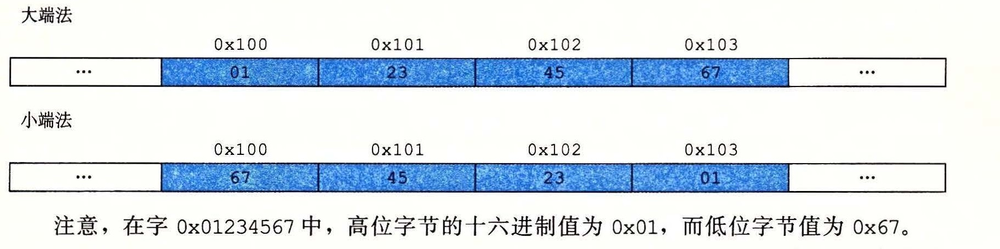

大多数 Intel 兼容机都只用小端模式。另一方面，IBM 和 Oracle（从其 2010 年收购 Sun Microsystems 开始）的大多数机器则是按大端模式操作。注意我们说的是“大多数”。这些规则并没有严格按照企业界限来划分。比如，IBM 和 Oracle 制造的个人计算机使用的是 Intel 兼容的处理器，因此使用小端法。许多比较新的微处理器是双端法（bi-endian），也就是说可以把它们配置成作为大端或者小端的机器运行。然而，实际情况是：一旦选择了特定操作系统，那么字节顺序也就固定下来。比如，用于许多移动电话的 ARM 微处理器，其硬件可以按小端或大端两种模式操作，但是这些芯片上最常见的两种操作系统--Android（来自 Google）和 iOS（来自 Apple）--却只能运行于小端模式。

令人吃惊的是，在哪种字节顺序是合适的这个问题上，人们表现得非常情绪化。实际上，术语 “little endian（小端）” 和 “big endian（大端）” 出自 Jonathan Swift 的《格利佛游记》（Gulliver's Travels）一书，其中交战的两个派别无法就应该从哪一端（小端还是大端）打开一个半熟的鸡蛋达成一致。就像鸡蛋的问题一样，选择何种字节顺序没有技术上的理由，因此争论沦为关于社会政治论题的争论。只要选择了一种规则并且始终如一地坚持，对于哪种字节排序的选择都是任意的。

> **旁注：“端”的起源**
>
> 以下是 Jonathan Swift 在 1726 年关于大小端之争历史的描述：
>
> “……我下面要告诉你的是，Lilliput 和 Blefuscu 这两大强国在过去 36 个月里一直在苦战。战争开始是由于以下的原因：我们大家都认为，吃鸡蛋前，原始的方法是打破鸡蛋较大的一端，可是当今皇帝的祖父小时候吃鸡蛋，一次按古法打鸡蛋时碰巧将一个手指弄破了，因此他的父亲，当时的皇帝，就下了一道敕令，命令全体臣民吃鸡蛋时打破鸡蛋较小的一端，违令者重罚。老百姓们对这项命令极为反感。历史告诉我们，由此曾发生过六次叛乱，其中一个皇帝送了命，另一个丢了王位。这些叛乱大多都是由 Blefuscu 的国王大臣们煽动起来的。叛乱平息后，流亡的人总是逃到那个帝国去寻救避难。据估计，先后几次有 11 000 人情愿受死也不肯去打破鸡蛋较小的一端。关于这一争端，曾出版过几百本大部著作，不过大端派的书一直是受禁的，法律也规定该派的任何人不得做官。”（此段译文摘自网上蒋剑锋译的《格利佛游记》第一卷第 4 章。）
>
> 在他那个时代，Swift 是在讽刺英国（Lilliput）和法国（Blefuscu）之间持续的冲突。Danny Cohen，一位网络协议的早期开创者，第一次使用这两个术语来指代字节顺序 [24]，后来这个术语被广泛接纳了。

对于大多数应用程序员来说，其机器所使用的字节顺序是完全不可见的。无论为哪种类型的机器所编译的程序都会得到同样的结果。不过有时候，字节顺序会成为问题。首先是在不同类型的机器之间通过网络传送二进制数据时，一个常见的问题是当小端法机器产生的数据被发送到大端法机器或者反过来时，接收程序会发现，字里的字节成了反序的。为了避免这类问题，网络应用程序的代码编写必须遵守已建立的关于字节顺序的规则，以确保发送方机器将它的内部表示转换成网络标准，而接收方机器则将网络标准转换为它的内部表示。我们将在第 11 章中看到这种转换的例子。

第二种情况是，当阅读表示整数数据的字节序列时字节顺序也很重要。这通常发生在检查机器级程序时。作为一个示例，从某个文件中摘出了下面这行代码，该文件给出了一个针对 Intel x86-64 处理器的机器级代码的文本表示：

```text
4004d3: 01 05 43 0b 20 00    add %eax,0x200b43(%rip)
```

这一行是由反汇编器（disassembler）生成的，反汇编器是一种确定可执行程序文件所表示的指令序列的工具。我们将在第 3 章中学习有关这些工具的更多知识，以及怎样解释像这样的行。而现在，我们只是注意这行表述的意思是：十六进制字节串 `01 05 43 0b 20 00` 是一条指令的字节级表示，这条指令是把一个字长的数据加到一个值上，该值的存储地址由 `0x200b43` 加上当前程序计数器的值得到，当前程序计数器的值即为下一条将要执行指令的地址。如果取出这个序列的最后 4 个字节：`43 0b 20 00`，并且按照相反的顺序写出，我们得到 `00 20 0b 43`。去掉开头的 0，得到值 `0x200b43`，这就是右边的数值。当阅读像此类小端法机器生成的机器级程序表示时，经常会将字节按照相反的顺序显示。书写字节序列的自然方式是最低位字节在左边，而最高位字节在右边，这正好和通常书写数字时最高有效位在左边，最低有效位在右边的方式相反。

字节顺序变得重要的第三种情况是当编写规避正常的类型系统的程序时。在 C 语言中，可以通过使用强制类型转换（cast）或联合（union）来允许以一种数据类型引用一个对象，而这种数据类型与创建这个对象时定义的数据类型不同。大多数应用编程都强烈不推荐这种编码技巧，但是它们对系统级编程来说是非常有用，甚至是必需的。

图 2-4 展示了一段 C 代码，它使用强制类型转换来访问和打印不同程序对象的字节表示。我们用 `typedef` 将数据类型 `byte_pointer` 定义为一个指向类型为 `unsigned char` 的对象的指针。这样一个字节指针引用一个字节序列，其中每个字节都被认为是一个非负整数。第一个例程 `show_bytes` 的输入是一个字节序列的地址，它用一个字节指针以及一个字节数来指示。该字节数指定为数据类型 `size_t`，表示数据结构大小的首选数据类型。`show_bytes` 打印出每个以十六进制表示的字节。C 格式化指令 `"%.2x"` 表明整数必须用至少两个数字的十六进制格式输出。

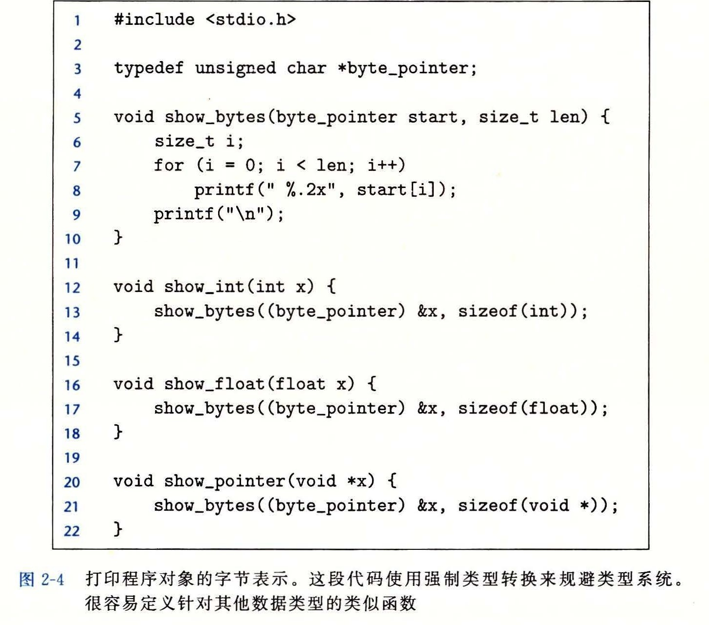

过程 `show_int`、`show_float` 和 `show_pointer` 展示了如何使用程序 `show_bytes` 来分别输出类型为 `int`、`float` 和 `void *` 的 C 程序对象的字节表示。可以观察到它们仅仅传递给 `show_bytes` 一个指向它们参数 `x` 的指针 `&x`，且这个指针被强制类型转换为 `unsigned char *`，这种强制类型转换告诉编译器，程序应该把这个指针看成指向一个字节序列，而不是指向一个原始数据类型的对象。然后，这个指针会被看成是对象使用的最低字节地址。

这些过程使用 C 语言的运算符 `sizeof` 来确定对象使用的字节数。一般来说，表达式 `sizeof(T)` 返回存储一个类型为 `T` 的对象所需要的字节数。使用 `sizeof` 而不是一个固定的值，是向编写在不同机器类型上可移植的代码迈进了一步。

在几种不同的机器上运行如图 2-5 所示的代码，得到如图 2-6 所示的结果。我们使用了以下几种机器：

- **Linux 32**：运行 Linux 的 Intel IA32 处理器。
- **Windows**：运行 Windows 的 Intel IA32 处理器。
- **Sun**：运行 Solaris 的 Sun Microsystems SPARC 处理器。（这些机器现在由 Oracle 生产。）
- **Linux 64**：运行 Linux 的 Intel x86-64 处理器。

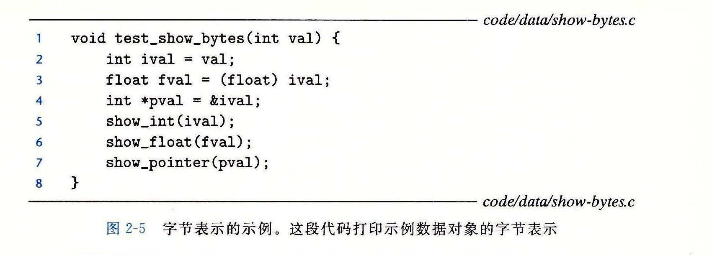

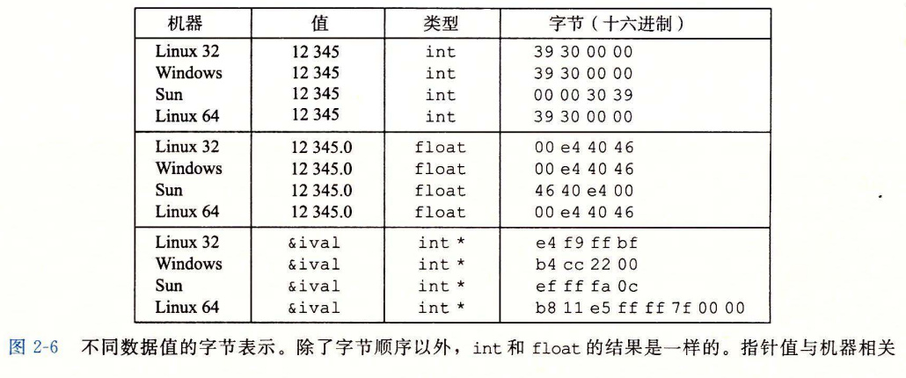

参数 12 345 的十六进制表示为 `0x00003039`。对于 `int` 类型的数据，除了字节顺序以外，我们在所有机器上都得到相同的结果。特别地，我们可以看到在 Linux 32、Windows 和 Linux 64 上，最低有效字节值 `0x39` 最先输出，这说明它们是小端法机器；而在 Sun 上最后输出，这说明 Sun 是大端法机器。同样地，`float` 数据的字节，除了字节顺序以外，也都是相同的。另一方面，指针值却是完全不同的。不同的机器/操作系统配置使用不同的存储分配规则。一个值得注意的特性是 Linux 32、Windows 和 Sun 的机器使用 4 字节地址，而 Linux 64 使用 8 字节地址。

> **给 C 语言初学者：使用 typedef 来命名数据类型**
>
> C 语言中的 `typedef` 声明提供了一种给数据类型命名的方式。这能够极大地改善代码的可读性，因为深度嵌套的类型声明很难读懂。
>
> `typedef` 的语法与声明变量的语法十分相像，除了它使用的是类型名，而不是变量名。因此，图 2-4 中 `byte_pointer` 的声明和将一个变量声明为类型 `unsigned char *` 有相同的形式。
>
> 例如，声明：
>
> ```text
> typedef int *int_pointer;
> int_pointer ip;
> ```
>
> 将类型 `int_pointer` 定义为一个指向 `int` 的指针，并且声明了一个这种类型的变量 `ip`。我们还可以将这个变量直接声明为：
>
> ```text
> int *ip;
> ```

> **给 C 语言初学者：使用 printf 格式化输出**
>
> `printf` 函数（还有它的同类 `fprintf` 和 `sprintf`）提供了一种打印信息的方式，这种方式对格式化细节有相当大的控制能力。第一个参数是格式串（format string），而其余的参数都是要打印的值。在格式串里，每个以“%”开始的字符序列都表示如何格式化下一个参数。典型的示例包括：`%d` 是输出一个十进制整数，`%f` 是输出一个浮点数，而 `%c` 是输出一个字符，其编码由参数给出。
>
> 指定确定大小数据类型的格式，如 `int32_t`，要更复杂一些，相关内容参见 2.2.3 节的旁注。

可以观察到，尽管浮点型和整型数据都是对数值 12 345 编码，但是它们有截然不同的字节模式：整型为 `0x00003039`，而浮点数为 `0x4640E400`。一般而言，这两种格式使用不同的编码方法。如果我们将这些十六进制模式扩展为二进制形式，并且适当地将它们移位，就会发现一个有 13 个相匹配的位的序列，用一串星号标识出来：

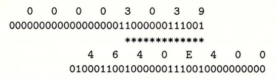

这并不是巧合。当我们研究浮点数格式时，还将再回到这个例子。

> **给 C 语言初学者：指针和数组**
>
> 在函数 `show_bytes`（图 2-4）中，我们看到指针和数组之间紧密的联系，这将在 3.8 节中详细描述。这个函数有一个类型为 `byte_pointer`（被定义为一个指向 `unsigned char` 的指针）的参数 `start`，但是我们在第 8 行上看到数组引用 `start[i]`。在 C 语言中，我们能够用数组表示法来引用指针，同时我们也能用指针表示法来引用数组元素。在这个例子中，引用 `start[i]` 表示我们想要读取以 `start` 指向的位置为起始的第 i 个位置处的字节。

> **给 C 语言初学者：指针的创建和间接引用**
>
> 在图 2-4 的第 13、17 和 21 行，我们看到对 C 和 C++ 中两种独有操作的使用。C 的“取地址”运算符 `&` 创建一个指针。在这三行中，表达式 `&x` 创建了一个指向保存变量 `x` 的位置的指针。这个指针的类型取决于 `x` 的类型，因此这三个指针的类型分别为 `int *`、`float *` 和 `void **`。（数据类型 `void *` 是一种特殊类型的指针，没有相关联的类型信息。）
>
> 强制类型转换运算符可以将一种数据类型转换为另一种。因此，强制类型转换 `(byte_pointer) &x` 表明无论指针 `&x` 以前是什么类型，它现在就是一个指向数据类型为 `unsigned char` 的指针。这里给出的这些强制类型转换不会改变真实的指针，它们只是告诉编译器以新的数据类型来看待被指向的数据。

> **旁注：生成一张 ASCII 表**
>
> 可以通过执行命令 `man ascii` 来得到一张 ASCII 字符码的表。

**练习题 2.5**

考虑下面对 `show_bytes` 的三次调用：

```text
int val = 0x87654321;
byte_pointer valp = (byte_pointer) &val;

show_bytes(valp, 1);  /* A. */
show_bytes(valp, 2);  /* B. */
show_bytes(valp, 3);  /* C. */
```

指出在小端法机器和大端法机器上，每次调用的输出值。

| 调用 | 小端法 | 大端法 |
|---|---|---|
| A |  |  |
| B |  |  |
| C |  |  |

**练习题 2.6**

使用 `show_int` 和 `show_float`，我们确定整数 3510593 的十六进制表示为 `0x00359141`，而浮点数 3510593.0 的十六进制表示为 `0x4A564504`。

A. 写出这两个十六进制值的二进制表示。

B. 移动这两个二进制串的相对位置，使得它们相匹配的位数最多。有多少位相匹配呢？

C. 串中的什么部分不相匹配？

#### 2.1.4 表示字符串

C 语言中字符串被编码为一个以 null（其值为 0）字符结尾的字符数组。每个字符都由某个标准编码来表示，最常见的是 ASCII 字符码。因此，如果我们以参数 `"12345"` 和 6（包括终止符）来运行例程 `show_bytes`，我们得到结果：

```text
31 32 33 34 35 00
```

请注意，十进制数字 x 的 ASCII 码正好是 `0x3x`，而终止字节的十六进制表示为 `0x00`。在使用 ASCII 码作为字符码的任何系统上都将得到相同的结果，与字节顺序和字大小规则无关。因而，文本数据比二进制数据具有更强的平台独立性。

**练习题 2.7**

下面对 `show_bytes` 的调用将输出什么结果？

```text
const char *s = "abcdef";
show_bytes((byte_pointer) s, strlen(s));
```

注意字母 `a` ~ `z` 的 ASCII 码为 `0x61` ~ `0x7A`。

> **旁注：文字编码的 Unicode 标准**
>
> ASCII 字符集适合于编码英语文档，但是在表达一些特殊字符方面并没有太多办法，例如法语的 “ç”。它完全不适合编码希腊语、俄语和中文等语言的文档。这些年，提出了很多方法来对不同语言的文字进行编码。Unicode 联合会（Unicode Consortium）修订了最全面且广泛接受的文字编码标准。当前的 Unicode 标准（7.0 版）的字库包括将近 100 000 个字符，支持广泛的语言种类，包括古埃及和巴比伦的语言。为了保持信用，Unicode 技术委员会否决了为 Klingon（即电视连续剧《星际迷航》中的虚构文明）编写语言标准的提议。
>
> 基本编码，称为 Unicode 的“统一字符集”，使用 32 位来表示字符。这好像要求文本串中每个字符要占用 4 个字节。不过，可以有一些替代编码，常见的字符只需要 1 个或 2 个字节，而不太常用的字符需要多一些的字节数。特别地，UTF-8 表示将每个字符编码为一个字节序列，这样标准 ASCII 字符还是使用和它们在 ASCII 中一样的单字节编码，这也就意味着所有的 ASCII 字节序列用 ASCII 码表示和用 UTF-8 表示是一样的。Java 编程语言使用 Unicode 来表示字符串。对于 C 语言也有支持 Unicode 的程序库。

#### 2.1.5 表示代码

考虑下面的 C 函数：

```c
int sum(int x, int y) {
    return x + y;
}
```

当我们在示例机器上编译时，生成如下字节表示的机器代码：

```text
Linux 32   55 89 e5 8b 45 0c 03 45 08 c9 c3
Windows    55 89 e5 8b 45 0c 03 45 08 5d c3
Sun        81 c3 e0 08 90 02 00 09
Linux 64   55 48 89 e5 89 7d fc 89 75 f8 03 45 fc c9 c3
```

我们发现指令编码是不同的。不同的机器类型使用不同的且不兼容的指令和编码方式。即使是完全一样的进程，运行在不同的操作系统上也会有不同的编码规则，因此二进制代码是不兼容的。二进制代码很少能在不同机器和操作系统组合之间移植。

计算机系统的一个基本概念就是，从机器的角度来看，程序仅仅只是字节序列。机器没有关于原始源程序的任何信息，除了可能有些用来帮助调试的辅助表以外。在第 3 章学习机器级编程时，我们将更清楚地看到这一点。

#### 2.1.6 布尔代数简介

二进制值是计算机编码、存储和操作信息的核心，所以围绕数值 0 和 1 的研究已经演化出了丰富的数学知识体系。这起源于 1850 年前后乔治·布尔（George Boole, 1815-1864）的工作，因此也称为布尔代数（Boolean algebra）。布尔注意到通过将逻辑值 TRUE（真）和 FALSE（假）编码为二进制值 1 和 0，能够设计出一种代数，以研究逻辑推理的基本原则。

最简单的布尔代数是在二元集合 `{0, 1}` 基础上的定义。图 2-7 定义了这种布尔代数中的几种运算。我们用来表示这些运算的符号与 C 语言位级运算使用的符号是相匹配的，这些将在后面讨论到。

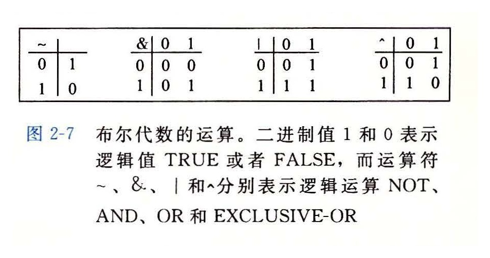

布尔运算 `~` 对应于逻辑运算 NOT，在命题逻辑中用符号 `¬` 表示。也就是说，当 `P` 不是真的时候，我们就说 `¬P` 是真的，反之亦然。相应地，当 `P` 等于 0 时，`~P` 等于 1，反之亦然。

布尔运算 `&` 对应于逻辑运算 AND，在命题逻辑中用符号 `∧` 表示。当 `P` 和 `Q` 都为真时，我们说 `P ∧ Q` 为真。相应地，只有当 `p = 1` 且 `q = 1` 时，`p & q` 才等于 1。

布尔运算 `|` 对应于逻辑运算 OR，在命题逻辑中用符号 `∨` 表示。当 `P` 或者 `Q` 为真时，我们说 `P ∨ Q` 成立。相应地，当 `p = 1` 或者 `q = 1` 时，`p | q` 等于 1。

布尔运算 `^` 对应于逻辑运算异或，在命题逻辑中用符号 `⊕` 表示。当 `P` 或者 `Q` 为真但不同时为真时，我们说 `P ⊕ Q` 成立。相应地，当 `p = 1` 且 `q = 0`，或者 `p = 0` 且 `q = 1` 时，`p ^ q` 等于 1。

后来创立信息论领域的 Claude Shannon（1916-2001）首先建立了布尔代数和数字逻辑之间的联系。他在 1937 年的硕士论文中表明了布尔代数可以用来设计和分析机电继电器网络。尽管那时计算机技术已经取得了相当的发展，但是布尔代数仍然在数字系统的设计和分析中扮演着重要的角色。

我们可以将上述 4 个布尔运算扩展到位向量的运算，位向量就是固定长度为 w、由 0 和 1 组成的串。位向量的运算可以定义成参数的每个对应元素之间的运算。假设 `a` 和 `b` 分别表示位向量 [a<sub>w-1</sub>, a<sub>w-2</sub>, ..., a₀] 和 [b<sub>w-1</sub>, b<sub>w-2</sub>, ..., b₀]。我们将 `a & b` 也定义为一个长度为 w 的位向量，其中第 i 个元素等于 `aᵢ & bᵢ`，`0 ≤ i < w`。可以用类似的方式将运算 `|`、`^` 和 `~` 扩展到位向量上。

举个例子，假设 `w = 4`，参数 `a = [0110]`，`b = [1100]`。那么 4 种运算 `a & b`、`a | b`、`a ^ b` 和 `~b` 分别得到以下结果：

| 运算 | 结果 |
|---|---|
| `0110 & 1100` | `0100` |
| `0110 \| 1100` | `1110` |
| `0110 ^ 1100` | `1010` |
| `~1100` | `0011` |

**练习题 2.8** 填写下表，给出位向量的布尔运算的求值结果。

| 运算 | 结果 |
|---|---|
| `a` | `[01101001]` |
| `b` | `[01010101]` |
| `~a` |  |
| `~b` |  |
| `a & b` |  |
| `a \| b` |  |
| `a ^ b` |  |

> **网络旁注 DATA:BOOL：关于布尔代数和布尔环的更多内容**
>
> 对于任意整数 `w > 0`，长度为 w 的位向量上的布尔运算 `|`、`&` 和 `~` 形成了一个布尔代数。最简单的情况是 `w = 1` 时，只有 2 个元素；但是对于更普遍的情况，有 2<sup>w</sup> 个长度为 w 的位向量。布尔代数和整数算术运算有很多相似之处。例如，乘法对加法的分配律，写为 `a · (b + c) = (a · b) + (a · c)`，而布尔运算 `&` 对 `|` 的分配律，写为 `a & (b | c) = (a & b) | (a & c)`。此外，布尔运算 `|` 对 `&` 也有分配律，写为 `a | (b & c) = (a | b) & (a | c)`，但是对于整数我们不能说 `a + (b · c) = (a + b) · (a + c)`。
>
> 当考虑长度为 w 的位向量上的 `^`、`&` 和 `~` 运算时，会得到一种不同的数学形式，我们称为布尔环（Boolean ring）。布尔环与整数运算有很多相同的属性。例如，整数运算的一个属性是每个值 `x` 都有一个加法逆元（additive inverse）`-x`，使得 `x + (-x) = 0`。布尔环也有类似的属性，这里的“加法”运算是 `^`，不过这时每个元素的加法逆元是它自己本身。也就是说，对于任何值 `a` 来说，`a ^ a = 0`，这里我们用 0 来表示全 0 的位向量。可以看到对单个位来说这是成立的，即 `0 ^ 0 = 1 ^ 1 = 0`，将这个扩展到位向量也是成立的。当我们重新排列组合顺序，这个属性也仍然成立，因此有 `(a ^ b) ^ a = b`。这个属性会引起一些很有趣的结果和聪明的技巧，在练习题 2.10 中我们会有所探讨。

位向量一个很有用的应用就是表示有限集合。我们可以用位向量 [a<sub>w-1</sub>, ..., a₁, a₀] 编码任何子集 `A ⊆ {0, 1, ..., w - 1}`，其中 `aᵢ = 1` 当且仅当 `i ∈ A`。例如（记住我们是把 a<sub>w-1</sub> 写在左边，而将 a₀ 写在右边），位向量 `a = [01101001]` 表示集合 `A = {0, 3, 5, 6}`，而 `b = [01010101]` 表示集合 `B = {0, 2, 4, 6}`。使用这种编码集合的方法，布尔运算 `|` 和 `&` 分别对应于集合的并和交，而 `~` 对应于集合的补。还是用前面那个例子，运算 `a & b` 得到位向量 `[01000001]`，而 `A ∩ B = {0, 6}`。

在大量实际应用中，我们都能看到用位向量来对集合编码。例如，在第 8 章，我们会看到有很多不同的信号会中断程序执行。我们能够通过指定一个位向量掩码，有选择地使能或是屏蔽一些信号，其中某一位位置上为 1 时，表明信号 i 是有效的（使能），而 0 表明该信号是被屏蔽的。因而，这个掩码表示的就是设置为有效信号的集合。

**练习题 2.9** 通过混合三种不同颜色的光（红色、绿色和蓝色），计算机可以在视频屏幕或者液晶显示器上产生彩色的画面。设想一种简单的方法，使用三种不同颜色的光，每种光都能打开或关闭，投射到玻璃屏幕上，如图所示：

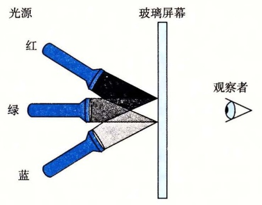

那么基于光源 R（红）、G（绿）、B（蓝）的关闭（0）或打开（1），我们就能够创建 8 种不同的颜色：

| R | G | B | 颜色 | R | G | B | 颜色 |
| --- | --- | --- | --- | --- | --- | --- | --- |
| 0 | 0 | 0 | 黑色 | 1 | 0 | 0 | 红色 |
| 0 | 0 | 1 | 蓝色 | 1 | 0 | 1 | 红紫色 |
| 0 | 1 | 0 | 绿色 | 1 | 1 | 0 | 黄色 |
| 0 | 1 | 1 | 蓝绿色 | 1 | 1 | 1 | 白色 |

这些颜色中的每一种都能用一个长度为 3 的位向量来表示，我们可以对它们进行布尔运算。

A. 一种颜色的补是通过关掉打开的光源，且打开关闭的光源而形成的。那么上面列出的 8 种颜色每一种的补是什么？

B. 描述下列颜色应用布尔运算的结果：

```text
蓝色 | 绿色 =
黄色 & 蓝绿色 =
红色 ^ 红紫色 =
```

#### 2.1.7 C 语言中的位级运算

C 语言的一个很有用的特性就是它支持按位布尔运算。事实上，我们在布尔运算中使用的那些符号就是 C 语言所使用的：`|` 就是 OR（或），`&` 就是 AND（与），`~` 就是 NOT（取反），而 `^` 就是 EXCLUSIVE-OR（异或）。这些运算能运用到任何“整型”的数据类型上，包括图 2-3 所示内容。以下是一些对 `char` 数据类型表达式求值的例子：

| C 的表达式 | 二进制表达式 | 二进制结果 | 十六进制结果 |
|---|---|---|---|
| `~0x41` | `~[0100 0001]` | `[1011 1110]` | `0xBE` |
| `~0x00` | `~[0000 0000]` | `[1111 1111]` | `0xFF` |
| `0x69&0x55` | `[0110 1001]&[0101 0101]` | `[0100 0001]` | `0x41` |
| `0x69\|0x55` | `[0110 1001]\|[0101 0101]` | `[0111 1101]` | `0x7D` |

正如示例说明的那样，确定一个位级表达式的结果最好的方法，就是将十六进制的参数扩展成二进制表示并执行二进制运算，然后再转换回十六进制。

**练习题 2.10** 对于任一位向量 `a`，有 `a ^ a = 0`。应用这一属性，考虑下面的程序：

```c
void inplace_swap(int *x, int *y) {
    *y = *x ^ *y;  /* Step 1 */
    *x = *x ^ *y;  /* Step 2 */
    *y = *x ^ *y;  /* Step 3 */
}
```

正如程序名字所暗示的那样，我们认为这个过程的效果是交换指针变量 `x` 和 `y` 所指向的存储位置处存放的值。注意，与通常的交换两个数值的技术不一样，当移动一个值时，我们不需要第三个位置来临时存储另一个值。这种交换方式并没有性能上的优势，它仅仅是一个智力游戏。

以指针 `x` 和 `y` 指向的位置存储的值分别是 `a` 和 `b` 作为开始，填写下表，给出在程序的每一步之后，存储在这两个位置中的值。利用 `^` 的属性证明达到了所希望的效果。回想一下，每个元素就是它自身的加法逆元（`a ^ a = 0`）。

| 步骤 | `*x` | `*y` |
|---|---|---|
| 初始 | `a` | `b` |
| 第1步 |  |  |
| 第2步 |  |  |
| 第3步 |  |  |

**练习题 2.11** 在练习题 2.10 中的 `inplace_swap` 函数的基础上，你决定写一段代码，实现将一个数组中的元素头尾两端依次对调。你写出下面这个函数：

```c
void reverse_array(int a[], int cnt) {
    int first, last;
    for (first = 0, last = cnt-1;
         first <= last;
         first++, last--)
        inplace_swap(&a[first], &a[last]);
}
```

当你对一个包含元素 1、2、3 和 4 的数组使用这个函数时，正如预期的那样，现在数组的元素变成了 4、3、2 和 1。不过，当你对一个包含元素 1、2、3、4 和 5 的数组使用这个函数时，你会很惊奇地看到得到数字的元素为 5、4、0、2 和 1。实际上，你会发现这段代码对所有偶数长度的数组都能正确地工作，但是当数组的长度为奇数时，它就会把中间的元素设置成 0。

A. 对于一个长度为奇数的数组，长度 `cnt = 2k + 1`，函数 `reverse_array` 最后一次循环中，变量 `first` 和 `last` 的值分别是什么？

B. 为什么这时调用函数 `inplace_swap` 会将数组元素设置为 0？

C. 对 `reverse_array` 的代码做哪些简单改动就能消除这个问题？

位级运算的一个常见用法就是实现掩码运算，这里掩码是一个位模式，表示从一个字中选出的位的集合。让我们来看一个例子，掩码 `0xFF`（最低的 8 位为 1）表示一个字的低位字节。位级运算 `x & 0xFF` 生成一个由 `x` 的最低有效字节组成的值，而其他的字节就被置为 0。比如，对于 `x = 0x89ABCDEF`，其表达式将得到 `0x000000EF`。表达式 `~0` 将生成一个全 1 的掩码，不管机器的字大小是多少。尽管对于一个 32 位机器来说，同样的掩码可以写成 `0xFFFFFFFF`，但是这样的代码不是可移植的。

**练习题 2.12** 对于下面的值，写出变量 `x` 的 C 语言表达式。你的代码应该对任何字长 `w ≥ 8` 都能工作。我们给出了当 `x = 0x87654321` 以及 `w = 32` 时表达式求值的结果，仅供参考。

A. `x` 的最低有效字节，其他位均置为 0。`[0x00000021]`。

B. 除了 `x` 的最低有效字节外，其他的位都取补，最低有效字节保持不变。`[0x789ABC21]`。

C. `x` 的最低有效字节设置成全 1，其他字节都保持不变。`[0x876543FF]`。

**练习题 2.13** 从 20 世纪 70 年代末到 80 年代末，Digital Equipment 的 VAX 计算机是一种非常流行的机型。它没有布尔运算 AND 和 OR 指令，只有 `bis`（位设置）和 `bic`（位清除）这两种指令。两种指令的输入都是一个数据字 `x` 和一个掩码字 `m`。它们生成一个结果 `z`，`z` 是由根据掩码 `m` 的位来修改 `x` 的位得到的。使用 `bis` 指令，这种修改就是在 `m` 为 1 的每个位置上，将 `z` 对应的位设置为 1。使用 `bic` 指令，这种修改就是在 `m` 为 1 的每个位置，将 `z` 对应的位设置为 0。

为了看清楚这些运算与 C 语言位级运算的关系，假设我们有两个函数 `bis` 和 `bic` 来实现位设置和位清除操作。只想用这两个函数，而不使用任何其他 C 语言运算，来实现按位 `|` 和 `^` 运算。填写下列代码中缺失的代码。提示：写出 `bis` 和 `bic` 运算的 C 语言表达式。

```c
/* Declarations of functions implementing operations bis and bic */
int bis(int x, int m);
int bic(int x, int m);

/* Compute x|y using only calls to functions bis and bic */
int bool_or(int x, int y) {
    int result = __________;
    return result;
}

/* Compute x^y using only calls to functions bis and bic */
int bool_xor(int x, int y) {
    int result = __________;
    return result;
}
```

#### 2.1.8 C 语言中的逻辑运算

C 语言还提供了一组逻辑运算符 `||`、`&&` 和 `!`，分别对应于命题逻辑中的 OR、AND 和 NOT 运算。逻辑运算很容易和位级运算相混淆，但是它们的功能是完全不同的。逻辑运算认为所有非零的参数都表示 TRUE，而参数 0 表示 FALSE。它们返回 1 或者 0，分别表示结果为 TRUE 或者为 FALSE。以下是一些表达式求值的示例。

| 表达式 | 结果 |
|---|---|
| `!0x41` | `0x00` |
| `!0x00` | `0x01` |
| `!!0x41` | `0x01` |
| `0x69&&0x55` | `0x01` |
| `0x69\|\|0x55` | `0x01` |

可以观察到，按位运算只有在特殊情况下，也就是参数被限制为 0 或者 1 时，才和与其对应的逻辑运算有相同的行为。

逻辑运算符 `&&` 和 `||` 与它们对应的位级运算 `&` 和 `|` 之间第二个重要的区别是，如果对第一个参数求值就能确定表达式的结果，那么逻辑运算符就不会对第二个参数求值。因此，例如，表达式 `a && 5/a` 将不会造成被零除，而表达式 `p && *p++` 也不会导致间接引用空指针。

**练习题 2.14** 假设 `x` 和 `y` 的字节值分别为 `0x66` 和 `0x39`。填写下表，指明各个 C 表达式的字节值。

| 表达式 | 值 | 表达式 | 值 |
|---|---|---|---|
| `x & y` |  | `x && y` |  |
| `x \| y` |  | `x \|\| y` |  |
| `~x \| ~y` |  | `!x \|\| !y` |  |
| `x & !y` |  | `x && ~y` |  |

**练习题 2.15** 只使用位级和逻辑运算，编写一个 C 表达式，它等价于 `x == y`。换句话说，当 `x` 和 `y` 相等时它将返回 1，否则就返回 0。

#### 2.1.9 C 语言中的移位运算

C 语言还提供了一组移位运算，向左或者向右移动位模式。对于一个位表示为 [x<sub>w-1</sub>, x<sub>w-2</sub>, ..., x₀] 的操作数 `x`，C 表达式 `x << k` 会生成一个值，其位表示为 [x<sub>w-k-1</sub>, x<sub>w-k-2</sub>, ..., x₀, 0, ..., 0]。也就是说，`x` 向左移动 k 位，丢弃最高的 k 位，并在右端补 k 个 0。移位量应该是一个 `0 ~ w - 1` 之间的值。移位运算是从左至右可结合的，所以 `x << j << k` 等价于 `(x << j) << k`。

有一个相应的右移运算 `x >> k`，但是它的行为有点微妙。一般而言，机器支持两种形式的右移：逻辑右移和算术右移。逻辑右移在左端补 k 个 0，得到的结果是 [0, ..., 0, x<sub>w-1</sub>, x<sub>w-2</sub>, ..., x<sub>k</sub>]。算术右移是在左端补 k 个最高有效位的值，得到的结果是 [x<sub>w-1</sub>, ..., x<sub>w-1</sub>, x<sub>w-1</sub>, x<sub>w-2</sub>, ..., x<sub>k</sub>]。这种做法看上去可能有点奇特，但是我们会发现它对有符号整数数据的运算非常有用。

让我们来看一个例子，下面的表给出了对一个 8 位参数 `x` 的两个不同的值做不同的移位操作得到的结果：

| 操作 | 值 | 值 |
|---|---|---|
| 参数 `x` | `[01100011]` | `[10010101]` |
| `x << 4` | [0011*0000*] | [0101*0000*] |
| `x >> 4`（逻辑右移） | [*0000*0110] | [*0000*1001] |
| `x >> 4`（算术右移） | [*0000*0110] | [*1111*1001] |

斜体的数字表示的是最右端（左移）或最左端（右移）填充的值。可以看到除了一个条目之外，其他的都包含填充 0。唯一的例外是算术右移 `[10010101]` 的情况。因为操作数的最高位是 1，填充的值就是 1。

C 语言标准并没有明确定义对于有符号数应该使用哪种类型的右移--算术右移或者逻辑右移都可以。不幸地，这就意味着任何假设一种或者另一种右移形式的代码都可能会遇到可移植性问题。然而，实际上，几乎所有的编译器/机器组合都对有符号数使用算术右移，且许多程序员也都假设机器会使用这种右移。另一方面，对于无符号数，右移必须是逻辑的。

与 C 相比，Java 对于如何进行右移有明确的定义。表达式 `x >> k` 会将 `x` 算术右移 k 个位置，而 `x >>> k` 会对 `x` 做逻辑右移。

> **旁注：移动 k 位，这里 k 很大**
>
> 对于一个由 w 位组成的数据类型，如果要移动 `k ≥ w` 位会得到什么结果呢？例如，计算下面的表达式会得到什么结果，假设数据类型 `int` 为 `w = 32`：
>
> ```c
> int lval = 0xFEDCBA98 << 32;
> int aval = 0xFEDCBA98 >> 36;
> unsigned uval = 0xFEDCBA98u >> 40;
> ```
>
> C 语言标准很小心地规避了说明在这种情况下该如何做。在许多机器上，当移动一个 w 位的值时，移位指令只考虑位移量的低 log₂ w 位，因此实际上位移量就是通过计算 `k mod w` 得到的。例如，当 `w = 32` 时，上面三个移位运算分别是移动 0、4 和 8 位，得到结果：
>
> ```text
> lval  0xFEDCBA98
> aval  0xFFEDCBA9
> uval  0x00FEDCBA
> ```
>
> 不过这种行为对于 C 程序来说是没有保证的，所以应该保持位移量小于待移位值的位数。另一方面，Java 特别要求位移数量应该按照我们前面所讲的求模的方法来计算。

> **旁注：与移位运算有关的操作符优先级问题**
>
> 常常有人会写这样的表达式 `1 << 2+3 << 4`，本意是 `(1 << 2) + (3 << 4)`。但是在 C 语言中，前面的表达式等价于 `1 << (2+3) << 4`，这是由于加法（和减法）的优先级比移位运算要高。然后，按照从左至右结合性规则，括号应该是这样打的 `(1 << (2+3)) << 4`，得到的结果是 512，而不是期望的 52。
>
> 在 C 表达式中搞错优先级是一种常见的程序错误原因，而且常常很难检查出来。所以当你拿不准的时候，请加上括号！

**练习题 2.16** 填写下表，展示不同移位运算对单字节数的影响。思考移位运算的最好方式是使用二进制表示。将最初的值转换为二进制，执行移位运算，然后再转换回十六进制。每个答案都应该是 8 个二进制数字或者 2 个十六进制数字。

| x 十六进制 | x 二进制 | `x << 3` 二进制 | `x << 3` 十六进制 | `x >> 2`（逻辑的）二进制 | `x >> 2`（逻辑的）十六进制 | `x >> 2`（算术的）二进制 | `x >> 2`（算术的）十六进制 |
|---|---|---|---|---|---|---|---|
| `0xC3` |  |  |  |  |  |  |  |
| `0x75` |  |  |  |  |  |  |  |
| `0x87` |  |  |  |  |  |  |  |
| `0x66` |  |  |  |  |  |  |  |

### 2.2 整数表示

在本节中，我们描述用位来编码整数的两种不同的方式：一种只能表示非负数，而另一种能够表示负数、零和正数。后面我们将会看到它们在数学属性和机器级实现方面密切相关。我们还会研究扩展或者收缩一个已编码整数以适应不同长度表示的效果。

图 2-8 列出了我们引入的数学术语，用于精确定义和描述计算机如何编码和操作整数。这些术语将在描述的过程中介绍，图在此处列出作为参考。

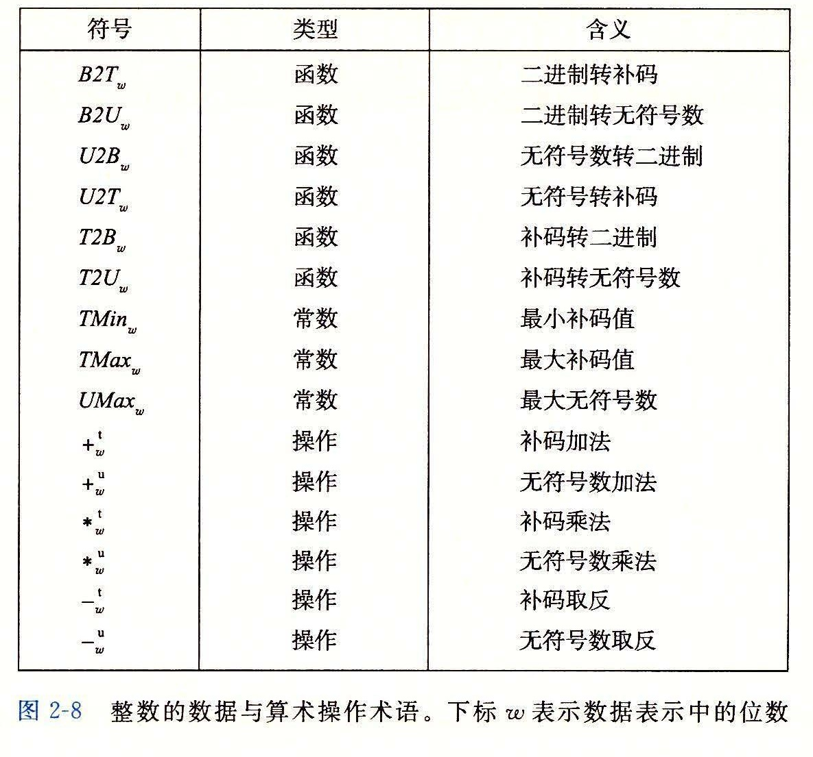

#### 2.2.1 整型数据类型

C 语言支持多种整型数据类型，表示有限范围的整数。这些类型如图 2-9 和图 2-10 所示，其中还给出了“典型”32 位和 64 位机器的取值范围。每种类型都能用关键字来指定大小，这些关键字包括 `char`、`short`、`long`，同时还可以指示被表示的数字是非负数（声明为 `unsigned`），或者可能是负数（默认）。如图 2-3 所示，为这些不同的大小分配的字节数根据程序编译为 32 位还是 64 位而有所不同。根据字节分配，不同的大小所能表示的值的范围是不同的。这里给出来的唯一一个与机器相关的取值范围是大小指示符 `long` 的。大多数 64 位机器使用 8 个字节的表示，比 32 位机器上使用的 4 个字节的表示的取值范围大很多。


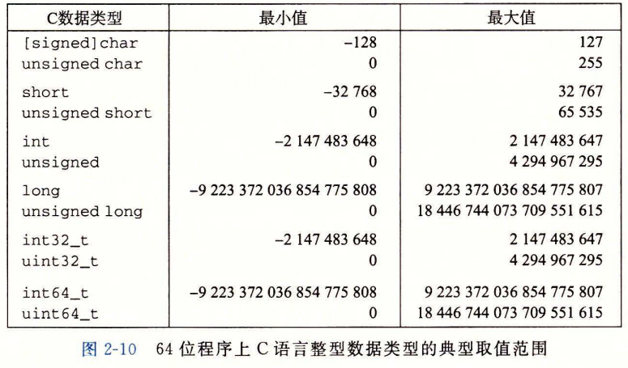

图 2-9 和图 2-10 中一个很值得注意的特点是取值范围不是对称的：负数的范围比正数的范围大 1。当我们考虑如何表示负数的时候，会看到为什么会这样。

C 语言标准定义了每种数据类型必须能够表示的最小的取值范围。如图 2-11 所示，它们的取值范围与图 2-9 和图 2-10 所示的典型实现一样或者小一些。特别地，除了固定大小的数据类型是例外，我们看到它们只要求正数和负数的取值范围是对称的。此外，数据类型 `int` 可以用 2 个字节的数字来实现，而这几乎回退到了 16 位机器的时代。还可以看到，`long` 的大小可以用 4 个字节的数字来实现，对 32 位程序来说这是很典型的。固定大小的数据类型保证数值的范围与图 2-9 给出的典型数值一致，包括负数与正数的不对称性。

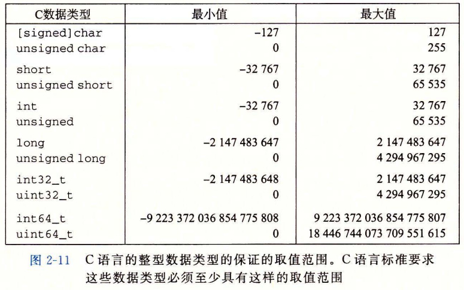

> **给 C 语言初学者：C、C++ 和 Java 中的有符号和无符号数**
>
> C 和 C++ 都支持有符号（默认）和无符号数。Java 只支持有符号数。

#### 2.2.2 无符号数的编码

假设有一个整数数据类型有 w 位。我们可以将位向量写成 x，表示整个向量，或者写成 [x_w-1, x_w-2, ..., x_0]，表示向量中的每一位。把 x 看做一个二进制表示的数，就获得了 x 的无符号表示。在这个编码中，每个位 x_i 都取值为 0 或 1，后一种取值意味着数值 2^i 应为数字值的一部分。我们用一个函数 B2U_w（Binary to Unsigned 的缩写，长度为 w）来表示：

**原理：无符号数编码的定义**

对向量 x = [x_w-1, x_w-2, ..., x_0]：

> B2U<sub>w</sub>(x) ≐ ∑<sub>i=0</sub><sup>w-1</sup> x<sub>i</sub>2<sup>i</sup>　（2.1）

在这个等式中，符号“≐”表示左边被定义为等于右边。函数 B2U_w 将一个长度为 w 的 0、1 串映射到非负整数。举一个示例，图 2-12 展示的是下面几种情况下 B2U 给出的从位向量到整数的映射：

**示例（2.2）**

| 位向量 | B2U<sub>4</sub> 的取值 |
| --- | --- |
| [0001] | 0 · 2<sup>3</sup> + 0 · 2<sup>2</sup> + 0 · 2<sup>1</sup> + 1 · 2<sup>0</sup> = 0 + 0 + 0 + 1 = 1 |
| [0101] | 0 · 2<sup>3</sup> + 1 · 2<sup>2</sup> + 0 · 2<sup>1</sup> + 1 · 2<sup>0</sup> = 0 + 4 + 0 + 1 = 5 |
| [1011] | 1 · 2<sup>3</sup> + 0 · 2<sup>2</sup> + 1 · 2<sup>1</sup> + 1 · 2<sup>0</sup> = 8 + 0 + 2 + 1 = 11 |
| [1111] | 1 · 2<sup>3</sup> + 1 · 2<sup>2</sup> + 1 · 2<sup>1</sup> + 1 · 2<sup>0</sup> = 8 + 4 + 2 + 1 = 15 |

在图中，我们用长度为 2^i 的指向右侧箭头的条表示每个位的位置 i。每个位向量对应的数值就等于所有值为 1 的位对应的条的长度之和。


让我们来考虑一下 w 位所能表示的值的范围。最小值是用位向量 [00...0] 表示，也就是整数值 0，而最大值是用位向量 [11...1] 表示，也就是整数值：

> UMax<sub>w</sub> ≐ ∑<sub>i=0</sub><sup>w-1</sup> 2<sup>i</sup> = 2<sup>w</sup> - 1

以 4 位情况为例，UMax_4 = B2U_4([1111]) = 2^4 - 1 = 15。因此，函数 B2U_w 能够被定义为一个映射 B2U_w: {0, 1}^w -> {0, ..., 2^w - 1}。

无符号数的二进制表示有一个很重要的属性，也就是每个介于 0 到 2^w - 1 之间的数都有唯一一个 w 位的值编码。例如，十进制值 11 作为无符号数，只有一个 4 位的表示，即 [1011]。我们用数学原理来重点讲述它，先表述原理再解释。

**原理：无符号数编码的唯一性**

函数 B2U_w 是一个双射。

数学术语双射是指一个函数 f 有两面：它将数值 x 映射为数值 y，即 y = f(x)，但它也可以反向操作，因为对每一个 y 而言，都有唯一一个数值 x 使得 f(x) = y。这可以用反函数 f^-1 来表示，在本例中，即 x = f^-1(y)。函数 B2U_w 将每一个长度为 w 的位向量都映射为 0 到 2^w - 1 之间的一个唯一值；反过来，我们称其为 U2B_w（即“无符号数到二进制”），在 0 到 2^w - 1 之间的每一个整数都可以映射为一个唯一的长度为 w 的位模式。

#### 2.2.3 补码编码

对于许多应用，我们还希望表示负数值。最常见的有符号数的计算机表示方式就是补码（two's-complement）形式。在这个定义中，将字的最高有效位解释为负权（negative weight）。我们用函数 B2T<sub>w</sub>（Binary to Two's-complement 的缩写，长度为 w）来表示：

**原理：补码编码的定义**

对向量 x = [x<sub>w-1</sub>, x<sub>w-2</sub>, ..., x<sub>0</sub>]：

> B2T<sub>w</sub>(x) ≐ -x<sub>w-1</sub>2<sup>w-1</sup> + ∑<sub>i=0</sub><sup>w-2</sup> x<sub>i</sub>2<sup>i</sup>　（2.3）

最高有效位 x<sub>w-1</sub> 也称为符号位，它的“权重”为 -2<sup>w-1</sup>，是无符号表示中权重的负数。符号位被设置为 1 时，表示值为负，而当设置为 0 时，值为非负。这里来看一个示例，图 2-13 展示的是下面几种情况下 B2T 给出的从位向量到整数的映射。

**示例（2.4）**

| 位向量 | B2T<sub>4</sub> 的取值 |
| --- | --- |
| [0001] | -0 · 2<sup>3</sup> + 0 · 2<sup>2</sup> + 0 · 2<sup>1</sup> + 1 · 2<sup>0</sup> = 0 + 0 + 0 + 1 = 1 |
| [0101] | -0 · 2<sup>3</sup> + 1 · 2<sup>2</sup> + 0 · 2<sup>1</sup> + 1 · 2<sup>0</sup> = 0 + 4 + 0 + 1 = 5 |
| [1011] | -1 · 2<sup>3</sup> + 0 · 2<sup>2</sup> + 1 · 2<sup>1</sup> + 1 · 2<sup>0</sup> = -8 + 0 + 2 + 1 = -5 |
| [1111] | -1 · 2<sup>3</sup> + 1 · 2<sup>2</sup> + 1 · 2<sup>1</sup> + 1 · 2<sup>0</sup> = -8 + 4 + 2 + 1 = -1 |

在这个图中，我们用向左指的条表示符号位具有负权重。于是，与一个位向量相关联的数值是由可能的向左指的条和向右指的条加起来决定的。

我们可以看到，图 2-12 和图 2-13 中的位模式都是一样的，对等式 (2.2) 和等式 (2.4) 来说也是一样，但是当最高有效位是 1 时，数值是不同的，这是因为在一种情况中，最高有效位的权重是 +8，而在另一种情况中，它的权重是 -8。

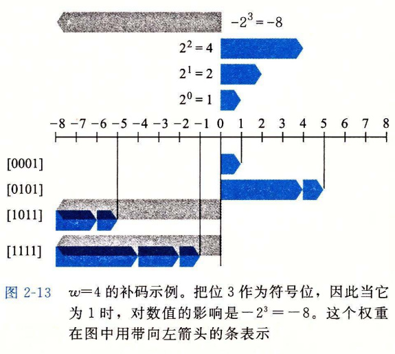

让我们来考虑一下 w 位补码所能表示的值的范围。它能表示的最小值是位向量 [10...0]（也就是设置这个位为负权，但是清除其他所有的位），其整数值为 TMin<sub>w</sub> = -2<sup>w-1</sup>。而最大值是位向量 [01...1]（清除具有负权的位，而设置其他所有的位），其整数值为 TMax<sub>w</sub> = 2<sup>w-1</sup> - 1。以长度为 4 为例，我们有 TMin<sub>4</sub> = B2T<sub>4</sub>([1000]) = -2<sup>3</sup> = -8，而 TMax<sub>4</sub> = B2T<sub>4</sub>([0111]) = 2<sup>2</sup> + 2<sup>1</sup> + 2<sup>0</sup> = 4 + 2 + 1 = 7。

我们可以看出 B2T<sub>w</sub> 是一个从长度为 w 的位模式到 TMin<sub>w</sub> 和 TMax<sub>w</sub> 之间数字的映射，写作 B2T<sub>w</sub>: {0, 1}<sup>w</sup> -> {TMin<sub>w</sub>, ..., TMax<sub>w</sub>}。同无符号表示一样，在可表示的取值范围内的每个数字都有一个唯一的 w 位的补码编码。这就导出了与无符号数相似的补码数原理：

**原理：补码编码的唯一性**

函数 B2T<sub>w</sub> 是一个双射。

我们定义函数 T2B<sub>w</sub>（即“补码到二进制”）作为 B2T<sub>w</sub> 的反函数。也就是说，对于每个数 x，满足 TMin<sub>w</sub> ≤ x ≤ TMax<sub>w</sub>，则 T2B<sub>w</sub>(x) 是 x 的（唯一的）w 位模式。

**练习题 2.17**

假设 w = 4，我们能给每个可能的十六进制数字赋予一个数值，假设用一个无符号或者补码表示。请根据这些表示，通过写出等式 (2.1) 和等式 (2.3) 所示的求和公式中的 2 的非零次幂，填写下表：

| x（十六进制） | x（二进制） | B2U<sub>4</sub>(x) | B2T<sub>4</sub>(x) |
| --- | --- | --- | --- |
| 0xE | [1110] | 2<sup>3</sup> + 2<sup>2</sup> + 2<sup>1</sup> = 14 | -2<sup>3</sup> + 2<sup>2</sup> + 2<sup>1</sup> = -2 |
| 0x0 |  |  |  |
| 0x5 |  |  |  |
| 0x8 |  |  |  |
| 0xD |  |  |  |
| 0xF |  |  |  |

图 2-14 展示了针对不同字长，几个重要数字的位模式和数值。前三个给出的是可表示的整数的范围，用 UMax<sub>w</sub>、TMin<sub>w</sub> 和 TMax<sub>w</sub> 来表示。在后面的讨论中，我们还会经常引用到这三个特殊的值。如果可以从上下文中推断出 w，或者 w 不是讨论的主要内容时，我们会省略下标 w，直接引用 UMax、TMin 和 TMax。

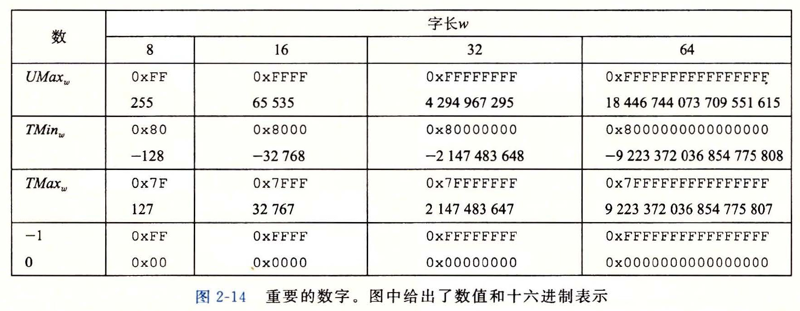

关于这些数字，有几点值得注意。第一，从图 2-9 和图 2-10 可以看到，补码的范围是不对称的：|TMin| = |TMax| + 1，也就是说，TMin 没有与之对应的正数。正如我们将会看到的，这导致了补码运算的某些特殊的属性，并且容易造成程序中细微的错误。之所以会有这样的不对称性，是因为一半的位模式（符号位设置为 1 的数）表示负数，而另一半（符号位设置为 0 的数）表示非负数。因为 0 是非负数，也就意味着能表示的整数比负数少一个。第二，最大的无符号数值刚好比补码的最大值的两倍大一点：UMax<sub>w</sub> = 2TMax<sub>w</sub> + 1。补码表示中所有表示负数的位模式在无符号表示中都变成了正数。图 2-14 也给出了常数 -1 和 0 的表示。注意 -1 和 UMax 有同样的位表示，一个全 1 的串。数值 0 在两种表示方式中都是全 0 的串。

C 语言标准并没有要求要用补码形式来表示有符号整数，但是几乎所有的机器都是这么做的。程序员如果希望代码具有最大可移植性，能够在所有可能的机器上运行，那么除了图 2-11 所示的那些范围之外，我们不应该假设任何可表示的数值范围，也不应该假设有符号数会使用何种特殊的表示方式。另一方面，许多程序的书写都假设用补码来表示有符号数，并且具有图 2-9 和图 2-10 所示的“典型的”取值范围，这些程序也能够在大量的机器和编译器上移植。C 库中的文件 `<limits.h>` 定义了一组常量，来限定编译器运行的这台机器的不同整型数据类型的取值范围。比如，它定义了常量 INT_MAX、INT_MIN 和 UINT_MAX，它们描述了有符号和无符号整数的范围。对于一个补码的机器，数据类型 int 有 w 位，这些常量就对应于 TMax<sub>w</sub>、TMin<sub>w</sub> 和 UMax<sub>w</sub> 的值。

> **旁注：关于确定大小的整数类型的更多内容**
>
> 对于某些程序来说，用某个确定大小的表示来编码数据类型非常重要。例如，当编写程序，使得机器能够按照一个标准协议在因特网上通信时，让数据类型与协议指定的数据类型兼容是非常重要的。我们前面看到了，某些 C 数据类型，特别是 long 型，在不同的机器上有不同的取值范围，而实际上 C 语言标准只指定了每种数据类型的最小范围，而不是确定的范围。虽然我们可以选择与大多数机器上的标准表示兼容的数据类型，但是这也不能保证可移植性。
>
> 我们已经见过了 32 位和 64 位版本的确定大小的整数类型（图 2-3），它们是一个更大数据类型类的一部分。ISO C99 标准在文件 `stdint.h` 中引入了这个整数类型类。这个文件定义了一组数据类型，它们的声明形如 `intN_t` 和 `uintN_t`，对不同的 N 值指定 N 位有符号和无符号整数。N 的具体值与实现相关，但是大多数编译器允许的值为 8、16、32 和 64。因此，通过将它的类型声明为 `uint16_t`，我们可以无歧义地声明一个 16 位无符号变量，而如果声明为 `int32_t`，就是一个 32 位有符号变量。
>
> 这些数据类型对应着一组宏，定义了每个 N 的值对应的最小和最大值。这些宏名字形如 `INTN_MIN`、`INTN_MAX` 和 `UINTN_MAX`。
>
> 确定宽度类型的带格式打印需要使用宏，以与系统相关的方式扩展为格式串。因此，举个例子来说，变量 x 和 y 的类型是 `int32_t` 和 `uint64_t`，可以通过调用 `printf` 来打印它们的值，如下所示：
>
> ```c
> printf("x = %" PRId32 ", y = %" PRIu64 "\n", x, y);
> ```
>
> 编译为 64 位程序时，宏 `PRId32` 展开成字符串 “d”，宏 `PRIu64` 则展开成两个字符串 “l” “u”。当 C 预处理器遇到仅用空格（或其他空白字符）分隔的一个字符串常量序列时，就把它们串联起来。因此，上面的 `printf` 调用就变成了：
>
> ```c
> printf("x = %d, y = %lu\n", x, y);
> ```
>
> 使用宏能保证：不论代码是如何被编译的，都能生成正确的格式字符串。

* 关于整数数据类型的取值范围和表示，Java 标准是非常明确的。它要求采用补码表示，取值范围与图 2-10 中 64 位的情况一样。在 Java 中，单字节数据类型称为 byte，而不是 char。这些非常具体的要求都是为了保证无论在什么机器上运行，Java 程序都能表现地完全一样。

> **旁注：有符号数的其他表示方法**
>
> 有符号数还有两种标准的表示方法：
>
> **反码（Ones' Complement）**：除了最高有效位的权是 -(2<sup>w-1</sup> - 1) 而不是 -2<sup>w-1</sup>，它和补码是一样的：
>
> B2O<sub>w</sub>(x) ≐ -x<sub>w-1</sub>(2<sup>w-1</sup> - 1) + ∑<sub>i=0</sub><sup>w-2</sup> x<sub>i</sub>2<sup>i</sup>
>
> **原码（Sign-Magnitude）**：最高有效位是符号位，用来确定剩下的位应该取负权还是正权：
>
> B2S<sub>w</sub>(x) ≐ (-1)<sup>x<sub>w-1</sub></sup> · (∑<sub>i=0</sub><sup>w-2</sup> x<sub>i</sub>2<sup>i</sup>)
>
> 这两种表示方法都有一个奇怪的属性，那就是对于数字 0 有两种不同的编码方式。这两种表示方法，把 [00...0] 都解释为 +0。而值 -0 在原码中表示为 [10...0]，在反码中表示为 [11...1]。虽然过去生产过基于反码表示的机器，但是几乎所有的现代机器都使用补码。我们将看到在浮点数中有使用原码编码。
>
> 请注意补码（Two's Complement）和反码（Ones' Complement）中撇号的位置是不同的。术语补码来源于这样一个情况，对于非负数 x，我们用 2<sup>w</sup> - x（这里只有一个 2）来计算 -x 的 w 位表示。术语反码来源于这样一个属性，我们用 [111...1] - x（这里有很多个 1）来计算 -x 的反码表示。

为了更好地理解补码表示，考虑下面的代码：

```c
short x = 12345;
short mx = -x;

show_bytes((byte_pointer) &x, sizeof(short));
show_bytes((byte_pointer) &mx, sizeof(short));
```

当在大端法机器上运行时，这段代码的输出为 `30 39` 和 `cf c7`，指明 x 的十六进制表示为 `0x3039`，而 mx 的十六进制表示为 `0xCFC7`。将它们展开为二进制，我们得到 x 的位模式为 [0011000000111001]，而 mx 的位模式为 [1100111111000111]。如图 2-15 所示，等式 (2.3) 对这两个位模式生成的值为 12 345 和 -12 345。

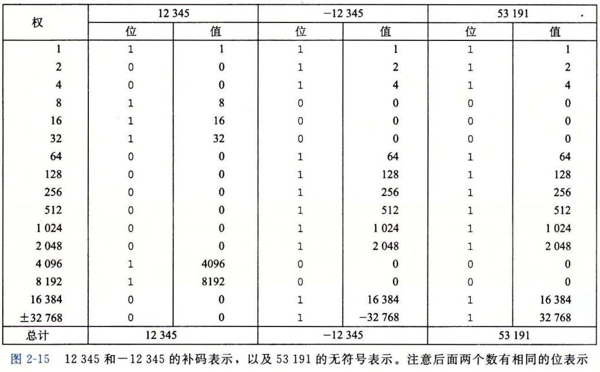

**练习题 2.18**

在第 3 章中，我们将看到由反汇编器生成的列表，反汇编器是一种将可执行程序文件转换回可读性更好的 ASCII 码形式的程序。这些文件包含许多十六进制数字，都是用典型的补码形式来表示这些值。能够认识这些数字并理解它们的意义（例如它们是正数还是负数），是一项重要的技巧。

在下面的列表中，对于标号为 A~I（标记在右边）的那些行，将指令名（sub、mov 和 add）右边显示的（32 位补码形式表示的）十六进制值转换为等价的十进制值。

```text
4004d0: 48 81 ec e0 02 00 00     sub    $0x2e0,%rsp             A.
4004d7: 48 8b 44 24 a8           mov    -0x58(%rsp),%rax        B.
4004dc: 48 03 47 28              add    0x28(%rdi),%rax         C.
4004e0: 48 89 44 24 d0           mov    %rax,-0x30(%rsp)        D.
4004e5: 48 8b 44 24 78           mov    0x78(%rsp),%rax         E.
4004ea: 48 89 87 88 00 00 00     mov    %rax,0x88(%rdi)         F.
4004f1: 48 8b 84 24 f8 01 00
4004f8: 00                       mov    0x1f8(%rsp),%rax        G.
4004f9: 48 03 44 24 08           add    0x8(%rsp),%rax
4004fe: 48 89 84 24 c0 00 00
400505: 00                       mov    %rax,0xc0(%rsp)         H.
400506: 48 8b 44 d4 b8           mov    -0x48(%rsp,%rdx,8),%rax I.
```

#### 2.2.4 有符号数和无符号数之间的转换

C 语言允许在各种不同的数字数据类型之间做强制类型转换。例如，假设变量 x 声明为 int，u 声明为 unsigned。表达式 (unsigned) x 会将 x 的值转换成一个无符号数值，而 (int) u 将 u 的值转换成一个有符号整数。将有符号数强制类型转换成无符号数，或者反过来，会得到什么结果呢？从数学的角度来说，可以想象到几种不同的规则。很明显，对于在两种形式中都能表示的值，我们是想要保持不变的。另一方面，将负数转换成无符号数可能会得到 0。如果转换的无符号数太大以至于超出了补码能够表示的范围，可能会得到 TMax。不过，对于大多数 C 语言的实现来说，对这个问题的回答都是从位级角度来看的，而不是数的角度。

比如说，考虑下面的代码：

```c
short          int v  = -12345;
unsigned short    uv = (unsigned short) v;
printf("v = %d, uv = %u\n", v, uv);
```

在一台采用补码的机器上，上述代码会产生如下输出：

```text
v = -12345, uv = 53191
```

我们看到，强制类型转换的结果保持位值不变，只是改变了解释这些位的方式。在图 2-15 中我们看到过，-12 345 的 16 位补码表示与 53 191 的 16 位无符号表示是完全一样的。将 short 强制类型转换为 unsigned short 改变数值，但是不改变位表示。

类似地，考虑下面的代码：

```c
unsigned u  = 4294967295u;  /* UMax */
int      tu = (int) u;
printf("u = %u, tu = %d\n", u, tu);
```

在一台采用补码的机器上，上述代码会产生如下输出：

```text
u = 4294967295, tu = -1
```

从图 2-14 我们可以看到，对于 32 位字长来说，无符号形式的 4 294 967 295（UMax<sub>32</sub>）和补码形式的 -1 的位模式是完全一样的。将 unsigned 强制类型转换成 int，底层的位表示保持不变。

对于大多数 C 语言的实现，处理同样字长的有符号数和无符号数之间相互转换的一般规则是：数值可能会改变，但是位模式不变。让我们用更数学化的形式来描述这个规则。我们定义函数 U2B<sub>w</sub> 和 T2B<sub>w</sub>，它们将数值映射为无符号数和补码形式的位表示。也就是说，给定 0 ≤ x ≤ UMax<sub>w</sub> 范围内的一个整数 x，函数 U2B<sub>w</sub>(x) 会给出 x 的唯一的 w 位无符号表示。相似地，当 x 满足 TMin<sub>w</sub> ≤ x ≤ TMax<sub>w</sub>，函数 T2B<sub>w</sub>(x) 会给出 x 的唯一的 w 位补码表示。

现在，将函数 T2U<sub>w</sub> 定义为 T2U<sub>w</sub>(x) ≐ B2U<sub>w</sub>(T2B<sub>w</sub>(x))。这个函数的输入是一个 TMin<sub>w</sub>~TMax<sub>w</sub> 的数，结果得到一个 0~UMax<sub>w</sub> 的值，这里两个数有相同的位模式，除了参数是无符号的，而结果是以补码表示的。类似地，对于 0~UMax<sub>w</sub> 之间的值 x，定义函数 U2T<sub>w</sub> 为 U2T<sub>w</sub>(x) ≐ B2T<sub>w</sub>(U2B<sub>w</sub>(x))，生成一个数的无符号表示和 x 的补码表示相同。

继续我们前面的例子，从图 2-15 中，我们看到 T2U<sub>16</sub>(-12 345) = 53 191，并且 U2T<sub>16</sub>(53 191) = -12 345。也就是说，十六进制表示写作 0xCFC7 的 16 位位模式既是 -12 345 的补码表示，又是 53 191 的无符号表示。同时请注意 12 345 + 53 191 = 65 536 = 2<sup>16</sup>。这个属性可以推广到给定位模式的两个数值（补码和无符号数）之间的关系。类似地，从图 2-14 我们看到 T2U<sub>32</sub>(-1) = 4 294 967 295，并且 U2T<sub>32</sub>(4 294 967 295) = -1。也就是说，无符号表示中的 UMax 有着和补码表示的 -1 相同的位模式。我们在这两个数之间也能看到这种关系：1 + UMax<sub>w</sub> = 2<sup>w</sup>。

接下来，我们看到函数 U2T 描述了从无符号数到补码的转换，而 T2U 描述的是补码到无符号数的转换。这两个函数描述了在大多数 C 语言实现中这两种数据类型之间的强制类型转换效果。

**练习题 2.19** 利用你解答练习题 2.17 时填写的表格，填写下列描述函数 T2U<sub>4</sub> 的表格。

| x | T2U<sub>4</sub>(x) |
| --- | --- |
| -8 |  |
| -3 |  |
| -2 |  |
| -1 |  |
| 0 |  |
| 5 |  |

通过上述这些例子，我们可以看到给定位模式的补码与无符号数之间的关系可以表示为函数 T2U 的一个属性：

**原理：补码转换为无符号数**

对满足 TMin<sub>w</sub> ≤ x ≤ TMax<sub>w</sub> 的 x 有：

| 条件 | T2U<sub>w</sub>(x) |
| --- | --- |
| x < 0 | x + 2<sup>w</sup> |
| x ≥ 0 | x |

（2.5）

比如，我们看到 T2U<sub>16</sub>(-12 345) = -12 345 + 2<sup>16</sup> = 53 191，同时 T2U<sub>w</sub>(-1) = -1 + 2<sup>w</sup> = UMax<sub>w</sub>。

该属性可以通过比较公式（2.1）和公式（2.3）推导出来。

**推导：补码转换为无符号数**

比较等式（2.1）和等式（2.3），我们可以发现对于位模式 x，如果我们计算 B2U<sub>w</sub>(x) - B2T<sub>w</sub>(x) 之差，从 0 到 w-2 的位的加权和将互相抵消掉，剩下一个值：x<sub>w-1</sub>(2<sup>w-1</sup> - (-2<sup>w-1</sup>)) = x<sub>w-1</sub>2<sup>w</sup>。这就得到一个关系：B2U<sub>w</sub>(x) = x<sub>w-1</sub>2<sup>w</sup> + B2T<sub>w</sub>(x)。我们因此就有：

> B2U<sub>w</sub>(T2B<sub>w</sub>(x)) = T2U<sub>w</sub>(x) = x + x<sub>w-1</sub>2<sup>w</sup>　（2.6）

根据公式（2.5）的两种情况，在 x 的补码表示中，位 x<sub>w-1</sub> 决定了 x 是否为负。

比如说，图 2-16 比较了当 w = 4 时函数 B2U 和 B2T 是如何将数值变成位模式的。对补码来说，最高有效位是符号位，我们用带向左箭头的条来表示。对于无符号数来说，最高有效位是正权重，我们用带向右的箭头的条来表示。从补码变为无符号数，最高有效位的权重从 -8 变为 +8。因此，补码表示的负数如果看成无符号数，值会增加 2<sup>4</sup> = 16。因而，-5 变成了 +11，而 -1 变成了 +15。


图 2-17 说明了函数 T2U 的一般行为。如图所示，当将一个有符号数映射为它相应的无符号数时，负数就被转换成了大的正数，而非负数会保持不变。

**练习题 2.20** 请说明等式（2.5）是如何应用到解答练习题 2.19 时生成的表格中的各项的。

反过来看，我们希望推导出一个无符号数 u 和与之对应的有符号数 U2T<sub>w</sub>(u) 之间的关系：

**原理：无符号数转换为补码**

对满足 0 ≤ u ≤ UMax<sub>w</sub> 的 u 有：

| 条件 | U2T<sub>w</sub>(u) |
| --- | --- |
| u ≤ TMax<sub>w</sub> | u |
| u > TMax<sub>w</sub> | u - 2<sup>w</sup> |

（2.7）

该原理证明如下：

**推导：无符号数转换为补码**

设 u = U2B<sub>w</sub>(u)，这个位向量也是 U2T<sub>w</sub>(u) 的补码表示。公式（2.1）和公式（2.3）结合起来有：

> U2T<sub>w</sub>(u) = -u<sub>w-1</sub>2<sup>w</sup> + u　（2.8）

在 u 的无符号表示中，对公式（2.7）的两种情况来说，位 u<sub>w-1</sub> 决定了 u 是否大于 TMax<sub>w</sub> = 2<sup>w-1</sup> - 1。

图 2-18 说明了函数 U2T 的行为。对于小的数（≤TMax<sub>w</sub>），从无符号到有符号的转换将保留数字的原值。对于大的数（>TMax<sub>w</sub>），数字将被转换为一个负数值。


总结一下，我们考虑无符号与补码表示之间互相转换的结果。对于在范围 0 ≤ x ≤ TMax<sub>w</sub> 之内的值 x 而言，我们得到 T2U<sub>w</sub>(x) = x 和 U2T<sub>w</sub>(x) = x。也就是说，在这个范围内的数字有相同的无符号和补码表示。对于这个范围以外的数值，转换需要加上或者减去 2<sup>w</sup>。例如，我们有 T2U<sub>w</sub>(-1) = -1 + 2<sup>w</sup> = UMax<sub>w</sub> —— 最靠近 0 的负数映射为最大的无符号数。在另一个极端，我们可以看到 T2U<sub>w</sub>(TMin<sub>w</sub>) = -2<sup>w-1</sup> + 2<sup>w</sup> = 2<sup>w-1</sup> = TMax<sub>w</sub> + 1 —— 最小的负数映射为一个刚好在补码的正数范围之外的无符号数。使用图 2-15 的示例，我们能看到 T2U<sub>16</sub>(-12 345) = 65 536 + -12 345 = 53 191。

#### 2.2.5 C 语言中的有符号数与无符号数

如图 2-9 和图 2-10 所示，C 语言支持所有整型数据类型的有符号和无符号运算。尽管 C 语言标准没有指定有符号数要采用某种表示，但是几乎所有的机器都使用补码。通常，大多数数字都默认为是有符号的。例如，当声明一个像 12345 或者 0x1A2B 这样的常量时，这个值就被认为是有符号的。要创建一个无符号常量，必须加上后缀字符 `U` 或者 `u`，例如，12345U 或者 0x1A2Bu。

C 语言允许无符号数和有符号数之间的转换。虽然 C 标准没有精确规定应如何进行这种转换，但大多数系统遵循的原则是底层的位表示保持不变。因此，在一台采用补码的机器上，当从无符号数转换为有符号数时，效果就是应用函数 U2T<sub>w</sub>，而从有符号数转换为无符号数时，就是应用函数 T2U<sub>w</sub>，其中 w 表示数据类型的位数。

显式的强制类型转换就会导致转换发生，就像下面的代码：

```c
int tx, ty;
unsigned ux, uy;

tx = (int) ux;
uy = (unsigned) ty;
```

另外，当一种类型的表达式被赋值给另外一种类型的变量时，转换是隐式发生的，就像下面的代码：

```c
int tx, ty;
unsigned ux, uy;

tx = ux;  /* Cast to signed */
uy = ty;  /* Cast to unsigned */
```

当用 printf 输出数值时，分别用指示符 `%d`、`%u` 和 `%x` 以有符号十进制、无符号十进制和十六进制格式输出一个数字。注意 printf 没有使用任何类型信息，所以它可以用指示符 `%u` 来输出类型为 int 的数值，也可以用指示符 `%d` 输出类型为 unsigned 的数值。例如，考虑下面的代码：

```c
int x = -1;
unsigned u = 2147483648;  /* 2 to the 31st */

printf("x = %u = %d\n", x, x);
printf("u = %u = %d\n", u, u);
```

当在一个 32 位机器上运行时，它的输出如下：

```text
x = 4294967295 = -1
u = 2147483648 = -2147483648
```

在这两种情况下，printf 首先将这个字当作一个无符号数输出，然后把它当作一个有符号数输出。以下是实际运行中的转换函数：T2U<sub>32</sub>(-1) = UMax<sub>32</sub> = 2<sup>32</sup> - 1 和 U2T<sub>32</sub>(2<sup>31</sup>) = 2<sup>31</sup> - 2<sup>32</sup> = -2<sup>31</sup> = TMin<sub>32</sub>。

由于 C 语言对同时包含有符号和无符号数表达式的这种处理方式，出现了一些奇特的行为。当执行一个运算时，如果它的一个运算数是有符号的而另一个是无符号的，那么 C 语言会隐式地将有符号参数强制类型转换为无符号数，并假设这两个数都是非负的，来执行这个运算。就像我们将要看到的，这种方法对于标准的算术运算来说并无多大差异，但是对于像 `<` 和 `>` 这样的关系运算符来说，它会导致非直观的结果。图 2-19 展示了一些关系表达式的示例以及它们得到的求值结果，这里假设数据类型 int 表示为 32 位补码。考虑比较式 -1 < 0U。因为第二个运算数是无符号的，第一个运算数就会被隐式地转换为无符号数，因此表达式就等价于 4294967295U < 0U（回想 T2U<sub>w</sub>(-1) = UMax<sub>w</sub>），这个答案显然是错的。其他那些示例也可以通过相似的分析来理解。

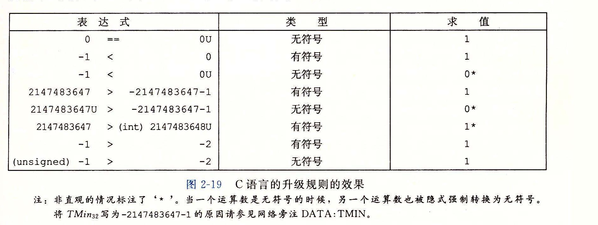

**练习题 2.21** 假设在采用补码运算的 32 位机器上对这些表达式求值，按照图 2-19 的格式填写下表，描述强制类型转换和关系运算的结果。

| 表达式 | 类型 | 求值 |
| --- | --- | --- |
| -2147483647-1 == 2147483648U |  |  |
| -2147483647-1 < 2147483647 |  |  |
| -2147483647-1U < 2147483647 |  |  |
| -2147483647-1 < -2147483647 |  |  |
| -2147483647-1U < -2147483647 |  |  |

> **网络旁注 DATA:TMIN：C 语言中 TMin 的写法**
>
> 在图 2-19 和练习题 2.21 中，我们很小心地将 TMin<sub>32</sub> 写成 -2147483647-1。为什么不简单地写成 -2147483648 或者 0x80000000？看一下 C 头文件 limits.h，注意到它们使用了跟我们写 TMin<sub>32</sub> 和 TMax<sub>32</sub> 类似的方法：
>
> ```c
> /* Minimum and maximum values a 'signed int' can hold. */
> #define INT_MAX  2147483647
> #define INT_MIN  (-INT_MAX - 1)
> ```
>
> 不幸的是，补码表示的不对称性和 C 语言的转换规则之间奇怪的交互，迫使我们用这种不寻常的方式来写 TMin<sub>32</sub>。虽然理解这个问题需要我们钻研 C 语言标准的一些比较隐晦的角落，但是它能够帮助我们充分领会整数数据类型和表示的一些细微之处。

#### 2.2.6 扩展一个数字的位表示

一个常见的运算是在不同字长的整数之间转换，同时又保持数值不变。当然，当目标数据类型太小以至于不能表示想要的值时，这根本就是不可能的。然而，从一个较小的数据类型转换到一个较大的类型，应该总是可能的。

要将一个无符号数转换为一个更大的数据类型，我们只要简单地在表示的开头添加 0。这种运算被称为零扩展（zero extension），表示原理如下：

**原理：无符号数的零扩展**

定义宽度为 w 的位向量 u = [u<sub>w-1</sub>, u<sub>w-2</sub>, ..., u<sub>0</sub>] 和宽度为 w' 的位向量 u' = [0, ..., 0, u<sub>w-1</sub>, u<sub>w-2</sub>, ..., u<sub>0</sub>]，其中 w' > w。则 B2U<sub>w</sub>(u) = B2U<sub>w'</sub>(u')。

按照公式（2.1），该原理可以看作是直接遵循了无符号数编码的定义。

要将一个补码数字转换为一个更大的数据类型，可以执行一个符号扩展（sign extension），在表示中添加最高有效位的值，表示为如下原理。我们用蓝色标出符号位 x<sub>w-1</sub> 来突出它在符号扩展中的角色。

**原理：补码数的符号扩展**

定义宽度为 w 的位向量 x = [x<sub>w-1</sub>, x<sub>w-2</sub>, ..., x<sub>0</sub>] 和宽度为 w' 的位向量 x' = [x<sub>w-1</sub>, ..., x<sub>w-1</sub>, x<sub>w-1</sub>, x<sub>w-2</sub>, ..., x<sub>0</sub>]，其中 w' > w。则 B2T<sub>w</sub>(x) = B2T<sub>w'</sub>(x')。

例如，考虑下面的代码：

```c
short sx = -12345;           /* -12345 */
unsigned short usx = sx;     /*  53191 */
int x = sx;                  /* -12345 */
unsigned ux = usx;           /*  53191 */

printf("sx  = %d:\t", sx);
show_bytes((byte_pointer) &sx, sizeof(short));
printf("usx = %u:\t", usx);
show_bytes((byte_pointer) &usx, sizeof(unsigned short));
printf("x   = %d:\t", x);
show_bytes((byte_pointer) &x, sizeof(int));
printf("ux  = %u:\t", ux);
show_bytes((byte_pointer) &ux, sizeof(unsigned));
```

在采用补码表示的 32 位大端法机器上运行这段代码时，打印出如下输出：

```text
sx  = -12345:     cf c7
usx = 53191:      cf c7
x   = -12345:     ff ff cf c7
ux  = 53191:      00 00 cf c7
```

我们看到，尽管 -12 345 的补码表示和 53 191 的无符号表示在 16 位字长时是相同的，但是在 32 位字长时却是不同的。特别地，-12 345 的十六进制表示为 0xFFFFCFC7，而 53 191 的十六进制表示为 0x0000CFC7。前者使用的是符号扩展，最开头加了 16 位，都是最高有效位 1，表示为十六进制就是 0xFFFF。后者开头使用 16 个 0 来扩展，表示为十六进制就是 0x0000。

图 2-20 给出了从字长 w = 3 到 w = 4 的符号扩展的结果。位向量 [101] 表示值 -4 + 1 = -3。对它应用符号扩展，得到位向量 [1101]，表示的值 -8 + 4 + 1 = -3。我们可以看到，对于 w = 4，最高两位的组合值是 -8 + 4 = -4，与 w = 3 时符号位的值相同。类似地，位向量 [111] 和 [1111] 都表示值 -1。

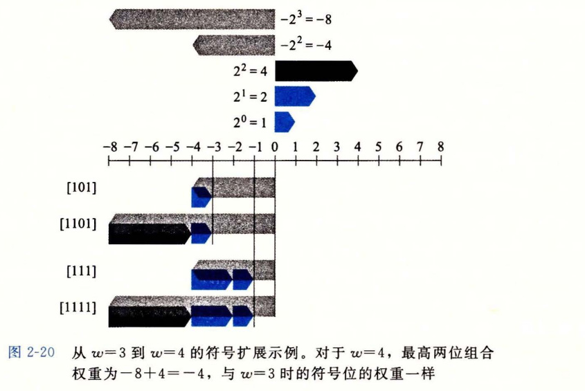

有了这个直觉，我们现在可以展示保持补码值的符号扩展。

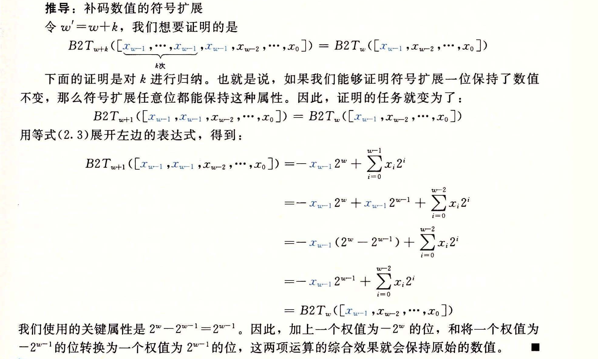

**练习题 2.22** 通过应用等式（2.3），表明下面每个位向量都是 -5 的补码表示。

A. [1011]

B. [11011]

C. [111011]

可以看到第二个和第三个位向量可以通过对第一个位向量做符号扩展得到。

值得一提的是，从一个数据大小到另一个数据大小的转换，以及无符号和有符号数字之间的转换的相对顺序能够影响一个程序的行为。考虑下面的代码：

```c
short sx = -12345;  /* -12345 */
unsigned uy = sx;   /* Mystery! */

printf("uy = %u:\t", uy);
show_bytes((byte_pointer) &uy, sizeof(unsigned));
```

在一台大端法机器上，这部分代码产生如下输出：

```text
uy = 4294954951:    ff ff cf c7
```

这表明当把 short 转换成 unsigned 时，我们先要改变大小，之后再完成从有符号到无符号的转换。也就是说 (unsigned) sx 等价于 (unsigned) (int) sx，求值得到 4 294 954 951，而不等价于 (unsigned) (unsigned short) sx，后者求值得到 53 191。事实上，这个规则是 C 语言标准要求的。

**练习题 2.23** 考虑下面的 C 函数：

```c
int fun1(unsigned word) {
    return (int) ((word << 24) >> 24);
}

int fun2(unsigned word) {
    return ((int) word << 24) >> 24;
}
```

假设在一个采用补码运算的机器上以 32 位程序来执行这些函数。还假设有符号数值的右移是算术右移，而无符号数值的右移是逻辑右移。

A. 填写下表，说明这些函数对几个示例参数的结果。你会发现用十六进制表示来做会更方便，只要记住十六进制数字 8 到 F 的最高有效位等于 1。

| w | fun1(w) | fun2(w) |
| --- | --- | --- |
| 0x00000076 |  |  |
| 0x87654321 |  |  |
| 0x000000C9 |  |  |
| 0xEDCBA987 |  |  |

B. 用语言来描述这些函数执行的有用的计算。

#### 2.2.7 截断数字

假设我们不用额外的位来扩展一个数值，而是减少表示一个数字的位数。例如下面代码中这种情况：

```c
int x = 53191;
short sx = (short) x;  /* -12345 */
int y = sx;            /* -12345 */
```

当我们把 x 强制类型转换为 short 时，我们就将 32 位的 int 截断为了 16 位的 short int。就像前面所看到的，这个 16 位的位模式就是 -12 345 的补码表示。当我们把它强制类型转换回 int 时，符号扩展把高 16 位设置为 1，从而生成 -12 345 的 32 位补码表示。

当将一个 w 位的数 x = [x<sub>w-1</sub>, x<sub>w-2</sub>, ..., x<sub>0</sub>] 截断为一个 k 位数字时，我们会丢弃高 w-k 位，得到一个位向量 x' = [x<sub>k-1</sub>, x<sub>k-2</sub>, ..., x<sub>0</sub>]。截断一个数字可能会改变它的值，溢出的一种形式。对于一个无符号数，我们可以很容易得出其数值结果。

**原理：截断无符号数**

令 x 等于位向量 [x<sub>w-1</sub>, x<sub>w-2</sub>, ..., x<sub>0</sub>]，而 x' 是将其截断为 k 位的结果：[x<sub>k-1</sub>, x<sub>k-2</sub>, ..., x<sub>0</sub>]。令 x = B2U<sub>w</sub>(x)，x' = B2U<sub>k</sub>(x')。则 x' = x mod 2<sup>k</sup>。

该原理背后的直觉就是所有被截去的位其权重形式都为 2<sup>i</sup>，其中 i ≥ k，因此，每一个权在取模操作下结果都为零。可用如下推导表示：

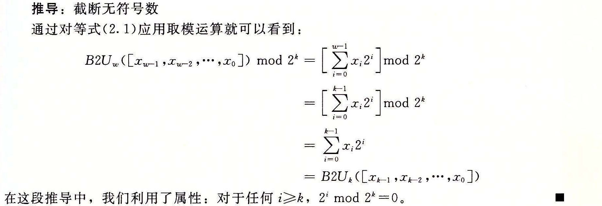

补码截断也具有相似的属性，只不过要将最高位转换为符号位：

**原理：截断补码数值**

令 x 等于位向量 [x<sub>w-1</sub>, x<sub>w-2</sub>, ..., x<sub>0</sub>]，而 x' 是将其截断为 k 位的结果：[x<sub>k-1</sub>, x<sub>k-2</sub>, ..., x<sub>0</sub>]。令 x = B2U<sub>w</sub>(x)，x' = B2T<sub>k</sub>(x')。则 x' = U2T<sub>k</sub>(x mod 2<sup>k</sup>)。

在这个公式中，x mod 2<sup>k</sup> 将是 0 到 2<sup>k</sup>-1 之间的一个数。对其应用函数 U2T<sub>k</sub> 产生的效果是把最高有效位 x<sub>k-1</sub> 的权重从 2<sup>k-1</sup> 转变为 -2<sup>k-1</sup>。举例来看，将数值 x = 53 191 从 int 转换为 short。由于 2<sup>16</sup> = 65 536 ≥ x，我们有 x mod 2<sup>16</sup> = x。但是，当我们把这个数转换为 16 位的补码时，我们得到 x' = 53 191 - 65 536 = -12 345。


总而言之，无符号数的截断结果是公式（2.9），而补码数字的截断结果是公式（2.10）：

> B2U<sub>k</sub>([x<sub>k-1</sub>, x<sub>k-2</sub>, ..., x<sub>0</sub>]) = B2U<sub>w</sub>([x<sub>w-1</sub>, x<sub>w-2</sub>, ..., x<sub>0</sub>]) mod 2<sup>k</sup>　（2.9）
>
> B2T<sub>k</sub>([x<sub>k-1</sub>, x<sub>k-2</sub>, ..., x<sub>0</sub>]) = U2T<sub>k</sub>(B2U<sub>w</sub>([x<sub>w-1</sub>, x<sub>w-2</sub>, ..., x<sub>0</sub>]) mod 2<sup>k</sup>)　（2.10）

**练习题 2.24** 假设将一个 4 位数值（用十六进制数字 0~F 表示）截断到一个 3 位数值（用十六进制数字 0~7 表示）。填写下表，根据那些位模式的无符号和补码解释，说明这种截断对某些情况的结果。

| 十六进制：原始值 | 十六进制：截断值 | 无符号：原始值 | 无符号：截断值 | 补码：原始值 | 补码：截断值 |
| --- | --- | --- | --- | --- | --- |
| 0 | 0 | 0 |  | 0 |  |
| 2 | 2 | 2 |  | 2 |  |
| 9 | 1 | 9 |  | -7 |  |
| B | 3 | 11 |  | -5 |  |
| F | 7 | 15 |  | -1 |  |

解释如何将等式（2.9）和等式（2.10）应用到这些示例上。

#### 2.2.8 关于有符号数与无符号数的建议

就像我们看到的那样，有符号数到无符号数的隐式强制类型转换导致了某些非直观的行为。而这些非直观的特性经常导致程序错误，并且这种包含隐式强制类型转换的细微差别的错误很难被发现。因为这种强制类型转换是在代码中没有明确指示的情况下发生的，程序员经常忽视了它的影响。

下面两个练习题说明了某些由于隐式强制类型转换和无符号数据类型造成的细微的错误。

**练习题 2.25** 考虑下列代码，这段代码试图计算数组 a 中所有元素的和，其中元素的数量由参数 length 给出。

```c
/* WARNING: This is buggy code */
float sum_elements(float a[], unsigned length) {
    int i;
    float result = 0;

    for (i = 0; i <= length-1; i++)
        result += a[i];
    return result;
}
```

当参数 length 等于 0 时，运行这段代码应该返回 0.0。但实际上，运行时会遇到一个内存错误。请解释为什么会发生这样的情况，并且说明如何修改代码。

**练习题 2.26** 现在给你一个任务，写一个函数用来判定一个字符串是否比另一个更长。前提是你要用字符串库函数 strlen，它的声明如下：

```c
/* Prototype for library function strlen */
size_t strlen(const char *s);
```

最开始你写的函数是这样的：

```c
/* Determine whether string s is longer than string t */
/* WARNING: This function is buggy */
int strlonger(char *s, char *t) {
    return strlen(s) - strlen(t) > 0;
}
```

当你在一些示例数据上测试这个函数时，一切似乎都是正确的。进一步研究发现在头文件 stdio.h 中数据类型 size_t 是定义成 unsigned int 的。

A. 在什么情况下，这个函数会产生不正确的结果？

B. 解释为什么会出现这样不正确的结果。

C. 说明如何修改这段代码好让它能可靠地工作。

> **旁注：函数 getpeername 的安全漏洞**
>
> 2002 年，从事 FreeBSD 开源操作系统项目的程序员意识到，他们对 getpeername 函数的实现存在安全漏洞。代码的简化版本如下：
>
> ```c
> /*
>  * Illustration of code vulnerability similar to that found in
>  * FreeBSD's implementation of getpeername()
>  */
>
> /* Declaration of library function memcpy */
> void *memcpy(void *dest, void *src, size_t n);
>
> /* Kernel memory region holding user-accessible data */
> #define KSIZE 1024
> char kbuf[KSIZE];
>
> /* Copy at most maxlen bytes from kernel region to user buffer */
> int copy_from_kernel(void *user_dest, int maxlen) {
>     /* Byte count len is minimum of buffer size and maxlen */
>     int len = KSIZE < maxlen ? KSIZE : maxlen;
>     memcpy(user_dest, kbuf, len);
>     return len;
> }
> ```
>
> 在这段代码里，第 7 行给出的是库函数 memcpy 的原型，这个函数是要将一段指定长度为 n 的字节从内存的一个区域复制到另一个区域。
>
> 从第 14 行开始的函数 copy_from_kernel 是要将一些操作系统内核维护的数据复制到指定的用户可以访问的内存区域。对用户来说，大多数内核维护的数据结构应该是不可读的，因为这些数据结构可能包含其他用户和系统上运行的其他作业的敏感信息，但是显示为 kbuf 的区域是用户可以读的。参数 maxlen 给出的是分配给用户的缓冲区的长度，这个缓冲区是用参数 user_dest 指示的。然后，第 16 行的计算确保复制的字节数据不会超出源或者目标缓冲区可用的范围。
>
> 不过，假设有些怀有恶意的程序员在调用 copy_from_kernel 的代码中对 maxlen 使用了负数值，那么，第 16 行的最小值计算会把这个值赋给 len，然后 len 会作为参数 n 被传递给 memcpy。不过，请注意参数 n 是被声明为数据类型 size_t 的。这个数据类型是在库文件 stdio.h 中（通过 typedef）被声明的。典型地，对 32 位程序它被定义为 unsigned int，对 64 位程序定义为 unsigned long。既然参数 n 是无符号的，那么 memcpy 会把它当作一个非常大的正整数，并且试图将这样多字节的数据从内核区域复制到用户的缓冲区。虽然复制这么多字节（至少 2<sup>31</sup> 个）实际上不会完成，因为程序会遇到进程中非法地址的错误，但是程序还是能读到它没有被授权的内核内存区域。
>
> 我们可以看到，这个问题是由于数据类型的不匹配造成的：在一个地方，长度参数是有符号数；而另一个地方，它又是无符号数。正如这个例子表明的那样，这样的不匹配会成为缺陷的原因，甚至会导致安全漏洞。幸运的是，还没有案例报告有程序员在 FreeBSD 上利用了这个漏洞。他们发布了一个安全建议，“FreeBSD-SA-02:38.signed-error”，建议系统管理员如何应用补丁消除这个漏洞。要修正这个缺陷，只要将 copy_from_kernel 的参数 maxlen 声明为类型 size_t，也就是与 memcpy 的参数 n 一致。同时，我们也应该将本地变量 len 和返回值声明为 size_t。

我们已经看到了许多无符号运算的细微特性，尤其是有符号数到无符号数的隐式转换，会导致错误或者漏洞的方式。避免这类错误的一种方法就是绝不使用无符号数。实际上，除了 C 以外很少有语言支持无符号整数。很明显，这些语言的设计者认为它们带来的麻烦要比益处多得多。比如，Java 只支持有符号整数，并且要求以补码运算来实现。正常的右移运算符 `>>` 被定义为执行算术右移。特殊的运算符 `>>>` 被指定为执行逻辑右移。

当我们想要把字仅仅看做是位的集合而没有任何数字意义时，无符号数值是非常有用的。例如，往一个字中放入描述各种布尔条件的标记（flag）时，就是这样。地址自然地就是无符号的，所以系统程序员发现无符号类型是很有帮助的。当实现模运算和多精度运算的数学包时，数字是由字的数组来表示的，无符号值也会非常有用。

### 2.3 整数运算

许多刚入门的程序员非常惊奇地发现，两个正数相加会得出一个负数，而比较表达式 x < y 和比较表达式 x - y < 0 会产生不同的结果。这些属性是由于计算机运算的有限性造成的。理解计算机运算的细微之处能够帮助程序员编写更可靠的代码。

#### 2.3.1 无符号加法

考虑两个非负整数 x 和 y，满足 0 ≤ x, y < 2<sup>w</sup>。每个数都能表示为 w 位无符号数字。然而，如果计算它们的和，我们就有一个可能的范围 0 ≤ x + y ≤ 2<sup>w+1</sup> - 2。表示这个和可能需要 w + 1 位。例如，图 2-21 展示了当 x 和 y 有 4 位表示时，函数 x + y 的坐标图。参数（显示在水平轴上）取值范围为 0~15，但是和的取值范围为 0~30。函数的形状是一个有坡度的平面（在两个维度上，函数都是线性的）。如果保持和为一个 w + 1 位的数字，并且把它加上另外一个数值，我们可能需要 w + 2 个位，以此类推。这种持续的“字长膨胀”意味着，要想完整地表示算术运算的结果，我们不能对字长做任何限制。一些编程语言，例如 Lisp，实际上就支持无限精度的运算，允许任意的（当然，要在机器的内存限制之内）整数运算。更常见的是，编程语言支持固定精度的运算，因此像“加法”和“乘法”这样的运算不同于它们在整数上的相应运算。

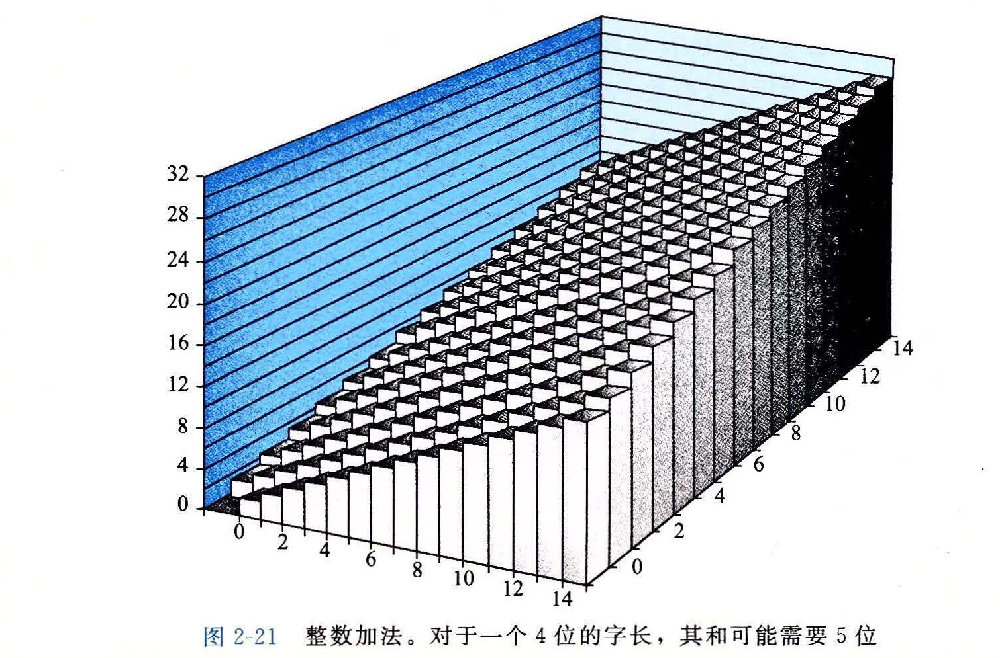

让我们为参数 x 和 y 定义运算 +<sup>u</sup><sub>w</sub>，其中 0 ≤ x, y < 2<sup>w</sup>，该操作是把整数和 x + y 截断为 w 位得到的结果，再把这个结果看做是一个无符号数。这可以被视为一种形式的模运算，对 x + y 的位级表示，简单丢弃任何权重大于 2<sup>w-1</sup> 的位就可以计算出和模 2<sup>w</sup>。比如，考虑一个 4 位数字表示，x = 9 和 y = 12 的位表示分别为 [1001] 和 [1100]。它们的和是 21，5 位的表示为 [10101]。但是如果丢弃最高位，我们就得到 [0101]，也就是说，十进制值的 5。这就和值 21 mod 16 = 5 一致。

我们可以将操作 +<sup>u</sup><sub>w</sub> 描述为：

**原理：无符号数加法**

对满足 0 ≤ x, y < 2<sup>w</sup> 的 x 和 y 有：

| x +<sup>u</sup><sub>w</sub> y | 条件 | 情况 |
| --- | --- | --- |
| x + y | x + y < 2<sup>w</sup> | 正常 |
| x + y - 2<sup>w</sup> | 2<sup>w</sup> ≤ x + y < 2<sup>w+1</sup> | 溢出 |

（2.11）

图 2-22 说明了公式 (2.11) 的这两种情况，左边的和 x + y 映射到右边的无符号 w 位的和 x +<sup>u</sup><sub>w</sub> y。正常情况下 x + y 的值保持不变，而溢出情况则是该和数减去 2<sup>w</sup> 的结果。


**推导：无符号数加法**

一般而言，我们可以看到，如果 x + y < 2<sup>w</sup>，和的 w + 1 位表示中的最高位会等于 0，因此丢弃它不会改变这个数值。另一方面，如果 2<sup>w</sup> ≤ x + y < 2<sup>w+1</sup>，和的 w + 1 位表示中的最高位会等于 1，因此丢弃它就相当于从和中减去了 2<sup>w</sup>。■

说一个算术运算溢出，是指完整的整数结果不能放到数据类型的字长限制中去。如等式 (2.11) 所示，当两个运算数的和为 2<sup>w</sup> 或者更大时，就发生了溢出。图 2-23 展示了字长 w = 4 的无符号加法函数的坐标图。这个和是按模 2<sup>4</sup> = 16 计算的。当 x + y < 16 时，没有溢出，并且 x +<sup>u</sup><sub>4</sub> y 就是 x + y。这对应于图中标记为“正常”的斜面。当 x + y ≥ 16 时，加法溢出，结果相当于从和中减去 16。这对应于图中标记为“溢出”的斜面。

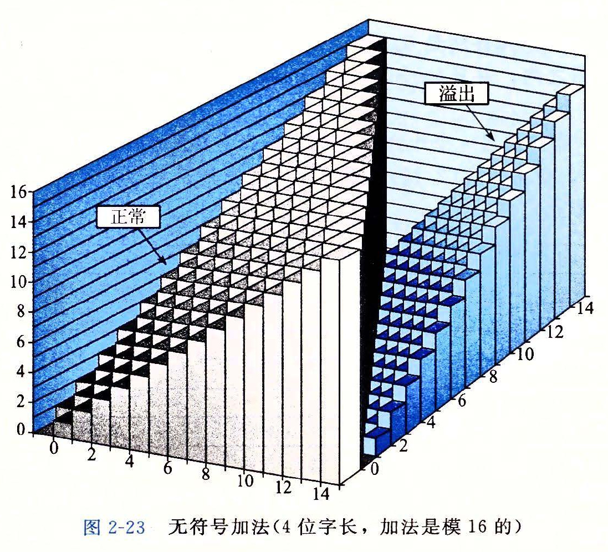

当执行 C 程序时，不会将溢出作为错误而发信号。不过有的时候，我们可能希望判定是否发生了溢出。

**原理：检测无符号数加法中的溢出**

对在范围 0 ≤ x, y ≤ UMax<sub>w</sub> 中的 x 和 y，令 s = x +<sup>u</sup><sub>w</sub> y。则对计算 s，当且仅当 s < x（或者等价地 s < y）时，发生了溢出。

作为说明，在前面的示例中，我们看到 9 +<sup>u</sup><sub>4</sub> 12 = 5。由于 5 < 9，我们可以看出发生了溢出。

**推导：检测无符号数加法中的溢出**

通过观察发现 x + y ≥ x，因此如果 s 没有溢出，我们能够肯定 s ≥ x。另一方面，如果 s 确实溢出了，我们就有 s = x + y - 2<sup>w</sup>。假设 y < 2<sup>w</sup>，我们就有 y - 2<sup>w</sup> < 0，因此 s = x + (y - 2<sup>w</sup>) < x。■

**练习题 2.27**

写出一个具有如下原型的函数：

```c
/* Determine whether arguments can be added without overflow */
int uadd_ok(unsigned x, unsigned y);
```

如果参数 x 和 y 相加不会产生溢出，这个函数就返回 1。

模数加法形成了一种数学结构，称为阿贝尔群（Abelian group），这是以丹麦数学家 Niels Henrik Abel（1802~1829）的名字命名。也就是说，它是可交换的（这就是为什么叫 “abelian” 的地方）和可结合的。它有一个单位元 0，并且每个元素有一个加法逆元。让我们考虑 w 位的无符号数的集合，执行加法运算 +<sup>u</sup><sub>w</sub>。对于每个值 x，必然有某个值 -<sup>u</sup><sub>w</sub>x 满足 -<sup>u</sup><sub>w</sub>x +<sup>u</sup><sub>w</sub> x = 0。该加法的逆操作可以表述如下：

**原理：无符号数求反**

对满足 0 ≤ x < 2<sup>w</sup> 的任意 x，其 w 位的无符号逆元 -<sup>u</sup><sub>w</sub>x 由下式给出：

| -<sup>u</sup><sub>w</sub>x | 条件 |
| --- | --- |
| x | x = 0 |
| 2<sup>w</sup> - x | x > 0 |

（2.12）

该结果可以很容易地通过案例分析推导出来：

**推导：无符号数求反**

当 x = 0 时，加法逆元显然是 0。对于 x > 0，考虑值 2<sup>w</sup> - x。我们观察到这个数字在 0 < 2<sup>w</sup> - x < 2<sup>w</sup> 范围之内，并且 (x + 2<sup>w</sup> - x) mod 2<sup>w</sup> = 2<sup>w</sup> mod 2<sup>w</sup> = 0。因此，它就是 x 在 +<sup>u</sup><sub>w</sub> 下的逆元。■

**练习题 2.28**

我们能用一个十六进制数字来表示长度 w = 4 的位模式。对于这些数字的无符号解释，使用等式 (2.12) 填写下表，给出所示数字的无符号加法逆元的位表示（用十六进制形式）。

| x（十六进制） | x（十进制） | -<sup>u</sup><sub>4</sub>x（十进制） | -<sup>u</sup><sub>4</sub>x（十六进制） |
| --- | --- | --- | --- |
| 0 |  |  |  |
| 5 |  |  |  |
| 8 |  |  |  |
| D |  |  |  |
| F |  |  |  |

#### 2.3.2 补码加法

对于补码加法，我们必须确定当结果太大（为正）或者太小（为负）时，应该做些什么。给定在范围 -2<sup>w-1</sup> ≤ x, y ≤ 2<sup>w-1</sup> - 1 之内的整数值 x 和 y，它们的和就在范围 -2<sup>w</sup> ≤ x + y ≤ 2<sup>w</sup> - 2 之内，要想准确表示，可能需要 w + 1 位。就像以前一样，我们通过将表示截断到 w 位，来避免数据大小的不断扩张。然而，结果却不像模数加法那样在数学上感觉很熟悉。定义 x +<sup>t</sup><sub>w</sub> y 为整数和 x + y 被截断为 w 位的结果，并将这个结果看做是补码数。

**原理：补码加法**

对满足 -2<sup>w-1</sup> ≤ x, y ≤ 2<sup>w-1</sup> - 1 的整数 x 和 y，有：

| x +<sup>t</sup><sub>w</sub> y | 条件 | 情况 |
| --- | --- | --- |
| x + y - 2<sup>w</sup> | 2<sup>w-1</sup> ≤ x + y | 正溢出 |
| x + y | -2<sup>w-1</sup> ≤ x + y < 2<sup>w-1</sup> | 正常 |
| x + y + 2<sup>w</sup> | x + y < -2<sup>w-1</sup> | 负溢出 |

（2.13）

图 2-24 说明了这个原理，其中，左边的和 x + y 的取值范围为 -2<sup>w</sup> ≤ x + y ≤ 2<sup>w</sup> - 2，右边显示的是该和数截断为 w 位补码的结果。（图中的标号“情况 1”到“情况 4”用于该原理形式化推导的案例分析中。）当和 x + y 超过 TMax<sub>w</sub> 时（情况 4），我们说发生了正溢出。在这种情况下，截断的结果是从和数中减去 2<sup>w</sup>。当和 x + y 小于 TMin<sub>w</sub> 时（情况 1），我们说发生了负溢出。在这种情况下，截断的结果是把和数加上 2<sup>w</sup>。

两个数的 w 位补码之和与无符号之和有完全相同的位级表示。实际上，大多数计算机使用同样的机器指令来执行无符号或者有符号加法。

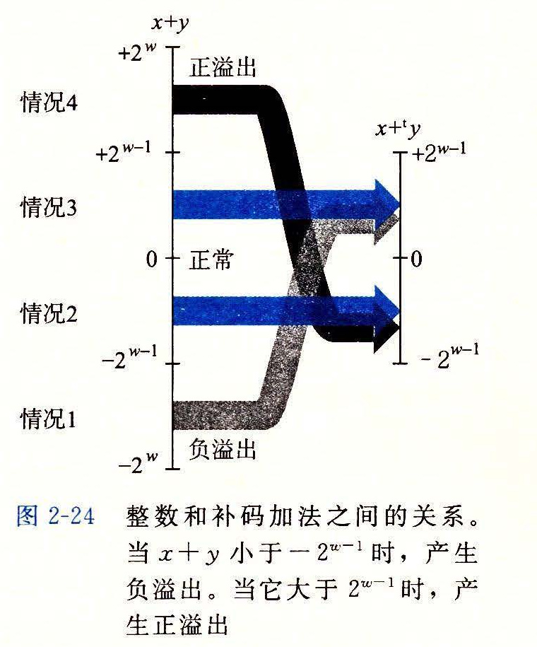

**推导：补码加法**

既然补码加法与无符号数加法有相同的位级表示，我们就可以按如下步骤表示运算 +<sup>t</sup><sub>w</sub>：将其参数转换为无符号数，执行无符号数加法，再将结果转换为补码：

> x +<sup>t</sup><sub>w</sub> y ≐ U2T<sub>w</sub>(T2U<sub>w</sub>(x) +<sup>u</sup><sub>w</sub> T2U<sub>w</sub>(y))　（2.14）

根据等式 (2.6)，我们可以把 T2U<sub>w</sub>(x) 写成 x<sub>w-1</sub>2<sup>w</sup> + x，把 T2U<sub>w</sub>(y) 写成 y<sub>w-1</sub>2<sup>w</sup> + y。使用属性，即 +<sup>u</sup><sub>w</sub> 是模 2<sup>w</sup> 的加法，以及模数加法的属性，我们就能得到：

> x +<sup>t</sup><sub>w</sub> y = U2T<sub>w</sub>(T2U<sub>w</sub>(x) +<sup>u</sup><sub>w</sub> T2U<sub>w</sub>(y))
>
> = U2T<sub>w</sub>[(x<sub>w-1</sub>2<sup>w</sup> + x + y<sub>w-1</sub>2<sup>w</sup> + y) mod 2<sup>w</sup>]
>
> = U2T<sub>w</sub>[(x + y) mod 2<sup>w</sup>]

消除了 x<sub>w-1</sub>2<sup>w</sup> 和 y<sub>w-1</sub>2<sup>w</sup> 这两项，因为它们模 2<sup>w</sup> 等于 0。

为了更好地理解这个数量，定义 z 为整数和 z = x + y，z' 为 z' = z mod 2<sup>w</sup>，而 z'' 为 z'' = U2T<sub>w</sub>(z')。数值 z'' 等于 x +<sup>t</sup><sub>w</sub> y。我们分成 4 种情况分析，如图 2-24 所示。

1. -2<sup>w</sup> ≤ z < -2<sup>w-1</sup>。然后，我们会有 z' = z + 2<sup>w</sup>。这就得出 0 ≤ z' < -2<sup>w-1</sup> + 2<sup>w</sup> = 2<sup>w-1</sup>。检查等式 (2.7)，我们看到 z' 在满足 z'' = z' 的范围之内。这种情况称为负溢出（negative overflow）。我们将两个负数 x 和 y 相加（这是我们能得到 z < -2<sup>w-1</sup> 的唯一方式），得到一个非负的结果 z'' = x + y + 2<sup>w</sup>。

2. -2<sup>w-1</sup> ≤ z < 0。那么，我们又将有 z' = z + 2<sup>w</sup>，得到 -2<sup>w-1</sup> + 2<sup>w</sup> = 2<sup>w-1</sup> ≤ z' < 2<sup>w</sup>。检查等式 (2.7)，我们看到 z' 在满足 z'' = z' - 2<sup>w</sup> 的范围之内，因此 z'' = z' - 2<sup>w</sup> = z + 2<sup>w</sup> - 2<sup>w</sup> = z。也就是说，我们的补码和 z'' 等于整数和 x + y。

3. 0 ≤ z < 2<sup>w-1</sup>。那么，我们将有 z' = z，得到 0 ≤ z' < 2<sup>w-1</sup>，因此 z'' = z' = z。补码和 z'' 又等于整数和 x + y。

4. 2<sup>w-1</sup> ≤ z < 2<sup>w</sup>。我们又将有 z' = z，得到 2<sup>w-1</sup> ≤ z' < 2<sup>w</sup>。但是在这个范围内，我们有 z'' = z' - 2<sup>w</sup>，得到 z'' = x + y - 2<sup>w</sup>。这种情况称为正溢出（positive overflow）。我们将正数 x 和 y 相加（这是我们能得到 z ≥ 2<sup>w-1</sup> 的唯一方式），得到一个负数结果 z'' = x + y - 2<sup>w</sup>。■

图 2-25 展示了一些 4 位补码加法的示例作为说明。每个示例的情况都被标号为对应于等式 (2.13) 的推导过程中的情况。注意 2<sup>4</sup> = 16，因此负溢出得到的结果比整数和大 16，而正溢出得到的结果比之小 16。我们包括了运算数和结果的位级表示。可以观察到，能够通过对运算数执行二进制加法并将结果截断到 4 位，从而得到结果。

| x | y | x + y | x +<sup>t</sup><sub>4</sub> y | 情况 |
| --- | --- | --- | --- | --- |
| -8 [1000] | -5 [1011] | -13 [10011] | 3 [0011] | 1 |
| -8 [1000] | -8 [1000] | -16 [10000] | 0 [0000] | 1 |
| -8 [1000] | 5 [0101] | -3 [11101] | -3 [1101] | 2 |
| 2 [0010] | 5 [0101] | 7 [00111] | 7 [0111] | 3 |
| 5 [0101] | 5 [0101] | 10 [01010] | -6 [1010] | 4 |

*图 2-25　补码加法示例。通过执行运算数的二进制加法并将结果截断到 4 位，可以获得 4 位补码和的位级表示*

图 2-26 阐述了字长 w = 4 的补码加法。运算数的范围为 -8~7 之间。当 x + y < -8 时，补码加法就会负溢出，导致和增加了 16。当 -8 ≤ x + y < 8 时，加法就产生 x + y。当 x + y ≥ 8 时，加法就会正溢出，使得和减少了 16。这三种情况中的每一种都形成了图中的一个斜面。

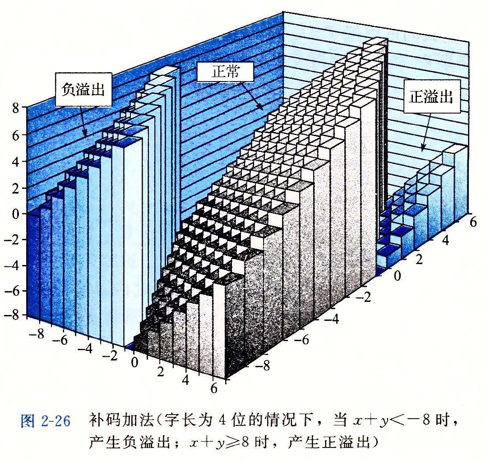

等式 (2.13) 也让我们认出了哪些情况下会发生溢出：

**原理：检测补码加法中的溢出**

对满足 TMin<sub>w</sub> ≤ x, y ≤ TMax<sub>w</sub> 的 x 和 y，令 s = x +<sup>t</sup><sub>w</sub> y。当且仅当 x > 0，y > 0，但 s ≤ 0 时，计算 s 发生了正溢出。当且仅当 x < 0，y < 0，但 s ≥ 0 时，计算 s 发生了负溢出。

图 2-25 显示了当 w = 4 时，这个原理的例子。第一个条目是负溢出的情况，两个负数相加得到一个正数。最后一个条目是正溢出的情况，两个正数相加得到一个负数。

**推导：检测补码加法中的溢出**

让我们先来分析正溢出。如果 x > 0，y > 0，而 s ≤ 0，那么显然发生了正溢出。反过来，正溢出的条件为：1）x > 0，y > 0（或者 x + y > TMax<sub>w</sub>），2）s ≤ 0（见公式 (2.13)）。同样的讨论也适用于负溢出情况。■

**练习题 2.29**

按照图 2-25 的形式填写下表。分别列出 5 位参数的整数值、整数和与补码和的数值、补码和的位级表示，以及属于等式 (2.13) 推导中的哪种情况。

| x | y | x + y | x +<sup>t</sup><sub>5</sub> y | 情况 |
| --- | --- | --- | --- | --- |
| [10100] | [10001] |  |  |  |
| [11000] | [11000] |  |  |  |
| [10111] | [01000] |  |  |  |
| [00010] | [00101] |  |  |  |
| [01100] | [00100] |  |  |  |

**练习题 2.30**

写出一个具有如下原型的函数：

```c
/* Determine whether arguments can be added without overflow */
int tadd_ok(int x, int y);
```

如果参数 x 和 y 相加不会产生溢出，这个函数就返回 1。

**练习题 2.31**

你的同事对你补码加法溢出条件的分析有些不耐烦了，他给出了一个函数 tadd_ok 的实现，如下所示：

```c
/* Determine whether arguments can be added without overflow */
/* WARNING: This code is buggy. */
int tadd_ok(int x, int y) {
    int sum = x+y;
    return (sum-x == y) && (sum-y == x);
}
```

你看了代码以后笑了。解释一下为什么。

**练习题 2.32**

你现在有个任务，编写函数 tsub_ok 的代码，函数的参数是 x 和 y，如果计算 x - y 不产生溢出，函数就返回 1。假设你写的练习题 2.30 的代码如下所示：

```c
/* Determine whether arguments can be subtracted without overflow */
/* WARNING: This code is buggy. */
int tsub_ok(int x, int y) {
    return tadd_ok(x, -y);
}
```

x 和 y 取什么值时，这个函数会产生错误的结果？写一个该函数的正确版本（家庭作业 2.74）。

#### 2.3.3 补码的非

可以看到范围在 TMin<sub>w</sub> ≤ x ≤ TMax<sub>w</sub> 中的每个数字 x 都有 +<sup>t</sup><sub>w</sub> 下的加法逆元，我们将 -<sup>t</sup><sub>w</sub>x 表示如下。

**原理：补码的非**

对满足 TMin<sub>w</sub> ≤ x ≤ TMax<sub>w</sub> 的 x，其补码的非 -<sup>t</sup><sub>w</sub>x 由下式给出：

| -<sup>t</sup><sub>w</sub>x | 条件 |
| --- | --- |
| TMin<sub>w</sub> | x = TMin<sub>w</sub> |
| -x | x > TMin<sub>w</sub> |

（2.15）

也就是说，对 w 位的补码加法来说，TMin<sub>w</sub> 是自己的加法的逆，而对其他任何数值 x 都有 -x 作为其加法的逆。

**推导：补码的非**

观察发现 TMin<sub>w</sub> + TMin<sub>w</sub> = -2<sup>w-1</sup> + (-2<sup>w-1</sup>) = -2<sup>w</sup>。这将导致负溢出，因此 TMin<sub>w</sub> +<sup>t</sup><sub>w</sub> TMin<sub>w</sub> = -2<sup>w</sup> + 2<sup>w</sup> = 0。对满足 x > TMin<sub>w</sub> 的 x，数值 -x 可以表示为一个 w 位的补码，它们的和 -x + x = 0。■

**练习题 2.33** 我们可以用一个十六进制数字来表示长度 w = 4 的位模式。根据这些数字的补码的解释，填写下表，确定所示数字的加法逆元。

| x（十六进制） | x（十进制） | -<sup>t</sup><sub>4</sub>x（十进制） | -<sup>t</sup><sub>4</sub>x（十六进制） |
| --- | --- | --- | --- |
| 0 |  |  |  |
| 5 |  |  |  |
| 8 |  |  |  |
| D |  |  |  |
| F |  |  |  |

对于补码和无符号（练习题 2.28）非（negation）产生的位模式，你观察到什么？

> **网络旁注 DATA:TNEG：补码非的位级表示**
>
> 计算一个位级表示的值的补码非有几种聪明的方法。这些技术很有用（例如当你在调试程序的时候遇到值 0xfffffffa），同时它们也能够让你更了解补码表示的本质。
>
> 执行位级补码非的第一种方法是对每一位求补，再对结果加 1。在 C 语言中，我们可以说，对于任意整数值 x，计算表达式 `-x` 和 `~x+1` 得到的结果完全一样。
>
> 下面是一些示例，字长为 4：
>
> | x⃗ | ~x⃗ | incr(~x⃗) |
> | --- | --- | --- |
> | `[0101]`　5 | `[1010]`　-6 | `[1011]`　-5 |
> | `[0111]`　7 | `[1000]`　-8 | `[1001]`　-7 |
> | `[1100]`　-4 | `[0011]`　3 | `[0100]`　4 |
> | `[0000]`　0 | `[1111]`　-1 | `[0000]`　0 |
> | `[1000]`　-8 | `[0111]`　7 | `[1000]`　-8 |
>
> 从前面的例子我们知道 0xF 的补是 0x0，而 0xA 的补是 0x5，因而 0xFFFFFFFA 是 -6 的补码表示。
>
> 计算一个数 x 的补码非的第二种方法是建立在将位向量分为两部分的基础之上的。假设 k 是最右边的 1 的位置，因而 x 的位级表示形如 [x<sub>w-1</sub>, x<sub>w-2</sub>, ..., x<sub>k+1</sub>, 1, 0, ..., 0]。（只要 x ≠ 0 就能够找到这样的 k。）这个值的非写成二进制格式就是 [~x<sub>w-1</sub>, ~x<sub>w-2</sub>, ..., ~x<sub>k+1</sub>, 1, 0, ..., 0]。也就是，我们对位 k 左边的所有位取反。
>
> 我们用一些 4 位数字来说明这个方法，这里我们用斜体来突出最右边的模式 1, 0, ..., 0：
>
> | x | -x |
> | --- | --- |
> | [1*100*]　-4 | [0*100*]　4 |
> | [*1000*]　-8 | [*1000*]　-8 |
> | [010*1*]　5 | [101*1*]　-5 |
> | [011*1*]　7 | [100*1*]　-7 |

#### 2.3.4 无符号乘法

范围在 0 ≤ x, y ≤ 2<sup>w</sup> - 1 内的整数 x 和 y 可以被表示为 w 位的无符号数，但是它们的乘积 x · y 的取值范围为 0 到 (2<sup>w</sup> - 1)<sup>2</sup> = 2<sup>2w</sup> - 2<sup>w+1</sup> + 1 之间。这可能需要 2w 位来表示。不过，C 语言中的无符号乘法被定义为产生 w 位的值，就是 2w 位的整数乘积的低 w 位表示的值。我们将这个值表示为 x *<sup>u</sup><sub>w</sub> y。

将一个无符号数截断为 w 位等价于计算该值模 2<sup>w</sup>，得到：

**原理：无符号数乘法**

对满足 0 ≤ x, y ≤ UMax<sub>w</sub> 的 x 和 y 有：

> x *<sup>u</sup><sub>w</sub> y = (x · y) mod 2<sup>w</sup>　（2.16）

#### 2.3.5 补码乘法

范围在 -2<sup>w-1</sup> ≤ x, y ≤ 2<sup>w-1</sup> - 1 内的整数 x 和 y 可以被表示为 w 位的补码数字，但是它们的乘积 x · y 的取值范围为 -2<sup>w-1</sup> · (2<sup>w-1</sup> - 1) = -2<sup>2w-2</sup> + 2<sup>w-1</sup> 到 -2<sup>w-1</sup> · -2<sup>w-1</sup> = 2<sup>2w-2</sup> 之间。要想用补码来表示这个乘积，可能需要 2w 位。然而，C 语言中的有符号乘法是通过将 2w 位的乘积截断为 w 位来实现的。我们将这个数值表示为 x *<sup>t</sup><sub>w</sub> y。将一个补码数截断为 w 位相当于先计算该值模 2<sup>w</sup>，再把无符号数转换为补码，得到：

**原理：补码乘法**

对满足 TMin<sub>w</sub> ≤ x, y ≤ TMax<sub>w</sub> 的 x 和 y 有：

> x *<sup>t</sup><sub>w</sub> y = U2T<sub>w</sub>((x · y) mod 2<sup>w</sup>)　（2.17）

我们认为对于无符号和补码乘法来说，乘法运算的位级表示都是一样的，并用如下原理说明：

**原理：无符号和补码乘法的位级等价性**

给定长度为 w 的位向量 x⃗ 和 y⃗，用补码形式的位向量表示来定义整数 x 和 y：x = B2T<sub>w</sub>(x⃗)，y = B2T<sub>w</sub>(y⃗)。用无符号形式的位向量表示来定义非负整数 x' 和 y'：x' = B2U<sub>w</sub>(x⃗)，y' = B2U<sub>w</sub>(y⃗)。则

> T2B<sub>w</sub>(x *<sup>t</sup><sub>w</sub> y) = U2B<sub>w</sub>(x' *<sup>u</sup><sub>w</sub> y')

**推导：无符号和补码乘法的位级等价性**

根据等式（2.6），我们有 x' = x + x<sub>w-1</sub>2<sup>w</sup> 和 y' = y + y<sub>w-1</sub>2<sup>w</sup>。计算这些值的乘积模 2<sup>w</sup> 得到以下结果：

> (x' · y') mod 2<sup>w</sup>
>
> = [(x + x<sub>w-1</sub>2<sup>w</sup>) · (y + y<sub>w-1</sub>2<sup>w</sup>)] mod 2<sup>w</sup>
>
> = [x · y + (x<sub>w-1</sub>y + y<sub>w-1</sub>x)2<sup>w</sup> + x<sub>w-1</sub>y<sub>w-1</sub>2<sup>2w</sup>] mod 2<sup>w</sup>
>
> = (x · y) mod 2<sup>w</sup>　（2.18）

由于模运算符，所有带有权重 2<sup>w</sup> 和 2<sup>2w</sup> 的项都丢掉了。根据等式（2.17），我们有 x *<sup>t</sup><sub>w</sub> y = U2T<sub>w</sub>((x · y) mod 2<sup>w</sup>)。对等式两边应用操作 T2U<sub>w</sub> 有：

> T2U<sub>w</sub>(x *<sup>t</sup><sub>w</sub> y)
>
> = T2U<sub>w</sub>(U2T<sub>w</sub>((x · y) mod 2<sup>w</sup>))
>
> = (x · y) mod 2<sup>w</sup>

将上述结果与式（2.16）和式（2.18）结合起来得到

> T2U<sub>w</sub>(x *<sup>t</sup><sub>w</sub> y)
>
> = (x' · y') mod 2<sup>w</sup>
>
> = x' *<sup>u</sup><sub>w</sub> y'

然后对这个等式的两边应用 U2B<sub>w</sub>，得到

> U2B<sub>w</sub>(T2U<sub>w</sub>(x *<sup>t</sup><sub>w</sub> y))
>
> = T2B<sub>w</sub>(x *<sup>t</sup><sub>w</sub> y)
>
> = U2B<sub>w</sub>(x' *<sup>u</sup><sub>w</sub> y')

■

作为说明，图 2-27 给出了不同 3 位数字的乘法结果。对于每一对位级运算数，我们执行无符号和补码乘法，得到 6 位的乘积，然后再把这些乘积截断到 3 位。无符号的截断后的乘积总是等于 x · y mod 8。虽然无符号和补码两种乘法乘积的 6 位表示不同，但是截断后的乘积的位级表示都相同。

| 模式 | x | y | x · y | 截断的 x · y |
| --- | --- | --- | --- | --- |
| 无符号 | 5 [101] | 3 [011] | 15 [001111] | 7 [111] |
| 补码 | -3 [101] | 3 [011] | -9 [110111] | -1 [111] |
| 无符号 | 4 [100] | 7 [111] | 28 [011100] | 4 [100] |
| 补码 | -4 [100] | -1 [111] | 4 [000100] | -4 [100] |
| 无符号 | 3 [011] | 3 [011] | 9 [001001] | 1 [001] |
| 补码 | 3 [011] | 3 [011] | 9 [001001] | 1 [001] |

*图 2-27　3 位无符号和补码乘法示例。虽然完整的乘积的位级表示可能会不同，但是截断后乘积的位级表示是相同的*

**练习题 2.34** 按照图 2-27 的风格填写下表，说明不同的 3 位数字乘法的结果。

| 模式 | x | y | x · y | 截断的 x · y |
| --- | --- | --- | --- | --- |
| 无符号 | [100] | [101] |  |  |
| 补码 | [100] | [101] |  |  |
| 无符号 | [010] | [111] |  |  |
| 补码 | [010] | [111] |  |  |
| 无符号 | [110] | [110] |  |  |
| 补码 | [110] | [110] |  |  |

**练习题 2.35** 给你一个任务，开发函数 tmult_ok 的代码，该函数会判断两个参数相乘是否会产生溢出。下面是你的解决方案：

```c
/* Determine whether arguments can be multiplied without overflow */
int tmult_ok(int x, int y) {
    int p = x*y;
    /* Either x is zero, or dividing p by x gives y */
    return !x || p/x == y;
}
```

你用 x 和 y 的很多值来测试这段代码，似乎都工作正常。你的同事挑战你，说：“如果我不能用减法来检验加法是否溢出（参见练习题 2.31），那么你怎么能用除法来检验乘法是否溢出呢？”

按照下面的思路，用数学推导来证明你的方法是对的。首先，证明 x = 0 的情况是正确的。另外，考虑 w 位数字 x（x ≠ 0）、y、p 和 q，这里 p 是 x 和 y 补码乘法的结果，而 q 是 p 除以 x 的结果。

1. 说明 x 和 y 的整数乘积 x · y，可以写成这样的形式：x · y = p + t2<sup>w</sup>，其中，t ≠ 0 当且仅当 p 的计算溢出。

2. 说明 p 可以写成这样的形式：p = x · q + r，其中 |r| < |x|。

3. 说明 q = y 当且仅当 r = t = 0。

**练习题 2.36** 对于数据类型 int 为 32 位的情况，设计一个版本的 tmult_ok 函数（练习题 2.35），使用 64 位精度的数据类型 int64_t，而不使用除法。

> **旁注：XDR 库中的安全漏洞**
>
> 2002 年，人们发现 Sun Microsystems 公司提供的实现 XDR 库的代码有安全漏洞，XDR 库是一个广泛使用的、程序间共享数据结构的工具，造成这个安全漏洞的原因是程序会在毫无察觉的情况下产生乘法溢出。
>
> 包含安全漏洞的代码与下面所示类似：
>
> ```c
> /* Illustration of code vulnerability similar to that found in
>  * Sun's XDR library.
>  */
> void* copy_elements(void *ele_src[], int ele_cnt, size_t ele_size) {
>     /*
>      * Allocate buffer for ele_cnt objects, each of ele_size bytes
>      * and copy from locations designated by ele_src
>      */
>     void *result = malloc(ele_cnt * ele_size);
>     if (result == NULL)
>         /* malloc failed */
>         return NULL;
>     void *next = result;
>     int i;
>     for (i = 0; i < ele_cnt; i++) {
>         /* Copy object i to destination */
>         memcpy(next, ele_src[i], ele_size);
>         /* Move pointer to next memory region */
>         next += ele_size;
>     }
>     return result;
> }
> ```
>
> 函数 `copy_elements` 设计用来将 `ele_cnt` 个数据结构复制到第 9 行的函数分配的缓冲区中，每个数据结构包含 `ele_size` 个字节。需要的字节数是通过计算 `ele_cnt * ele_size` 得到的。
>
> 想象一下，一个怀有恶意的程序员在被编译为 32 位的程序中用参数 `ele_cnt` 等于 1 048 577（2<sup>20</sup> + 1）、`ele_size` 等于 4096（2<sup>12</sup>）来调用这个函数。然后第 9 行上的乘法会溢出，导致只会分配 4096 个字节，而不是装下这些数据所需要的 4 294 971 392 个字节。从第 15 行开始的循环会试图复制所有的字节，超越已分配的缓冲区的界限，因而破坏了其他的数据结构。这会导致程序崩溃或者行为异常。
>
> 几乎每个操作系统都使用了这段 Sun 的代码，像 Internet Explorer 和 Kerberos 验证系统这样使用广泛的程序都用到了它。计算机紧急响应组（Computer Emergency Response Team，CERT），由卡内基-梅隆软件工程协会（Carnegie Mellon Software Engineering Institute）运作的一个追踪安全漏洞或失效的组织，发布了建议“CA-2002-25”，于是许多公司急忙对它们的代码打补丁。幸运的是，还没有由于这个漏洞引起的安全失效的报告。
>
> 库函数 `calloc` 的实现中存在着类似的漏洞。这些已经被修补过了。遗憾的是，许多程序员调用分配函数（如 `malloc`）时，使用算术表达式作为参数，并且不对这些表达式进行溢出检查。编写 `calloc` 的可靠版本留作一道练习题（家庭作业 2.76）。

**练习题 2.37** 现在你有一个任务，当数据类型 int 和 size_t 都是 32 位的，修补上述旁注给出的 XDR 代码中的漏洞。你决定将待分配字节数设置为数据类型 uint64_t，来消除乘法溢出的可能性。你把原来对 malloc 函数的调用（第 9 行）替换如下：

```c
uint64_t asize =
    ele_cnt * (uint64_t) ele_size;
void *result = malloc(asize);
```

提醒一下，malloc 的参数类型是 size_t。

A. 这段代码对原始的代码有了哪些改进？

B. 你该如何修改代码来消除这个漏洞？

#### 2.3.6 乘以常数

以往，在大多数机器上，整数乘法指令相当慢，需要 10 个或者更多的时钟周期，然而其他整数运算（例如加法、减法、位级运算和移位）只需要 1 个时钟周期。即使在我们的参考机器 Intel Core i7 Haswell 上，其整数乘法也需要 3 个时钟周期。因此，编译器使用了一项重要的优化，试着用移位和加法运算的组合来代替乘以常数因子的乘法。首先，我们会考虑乘以 2 的幂的情况，然后再概括成乘以任意常数。

**原理：乘以 2 的幂**

设 x 为位模式 [x<sub>w-1</sub>, x<sub>w-2</sub>, ..., x<sub>0</sub>] 表示的无符号整数。那么，对于任何 k ≥ 0，我们都认为 [x<sub>w-1</sub>, x<sub>w-2</sub>, ..., x<sub>0</sub>, 0, ..., 0] 给出了 x2<sup>k</sup> 的 w + k 位的无符号表示，这里右边增加了 k 个 0。

因此，比如，当 w = 4 时，11 可以被表示为 [1011]。k = 2 时将其左移得到 6 位向量 [101100]，即可编码为无符号数 11 · 4 = 44。

**推导：乘以 2 的幂**

这个属性可以通过等式（2.1）推导出来：

> B2U<sub>w+k</sub>([x<sub>w-1</sub>, x<sub>w-2</sub>, ..., x<sub>0</sub>, 0, ..., 0])
>
> = Σ<sub>i=0</sub><sup>w-1</sup>x<sub>i</sub>2<sup>i+k</sup>
>
> = [Σ<sub>i=0</sub><sup>w-1</sup>x<sub>i</sub>2<sup>i</sup>] · 2<sup>k</sup>
>
> = x2<sup>k</sup>

■

当对固定字长左移 k 位时，其高 k 位被丢弃，得到 [x<sub>w-k-1</sub>, x<sub>w-k-2</sub>, ..., x<sub>0</sub>, 0, ..., 0]，而执行固定字长的乘法也是这种情况。因此，我们可以看出左移一个数值等价于执行一个与 2 的幂相乘的无符号乘法。

**原理：与 2 的幂相乘的无符号乘法**

C 变量 x 和 k 有无符号数值 x 和 k，且 0 ≤ k < w，则 C 表达式 `x << k` 产生数值 x *<sup>u</sup><sub>w</sub> 2<sup>k</sup>。

由于固定大小的补码算术运算的位级操作与其无符号运算等价，我们就可以对补码运算的 2 的幂的乘法与左移之间的关系进行类似的表述：

**原理：与 2 的幂相乘的补码乘法**

C 变量 x 和 k 有补码值 x 和无符号数值 k，且 0 ≤ k < w，则 C 表达式 `x << k` 产生数值 x *<sup>t</sup><sub>w</sub> 2<sup>k</sup>。

注意，无论是无符号运算还是补码运算，乘以 2 的幂都可能会导致溢出。结果表明，即使溢出的时候，我们通过移位得到的结果也是一样的。回到前面的例子，我们将 4 位模式 [1011]（数值为 11）左移两位得到 [101100]（数值为 44）。将这个值截断为 4 位得到 [1100]（数值为 12 = 44 mod 16）。

由于整数乘法比移位和加法的代价要大得多，许多 C 语言编译器试图以移位、加法和减法的组合来消除很多整数乘以常数的情况。例如，假设一个程序包含表达式 `x * 14`。利用 14 = 2<sup>3</sup> + 2<sup>2</sup> + 2<sup>1</sup>，编译器会将乘法重写为 `(x<<3)+(x<<2)+(x<<1)`，将一个乘法替换为三个移位和两个加法。无论 x 是无符号的还是补码，甚至当乘法会导致溢出时，两个计算都会得到一样的结果。（根据整数运算的属性可以证明这一点。）更好的是，编译器还可以利用属性 14 = 2<sup>4</sup> - 2<sup>1</sup>，将乘法重写为 `(x<<4)-(x<<1)`，这时只需要两个移位和一个减法。

**练习题 2.38** 就像我们将在第 3 章中看到的那样，LEA 指令能够执行形如 `(a<<k)+b` 的计算，这里 k 等于 0、1、2 或 3，而 b 等于 0 或者某个程序值。编译器常常用这条指令来执行常数因子乘法。例如，我们可以用 `(a<<1)+a` 来计算 3*a。

考虑 b 等于 0 或者等于 a、k 为任意可能的值的情况，用一条 LEA 指令可以计算 a 的哪些倍数？

归纳一下我们的例子，考虑一个任务，对于某个常数 K 的表达式 x*K 生成代码。编译器会将 K 的二进制表示表达为一组 0 和 1 交替的序列：

[(0...0)(1...1)(0...0)...(1...1)]

例如，14 可以写成 [(0...0)(111)(0)]。考虑一组从位位置 n 到位位置 m 的连续的 1（n ≥ m）。（对于 14 来说，我们有 n = 3 和 m = 1。）我们可以用下面两种不同形式中的一种来计算这些位对乘积的影响：

形式 A：`(x<<n)+(x<<(n-1))+...+(x<<m)`

形式 B：`(x<<(n+1))-(x<<m)`

把每个这样连续的 1 的结果加起来，不用做任何乘法，我们就能计算出 x*K。当然，选择使用移位、加法和减法的组合，还是使用一条乘法指令，取决于这些指令的相对速度，而这些是与机器高度相关的。大多数编译器只在需要少量移位、加法和减法就足够的时候才使用这种优化。

**练习题 2.39** 对于位位置 n 为最高有效位的情况，我们要怎样修改形式 B 的表达式？

**练习题 2.40** 对于下面每个 K 的值，找出只用指定数量的运算表达 x*K 的方法，这里我们认为加法和减法的开销相当。除了我们已经考虑过的简单的形式 A 和 B 原则，你可能会需要使用一些技巧。

| K | 移位 | 加法/减法 | 表达式 |
| --- | --- | --- | --- |
| 6 | 2 | 1 |  |
| 31 | 1 | 1 |  |
| -6 | 2 | 1 |  |
| 55 | 2 | 2 |  |

**练习题 2.41** 对于一组从位位置 n 开始到位位置 m 的连续的 1（n ≥ m），我们看到可以产生两种形式的代码，A 和 B。编译器该如何决定使用哪一种呢？

#### 2.3.7 除以 2 的幂

在大多数机器上，整数除法要比整数乘法更慢 - 需要 30 个或者更多的时钟周期。除以 2 的幂也可以用移位运算来实现，只不过我们用的是右移，而不是左移。无符号和补码数分别使用逻辑移位和算术移位来达到目的。

整数除法总是舍入到零。为了准确进行定义，我们要引入一些符号。对于任何实数 a，定义 ⌊a⌋ 为唯一的整数 a'，使得 a' ≤ a < a' + 1。例如，⌊3.14⌋ = 3，⌊-3.14⌋ = -4，而 ⌊3⌋ = 3。同样，定义 ⌈a⌉ 为唯一的整数 a'，使得 a' - 1 < a ≤ a'。例如，⌈3.14⌉ = 4，⌈-3.14⌉ = -3，而 ⌈3⌉ = 3。对于 x ≥ 0 和 y > 0，结果会是 ⌊x/y⌋，而对于 x < 0 和 y > 0，结果会是 ⌈x/y⌉。也就是说，它将向下舍入一个正值，而向上舍入一个负值。

对无符号运算使用移位是非常简单的，部分原因是由于无符号数的右移一定是逻辑右移。

**原理：除以 2 的幂的无符号除法**

C 变量 x 和 k 有无符号数值 x 和 k，且 0 ≤ k < w，则 C 表达式 `x >> k` 产生数值 ⌊x/2<sup>k</sup>⌋。

例如，图 2-28 给出了在 12 340 的 16 位表示上执行逻辑右移的结果，以及对它执行除以 1、2、16 和 256 的结果。从左端移入的 0 以斜体表示。我们还给出了用真正的运算做除法得到的结果。这些示例说明，移位总是舍入到零的结果，这一点与整数除法的规则一样。

| k | >> k（二进制） | 十进制 | 12 340/2<sup>k</sup> |
| --- | --- | --- | --- |
| 0 | 0011000000110100 | 12 340 | 12 340.0 |
| 1 | *0*001100000011010 | 6170 | 6170.0 |
| 4 | *0000*001100000011 | 771 | 771.25 |
| 8 | *00000000*00110000 | 48 | 48.203125 |

*图 2-28　无符号数除以 2 的幂（这个例子说明了执行一个逻辑右移 k 位与除以 2<sup>k</sup> 再舍入到零有一样的效果）*

**推导：除以 2 的幂的无符号除法**

设 x 为位模式 [x<sub>w-1</sub>, x<sub>w-2</sub>, ..., x<sub>0</sub>] 表示的无符号整数，而 k 的取值范围为 0 ≤ k < w。设 x' 为 w - k 位位表示 [x<sub>w-1</sub>, x<sub>w-2</sub>, ..., x<sub>k</sub>] 的无符号数，而 x'' 为 k 位位表示 [x<sub>k-1</sub>, ..., x<sub>0</sub>] 的无符号数。由此，我们可以看到 x = 2<sup>k</sup>x' + x''，而 0 ≤ x'' < 2<sup>k</sup>。因此，可得 ⌊x/2<sup>k</sup>⌋ = x'。

对位向量 [x<sub>w-1</sub>, x<sub>w-2</sub>, ..., x<sub>0</sub>] 逻辑右移 k 位会得到位向量 [0, ..., 0, x<sub>w-1</sub>, x<sub>w-2</sub>, ..., x<sub>k</sub>]，这个位向量有数值 x'，我们看到，该值可以通过计算 `x >> k` 得到。■

对于除以 2 的幂的补码运算来说，情况要稍微复杂一些。首先，为了保证负数仍然为负，移位要执行的是算术右移。现在让我们来看看这种右移会产生什么结果。

**原理：除以 2 的幂的补码除法，向下舍入**

C 变量 x 和 k 分别有补码值 x 和无符号数值 k，且 0 ≤ k < w，则当执行算术移位时，C 表达式 `x >> k` 产生数值 ⌊x/2<sup>k</sup>⌋。

对于 x ≥ 0，变量 x 的最高有效位为 0，所以效果与逻辑右移是一样的。因此，对于非负数来说，算术右移 k 位与除以 2<sup>k</sup> 是一样的。作为一个负数的例子，图 2-29 给出了对 -12 340 的 16 位表示进行算术右移不同位数的结果。对于不需要舍入的情况（k = 1），结果是 x/2<sup>k</sup>。但是当需要进行舍入时，移位导致结果向下舍入。例如，右移 4 位将会把 -771.25 向下舍入为 -772。我们需要调整策略来处理负数 x 的除法。

| k | >> k（二进制） | 十进制 | -12 340/2<sup>k</sup> |
| --- | --- | --- | --- |
| 0 | 1100111111001100 | -12 340 | -12 340.0 |
| 1 | *1*110011111100110 | -6170 | -6170.0 |
| 4 | *1111*110011111100 | -772 | -771.25 |
| 8 | *11111111*11001111 | -49 | -48.203125 |

*图 2-29　进行算术右移（这个例子说明了算术右移类似于除以 2 的幂，除了是向下舍入，而不是向零舍入）*

**推导：除以 2 的幂的补码除法，向下舍入**

设 x 为位模式 [x<sub>w-1</sub>, x<sub>w-2</sub>, ..., x<sub>0</sub>] 表示的补码整数，而 k 的取值范围为 0 ≤ k < w。设 x' 为 w - k 位 [x<sub>w-1</sub>, x<sub>w-2</sub>, ..., x<sub>k</sub>] 表示的补码数，而 x'' 为低 k 位 [x<sub>k-1</sub>, ..., x<sub>0</sub>] 表示的无符号数。通过与对无符号情况类似的分析，我们有 x = 2<sup>k</sup>x' + x''，而 0 ≤ x'' < 2<sup>k</sup>，得到 x' = ⌊x/2<sup>k</sup>⌋。进一步，可以观察到，算术右移位向量 [x<sub>w-1</sub>, x<sub>w-2</sub>, ..., x<sub>0</sub>] k 位，得到位向量 [x<sub>w-1</sub>, ..., x<sub>w-1</sub>, x<sub>w-1</sub>, x<sub>w-2</sub>, ..., x<sub>k</sub>]，它刚好就是将 [x<sub>w-1</sub>, x<sub>w-2</sub>, ..., x<sub>k</sub>] 从 w - k 位符号扩展到 w 位。因此，这个移位后的位向量就是 ⌊x/2<sup>k</sup>⌋ 的补码表示。■

我们可以通过在移位之前“偏置（biasing）”这个值，来修正这种不合适的舍入。

**原理：除以 2 的幂的补码除法，向上舍入**

C 变量 x 和 k 分别有补码值 x 和无符号数值 k，且 0 ≤ k < w，则当执行算术移位时，C 表达式 `(x + (1<<k) - 1) >> k` 产生数值 ⌈x/2<sup>k</sup>⌉。

图 2-30 说明在执行算术右移之前加上一个适当的偏置量是如何导致结果正确舍入的。在第 3 列，我们给出了 -12 340 加上偏量值之后的结果，低 k 位（那些会向右移出的位）以斜体表示。我们可以看到，低 k 位左边的位可能会加 1，也可能不会加 1。对于不需要舍入的情况（k = 1），加上偏量只影响那些被移掉的位。对于需要舍入的情况，加上偏量导致较高的位加 1，所以结果会向零舍入。

| k | 偏量 | -12 340 + 偏量 | >> k（二进制） | 十进制 | -12 340/2<sup>k</sup> |
| --- | --- | --- | --- | --- | --- |
| 0 | 0 | 1100111111001100 | 1100111111001100 | -12 340 | -12 340.0 |
| 1 | 1 | 110011111100110*1* | *1*110011111100110 | -6170 | -6170.0 |
| 4 | 15 | 110011111101*1011* | *1111*110011111101 | -771 | -771.25 |
| 8 | 255 | 11010000*11001011* | *11111111*11010000 | -48 | -48.203125 |

*图 2-30　补码除以 2 的幂（右移之前加上一个偏量，结果就向零舍入了）*

偏置技术利用如下属性：对于整数 x 和 y（y > 0），⌈x/y⌉ = ⌊(x + y - 1)/y⌋。例如，当 x = -30 和 y = 4，我们有 x + y - 1 = -27，而 ⌈-30/4⌉ = -7 = ⌊-27/4⌋。当 x = -32 和 y = 4 时，我们有 x + y - 1 = -29，而 ⌈-32/4⌉ = -8 = ⌊-29/4⌋。

**推导：除以 2 的幂的补码除法，向上舍入**

查看 ⌈x/y⌉ = ⌊(x + y - 1)/y⌋，假设 x = qy + r，其中 0 ≤ r < y，得到 (x + y - 1)/y = q + (r + y - 1)/y，因此 ⌊(x + y - 1)/y⌋ = q + ⌊(r + y - 1)/y⌋。当 r = 0 时，后面一项等于 0，而当 r > 0 时，等于 1。也就是说，通过给 x 增加一个偏量 y - 1，然后再将除法向下舍入，当 y 整除 x 时，我们得到 q，否则，就得到 q + 1。

回到 y = 2<sup>k</sup> 的情况，C 表达式 `x + (1<<k) - 1` 得到数值 x + 2<sup>k</sup> - 1。将这个值算术右移 k 位即产生 ⌈x/2<sup>k</sup>⌉。■

这个分析表明对于使用算术右移的补码机器，C 表达式

```c
(x < 0 ? x + (1<<k) - 1 : x) >> k
```

将会计算数值 x/2<sup>k</sup>。

**练习题 2.42** 写一个函数 div16，对于整数参数 x 返回 x/16 的值。你的函数不能使用除法、模运算、乘法、任何条件语句（if 或者 ?:）、任何比较运算符（例如 <、> 或 ==）或任何循环。你可以假设数据类型 int 是 32 位长，使用补码表示，而右移是算术右移。

现在我们看到，除以 2 的幂可以通过逻辑或者算术右移来实现。这也正是为什么大多数机器上提供这两种类型的右移。不幸的是，这种方法不能推广到除以任意常数。同乘法不同，我们不能用除以 2 的幂的除法来表示除以任意常数 K 的除法。

**练习题 2.43** 在下面的代码中，我们省略了常数 M 和 N 的定义：

```c
#define M      /* Mystery number 1 */
#define N      /* Mystery number 2 */
int arith(int x, int y) {
    int result = 0;
    result = x*M + y/N; /* M and N are mystery numbers. */
    return result;
}
```

我们以某个 M 和 N 的值编译这段代码。编译器用我们讨论过的方法优化乘法和除法。下面是将产生出的机器代码翻译回 C 语言的结果：

```c
/* Translation of assembly code for arith */
int optarith(int x, int y) {
    int t = x;
    x <<= 5;
    x -= t;
    if (y < 0) y += 7;
    y >>= 3; /* Arithmetic shift */
    return x+y;
}
```

M 和 N 的值为多少？

#### 2.3.8 关于整数运算的最后思考

正如我们看到的，计算机执行的“整数”运算实际上是一种模运算形式。表示数字的有限字长限制了可能的值的取值范围，结果运算可能溢出。我们还看到，补码表示提供了一种既能表示负数也能表示正数的灵活方法，同时使用了与执行无符号算术相同的位级实现，这些运算包括像加法、减法、乘法，甚至除法，无论运算数是以无符号形式还是以补码形式表示的，都有完全一样或者非常类似的位级行为。

我们看到了 C 语言中的某些规定可能会产生令人意想不到的结果，而这些结果可能是难以察觉或理解的缺陷的源头。我们特别看到了 unsigned 数据类型，虽然它概念上很简单，但可能导致即使是资深程序员都意想不到的行为。我们还看到这种数据类型会以出乎意料的方式出现，比如，当书写整数常数和当调用库函数时。

**练习题 2.44** 假设我们在对有符号值使用补码运算的 32 位机器上运行代码。对于有符号值使用的是算术右移，而对于无符号值使用的是逻辑右移。变量的声明和初始化如下：

```c
int x = foo();     /* Arbitrary value */
int y = bar();     /* Arbitrary value */

unsigned ux = x;
unsigned uy = y;
```

对于下面每个 C 表达式，1）证明对于所有的 x 和 y 值，它都为真（等于 1）；或者 2）给出使得它为假（等于 0）的 x 和 y 的值：

A. `(x > 0) || (x-1 < 0)`

B. `(x & 7) != 7 || (x<<29 < 0)`

C. `(x * x) >= 0`

D. `x < 0 || -x <= 0`

E. `x > 0 || -x >= 0`

F. `x+y == uy+ux`

G. `x*~y + uy*ux == -x`

### 2.4 浮点数

浮点表示对形如 V = x × 2<sup>y</sup> 的有理数进行编码。它对执行涉及非常大的数字（|V| >> 0）、非常接近 0（|V| << 1）的数字，以及更普遍地作为实数运算近似值的计算，是很有用的。

直到 20 世纪 80 年代，每个计算机制造商都设计了自己的表示浮点数的规则，以及对浮点数执行运算的细节。另外，它们常常不会太多地关注运算的精确性，而把实现的速度和简便性看得比数字精确性更重要。

大约在 1985 年，这些情况随着 IEEE 标准 754 的推出而改变了，这是一个仔细制订的表示浮点数及其运算的标准。这项工作是从 1976 年开始由 Intel 赞助的，与 8087 的设计同时进行，8087 是一种为 8086 处理器提供浮点支持的芯片。他们请 William Kahan（加州大学伯克利分校的一位教授）作为顾问，帮助设计未来处理器浮点标准。他们支持 Kahan 加入一个 IEEE 资助的制订工业标准的委员会。这个委员会最终采纳的标准非常接近于 Kahan 为 Intel 设计的标准。目前，实际上所有的计算机都支持这个后来被称为 IEEE 浮点的标准。这大大提高了科学应用程序在不同机器上的可移植性。

> **旁注：IEEE（电气和电子工程师协会）**
>
> 电气和电子工程师协会（IEEE，读做 “eye-triple-ee”）是一个包括所有电子和计算机技术的专业团体。它出版刊物，举办会议，并且建立委员会来定义标准，内容涉及从电力传输到软件工程。另一个 IEEE 标准的例子是无线网络的 802.11 标准。

在本节中，我们将看到 IEEE 浮点格式中数字是如何表示的。我们还将探讨舍入（rounding）的问题，即当一个数字不能被准确地表示为这种格式时，就必须向上调整或者向下调整。然后，我们将探讨加法、乘法和关系运算符的数学属性。许多程序员认为浮点数没意思，往坏了说，深奥难懂。我们将看到，因为 IEEE 格式是定义在一组小而一致的原则上的，所以它实际上是相当优雅和容易理解的。

#### 2.4.1 二进制小数

理解浮点数的第一步是考虑含有小数值的二进制数字。首先，让我们来看看更熟悉的十进制表示法。十进制表示法使用如下形式：

d<sub>m</sub>d<sub>m-1</sub>...d<sub>1</sub>d<sub>0</sub>.d<sub>-1</sub>d<sub>-2</sub>...d<sub>-n</sub>

其中每个十进制数 d<sub>i</sub> 的取值范围是 0~9。这个表达描述的数值 d 定义为：

d = Σ<sub>i=-n</sub><sup>m</sup> 10<sup>i</sup> × d<sub>i</sub>

数字权的定义与十进制小数点符号（`.`）相关，这意味着小数点左边的数字的权是 10 的正幂，得到整数值，而小数点右边的数字的权是 10 的负幂，得到小数值。例如，12.34<sub>10</sub> 表示数字 1 × 10<sup>1</sup> + 2 × 10<sup>0</sup> + 3 × 10<sup>-1</sup> + 4 × 10<sup>-2</sup> = 12 34/100。

类似，考虑一个形如

b<sub>m</sub>b<sub>m-1</sub>...b<sub>1</sub>b<sub>0</sub>.b<sub>-1</sub>b<sub>-2</sub>...b<sub>-n+1</sub>b<sub>-n</sub>

的表示法，其中每个二进制数字，或者称为位，b<sub>i</sub> 的取值范围是 0 和 1，如图 2-31 所示。这种表示方法表示的数 b 定义如下：

> b = Σ<sub>i=-n</sub><sup>m</sup> 2<sup>i</sup> × b<sub>i</sub>　（2.19）

符号 `.` 现在变为了二进制的点，点左边的位的权是 2 的正幂，点右边的位的权是 2 的负幂。例如，101.11<sub>2</sub> 表示数字 1 × 2<sup>2</sup> + 0 × 2<sup>1</sup> + 1 × 2<sup>0</sup> + 1 × 2<sup>-1</sup> + 1 × 2<sup>-2</sup> = 4 + 0 + 1 + 1/2 + 1/4 = 5 3/4。

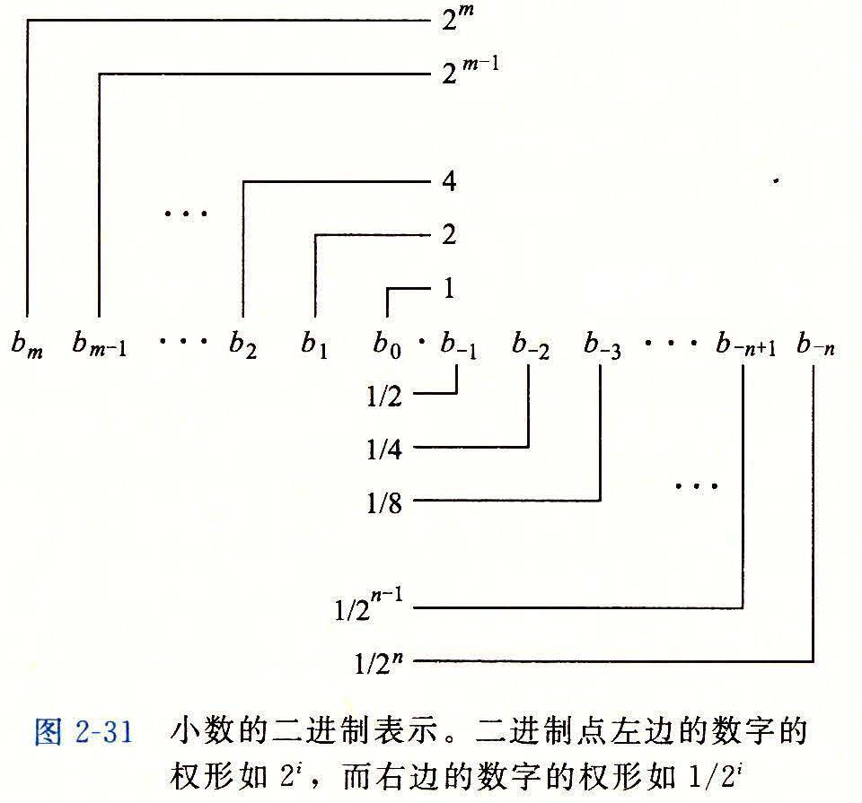

从等式 (2.19) 中可以很容易地看出，二进制小数点向左移动一位相当于这个数被 2 除。例如，101.11<sub>2</sub> 表示数 5 3/4，而 10.111<sub>2</sub> 表示数 2 + 0 + 1/2 + 1/4 + 1/8 = 2 7/8。类似，二进制小数点向右移动一位相当于将该数乘 2。例如 1011.1<sub>2</sub> 表示数 8 + 0 + 2 + 1 + 1/2 = 11 1/2。

注意，形如 0.11...1<sub>2</sub> 的数表示的是刚好小于 1 的数。例如，0.111111<sub>2</sub> 表示 63/64，我们将用简单的表达法 1.0 - ε 来表示这样的数值。

假定我们仅考虑有限长度的编码，那么十进制表示法不能准确地表达像 1/3 和 5/7 这样的数。类似，小数的二进制表示法只能表示那些能够被写成 x × 2<sup>y</sup> 的数。其他的值只能够被近似地表示。例如，数字 1/5 可以用十进制小数 0.20 精确表示。不过，我们并不能把它准确地表示为一个二进制小数；我们只能近似地表示它，增加二进制表示的长度可以提高表示的精度：

| 表示 | 值 | 十进制 |
| --- | --- | --- |
| 0.0<sub>2</sub> | 0/2 | 0.0<sub>10</sub> |
| 0.01<sub>2</sub> | 1/4 | 0.25<sub>10</sub> |
| 0.010<sub>2</sub> | 2/8 | 0.25<sub>10</sub> |
| 0.0011<sub>2</sub> | 3/16 | 0.1875<sub>10</sub> |
| 0.00110<sub>2</sub> | 6/32 | 0.1875<sub>10</sub> |
| 0.001101<sub>2</sub> | 13/64 | 0.203125<sub>10</sub> |
| 0.0011010<sub>2</sub> | 26/128 | 0.203125<sub>10</sub> |
| 0.00110011<sub>2</sub> | 51/256 | 0.19921875<sub>10</sub> |

**练习题 2.45** 填写下表中的缺失的信息：

| 小数值 | 二进制表示 | 十进制表示 |
| --- | --- | --- |
| 1/8 | 0.001 | 0.125 |
| 3/4 |  |  |
| 25/16 |  |  |
|  | 10.1011 |  |
|  | 1.001 |  |
|  |  | 5.875 |
|  |  | 3.1875 |

**练习题 2.46** 浮点运算的不精确性能够产生灾难性的后果。1991 年 2 月 25 日，在第一次海湾战争期间，沙特阿拉伯的达摩地区设置的美国爱国者导弹，拦截伊拉克的飞毛腿导弹失败。飞毛腿导弹击中了美国的一个兵营，造成 28 名士兵死亡。美国总审计局（GAO）对失败原因做了详细的分析 [76]，并且确定底层的原因在于一个数字计算不精确。在这个练习中，你将重现总审计局分析的一部分。

爱国者导弹系统中含有一个内置的时钟，其实现类似一个计数器，每 0.1 秒就加 1。为了以秒为单位来确定时间，程序将用一个 24 位的近似于 1/10 的二进制小数值来乘以这个计数器的值。特别地，1/10 的二进制表达式是一个无穷序列 0.000110011[0011]...<sub>2</sub>，其中，方括号里的部分是无限重复的。程序用值 x 来近似地表示 0.1，x 只考虑这个序列的二进制小数点右边的前 23 位：

x = 0.00011001100110011001100<sub>2</sub>

（参考练习题 2.51，里面有关于如何能够更精确地近似表示 0.1 的讨论。）

A. 0.1 - x 的二进制表示是什么？

B. 0.1 - x 的近似的十进制值是多少？

C. 当系统初始启动时，时钟从 0 开始，并且一直保持计数。在这个例子中，系统已经运行了大约 100 个小时。程序计算出的时间和实际的时间之差为多少？

D. 系统根据一枚来袭导弹的速率和它最后被雷达侦测到的时间，来预测它将在哪里出现。假定飞毛腿的速率大约是 2000 米每秒，对它的预测偏差了多少？

通过一次读取时钟得到的绝对时间中的轻微错误，通常不会影响跟踪的计算。相反，它应该依赖于两次连续的读取之间的相对时间。问题是爱国者导弹的软件已经升级，可以使用更精确的函数来读取时间，但不是所有的函数调用都用新的代码替换了。结果就是，跟踪软件一次读取用的是精确的时间，而另一次读取用的是不精确的时间 [103]。

#### 2.4.2 IEEE 浮点表示

前一节中谈到的定点表示法不能很有效地表示非常大的数字。例如，表达式 5 × 2<sup>100</sup> 是用 101 后面跟随 100 个零的位模式来表示。相反，我们希望通过给定 x 和 y 的值，来表示形如 x × 2<sup>y</sup> 的数。

IEEE 浮点标准用 V = (-1)<sup>s</sup> × M × 2<sup>E</sup> 的形式来表示一个数：

* 符号（sign）s 决定这个数是负数（s = 1）还是正数（s = 0），而对于数值 0 的符号位解释作为特殊情况处理。
* 尾数（significand）M 是一个二进制小数，它的范围是 1~2 - ε，或者是 0~1 - ε。
* 阶码（exponent）E 的作用是对浮点数加权，这个权重是 2 的 E 次幂（可能是负数）。

将浮点数的位表示划分为 3 个字段，分别对这些值进行编码：

* 一个单独的符号位 s 直接编码符号 s。
* k 位的阶码字段 exp = e<sub>k-1</sub>...e<sub>1</sub>e<sub>0</sub> 编码阶码 E。
* n 位小数字段 frac = f<sub>n-1</sub>...f<sub>1</sub>f<sub>0</sub> 编码尾数 M，但是编码出来的值也依赖于阶码字段的值是否等于 0。

图 2-32 给出了将这 3 个字段装进字中两种最常见的格式。在单精度浮点格式（C 语言中的 `float`）中，s、exp 和 frac 字段分别为 1 位、k = 8 位和 n = 23 位，得到一个 32 位的表示。在双精度浮点格式（C 语言中的 `double`）中，s、exp 和 frac 字段分别为 1 位、k = 11 位和 n = 52 位，得到一个 64 位的表示。


给定位表示，根据 exp 的值，被编码的值可以分成 3 种不同的情况（最后一种情况有两个变种）。图 2-33 说明了对单精度格式的情况。


**情况 1：规格化的值**

这是最普遍的情况。当 exp 的位模式既不全为 0（数值 0），也不全为 1（单精度数值为 255，双精度数值为 2047）时，都属于这类情况。在这种情况中，阶码字段被解释为以偏置（biased）形式表示的有符号整数。也就是说，阶码的值是 E = e - Bias，其中 e 是无符号数，其位表示为 e<sub>k-1</sub>...e<sub>1</sub>e<sub>0</sub>，而 Bias 是一个等于 2<sup>k-1</sup> - 1（单精度是 127，双精度是 1023）的偏置值。由此产生指数的取值范围，对于单精度是 -126~+127，而对于双精度是 -1022~+1023。

小数字段 frac 被解释为描述小数值 f，其中 0 ≤ f < 1，其二进制表示为 0.f<sub>n-1</sub>...f<sub>1</sub>f<sub>0</sub>，也就是二进制小数点在最高有效位的左边。尾数定义为 M = 1 + f。有时，这种方式也叫做隐含的以 1 开头的（implied leading 1）表示，因为我们可以把 M 看成一个二进制表达式为 1.f<sub>n-1</sub>f<sub>n-2</sub>...f<sub>0</sub> 的数字。既然我们总是能够调整阶码 E，使得尾数 M 在范围 1 ≤ M < 2 之中（假设没有溢出），那么这种表示方法是一种轻松获得一个额外精度位的技巧。既然第一位总是等于 1，那么我们就不需要显式地表示它。

**情况 2：非规格化的值**

当阶码域为全 0 时，所表示的数是非规格化形式。在这种情况下，阶码值是 E = 1 - Bias，而尾数的值是 M = f，也就是小数字段的值，不包含隐含的开头的 1。

> **旁注：对于非规格化值为什么要这样设置偏置值**
>
> 使阶码值为 1 - Bias 而不是简单的 -Bias 似乎是违反直觉的。我们将很快看到，这种方式提供了一种从非规格化值平滑转换到规格化值的方法。

非规格化数有两个用途。首先，它们提供了一种表示数值 0 的方法，因为使用规格化数，我们必须总是使 M ≥ 1，因此我们就不能表示 0。实际上，+0.0 的浮点表示的位模式为全 0：符号位是 0，阶码字段全为 0（表明是一个非规格化值），而小数域也全为 0，这就得到 M = f = 0。令人奇怪的是，当符号位为 1，而其他域全为 0 时，我们得到值 -0.0。根据 IEEE 的浮点格式，值 +0.0 和 -0.0 在某些方面被认为是不同的，而在其他方面是相同的。

非规格化数的另外一个功能是表示那些非常接近于 0.0 的数。它们提供了一种属性，称为逐渐溢出（gradual underflow），其中，可能的数值分布均匀地接近于 0.0。

**情况 3：特殊值**

最后一类数值是当阶码全为 1 的时候出现的。当小数域全为 0 时，得到的值表示无穷，当 s = 0 时是 +∞，或者当 s = 1 时是 -∞。当我们把两个非常大的数相乘，或者除以零时，无穷能够表示溢出的结果。当小数域为非零时，结果值被称为 NaN，即“不是一个数（Not a Number）”的缩写。一些运算的结果不能是实数或无穷，就会返回这样的 NaN 值，比如当计算 √-1 或 ∞ - ∞ 时。在某些应用中，表示未初始化的数据时，它们也很有用处。

#### 2.4.3 数字示例

图 2-34 展示了一组数值，它们可以用假定的 6 位格式来表示，有 k = 3 的阶码位和 n = 2 的尾数位。偏置量是 2<sup>3-1</sup> - 1 = 3。图中的 a 部分显示了所有可表示的值（除了 NaN）。两个无穷值在两个末端。最大数值的规格化数是 ±14。非规格化数聚集在 0 的附近。图的 b 部分中，我们只展示了介于 -1.0 和 +1.0 之间的数值，这样就能够看得更加清楚。两个零是特殊的非规格化数。可以观察到，那些可表示的数并不是均匀分布的，越靠近原点处它们越稠密。

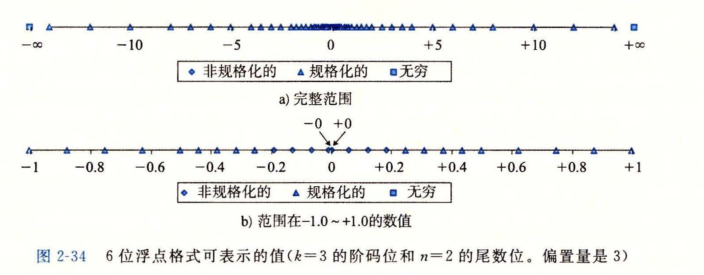

图 2-35 展示了假定的 8 位浮点格式的示例，其中有 k = 4 的阶码位和 n = 3 的小数位。偏置量是 2<sup>4-1</sup> - 1 = 7。图被分成了 3 个区域，来描述 3 类数字。不同的列给出了阶码字段是如何编码阶码 E 的，小数字段是如何编码尾数 M 的，以及它们一起是如何形成要表示的值 V = 2<sup>E</sup> × M 的。

从 0 自身开始，最靠近 0 的是非规格化数。这种格式的非规格化数的 E = 1 - 7 = -6，得到权 2<sup>E</sup> = 1/64。小数 f 的值的范围是 0, 1/8, ..., 7/8，从而得到数 V 的范围是 0 ~ 1/64 × 7/8 = 7/512。

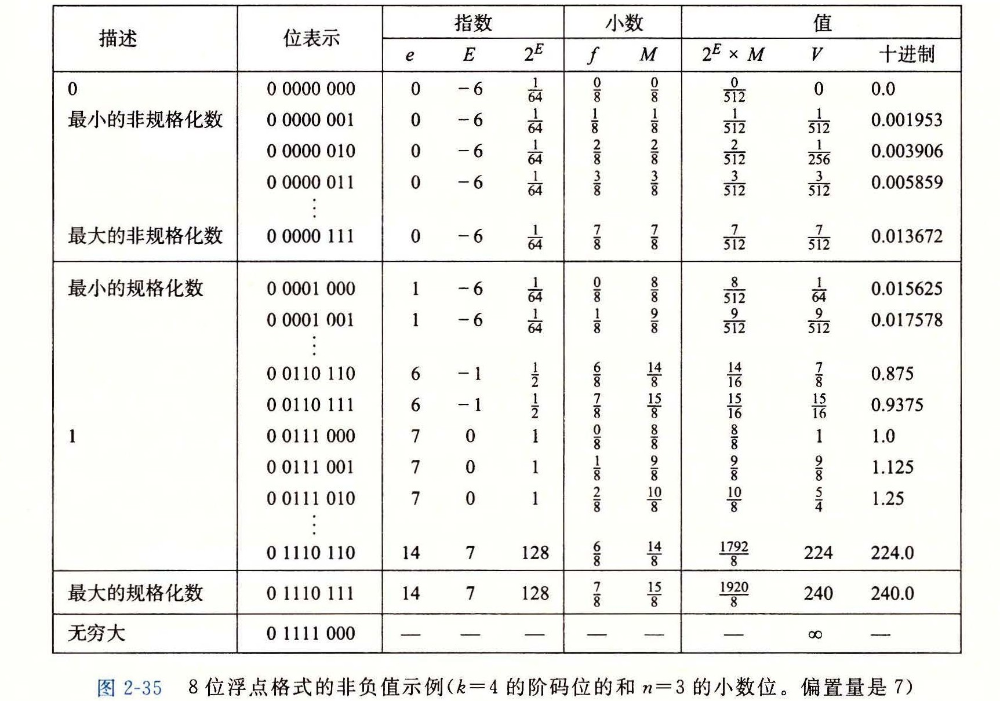

这种形式的最小规格化数同样有 E = 1 - 7 = -6，并且小数取值范围也为 0, 1/8, ..., 7/8。然而，尾数在范围 1 + 0 = 1 和 1 + 7/8 = 15/8 之间，得出数 V 在范围 8/512 = 1/64 和 15/512 之间。可以观察到最大非规格化数和最小规格化数之间的平滑转变。这种平滑性归功于我们对非规格化数的 E 的定义。通过将 E 定义为 1 - Bias，而不是 -Bias，我们可以补偿非规格化数的尾数没有隐含的开头的 1。

当增大阶码时，我们成功地得到更大的规格化值，通过 1.0 后得到最大的规格化数。这个数具有阶码 E = 7，得到一个权 2<sup>E</sup> = 128。小数等于 7/8，得到尾数 M = 15/8。因此，数值是 V = 240。超出这个值就会溢出到 +∞。

这种表示具有一个有趣的属性：假如我们将图 2-35 中的值的位表达式解释为无符号整数，它们就是按升序排列的，就像它们表示的浮点数一样。这不是偶然的，IEEE 格式如此设计就是为了浮点数能够使用整数排序函数来进行排序。当处理负数时，有一个小的难点，因为它们有开头的 1，并且它们是按照降序出现的，但是不需要浮点运算来进行比较也能解决这个问题（参见家庭作业 2.84）。

**练习题 2.47** 假设一个基于 IEEE 浮点格式的 5 位浮点表示，有 1 个符号位、2 个阶码位（k = 2）和两个小数位（n = 2）。阶码偏置量是 2<sup>2-1</sup> - 1 = 1。

下表中列举了这个 5 位浮点表示的全部非负取值范围。使用下面的条件，填写表格中的空白项：

e：假定阶码字段是一个无符号整数所表示的值。

E：偏置之后的阶码值。

2<sup>E</sup>：阶码的权重。

f：小数值。

M：尾数的值。

2<sup>E</sup> × M：该数（未归约的）小数值。

V：该数归约后的小数值。

十进制：该数的十进制表示。

写出 2<sup>E</sup>、f、M、2<sup>E</sup> × M 和 V 的值，要么是整数（如果可能的话），要么是形如 x/y 的小数，这里 y 是 2 的幂。标注为 “-” 的条目不用填。

| 位 | e | E | 2<sup>E</sup> | f | M | 2<sup>E</sup> × M | V | 十进制 |
| --- | --- | --- | --- | --- | --- | --- | --- | --- |
| 0 00 00 |  |  |  |  |  |  |  |  |
| 0 00 01 |  |  |  |  |  |  |  |  |
| 0 00 10 |  |  |  |  |  |  |  |  |
| 0 00 11 |  |  |  |  |  |  |  |  |
| 0 01 00 |  |  |  |  |  |  |  |  |
| 0 01 01 | 1 | 0 | 1 | 1/4 | 5/4 | 5/4 | 5/4 | 1.25 |
| 0 01 10 |  |  |  |  |  |  |  |  |
| 0 01 11 |  |  |  |  |  |  |  |  |
| 0 10 00 |  |  |  |  |  |  |  |  |
| 0 10 01 |  |  |  |  |  |  |  |  |
| 0 10 10 |  |  |  |  |  |  |  |  |
| 0 10 11 |  |  |  |  |  |  |  |  |
| 0 11 00 | - | - | - | - | - | - |  | - |
| 0 11 01 | - | - | - | - | - | - |  | - |
| 0 11 10 | - | - | - | - | - | - |  | - |
| 0 11 11 | - | - | - | - | - | - |  | - |

图 2-36 展示了一些重要的单精度和双精度浮点数的表示和数字值。根据图 2-35 中展示的 8 位格式，我们能够看出有 k 位阶码和 n 位小数的浮点表示的一般属性。

| 描述 | exp | frac | 单精度：值 | 单精度：十进制 | 双精度：值 | 双精度：十进制 |
| --- | --- | --- | --- | --- | --- | --- |
| 0 | 00...00 | 0...00 | 0 | 0.0 | 0 | 0.0 |
| 最小非规格化数 | 00...00 | 0...01 | 2<sup>-23</sup> × 2<sup>-126</sup> | 1.4 × 10<sup>-45</sup> | 2<sup>-52</sup> × 2<sup>-1022</sup> | 4.9 × 10<sup>-324</sup> |
| 最大非规格化数 | 00...00 | 1...11 | (1 - ε) × 2<sup>-126</sup> | 1.2 × 10<sup>-38</sup> | (1 - ε) × 2<sup>-1022</sup> | 2.2 × 10<sup>-308</sup> |
| 最小规格化数 | 00...01 | 0...00 | 1 × 2<sup>-126</sup> | 1.2 × 10<sup>-38</sup> | 1 × 2<sup>-1022</sup> | 2.2 × 10<sup>-308</sup> |
| 1 | 01...11 | 0...00 | 1 × 2<sup>0</sup> | 1.0 | 1 × 2<sup>0</sup> | 1.0 |
| 最大规格化数 | 11...10 | 1...11 | (2 - ε) × 2<sup>127</sup> | 3.4 × 10<sup>38</sup> | (2 - ε) × 2<sup>1023</sup> | 1.8 × 10<sup>308</sup> |

*图 2-36　非负浮点数的示例*

* 值 +0.0 总有一个全为 0 的位表示。
* 最小的正非规格化值的位表示，是由最低有效位为 1 而其他所有位为 0 构成的。它具有小数（和尾数）值 M = f = 2<sup>-n</sup>，阶码值 E = -2<sup>k-1</sup> + 2。因此它的数字值是 V = 2^(-n - 2^(k-1) + 2)。
* 最大的非规格化值的位模式是由全为 0 的阶码字段和全为 1 的小数字段组成的。它有小数（和尾数）值 M = f = 1 - 2<sup>-n</sup>（我们写成 1 - ε），阶码值 E = -2<sup>k-1</sup> + 2。因此，数值 V = (1 - 2<sup>-n</sup>) × 2^(-2^(k-1) + 2)，这仅比最小的规格化值小一点。
* 最小的正规格化值的位模式的阶码字段的最低有效位为 1，其他位全为 0。它的尾数值 M = 1，而阶码值 E = -2<sup>k-1</sup> + 2。因此，数值 V = 2^(-2^(k-1) + 2)。
* 值 1.0 的位表示的阶码字段除了最高有效位等于 1 以外，其他位都等于 0。它的尾数值是 M = 1，而它的阶码值是 E = 0。
* 最大的规格化值的位表示的符号位为 0，阶码的最低有效位等于 0，其他位等于 1。它的小数值 f = 1 - 2<sup>-n</sup>，尾数 M = 2 - 2<sup>-n</sup>（我们写作 2 - ε）。它的阶码值 E = 2<sup>k-1</sup> - 1，得到数值 V = (2 - 2<sup>-n</sup>) × 2^(2^(k-1) - 1) = (1 - 2<sup>-n-1</sup>) × 2^(2^(k-1))。

练习把一些整数值转换成浮点形式对理解浮点表示很有用。例如，在图 2-15 中我们看到 12 345 具有二进制表示 [11000000111001]。通过将二进制小数点左移 13 位，我们创建这个数的一个规格化表示，得到 12345 = 1.1000000111001<sub>2</sub> × 2<sup>13</sup>。为了用 IEEE 单精度形式来编码，我们丢弃开头的 1，并且在末尾增加 10 个 0，来构造小数字段，得到二进制表示 [10000001110010000000000]。为了构造阶码字段，我们用 13 加上偏置值 127，得到 140，其二进制表示为 [10001100]。加上符号位 0，我们就得到二进制的浮点表示 [01000110010000001110010000000000]。

回想一下 2.1.3 节，我们观察到整数值 12 345（0x3039）和单精度浮点值 12345.0（0x4640E400）在位级表示上有下列关系：

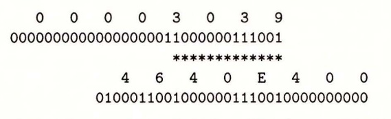

现在我们可以看到，相关的区域对应于整数的低位，刚好在等于 1 的最高有效位之前停止（这个位就是隐含的开头的位 1），和浮点表示的小数部分的高位是相匹配的。

**练习题 2.48** 正如在练习题 2.6 中提到的，整数 3 510 593 的十六进制表示为 0x00359141，而单精度浮点数 3510593.0 的十六进制表示为 0x4A564504。推导出这个浮点表示，并解释整数和浮点数表示的位之间的关系。

**练习题 2.49**

A. 对于一种具有 n 位小数的浮点格式，给出不能准确描述的最小正整数的公式（因为要想准确表示它需要 n + 1 位小数）。假设阶码字段长度 k 足够大，可以表示的阶码范围不会限制这个问题。

B. 对于单精度格式（n = 23），这个整数的数字值是多少？

#### 2.4.4 舍入

因为表示方法限制了浮点数的范围和精度，所以浮点运算只能近似地表示实数运算。因此，对于值 x，我们一般想用一种系统的方法，能够找到“最接近的”匹配值 x'，它可以用期望的浮点形式表示出来。这就是舍入（rounding）运算的任务。一个关键问题是在两个可能值的中间确定舍入方向。例如，如果我有 1.50 美元，想把它舍入到最接近的美元数，应该是 1 美元还是 2 美元呢？

一种可选择的方法是维持实际数字的下界和上界。例如，我们可以确定可表示的值 x<sup>-</sup> 和 x<sup>+</sup>，使得 x 的值位于它们之间：x<sup>-</sup> ≤ x ≤ x<sup>+</sup>。IEEE 浮点格式定义了 4 种不同的舍入方式。默认的方法是找到最接近的匹配，而其他 3 种可用于计算上界和下界。

图 2-37 举例说明了 4 种舍入方式，将一个金额数舍入到最接近的整数美元数。向偶数舍入（round-to-even），也被称为向最接近的值舍入（round-to-nearest），是默认的方式，试图找到一个最接近的匹配值。因此，它将 1.40 美元舍入成 1 美元，而将 1.60 美元舍入成 2 美元，因为它们是最接近的整数美元值。唯一的设计决策是确定两个可能结果中间数值的舍入效果。向偶数舍入方式采用的方法是：它将数字向上或者向下舍入，使得结果的最低有效数字是偶数。因此，这种方法将 1.5 美元和 2.5 美元都舍入成 2 美元。

| 方式 | 1.40 | 1.60 | 1.50 | 2.50 | -1.50 |
| --- | --- | --- | --- | --- | --- |
| 向偶数舍入 | 1 | 2 | 2 | 2 | -2 |
| 向零舍入 | 1 | 1 | 1 | 2 | -1 |
| 向下舍入 | 1 | 1 | 1 | 2 | -2 |
| 向上舍入 | 2 | 2 | 2 | 3 | -1 |

*图 2-37　以美元舍入为例说明舍入方式（第一种方法是舍入到一个最接近的值，而其他三种方法向上或向下限定结果，单位为美元）*

其他 3 种方式产生实际值的确界（guaranteed bound）。这些方法在一些数字应用中是很有用的。向零舍入方式把正数向下舍入，把负数向上舍入，得到值 x̂，使得 |x̂| ≤ |x|。向下舍入方式把正数和负数都向下舍入，得到值 x<sup>-</sup>，使得 x<sup>-</sup> ≤ x。向上舍入方式把正数和负数都向上舍入，得到值 x<sup>+</sup>，满足 x ≤ x<sup>+</sup>。

向偶数舍入初看上去好像是个相当随意的目标，为什么偏向取偶数呢？为什么不始终把位于两个可表示的值中间的值都向上舍入呢？使用这种方法的一个问题就是很容易假想到这样的情景：这种方法舍入一组数值，会在计算这些值的平均数中引入统计偏差。我们采用这种方式舍入得到的一组数的平均值将比这些数本身的平均值略高一些。相反，如果我们总是把两个可表示值中间的数字向下舍入，那么舍入后的一组数的平均值将比这些数本身的平均值略低一些。向偶数舍入在大多数现实情况中避免了这种统计偏差。在 50% 的时间里，它将向上舍入，而在 50% 的时间里，它将向下舍入。

在我们不想舍入到整数时，也可以使用向偶数舍入。我们只是简单地考虑最低有效数字是奇数还是偶数。例如，假设我们想将十进制数舍入到最接近的百分位。不管用哪种舍入方式，我们都将把 1.2349999 舍入到 1.23，而将 1.2350001 舍入到 1.24，因为它们不是在 1.23 和 1.24 的正中间。另一方面，我们将把两个数 1.2350000 和 1.2450000 都舍入到 1.24，因为 4 是偶数。

相似地，向偶数舍入法能够运用在二进制小数上。我们将最低有效位的值 0 认为是偶数，值 1 认为是奇数。一般来说，只有对形如 XX...X.YY...Y100... 的二进制位模式的数，这种舍入方式才有效，其中 X 和 Y 表示任意位值，最右边的 Y 是要被舍入的位置。只有这种位模式表示在两个可能的结果正中间的值。

例如，考虑舍入值到最近的四分之一的问题（也就是二进制小数点右边 2 位）。我们将 10.00011<sub>2</sub>（2 3/32）向下舍入到 10.00<sub>2</sub>（2），10.00110<sub>2</sub>（2 3/16）向上舍入到 10.01<sub>2</sub>（2 1/4），因为这些值不是两个可能值的正中间值。我们将 10.11100<sub>2</sub>（2 7/8）向上舍入成 11.00<sub>2</sub>（3），而 10.10100<sub>2</sub>（2 5/8）向下舍入成 10.10<sub>2</sub>（2 1/2），因为这些值是两个可能值的中间值，并且我们倾向于使最低有效位为零。

**练习题 2.50** 根据舍入到偶数规则，说明如何将下列二进制小数值舍入到最接近的二分之一（二进制小数点右边 1 位）。对每种情况，给出舍入前后的数字值。

A. 10.010<sub>2</sub>

B. 10.011<sub>2</sub>

C. 10.110<sub>2</sub>

D. 11.001<sub>2</sub>

**练习题 2.51** 在练习题 2.46 中我们看到，爱国者导弹软件将 0.1 近似表示为 x = 0.00011001100110011001100<sub>2</sub>。假设使用 IEEE 舍入到偶数方式来确定 0.1 的二进制小数点右边 23 位的近似表示 x'。

A. x' 的二进制表示是什么？

B. x' - 0.1 的十进制表示的近似值是什么？

C. 运行 100 小时后，计算时钟值会有多少偏差？

D. 该程序对飞毛腿导弹位置的预测会有多少偏差？

**练习题 2.52** 考虑下列基于 IEEE 浮点格式的 7 位浮点表示。两个格式都没有符号位，它们只能表示非负的数字。

1. 格式 A：有 k = 3 个阶码位。阶码的偏置值是 3。有 n = 4 个小数位。

2. 格式 B：有 k = 4 个阶码位。阶码的偏置值是 7。有 n = 3 个小数位。

下面给出了一些格式 A 表示的位模式，你的任务是将它们转换成格式 B 中最接近的值。如果需要，请使用舍入到偶数的舍入原则。另外，给出由格式 A 和格式 B 表示的位模式对应的数字的值。给出整数（例如 17）或者小数（例如 17/64）。

| 格式 A 位 | 格式 A 值 | 格式 B 位 | 格式 B 值 |
| --- | --- | --- | --- |
| 011 0000 | 1 | 0111 000 | 1 |
| 101 1110 |  |  |  |
| 010 1001 |  |  |  |
| 110 1111 |  |  |  |
| 000 0001 |  |  |  |

#### 2.4.5 浮点运算

IEEE 标准指定了一个简单的规则，来确定诸如加法和乘法这样的算术运算的结果。把浮点值 x 和 y 看成实数，而某个运算 ◦ 定义在实数上，计算将产生 Round(x ◦ y)，这是对实际运算的精确结果进行舍入后的结果。在实际中，浮点单元的设计者使用一些聪明的小技巧来避免执行这种精确的计算，因为计算只要精确到能够保证得到一个正确的舍入结果就可以了。当参数中有一个是特殊值（如 -0、-∞ 或 NaN）时，IEEE 标准定义了一些使之更合理的规则。例如，定义 1/-0 将产生 -∞，而定义 1/+0 会产生 +∞。

IEEE 标准中指定浮点运算行为方法的一个优势在于，它可以独立于任何具体的硬件或者软件实现。因此，我们可以检查它的抽象数学属性，而不必考虑它实际上是如何实现的。

前面我们看到了整数（包括无符号和补码）加法形成了阿贝尔群。实数上的加法也形成了阿贝尔群，但是我们必须考虑舍入对这些属性的影响。我们将 x +<sup>f</sup> y 定义为 Round(x + y)。这个运算的定义针对 x 和 y 的所有取值，但是虽然 x 和 y 都是实数，由于溢出，该运算可能得到无穷值。对于所有 x 和 y 的值，这个运算是可交换的，也就是说 x +<sup>f</sup> y = y +<sup>f</sup> x。另一方面，这个运算是不可结合的。例如，使用单精度浮点，表达式 (3.14 + 1e10) - 1e10 求值得到 0.0，因为舍入，值 3.14 会丢失。另一方面，表达式 3.14 + (1e10 - 1e10) 得出值 3.14。作为阿贝尔群，大多数值在浮点加法下都有逆元，也就是说 x +<sup>f</sup> -x = 0。无穷（因为 +∞ - ∞ = NaN）和 NaN 是例外情况，因为对于任何 x，都有 NaN +<sup>f</sup> x = NaN。

浮点加法不具有结合性，这是缺少的最重要的群属性。对于科学计算程序员和编译器编写者来说，这具有重要的含义。例如，假设一个编译器给定了如下代码片段：

```text
x = a + b + c;
y = b + c + d;
```

编译器可能试图通过产生下列代码来省去一个浮点加法：

```text
t = b + c;
x = a + t;
y = t + d;
```

然而，对于 x 来说，这个计算可能会产生与原始值不同的值，因为它使用了加法运算的不同的结合方式。在大多数应用中，这种差异小得无关紧要。不幸的是，编译器无法知道在效率和忠实于原始程序的确切行为之间，使用者愿意做出什么样的选择。结果是，编译器倾向于保守，避免任何对功能产生影响的优化，即使是很轻微的影响。

另一方面，浮点加法满足了单调性属性：如果 a ≥ b，那么对于任何 a、b 以及 x 的值，除了 NaN，都有 x + a ≥ x + b。无符号或补码加法不具有这个实数（和整数）加法的属性。

浮点乘法也遵循通常乘法所具有的许多属性。我们定义 x *<sup>f</sup> y 为 Round(x × y)。这个运算在乘法中是封闭的（虽然可能产生无穷大或 NaN），它是可交换的，而且它的乘法单位元为 1.0。另一方面，由于可能发生溢出，或者由于舍入而失去精度，它不具有可结合性。例如，单精度浮点情况下，表达式 (1e20 * 1e20) * 1e-20 求值为 +∞，而 1e20 * (1e20 * 1e-20) 将得出 1e20。另外，浮点乘法在加法上不具备分配性。例如，单精度浮点情况下，表达式 1e20 * (1e20 - 1e20) 求值为 0.0，而 1e20 * 1e20 - 1e20 * 1e20 会得出 NaN。

另一方面，对于任何 a、b 和 c，并且 a、b 和 c 都不等于 NaN，浮点乘法满足下列单调性：

a ≥ b 且 c ≥ 0 ⇒ a *<sup>f</sup> c ≥ b *<sup>f</sup> c

a ≥ b 且 c ≤ 0 ⇒ a *<sup>f</sup> c ≤ b *<sup>f</sup> c

此外，我们还可以保证，只要 a ≠ NaN，就有 a *<sup>f</sup> a ≥ 0。像我们先前所看到的，无符号或补码的乘法没有这些单调性属性。

对于科学计算程序员和编译器编写者来说，缺乏结合性和分配性是很严重的问题。即使为了在三维空间中确定两条线是否交叉而写代码这样看上去很简单的任务，也可能成为一个很大的挑战。

#### 2.4.6 C 语言中的浮点数

所有的 C 语言版本提供了两种不同的浮点数据类型：`float` 和 `double`。在支持 IEEE 浮点格式的机器上，这些数据类型就对应于单精度和双精度浮点。另外，这类机器使用向偶数舍入的舍入方式。不幸的是，因为 C 语言标准不要求机器使用 IEEE 浮点，所以没有标准的方法来改变舍入方式或者得到诸如 -0、+∞、-∞ 或者 NaN 之类的特殊值。大多数系统提供 include（`.h`）文件和读取这些特征的过程库，但是细节随系统不同而不同。例如，当程序文件中出现下列句子时，GNU 编译器 GCC 会定义程序常数 `INFINITY`（表示 +∞）和 `NAN`（表示 NaN）：

```c
#define _GNU_SOURCE 1
#include <math.h>
```

**练习题 2.53** 完成下列宏定义，生成双精度值 +∞、-∞ 和 -0：

```c
#define POS_INFINITY
#define NEG_INFINITY
#define NEG_ZERO
```

不能使用任何 include 文件（例如 `math.h`），但你能利用这样一个事实：双精度能够表示的最大的有限数，大约是 1.8 × 10<sup>308</sup>。

当在 `int`、`float` 和 `double` 格式之间进行强制类型转换时，程序改变数值和位模式的原则如下（假设 `int` 是 32 位的）：

* 从 `int` 转换成 `float`，数字不会溢出，但是可能被舍入。
* 从 `int` 或 `float` 转换成 `double`，因为 `double` 有更大的范围（也就是可表示值的范围），也有更高的精度（也就是有效位数），所以能够保留精确的数值。
* 从 `double` 转换成 `float`，因为范围要小一些，所以值可能溢出成 +∞ 或 -∞。另外，由于精确度较小，它还可能被舍入。
* 从 `float` 或者 `double` 转换成 `int`，值将会向零舍入。例如，1.999 将被转换成 1，而 -1.999 将被转换成 -1。进一步来说，值可能会溢出。C 语言标准没有对这种情况指定固定的结果。

与 Intel 兼容的微处理器指定位模式 [10...00]（字长为 w 时的 TMin<sub>w</sub>）为整数不确定（integer indefinite）值。一个从浮点数到整数的转换，如果不能为该浮点数找到一个合理的整数近似值，就会产生这样一个值。因此，表达式 `(int)+1e10` 会得到 -2147483648，即从一个正值变成了一个负值。

> **旁注：Ariane 5——浮点溢出的高昂代价**
>
> 将大的浮点数转换成整数是一种常见的程序错误来源。1996 年 6 月 4 日，Ariane 5 火箭初次航行，一个错误便产生了灾难性的后果。发射后仅仅 37 秒钟，火箭偏离了它的飞行路径，解体并且爆炸。火箭上载有价值 5 亿美元的通信卫星。
>
> 后来的调查 [73, 33] 显示，控制惯性导航系统的计算机向控制引擎喷嘴的计算机发送了一个无效数据。它没有发送飞行控制信息，而是送出了一个诊断位模式，表明在将一个 64 位浮点数转换成 16 位有符号整数时，产生了溢出。
>
> 溢出的值测量的是火箭的水平速率，这比早先的 Ariane 4 火箭所能达到的速度高出了 5 倍。在设计 Ariane 4 火箭软件时，他们小心地分析了这些数字值，并且确定水平速率决不会超出一个 16 位数的表示范围。不幸的是，他们在 Ariane 5 火箭的系统中简单地重用了这一部分，而没有检查它所基于的假设。

**练习题 2.54** 假定变量 x、f 和 d 的类型分别是 `int`、`float` 和 `double`。除了 f 和 d 都不能等于 +∞、-∞ 或者 NaN，它们的值是任意的。对于下面每个 C 表达式，证明它总是为真（也就是求值为 1），或者给出一个使表达式不为真的值（也就是求值为 0）。

A. `x == (int)(double) x`

B. `x == (int)(float) x`

C. `d == (double)(float) d`

D. `f == (float)(double) f`

E. `f == -(-f)`

F. `1.0/2 == 1/2.0`

G. `d*d >= 0.0`

H. `(f+d)-f == d`

### 2.5 小结

计算机将信息编码为位（比特），通常组织成字节序列。有不同的编码方式用来表示整数、实数和字符串。不同的计算机模型在编码数字和多字节数据中的字节顺序时使用不同的约定。

C 语言的设计可以包容多种不同字长和数字编码的实现。64 位字长的机器逐渐普及，并正在取代统治市场长达 30 多年的 32 位机器。由于 64 位机器也可以运行为 32 位机器编译的程序，我们的重点就放在区分 32 位和 64 位程序，而不是机器本身。64 位程序的优势是可以突破 32 位程序具有的 4GB 地址限制。

大多数机器对整数使用补码编码，而对浮点数使用 IEEE 标准 754 编码。在位级上理解这些编码，并且理解算术运算的数学特性，对于想使编写的程序能在全部数值范围上正确运算的程序员来说，是很重要的。

在相同长度的无符号和有符号整数之间进行强制类型转换时，大多数 C 语言实现遵循的原则是底层的位模式不变。在补码机器上，对于一个 w 位的值，这种行为是由函数 T2U<sub>w</sub> 和 U2T<sub>w</sub> 来描述的。C 语言隐式的强制类型转换会出现许多程序员无法预计的结果，常常导致程序错误。

由于编码的长度有限，与传统整数和实数运算相比，计算机运算具有非常不同的属性。当超出表示范围时，有限长度能够引起数值溢出。当浮点数非常接近于 0.0，从而转换成零时，也会下溢。

和大多数其他程序语言一样，C 语言实现的有限整数运算和真实的整数运算相比，有一些特殊的属性。例如，由于溢出，表达式 `x*x` 能够得出负数。但是，无符号数和补码的运算都满足整数运算的许多其他属性，包括结合律、交换律和分配律。这就允许编译器做很多的优化。例如，用 `(x<<3)-x` 取代表达式 `7*x` 时，我们就利用了结合律、交换律和分配律的属性，还利用了移位和乘以 2 的幂之间的关系。

我们已经看到了几种使用位级运算和算术运算组合的聪明方法。例如，使用补码运算，`~x+1` 等价于 `-x`。另外一个例子，假设我们想要一个形如 [0, ..., 0, 1, ..., 1] 的位模式，由 w-k 个 0 后面紧跟着 k 个 1 组成。这些位模式有助于掩码运算。这种模式能够通过 C 表达式 `(1<<k)-1` 生成，利用的是这样一个属性，即我们想要的位模式的数值为 2<sup>k</sup>-1。例如，表达式 `(1<<8)-1` 将产生位模式 `0xFF`。

浮点表示通过将数字编码为 x × 2<sup>y</sup> 的形式来近似地表示实数。最常见的浮点表示方式是由 IEEE 标准 754 定义的。它提供了几种不同的精度，最常见的是单精度（32 位）和双精度（64 位）。IEEE 浮点也能够表示特殊值 +∞、-∞ 和 NaN。

必须非常小心地使用浮点运算，因为浮点运算只有有限的范围和精度，而且并不遵守普遍的算术属性，比如结合性。

#### 参考文献说明

关于 C 语言的参考书 [45, 61] 讨论了不同的数据类型和运算的属性。（这两本书中，只有 Steele 和 Harbison 的书 [45] 涵盖了 ISO C99 中的新特性。目前还没有看到任何涉及 ISO C11 新特性的书籍。）对于精确的字长或者数字编码，C 语言标准没有详细的定义。这些细节是故意省去的，这样可以在更大范围的不同机器上实现 C 语言。已经有几本书 [59, 74] 给了 C 语言程序员一些建议，警告他们关于溢出、隐式强制类型转换到无符号数，以及其他一些已经在这一章中谈及的陷阱。这些书还提供了对变量命名、编码风格和代码测试的有益建议。Seacord 的书 [97] 是关于 C 和 C++ 程序中的安全问题的，本书结合了 C 程序的有关信息，介绍了如何编译和执行程序，以及漏洞是如何造成的。关于 Java 的书（我们推荐 Java 语言的创始人 James Gosling 参与编写的一本书 [5]）描述了 Java 支持的数据格式和算术运算。

关于逻辑设计的书 [58, 116] 都有关于编码和算术运算的章节，描述了实现算术电路的不同方式。Overton 的关于 IEEE 浮点数的书 [82]，从数字应用程序员的角度，详细描述了格式和属性。

## 第 2 章家庭作业：2.55～2.60

**家庭作业 2.55**（★）在你能够访问的不同机器上，使用 `show_bytes`（文件 `show-bytes.c`）编译并运行示例代码。确定这些机器使用的字节顺序。

**家庭作业 2.56**（★）试着用不同的示例值来运行 `show_bytes` 的代码。

**家庭作业 2.57**（★）编写程序 `show_short`、`show_long` 和 `show_double`，它们分别打印类型为 `short`、`long` 和 `double` 的 C 语言对象的字节表示。请试着在几种机器上运行。

**家庭作业 2.58**（★★）编写过程 `is_little_endian`，当在小端法机器上编译和运行时返回 1，在大端法机器上编译运行时则返回 0。这个程序应该可以运行在任何机器上，无论机器的字长是多少。

**家庭作业 2.59**（★★）编写一个 C 表达式，它生成一个字，由 `x` 的最低有效字节和 `y` 中剩下的字节组成。对于运算数 `x = 0x89ABCDEF` 和 `y = 0x76543210`，就得到 `0x765432EF`。

**家庭作业 2.60**（★★）假设我们将一个 w 位的字中的字节从 0（最低位）到 w/8-1（最高位）编号。写出下面 C 函数的代码，它会返回一个无符号值，其中参数 `x` 的字节 `i` 被替换成字节 `b`：

```c
unsigned replace_byte(unsigned x, int i, unsigned char b);
```

以下示例，说明了这个函数该如何工作：

```text
replace_byte(0x12345678, 2, 0xAB) --> 0x12AB5678
replace_byte(0x12345678, 0, 0xAB) --> 0x123456AB
```

## 第 2 章家庭作业：2.61～2.81

### 位级整数编码规则

在接下来的作业中，我们特意限制了你能使用的编程结构，来帮你更好地理解 C 语言的位级、逻辑和算术运算。在回答这些问题时，你的代码必须遵守以下规则：

**假设**

* 整数用补码形式表示。
* 有符号数的右移是算术右移。
* 数据类型 `int` 是 w 位长的。对于某些题目，会给定 w 的值，但是在其他情况下，只要 w 是 8 的整数倍，你的代码就应该能工作。你可以用表达式 `sizeof(int)<<3` 来计算 w。

**禁止使用**

* 条件语句（`if` 或者 `?:`）、循环、分支语句、函数调用和宏调用。
* 除法、模运算和乘法。
* 相对比较运算（`<`、`>`、`<=` 和 `>=`）。

**允许的运算**

* 所有的位级和逻辑运算。
* 左移和右移，但是位移量只能在 0 和 w-1 之间。
* 加法和减法。
* 相等（`==`）和不相等（`!=`）测试。（在有些题目中，也不允许这些运算。）
* 整型常数 `INT_MIN` 和 `INT_MAX`。
* 对 `int` 和 `unsigned` 进行强制类型转换，无论是显式的还是隐式的。

即使有这些条件的限制，你仍然可以选择带有描述性的变量名，并且使用注释来描述你的解决方案的逻辑，尽量提高代码的可读性。例如，下面这段代码从整数参数 `x` 中抽取出最高有效字节：

```c
/* Get most significant byte from x */
int get_msb(int x) {
    /* Shift by w-8 */
    int shift_val = (sizeof(int)-1)<<3;
    /* Arithmetic shift */
    int xright = x >> shift_val;
    /* Zero all but LSB */
    return xright & 0xFF;
}
```

**家庭作业 2.61**（★★）写一个 C 表达式，在下列描述的条件下产生 1，而在其他情况下得到 0。假设 `x` 是 `int` 类型。

A. `x` 的任何位都等于 1。

B. `x` 的任何位都等于 0。

C. `x` 的最低有效字节中的位都等于 1。

D. `x` 的最高有效字节中的位都等于 0。

代码应该遵循位级整数编码规则，另外还有一个限制，你不能使用相等（`==`）和不相等（`!=`）测试。

**家庭作业 2.62**（★★★）编写一个函数 `int_shifts_are_arithmetic()`，在对 `int` 类型的数使用算术右移的机器上运行时这个函数生成 1，而其他情况下生成 0。你的代码应该可以运行在任何字长的机器上。在几种机器上测试你的代码。

**家庭作业 2.63**（★★★）将下面的 C 函数代码补充完整。函数 `srl` 用算术右移（由值 `xsra` 给出）来完成逻辑右移，后面的其他操作不包括右移或者除法。函数 `sra` 用逻辑右移（由值 `xsrl` 给出）来完成算术右移，后面的其他操作不包括右移或者除法。可以通过计算 `8*sizeof(int)` 来确定数据类型 `int` 中的位数 w。位移量 k 的取值范围为 0～w-1。

```c
unsigned srl(unsigned x, int k) {
    /* Perform shift arithmetically */
    unsigned xsra = (int) x >> k;

    /* ... */
}

int sra(int x, int k) {
    /* Perform shift logically */
    int xsrl = (unsigned) x >> k;

    /* ... */
}
```

**家庭作业 2.64**（★）写出代码实现如下函数：

```c
/* Return 1 when any odd bit of x equals 1; 0 otherwise.
   Assume w=32 */
int any_odd_one(unsigned x);
```

函数应该遵循位级整数编码规则，不过你可以假设数据类型 `int` 有 w=32 位。

**家庭作业 2.65**（★★★）写出代码实现如下函数：

```c
/* Return 1 when x contains an odd number of 1s; 0 otherwise.
   Assume w=32 */
int odd_ones(unsigned x);
```

函数应该遵循位级整数编码规则，不过你可以假设数据类型 `int` 有 w=32 位。

你的代码最多只能包含 12 个算术运算、位运算和逻辑运算。

**家庭作业 2.66**（★★★）写出代码实现如下函数：

```c
/*
 * Generate mask indicating leftmost 1 in x. Assume w=32.
 * For example, 0xFF00 -> 0x8000, and 0x6600 --> 0x4000.
 * If x = 0, then return 0.
 */
int leftmost_one(unsigned x);
```

函数应该遵循位级整数编码规则，不过你可以假设数据类型 `int` 有 w=32 位。

你的代码最多只能包含 15 个算术运算、位运算和逻辑运算。

**提示：** 先将 `x` 转换成形如 [0...011...1] 的位向量。

**家庭作业 2.67**（★★）给你一个任务，编写一个过程 `int_size_is_32()`，当在一个 `int` 是 32 位的机器上运行时，该程序产生 1，而其他情况则产生 0。不允许使用 `sizeof` 运算符。下面是开始时的尝试：

```c
/* The following code does not run properly on some machines */
int bad_int_size_is_32() {
    /* Set most significant bit (msb) of 32-bit machine */
    int set_msb = 1 << 31;
    /* Shift past msb of 32-bit word */
    int beyond_msb = 1 << 32;

    /* set_msb is nonzero when word size >= 32
       beyond_msb is zero when word size <= 32 */
    return set_msb && !beyond_msb;
}
```

当在 SUN SPARC 这样的 32 位机器上编译并运行时，这个过程返回的却是 0。下面的编译器信息给了我们一个问题的指示：

```text
warning: left shift count >= width of type
```

A. 我们的代码在哪个方面没有遵守 C 语言标准？

B. 修改代码，使得它在 `int` 至少为 32 位的任何机器上都能正确地运行。

C. 修改代码，使得它在 `int` 至少为 16 位的任何机器上都能正确地运行。

**家庭作业 2.68**（★★）写出具有如下原型的函数的代码：

```c
/*
 * Mask with least significant n bits set to 1
 * Examples: n = 6 --> 0x3F, n = 17 --> 0x1FFFF
 * Assume 1 <= n <= w
 */
int lower_one_mask(int n);
```

函数应该遵循位级整数编码规则。要注意 n=w 的情况。

**家庭作业 2.69**（★★★）写出具有如下原型的函数的代码：

```c
/*
 * Do rotating left shift. Assume 0 <= n < w
 * Examples when x = 0x12345678 and w = 32:
 *   n=4  -> 0x23456781
 *   n=20 -> 0x67812345
 */
unsigned rotate_left(unsigned x, int n);
```

函数应该遵循位级整数编码规则。要注意 n=0 的情况。

**家庭作业 2.70**（★★）写出具有如下原型的函数的代码：

```c
/*
 * Return 1 when x can be represented as an n-bit, 2's-complement
 * number; 0 otherwise
 * Assume 1 <= n <= w
 */
int fits_bits(int x, int n);
```

函数应该遵循位级整数编码规则。

**家庭作业 2.71**（★）你刚刚开始在一家公司工作，他们要实现一组过程来操作一个数据结构，要将 4 个有符号字节封装成一个 32 位 `unsigned`。一个字中的字节从 0（最低有效字节）编号到 3（最高有效字节）。分配给你的任务是：为一个使用补码运算和算术右移的机器编写一个具有如下原型的函数：

```c
/* Declaration of data type where 4 bytes are packed
   into an unsigned */
typedef unsigned packed_t;

/* Extract byte from word. Return as signed integer */
int xbyte(packed_t word, int bytenum);
```

也就是说，函数会抽取出指定的字节，再把它符号扩展为一个 32 位 `int`。

你的前任（因为水平不够高而被解雇了）编写了下面的代码：

```c
/* Failed attempt at xbyte */
int xbyte(packed_t word, int bytenum)
{
    return (word >> (bytenum << 3)) & 0xFF;
}
```

A. 这段代码错在哪里？

B. 给出函数的正确实现，只能使用左右移位和一个减法。

**家庭作业 2.72**（★★）给你一个任务，写一个函数，将整数 `val` 复制到缓冲区 `buf` 中，但是只有当缓冲区中有足够可用的空间时，才执行复制。

你写的代码如下：

```c
/* Copy integer into buffer if space is available */
/* WARNING: The following code is buggy */
void copy_int(int val, void *buf, int maxbytes) {
    if (maxbytes-sizeof(val) >= 0)
        memcpy(buf, (void *) &val, sizeof(val));
}
```

这段代码使用了库函数 `memcpy`。虽然在这里用这个函数有点刻意，因为我们只是想复制一个 `int`，但是它说明了一种复制较大数据结构的常见方法。

你仔细地测试了这段代码后发现，哪怕 `maxbytes` 很小的时候，它也能把值复制到缓冲区中。

A. 解释为什么代码中的条件测试总是成功。提示：`sizeof` 运算符返回类型为 `size_t` 的值。

B. 你该如何重写这个条件测试，使之工作正确。

**家庭作业 2.73**（★★）写出具有如下原型的函数的代码：

```c
/* Addition that saturates to TMin or TMax */
int saturating_add(int x, int y);
```

同正常的补码加法溢出的方式不同，当正溢出时，饱和加法返回 TMax，负溢出时，返回 TMin。饱和运算常常用在执行数字信号处理的程序中。

你的函数应该遵循位级整数编码规则。

**家庭作业 2.74**（★★）写出具有如下原型的函数的代码：

```c
/* Determine whether arguments can be subtracted without overflow */
int tsub_ok(int x, int y);
```

如果计算 `x-y` 不溢出，这个函数就返回 1。

**家庭作业 2.75**（★★★）假设我们想要计算 x · y 的完整的 2w 位表示，其中，x 和 y 都是无符号数，并且运行在数据类型 `unsigned` 是 w 位的机器上。乘积的低 w 位能够用表达式 `x*y` 计算，所以，我们只需要一个具有下列原型的函数：

```c
unsigned unsigned_high_prod(unsigned x, unsigned y);
```

这个函数计算无符号变量 x · y 的高 w 位。

我们使用一个具有下面原型的库函数：

```c
int signed_high_prod(int x, int y);
```

它计算在 x 和 y 采用补码形式的情况下，x · y 的高 w 位。编写代码调用这个过程，以实现用无符号数为参数的函数。验证你的解答的正确性。

**提示：** 看看等式（2.18）的推导中，有符号乘积 x · y 和无符号乘积 x′ · y′ 之间的关系。

**家庭作业 2.76**（★）库函数 `calloc` 有如下声明：

```c
void *calloc(size_t nmemb, size_t size);
```

根据库文档：“函数 `calloc` 为一个数组分配内存，该数组有 `nmemb` 个元素，每个元素为 `size` 字节。内存设置为 0。如果 `nmemb` 或 `size` 为 0，则 `calloc` 返回 `NULL`。”

编写 `calloc` 的实现，通过调用 `malloc` 执行分配，调用 `memset` 将内存设置为 0。你的代码应该没有任何由算术溢出引起的漏洞，且无论数据类型 `size_t` 用多少位表示，代码都应该正常工作。

作为参考，函数 `malloc` 和 `memset` 声明如下：

```c
void *malloc(size_t size);
void *memset(void *s, int c, size_t n);
```

**家庭作业 2.77**（★★）假设我们有一个任务：生成一段代码，将整数变量 `x` 乘以不同的常数因子 K。为了提高效率，我们想只使用 `+`、`-` 和 `<<` 运算。对于下列 K 的值，写出执行乘法运算的 C 表达式，每个表达式中最多使用 3 个运算。

A. K=17

B. K=-7

C. K=60

D. K=-112

**家庭作业 2.78**（★★）写出具有如下原型的函数的代码：

```c
/* Divide by power of 2. Assume 0 <= k < w-1 */
int divide_power2(int x, int k);
```

该函数要用正确的舍入方式计算 x/2<sup>k</sup>，并且应该遵循位级整数编码规则。

**家庭作业 2.79**（★★）写出函数 `mul3div4` 的代码，对于整数参数 `x`，计算 `3*x/4`，但是要遵循位级整数编码规则。你的代码计算 `3*x` 也会产生溢出。

**家庭作业 2.80**（★★★）写出函数 `threefourths` 的代码，对于整数参数 `x`，计算 3/4 x 的值，向零舍入。它不会溢出。函数应该遵循位级整数编码规则。

**家庭作业 2.81**（★★）编写 C 表达式产生如下位模式，其中 a<sup>k</sup> 表示符号 a 重复 k 次。假设一个 w 位的数据类型。代码可以包含对参数 `j` 和 `k` 的引用，它们分别表示 j 和 k 的值，但是不能使用表示 w 的参数。

A. 1<sup>w-k</sup>0<sup>k</sup>

B. 0<sup>w-k-j</sup>1<sup>k</sup>0<sup>j</sup>

## 第 2 章家庭作业：2.82～2.91

**家庭作业 2.82**（★）我们在一个 `int` 类型值为 32 位的机器上运行程序。这些值以补码形式表示，而且它们都是算术右移的。`unsigned` 类型的值也是 32 位的。

我们产生随机数 `x` 和 `y`，并且把它们转换成无符号数，显示如下：

```c
/* Create some arbitrary values */
int x = random();
int y = random();

/* Convert to unsigned */
unsigned ux = (unsigned) x;
unsigned uy = (unsigned) y;
```

对于下列每个 C 表达式，你要指出表达式是否总是为 1。如果它总是为 1，那么请描述其中的数学原理。否则，列举出一个使它为 0 的参数示例。

A. `(x<y) == (-x>-y)`

B. `((x+y)<<4)+y-x == 17*y+15*x`

C. `~x+~y+1 == ~(x+y)`

D. `(ux-uy) == -(unsigned)(y-x)`

E. `((x>>2)<<2) <= x`

**家庭作业 2.83**（★★）一些数字的二进制表示是由形如 0.yyyyyy... 的无穷串组成的，其中 y 是一个 k 位的序列。例如，1/3 的二进制表示是 0.01010101...（y=01），而 1/5 的二进制表示是 0.001100110011...（y=0011）。

A. 设 Y = B2U<sub>k</sub>(y)，也就是说，这个数具有二进制表示 y。给出一个由 Y 和 k 组成的公式表示这个无穷串的值。

**提示：** 请考虑将二进制小数点右移 k 位的结果。

B. 对于下列的 y 值，串的数值是多少？

(a) 101

(b) 0110

(c) 010011

**家庭作业 2.84**（★）填写下列程序的返回值，这个程序测试它的第一个参数是否小于或者等于第二个参数。假定函数 `f2u` 返回一个无符号 32 位数字，其位表示与它的浮点参数相同。你可以假设两个参数都不是 NaN。两种 0，+0 和 -0 被认为是相等的。

```c
int float_le(float x, float y) {
    unsigned ux = f2u(x);
    unsigned uy = f2u(y);

    /* Get the sign bits */
    unsigned sx = ux >> 31;
    unsigned sy = uy >> 31;

    /* Give an expression using only ux, uy, sx, and sy */
    return ____________________________________________;
}
```

**家庭作业 2.85**（★）给定一个浮点格式，有 k 位指数和 n 位小数，对于下列数，写出阶码 E、尾数 M、小数 f 和值 V 的公式。另外，请描述其位表示。

A. 数 7.0。

B. 能够被准确描述的最大奇整数。

C. 最小的规格化数的倒数。

**家庭作业 2.86**（★）与 Intel 兼容的处理器也支持“扩展精度”浮点格式，这种格式具有 80 位字长，被分成 1 个符号位、k=15 个阶码位、1 个单独的整数位和 n=63 个小数位。整数位是 IEEE 浮点表示中隐含位的显式副本。也就是说，对于规格化的值它等于 1，对于非规格化的值它等于 0。填写下表，给出用这种格式表示的一些“有趣的”数字的近似值。

| 描述 | 扩展精度：值 | 扩展精度：十进制 |
| --- | --- | --- |
| 最小的正非规格化数 |  |  |
| 最小的正规格化数 |  |  |
| 最大的规格化数 |  |  |

将数据类型声明为 `long double`，就可以把这种格式用于为与 Intel 兼容的机器编译 C 程序。但是，它会强制编译器以传统的 8087 浮点指令为基础生成代码。由此产生的程序很可能会比数据类型为 `float` 或 `double` 的情况慢上许多。

**家庭作业 2.87**（★）2008 版 IEEE 浮点标准，即 IEEE 754-2008，包含了一种 16 位的“半精度”浮点格式。它最初是由计算机图形公司设计的，其存储的数据所需的动态范围要高于 16 位整数可获得的范围。这种格式具有 1 个符号位、5 个阶码位（k=5）和 10 个小数位（n=10）。阶码偏置量是 2<sup>5-1</sup>-1=15。

对于每个给定的数，填写下表，其中，每一列具有如下指示说明：

**Hex：** 描述编码形式的 4 个十六进制数字。

**M：** 尾数的值。这应该是一个形如 x 或 x/y 的数，其中 x 是一个整数，而 y 是 2 的整数幂。例如：0、67/64 和 1/256。

**E：** 阶码的整数值。

**V：** 所表示的数字值。使用 x 或者 x × 2<sup>z</sup> 表示，其中 x 和 z 都是整数。

**D：** （可能近似的）数值，用 `printf` 的格式规范 `%f` 打印。

举一个例子，为了表示数 7/8，我们有 s=0、M=7/4 和 E=-1。因此这个数的阶码字段为 01110<sub>2</sub>（十进制值 15-1=14），尾数字段为 1100000000<sub>2</sub>，得到一个十六进制的表示 3B00。其数值为 0.875。

标记为“—”的条目不用填写。

| 描述 | Hex | M | E | V | D |
| --- | --- | --- | --- | --- | --- |
| -0 |  |  |  | -0 | -0.0 |
| 最小的 > 2 的值 |  |  |  |  |  |
| 512 |  |  |  | 512 | 512.0 |
| 最大的非规格化数 |  |  |  |  |  |
| -∞ |  | — | — | -∞ | -∞ |
| 十六进制表示为 3BB0 的数 | 3BB0 |  |  |  |  |

**家庭作业 2.88**（★★）考虑下面两个基于 IEEE 浮点格式的 9 位浮点表示。

1. 格式 A

* 有一个符号位。
* 有 k=5 个阶码位。阶码偏置量是 15。
* 有 n=3 个小数位。

2. 格式 B

* 有一个符号位。
* 有 k=4 个阶码位。阶码偏置量是 7。
* 有 n=4 个小数位。

下面给出了一些格式 A 表示的位模式，你的任务是把它们转换成最接近的格式 B 表示的值。

如果需要舍入，你要向 +∞ 舍入。另外，给出用格式 A 和格式 B 表示的位模式对应的值。要么是整数（例如 17），要么是小数（例如 17/64 或 17/2<sup>6</sup>）。

| 格式 A：位 | 格式 A：值 | 格式 B：位 | 格式 B：值 |
| --- | --- | --- | --- |
| 1 01110 001 | -9/16 | 1 0110 0010 | -9/16 |
| 0 10110 101 |  |  |  |
| 1 00111 110 |  |  |  |
| 0 00000 101 |  |  |  |
| 1 11011 000 |  |  |  |
| 0 11000 100 |  |  |  |

**家庭作业 2.89**（★）我们在一个 `int` 类型为 32 位补码表示的机器上运行程序。`float` 类型的值使用 32 位 IEEE 格式，而 `double` 类型的值使用 64 位 IEEE 格式。

我们产生随机整数 `x`、`y` 和 `z`，并且把它们转换成 `double` 类型的值：

```c
/* Create some arbitrary values */
int x = random();
int y = random();
int z = random();

/* Convert to double */
double dx = (double) x;
double dy = (double) y;
double dz = (double) z;
```

对于下列的每个 C 表达式，你要指出表达式是否总是为 1。如果它总是为 1，描述其中的数学原理。否则，列举出使它为 0 的参数的例子。请注意，不能使用 IA32 机器运行 GCC 来测试你的答案，因为对于 `float` 和 `double`，它使用的都是 80 位的扩展精度表示。

A. `(float)x == (float)dx`

B. `dx-dy == (double)(x-y)`

C. `(dx+dy)+dz == dx+(dy+dz)`

D. `(dx*dy)*dz == dx*(dy*dz)`

E. `dx/dx == dz/dz`

**家庭作业 2.90**（★）分配给你一个任务，编写一个 C 函数来计算 2<sup>x</sup> 的浮点表示。你意识到完成这个任务的最好方法是直接创建结果的 IEEE 单精度表示。当 x 太小时，你的程序将返回 0.0。当 x 太大时，它会返回 +∞。填写下列代码的空白部分，以计算出正确的结果。假设函数 `u2f` 返回的浮点值与它的无符号参数有相同的位表示。

```c
float fpwr2(int x)
{
    /* Result exponent and fraction */
    unsigned exp, frac;
    unsigned u;

    if (x < __________) {
        /* Too small. Return 0.0 */
        exp = __________;
        frac = __________;
    } else if (x < __________) {
        /* Denormalized result */
        exp = __________;
        frac = __________;
    } else if (x < __________) {
        /* Normalized result. */
        exp = __________;
        frac = __________;
    } else {
        /* Too big. Return +oo */
        exp = __________;
        frac = __________;
    }

    /* Pack exp and frac into 32 bits */
    u = exp << 23 | frac;
    /* Return as float */
    return u2f(u);
}
```

**家庭作业 2.91**（★）大约公元前 250 年，希腊数学家阿基米德证明了 223/71 < π < 22/7。如果当时有一台计算机和标准库 `<math.h>`，他就能够确定 π 的单精度浮点近似值的十六进制表示为 `0x40490FDB`。当然，所有的这些都只是近似值，因为 π 不是有理数。

A. 这个浮点值表示的二进制小数是多少？

B. 22/7 的二进制小数表示是什么？**提示：** 参见家庭作业 2.83。

C. 这两个 π 的近似值从哪一位（相对于二进制小数点）开始不同的？

## 第 2 章家庭作业：2.92～2.97

### 位级浮点编码规则

在接下来的题目中，你所写的代码要实现浮点函数在浮点数的位级表示上直接运算。你的代码应该完全遵循 IEEE 浮点运算的规则，包括当需要舍入时，要使用向偶数舍入的方式。

为此，我们把数据类型 `float_bits` 等价于 `unsigned`：

```c
/* Access bit-level representation floating-point number */
typedef unsigned float_bits;
```

你的代码中不使用数据类型 `float`，而要使用 `float_bits`。你可以使用数据类型 `int` 和 `unsigned`，包括无符号和整数常数和运算。你不可以使用任何联合、结构和数组。更重要的是，你不能使用任何浮点数据类型、运算或者常数。取而代之，你的代码应该执行实现这些指定的浮点运算的位操作。

下面的函数说明了对这些规则的使用。对于参数 `f`，如果 `f` 是非规格化的，该函数返回 ±0（保持 `f` 的符号），否则，返回 `f`。

```c
/* If f is denorm, return 0. Otherwise, return f */
float_bits float_denorm_zero(float_bits f) {
    /* Decompose bit representation into parts */
    unsigned sign = f >> 31;
    unsigned exp = f >> 23 & 0xFF;
    unsigned frac = f & 0x7FFFFF;
    if (exp == 0) {
        /* Denormalized. Set fraction to 0 */
        frac = 0;
    }
    /* Reassemble bits */
    return (sign << 31) | (exp << 23) | frac;
}
```

**家庭作业 2.92**（★★）遵循位级浮点编码规则，实现具有如下原型的函数：

```c
/* Compute -f. If f is NaN, then return f. */
float_bits float_negate(float_bits f);
```

对于浮点数 `f`，这个函数计算 `-f`。如果 `f` 是 NaN，你的函数应该简单地返回 `f`。

测试你的函数，对参数 `f` 可以取的所有 2<sup>32</sup> 个值求值，将结果与你使用机器的浮点运算得到的结果相比较。

**家庭作业 2.93**（★★）遵循位级浮点编码规则，实现具有如下原型的函数：

```c
/* Compute |f|. If f is NaN, then return f. */
float_bits float_absval(float_bits f);
```

对于浮点数 `f`，这个函数计算 |f|。如果 `f` 是 NaN，你的函数应该简单地返回 `f`。

测试你的函数，对参数 `f` 可以取的所有 2<sup>32</sup> 个值求值，将结果与你使用机器的浮点运算得到的结果相比较。

**家庭作业 2.94**（★★★）遵循位级浮点编码规则，实现具有如下原型的函数：

```c
/* Compute 2*f. If f is NaN, then return f. */
float_bits float_twice(float_bits f);
```

对于浮点数 `f`，这个函数计算 `2.0*f`。如果 `f` 是 NaN，你的函数应该简单地返回 `f`。

测试你的函数，对参数 `f` 可以取的所有 2<sup>32</sup> 个值求值，将结果与你使用机器的浮点运算得到的结果相比较。

**家庭作业 2.95**（★★★）遵循位级浮点编码规则，实现具有如下原型的函数：

```c
/* Compute 0.5*f. If f is NaN, then return f. */
float_bits float_half(float_bits f);
```

对于浮点数 `f`，这个函数计算 `0.5*f`。如果 `f` 是 NaN，你的函数应该简单地返回 `f`。

测试你的函数，对参数 `f` 可以取的所有 2<sup>32</sup> 个值求值，将结果与你使用机器的浮点运算得到的结果相比较。

**家庭作业 2.96**（★★★★）遵循位级浮点编码规则，实现具有如下原型的函数：

```c
/*
 * Compute (int) f.
 * If conversion causes overflow or f is NaN, return 0x80000000
 */
int float_f2i(float_bits f);
```

对于浮点数 `f`，这个函数计算 `(int) f`。如果 `f` 是 NaN，你的函数应该向零舍入。如果 `f` 不能用整数表示（例如，超出表示范围，或者它是一个 NaN），那么函数应该返回 `0x80000000`。

测试你的函数，对参数 `f` 可以取的所有 2<sup>32</sup> 个值求值，将结果与你使用机器的浮点运算得到的结果相比较。

**家庭作业 2.97**（★★★★）遵循位级浮点编码规则，实现具有如下原型的函数：

```c
/* Compute (float) i */
float_bits float_i2f(int i);
```

对于参数 `i`，这个函数计算 `(float) i` 的位级表示。

测试你的函数，对参数 `i` 可以取的所有 2<sup>32</sup> 个值求值，将结果与你使用机器的浮点运算得到的结果相比较。

---

[返回总目录](../README.md) · [上一章](../第01章-计算机系统漫游/README.md) · [下一章](../第03章-程序的机器级表示/README.md) · [按小节阅读](README.md) · [练习题答案](练习题答案.md)
