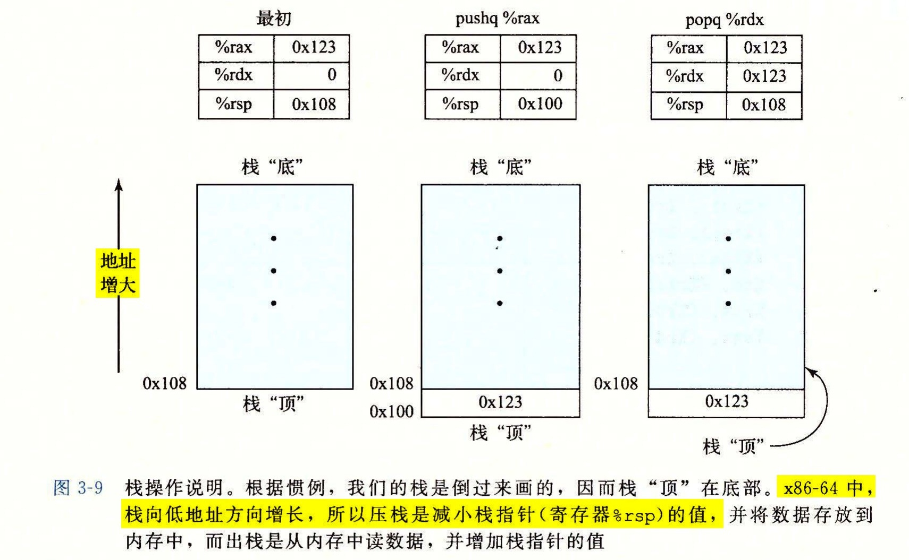

# 3.4.4 压入和弹出栈数据

最后两个数据传送操作可以将数据压入程序栈中，以及从程序栈中弹出数据，如图 3-8 所示。正如我们将看到的，栈在处理过程调用中起到至关重要的作用。栈是一种数据结构，可以添加或者删除值，不过要遵循“后进先出”的原则。通过 `push` 操作把数据压入栈中，通过 `pop` 操作删除数据；它具有一个属性：弹出的值永远是最近被压入而且仍然在栈中的值。栈可以实现为一个数组，总是从数组的一端插入和删除元素。这一端被称为栈顶。

在 x86-64 中，程序栈存放在内存中某个区域。如图 3-9 所示，栈向下增长，这样一来，栈顶元素的地址是所有栈中元素地址中最低的。（根据惯例，我们的栈是倒过来画的，栈“顶”在图的底部。）栈指针 `%rsp` 保存着栈顶元素的地址。

| 指令 | 效果 | 描述 |
| --- | --- | --- |
| `pushq` S | R[`%rsp`] ← R[`%rsp`] - 8；M[R[`%rsp`]] ← S | 将四字压入栈 |
| `popq` D | D ← M[R[`%rsp`]]；R[`%rsp`] ← R[`%rsp`] + 8 | 将四字弹出栈 |

*图 3-8　入栈和出栈指令*

`pushq` 指令的功能是把数据压入到栈上，而 `popq` 指令是弹出数据。这些指令都只有一个操作数——压入的数据源和弹出的数据目的。

将一个四字值压入栈中，首先要将栈指针减 8，然后将值写到新的栈顶地址。因此，指令 `pushq %rbp` 的行为等价于下面两条指令：

```text
subq $8,%rsp          Decrement stack pointer
movq %rbp,(%rsp)      Store %rbp on stack
```

它们之间的区别是在机器代码中 `pushq` 指令编码为 1 个字节，而上面那两条指令一共需要 8 个字节。图 3-9 中前两栏给出的是，当 `%rsp` 为 `0x108`、`%rax` 为 `0x123` 时，执行指令 `pushq %rax` 的效果。首先 `%rsp` 会减 8，得到 `0x100`，然后会将 `0x123` 存放到内存地址 `0x100` 处。



弹出一个四字的操作包括从栈顶位置读出数据，然后将栈指针加 8。因此，指令 `popq %rax` 等价于下面两条指令：

```text
movq (%rsp),%rax      Read %rax from stack
addq $8,%rsp          Increment stack pointer
```

图 3-9 的第三栏说明的是在执行完 `pushq` 后立即执行指令 `popq %rdx` 的效果。先从内存中读出值 `0x123`，再写到寄存器 `%rdx` 中，然后，寄存器 `%rsp` 的值将增加回到 `0x108`。如图中所示，值 `0x123` 仍然会保持在内存位置 `0x100` 中，直到被覆盖（例如被另一条入栈操作覆盖）。无论如何，`%rsp` 指向的地址总是栈顶。

因为栈和程序代码以及其他形式的程序数据都是放在同一内存中，所以程序可以用标准的内存寻址方法访问栈内的任意位置。例如，假设栈顶元素是四字，指令 `movq 8(%rsp),%rdx` 会将第二个四字从栈中复制到寄存器 `%rdx`。
