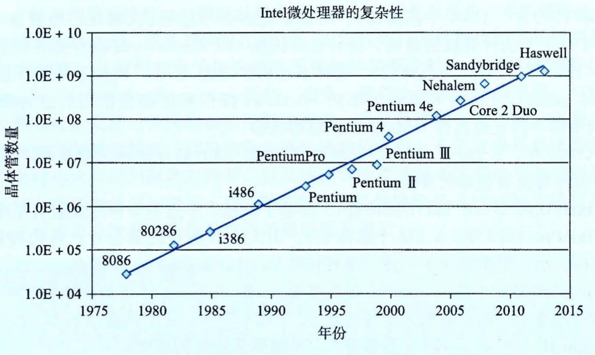
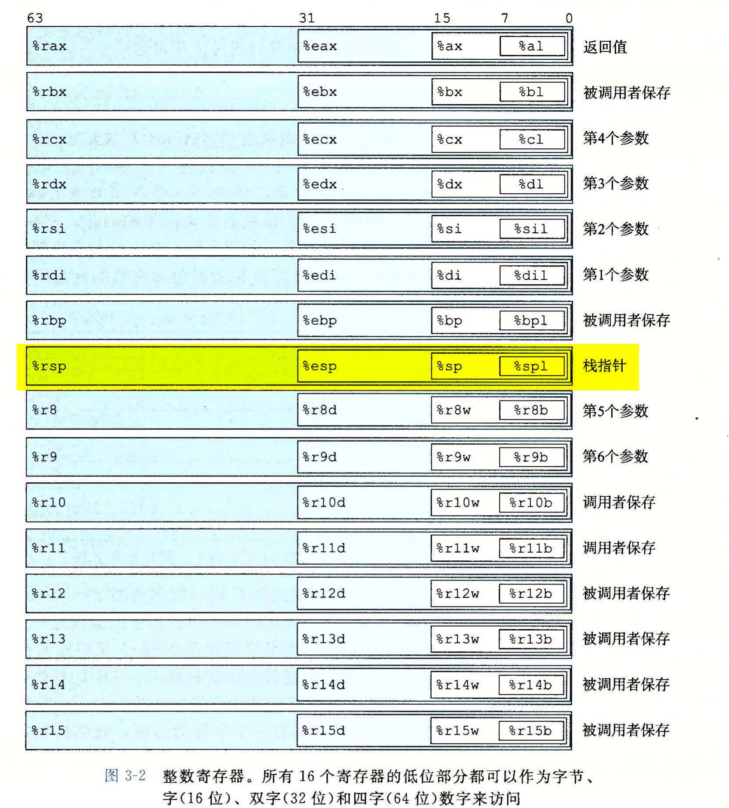
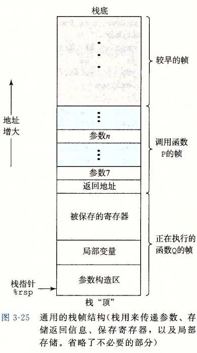
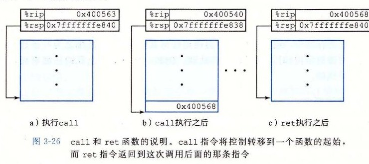
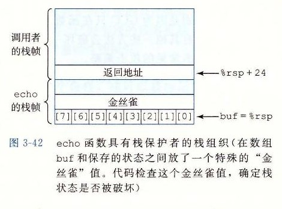
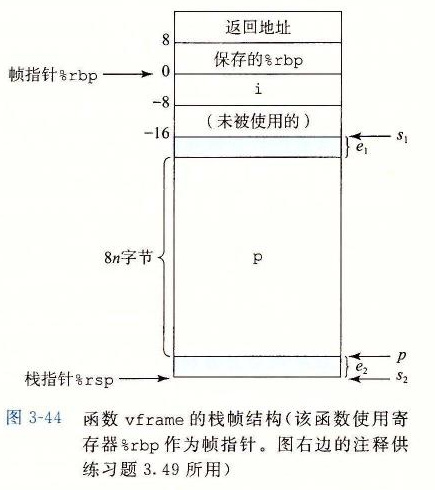

# 第 3 章 程序的机器级表示

[返回总目录](../README.md) · [上一章](../第02章-信息的表示和处理/README.md) · [下一章](../第04章-处理器体系结构/README.md) · [按小节阅读](README.md) · [练习题答案](练习题答案.md)

## 本章目录

- [第 3 章 程序的机器级表示](#第-3-章-程序的机器级表示)
  - [3.1 历史观点](#31-历史观点)
  - [3.2 程序编码](#32-程序编码)
    - [3.2.1 机器级代码](#321-机器级代码)
    - [3.2.2 代码示例](#322-代码示例)
    - [3.2.3 关于格式的注解](#323-关于格式的注解)
  - [3.3 数据格式](#33-数据格式)
  - [3.4 访问信息](#34-访问信息)
    - [3.4.1 操作数指示符](#341-操作数指示符)
    - [3.4.2 数据传送指令](#342-数据传送指令)
    - [3.4.3 数据传送示例](#343-数据传送示例)
    - [3.4.4 压入和弹出栈数据](#344-压入和弹出栈数据)
  - [3.5 算术和逻辑操作](#35-算术和逻辑操作)
    - [3.5.1 加载有效地址](#351-加载有效地址)
    - [3.5.2 一元和二元操作](#352-一元和二元操作)
    - [3.5.3 移位操作](#353-移位操作)
    - [3.5.4 讨论](#354-讨论)
    - [3.5.5 特殊的算术操作](#355-特殊的算术操作)
  - [3.6 控制](#36-控制)
    - [3.6.1 条件码](#361-条件码)
    - [3.6.2 访问条件码](#362-访问条件码)
    - [3.6.3 跳转指令](#363-跳转指令)
    - [3.6.4 跳转指令的编码](#364-跳转指令的编码)
    - [3.6.5 用条件控制来实现条件分支](#365-用条件控制来实现条件分支)
    - [3.6.6 用条件传送来实现条件分支](#366-用条件传送来实现条件分支)
    - [3.6.7 循环](#367-循环)
    - [3.6.8 switch 语句](#368-switch-语句)
  - [3.7 过程](#37-过程)
    - [3.7.1 运行时栈](#371-运行时栈)
    - [3.7.2 转移控制](#372-转移控制)
    - [3.7.3 数据传送](#373-数据传送)
    - [3.7.4 栈上的局部存储](#374-栈上的局部存储)
    - [3.7.5 寄存器中的局部存储空间](#375-寄存器中的局部存储空间)
    - [3.7.6 递归过程](#376-递归过程)
  - [3.8 数组分配和访问](#38-数组分配和访问)
    - [3.8.1 基本原则](#381-基本原则)
    - [3.8.2 指针运算](#382-指针运算)
    - [3.8.3 嵌套的数组](#383-嵌套的数组)
    - [3.8.4 定长数组](#384-定长数组)
    - [3.8.5 变长数组](#385-变长数组)
  - [3.9 异质的数据结构](#39-异质的数据结构)
    - [3.9.1 结构](#391-结构)
    - [3.9.2 联合](#392-联合)
    - [3.9.3 数据对齐](#393-数据对齐)
  - [3.10 在机器级程序中将控制与数据结合起来](#310-在机器级程序中将控制与数据结合起来)
    - [3.10.1 理解指针](#3101-理解指针)
    - [3.10.2 应用：使用 GDB 调试器](#3102-应用使用-gdb-调试器)
    - [3.10.3 内存越界引用和缓冲区溢出](#3103-内存越界引用和缓冲区溢出)
    - [3.10.4 对抗缓冲区溢出攻击](#3104-对抗缓冲区溢出攻击)
    - [3.10.5 支持变长栈帧](#3105-支持变长栈帧)
  - [3.11 浮点代码](#311-浮点代码)
    - [3.11.1 浮点传送和转换操作](#3111-浮点传送和转换操作)
    - [3.11.2 过程中的浮点代码](#3112-过程中的浮点代码)
    - [3.11.3 浮点运算操作](#3113-浮点运算操作)
    - [3.11.4 定义和使用浮点常数](#3114-定义和使用浮点常数)
    - [3.11.5 在浮点代码中使用位级操作](#3115-在浮点代码中使用位级操作)
    - [3.11.6 浮点比较操作](#3116-浮点比较操作)
    - [3.11.7 对浮点代码的观察结论](#3117-对浮点代码的观察结论)
  - [3.12 小结](#312-小结)
- [第 3 章家庭作业：3.58～3.63](#第-3-章家庭作业358363)
- [第 3 章家庭作业：3.64～3.69](#第-3-章家庭作业364369)
- [第 3 章家庭作业：3.70～3.75](#第-3-章家庭作业370375)

## 第 3 章 程序的机器级表示

计算机执行机器代码，用字节序列编码低级的操作，包括处理数据、管理内存、读写存储设备上的数据，以及利用网络通信。编译器基于编程语言的规则、目标机器的指令集和操作系统遵循的惯例，经过一系列的阶段生成机器代码。GCC C 语言编译器以汇编代码的形式产生输出，汇编代码是机器代码的文本表示，给出程序中的每一条指令。然后 GCC 调用汇编器和链接器，根据汇编代码生成可执行的机器代码。在本章中，我们会近距离地观察机器代码，以及人类可读的表示——汇编代码。

当我们用高级语言编程的时候（例如 C 语言，Java 语言更是如此），机器屏蔽了程序的细节，即机器级的实现。与此相反，当用汇编代码编程的时候（就像早期的计算），程序员必须指定程序用来执行计算的低级指令。高级语言提供的抽象级别比较高，大多数时候，在这种抽象级别上工作效率会更高，也更可靠。编译器提供的类型检查能帮助我们发现许多程序错误，并能够保证按照一致的方式来引用和处理数据。通常情况下，使用现代的优化编译器产生的代码至少与一个熟练的汇编语言程序员手工编写的代码一样有效。最大的优点是，用高级语言编写的程序可以在很多不同的机器上编译和执行，而汇编代码则是与特定机器密切相关的。

那么为什么我们还要花时间学习机器代码呢？即使编译器承担了生成汇编代码的大部分工作，对于严谨的程序员来说，能够阅读和理解汇编代码仍是一项很重要的技能。以适当的命令行选项调用编译器，编译器就会产生一个以汇编代码形式表示的输出文件。通过阅读这些汇编代码，我们能够理解编译器的优化能力，并分析代码中隐含的低效率。就像我们将在第 5 章中体会到的那样，试图最大化一段关键代码性能的程序员，通常会尝试源代码的各种形式，每次编译并检查产生的汇编代码，从而了解程序将要运行的效率如何。

此外，也有些时候，高级语言提供的抽象层会隐藏我们想要了解的程序的运行时行为。例如，第 12 章会讲到，用线程包写并发程序时，了解不同的线程是如何共享程序数据或保持数据私有的，以及准确知道如何在哪里访问共享数据，都是很重要的。这些信息在机器代码级是可见的。另外再举一个例子，程序遭受攻击（使得恶意软件侵扰系统）的许多方式中，都涉及程序存储运行时控制信息的方式的细节。许多攻击利用了系统程序中的漏洞重写信息，从而获得了系统的控制权。了解这些漏洞是如何出现的，以及如何防御它们，需要具备程序机器级表示的知识。程序员学习汇编代码的需求随着时间的推移也发生了变化，开始时要求程序员能直接用汇编语言编写程序，现在则要求他们能够阅读和理解编译器产生的代码。

在本章中，我们将详细学习一种特别的汇编语言，了解如何将 C 程序编译成这种形式的机器代码。阅读编译器产生的汇编代码，需要具备的技能不同于手工编写汇编代码。我们必须了解典型的编译器在将 C 程序结构变换成机器代码时所做的转换。相对于 C 代码表示的计算操作，优化编译器能够重新排列执行顺序，消除不必要的计算，用快速操作替换慢速操作，甚至将递归计算变换成迭代计算。源代码与对应的汇编代码的关系通常不太容易理解——就像要拼出的拼图与盒子上图片的设计有点不太一样。这是一种逆向工程（reverse engineering）——通过研究系统和逆向工作，来试图了解系统的创建过程。在这里，系统是一个机器产生的汇编语言程序，而不是由人设计的某个东西。这简化了逆向工程的任务，因为产生的代码遵循比较规则的模式，而且我们可以做试验，让编译器产生许多不同程序的代码。

本章提供了许多示例和大量的练习，来说明汇编语言和编译器的各个不同方面。精通细节是理解更深和更基本概念的先决条件。有人说：“我理解了一般规则，不愿意劳神去学习细节！”他们实际上是在自欺欺人。花时间研究这些示例、完成练习并对照提供的答案来检查你的答案，是非常关键的。

我们的表述基于 x86-64，它是现在笔记本电脑和台式机中最常见处理器的机器语言，也是驱动大型数据中心和超级计算机的最常见处理器的机器语言。这种语言的历史悠久，开始于 Intel 公司 1978 年的第一个 16 位处理器，然后扩展为 32 位，最近又扩展到 64 位。一路以来，逐渐增加了很多特性，以更好地利用已有的半导体技术，以及满足市场需求。这些进步中很多是 Intel 自己驱动的，但它的对手 AMD（Advanced Micro Devices）也作出了重要的贡献。演化的结果是得到一个相当奇特的设计，有些特性只有从历史的观点来看才有意义，它还具有提供后向兼容性的特性，而现代编译器和操作系统早已不再使用这些特性。我们将关注 GCC 和 Linux 使用的那些特性，这样可以避免 x86-64 的大量复杂性和许多隐秘特性。

我们在技术讲解之前，先快速浏览 C 语言、汇编代码以及机器代码之间的关系。然后介绍 x86-64 的细节，从数据的表示和处理以及控制的实现开始。了解如何实现 C 语言中的控制结构，如 `if`、`while` 和 `switch` 语句。之后，我们会讲到过程的实现，包括程序如何维护一个运行栈来支持过程间数据和控制的传递，以及局部变量的存储。接着，我们会考虑在机器级如何实现像数组、结构和联合这样的数据结构。有了这些机器级编程的背景知识，我们会讨论内存访问越界的问题，以及系统容易遭受缓冲区溢出攻击的问题。在这一部分的结尾，我们会给出一些用 GDB 调试器检查机器级程序运行时行为的技巧。本章的最后展示了包含浮点数据和操作的代码的机器程序表示。

> **网络旁注：IA32 编程**
>
> IA32，x86-64 的 32 位前身，是 Intel 在 1985 年提出的。几十年来一直是 Intel 的机器语言之选。今天出售的大多数 x86 微处理器，以及这些机器上安装的大多数操作系统，都是为运行 x86-64 设计的。不过，它们也可以向后兼容执行 IA32 程序。所以，很多应用程序还是基于 IA32 的。除此之外，由于硬件或系统软件的限制，许多已有的系统不能够执行 x86-64。IA32 仍然是一种重要的机器语言。学习过 x86-64 会使你很容易地学会 IA32 机器语言。
>
> 计算机工业已经完成从 32 位到 64 位机器的过渡。32 位机器只能使用大概 4GB（2<sup>32</sup> 字节）的随机访问存储器。存储器价格急剧下降，而我们对计算的需求和数据的大小持续增加，超越这个限制既经济上可行又有技术上的需要。当前的 64 位机器能够使用多达 256TB（2<sup>48</sup> 字节）的内存空间，而且很容易就能扩展至 16EB（2<sup>64</sup> 字节）。虽然很难想象一台机器需要这么大的内存，但是回想 20 世纪 70 和 80 年代，当 32 位机器开始普及的时候，4GB 的内存看上去也是超级大的。
>
> 我们的表述集中于以现代操作系统为目标，编译 C 或类似编程语言时，生成的机器级程序类型。x86-64 有一些特性是为了支持遗留下来的微处理器早期编程风格，在此，我们不试图去描述这些特性，那时候大部分代码都是手工编写的，而程序员还在努力与 16 位机器允许的有限地址空间奋战。

### 3.1 历史观点

Intel 处理器系列俗称 x86，经历了一个长期的、不断进化的发展过程。开始时，它是第一代单芯片、16 位微处理器之一，由于当时集成电路技术水平十分有限，其中做了很多妥协。以后，它不断地成长，利用进步的技术满足更高性能和支持更高级操作系统的需求。

以下列举了一些 Intel 处理器的模型，以及它们的一些关键特性，特别是影响机器级编程的特性。我们用实现这些处理器所需要的晶体管数量来说明演变过程的复杂性。其中，“K” 表示 1000，“M” 表示 1 000 000，而 “G” 表示 1 000 000 000。

**8086（1978 年，29K 个晶体管）。** 它是第一代单芯片、16 位微处理器之一。8088 是 8086 的一个变种，在 8086 上增加了一个 8 位外部总线，构成最初的 IBM 个人计算机的心脏。IBM 与当时还不强大的微软签订合同，开发 MS-DOS 操作系统。最初的机器型号有 32 768 字节的内存和两个软驱（没有硬盘驱动器）。从体系结构上来说，这些机器只有 655 360 字节的地址空间——地址只有 20 位长（可寻址范围为 1 048 576 字节），而操作系统保留了 393 216 字节自用。1980 年，Intel 提出了 8087 浮点协处理器（45K 个晶体管），它与一个 8086 或 8088 处理器一同运行，执行浮点指令。8087 建立了 x86 系列的浮点模型，通常被称为 “x87”。

**80286（1982 年，134K 个晶体管）。** 增加了更多的寻址模式（现在已经废弃了），构成了 IBM PC-AT 个人计算机的基础，这种计算机是 MS Windows 最初的使用平台。

**i386（1985 年，275K 个晶体管）。** 将体系结构扩展到 32 位。增加了平坦寻址模式（flat addressing model），Linux 和最近版本的 Windows 操作系统都是使用的这种模式。这是 Intel 系列中第一台全面支持 Unix 操作系统的机器。

**i486（1989 年，1.2M 个晶体管）。** 改善了性能，同时将浮点单元集成到了处理器芯片上，但是指令集没有明显的改变。

**Pentium（1993 年，3.1M 个晶体管）。** 改善了性能，不过只对指令集进行了小的扩展。

**PentiumPro（1995 年，5.5M 个晶体管）。** 引入全新的处理器设计，在内部被称为 P6 微体系结构。指令集中增加了一类“条件传送（conditional move）”指令。

**Pentium/MMX（1997 年，4.5M 个晶体管）。** 在 Pentium 处理器中增加了一类新的处理整数向量的指令。每个数据大小可以是 1、2 或 4 字节。每个向量总长 64 位。

**Pentium II（1997 年，7M 个晶体管）。** P6 微体系结构的延伸。

**Pentium III（1999 年，8.2M 个晶体管）。** 引入了 SSE，这是一类处理整数或浮点数向量的指令。每个数据可以是 1、2 或 4 个字节，打包成 128 位的向量。由于芯片上包括了二级高速缓存，这种芯片后来的版本最多使用了 24M 个晶体管。

**Pentium 4（2000 年，42M 个晶体管）。** SSE 扩展到了 SSE2，增加了新的数据类型（包括双精度浮点数），以及针对这些格式的 144 条新指令。有了这些扩展，编译器可以使用 SSE 指令（而不是 x87 指令），来编译浮点代码。

**Pentium 4E（2004 年，125M 个晶体管）。** 增加了超线程（hyperthreading），这种技术可以在一个处理器上同时运行两个程序；还增加了 EM64T，它是 Intel 对 AMD 提出的对 IA32 的 64 位扩展的实现，我们称之为 x86-64。

**Core 2（2006 年，291M 个晶体管）。** 回归到类似于 P6 的微体系结构。Intel 的第一个多核微处理器，即多处理器实现在一个芯片上。但不支持超线程。

**Core i7，Nehalem（2008 年，781M 个晶体管）。** 既支持超线程，也有多核，最初的版本支持每个核上执行两个程序，每个芯片上最多四个核。

**Core i7，Sandy Bridge（2011 年，1.17G 个晶体管）。** 引入了 AVX，这是对 SSE 的扩展，支持把数据封装进 256 位的向量。

**Core i7，Haswell（2013 年，1.4G 个晶体管）。** 将 AVX 扩展至 AVX2，增加了更多的指令和指令格式。

每个后继处理器的设计都是后向兼容的——较早版本上编译的代码可以在较新的处理器上运行。正如我们看到的那样，为了保持这种进化传统，指令集中有许多非常奇怪的东西。Intel 处理器系列有好几个名字，包括 IA32，也就是 “Intel 32 位体系结构（Intel Architecture 32-bit）”，以及最新的 Intel64，即 IA32 的 64 位扩展，我们也称为 x86-64。最常用的名字是 “x86”，我们用它指代整个系列，也反映了直到 i486 处理器命名的惯例。

> **旁注：摩尔定律（Moore's Law）**
>
> 如果我们画出各种不同的 Intel 处理器中晶体管的数量与它们出现的年份之间的图（y 轴为晶体管数量的对数值），我们能够看出，增长是很显著的。画一条拟合这些数据的线，可以看到晶体管数量以每年大约 37% 的速率增加，也就是说，晶体管数量每 26 个月就会翻一番。在 x86 微处理器的历史上，这种增长已经持续了好几十年。
>
> 
>
> 1965 年，Gordon Moore，Intel 公司的创始人，根据当时的芯片技术（那时他们能够在一个芯片上制造有大约 64 个晶体管的电路）做出推断，预测在未来 10 年，芯片上的晶体管数量每年都会翻一番。这个预测就称为摩尔定律。正如事实证明的那样，他的预测有点乐观，而且短视。在超过 50 年中，半导体工业一直能够使得晶体管数目每 18 个月翻一倍。
>
> 对计算机技术的其他方面，也有类似的呈指数增长的情况出现，比如磁盘和半导体存储器的存储容量。这些惊人的增长速度一直是计算机革命的主要驱动力。

这些年来，许多公司生产出了与 Intel 处理器兼容的处理器，能够运行完全相同的机器级程序。其中，领头的是 AMD。数年来，AMD 在技术上紧跟 Intel，执行的市场策略是：生产性能稍低但是价格更便宜的处理器。2002 年，AMD 的处理器变得更加有竞争力，它们率先突破了可商用微处理器的 1GHz 的时钟速度屏障，并且引入了广泛采用的 IA32 的 64 位扩展 x86-64。虽然我们讲的是 Intel 处理器，但是对于其竞争对手生产的与之兼容的处理器来说，这些表述也同样成立。

对于由 GCC 编译器产生的、在 Linux 操作系统平台上运行的程序，感兴趣的人大多并不关心 x86 的复杂性。最初的 8086 提供的内存模型和它在 80286 中的扩展，到 i386 的时候就都已经过时了。原来的 x87 浮点指令到引入 SSE2 以后就过时了。虽然在 x86-64 程序中，我们能看到历史发展的痕迹，但 x86 中许多最晦涩难懂的特性已经不会出现了。

### 3.2 程序编码

假设一个 C 程序，有两个文件 `p1.c` 和 `p2.c`。我们用 Unix 命令行编译这些代码：

```text
linux> gcc -Og -o p p1.c p2.c
```

命令 `gcc` 指的就是 GCC C 编译器。因为这是 Linux 上默认的编译器，我们也可以简单地用 `cc` 来启动它。编译选项 `-Og`<sup>1</sup> 告诉编译器使用会生成符合原始 C 代码整体结构的机器代码的优化等级。使用较高级别优化产生的代码会严重变形，以至于产生的机器代码和初始源代码之间的关系非常难以理解。因此我们会使用 `-Og` 优化作为学习工具，然后当我们增加优化级别时，再看会发生什么。实际中，从得到的程序的性能考虑，较高级别的优化（例如，以选项 `-O1` 或 `-O2` 指定）被认为是较好的选择。

实际上 `gcc` 命令调用了一整套的程序，将源代码转化成可执行代码。首先，C 预处理器扩展源代码，插入所有用 `#include` 命令指定的文件，并扩展所有用 `#define` 声明指定的宏。其次，编译器产生两个源文件的汇编代码，名字分别为 `p1.s` 和 `p2.s`。接下来，汇编器会将汇编代码转化成二进制目标代码文件 `p1.o` 和 `p2.o`。目标代码是机器代码的一种形式，它包含所有指令的二进制表示，但是还没有填入全局值的地址。最后，链接器将两个目标代码文件与实现库函数（例如 `printf`）的代码合并，并产生最终的可执行代码文件 `p`（由命令行指示符 `-o p` 指定的）。可执行代码是我们要考虑的机器代码的第二种形式，也就是处理器执行的代码格式。我们会在第 7 章更详细地介绍这些不同形式的机器代码之间的关系以及链接的过程。

<sup>1</sup> GCC 版本 4.8 引入了这个优化等级。较早的 GCC 版本和其他一些非 GNU 编译器不认识这个选项。对这样一些编译器，使用一级优化（由命令行标志 `-O1` 指定）可能是最好的选择，生成的代码能够符合原始程序的结构。

#### 3.2.1 机器级代码

正如在 1.9.3 节中讲过的那样，计算机系统使用了多种不同形式的抽象，利用更简单的抽象模型来隐藏实现的细节。对于机器级编程来说，其中两种抽象尤为重要。第一种是由指令集体系结构或指令集架构（Instruction Set Architecture，ISA）来定义机器级程序的格式和行为，它定义了处理器状态、指令的格式，以及每条指令对状态的影响。大多数 ISA，包括 x86-64，将程序的行为描述成好像每条指令都是按顺序执行的，一条指令结束后，下一条再开始。处理器的硬件远比描述的精细复杂，它们并发地执行许多指令，但是可以采取措施保证整体行为与 ISA 指定的顺序执行的行为完全一致。第二种抽象是，机器级程序使用的内存地址是虚拟地址，提供的内存模型看上去是一个非常大的字节数组。存储器系统的实际实现是将多个硬件存储器和操作系统软件组合起来，这会在第 9 章中讲到。

在整个编译过程中，编译器会完成大部分的工作，将把用 C 语言提供的相对比较抽象的执行模型表示的程序转化成处理器执行的非常基本的指令。汇编代码表示非常接近于机器代码。与机器代码的二进制格式相比，汇编代码的主要特点是它用可读性更好的文本格式表示。能够理解汇编代码以及它与原始 C 代码的联系，是理解计算机如何执行程序的关键一步。

x86-64 的机器代码和原始的 C 代码差别非常大。一些通常对 C 语言程序员隐藏的处理器状态都是可见的：

* 程序计数器（通常称为 “PC”，在 x86-64 中用 `%rip` 表示）给出将要执行的下一条指令在内存中的地址。
* 整数寄存器文件包含 16 个命名的位置，分别存储 64 位的值。这些寄存器可以存储地址（对应于 C 语言的指针）或整数数据。有的寄存器被用来记录某些重要的程序状态，而其他的寄存器用来保存临时数据，例如过程的参数和局部变量，以及函数的返回值。
* 条件码寄存器保存着最近执行的算术或逻辑指令的状态信息。它们用来实现控制或数据流中的条件变化，比如说用来实现 `if` 和 `while` 语句。
* 一组向量寄存器可以存放一个或多个整数或浮点数值。

虽然 C 语言提供了一种模型，可以在内存中声明和分配各种数据类型的对象，但是机器代码只是简单地将内存看成一个很大的、按字节寻址的数组。C 语言中的聚合数据类型，例如数组和结构，在机器代码中用一组连续的字节来表示。即使是对标量数据类型，汇编代码也不区分有符号或无符号整数，不区分各种类型的指针，甚至于不区分指针和整数。

程序内存包含：程序的可执行机器代码，操作系统需要的一些信息，用来管理过程调用和返回的运行时栈，以及用户分配的内存块（比如说用 `malloc` 库函数分配的）。正如前面提到的，程序内存用虚拟地址来寻址。在任意给定的时刻，只有有限的一部分虚拟地址被认为是合法的。例如，x86-64 的虚拟地址是由 64 位的字来表示的。在目前的实现中，这些地址的高 16 位必须设置为 0，所以一个地址实际上能够指定的是 2<sup>48</sup> 或 64TB 范围内的一个字节。较为典型的程序只会访问几兆字节或几千兆字节的数据。操作系统负责管理虚拟地址空间，将虚拟地址翻译成实际处理器内存中的物理地址。

一条机器指令只执行一个非常基本的操作。例如，将存放在寄存器中的两个数字相加，在存储器和寄存器之间传送数据，或是条件分支转移到新的指令地址。编译器必须产生这些指令的序列，从而实现（像算术表达式求值、循环或过程调用和返回这样的）程序结构。

> **旁注：不断变化的生成代码的格式**
>
> 在本书的表述中，我们给出的代码是由特定版本的 GCC 在特定的命令行选项设置下产生的。如果你在自己的机器上编译代码，很有可能用到其他的编译器或者不同版本的 GCC，因而会产生不同的代码。支持 GCC 的开源社区一直在修改代码产生器，试图根据微处理器制造商提供的不断变化的代码规则，产生更有效的代码。
>
> 本书示例的目标是展示如何查看汇编代码，并将它反向映射到高级编程语言中的结构。你需要将这些技术应用到你的特定的编译器产生的代码格式上。

#### 3.2.2 代码示例

假设我们写了一个 C 语言代码文件 `mstore.c`，包含如下的函数定义：

```c
long mult2(long, long);

void multstore(long x, long y, long *dest) {
    long t = mult2(x, y);
    *dest = t;
}
```

在命令行上使用 “`-S`” 选项，就能看到 C 语言编译器产生的汇编代码：

```text
linux> gcc -Og -S mstore.c
```

这会使 GCC 运行编译器，产生一个汇编文件 `mstore.s`，但是不做其他进一步的工作。（通常情况下，它还会继续调用汇编器产生目标代码文件。）

汇编代码文件包含各种声明，包括下面几行：

```asm
multstore:
    pushq   %rbx
    movq    %rdx, %rbx
    call    mult2
    movq    %rax, (%rbx)
    popq    %rbx
    ret
```

上面代码中每个缩进去的行都对应于一条机器指令。比如，`pushq` 指令表示应该将寄存器 `%rbx` 的内容压入程序栈中。这段代码中已经除去了所有关于局部变量名或数据类型的信息。

如果我们使用 “`-c`” 命令行选项，GCC 会编译并汇编该代码：

```text
linux> gcc -Og -c mstore.c
```

这就会产生目标代码文件 `mstore.o`，它是二进制格式的，所以无法直接查看。1368 字节的文件 `mstore.o` 中有一段 14 字节的序列，它的十六进制表示为：

```text
53 48 89 d3 e8 00 00 00 00 48 89 03 5b c3
```

这就是上面列出的汇编指令对应的目标代码。从中得到一个重要信息，即机器执行的程序只是一个字节序列，它是对一系列指令的编码。机器对产生这些指令的源代码几乎一无所知。

> **旁注：如何展示程序的字节表示**
>
> 要展示程序（比如说 `mstore`）的二进制目标代码，我们用反汇编器（后面会讲到）确定该过程的代码长度是 14 字节。然后，在文件 `mstore.o` 上运行 GNU 调试工具 GDB，输入命令：
>
> ```text
> (gdb) x/14xb multstore
> ```
>
> 这条命令告诉 GDB 显示（简写为 `x`）从函数 `multstore` 所处地址开始的 14 个十六进制格式表示（也简写为 `x`）的字节（简写为 `b`）。你会发现，GDB 有很多有用的特性可以用来分析机器级程序，我们会在 3.10.2 节中讨论。

要查看机器代码文件的内容，有一类称为反汇编器（disassembler）的程序非常有用。这些程序根据机器代码产生一种类似于汇编代码的格式。在 Linux 系统中，带 “`-d`” 命令行标志的程序 OBJDUMP（表示 “object dump”）可以充当这个角色：

```text
linux> objdump -d mstore.o
```

结果如下（这里，我们在左边增加了行号，在右边增加了斜体表示的注解）：

*Disassembly of function `multstore` in binary file `mstore.o`*

```text
1  0000000000000000 <multstore>:
      Offset  Bytes                 Equivalent assembly language
2          0: 53                    push   %rbx
3          1: 48 89 d3              mov    %rdx,%rbx
4          4: e8 00 00 00 00        callq  9 <multstore+0x9>
5          9: 48 89 03              mov    %rax,(%rbx)
6          c: 5b                    pop    %rbx
7          d: c3                    retq
```

在左边，我们看到按照前面给出的字节顺序排列的 14 个十六进制字节值，它们分成了若干组，每组有 1～5 个字节。每组都是一条指令，右边是等价的汇编语言。

其中一些关于机器代码和它的反汇编表示的特性值得注意：

* x86-64 的指令长度从 1 到 15 个字节不等。常用的指令以及操作数较少的指令所需的字节数少，而那些不太常用或操作数较多的指令所需字节数较多。
* 设计指令格式的方式是，从某个给定位置开始，可以将字节唯一地解码成机器指令。例如，只有指令 `pushq %rbx` 是以字节值 `53` 开头的。
* 反汇编器只是基于机器代码文件中的字节序列来确定汇编代码。它不需要访问该程序的源代码或汇编代码。
* 反汇编器使用的指令命名规则与 GCC 生成的汇编代码使用的有些细微的差别。在我们的示例中，它省略了很多指令结尾的 `q`。这些后缀是大小指示符，在大多数情况中可以省略。相反，反汇编器给 `call` 和 `ret` 指令添加了 `q` 后缀，同样，省略这些后缀也没有问题。

生成实际可执行的代码需要对一组目标代码文件运行链接器，而这一组目标代码文件中必须含有一个 `main` 函数。假设在文件 `main.c` 中有下面这样的函数：

```c
#include <stdio.h>

void multstore(long, long, long *);

int main() {
    long d;
    multstore(2, 3, &d);
    printf("2 * 3 --> %ld\n", d);
    return 0;
}

long mult2(long a, long b) {
    long s = a * b;
    return s;
}
```

然后，我们用如下方法生成可执行文件 `prog`：

```text
linux> gcc -Og -o prog main.c mstore.c
```

文件 `prog` 变成了 8655 个字节，因为它不仅包含了两个过程的代码，还包含了用来启动和终止程序的代码，以及用来与操作系统交互的代码。我们也可以反汇编 `prog` 文件：

```text
linux> objdump -d prog
```

反汇编器会抽取出各种代码序列，包括下面这段：

*Disassembly of function `multstore` in binary file `prog`*

```text
1  0000000000400540 <multstore>:
2    400540: 53                    push   %rbx
3    400541: 48 89 d3              mov    %rdx,%rbx
4    400544: e8 42 00 00 00        callq  40058b <mult2>
5    400549: 48 89 03              mov    %rax,(%rbx)
6    40054c: 5b                    pop    %rbx
7    40054d: c3                    retq
8    40054e: 90                    nop
9    40054f: 90                    nop
```

这段代码与 `mstore.c` 反汇编产生的代码几乎完全一样。其中一个主要的区别是左边列出的地址不同——链接器将这段代码的地址移到了一段不同的地址范围中。第二个不同之处在于链接器填上了 `callq` 指令调用函数 `mult2` 需要使用的地址（反汇编代码第 4 行）。链接器的任务之一就是为函数调用找到匹配的函数的可执行代码的位置。最后一个区别是多了两行代码（第 8 和 9 行）。这两条指令对程序没有影响，因为它们出现在返回指令后面（第 7 行）。插入这些指令是为了使函数代码变为 16 字节，使得就存储器系统性能而言，能更好地放置下一个代码块。

#### 3.2.3 关于格式的注解

GCC 产生的汇编代码对我们来说有点儿难读。一方面，它包含一些我们不需要关心的信息，另一方面，它不提供任何程序的描述或它是如何工作的描述。例如，假设我们用如下命令生成文件 `mstore.s`：

```text
linux> gcc -Og -S mstore.c
```

`mstore.s` 的完整内容如下：

```asm
    .file   "010-mstore.c"
    .text
    .globl  multstore
    .type   multstore, @function
multstore:
    pushq   %rbx
    movq    %rdx, %rbx
    call    mult2
    movq    %rax, (%rbx)
    popq    %rbx
    ret
    .size   multstore, .-multstore
    .ident  "GCC: (Ubuntu 4.8.1-2ubuntu1~12.04) 4.8.1"
    .section    .note.GNU-stack,"",@progbits
```

所有以 `.` 开头的行都是指导汇编器和链接器工作的伪指令。我们通常可以忽略这些行。另一方面，也没有关于指令的用途以及它们与源代码之间关系的解释说明。

为了更清楚地说明汇编代码，我们用这样一种格式来表示汇编代码，它省略了大部分伪指令，但包括行号和解释性说明。对于我们的示例，带解释的汇编代码如下：

```text
void multstore(long x, long y, long *dest)
x in %rdi, y in %rsi, dest in %rdx

1  multstore:
2      pushq   %rbx            Save %rbx
3      movq    %rdx, %rbx      Copy dest to %rbx
4      call    mult2           Call mult2(x, y)
5      movq    %rax, (%rbx)    Store result at *dest
6      popq    %rbx            Restore %rbx
7      ret                     Return
```

通常我们只会给出与讨论内容相关的代码行。每一行的左边都有编号供引用，右边是注释，简单地描述指令的效果以及它与原始 C 语言代码中的计算操作的关系。这是一种汇编语言程序员写代码的风格。

我们还提供网络旁注，为专门的机器语言爱好者提供一些资料。一个网络旁注描述的是 IA32 机器代码。有了 x86-64 的背景，学习 IA32 会相当简单。另外一个网络旁注简要描述了在 C 语言中插入汇编代码的方法。对于一些应用程序，程序员必须用汇编代码来访问机器的低级特性。一种方法是用汇编代码编写整个函数，在链接阶段把它们和 C 函数组合起来。另一种方法是利用 GCC 的支持，直接在 C 程序中嵌入汇编代码。

> **旁注：ATT 与 Intel 汇编代码格式**
>
> 我们的表述是 ATT（根据 “AT&T” 命名的，AT&T 是运营贝尔实验室多年的公司）格式的汇编代码，这是 GCC、OBJDUMP 和其他一些我们使用的工具的默认格式。其他一些编程工具，包括 Microsoft 的工具，以及来自 Intel 的文档，其汇编代码都是 Intel 格式的。这两种格式在许多方面有所不同。例如，使用下述命令行，GCC 可以产生 `multstore` 函数的 Intel 格式的代码：
>
> ```text
> linux> gcc -Og -S -masm=intel mstore.c
> ```
>
> 这个命令得到下列汇编代码：
>
> ```asm
> multstore:
>     push    rbx
>     mov     rbx, rdx
>     call    mult2
>     mov     QWORD PTR [rbx], rax
>     pop     rbx
>     ret
> ```
>
> 我们看到 Intel 和 ATT 格式在如下方面有所不同：
>
> * Intel 代码省略了指示大小的后缀。我们看到指令 `push` 和 `mov`，而不是 `pushq` 和 `movq`。
> * Intel 代码省略了寄存器名字前面的 `%` 符号，用的是 `rbx`，而不是 `%rbx`。
> * Intel 代码用不同的方式来描述内存中的位置，例如是 `QWORD PTR [rbx]` 而不是 `(%rbx)`。
> * 在带有多个操作数的指令情况下，列出操作数的顺序相反。当在两种格式之间进行转换的时候，这一点非常令人困惑。
>
> 虽然在我们的表述中不使用 Intel 格式，但是在来自 Intel 和 Microsoft 的文档中，你会遇到它。

> **网络旁注 ASM:EASM：把 C 程序和汇编代码结合起来**
>
> 虽然 C 编译器在把程序中表达的计算转换到机器代码方面表现出色，但是仍然有一些机器特性是 C 程序访问不到的。例如，每次 x86-64 处理器执行算术或逻辑运算时，如果得到的运算结果的低 8 位中有偶数个 1，那么就会把一个名为 PF 的 1 位条件码（condition code）标志设置为 1，否则就设置为 0。这里的 PF 表示 “parity flag（奇偶标志）”。在 C 语言中计算这个信息需要至少 7 次移位、掩码和异或运算（参见习题 2.65）。即使作为每次算术或逻辑运算的一部分，硬件都完成了这项计算，而 C 程序却无法知道 PF 条件码标志的值。在程序中插入几条汇编代码指令就能很容易地完成这项任务。
>
> 在 C 程序中插入汇编代码有两种方法。第一种是，我们可以编写完整的函数，放进一个独立的汇编代码文件中，让汇编器和链接器把它和用 C 语言书写的代码合并起来。第二种方法是，我们可以使用 GCC 的内联汇编（inline assembly）特性，用 `asm` 伪指令可以在 C 程序中包含简短的汇编代码。这种方法的好处是减少了与机器相关的代码量。
>
> 当然，在 C 程序中包含汇编代码使得这些代码与某类特殊的机器相关（例如 x86-64），所以只应该在想要的特性只能以此种方式才能访问到时才使用它。

### 3.3 数据格式

由于是从 16 位体系结构扩展成 32 位的，Intel 用术语“字（word）”表示 16 位数据类型。因此，称 32 位数为“双字（double words）”，称 64 位数为“四字（quad words）”。

图 3-1 给出了 C 语言基本数据类型对应的 x86-64 表示。标准 `int` 值存储为双字（32 位）。指针（在此用 `char *` 表示）存储为 8 字节的四字，64 位机器本来就预期如此。x86-64 中，数据类型 `long` 实现为 64 位，允许表示的值范围较大。本章代码示例中的大部分都使用了指针和 `long` 数据类型，所以都是四字操作。x86-64 指令集同样包括完整的针对字节、字和双字的指令。

| C 声明 | Intel 数据类型 | 汇编代码后缀 | 大小（字节） |
| --- | --- | --- | ---: |
| `char` | 字节 | `b` | 1 |
| `short` | 字 | `w` | 2 |
| `int` | 双字 | `l` | 4 |
| `long` | 四字 | `q` | 8 |
| `char *` | 四字 | `q` | 8 |
| `float` | 单精度 | `s` | 4 |
| `double` | 双精度 | `l` | 8 |

*图 3-1　C 语言数据类型在 x86-64 中的大小。在 64 位机器中，指针长 8 字节*

浮点数主要有两种形式：单精度（4 字节）值，对应于 C 语言数据类型 `float`；双精度（8 字节）值，对应于 C 语言数据类型 `double`。x86 家族的微处理器历史上实现过对一种特殊的 80 位（10 字节）浮点格式进行全套的浮点运算（参见家庭作业 2.86）。可以在 C 程序中用声明 `long double` 来指定这种格式。不过我们不建议使用这种格式。它不能移植到其他类型的机器上，而且实现的硬件也不如单精度和双精度算术运算的高效。

如图所示，大多数 GCC 生成的汇编代码指令都有一个字符的后缀，表明操作数的大小。例如，数据传送指令有四个变种：`movb`（传送字节）、`movw`（传送字）、`movl`（传送双字）和 `movq`（传送四字）。后缀 `l` 用来表示双字，因为 32 位数被看成是“长字（long word）”。注意，汇编代码也使用后缀 `l` 来表示 4 字节整数和 8 字节双精度浮点数。这不会产生歧义，因为浮点数使用的是一组完全不同的指令和寄存器。

### 3.4 访问信息

一个 x86-64 的中央处理单元（CPU）包含一组 16 个存储 64 位值的通用目的寄存器。这些寄存器用来存储整数数据和指针。图 3-2 显示了这 16 个寄存器。它们的名字都以 `%r` 开头，不过后面还跟着一些不同的命名规则的名字，这是由于指令集历史演化造成的。最初的 8086 中有 8 个 16 位的寄存器，即图 3-2 中的 `%ax` 到 `%bp`。每个寄存器都有特殊的用途，它们的名字就反映了这些不同的用途。扩展到 IA32 架构时，这些寄存器也扩展成 32 位寄存器，标号从 `%eax` 到 `%ebp`。扩展到 x86-64 后，原来的 8 个寄存器扩展成 64 位，标号从 `%rax` 到 `%rbp`。除此之外，还增加了 8 个新的寄存器，它们的标号是按照新的命名规则制定的：从 `%r8` 到 `%r15`。



如图 3-2 中嵌套的方框标明的，指令可以对这 16 个寄存器的低位字节中存放的不同大小的数据进行操作。字节级操作可以访问最低的字节，16 位操作可以访问最低的 2 个字节，32 位操作可以访问最低的 4 个字节，而 64 位操作可以访问整个寄存器。

在后面的章节中，我们会展现很多指令，复制和生成 1 字节、2 字节、4 字节和 8 字节值。当这些指令以寄存器作为目标时，对于生成小于 8 字节结果的指令，寄存器中剩下的字节会怎么样，对此有两条规则：生成 1 字节和 2 字节数字的指令会保持剩下的字节不变；生成 4 字节数字的指令会把高位 4 个字节置为 0。后面这条规则是作为从 IA32 到 x86-64 的扩展的一部分而采用的。

就像图 3-2 右边的解释说明的那样，在常见的程序里不同的寄存器扮演不同的角色。其中最特别的是栈指针 `%rsp`，用来指明运行时栈的结束位置。有些程序会明确地读写这个寄存器。另外 15 个寄存器的用法更灵活。少量指令会使用某些特定的寄存器。更重要的是，有一组标准的编程规范控制着如何使用寄存器来管理栈、传递函数参数、从函数返回值，以及存储局部和临时数据。我们会在描述过程的实现时（特别是在 3.7 节中），讲述这些惯例。

#### 3.4.1 操作数指示符

大多数指令有一个或多个操作数（operand），指示出执行一个操作中要使用的源数据值，以及放置结果的目的位置。x86-64 支持多种操作数格式（参见图 3-3）。源数据值可以以常数形式给出，或是从寄存器或内存中读出。结果可以存放在寄存器或内存中。因此，各种不同的操作数的可能性被分为三种类型。

第一种类型是立即数（immediate），用来表示常数值。在 ATT 格式的汇编代码中，立即数的书写方式是 `$` 后面跟一个用标准 C 表示法表示的整数，比如，`$-577` 或 `$0x1F`。不同的指令允许的立即数值范围不同，汇编器会自动选择最紧凑的方式进行数值编码。

第二种类型是寄存器（register），它表示某个寄存器的内容，16 个寄存器的低位 1 字节、2 字节、4 字节或 8 字节中的一个作为操作数，这些字节数分别对应于 8 位、16 位、32 位或 64 位。在图 3-3 中，我们用符号 r<sub>a</sub> 来表示任意寄存器 a，用引用 R[r<sub>a</sub>] 来表示它的值，这是将寄存器集合看成一个数组 R，用寄存器标识符作为索引。

第三类操作数是内存引用，它会根据计算出来的地址（通常称为有效地址）访问某个内存位置。因为将内存看成一个很大的字节数组，我们用符号 M<sub>b</sub>[Addr] 表示对存储在内存中从地址 Addr 开始的 b 个字节值的引用。为了简便，我们通常省去下标 b。

如图 3-3 所示，有多种不同的寻址模式，允许不同形式的内存引用。表中底部用语法 Imm(r<sub>b</sub>, r<sub>i</sub>, s) 表示的是最常用的形式。这样的引用有四个组成部分：一个立即数偏移 Imm，一个基址寄存器 r<sub>b</sub>，一个变址寄存器 r<sub>i</sub> 和一个比例因子 s，这里 s 必须是 1、2、4 或者 8。基址和变址寄存器都必须是 64 位寄存器。有效地址被计算为 Imm + R[r<sub>b</sub>] + R[r<sub>i</sub>] · s。引用数组元素时，会用到这种通用形式。其他形式都是这种通用形式的特殊情况，只是省略了某些部分。正如我们将看到的，当引用数组和结构元素时，比较复杂的寻址模式是很有用的。

| 类型 | 格式 | 操作数值 | 名称 |
| --- | --- | --- | --- |
| 立即数 | `$Imm` | Imm | 立即数寻址 |
| 寄存器 | r<sub>a</sub> | R[r<sub>a</sub>] | 寄存器寻址 |
| 存储器 | Imm | M[Imm] | 绝对寻址 |
| 存储器 | (r<sub>a</sub>) | M[R[r<sub>a</sub>]] | 间接寻址 |
| 存储器 | Imm(r<sub>b</sub>) | M[Imm + R[r<sub>b</sub>]] | （基址 + 偏移量）寻址 |
| 存储器 | (r<sub>b</sub>, r<sub>i</sub>) | M[R[r<sub>b</sub>] + R[r<sub>i</sub>]] | 变址寻址 |
| 存储器 | Imm(r<sub>b</sub>, r<sub>i</sub>) | M[Imm + R[r<sub>b</sub>] + R[r<sub>i</sub>]] | 变址寻址 |
| 存储器 | (, r<sub>i</sub>, s) | M[R[r<sub>i</sub>] · s] | 比例变址寻址 |
| 存储器 | Imm(, r<sub>i</sub>, s) | M[Imm + R[r<sub>i</sub>] · s] | 比例变址寻址 |
| 存储器 | (r<sub>b</sub>, r<sub>i</sub>, s) | M[R[r<sub>b</sub>] + R[r<sub>i</sub>] · s] | 比例变址寻址 |
| 存储器 | Imm(r<sub>b</sub>, r<sub>i</sub>, s) | M[Imm + R[r<sub>b</sub>] + R[r<sub>i</sub>] · s] | 比例变址寻址 |

*图 3-3　操作数格式。操作数可以表示立即数（常数）值、寄存器值或是来自内存的值。比例因子 s 必须是 1、2、4 或者 8*

**练习题 3.1** 假设下面的值存放在指明的内存地址和寄存器中：

| 地址 | 值 |
| --- | --- |
| `0x100` | `0xFF` |
| `0x104` | `0xAB` |
| `0x108` | `0x13` |
| `0x10C` | `0x11` |

| 寄存器 | 值 |
| --- | --- |
| `%rax` | `0x100` |
| `%rcx` | `0x1` |
| `%rdx` | `0x3` |

填写下表，给出所示操作数的值：

| 操作数 | 值 |
| --- | --- |
| `%rax` |  |
| `0x104` |  |
| `$0x108` |  |
| `(%rax)` |  |
| `4(%rax)` |  |
| `9(%rax,%rdx)` |  |
| `260(%rcx,%rdx)` |  |
| `0xFC(,%rcx,4)` |  |
| `(%rax,%rdx,4)` |  |

#### 3.4.2 数据传送指令

最频繁使用的指令是将数据从一个位置复制到另一个位置的指令。操作数表示的通用性使得一条简单的数据传送指令能够完成在许多机器中要好几条不同指令才能完成的功能。我们会介绍多种不同的数据传送指令，它们或者源和目的类型不同，或者执行的转换不同，或者具有的一些副作用不同。在我们的讲述中，把许多不同的指令划分成指令类，每一类中的指令执行相同的操作，只不过操作数大小不同。

图 3-4 列出的是最简单形式的数据传送指令——MOV 类。这些指令把数据从源位置复制到目的位置，不做任何变化。MOV 类由四条指令组成：`movb`、`movw`、`movl` 和 `movq`。这些指令都执行同样的操作；主要区别在于它们操作的数据大小不同：分别是 1、2、4 和 8 字节。

| 指令 | 效果 | 描述 |
| --- | --- | --- |
| MOV S, D | D ← S | 传送 |
| `movb` |  | 传送字节 |
| `movw` |  | 传送字 |
| `movl` |  | 传送双字 |
| `movq` |  | 传送四字 |
| `movabsq` I, R | R ← I | 传送绝对的四字 |

*图 3-4　简单的数据传送指令*

源操作数指定的值是一个立即数，存储在寄存器中或者内存中。目的操作数指定一个位置，要么是一个寄存器，要么是一个内存地址。x86-64 加了一条限制，传送指令的两个操作数不能都指向内存位置。将一个值从一个内存位置复制到另一个内存位置需要两条指令——第一条指令将源值加载到寄存器中，第二条将该寄存器值写入目的位置。

参考图 3-2，这些指令的寄存器操作数可以是 16 个寄存器有标号部分中的任意一个，寄存器部分的大小必须与指令最后一个字符（`b`、`w`、`l` 或 `q`）指定的大小匹配。大多数情况中，MOV 指令只会更新目的操作数指定的那些寄存器字节或内存位置。唯一的例外是 `movl` 指令以寄存器作为目的时，它会把该寄存器的高位 4 字节设置为 0。造成这个例外的原因是 x86-64 采用的惯例，即任何为寄存器生成 32 位值的指令都会把该寄存器的高位部分置成 0。

下面的 MOV 指令示例给出了源和目的类型的五种可能的组合。记住，第一个是源操作数，第二个是目的操作数：

```text
1  movl $0x4050,%eax          Immediate--Register, 4 bytes
2  movw %bp,%sp               Register--Register, 2 bytes
3  movb (%rdi,%rcx),%al       Memory--Register, 1 byte
4  movb $-17,(%rsp)           Immediate--Memory, 1 byte
5  movq %rax,-12(%rbp)        Register--Memory, 8 bytes
```

图 3-4 中记录的最后一条指令是处理 64 位立即数数据的。常规的 `movq` 指令只能以表示为 32 位补码数字的立即数作为源操作数，然后把这个值符号扩展得到 64 位的值，放到目的位置。`movabsq` 指令能够以任意 64 位立即数值作为源操作数，并且只能以寄存器作为目的。

图 3-5 和图 3-6 记录的是两类数据移动指令，在将较小的源值复制到较大的目的时使用。所有这些指令都把数据从源（在寄存器或内存中）复制到目的寄存器。MOVZ 类中的指令把目的中剩余的字节填充为 0，而 MOVS 类中的指令通过符号扩展来填充，把源操作数的最高位进行复制。可以观察到，每条指令名字的最后两个字符都是大小指示符：第一个字符指定源的大小，而第二个指明目的的大小。正如看到的那样，这两个类中每个都有三条指令，包括了所有的源大小为 1 个和 2 个字节、目的大小为 2 个和 4 个字节的情况，当然只考虑目的大于源的情况。

| 指令 | 效果 | 描述 |
| --- | --- | --- |
| MOVZ S, R | R ← 零扩展(S) | 以零扩展进行传送 |
| `movzbw` |  | 将做了零扩展的字节传送到字 |
| `movzbl` |  | 将做了零扩展的字节传送到双字 |
| `movzwl` |  | 将做了零扩展的字传送到双字 |
| `movzbq` |  | 将做了零扩展的字节传送到四字 |
| `movzwq` |  | 将做了零扩展的字传送到四字 |

*图 3-5　零扩展数据传送指令。这些指令以寄存器或内存地址作为源，以寄存器作为目的*

| 指令 | 效果 | 描述 |
| --- | --- | --- |
| MOVS S, R | R ← 符号扩展(S) | 传送符号扩展的字节 |
| `movsbw` |  | 将做了符号扩展的字节传送到字 |
| `movsbl` |  | 将做了符号扩展的字节传送到双字 |
| `movswl` |  | 将做了符号扩展的字传送到双字 |
| `movsbq` |  | 将做了符号扩展的字节传送到四字 |
| `movswq` |  | 将做了符号扩展的字传送到四字 |
| `movslq` |  | 将做了符号扩展的双字传送到四字 |
| `cltq` | `%rax` ← 符号扩展(`%eax`) | 把 `%eax` 符号扩展到 `%rax` |

*图 3-6　符号扩展数据传送指令。MOVS 指令以寄存器或内存地址作为源，以寄存器作为目的。`cltq` 指令只作用于寄存器 `%eax` 和 `%rax`*

> **旁注：理解数据传送如何改变目的寄存器**
>
> 正如我们描述的那样，关于数据传送指令是否以及如何修改目的寄存器的高位字节有两种不同的方法。下面这段代码序列会说明其差别：
>
> ```text
> 1  movabsq $0x0011223344556677, %rax    %rax = 0011223344556677
> 2  movb    $-1, %al                    %rax = 00112233445566FF
> 3  movw    $-1, %ax                    %rax = 001122334455FFFF
> 4  movl    $-1, %eax                   %rax = 00000000FFFFFFFF
> 5  movq    $-1, %rax                   %rax = FFFFFFFFFFFFFFFF
> ```
>
> 在接下来的讨论中，我们使用十六进制表示。在这个例子中，第 1 行的指令把寄存器 `%rax` 初始化为位模式 `0011223344556677`。剩下的指令的源操作数值是立即数值 -1。回想一下，-1 的十六进制表示形如 `FF...F`，这里 F 的数量是表述中字节数量的两倍。因此 `movb` 指令（第 2 行）把 `%rax` 的低位字节设置为 `FF`，而 `movw` 指令（第 3 行）把低 2 位字节设置为 `FFFF`，剩下的字节保持不变。`movl` 指令（第 4 行）将低 4 个字节设置为 `FFFFFFFF`，同时把高位 4 字节设置为 `00000000`。最后 `movq` 指令（第 5 行）把整个寄存器设置为 `FFFFFFFFFFFFFFFF`。

注意图 3-5 中并没有一条明确的指令把 4 字节源值零扩展到 8 字节目的。这样的指令逻辑上应该被命名为 `movzlq`，但是并没有这样的指令。不过，这样的数据传送可以用以寄存器为目的的 `movl` 指令来实现。这一技术利用的属性是，生成 4 字节值并以寄存器作为目的的指令会把高 4 字节置为 0。对于 64 位的目标，所有三种源类型都有对应的符号扩展传送，而只有两种较小的源类型有零扩展传送。

图 3-6 还给出 `cltq` 指令。这条指令没有操作数：它总是以寄存器 `%eax` 作为源，`%rax` 作为符号扩展结果的目的。它的效果与指令 `movslq %eax,%rax` 完全一致，不过编码更紧凑。

**练习题 3.2** 对于下面汇编代码的每一行，根据操作数，确定适当的指令后缀。（例如，`mov` 可以被重写成 `movb`、`movw`、`movl` 或者 `movq`。）

```asm
mov_ %eax, (%rsp)
mov_ (%rax), %dx
mov_ $0xFF, %bl
mov_ (%rsp,%rdx,4), %dl
mov_ (%rdx), %rax
mov_ %dx, (%rax)
```

> **旁注：字节传送指令比较**
>
> 下面这个示例说明了不同的数据传送指令如何改变或者不改变目的的高位字节。仔细观察可以发现，三个字节传送指令 `movb`、`movsbq` 和 `movzbq` 之间有细微的差别。示例如下：
>
> ```text
> 1  movabsq $0x0011223344556677, %rax    %rax = 0011223344556677
> 2  movb    $0xAA, %dl                  %dl  = AA
> 3  movb    %dl, %al                    %rax = 00112233445566AA
> 4  movsbq  %dl, %rax                   %rax = FFFFFFFFFFFFFFAA
> 5  movzbq  %dl, %rax                   %rax = 00000000000000AA
> ```
>
> 在下面的讨论中，所有的值都使用十六进制表示。代码的头 2 行将寄存器 `%rax` 和 `%dl` 分别初始化为 `0011223344556677` 和 `AA`。剩下的指令都是将 `%rdx` 的低位字节复制到 `%rax` 的低位字节。`movb` 指令（第 3 行）不改变其他字节。根据源字节的最高位，`movsbq` 指令（第 4 行）将其他 7 个字节设为全 1 或全 0。由于十六进制 A 表示二进制值 1010，符号扩展会把高位字节都设置为 `FF`。`movzbq` 指令（第 5 行）总是将其他 7 个字节全都设置为 0。

**练习题 3.3** 当我们调用汇编器的时候，下面代码的每一行都会产生一个错误消息。解释每一行都是哪里出了错。

```asm
movb $0xF, (%ebx)
movl %rax, (%rsp)
movw (%rax), 4(%rsp)
movb %al, %sl
movq %rax, $0x123
movl %eax, %rdx
movb %si, 8(%rbp)
```

#### 3.4.3 数据传送示例

作为一个使用数据传送指令的代码示例，考虑图 3-7 中所示的数据交换函数，既有 C 代码，也有 GCC 产生的汇编代码。

```c
long exchange(long *xp, long y)
{
    long x = *xp;
    *xp = y;
    return x;
}
```

*a）C 语言代码*

```text
long exchange(long *xp, long y)
xp in %rdi, y in %rsi

1  exchange:
2      movq (%rdi), %rax    Get x at xp. Set as return value.
3      movq %rsi, (%rdi)    Store y at xp.
4      ret                  Return.
```

*b）汇编代码*

*图 3-7　`exchange` 函数的 C 语言和汇编代码。寄存器 `%rdi` 和 `%rsi` 分别存放参数 `xp` 和 `y`*

如图 3-7b 所示，函数 `exchange` 由三条指令实现：两个数据传送（`movq`），加上一条返回函数被调用点的指令（`ret`）。我们会在 3.7 节中讲述函数调用和返回的细节。在此之前，知道参数通过寄存器传递给函数就足够了。我们对汇编代码添加注释来加以说明。函数通过把值存储在寄存器 `%rax` 或该寄存器的某个低位部分中返回。

当过程开始执行时，过程参数 `xp` 和 `y` 分别存储在寄存器 `%rdi` 和 `%rsi` 中。然后，指令 2 从内存中读出 `x`，把它存放到寄存器 `%rax` 中，直接实现了 C 程序中的操作 `x = *xp`。稍后，用寄存器 `%rax` 从这个函数返回一个值，因而返回值就是 `x`。指令 3 将 `y` 写入到寄存器 `%rdi` 中的 `xp` 指向的内存位置，直接实现了操作 `*xp = y`。这个例子说明了如何用 MOV 指令从内存中读值到寄存器（第 2 行），如何从寄存器写到内存（第 3 行）。

关于这段汇编代码有两点值得注意。首先，我们看到 C 语言中所谓的“指针”其实就是地址。间接引用指针就是将该指针放在一个寄存器中，然后在内存引用中使用这个寄存器。其次，像 `x` 这样的局部变量通常是保存在寄存器中，而不是内存中。访问寄存器比访问内存要快得多。

**练习题 3.4** 假设变量 `sp` 和 `dp` 被声明为类型

```c
src_t *sp;
dest_t *dp;
```

这里 `src_t` 和 `dest_t` 是用 `typedef` 声明的数据类型。我们想使用适当的数据传送指令来实现下面的操作

```c
*dp = (dest_t) *sp;
```

假设 `sp` 和 `dp` 的值分别存储在寄存器 `%rdi` 和 `%rsi` 中。对于表中的每个表项，给出实现指定数据传送的两条指令。其中第一条指令应该从内存中读数，做适当的转换，并设置寄存器 `%rax` 的适当部分。然后，第二条指令要把 `%rax` 的适当部分写到内存。在这两种情况中，寄存器的部分可以是 `%rax`、`%eax`、`%ax` 或 `%al`，两者可以互不相同。

记住，当执行强制类型转换既涉及大小变化又涉及 C 语言中符号变化时，操作应该先改变大小（2.2.6 节）。

| `src_t` | `dest_t` | 指令 |
| --- | --- | --- |
| `long` | `long` | `movq (%rdi), %rax`；`movq %rax, (%rsi)` |
| `char` | `int` |  |
| `char` | `unsigned` |  |
| `unsigned char` | `long` |  |
| `int` | `char` |  |
| `unsigned` | `unsigned char` |  |
| `char` | `short` |  |

> **旁注：指针的一些示例**
>
> 函数 `exchange`（图 3-7a）提供了一个关于 C 语言中指针使用的很好说明。参数 `xp` 是一个指向 `long` 类型的整数的指针，而 `y` 是一个 `long` 类型的整数。语句
>
> ```c
> long x = *xp;
> ```
>
> 表示我们将读存储在 `xp` 所指位置中的值，并将它存放到名字为 `x` 的局部变量中。这个读操作称为指针的间接引用（pointer dereferencing），C 操作符 `*` 执行指针的间接引用。语句
>
> ```c
> *xp = y;
> ```
>
> 正好相反——它将参数 `y` 的值写到 `xp` 所指的位置。这也是指针间接引用的一种形式（所以有操作符 `*`），但是它表明的是一个写操作，因为它在赋值语句的左边。
>
> 下面是调用 `exchange` 的一个实际例子：
>
> ```c
> long a = 4;
> long b = exchange(&a, 3);
> printf("a = %ld, b = %ld\n", a, b);
> ```
>
> 这段代码会打印出：
>
> ```text
> a = 3, b = 4
> ```
>
> C 操作符 `&`（称为“取址”操作符）创建一个指针，在本例中，该指针指向保存局部变量 `a` 的位置。然后，函数 `exchange` 将用 3 覆盖存储在 `a` 中的值，但是返回原来的值 4 作为函数的值。注意如何将指针传递给 `exchange`，它能修改存在某个远处位置的数据。

**练习题 3.5** 已知信息如下。将一个原型为

```c
void decode1(long *xp, long *yp, long *zp);
```

的函数编译成汇编代码，得到如下代码：

```text
void decode1(long *xp, long *yp, long *zp)
xp in %rdi, yp in %rsi, zp in %rdx

decode1:
    movq (%rdi), %r8
    movq (%rsi), %rcx
    movq (%rdx), %rax
    movq %r8, (%rsi)
    movq %rcx, (%rdx)
    movq %rax, (%rdi)
    ret
```

参数 `xp`、`yp` 和 `zp` 分别存储在对应的寄存器 `%rdi`、`%rsi` 和 `%rdx` 中。

请写出等效于上面汇编代码的 `decode1` 的 C 代码。

#### 3.4.4 压入和弹出栈数据

最后两个数据传送操作可以将数据压入程序栈中，以及从程序栈中弹出数据，如图 3-8 所示。正如我们将看到的，栈在处理过程调用中起到至关重要的作用。栈是一种数据结构，可以添加或者删除值，不过要遵循“后进先出”的原则。通过 `push` 操作把数据压入栈中，通过 `pop` 操作删除数据；它具有一个属性：弹出的值永远是最近被压入而且仍然在栈中的值。栈可以实现为一个数组，总是从数组的一端插入和删除元素。这一端被称为栈顶。

在 x86-64 中，程序栈存放在内存中某个区域。如图 3-9 所示，栈向下增长，这样一来，栈顶元素的地址是所有栈中元素地址中最低的。（根据惯例，我们的栈是倒过来画的，栈“顶”在图的底部。）栈指针 `%rsp` 保存着栈顶元素的地址。

| 指令 | 效果 | 描述 |
| --- | --- | --- |
| `pushq` S | R[`%rsp`] ← R[`%rsp`] - 8；M[R[`%rsp`]] ← S | 将四字压入栈 |
| `popq` D | D ← M[R[`%rsp`]]；R[`%rsp`] ← R[`%rsp`] + 8 | 将四字弹出栈 |

*图 3-8　入栈和出栈指令*

`pushq` 指令的功能是把数据压入到栈上，而 `popq` 指令是弹出数据。这些指令都只有一个操作数——压入的数据源和弹出的数据目的。

将一个四字值压入栈中，首先要将栈指针减 8，然后将值写到新的栈顶地址。因此，指令 `pushq %rbp` 的行为等价于下面两条指令：

```text
subq $8,%rsp          Decrement stack pointer
movq %rbp,(%rsp)      Store %rbp on stack
```

它们之间的区别是在机器代码中 `pushq` 指令编码为 1 个字节，而上面那两条指令一共需要 8 个字节。图 3-9 中前两栏给出的是，当 `%rsp` 为 `0x108`、`%rax` 为 `0x123` 时，执行指令 `pushq %rax` 的效果。首先 `%rsp` 会减 8，得到 `0x100`，然后会将 `0x123` 存放到内存地址 `0x100` 处。


弹出一个四字的操作包括从栈顶位置读出数据，然后将栈指针加 8。因此，指令 `popq %rax` 等价于下面两条指令：

```text
movq (%rsp),%rax      Read %rax from stack
addq $8,%rsp          Increment stack pointer
```

图 3-9 的第三栏说明的是在执行完 `pushq` 后立即执行指令 `popq %rdx` 的效果。先从内存中读出值 `0x123`，再写到寄存器 `%rdx` 中，然后，寄存器 `%rsp` 的值将增加回到 `0x108`。如图中所示，值 `0x123` 仍然会保持在内存位置 `0x100` 中，直到被覆盖（例如被另一条入栈操作覆盖）。无论如何，`%rsp` 指向的地址总是栈顶。

因为栈和程序代码以及其他形式的程序数据都是放在同一内存中，所以程序可以用标准的内存寻址方法访问栈内的任意位置。例如，假设栈顶元素是四字，指令 `movq 8(%rsp),%rdx` 会将第二个四字从栈中复制到寄存器 `%rdx`。

### 3.5 算术和逻辑操作

图 3-10 列出了 x86-64 的一些整数和逻辑操作。大多数操作都分成了指令类，这些指令类有各种带不同大小操作数的变种（只有 `leaq` 没有其他大小的变种）。例如，指令类 ADD 由四条加法指令组成：`addb`、`addw`、`addl` 和 `addq`，分别是字节加法、字加法、双字加法和四字加法。事实上，给出的每个指令类都有对这四种不同大小数据的指令。

这些操作被分为四组：加载有效地址、一元操作、二元操作和移位。二元操作有两个操作数，而一元操作有一个操作数。这些操作数的描述方法与 3.4 节中所讲的一样。

| 指令 | 效果 | 描述 |
| --- | --- | --- |
| `leaq` S, D | D ← &S | 加载有效地址 |
| INC D | D ← D + 1 | 加 1 |
| DEC D | D ← D - 1 | 减 1 |
| NEG D | D ← -D | 取负 |
| NOT D | D ← ~D | 取补 |
| ADD S, D | D ← D + S | 加 |
| SUB S, D | D ← D - S | 减 |
| IMUL S, D | D ← D * S | 乘 |
| XOR S, D | D ← D ^ S | 异或 |
| OR S, D | D ← D \| S | 或 |
| AND S, D | D ← D & S | 与 |
| SAL k, D | D ← D << k | 左移 |
| SHL k, D | D ← D << k | 左移（等同于 SAL） |
| SAR k, D | D ← D >><sub>A</sub> k | 算术右移 |
| SHR k, D | D ← D >><sub>L</sub> k | 逻辑右移 |

*图 3-10　整数算术操作。加载有效地址（`leaq`）指令通常用来执行简单的算术操作。其余的指令是更加标准的一元或二元操作。我们用 >><sub>A</sub> 和 >><sub>L</sub> 来分别表示算术右移和逻辑右移。注意，这里的操作顺序与 ATT 格式的汇编代码中的相反*

#### 3.5.1 加载有效地址

加载有效地址（load effective address）指令 `leaq` 实际上是 `movq` 指令的变形。它的指令形式是从内存读数据到寄存器，但实际上它根本就没有引用内存。它的第一个操作数看上去是一个内存引用，但该指令并不是从指定的位置读入数据，而是将有效地址写入到目的操作数。在图 3-10 中我们用 C 语言的地址操作符 `&S` 说明这种计算。这条指令可以为后面的内存引用产生指针。

另外，它还可以简洁地描述普通的算术操作。例如，如果寄存器 `%rdx` 的值为 x，那么指令

```asm
leaq 7(%rdx,%rdx,4),%rax
```

将设置寄存器 `%rax` 的值为 5x + 7。编译器经常发现 `leaq` 的一些灵活用法，根本就与有效地址计算无关。目的操作数必须是一个寄存器。

为了说明 `leaq` 在编译出的代码中的使用，看看下面这个 C 程序：

```c
long scale(long x, long y, long z) {
    long t = x + 4 * y + 12 * z;
    return t;
}
```

编译时，该函数的算术运算以三条 `leaq` 指令实现，就像右边注释说明的那样：

```text
long scale(long x, long y, long z)
x in %rdi, y in %rsi, z in %rdx

scale:
    leaq (%rdi,%rsi,4), %rax    x + 4*y
    leaq (%rdx,%rdx,2), %rdx    z + 2*z = 3*z
    leaq (%rax,%rdx,4), %rax    (x+4*y) + 4*(3*z) = x + 4*y + 12*z
    ret
```

`leaq` 指令能执行加法和有限形式的乘法，在编译如上简单的算术表达式时，是很有用处的。

**练习题 3.6** 假设寄存器 `%rax` 的值为 x，`%rcx` 的值为 y。填写下表，指明下面每条汇编代码指令存储在寄存器 `%rdx` 中的值：

| 表达式 | 结果 |
| --- | --- |
| `leaq 6(%rax),%rdx` |  |
| `leaq (%rax,%rcx),%rdx` |  |
| `leaq (%rax,%rcx,4),%rdx` |  |
| `leaq 7(%rax,%rax,8),%rdx` |  |
| `leaq 0xA(,%rcx,4),%rdx` |  |
| `leaq 9(%rax,%rcx,2),%rdx` |  |

**练习题 3.7** 考虑下面的代码，我们省略了被计算的表达式：

```c
long scale2(long x, long y, long z) {
    long t = ____________________;
    return t;
}
```

用 GCC 编译实际的函数得到如下的汇编代码：

```text
long scale2(long x, long y, long z)
x in %rdi, y in %rsi, z in %rdx

scale2:
    leaq (%rdi,%rdi,4), %rax
    leaq (%rax,%rsi,2), %rax
    leaq (%rax,%rdx,8), %rax
    ret
```

填写出 C 代码中缺失的表达式。

#### 3.5.2 一元和二元操作

第二组中的操作是一元操作，只有一个操作数，既是源又是目的。这个操作数可以是一个寄存器，也可以是一个内存位置。比如说，指令 `incq (%rsp)` 会使栈顶的 8 字节元素加 1。这种语法让人想起 C 语言中的加 1 运算符（`++`）和减 1 运算符（`--`）。

第三组是二元操作，其中，第二个操作数既是源又是目的。这种语法让人想起 C 语言中的赋值运算符，例如 `x -= y`。不过，要注意，源操作数是第一个，目的操作数是第二个，对于不可交换操作来说，这看上去很奇特。例如，指令 `subq %rax,%rdx` 使寄存器 `%rdx` 的值减去 `%rax` 中的值。（将指令解读成“从 `%rdx` 中减去 `%rax`”会有所帮助。）第一个操作数可以是立即数、寄存器或是内存位置。第二个操作数可以是寄存器或是内存位置。注意，当第二个操作数为内存地址时，处理器必须从内存读出值，执行操作，再把结果写回内存。

**练习题 3.8** 假设下面的值存放在指定的内存地址和寄存器中：

| 地址 | 值 |
| --- | --- |
| `0x100` | `0xFF` |
| `0x108` | `0xAB` |
| `0x110` | `0x13` |
| `0x118` | `0x11` |

| 寄存器 | 值 |
| --- | --- |
| `%rax` | `0x100` |
| `%rcx` | `0x1` |
| `%rdx` | `0x3` |

填写下表，给出下面指令的效果，说明将被更新的寄存器或内存位置，以及得到的值：

| 指令 | 目的 | 值 |
| --- | --- | --- |
| `addq %rcx,(%rax)` |  |  |
| `subq %rdx,8(%rax)` |  |  |
| `imulq $16,(%rax,%rdx,8)` |  |  |
| `incq 16(%rax)` |  |  |
| `decq %rcx` |  |  |
| `subq %rdx,%rax` |  |  |

#### 3.5.3 移位操作

最后一组是移位操作，先给出移位量，然后第二项给出的是要移位的数。可以进行算术和逻辑右移。移位量可以是一个立即数，或者放在单字节寄存器 `%cl` 中。（这些指令很特别，因为只允许以这个特定的寄存器作为操作数。）原则上来说，1 个字节的移位量使得移位量的编码范围可以达到 2<sup>8</sup> - 1 = 255。x86-64 中，移位操作对 w 位长的数据值进行操作，移位量是由 `%cl` 寄存器的低 m 位决定的，这里 2<sup>m</sup> = w。高位会被忽略。所以，例如当寄存器 `%cl` 的十六进制值为 `0xFF` 时，指令 `salb` 会移 7 位，`salw` 会移 15 位，`sall` 会移 31 位，而 `salq` 会移 63 位。

如图 3-10 所示，左移指令有两个名字：SAL 和 SHL。两者的效果是一样的，都是将右边填上 0。右移指令不同，SAR 执行算术移位（填上符号位），而 SHR 执行逻辑移位（填上 0）。移位操作的目的操作数可以是一个寄存器或是一个内存位置。图 3-10 中用 >><sub>A</sub>（算术）和 >><sub>L</sub>（逻辑）来表示这两种不同的右移运算。

**练习题 3.9** 假设我们想生成以下 C 函数的汇编代码：

```c
long shift_left4_rightn(long x, long n)
{
    x <<= 4;
    x >>= n;
    return x;
}
```

下面这段汇编代码执行实际的移位，并将最后的结果放在寄存器 `%rax` 中。此处省略了两条关键的指令。参数 `x` 和 `n` 分别存放在寄存器 `%rdi` 和 `%rsi` 中。

```text
long shift_left4_rightn(long x, long n)
x in %rdi, n in %rsi

shift_left4_rightn:
    movq %rdi, %rax          Get x
    ____________________     x <<= 4
    movl %esi, %ecx          Get n (4 bytes)
    ____________________     x >>= n
```

根据右边的注释，填出缺失的指令。请使用算术右移操作。

#### 3.5.4 讨论

我们看到图 3-10 所示的大多数指令，既可以用于无符号运算，也可以用于补码运算。只有右移操作要求区分有符号和无符号数。这个特性使得补码运算成为实现有符号整数运算的一种比较好的方法的原因之一。

图 3-11 给出了一个执行算术操作的函数示例，以及它的汇编代码。参数 `x`、`y` 和 `z` 初始时分别存放在寄存器 `%rdi`、`%rsi` 和 `%rdx` 中。汇编代码指令和 C 源代码行对应很紧密。第 2 行计算 `x ^ y` 的值。指令 3 和 4 用 `leaq` 和移位指令的组合来实现表达式 `z * 48`。第 5 行计算 `t1` 和 `0x0F0F0F0F` 的 AND 值。第 6 行计算最后的减法。由于减法的目的寄存器是 `%rax`，函数会返回这个值。

```c
long arith(long x, long y, long z)
{
    long t1 = x ^ y;
    long t2 = z * 48;
    long t3 = t1 & 0x0F0F0F0F;
    long t4 = t2 - t3;
    return t4;
}
```

*a）C 语言代码*

```text
long arith(long x, long y, long z)
x in %rdi, y in %rsi, z in %rdx

1  arith:
2      xorq %rsi, %rdi              t1 = x ^ y
3      leaq (%rdx,%rdx,2), %rax     3*z
4      salq $4, %rax                t2 = 16 * (3*z) = 48*z
5      andl $252645135, %edi        t3 = t1 & 0x0F0F0F0F
6      subq %rdi, %rax              Return t2 - t3
7      ret
```

*b）汇编代码*

*图 3-11　算术运算函数的 C 语言和汇编代码*

在图 3-11 的汇编代码中，寄存器 `%rax` 中的值先后对应于程序值 `3*z`、`z*48` 和 `t4`（作为返回值）。通常，编译器产生的代码中，会用一个寄存器存放多个程序值，还会在寄存器之间传送程序值。

**练习题 3.10** 下面的函数是图 3-11a 中函数一个变种，其中有些表达式用空格替代：

```c
long arith2(long x, long y, long z)
{
    long t1 = ____________________;
    long t2 = ____________________;
    long t3 = ____________________;
    long t4 = ____________________;
    return t4;
}
```

实现这些表达式的汇编代码如下：

```text
long arith2(long x, long y, long z)
x in %rdi, y in %rsi, z in %rdx

arith2:
    orq %rsi, %rdi
    sarq $3, %rdi
    notq %rdi
    movq %rdx, %rax
    subq %rdi, %rax
    ret
```

基于这些汇编代码，填写 C 语言代码中缺失的部分。

**练习题 3.11** 常常可以看见以下形式的汇编代码行：

```asm
xorq %rdx,%rdx
```

但是在产生这段汇编代码的 C 代码中，并没有出现 EXCLUSIVE-OR 操作。

A. 解释这条特殊的 EXCLUSIVE-OR 指令的效果，它实现了什么有用的操作。

B. 更直接地表达这个操作的汇编代码是什么？

C. 比较同样一个操作的两种不同实现的编码字节长度。

#### 3.5.5 特殊的算术操作

正如我们在 2.3 节中看到的，两个 64 位有符号或无符号整数相乘得到的乘积需要 128 位来表示。x86-64 指令集对 128 位（16 字节）数的操作提供有限的支持。延续字（2 字节）、双字（4 字节）和四字（8 字节）的命名惯例，Intel 把 16 字节的数称为八字（oct word）。图 3-12 描述的是支持产生两个 64 位数字的全 128 位乘积以及整数除法的指令。

| 指令 | 效果 | 描述 |
| --- | --- | --- |
| `imulq` S | R[`%rdx`]:R[`%rax`] ← S × R[`%rax`] | 有符号全乘法 |
| `mulq` S | R[`%rdx`]:R[`%rax`] ← S × R[`%rax`] | 无符号全乘法 |
| `cqto` | R[`%rdx`]:R[`%rax`] ← 符号扩展(R[`%rax`]) | 转换为八字 |
| `idivq` S | R[`%rdx`] ← R[`%rdx`]:R[`%rax`] mod S；R[`%rax`] ← R[`%rdx`]:R[`%rax`] ÷ S | 有符号除法 |
| `divq` S | R[`%rdx`] ← R[`%rdx`]:R[`%rax`] mod S；R[`%rax`] ← R[`%rdx`]:R[`%rax`] ÷ S | 无符号除法 |

*图 3-12　特殊的算术操作。这些操作提供了有符号和无符号数的全 128 位乘法和除法。一对寄存器 `%rdx` 和 `%rax` 组成一个 128 位的八字*

`imulq` 指令有两种不同的形式。其中一种，如图 3-10 所示，是 IMUL 指令类中的一种。这种形式的 `imulq` 指令是一个“双操作数”乘法指令。它从两个 64 位操作数产生一个 64 位乘积，实现了 2.3.4 和 2.3.5 节中描述的操作 \*<sup>u</sup><sub>64</sub> 和 \*<sup>t</sup><sub>64</sub>。（回想一下，当将乘积截取到 64 位时，无符号乘和补码乘的位级行为是一样的。）

此外，x86-64 指令集还提供了两条不同的“单操作数”乘法指令，以计算两个 64 位值的全 128 位乘积——一个是无符号数乘法（`mulq`），而另一个是补码乘法（`imulq`）。这两条指令都要求一个参数必须在寄存器 `%rax` 中，而另一个作为指令的源操作数给出。然后乘积存放在寄存器 `%rdx`（高 64 位）和 `%rax`（低 64 位）中。虽然 `imulq` 这个名字可以用于两个不同的乘法操作，但是汇编器能够通过计算操作数的数目，分辨出想用哪条指令。

下面这段 C 代码是一个示例，说明了如何从两个无符号 64 位数字 `x` 和 `y` 生成 128 位的乘积：

```c
#include <inttypes.h>

typedef unsigned __int128 uint128_t;

void store_uprod(uint128_t *dest, uint64_t x, uint64_t y) {
    *dest = x * (uint128_t) y;
}
```

在这个程序中，我们显式地把 `x` 和 `y` 声明为 64 位的数字，使用文件 `inttypes.h` 中声明的定义，这是对标准 C 扩展的一部分。不幸的是，这个标准没有提供 128 位的值。所以我们只好依赖 GCC 提供的 128 位整数支持，用名字 `__int128` 来声明。代码用 `typedef` 声明定义了一个数据类型 `uint128_t`，沿用的 `inttypes.h` 中其他数据类型的命名规律。这段代码指明得到的乘积应该存放在指针 `dest` 指向的 16 字节处。

GCC 生成的汇编代码如下：

```text
void store_uprod(uint128_t *dest, uint64_t x, uint64_t y)
dest in %rdi, x in %rsi, y in %rdx

1  store_uprod:
2      movq %rsi, %rax        Copy x to multiplicand
3      mulq %rdx              Multiply by y
4      movq %rax, (%rdi)      Store lower 8 bytes at dest
5      movq %rdx, 8(%rdi)     Store upper 8 bytes at dest+8
6      ret
```

可以观察到，存储乘积需要两个 `movq` 指令：一个存储低 8 个字节（第 4 行），一个存储高 8 个字节（第 5 行）。由于生成这段代码针对的是小端法机器，所以高位字节存储在大地址，正如地址 `8(%rdi)` 表明的那样。

前面的算术运算表（图 3-10）没有列出除法或取模操作。这些操作是由单操作数除法指令来提供的，类似于单操作数乘法指令。有符号除法指令 `idivq` 将寄存器 `%rdx`（高 64 位）和 `%rax`（低 64 位）中的 128 位数作为被除数，而除数作为指令的操作数给出。指令将商存储在寄存器 `%rax` 中，将余数存储在寄存器 `%rdx` 中。

对于大多数 64 位除法应用来说，除数也常常是一个 64 位的值。这个值应该存放在 `%rax` 中，`%rdx` 的位应该设置为全 0（无符号运算）或者 `%rax` 的符号位（有符号运算）。后面这个操作可以用指令 `cqto`<sup>1</sup> 来完成。这条指令不需要操作数——它隐含读出 `%rax` 的符号位，并将它复制到 `%rdx` 的所有位。

我们用下面这个 C 函数来说明 x86-64 如何实现除法，它计算了两个 64 位有符号数的商和余数：

```c
void remdiv(long x, long y, long *qp, long *rp) {
    long q = x / y;
    long r = x % y;
    *qp = q;
    *rp = r;
}
```

该函数编译得到如下汇编代码：

```text
void remdiv(long x, long y, long *qp, long *rp)
x in %rdi, y in %rsi, qp in %rdx, rp in %rcx

1  remdiv:
2      movq %rdx, %r8         Copy qp
3      movq %rdi, %rax        Move x to lower 8 bytes of dividend
4      cqto                   Sign-extend to upper 8 bytes of dividend
5      idivq %rsi             Divide by y
6      movq %rax, (%r8)       Store quotient at qp
7      movq %rdx, (%rcx)      Store remainder at rp
8      ret
```

在上述代码中，必须首先把参数 `qp` 保存到另一个寄存器中（第 2 行），因为除法操作要使用参数寄存器 `%rdx`。接下来，第 3～4 行准备被除数，复制并符号扩展 `x`。除法之后，寄存器 `%rax` 中的商被保存在 `qp`（第 6 行），而寄存器 `%rdx` 中的余数被保存在 `rp`（第 7 行）。

无符号除法使用 `divq` 指令。通常，寄存器 `%rdx` 会事先设置为 0。

**练习题 3.12** 考虑如下函数，它计算两个无符号 64 位数的商和余数：

```c
void uremdiv(unsigned long x, unsigned long y,
             unsigned long *qp, unsigned long *rp) {
    unsigned long q = x / y;
    unsigned long r = x % y;
    *qp = q;
    *rp = r;
}
```

修改有符号除法的汇编代码来实现这个函数。

<sup>1</sup> 在 Intel 的文档中，这条指令叫做 `cqo`，这是指令的 ATT 格式名字和 Intel 名字无关的少数情况之一。

### 3.6 控制

到目前为止，我们只考虑了直线代码的行为，也就是指令一条接着一条顺序地执行。C 语言中的某些结构，比如条件语句、循环语句和分支语句，要求有条件的执行，根据数据测试的结果来决定操作执行的顺序。机器代码提供两种基本的低级机制来实现有条件的行为：测试数据值，然后根据测试的结果来改变控制流或者数据流。

与数据相关的控制流是实现有条件行为的更一般和更常见的方法，所以我们先来介绍它。通常，C 语言中的语句和机器代码中的指令都是按照它们在程序中出现的次序，顺序执行的。用 jump 指令可以改变一组机器代码指令的执行顺序，jump 指令指定控制应该被传递到程序的某个其他部分，可能是依赖于某个测试的结果。编译器必须产生构建在这种低级机制基础之上的指令序列，来实现 C 语言的控制结构。

本文会先涉及实现条件操作的两种方式，然后描述表达循环和 switch 语句的方法。

#### 3.6.1 条件码

除了整数寄存器，CPU 还维护着一组单个位的条件码（condition code）寄存器，它们描述了最近的算术或逻辑操作的属性。可以检测这些寄存器来执行条件分支指令。最常用的条件码有：

- CF：进位标志。最近的操作使最高位产生了进位。可用来检查无符号操作的溢出。
- ZF：零标志。最近的操作得出的结果为 0。
- SF：符号标志。最近的操作得到的结果为负数。
- OF：溢出标志。最近的操作导致一个补码溢出——正溢出或负溢出。

比如说，假设我们用一条 ADD 指令完成等价于 C 表达式 `t = a + b` 的功能，这里变量 `a`、`b` 和 `t` 都是整型的。然后，根据下面的 C 表达式来设置条件码：

| 条件码 | C 表达式 | 含义 |
| --- | --- | --- |
| CF | `(unsigned) t < (unsigned) a` | 无符号溢出 |
| ZF | `(t == 0)` | 零 |
| SF | `(t < 0)` | 负数 |
| OF | `(a < 0 == b < 0) && (t < 0 != a < 0)` | 有符号溢出 |

`leaq` 指令不改变任何条件码，因为它是用来进行地址计算的。除此之外，图 3-10 中列出的所有指令都会设置条件码。对于逻辑操作，例如 XOR，进位标志和溢出标志会设置成 0。对于移位操作，进位标志将设置为最后一个被移出的位，而溢出标志设置为 0。INC 和 DEC 指令会设置溢出和零标志，但是不会改变进位标志，至于原因，我们就不在这里深入探讨了。

除了图 3-10 中的指令会设置条件码，还有两类指令（有 8、16、32 和 64 位形式），它们只设置条件码而不改变任何其他寄存器，如图 3-13 所示。CMP 指令根据两个操作数之差来设置条件码。除了只设置条件码而不更新目的寄存器之外，CMP 指令与 SUB 指令的行为是一样的。在 ATT 格式中，列出操作数的顺序是相反的，这使代码有点难读。如果两个操作数相等，这些指令会将零标志设置为 1，而其他的标志可以用来确定两个操作数之间的大小关系。TEST 指令的行为与 AND 指令一样，除了它们只设置条件码而不改变目的寄存器的值。

| 指令 | 基于 | 描述 |
| --- | --- | --- |
| CMP S1, S2 | S2 - S1 | 比较 |
| `cmpb` |  | 比较字节 |
| `cmpw` |  | 比较字 |
| `cmpl` |  | 比较双字 |
| `cmpq` |  | 比较四字 |
| TEST S1, S2 | S1 & S2 | 测试 |
| `testb` |  | 测试字节 |
| `testw` |  | 测试字 |
| `testl` |  | 测试双字 |
| `testq` |  | 测试四字 |

*图 3-13　比较和测试指令。这些指令不修改任何寄存器的值，只设置条件码*

典型的用法是，两个操作数是一样的（例如，`testq %rax,%rax` 用来检查 `%rax` 是负数、零，还是正数），或其中的一个操作数是一个掩码，用来指示哪些位应该被测试。

#### 3.6.2 访问条件码

条件码通常不会直接读取，常用的使用方法有三种：1）可以根据条件码的某种组合，将一个字节设置为 0 或者 1，2）可以条件跳转到程序的某个其他的部分，3）可以有条件地传送数据。对于第一种情况，图 3-14 中描述的指令根据条件码的某种组合，将一个字节设置为 0 或者 1。我们将这一整类指令称为 SET 指令；它们之间的区别就在于它们考虑的条件码的组合是什么，这些指令名字的不同后缀指明了它们所考虑的条件码的组合。这些指令的后缀表示不同的条件而不是操作数大小，了解这一点很重要。例如，指令 `setl` 和 `setb` 表示“小于时设置（set less）”和“低于时设置（set below）”，而不是“设置长字（set long word）”和“设置字节（set byte）”。

一条 SET 指令的目的操作数是低位单字节寄存器元素（图 3-2）之一，或是一个字节的内存位置，指令会将这个字节设置成 0 或者 1。为了得到一个 32 位或 64 位结果，我们必须对高位清零。一个计算 C 语言表达式 `a < b` 的典型指令序列如下所示，这里 `a` 和 `b` 都是 `long` 类型：

| 指令 | 同义名 | 效果 | 设置条件 |
| --- | --- | --- | --- |
| `sete` D | `setz` | D ← ZF | 相等／零 |
| `setne` D | `setnz` | D ← ~ZF | 不等／非零 |
| `sets` D |  | D ← SF | 负数 |
| `setns` D |  | D ← ~SF | 非负数 |
| `setg` D | `setnle` | D ← ~(SF ^ OF) & ~ZF | 大于（有符号 >） |
| `setge` D | `setnl` | D ← ~(SF ^ OF) | 大于等于（有符号 >=） |
| `setl` D | `setnge` | D ← SF ^ OF | 小于（有符号 <） |
| `setle` D | `setng` | D ← (SF ^ OF) \| ZF | 小于等于（有符号 <=） |
| `seta` D | `setnbe` | D ← ~CF & ~ZF | 超过（无符号 >） |
| `setae` D | `setnb` | D ← ~CF | 超过或相等（无符号 >=） |
| `setb` D | `setnae` | D ← CF | 低于（无符号 <） |
| `setbe` D | `setna` | D ← CF \| ZF | 低于或相等（无符号 <=） |

*图 3-14　SET 指令。每条指令根据条件码的某种组合，将一个字节设置为 0 或者 1。有些指令有“同义名”，也就是同一条机器指令有别的名字*

```text
int comp(data_t a, data_t b)
a in %rdi, b in %rsi

1  comp:
2      cmpq    %rsi, %rdi       Compare a:b
3      setl    %al              Set low-order byte of %eax to 0 or 1
4      movzbl  %al, %eax        Clear rest of %eax (and rest of %rax)
5      ret
```

注意 `cmpq` 指令的比较顺序（第 2 行）。虽然参数列出的顺序先是 `%rsi`（b）再是 `%rdi`（a），实际上比较的是 a 和 b。还要记得，正如在 3.4.2 节中讨论过的那样，`movzbl` 指令不仅会把 `%eax` 的高 3 个字节清零，还会把整个寄存器 `%rax` 的高 4 个字节都清零。

> 某些底层的机器指令可能有多个名字，我们称之为“同义名（synonym）”。比如说，`setg`（表示“设置大于”）和 `setnle`（表示“设置不小于等于”）指的就是同一条机器指令。编译器和反汇编器会随意决定使用哪个名字。

虽然所有的算术和逻辑操作都会设置条件码，但是各个 SET 命令的描述都适用的情况是：执行比较指令，根据计算 `t = a - b` 设置条件码。更具体地说，假设 a、b 和 t 分别是变量 a、b 和 t 的补码形式表示的整数，因此 t = a -<sup>t</sup><sub>w</sub> b，这里 w 取决于 a 和 b 的大小。

来看 `sete` 的情况，即“当相等时设置（set when equal）”指令。当 a = b 时，会得到 t = 0，因此零标志置位就表示相等。类似地，考虑用 `setl`，即“当小于时设置（set when less）”指令，测试一个有符号比较。当没有发生溢出时（OF 设置为 0 就表明无溢出），我们有当 a -<sup>t</sup><sub>w</sub> b < 0 时 a < b，将 SF 设置为 1 即指明这一点，而当 a -<sup>t</sup><sub>w</sub> b >= 0 时 a >= b，由 SF 设置为 0 指明。另一方面，当发生溢出时，我们有当 a -<sup>t</sup><sub>w</sub> b > 0（负溢出）时 a < b，而当 a -<sup>t</sup><sub>w</sub> b < 0（正溢出）时 a > b。当 a = b 时，不会有溢出。因此，当 OF 被设置为 1 时，当且仅当 SF 被设置为 0，有 a < b。将这些情况组合起来，溢出和符号位的 EXCLUSIVE-OR 提供了 a < b 是否为真的测试。其他的有符号比较测试基于 SF ^ OF 和 ZF 的其他组合。

对于无符号比较的测试，现在设 a 和 b 是变量 a 和 b 的无符号形式表示的整数。在执行计算 `t = a - b` 中，当 a - b < 0 时，CMP 指令会设置进位标志，因而无符号比较使用的是进位标志和零标志的组合。

注意到机器代码如何区分有符号和无符号值是很重要的。同 C 语言不同，机器代码不会将每个程序值都和一个数据类型联系起来。相反，大多数情况下，机器代码对于有符号和无符号两种情况都使用一样的指令，这是因为许多算术运算对无符号和补码算术都有一样的位级行为。有些情况需要用不同的指令来处理有符号和无符号操作，例如，使用不同版本的右移、除法和乘法指令，以及不同的条件码组合。

**练习题 3.13** 考虑下列的 C 语言代码：

```c
int comp(data_t a, data_t b) {
    return a COMP b;
}
```

它给出了参数 a 和 b 之间比较的一般形式，这里，参数的数据类型 `data_t`（通过 `typedef`）被声明为表 3-1 中列出的某种整数类型，可以是有符号的也可以是无符号的，`COMP` 通过 `#define` 来定义。

假设 a 在 `%rdi` 中某个部分，b 在 `%rsi` 中某个部分。对于下面每个指令序列，确定哪种数据类型 `data_t` 和比较 `COMP` 会导致编译器产生这样的代码。（可能有多个正确答案，请列出所有的正确答案。）

```text
A.  cmpl  %esi, %edi
    setl  %al

B.  cmpw  %si, %di
    setge %al

C.  cmpb  %sil, %dil
    setbe %al

D.  cmpq  %rsi, %rdi
    setne %al
```

**练习题 3.14** 考虑下面的 C 语言代码：

```c
int test(data_t a) {
    return a TEST 0;
}
```

它给出了参数 a 和 0 之间比较的一般形式，这里，我们可以用 `typedef` 来声明 `data_t`，从而设置参数的数据类型，用 `#define` 来声明 `TEST`，从而设置比较的类型。对于下面每个指令序列，确定哪种数据类型 `data_t` 和比较 `TEST` 会导致编译器产生这样的代码。（可能有多个正确答案，请列出所有的正确答案。）

```text
A.  testq %rdi, %rdi
    setge %al

B.  testw %di, %di
    sete  %al

C.  testb %dil, %dil
    seta  %al

D.  testl %edi, %edi
    setne %al
```

#### 3.6.3 跳转指令

正常执行的情况下，指令按照它们出现的顺序一条一条地执行。跳转（jump）指令会导致执行切换到程序中一个全新的位置。在汇编代码中，这些跳转的目的地通常用一个标号（label）指明。考虑下面的汇编代码序列（完全是人为编造的）：

```text
movq $0,%rax          Set %rax to 0
jmp .L1              Goto .L1
movq (%rax),%rdx      Null pointer dereference (skipped)
.L1:
popq %rdx             Jump target
```

指令 `jmp .L1` 会导致程序跳过 `movq` 指令，而从 `popq` 指令开始继续执行。在产生目标代码文件时，汇编器会确定所有带标号指令的地址，并将跳转目标（目的指令的地址）编码为跳转指令的一部分。

图 3-15 列举了不同的跳转指令。`jmp` 指令是无条件跳转。它可以是直接跳转，即跳转目标是作为指令的一部分编码的；也可以是间接跳转，即跳转目标是从寄存器或内存位置中读出的。汇编语言中，直接跳转是给出一个标号作为跳转目标的，例如上面所示代码中的标号“.L1”。间接跳转的写法是“`*`”后面跟一个操作数指示符，使用图 3-3 中描述的内存操作数格式中的一种。举个例子，指令

```asm
jmp *%rax
```

用寄存器 `%rax` 中的值作为跳转目标，而指令

```asm
jmp *(%rax)
```

以 `%rax` 中的值作为读地址，从内存中读出跳转目标。

| 指令 | 同义名 | 跳转条件 | 描述 |
| --- | --- | --- | --- |
| `jmp` Label |  | 1 | 直接跳转 |
| `jmp *Operand` |  | 1 | 间接跳转 |
| `je` Label | `jz` | ZF | 相等／零 |
| `jne` Label | `jnz` | ~ZF | 不相等／非零 |
| `js` Label |  | SF | 负数 |
| `jns` Label |  | ~SF | 非负数 |
| `jg` Label | `jnle` | ~(SF ^ OF) & ~ZF | 大于（有符号 >） |
| `jge` Label | `jnl` | ~(SF ^ OF) | 大于或等于（有符号 >=） |
| `jl` Label | `jnge` | SF ^ OF | 小于（有符号 <） |
| `jle` Label | `jng` | (SF ^ OF) \| ZF | 小于或等于（有符号 <=） |
| `ja` Label | `jnbe` | ~CF & ~ZF | 超过（无符号 >） |
| `jae` Label | `jnb` | ~CF | 超过或相等（无符号 >=） |
| `jb` Label | `jnae` | CF | 低于（无符号 <） |
| `jbe` Label | `jna` | CF \| ZF | 低于或相等（无符号 <=） |

*图 3-15　jump 指令。当跳转条件满足时，这些指令会跳转到一条带标号的目的地。有些指令有“同义名”，也就是同一条机器指令的别名*

表中所示的其他跳转指令都是有条件的——它们根据条件码的某种组合，或者跳转，或者继续执行代码序列中下一条指令。这些指令的名字和跳转条件与 SET 指令的名字和设置条件是相匹配的（参见图 3-14）。同 SET 指令一样，一些底层的机器指令有多个名字。条件跳转只能是直接跳转。

#### 3.6.4 跳转指令的编码

虽然我们不关心机器代码格式的细节，但是理解跳转指令的目标如何编码，这对第 7 章研究链接非常重要。此外，它也能帮助理解反汇编器的输出。在汇编代码中，跳转目标用符号标号书写。汇编器，以及后来的链接器，会产生跳转目标的适当编码。跳转指令有几种不同的编码，但是最常用都是 PC 相对的（PC-relative）。也就是，它们会将目标指令的地址与紧跟在跳转指令后面那条指令的地址之间的差作为编码。这些地址偏移量可以编码为 1、2 或 4 个字节。第二种编码方法是给出“绝对”地址，用 4 个字节直接指定目标。汇编器和链接器会选择适当的跳转目的编码。

下面是一个 PC 相对寻址的例子，这个函数的汇编代码由编译文件 `branch.c` 产生。它包含两个跳转：第 2 行的 `jmp` 指令前向跳转到更高的地址，而第 7 行的 `jg` 指令后向跳转到较低的地址。

```text
1      movq  %rdi, %rax
2      jmp   .L2
3  .L3:
4      sarq  %rax
5  .L2:
6      testq %rax, %rax
7      jg    .L3
8      rep; ret
```

汇编器产生的“.o”格式的反汇编版本如下：

```text
1  0:  48 89 f8    mov    %rdi,%rax
2  3:  eb 03       jmp    8 <loop+0x8>
3  5:  48 d1 f8    sar    %rax
4  8:  48 85 c0    test   %rax,%rax
5  b:  7f f8       jg     5 <loop+0x5>
6  d:  f3 c3       repz retq
```

右边反汇编器产生的注释中，第 2 行中跳转指令的跳转目标指明为 `0x8`，第 5 行中跳转指令的跳转目标是 `0x5`（反汇编器以十六进制格式给出所有的数字）。不过，观察指令的字节编码，会看到第一条跳转指令的目标编码（在第二个字节中）为 `0x03`。把它加上 `0x5`，也就是下一条指令的地址，就得到跳转目标地址 `0x8`，也就是第 4 行指令的地址。

类似，第二个跳转指令的目标用单字节、补码表示编码为 `0xf8`（十进制 -8）。将这个数加上 `0xd`（十进制 13），即第 6 行指令的地址，我们得到 `0x5`，即第 3 行指令的地址。

这些例子说明，当执行 PC 相对寻址时，程序计数器的值是跳转指令后面的那条指令的地址，而不是跳转指令本身的地址。这种惯例可以追溯到早期的实现，当时的处理器会将更新程序计数器作为执行一条指令的第一步。

下面是链接后的程序反汇编版本：

```text
1  4004d0:  48 89 f8    mov    %rdi,%rax
2  4004d3:  eb 03       jmp    4004d8 <loop+0x8>
3  4004d5:  48 d1 f8    sar    %rax
4  4004d8:  48 85 c0    test   %rax,%rax
5  4004db:  7f f8       jg     4004d5 <loop+0x5>
6  4004dd:  f3 c3       repz retq
```

这些指令被重定位到不同的地址，但是第 2 行和第 5 行中跳转目标的编码并没有变。通过使用与 PC 相对的跳转目标编码，指令编码很简洁（只需要 2 个字节），而且目标代码可以不做改变就移到内存中不同的位置。

> **旁注　指令 `rep` 和 `repz` 有什么用**
>
> 本节开始的汇编代码的第 8 行包含指令组合 `rep; ret`。它们在反汇编代码中（第 6 行）对应于 `repz retq`。可以推测出 `repz` 是 `rep` 的同义名，而 `retq` 是 `ret` 的同义名。
>
> 查阅 Intel 和 AMD 有关 `rep` 的文档，我们发现它通常用来实现重复的字符串操作 [3, 51]。在这里用它似乎很不合适。这个问题的答案可以在 AMD 给编译器编写者的指导意见书 [1] 中找到。他们建议用 `rep` 后面跟 `ret` 的组合来避免使 `ret` 指令成为条件跳转指令的目标。如果没有 `rep` 指令，当分支不跳转时，`jg` 指令（汇编代码的第 7 行）会继续到 `ret` 指令。根据 AMD 的说法，当 `ret` 指令通过跳转指令到达时，处理器不能正确预测 `ret` 指令的目的。这里的 `rep` 指令就是作为一种空操作，因此作为跳转目的插入它，除了能使代码在 AMD 上运行得更快之外，不会改变代码的其他行为。在本书后面其他代码中再遇到 `rep` 或 `repz` 时，我们可以很放心地无视它们。

**练习题 3.15** 在下面这些反汇编二进制代码节选中，有些信息被 X 代替了。回答下列关于这些指令的问题。

A. 下面 `je` 指令的目标是什么？（在此，你不需要知道任何有关 `callq` 指令的信息。）

```text
4003fa: 74 02       je    XXXXXX
4003fc: ff d0       callq *%rax
```

B. 下面 `je` 指令的目标是什么？

```text
40042f: 74 f4       je    XXXXXX
400431: 5d          pop   %rbp
```

C. `ja` 和 `pop` 指令的地址是多少？

```text
XXXXXX: 77 02       ja    400547
XXXXXX: 5d          pop   %rbp
```

D. 在下面的代码中，跳转目标的编码是 PC 相对的，且是一个 4 字节补码数。字节按照从最低位到最高位的顺序列出，反映出 x86-64 的小端法字节顺序。跳转目标的地址是什么？

```text
4005e8: e9 73 ff ff ff    jmpq XXXXXXX
4005ed: 90                nop
```

跳转指令提供了一种实现条件执行（if）和几种不同循环结构的方式。

#### 3.6.5 用条件控制来实现条件分支

将条件表达式和语句从 C 语言翻译成机器代码，最常用的方式是结合有条件和无条件跳转。（另一种方式在 3.6.6 节中会看到，有些条件可以用数据的条件转移实现，而不是用控制的条件转移来实现。）例如，图 3-16a 给出了一个计算两数之差绝对值的函数的 C 代码<sup>1</sup>。这个函数有一个副作用，会增加两个计数器，编码为全局变量 `lt_cnt` 和 `ge_cnt` 之一。GCC 产生的汇编代码如图 3-16c 所示。把这个机器代码再转换成 C 语言，我们称之为函数 `gotodiff_se`（图 3-16b）。它使用了 C 语言中的 `goto` 语句，这个语句类似于汇编代码中的无条件跳转。使用 `goto` 语句通常认为是一种不好的编程风格，因为它会使代码非常难以阅读和调试。本文中使用 `goto` 语句，是为了构造描述汇编代码程序控制流的 C 程序。我们称这样的编程风格为“goto 代码”。

<sup>1</sup> 实际上，如果一个减法溢出，这个函数就会返回一个负数值。这里我们主要是为了展示机器代码，而不是实现代码的健壮性。

在 goto 代码中（图 3-16b），第 5 行中的 `goto x_ge_y` 语句会导致跳转到第 9 行中的标号 `x_ge_y` 处（当 x >= y 时会进行跳转）。从这一点继续执行，完成函数 `absdiff_se` 的 `else` 部分并返回。另一方面，如果测试 x >= y 失败，程序会计算 `absdiff_se` 的 `if` 部分指定的步骤并返回。

汇编代码的实现（图 3-16c）首先比较了两个操作数（第 2 行），设置条件码。如果比较的结果表明 x 大于或者等于 y，那么它就会跳转到第 8 行，增加全局变量 `ge_cnt`，计算 x - y 作为返回值并返回。由此我们可以看到 `absdiff_se` 对应汇编代码的控制流非常类似于 `gotodiff_se` 的 goto 代码。

```c
long lt_cnt = 0;
long ge_cnt = 0;

long absdiff_se(long x, long y)
{
    long result;
    if (x < y) {
        lt_cnt++;
        result = y - x;
    }
    else {
        ge_cnt++;
        result = x - y;
    }
    return result;
}
```

*a）原始的 C 语言代码*

```text
1  long gotodiff_se(long x, long y)
2  {
3      long result;
4      if (x >= y)
5          goto x_ge_y;
6      lt_cnt++;
7      result = y - x;
8      return result;
9  x_ge_y:
10     ge_cnt++;
11     result = x - y;
12     return result;
13 }
```

*b）与之等价的 goto 版本*

```text
long absdiff_se(long x, long y)
x in %rdi, y in %rsi

1  absdiff_se:
2      cmpq  %rsi, %rdi          Compare x:y
3      jge   .L2                 If >=, goto x_ge_y
4      addq  $1, lt_cnt(%rip)    lt_cnt++
5      movq  %rsi, %rax
6      subq  %rdi, %rax          result = y - x
7      ret                       Return
8  .L2:                          x_ge_y:
9      addq  $1, ge_cnt(%rip)    ge_cnt++
10     movq  %rdi, %rax
11     subq  %rsi, %rax          result = x - y
12     ret                       Return
```

*c）产生的汇编代码*

*图 3-16　条件语句的编译。a）C 过程 `absdiff_se` 包含一个 `if-else` 语句；b）C 过程 `gotodiff_se` 模拟了汇编代码的控制；c）给出了产生的汇编代码*

C 语言中的 `if-else` 语句的通用形式模板如下：

```text
if (test-expr)
    then-statement
else
    else-statement
```

这里 `test-expr` 是一个整数表达式，它的取值为 0（解释为“假”）或者为非 0（解释为“真”）。两个分支语句中（`then-statement` 或 `else-statement`）只会执行一个。

对于这种通用形式，汇编实现通常会使用下面这种形式，这里，我们用 C 语法来描述控制流：

```text
t = test-expr;
if (!t)
    goto false;
then-statement
goto done;
false:
    else-statement
done:
```

也就是，汇编器为 `then-statement` 和 `else-statement` 产生各自的代码块。它会插入条件和无条件分支，以保证能执行正确的代码块。

> **旁注　用 C 代码描述机器代码**
>
> 图 3-16 给出了一个示例，用来展示把 C 语言控制结构翻译成机器代码。图中包括示例的 C 函数 a 和由 GCC 生成的汇编代码的注释版本 c，还有一个与汇编代码结构高度一致的 C 语言版本 b。机器代码的 C 语言表示有助于你理解其中的关键点，能引导你理解实际的汇编代码。

**练习题 3.16** 已知下列 C 代码：

```c
void cond(long a, long *p)
{
    if (p && a > *p)
        *p = a;
}
```

GCC 会产生下面的汇编代码：

```text
void cond(long a, long *p)
a in %rdi, p in %rsi

cond:
    testq %rsi, %rsi
    je    .L1
    cmpq  %rdi, (%rsi)
    jge   .L1
    movq  %rdi, (%rsi)
.L1:
    rep; ret
```

A. 按照图 3-16b 中所示的风格，用 C 语言写一个 goto 版本，执行同样的计算，并模拟汇编代码的控制流。像示例中那样给汇编代码加上注解可能会有所帮助。

B. 请说明为什么 C 语言代码中只有一个 `if` 语句，而汇编代码包含两个条件分支。

**练习题 3.17** 将 `if` 语句翻译成 goto 代码的另一种可行的规则如下：

```text
t = test-expr;
if (t)
    goto true;
else-statement
goto done;
true:
    then-statement
done:
```

A. 基于这种规则，重写 `absdiff_se` 的 goto 版本。

B. 你能想出选用一种规则而不选用另一种规则的理由吗？

**练习题 3.18** 从如下形式的 C 语言代码开始：

```c
long test(long x, long y, long z) {
    long val = ____________________;
    if (____________________) {
        if (____________________)
            val = ____________________;
        else
            val = ____________________;
    } else if (____________________)
        val = ____________________;
    return val;
}
```

GCC 产生如下的汇编代码：

```text
long test(long x, long y, long z)
x in %rdi, y in %rsi, z in %rdx

test:
    leaq  (%rdi,%rsi), %rax
    addq  %rdx, %rax
    cmpq  $-3, %rdi
    jge   .L2
    cmpq  %rdx, %rsi
    jge   .L3
    movq  %rdi, %rax
    imulq %rsi, %rax
    ret
.L3:
    movq  %rsi, %rax
    imulq %rdx, %rax
    ret
.L2:
    cmpq  $2, %rdi
    jle   .L4
    movq  %rdi, %rax
    imulq %rdx, %rax
.L4:
    rep; ret
```

填写 C 代码中缺失的表达式。

#### 3.6.6 用条件传送来实现条件分支

实现条件操作的传统方法是通过使用控制的条件转移。当条件满足时，程序沿着一条执行路径执行，而当条件不满足时，就走另一条路径。这种机制简单而通用，但是在现代处理器上，它可能会非常低效。

一种替代的策略是使用数据的条件转移。这种方法计算一个条件操作的两种结果，然后再根据条件是否满足从中选取一个。只有在一些受限制的情况中，这种策略才可行，但是如果可行，就可以用一条简单的条件传送指令来实现它，条件传送指令更符合现代处理器的性能特性。我们将介绍这一策略，以及它在 x86-64 上的实现。

图 3-17a 给出了一个可以用条件传送编译的示例代码。这个函数计算参数 x 和 y 差的绝对值，和前面的例子一样（图 3-16）。不过前面的例子中，分支里有副作用，会修改 `lt_cnt` 或 `ge_cnt` 的值，而这个版本只是简单地计算函数要返回的值。

GCC 为该函数产生的汇编代码如图 3-17c 所示，它与图 3-17b 中所示的 C 函数 `cmovdiff` 有相似的形式。研究这个 C 版本，我们可以看到它既计算了 y - x，也计算了 x - y，分别命名为 `rval` 和 `eval`。然后它再测试 x 是否大于等于 y，如果是，就在函数返回 `rval` 前，将 `eval` 复制到 `rval` 中。图 3-17c 中的汇编代码有相同的逻辑。关键就在于汇编代码的那条 `cmovge` 指令（第 7 行）实现了 `cmovdiff` 的条件赋值（第 8 行）。只有当第 6 行的 `cmpq` 指令表明一个值大于等于另一个值（正如后缀 `ge` 表明的那样）时，才会把数据源寄存器传送到目的。

```c
long absdiff(long x, long y)
{
    long result;
    if (x < y)
        result = y - x;
    else
        result = x - y;
    return result;
}
```

*a）原始的 C 语言代码*

```text
1  long cmovdiff(long x, long y)
2  {
3      long rval = y - x;
4      long eval = x - y;
5      long ntest = x >= y;
6      /* Line below requires
7         single instruction: */
8      if (ntest) rval = eval;
9      return rval;
10 }
```

*b）使用条件赋值的实现*

```text
long absdiff(long x, long y)
x in %rdi, y in %rsi

1  absdiff:
2      movq   %rsi, %rax
3      subq   %rdi, %rax       rval = y-x
4      movq   %rdi, %rdx
5      subq   %rsi, %rdx       eval = x-y
6      cmpq   %rsi, %rdi       Compare x:y
7      cmovge %rdx, %rax       If >=, rval = eval
8      ret                     Return rval
```

*c）产生的汇编代码*

*图 3-17　使用条件赋值的条件语句的编译。a）C 函数 `absdiff` 包含一个条件表达式；b）C 函数 `cmovdiff` 模拟汇编代码操作；c）给出产生的汇编代码*

为了理解为什么基于条件数据传送的代码会比基于条件控制转移的代码（如图 3-16 中那样）性能要好，我们必须了解一些关于现代处理器如何运行的知识。正如我们将在第 4 章和第 5 章中看到的，处理器通过使用流水线（pipelining）来获得高性能，在流水线中，一条指令的处理要经过一系列的阶段，每个阶段执行所需操作的一小部分（例如，从内存取指令、确定指令类型、从内存读数据、执行算术运算、向内存写数据，以及更新程序计数器）。这种方法通过重叠连续指令的步骤来获得高性能，例如，在取一条指令的同时，执行它前面一条指令的算术运算。要做到这一点，要求能够事先确定要执行的指令序列，这样才能保持流水线中充满了待执行的指令。当机器遇到条件跳转（也称为“分支”）时，只有当分支条件求值完成之后，才能决定分支往哪边走。处理器采用非常精密的分支预测逻辑来猜测每条跳转指令是否会执行。只要它的猜测还比较可靠（现代微处理器设计试图达到 90% 以上的成功率），指令流水线中就会充满着指令。另一方面，错误预测一个跳转，要求处理器丢掉它为该跳转指令后所有指令已做的工作，然后再开始用从正确位置处起始的指令去填充流水线。正如我们会看到的，这样一个错误预测会招致很严重的惩罚，浪费大约 15～30 个时钟周期，导致程序性能严重下降。

作为一个示例，我们在 Intel Haswell 处理器上运行 `absdiff` 函数，用两种方法来实现条件操作。在一个典型的应用中，x < y 的结果非常地不可预测，因此即使是最精密的分支预测硬件也只能有大约 50% 的概率猜对。此外，两个代码序列中的计算执行都只需要一个时钟周期。因此，分支预测错误处罚主导着这个函数的性能。对于包含条件跳转的 x86-64 代码，我们发现当分支行为模式很容易预测时，每次调用函数需要大约 8 个时钟周期；而分支行为模式是随机的时候，每次调用需要大约 17.50 个时钟周期。由此我们可以推断出分支预测错误的处罚是大约 19 个时钟周期。这就意味着函数需要的时间范围大约在 8 到 27 个周期之间，这依赖于分支预测是否正确。

> **旁注　如何确定分支预测错误的处罚**
>
> 假设预测错误的概率是 p，如果没有预测错误，执行代码的时间是 T<sub>OK</sub>，而预测错误的处罚是 T<sub>MP</sub>。那么，作为 p 的一个函数，执行代码的平均时间是：
>
> ```text
> T_avg(p) = (1 - p)T_OK + p(T_OK + T_MP)
>          = T_OK + pT_MP
> ```
>
> 如果已知 T<sub>OK</sub> 和 T<sub>ran</sub>（当 p = 0.5 时的平均时间），要确定 T<sub>MP</sub>。将参数代入等式，我们有：
>
> ```text
> T_ran = T_avg(0.5) = T_OK + 0.5T_MP
> T_MP = 2(T_ran - T_OK)
> ```
>
> 因此，对于 T<sub>OK</sub> = 8 和 T<sub>ran</sub> = 17.5，我们有 T<sub>MP</sub> = 19。

另一方面，无论测试的数据是什么，编译出来使用条件传送的代码所需的时间都是大约 8 个时钟周期。控制流不依赖于数据，这使得处理器更容易保持流水线是满的。

**练习题 3.19** 在一个比较旧的处理器模型上运行，当分支行为模式非常可预测时，我们的代码需要大约 16 个时钟周期，而当模式是随机的时候，需要大约 31 个时钟周期。

A. 预测错误处罚大约是多少？

B. 当分支预测错误时，这个函数需要多少个时钟周期？

图 3-18 列举了 x86-64 上一些可用的条件传送指令。每条指令都有两个操作数：源寄存器或者内存地址 S，和目的寄存器 R。与不同的 SET（3.6.2 节）和跳转指令（3.6.3 节）一样，这些指令的结果取决于条件码的值。源值可以从内存或者源寄存器中读取，但是只有在指定的条件满足时，才会被复制到目的寄存器中。

源和目的的值可以是 16 位、32 位或 64 位长。不支持单字节的条件传送。无条件指令的操作数的长度显式地编码在指令名中（例如 `movw` 和 `movl`），汇编器可以从目标寄存器的名字推断出条件传送指令的操作数长度，所以对所有的操作数长度，都可以使用同一个的指令名字。

| 指令 | 同义名 | 传送条件 | 描述 |
| --- | --- | --- | --- |
| `cmove` S, R | `cmovz` | ZF | 相等／零 |
| `cmovne` S, R | `cmovnz` | ~ZF | 不相等／非零 |
| `cmovs` S, R |  | SF | 负数 |
| `cmovns` S, R |  | ~SF | 非负数 |
| `cmovg` S, R | `cmovnle` | ~(SF ^ OF) & ~ZF | 大于（有符号 >） |
| `cmovge` S, R | `cmovnl` | ~(SF ^ OF) | 大于或等于（有符号 >=） |
| `cmovl` S, R | `cmovnge` | SF ^ OF | 小于（有符号 <） |
| `cmovle` S, R | `cmovng` | (SF ^ OF) \| ZF | 小于或等于（有符号 <=） |
| `cmova` S, R | `cmovnbe` | ~CF & ~ZF | 超过（无符号 >） |
| `cmovae` S, R | `cmovnb` | ~CF | 超过或相等（无符号 >=） |
| `cmovb` S, R | `cmovnae` | CF | 低于（无符号 <） |
| `cmovbe` S, R | `cmovna` | CF \| ZF | 低于或相等（无符号 <=） |

*图 3-18　条件传送指令。当传送条件满足时，指令把源值 S 复制到目的 R。有些指令是“同义名”，即同一条机器指令的不同名字*

同条件跳转不同，处理器无需预测测试的结果就可以执行条件传送。处理器只是读源值（可能是从内存中），检查条件码，然后要么更新目的寄存器，要么保持不变。我们会在第 4 章中探讨条件传送的实现。

为了理解如何通过条件数据传输来实现条件操作，考虑下面的条件表达式和赋值的通用形式：

```c
v = test-expr ? then-expr : else-expr;
```

用条件控制转移的标准方法来编译这个表达式会得到如下形式：

```text
if (!test-expr)
    goto false;
v = then-expr;
goto done;
false:
    v = else-expr;
done:
```

这段代码包含两个代码序列：一个对 `then-expr` 求值，另一个对 `else-expr` 求值。条件跳转和无条件跳转结合起来使用是为了保证只有一个序列执行。

基于条件传送的代码，会对 `then-expr` 和 `else-expr` 都求值，最终值的选择基于对 `test-expr` 的求值。可以用下面的抽象代码描述：

```text
v = then-expr;
ve = else-expr;
t = test-expr;
if (!t) v = ve;
```

这个序列中的最后一条语句是用条件传送实现的——只有当测试条件 t 不满足时，`ve` 的值才会被复制到 v 中。

不是所有的条件表达式都可以用条件传送来编译。最重要的是，无论测试结果如何，我们给出的抽象代码会对 `then-expr` 和 `else-expr` 都求值。如果这两个表达式中的任意一个可能产生错误条件或者副作用，就会导致非法的行为。前面的一个例子（图 3-16）就是这种情况。实际上，我们在该例中引入副作用就是为了强制 GCC 用条件转移来实现这个函数。

作为说明，考虑下面这个 C 函数：

```c
long cread(long *xp) {
    return (xp ? *xp : 0);
}
```

乍一看，这段代码似乎很适合被编译成使用条件传送，当指针为空时将结果设置为 0，如下面的汇编代码所示：

```text
long cread(long *xp)
Invalid implementation of function cread
xp in register %rdi

1  cread:
2      movq  (%rdi), %rax      v = *xp
3      testq %rdi, %rdi        Test xp
4      movl  $0, %edx          Set ve = 0
5      cmove %rdx, %rax        If x==0, v = ve
6      ret                     Return v
```

不过，这个实现是非法的，因为即使当测试为假时，`movq` 指令（第 2 行）对 `xp` 的间接引用还是发生了，导致一个间接引用空指针的错误。所以，必须用分支代码来编译这段代码。

使用条件传送也不总是会提高代码的效率。例如，如果 `then-expr` 或者 `else-expr` 的求值需要大量的计算，那么当相对应的条件不满足时，这些工作就白费了。编译器必须考虑浪费的计算和由于分支预测错误所造成的性能处罚之间的相对性能。说实话，编译器并不具有足够的信息来做出可靠的决定；例如，它们不知道分支会多好地遵循可预测的模式。我们对 GCC 的实验表明，只有当两个表达式都很容易计算时，例如表达式分别都只是一条加法指令，它才会使用条件传送。根据我们的经验，即使许多分支预测错误的开销会超过更复杂的计算，GCC 还是会使用条件控制转移。

所以，总的来说，条件数据传送提供了一种用条件控制转移来实现条件操作的替代策略。它们只能用于非常受限制的情况，但是这些情况还是相当常见的，而且与现代处理器的运行方式更契合。

**练习题 3.20** 在下面的 C 函数中，我们对 `OP` 操作的定义是不完整的：

```c
#define OP              /* Unknown operator */

long arith(long x) {
    return x OP 8;
}
```

当编译时，GCC 会产生如下汇编代码：

```text
long arith(long x)
x in %rdi

arith:
    leaq   7(%rdi), %rax
    testq  %rdi, %rdi
    cmovns %rdi, %rax
    sarq   $3, %rax
    ret
```

A. `OP` 进行的是什么操作？

B. 给代码添加注释，解释它是如何工作的。

**练习题 3.21** C 代码开始的形式如下：

```c
long test(long x, long y) {
    long val = ____________________;
    if (____________________) {
        if (____________________)
            val = ____________________;
        else
            val = ____________________;
    } else if (____________________)
        val = ____________________;
    return val;
}
```

GCC 会产生如下汇编代码：

```text
long test(long x, long y)
x in %rdi, y in %rsi

test:
    leaq   0(,%rdi,8), %rax
    testq  %rsi, %rsi
    jle    .L2
    movq   %rsi, %rax
    subq   %rdi, %rax
    movq   %rdi, %rdx
    andq   %rsi, %rdx
    cmpq   %rsi, %rdi
    cmovge %rdx, %rax
    ret
.L2:
    addq   %rsi, %rdi
    cmpq   $-2, %rsi
    cmovle %rdi, %rax
    ret
```

填补 C 代码中缺失的表达式。

#### 3.6.7 循环

C 语言提供了多种循环结构，即 `do-while`、`while` 和 `for`。汇编中没有相应的指令存在，可以用条件测试和跳转组合起来实现循环的效果。GCC 和其他编译器产生的循环代码主要基于两种基本的循环模式。我们会循序渐进地研究循环的翻译，从 `do-while` 开始，然后再研究具有更复杂实现的循环，并覆盖这两种模式。

##### 1. do-while 循环

`do-while` 语句的通用形式如下：

```text
do
    body-statement
while (test-expr);
```

这个循环的效果就是重复执行 `body-statement`，对 `test-expr` 求值，如果求值的结果为非零，就继续循环。可以看到，`body-statement` 至少会执行一次。

这种通用形式可以被翻译成如下所示的条件和 goto 语句：

```text
loop:
    body-statement
    t = test-expr;
    if (t)
        goto loop;
```

也就是说，每次循环，程序会执行循环体里的语句，然后执行测试表达式。如果测试为真，就回去再执行一次循环。

看一个示例，图 3-19a 给出了一个函数的实现，用 `do-while` 循环来计算函数参数的阶乘，写作 n!。这个函数只计算 n > 0 时 n 的阶乘的值。

**练习题 3.22**

A. 用一个 32 位 `int` 表示 n!，最大的 n 的值是多少？

B. 如果用一个 64 位 `long` 表示，最大的 n 的值是多少？

图 3-19b 所示的 goto 代码展示了如何把循环变成低级的测试和条件跳转的组合。`result` 初始化之后，程序开始循环。首先执行循环体，包括更新变量 `result` 和 n。然后测试 n > 1，如果是真，跳转到循环开始处。图 3-19c 所示的汇编代码就是 goto 代码的原型。条件跳转指令 `jg`（第 7 行）是实现循环的关键指令，它决定了是需要继续重复还是退出循环。

```c
long fact_do(long n)
{
    long result = 1;
    do {
        result *= n;
        n = n-1;
    } while (n > 1);
    return result;
}
```

*a）C 代码*

```c
long fact_do_goto(long n)
{
    long result = 1;
loop:
    result *= n;
    n = n-1;
    if (n > 1)
        goto loop;
    return result;
}
```

*b）等价的 goto 版本*

```text
long fact_do(long n)
n in %rdi

1  fact_do:
2      movl  $1, %eax        Set result = 1
3  .L2:                      loop:
4      imulq %rdi, %rax      Compute result *= n
5      subq  $1, %rdi        Decrement n
6      cmpq  $1, %rdi        Compare n:1
7      jg    .L2             If >, goto loop
8      rep; ret              Return
```

*c）对应的汇编代码*

*图 3-19　阶乘程序的 `do-while` 版本的代码。条件跳转会使得程序循环*

逆向工程像图 3-19c 中那样的汇编代码，需要确定哪个寄存器对应的是哪个程序值。本例中，这个对应关系很容易确定：我们知道 n 在寄存器 `%rdi` 中传递给函数。可以看到寄存器 `%rax` 初始化为 1（第 2 行）。（注意，虽然指令的目的寄存器是 `%eax`，它实际上还会把 `%rax` 的高 4 字节设置为 0。）还可以看到这个寄存器还会在第 4 行被乘法改变值。此外，`%rax` 用来返回函数值，所以通常会用来存放需要返回的程序值。因此我们断定 `%rax` 对应程序值 `result`。

**练习题 3.23** 已知 C 代码如下：

```c
long dw_loop(long x) {
    long y = x*x;
    long *p = &x;
    long n = 2*x;
    do {
        x += y;
        (*p)++;
        n--;
    } while (n > 0);
    return x;
}
```

GCC 产生的汇编代码如下：

```text
long dw_loop(long x)
x initially in %rdi

1  dw_loop:
2      movq  %rdi, %rax
3      movq  %rdi, %rcx
4      imulq %rdi, %rcx
5      leaq  (%rdi,%rdi), %rdx
6  .L2:
7      leaq  1(%rcx,%rax), %rax
8      subq  $1, %rdx
9      testq %rdx, %rdx
10     jg    .L2
11     rep; ret
```

A. 哪些寄存器用来存放程序值 x、y 和 n？

B. 编译器如何消除对指针变量 p 和表达式 `(*p)++` 隐含的指针间接引用的需求？

C. 对汇编代码添加一些注释，描述程序的操作，类似于图 3-19c 中所示的那样。

> **旁注　逆向工程循环**
>
> 理解产生的汇编代码与原始源代码之间的关系，关键是找到程序值和寄存器之间的映射关系。对于图 3-19 的循环来说，这个任务非常简单，但是对于更复杂的程序来说，就可能是更具挑战性的任务。C 语言编译器常常会重组计算，因此有些 C 代码中的变量在机器代码中没有对应的值；而有时，机器代码中又会引入源代码中不存在的新值。此外，编译器还常常试图将多个程序值映射到一个寄存器上，来最小化寄存器的使用率。
>
> 我们描述 `fact_do` 的过程对于逆向工程循环来说，是一个通用的策略。看看在循环之前如何初始化寄存器，在循环中如何更新和测试寄存器，以及在循环之后又如何使用寄存器。这些步骤中的每一步都提供了一个线索，组合起来就可以解开谜团。做好准备，你会看到令人惊奇的变换，其中有些情况很明显是编译器能够优化代码，而有些情况很难解释编译器为什么要选用那些奇怪的策略。根据我们的经验，GCC 常常做的一些变换，非但不能带来性能好处，反而甚至可能降低代码性能。

##### 2. while 循环

`while` 语句的通用形式如下：

```text
while (test-expr)
    body-statement
```

与 `do-while` 的不同之处在于，在第一次执行 `body-statement` 之前，它会对 `test-expr` 求值，循环有可能就中止了。有很多种方法将 `while` 循环翻译成机器代码，GCC 在代码生成中使用其中的两种方法。这两种方法使用同样的循环结构，与 `do-while` 一样，不过它们实现初始测试的方法不同。

第一种翻译方法，我们称之为跳转到中间（jump to middle），它执行一个无条件跳转跳到循环结尾处的测试，以此来执行初始的测试。可以用以下模板来表达这种方法，这个模板把通用的 `while` 循环格式翻译到 goto 代码：

```text
goto test;
loop:
    body-statement
test:
    t = test-expr;
    if (t)
        goto loop;
```

作为一个示例，图 3-20a 给出了使用 `while` 循环的阶乘函数的实现。这个函数能够正确地计算 0! = 1。它旁边的函数 `fact_while_jm_goto`（图 3-20b）是 GCC 带优化命令行选项 `-Og` 时产生的汇编代码的 C 语言翻译。比较 `fact_while`（图 3-20a）和 `fact_do`（图 3-19a）的代码，可以看到它们非常相似，区别仅在于循环前的 `goto test` 语句使得程序在修改 `result` 或 n 的值之前，先执行对 n 的测试。图的最下面（图 3-20c）给出的是实际产生的汇编代码。

**练习题 3.24** 对于如下 C 代码：

```c
long loop_while(long a, long b)
{
    long result = ____________________;
    while (____________________) {
        result = ____________________;
        a = ____________________;
    }
    return result;
}
```

以命令行选项 `-Og` 运行 GCC 产生如下代码：

```text
long loop_while(long a, long b)
a in %rdi, b in %rsi

1  loop_while:
2      movl  $1, %eax
3      jmp   .L2
4  .L3:
5      leaq  (%rdi,%rsi), %rdx
6      imulq %rdx, %rax
7      addq  $1, %rdi
8  .L2:
9      cmpq  %rsi, %rdi
10     jl    .L3
11     rep; ret
```

可以看到编译器使用了跳转到中间的翻译方法，在第 3 行用 `jmp` 跳转到以标号 `.L2` 开始的测试。填写 C 代码中缺失的部分。

```c
long fact_while(long n)
{
    long result = 1;
    while (n > 1) {
        result *= n;
        n = n-1;
    }
    return result;
}
```

*a）C 代码*

```c
long fact_while_jm_goto(long n)
{
    long result = 1;
    goto test;
loop:
    result *= n;
    n = n-1;
test:
    if (n > 1)
        goto loop;
    return result;
}
```

*b）等价的 goto 版本*

```text
long fact_while(long n)
n in %rdi

fact_while:
    movl  $1, %eax        Set result = 1
    jmp   .L5             Goto test
.L6:                      loop:
    imulq %rdi, %rax      Compute result *= n
    subq  $1, %rdi        Decrement n
.L5:                      test:
    cmpq  $1, %rdi        Compare n:1
    jg    .L6             If >, goto loop
    rep; ret              Return
```

*c）对应的汇编代码*

*图 3-20　使用跳转到中间翻译方法的阶乘算法的 `while` 版本的 C 代码和汇编代码。C 函数 `fact_while_jm_goto` 说明了汇编代码版本的操作*

第二种翻译方法，我们称之为 guarded-do，首先用条件分支，如果初始条件不成立就跳过循环，把代码变换为 `do-while` 循环。当使用较高优化等级编译时，例如使用命令行选项 `-O1`，GCC 会采用这种策略。可以用如下模板来表达这种方法，把通用的 `while` 循环格式翻译成 `do-while` 循环：

```text
t = test-expr;
if (!t)
    goto done;
do
    body-statement
while (test-expr);
done:
```

相应地，还可以把它翻译成 goto 代码如下：

```text
t = test-expr;
if (!t)
    goto done;
loop:
    body-statement
    t = test-expr;
    if (t)
        goto loop;
done:
```

利用这种实现策略，编译器常常可以优化初始的测试，例如认为测试条件总是满足。

再来看个例子，图 3-21 给出了图 3-20 所示阶乘函数同样的 C 代码，不过给出的是 GCC 使用命令行选项 `-O1` 时的编译。图 3-21c 给出实际生成的汇编代码，图 3-21b 是这个汇编代码更易读的 C 语言表示。根据 goto 代码，可以看到如果对于 n 的初始值有 n <= 1，那么将跳过该循环。该循环本身的基本结构与该函数 `do-while` 版本产生的结构（图 3-19）一样。不过，一个有趣的特性是，循环测试（汇编代码的第 9 行）从原始 C 代码的 n > 1 变成了 n != 1。编译器知道只有当 n > 1 时才会进入循环，所以将 n 减 1 意味着 n > 1 或者 n = 1。因此，测试 n != 1 就等价于测试 n > 1。

```c
long fact_while(long n)
{
    long result = 1;
    while (n > 1) {
        result *= n;
        n = n-1;
    }
    return result;
}
```

*a）C 代码*

```c
long fact_while_gd_goto(long n)
{
    long result = 1;
    if (n <= 1)
        goto done;
loop:
    result *= n;
    n = n-1;
    if (n != 1)
        goto loop;
done:
    return result;
}
```

*b）等价的 goto 版本*

```text
long fact_while(long n)
n in %rdi

1  fact_while:
2      cmpq  $1, %rdi        Compare n:1
3      jle   .L7             If <=, goto done
4      movl  $1, %eax        Set result = 1
5  .L6:                      loop:
6      imulq %rdi, %rax      Compute result *= n
7      subq  $1, %rdi        Decrement n
8      cmpq  $1, %rdi        Compare n:1
9      jne   .L6             If !=, goto loop
10     rep; ret              Return
11 .L7:                      done:
12     movl  $1, %eax        Compute result = 1
13     ret                   Return
```

*c）对应的汇编代码*

*图 3-21　使用 guarded-do 翻译方法的阶乘算法的 `while` 版本的 C 代码和汇编代码。函数 `fact_while_gd_goto` 说明了汇编代码版本的操作*

**练习题 3.25** 对于如下 C 代码：

```c
long loop_while2(long a, long b)
{
    long result = ____________________;
    while (____________________) {
        result = ____________________;
        b = ____________________;
    }
    return result;
}
```

以命令行选项 `-O1` 运行 GCC，产生如下代码：

```text
a in %rdi, b in %rsi

1  loop_while2:
2      testq %rsi, %rsi
3      jle   .L8
4      movq  %rsi, %rax
5  .L7:
6      imulq %rdi, %rax
7      subq  %rdi, %rsi
8      testq %rsi, %rsi
9      jg    .L7
10     rep; ret
11 .L8:
12     movq  %rsi, %rax
13     ret
```

可以看到编译器使用了 guarded-do 的翻译方法，在第 3 行使用了 `jle` 指令使得当初始测试不成立时，忽略循环代码。填写缺失的 C 代码。注意汇编语言中的控制结构不一定与根据翻译规则直接翻译 C 代码得到的完全一致。特别地，它有两个不同的 `ret` 指令（第 10 行和第 13 行）。不过，你可以根据等价的汇编代码行为填写 C 代码中缺失的部分。

**练习题 3.26** 函数 `fun_a` 有如下整体结构：

```c
long fun_a(unsigned long x) {
    long val = 0;
    while (...) {
        ...
    }
    return ...;
}
```

GCC C 编译器产生如下汇编代码：

```text
long fun_a(unsigned long x)
x in %rdi

1  fun_a:
2      movl  $0, %eax
3      jmp   .L5
4  .L6:
5      xorq  %rdi, %rax
6      shrq  %rdi             Shift right by 1
7  .L5:
8      testq %rdi, %rdi
9      jne   .L6
10     andl  $1, %eax
11     ret
```

逆向工程这段代码的操作，然后完成下面作业：

A. 确定这段代码使用的循环翻译方法。

B. 根据汇编代码版本填写 C 代码中缺失的部分。

C. 用自然语言描述这个函数是计算什么的。

##### 3. for 循环

`for` 循环的通用形式如下：

```text
for (init-expr; test-expr; update-expr)
    body-statement
```

C 语言标准说明（有一个例外，练习题 3.29 中有特别说明），这样一个循环的行为与下面这段使用 `while` 循环的代码的行为一样：

```text
init-expr;
while (test-expr) {
    body-statement
    update-expr;
}
```

程序首先对初始表达式 `init-expr` 求值，然后进入循环；在循环中它先对测试条件 `test-expr` 求值，如果测试结果为“假”就会退出，否则执行循环体 `body-statement`；最后对更新表达式 `update-expr` 求值。

GCC 为 `for` 循环产生的代码是 `while` 循环的两种翻译之一，这取决于优化的等级。也就是，跳转到中间策略会得到如下 goto 代码：

```text
init-expr;
goto test;
loop:
    body-statement
    update-expr;
test:
    t = test-expr;
    if (t)
        goto loop;
```

而 guarded-do 策略得到：

```text
init-expr;
t = test-expr;
if (!t)
    goto done;
loop:
    body-statement
    update-expr;
    t = test-expr;
    if (t)
        goto loop;
done:
```

作为一个示例，考虑用 `for` 循环写的阶乘函数：

```c
long fact_for(long n)
{
    long i;
    long result = 1;
    for (i = 2; i <= n; i++)
        result *= i;
    return result;
}
```

如上述代码所示，用 `for` 循环编写阶乘函数最自然的方式就是将从 2 一直到 n 的因子乘起来，因此，这个函数与我们使用 `while` 或者 `do-while` 循环的代码很不一样。

这段代码中的 `for` 循环的不同组成部分如下：

| 组成部分 | 表达式 |
| --- | --- |
| `init-expr` | `i = 2` |
| `test-expr` | `i <= n` |
| `update-expr` | `i++` |
| `body-statement` | `result *= i;` |

用这些部分替换前面给出的模板中相应的位置，就把 `for` 循环转换成了 `while` 循环，得到下面的代码：

```c
long fact_for_while(long n)
{
    long i = 2;
    long result = 1;
    while (i <= n) {
        result *= i;
        i++;
    }
    return result;
}
```

对 `while` 循环进行跳转到中间变换，得到如下 goto 代码：

```c
long fact_for_jm_goto(long n)
{
    long i = 2;
    long result = 1;
    goto test;
loop:
    result *= i;
    i++;
test:
    if (i <= n)
        goto loop;
    return result;
}
```

确实，仔细查看使用命令行选项 `-Og` 的 GCC 产生的汇编代码，会发现它非常接近于以下模板：

```text
long fact_for(long n)
n in %rdi

fact_for:
    movl  $1, %eax        Set result = 1
    movl  $2, %edx        Set i = 2
    jmp   .L8             Goto test
.L9:                      loop:
    imulq %rdx, %rax      Compute result *= i
    addq  $1, %rdx        Increment i
.L8:                      test:
    cmpq  %rdi, %rdx      Compare i:n
    jle   .L9             If <=, goto loop
    rep; ret              Return
```

**练习题 3.27** 先把 `fact_for` 转换成 `while` 循环，再进行 guarded-do 变换，写出 `fact_for` 的 goto 代码。

综上所述，C 语言中三种形式的所有的循环——`do-while`、`while` 和 `for`——都可以用一种简单的策略来翻译，产生包含一个或多个条件分支的代码。控制的条件转移提供了将循环翻译成机器代码的基本机制。

**练习题 3.28** 函数 `fun_b` 有如下整体结构：

```c
long fun_b(unsigned long x) {
    long val = 0;
    long i;
    for (...; ...; ...) {
        ...
    }
    return val;
}
```

GCC C 编译器产生如下汇编代码：

```text
long fun_b(unsigned long x)
x in %rdi

1  fun_b:
2      movl  $64, %edx
3      movl  $0, %eax
4  .L10:
5      movq  %rdi, %rcx
6      andl  $1, %ecx
7      addq  %rax, %rax
8      orq   %rcx, %rax
9      shrq  %rdi             Shift right by 1
10     subq  $1, %rdx
11     jne   .L10
12     rep; ret
```

逆向工程这段代码的操作，然后完成下面的工作：

A. 根据汇编代码版本填写 C 代码中缺失的部分。

B. 解释循环前为什么没有初始测试也没有初始跳转到循环内部的测试部分。

C. 用自然语言描述这个函数是计算什么的。

**练习题 3.29** 在 C 语言中执行 `continue` 语句会导致程序跳到当前循环迭代的结尾。当处理 `continue` 语句时，将 `for` 循环翻译成 `while` 循环的描述规则需要一些改进。例如，考虑下面的代码：

```c
/* Example of for loop containing a continue statement */
/* Sum even numbers between 0 and 9 */
long sum = 0;
long i;
for (i = 0; i < 10; i++) {
    if (i & 1)
        continue;
    sum += i;
}
```

A. 如果我们简单地直接应用将 `for` 循环翻译到 `while` 循环的规则，会得到什么呢？产生的代码会有什么错误呢？

B. 如何用 `goto` 语句来替代 `continue` 语句，保证 `while` 循环的行为同 `for` 循环的行为完全一样？

#### 3.6.8 switch 语句

`switch`（开关）语句可以根据一个整数索引值进行多重分支（multiway branching）。在处理具有多种可能结果的测试时，这种语句特别有用。它们不仅提高了 C 代码的可读性，而且通过使用跳转表（jump table）这种数据结构使得实现更加高效。跳转表是一个数组，表项 i 是一个代码段的地址，这个代码段实现当开关索引值等于 i 时程序应该采取的动作。程序代码用开关索引值来执行一个跳转表内的数组引用，确定跳转指令的目标。和使用一组很长的 `if-else` 语句相比，使用跳转表的优点是执行开关语句的时间与开关情况的数量无关。GCC 根据开关情况的数量和开关情况值的稀疏程度来翻译开关语句。当开关情况数量比较多（例如 4 个以上），并且值的范围跨度比较小时，就会使用跳转表。

图 3-22a 是一个 C 语言 `switch` 语句的示例。这个例子有些非常有意思的特征，包括情况标号（case label）跨过一个不连续的区域（对于情况 101 和 105 没有标号），有些情况有多个标号（情况 104 和 106），而有些情况则会落入其他情况之中（情况 102），因为对应该情况的代码段没有以 `break` 语句结尾。

图 3-23 是编译 `switch_eg` 时产生的汇编代码。这段代码的行为用 C 语言来描述就是图 3-22b 中的过程 `switch_eg_impl`。这段代码使用了 GCC 提供的对跳转表的支持，这是对 C 语言的扩展。数组 `jt` 包含 7 个表项，每个都是一个代码块的地址。这些位置由代码中的标号定义，在 `jt` 的表项中由代码指针指明，由标号加上“`&&`”前缀组成。（回想运算符 `&` 创建一个指向数据值的指针。在做这个扩展时，GCC 的作者们创造了一个新的运算符 `&&`，这个运算符创建一个指向代码位置的指针。）建议你研究一下 C 语言过程 `switch_eg_impl`，以及它与汇编代码版本之间的关系。

```c
void switch_eg(long x, long n, long *dest)
{
    long val = x;

    switch (n) {
    case 100:
        val *= 13;
        break;

    case 102:
        val += 10;
        /* Fall through */

    case 103:
        val += 11;
        break;

    case 104:
    case 106:
        val *= val;
        break;

    default:
        val = 0;
    }
    *dest = val;
}
```

*a）switch 语句*

```text
1  void switch_eg_impl(long x, long n,
2                      long *dest)
3  {
4      /* Table of code pointers */
5      static void *jt[7] = {
6          &&loc_A, &&loc_def, &&loc_B,
7          &&loc_C, &&loc_D, &&loc_def,
8          &&loc_D
9      };
10     unsigned long index = n - 100;
11     long val;
12
13     if (index > 6)
14         goto loc_def;
15     /* Multiway branch */
16     goto *jt[index];
17
18 loc_A:     /* Case 100 */
19     val = x * 13;
20     goto done;
21 loc_B:     /* Case 102 */
22     x = x + 10;
23     /* Fall through */
24 loc_C:     /* Case 103 */
25     val = x + 11;
26     goto done;
27 loc_D:     /* Cases 104, 106 */
28     val = x * x;
29     goto done;
30 loc_def:   /* Default case */
31     val = 0;
32 done:
33     *dest = val;
34 }
```

*b）翻译到扩展的 C 语言*

*图 3-22　switch 语句示例以及翻译到扩展的 C 语言。该翻译给出了跳转表 `jt` 的结构，以及如何访问它。作为对 C 语言的扩展，GCC 支持这样的表*

原始的 C 代码有针对值 100、102～104 和 106 的情况，但是开关变量 n 可以是任意整数。编译器首先将 n 减去 100，把取值范围移到 0 和 6 之间，创建一个新的程序变量，在我们的 C 版本中称为 `index`。补码表示的负数会映射成无符号表示的大正数，利用这一事实，将 `index` 看作无符号值，从而进一步简化了分支的可能性。因此可以通过测试 `index` 是否大于 6 来判定 `index` 是否在 0～6 的范围之外。在 C 和汇编代码中，根据 `index` 的值，有五个不同的跳转位置：`loc_A`（在汇编代码中标识为 `.L3`）、`loc_B`（`.L5`）、`loc_C`（`.L6`）、`loc_D`（`.L7`）和 `loc_def`（`.L8`），最后一个是默认的目的地址。每个标号都标识一个实现某个情况分支的代码块。在 C 和汇编代码中，程序都是将 `index` 和 6 做比较，如果大于 6 就跳转到默认的代码处。

```text
void switch_eg(long x, long n, long *dest)
x in %rdi, n in %rsi, dest in %rdx

1  switch_eg:
2      subq  $100, %rsi             Compute index = n-100
3      cmpq  $6, %rsi               Compare index:6
4      ja    .L8                    If >, goto loc_def
5      jmp   *.L4(,%rsi,8)          Goto *jt[index]
6  .L3:                             loc_A:
7      leaq  (%rdi,%rdi,2), %rax    3*x
8      leaq  (%rdi,%rax,4), %rdi    val = 13*x
9      jmp   .L2                    Goto done
10 .L5:                             loc_B:
11     addq  $10, %rdi              x = x + 10
12 .L6:                             loc_C:
13     addq  $11, %rdi              val = x + 11
14     jmp   .L2                    Goto done
15 .L7:                             loc_D:
16     imulq %rdi, %rdi             val = x * x
17     jmp   .L2                    Goto done
18 .L8:                             loc_def:
19     movl  $0, %edi               val = 0
20 .L2:                             done:
21     movq  %rdi, (%rdx)           *dest = val
22     ret                          Return
```

*图 3-23　图 3-22 中 switch 语句示例的汇编代码*

执行 `switch` 语句的关键步骤是通过跳转表来访问代码位置。在 C 代码中是第 16 行，一条 `goto` 语句引用了跳转表 `jt`。GCC 支持计算 goto（computed goto），是对 C 语言的扩展。在我们的汇编代码版本中，类似的操作是在第 5 行，`jmp` 指令的操作数有前缀“`*`”，表明这是一个间接跳转，操作数指定一个内存位置，索引由寄存器 `%rsi` 给出，这个寄存器保存着 `index` 的值。（我们会在 3.8 节中看到如何将数组引用翻译成机器代码。）

C 代码将跳转表声明为一个有 7 个元素的数组，每个元素都是一个指向代码位置的指针。这些元素跨越 `index` 的值 0～6，对应于 n 的值 100～106。可以观察到，跳转表对重复情况的处理就是简单地对表项 4 和 6 用同样的代码标号（`loc_D`），而对于缺失的情况的处理就是对表项 1 和 5 使用默认情况的标号（`loc_def`）。

在汇编代码中，跳转表用以下声明表示，我们添加了一些注释：

```text
1      .section    .rodata
2      .align 8                Align address to multiple of 8
3  .L4:
4      .quad .L3               Case 100: loc_A
5      .quad .L8               Case 101: loc_def
6      .quad .L5               Case 102: loc_B
7      .quad .L6               Case 103: loc_C
8      .quad .L7               Case 104: loc_D
9      .quad .L8               Case 105: loc_def
10     .quad .L7               Case 106: loc_D
```

这些声明表明，在叫做“.rodata”（只读数据，Read-Only Data）的目标代码文件的段中，应该有一组 7 个“四”字（8 个字节），每个字的值都是与指定的汇编代码标号（例如 `.L3`）相关联的指令地址。标号 `.L4` 标记出这个分配地址的起始。与这个标号相对应的地址会作为间接跳转（第 5 行）的基地址。

不同的代码块（C 标号 `loc_A` 到 `loc_D` 和 `loc_def`）实现了 `switch` 语句的不同分支。它们中的大多数只是简单地计算了 `val` 的值，然后跳转到函数的结尾。类似地，汇编代码块计算了寄存器 `%rdi` 中的值，并且跳转到函数结尾处由标号 `.L2` 指示的位置。只有情况标号 102 的代码不是这种模式的，正好说明在原始 C 代码中情况 102 会落到情况 103 中。具体处理如下：以标号 `.L5` 起始的汇编代码块中，在块结尾处没有 `jmp` 指令，这样代码就会继续执行下一个块。类似地，C 版本 `switch_eg_impl` 中以标号 `loc_B` 起始的块的结尾处也没有 `goto` 语句。

检查所有这些代码需要很仔细的研究，但是关键是领会使用跳转表是一种非常有效的实现多重分支的方法。在我们的例子中，程序可以只用一次跳转表引用就分支到 5 个不同的位置。甚至当 `switch` 语句有上百种情况的时候，也可以只用一次跳转表访问去处理。

**练习题 3.30** 下面的 C 函数省略了 `switch` 语句的主体。在 C 代码中，情况标号是不连续的，而有些情况有多个标号。

```c
void switch2(long x, long *dest) {
    long val = 0;
    switch (x) {
        /* Body of switch statement omitted */
    }
    *dest = val;
}
```

在编译该函数时，GCC 为程序的初始部分生成了以下汇编代码，变量 x 在寄存器 `%rdi` 中：

```text
void switch2(long x, long *dest)
x in %rdi

1  switch2:
2      addq $1, %rdi
3      cmpq $8, %rdi
4      ja   .L2
5      jmp  *.L4(,%rdi,8)
```

为跳转表生成以下代码：

```text
1  .L4:
2      .quad .L9
3      .quad .L5
4      .quad .L6
5      .quad .L7
6      .quad .L2
7      .quad .L7
8      .quad .L8
9      .quad .L2
10     .quad .L5
```

根据上述信息回答下列问题：

A. `switch` 语句内情况标号的值分别是多少？

B. C 代码中哪些情况有多个标号？

**练习题 3.31** 对于一个通用结构的 C 函数 `switcher`：

```c
void switcher(long a, long b, long c, long *dest)
{
    long val;
    switch(a) {
    case __________:        /* Case A */
        c = __________;
        /* Fall through */
    case __________:        /* Case B */
        val = __________;
        break;
    case __________:        /* Case C */
    case __________:        /* Case D */
        val = __________;
        break;
    case __________:        /* Case E */
        val = __________;
        break;
    default:
        val = __________;
    }
    *dest = val;
}
```

GCC 产生如图 3-24 所示的汇编代码和跳转表。

```text
void switcher(long a, long b, long c, long *dest)
a in %rdi, b in %rsi, c in %rdx, dest in %rcx

1  switcher:
2      cmpq  $7, %rdi
3      ja    .L2
4      jmp   *.L4(,%rdi,8)
5      .section .rodata
6  .L7:
7      xorq  $15, %rsi
8      movq  %rsi, %rdx
9  .L3:
10     leaq  112(%rdx), %rdi
11     jmp   .L6
12 .L5:
13     leaq  (%rdx,%rsi), %rdi
14     salq  $2, %rdi
15     jmp   .L6
16 .L2:
17     movq  %rsi, %rdi
18 .L6:
19     movq  %rdi, (%rcx)
20     ret
```

*a）代码*

```text
1  .L4:
2      .quad .L3
3      .quad .L2
4      .quad .L5
5      .quad .L2
6      .quad .L6
7      .quad .L7
8      .quad .L2
9      .quad .L5
```

*b）跳转表*

*图 3-24　练习题 3.31 的汇编代码和跳转表*

填写 C 代码中缺失的部分。除了情况标号 C 和 D 的顺序之外，将不同情况填入这个模板的方式是唯一的。

### 3.7 过程

过程是软件中一种很重要的抽象。它提供了一种封装代码的方式，用一组指定的参数和一个可选的返回值实现了某种功能。然后，可以在程序中不同的地方调用这个函数。设计良好的软件用过程作为抽象机制，隐藏某个行为的具体实现，同时又提供清晰简洁的接口定义，说明要计算的是哪些值，过程会对程序状态产生什么样的影响。不同编程语言中，过程的形式多样：函数（function）、方法（method）、子例程（subroutine）、处理函数（handler）等等，但是它们有一些共有的特性。

要提供对过程的机器级支持，必须要处理许多不同的属性。为了讨论方便，假设过程 P 调用过程 Q，Q 执行后返回到 P。这些动作包括下面一个或多个机制：

- **传递控制。** 在进入过程 Q 的时候，程序计数器必须被设置为 Q 的代码的起始地址，然后在返回时，要把程序计数器设置为 P 中调用 Q 后面那条指令的地址。
- **传递数据。** P 必须能够向 Q 提供一个或多个参数，Q 必须能够向 P 返回一个值。
- **分配和释放内存。** 在开始时，Q 可能需要为局部变量分配空间，而在返回前，又必须释放这些存储空间。

x86-64 的过程实现包括一组特殊的指令和一些对机器资源（例如寄存器和程序内存）使用的约定规则。人们花了大量的力气来尽量减少过程调用的开销。所以，它遵循了被认为是最低要求策略的方法，只实现上述机制中每个过程所必需的那些。接下来，我们一步步地构建起不同的机制，先描述控制，再描述数据传递，最后是内存管理。

#### 3.7.1 运行时栈

C 语言过程调用机制的一个关键特性（大多数其他语言也是如此）在于使用了栈数据结构提供的后进先出的内存管理原则。在过程 P 调用过程 Q 的例子中，可以看到当 Q 在执行时，P 以及所有在向上追溯到 P 的调用链中的过程，都是暂时被挂起的。当 Q 运行时，它只需要为局部变量分配新的存储空间，或者设置到另一个过程的调用。另一方面，当 Q 返回时，任何它所分配的局部存储空间都可以被释放。因此，程序可以用栈来管理它的过程所需要的存储空间，栈和程序寄存器存放着传递控制和数据、分配内存所需要的信息。当 P 调用 Q 时，控制和数据信息添加到栈尾。当 P 返回时，这些信息会释放掉。

如 3.4.4 节中讲过的，x86-64 的栈向低地址方向增长，而栈指针 `%rsp` 指向栈顶元素。可以用 `pushq` 和 `popq` 指令将数据存入栈中或是从栈中取出。将栈指针减小一个适当的量可以为没有指定初始值的数据在栈上分配空间。类似地，可以通过增加栈指针来释放空间。

当 x86-64 过程需要的存储空间超出寄存器能够存放的大小时，就会在栈上分配空间。这个部分称为过程的栈帧（stack frame）。



图 3-25 给出了运行时栈的通用结构，包括把它划分为栈帧。当前正在执行的过程的帧总是在栈顶。当过程 P 调用过程 Q 时，会把返回地址压入栈中，指明当 Q 返回时，要从 P 程序的哪个位置继续执行。我们把这个返回地址当做 P 的栈帧的一部分，因为它存放的是与 P 相关的状态。Q 的代码会扩展当前栈的边界，分配它的栈帧所需的空间。在这个空间中，它可以保存寄存器的值，分配局部变量空间，为它调用的过程设置参数。大多数过程的栈帧都是定长的，在过程的开始就分配好了。但是有些过程需要变长的帧，这个问题会在 3.10.5 节中讨论。通过寄存器，过程 P 可以传递最多 6 个整数值（也就是指针和整数），但是如果 Q 需要更多的参数，P 可以在调用 Q 之前在自己的栈帧里存储好这些参数。

为了提高空间和时间效率，x86-64 过程只分配自己所需要的栈帧部分。例如，许多过程有 6 个或者更少的参数，那么所有的参数都可以通过寄存器传递。因此，图 3-25 中画出的某些栈帧部分可以省略。实际上，许多函数甚至根本不需要栈帧。当所有的局部变量都可以保存在寄存器中，而且该函数不会调用任何其他函数（有时称之为叶子过程，此时把过程调用看做树结构）时，就可以这样处理。例如，到目前为止我们仔细审视过的所有函数都不需要栈帧。

#### 3.7.2 转移控制

将控制从函数 P 转移到函数 Q 只需要简单地把程序计数器（PC）设置为 Q 的代码的起始位置。不过，当稍后从 Q 返回的时候，处理器必须记录好它需要继续 P 的执行的代码位置。在 x86-64 机器中，这个信息是用指令 `call Q` 调用过程 Q 来记录的。该指令会把地址 A 压入栈中，并将 PC 设置为 Q 的起始地址。压入的地址 A 被称为返回地址，是紧跟在 `call` 指令后面的那条指令的地址。对应的指令 `ret` 会从栈中弹出地址 A，并把 PC 设置为 A。

下表给出的是 `call` 和 `ret` 指令的一般形式：

| 指令 | 描述 |
| --- | --- |
| `call Label` | 过程调用 |
| `call *Operand` | 过程调用 |
| `ret` | 从过程调用中返回 |

（这些指令在程序 OBJDUMP 产生的反汇编输出中被称为 `callq` 和 `retq`。添加的后缀“q”只是为了强调这些是 x86-64 版本的调用和返回，而不是 IA32 的。在 x86-64 汇编代码中，这两种版本可以互换。）

`call` 指令有一个目标，即指明被调用过程起始的指令地址。同跳转一样，调用可以是直接的，也可以是间接的。在汇编代码中，直接调用的目标是一个标号，而间接调用的目标是 `*` 后面跟一个操作数指示符，使用的是图 3-3 中描述的格式之一。

图 3-26 说明了 3.2.2 节中介绍的 `multstore` 和 `main` 函数的 `call` 和 `ret` 指令的执行情况。下面是这两个函数的反汇编代码的节选：

```text
Beginning of function multstore
1  0000000000400540 <multstore>:
2    400540: 53                 push  %rbx
3    400541: 48 89 d3           mov   %rdx,%rbx
     ...
Return from function multstore
4    40054d: c3                 retq
     ...

Call to multstore from main
5    400563: e8 d8 ff ff ff     callq 400540 <multstore>
6    400568: 48 8b 54 24 08     mov   0x8(%rsp),%rdx
```

在这段代码中我们可以看到，在 `main` 函数中，地址为 `0x400563` 的 `call` 指令调用函数 `multstore`。此时的状态如图 3-26a 所示，指明了栈指针 `%rsp` 和程序计数器 `%rip` 的值。`call` 的效果是将返回地址 `0x400568` 压入栈中，并跳到函数 `multstore` 的第一条指令，地址为 `0x400540`（图 3-26b）。函数 `multstore` 继续执行，直到遇到地址 `0x40054d` 处的 `ret` 指令。这条指令从栈中弹出值 `0x400568`，然后跳转到这个地址，就在 `call` 指令之后，继续 `main` 函数的执行。



再来看一个更详细说明在过程间传递控制的例子，图 3-27a 给出了两个函数 `top` 和 `leaf` 的反汇编代码，以及 `main` 函数中调用 `top` 处的代码。每条指令都以标号标出：L1～L2（`leaf` 中），T1～T4（`top` 中）和 M1～M2（`main` 中）。该图的 b 部分给出了这段代码执行的详细过程。

```text
Disassembly of leaf(long y)
y in %rdi
1  0000000000400540 <leaf>:
2    400540: 48 8d 47 02        lea   0x2(%rdi),%rax    L1: y+2
3    400544: c3                 retq                    L2: Return

4  0000000000400545 <top>:
Disassembly of top(long x)
x in %rdi
5    400545: 48 83 ef 05        sub   $0x5,%rdi         T1: x-5
6    400549: e8 f2 ff ff ff     callq 400540 <leaf>     T2: Call leaf(x-5)
7    40054e: 48 01 c0           add   %rax,%rax         T3: Double result
8    400551: c3                 retq                    T4: Return

Call to top from function main
9    40055b: e8 e5 ff ff ff     callq 400545 <top>      M1: Call top(100)
10   400560: 48 89 c2           mov   %rax,%rdx         M2: Resume
```

*a) 说明过程调用和返回的反汇编代码*

*图 3-27　包含过程调用和返回的程序的执行细节。使用栈来存储返回地址使得能够返回到过程中正确的位置*

| 标号 | PC | 指令 | `%rdi` | `%rax` | `%rsp` | `*%rsp` | 描述 |
| --- | --- | --- | --- | --- | --- | --- | --- |
| M1 | `0x40055b` | `callq` | 100 | — | `0x7fffffffe820` | — | 调用 `top(100)` |
| T1 | `0x400545` | `sub` | 100 | — | `0x7fffffffe818` | `0x400560` | 进入 `top` |
| T2 | `0x400549` | `callq` | 95 | — | `0x7fffffffe818` | `0x400560` | 调用 `leaf(95)` |
| L1 | `0x400540` | `lea` | 95 | — | `0x7fffffffe810` | `0x40054e` | 进入 `leaf` |
| L2 | `0x400544` | `retq` | — | 97 | `0x7fffffffe810` | `0x40054e` | 从 `leaf` 返回 97 |
| T3 | `0x40054e` | `add` | — | 97 | `0x7fffffffe818` | `0x400560` | 继续 `top` |
| T4 | `0x400551` | `retq` | — | 194 | `0x7fffffffe818` | `0x400560` | 从 `top` 返回 194 |
| M2 | `0x400560` | `mov` | — | 194 | `0x7fffffffe820` | — | 继续 `main` |

*b) 示例代码的执行过程*

*图 3-27（续）*

`main` 调用 `top(100)`，然后 `top` 调用 `leaf(95)`。函数 `leaf` 向 `top` 返回 97，然后 `top` 向 `main` 返回 194。前三列描述了被执行的指令，包括指令标号、地址和指令类型。后面四列给出了在该指令执行前程序的状态，包括寄存器 `%rdi`、`%rax` 和 `%rsp` 的内容，以及位于栈顶的值。仔细研究这张表的内容，它们说明了运行时栈在管理支持过程调用和返回所需的存储空间中的重要作用。

`leaf` 的指令 L1 将 `%rax` 设置为 97，也就是要返回的值。然后指令 L2 返回，它从栈中弹出 `0x40054e`。通过将 PC 设置为这个弹出的值，控制转移回 `top` 的 T3 指令。程序成功完成对 `leaf` 的调用，返回到 `top`。

指令 T3 将 `%rax` 设置为 194，也就是要从 `top` 返回的值。然后指令 T4 返回，它从栈中弹出 `0x400560`，因此将 PC 设置为 `main` 的 M2 指令。程序成功完成对 `top` 的调用，返回到 `main`。可以看到，此时栈指针也恢复成了 `0x7fffffffe820`，即调用 `top` 之前的值。

可以看到，这种把返回地址压入栈的简单的机制能够让函数在稍后返回到程序中正确的点。C 语言（以及大多数程序语言）标准的调用/返回机制刚好与栈提供的后进先出的内存管理方法吻合。

**练习题 3.32** 下面列出的是两个函数 `first` 和 `last` 的反汇编代码，以及 `main` 函数调用 `first` 的代码：

```text
Disassembly of last(long u, long v)
u in %rdi, v in %rsi
1  0000000000400540 <last>:
2    400540: 48 89 f8           mov   %rdi,%rax         L1: u
3    400543: 48 0f af c6        imul  %rsi,%rax         L2: u*v
4    400547: c3                 retq                    L3: Return

Disassembly of first(long x)
x in %rdi
5  0000000000400548 <first>:
6    400548: 48 8d 77 01        lea   0x1(%rdi),%rsi    F1: x+1
7    40054c: 48 83 ef 01        sub   $0x1,%rdi         F2: x-1
8    400550: e8 eb ff ff ff     callq 400540 <last>     F3: Call last(x-1,x+1)
9    400555: f3 c3              repz retq               F4: Return
     ...
10   400560: e8 e3 ff ff ff     callq 400548 <first>    M1: Call first(10)
11   400565: 48 89 c2           mov   %rax,%rdx         M2: Resume
```

每条指令都有一个标号，类似于图 3-27a。从 `main` 调用 `first(10)` 开始，到程序返回 `main` 时为止，填写下表记录指令执行的过程。

| 标号 | PC | 指令 | `%rdi` | `%rsi` | `%rax` | `%rsp` | `*%rsp` | 描述 |
| --- | --- | --- | --- | --- | --- | --- | --- | --- |
| M1 | `0x400560` | `callq` | 10 | — | — | `0x7fffffffe820` | — | 调用 `first(10)` |
| F1 |  |  |  |  |  |  |  |  |
| F2 |  |  |  |  |  |  |  |  |
| F3 |  |  |  |  |  |  |  |  |
| L1 |  |  |  |  |  |  |  |  |
| L2 |  |  |  |  |  |  |  |  |
| L3 |  |  |  |  |  |  |  |  |
| F4 |  |  |  |  |  |  |  |  |
| M2 |  |  |  |  |  |  |  |  |

#### 3.7.3 数据传送

当调用一个过程时，除了要把控制传递给它并在过程返回时再传递回来之外，过程调用还可能包括把数据作为参数传递，而从过程返回还有可能包括返回一个值。x86-64 中，大部分过程间的数据传送是通过寄存器实现的。例如，我们已经看到无数的函数示例，参数在寄存器 `%rdi`、`%rsi` 和其他寄存器中传递。当过程 P 调用过程 Q 时，P 的代码必须首先把参数复制到适当的寄存器中。类似地，当 Q 返回到 P 时，P 的代码可以访问寄存器 `%rax` 中的返回值。在本节中，我们更详细地探讨这些规则。

x86-64 中，可以通过寄存器最多传递 6 个整型（例如整数和指针）参数。寄存器的使用是有特殊顺序的，寄存器使用的名字取决于要传递的数据类型的大小，如图 3-28 所示。会根据参数在参数列表中的顺序为它们分配寄存器。可以通过 64 位寄存器适当的部分访问小于 64 位的参数。例如，如果第一个参数是 32 位的，那么可以用 `%edi` 来访问它。

| 操作数大小（位） | 参数 1 | 参数 2 | 参数 3 | 参数 4 | 参数 5 | 参数 6 |
| --- | --- | --- | --- | --- | --- | --- |
| 64 | `%rdi` | `%rsi` | `%rdx` | `%rcx` | `%r8` | `%r9` |
| 32 | `%edi` | `%esi` | `%edx` | `%ecx` | `%r8d` | `%r9d` |
| 16 | `%di` | `%si` | `%dx` | `%cx` | `%r8w` | `%r9w` |
| 8 | `%dil` | `%sil` | `%dl` | `%cl` | `%r8b` | `%r9b` |

*图 3-28　传递函数参数的寄存器。寄存器是按照特殊顺序来使用的，而使用的名字是根据参数的大小来确定的*

如果一个函数有大于 6 个整型参数，超出 6 个的部分就要通过栈来传递。假设过程 P 调用过程 Q，有 n 个整型参数，且 n > 6。那么 P 的代码分配的栈帧必须要能容纳 7 到 n 号参数的存储空间，如图 3-25 所示。要把参数 1～6 复制到对应的寄存器，把参数 7～n 放到栈上，而参数 7 位于栈顶。通过栈传递参数时，所有的数据大小都向 8 的倍数对齐。参数到位以后，程序就可以执行 `call` 指令将控制转移到过程 Q 了。过程 Q 可以通过寄存器访问参数，有必要的话也可以通过栈访问。相应地，如果 Q 也调用了某个有超过 6 个参数的函数，它也需要在自己的栈帧中为超出 6 个部分的参数分配空间，如图 3-25 中标号为“参数构造区”的区域所示。

作为参数传递的示例，考虑图 3-29a 所示的 C 函数 `proc`。这个函数有 8 个参数，包括字节数不同的整数（8、4、2 和 1）和不同类型的指针，每个都是 8 字节的。

```c
void proc(long a1, long *a1p,
          int a2, int *a2p,
          short a3, short *a3p,
          char a4, char *a4p)
{
    *a1p += a1;
    *a2p += a2;
    *a3p += a3;
    *a4p += a4;
}
```

*a) C 代码*

```text
void proc(a1, a1p, a2, a2p, a3, a3p, a4, a4p)
Arguments passed as follows:
    a1  in %rdi       (64 bits)
    a1p in %rsi       (64 bits)
    a2  in %edx       (32 bits)
    a2p in %rcx       (64 bits)
    a3  in %r8w       (16 bits)
    a3p in %r9        (64 bits)
    a4  at %rsp+8     ( 8 bits)
    a4p at %rsp+16    (64 bits)

1  proc:
2      movq 16(%rsp), %rax     Fetch a4p       (64 bits)
3      addq %rdi, (%rsi)       *a1p += a1      (64 bits)
4      addl %edx, (%rcx)       *a2p += a2      (32 bits)
5      addw %r8w, (%r9)        *a3p += a3      (16 bits)
6      movl 8(%rsp), %edx      Fetch a4        ( 8 bits)
7      addb %dl, (%rax)        *a4p += a4      ( 8 bits)
8      ret                     Return
```

*b) 生成的汇编代码*

*图 3-29　有多个不同类型参数的函数示例。参数 1～6 通过寄存器传递，而参数 7～8 通过栈传递*

图 3-29b 中给出 `proc` 生成的汇编代码。前面 6 个参数通过寄存器传递，后面 2 个通过栈传递，就像图 3-30 中画出来的那样。可以看到，作为过程调用的一部分，返回地址被压入栈中。因而这两个参数位于相对于栈指针距离为 8 和 16 的位置。在这段代码中，我们可以看到根据操作数的大小，使用了 ADD 指令的不同版本：`a1`（`long`）使用 `addq`，`a2`（`int`）使用 `addl`，`a3`（`short`）使用 `addw`，而 `a4`（`char`）使用 `addb`。请注意第 6 行的 `movl` 指令从内存读入 4 字节，而后面的 `addb` 指令只使用其中的低位一字节。


**练习题 3.33** C 函数 `procprob` 有 4 个参数 `u`、`a`、`v` 和 `b`，每个参数要么是一个有符号数，要么是一个指向有符号数的指针，这里的数大小不同。该函数的函数体如下：

```c
*u += a;
*v += b;
return sizeof(a) + sizeof(b);
```

编译得到如下 x86-64 代码：

```text
1  procprob:
2      movslq %edi, %rdi
3      addq %rdi, (%rdx)
4      addb %sil, (%rcx)
5      movl $6, %eax
6      ret
```

确定 4 个参数的合法顺序和类型。有两种正确答案。

#### 3.7.4 栈上的局部存储

到目前为止我们看到的大多数过程示例都不需要超出寄存器大小的本地存储区域。不过有些时候，局部数据必须存放在内存中，常见的情况包括：

- 寄存器不足够存放所有的本地数据。
- 对一个局部变量使用地址运算符“`&`”，因此必须能够为它产生一个地址。
- 某些局部变量是数组或结构，因此必须能够通过数组或结构引用被访问到。在描述数组和结构分配时，我们会讨论这个问题。

一般来说，过程通过减小栈指针在栈上分配空间。分配的结果作为栈帧的一部分，标号为“局部变量”，如图 3-25 所示。

来看一个处理地址运算符的例子，图 3-31a 中给出的两个函数。函数 `swap_add` 交换指针 `xp` 和 `yp` 指向的两个值，并返回这两个值的和。函数 `caller` 创建到局部变量 `arg1` 和 `arg2` 的指针，把它们传递给 `swap_add`。图 3-31b 展示了 `caller` 是如何用栈帧来实现这些局部变量的。`caller` 的代码开始的时候把栈指针减掉了 16；实际上这就是在栈上分配了 16 个字节。S 表示栈指针的值，可以看到这段代码计算 `&arg2` 为 S+8（第 5 行），而 `&arg1` 为 S。因此可以推断局部变量 `arg1` 和 `arg2` 存放在栈帧中相对于栈指针偏移量为 0 和 8 的地方。当对 `swap_add` 的调用完成后，`caller` 的代码会从栈上取出这两个值（第 8～9 行），计算它们的差，再乘以 `swap_add` 在寄存器 `%rax` 中返回的值（第 10 行）。最后，该函数把栈指针加 16，释放栈帧（第 11 行）。通过这个例子可以看到，运行时栈提供了一种简单的、在需要时分配、函数完成时释放局部存储的机制。

如图 3-32 所示，函数 `call_proc` 是一个更复杂的例子，说明 x86-64 栈行为的一些特性。尽管这个例子有点儿长，但还是值得仔细研究。它给出了一个必须在栈上分配局部变量存储空间的函数，同时还要向有 8 个参数的函数 `proc` 传递值（图 3-29）。该函数创建一个栈帧，如图 3-33 所示。

```c
long swap_add(long *xp, long *yp)
{
    long x = *xp;
    long y = *yp;
    *xp = y;
    *yp = x;
    return x + y;
}

long caller()
{
    long arg1 = 534;
    long arg2 = 1057;
    long sum = swap_add(&arg1, &arg2);
    long diff = arg1 - arg2;
    return sum * diff;
}
```

*a) `swap_add` 和调用函数的代码*

```text
long caller()
1  caller:
2      subq $16, %rsp              Allocate 16 bytes for stack frame
3      movq $534, (%rsp)           Store 534 in arg1
4      movq $1057, 8(%rsp)         Store 1057 in arg2
5      leaq 8(%rsp), %rsi          Compute &arg2 as second argument
6      movq %rsp, %rdi             Compute &arg1 as first argument
7      call swap_add               Call swap_add(&arg1, &arg2)
8      movq (%rsp), %rdx           Get arg1
9      subq 8(%rsp), %rdx          Compute diff = arg1 - arg2
10     imulq %rdx, %rax            Compute sum * diff
11     addq $16, %rsp              Deallocate stack frame
12     ret                         Return
```

*b) 调用函数生成的汇编代码*

*图 3-31　过程定义和调用的示例。由于会使用地址运算符，所以调用代码必须分配一个栈帧*

```c
long call_proc()
{
    long x1 = 1; int x2 = 2;
    short x3 = 3; char x4 = 4;
    proc(x1, &x1, x2, &x2, x3, &x3, x4, &x4);
    return (x1+x2)*(x3-x4);
}
```

*a) `swap_add` 和调用函数的代码*

*图 3-32　调用在图 3-29 中定义的函数 `proc` 的代码示例。该代码创建了一个栈帧*

```text
long call_proc()
1  call_proc:
   Set up arguments to proc
2      subq $32, %rsp          Allocate 32-byte stack frame
3      movq $1, 24(%rsp)       Store 1 in &x1
4      movl $2, 20(%rsp)       Store 2 in &x2
5      movw $3, 18(%rsp)       Store 3 in &x3
6      movb $4, 17(%rsp)       Store 4 in &x4
7      leaq 17(%rsp), %rax     Create &x4
8      movq %rax, 8(%rsp)      Store &x4 as argument 8
9      movl $4, (%rsp)         Store 4 as argument 7
10     leaq 18(%rsp), %r9      Pass &x3 as argument 6
11     movl $3, %r8d           Pass 3 as argument 5
12     leaq 20(%rsp), %rcx     Pass &x2 as argument 4
13     movl $2, %edx           Pass 2 as argument 3
14     leaq 24(%rsp), %rsi     Pass &x1 as argument 2
15     movl $1, %edi           Pass 1 as argument 1
   Call proc
16     call proc
   Retrieve changes to memory
17     movslq 20(%rsp), %rdx   Get x2 and convert to long
18     addq 24(%rsp), %rdx     Compute x1+x2
19     movswl 18(%rsp), %eax   Get x3 and convert to int
20     movsbl 17(%rsp), %ecx   Get x4 and convert to int
21     subl %ecx, %eax         Compute x3-x4
22     cltq                    Convert to long
23     imulq %rdx, %rax        Compute (x1+x2) * (x3-x4)
24     addq $32, %rsp          Deallocate stack frame
25     ret                     Return
```

*b) 调用函数生成的汇编代码*

*图 3-32（续）*

看看 `call_proc` 的汇编代码（图 3-32b），可以看到代码中一大部分（第 2～15 行）是为调用 `proc` 做准备。其中包括为局部变量和函数参数建立栈帧，将函数参数加载至寄存器。如图 3-33 所示，在栈上分配局部变量 `x1`～`x4`，它们具有不同的大小：24～31（`x1`），20～23（`x2`），18～19（`x3`）和 17（`x4`）。用 `leaq` 指令生成到这些位置的指针（第 7、10、12 和 14 行）。参数 7（值为 4）和 8（指向 `x4` 的位置的指针）存放在栈中相对于栈指针偏移量为 0 和 8 的地方。

当调用过程 `proc` 时，程序会开始执行图 3-29b 中的代码。如图 3-30 所示，参数 7 和 8 现在位于相对于栈指针偏移量为 8 和 16 的地方，因为返回地址这时已经被压入栈中了。

当程序返回 `call_proc` 时，代码会取出 4 个局部变量（第 17～20 行），并执行最终的计算。在程序结束前，把栈指针加 32，释放这个栈帧。


#### 3.7.5 寄存器中的局部存储空间

寄存器组是唯一被所有过程共享的资源。虽然在给定时刻只有一个过程是活动的，我们仍然必须确保当一个过程（调用者）调用另一个过程（被调用者）时，被调用者不会覆盖调用者稍后会使用的寄存器值。为此，x86-64 采用了一组统一的寄存器使用惯例，所有的过程（包括程序库）都必须遵循。

根据惯例，寄存器 `%rbx`、`%rbp` 和 `%r12`～`%r15` 被划分为被调用者保存寄存器。当过程 P 调用过程 Q 时，Q 必须保存这些寄存器的值，保证它们的值在 Q 返回到 P 时与 Q 被调用时是一样的。过程 Q 保存一个寄存器的值不变，要么就是根本不去改变它，要么就是把原始值压入栈中，改变寄存器的值，然后在返回前从栈中弹出旧值。压入寄存器的值会在栈帧中创建标号为“保存的寄存器”的一部分，如图 3-25 中所示。有了这条惯例，P 的代码就能安全地把值存在被调用者保存寄存器中（当然，要先把之前的值保存到栈上），调用 Q，然后继续使用寄存器中的值，不用担心值被破坏。

所有其他的寄存器，除了栈指针 `%rsp`，都分类为调用者保存寄存器。这就意味着任何函数都能修改它们。可以这样来理解“调用者保存”这个名字：过程 P 在某个此类寄存器中有局部数据，然后调用过程 Q。因为 Q 可以随意修改这个寄存器，所以在调用之前首先保存好这个数据是 P（调用者）的责任。

来看一个例子，图 3-34a 中的函数 P。它两次调用 Q。在第一次调用中，必须保存 x 的值以备后面使用。类似地，在第二次调用中，也必须保存 `Q(y)` 的值。图 3-34b 中，可以看到 GCC 生成的代码使用了两个被调用者保存寄存器：`%rbp` 保存 x 和 `%rbx` 保存计算出来的 `Q(y)` 的值。

```c
long P(long x, long y)
{
    long u = Q(y);
    long v = Q(x);
    return u + v;
}
```

*a) 调用函数*

```text
long P(long x, long y)
x in %rdi, y in %rsi
1  P:
2      pushq %rbp          Save %rbp
3      pushq %rbx          Save %rbx
4      subq $8, %rsp       Align stack frame
5      movq %rdi, %rbp     Save x
6      movq %rsi, %rdi     Move y to first argument
7      call Q              Call Q(y)
8      movq %rax, %rbx     Save result
9      movq %rbp, %rdi     Move x to first argument
10     call Q              Call Q(x)
11     addq %rbx, %rax     Add saved Q(y) to Q(x)
12     addq $8, %rsp       Deallocate last part of stack
13     popq %rbx           Restore %rbx
14     popq %rbp           Restore %rbp
15     ret                 Return
```

*b) 调用函数生成的汇编代码*

*图 3-34　展示被调用者保存寄存器使用的代码。在第一次调用中，必须保存 x 的值，第二次调用中，必须保存 `Q(y)` 的值*

在函数的开头，把这两个寄存器的值保存到栈中（第 2～3 行）。在第一次调用 Q 之前，把参数 x 复制到 `%rbp`（第 5 行）。在第二次调用 Q 之前，把这次调用的结果复制到 `%rbx`（第 8 行）。在函数的结尾（第 13～14 行），把它们从栈中弹出，恢复这两个被调用者保存寄存器的值。注意它们的弹出顺序与压入顺序相反，说明了栈的后进先出规则。

**练习题 3.34** 一个函数 P 生成名为 `a0`～`a7` 的局部变量，然后调用函数 Q，没有参数。GCC 为 P 的第一部分产生如下代码：

```text
long P(long x)
x in %rdi
1  P:
2      pushq %r15
3      pushq %r14
4      pushq %r13
5      pushq %r12
6      pushq %rbp
7      pushq %rbx
8      subq $24, %rsp
9      movq %rdi, %rbx
10     leaq 1(%rdi), %r15
11     leaq 2(%rdi), %r14
12     leaq 3(%rdi), %r13
13     leaq 4(%rdi), %r12
14     leaq 5(%rdi), %rbp
15     leaq 6(%rdi), %rax
16     movq %rax, (%rsp)
17     leaq 7(%rdi), %rdx
18     movq %rdx, 8(%rsp)
19     movl $0, %eax
20     call Q
```

A. 确定哪些局部值存储在被调用者保存寄存器中。

B. 确定哪些局部变量存储在栈上。

C. 解释为什么不能把所有的局部值都存储在被调用者保存寄存器中。

#### 3.7.6 递归过程

前面已经描述的寄存器和栈的惯例使得 x86-64 过程能够递归地调用它们自身。每个过程调用在栈中都有它自己的私有空间，因此多个未完成调用的局部变量不会相互影响。此外，栈的原则很自然地就提供了适当的策略，当过程被调用时分配局部存储，当返回时释放存储。

图 3-35 给出了递归的阶乘函数的 C 代码和生成的汇编代码。可以看到汇编代码使用寄存器 `%rbx` 来保存参数 n，先把已有的值保存在栈上（第 2 行），随后在返回前恢复该值（第 11 行）。根据栈的使用特性和寄存器保存规则，可以保证当递归调用 `rfact(n-1)` 返回时（第 9 行），（1）该次调用的结果会保存在寄存器 `%rax` 中，（2）参数 n 的值仍然在寄存器 `%rbx` 中。把这两个值相乘就能得到期望的结果。

从这个例子我们可以看到，递归调用一个函数本身与调用其他函数是一样的。栈规则提供了一种机制，每次函数调用都有它自己私有的状态信息（保存的返回位置和被调用者保存寄存器的值）存储空间。如果需要，它还可以提供局部变量的存储。栈分配和释放的规则很自然地就与函数调用-返回的顺序匹配。这种实现函数调用和返回的方法甚至对更复杂的情况也适用，包括相互递归调用（例如，过程 P 调用 Q，Q 再调用 P）。

```c
long rfact(long n)
{
    long result;
    if (n <= 1)
        result = 1;
    else
        result = n * rfact(n-1);
    return result;
}
```

*a) C 代码*

```text
long rfact(long n)
n in %rdi
1  rfact:
2      pushq %rbx             Save %rbx
3      movq %rdi, %rbx        Store n in callee-saved register
4      movl $1, %eax          Set return value = 1
5      cmpq $1, %rdi          Compare n:1
6      jle .L35               If <=, goto done
7      leaq -1(%rdi), %rdi    Compute n-1
8      call rfact             Call rfact(n-1)
9      imulq %rbx, %rax       Multiply result by n
10 .L35:                      done:
11     popq %rbx              Restore %rbx
12     ret                    Return
```

*b) 生成的汇编代码*

*图 3-35　递归的阶乘程序的代码。标准过程处理机制足够用来实现递归函数*

**练习题 3.35** 一个具有通用结构的 C 函数如下：

```c
long rfun(unsigned long x) {
    if (________________)
        return ________________;
    unsigned long nx = ________________;
    long rv = rfun(nx);
    return ________________;
}
```

GCC 产生如下汇编代码：

```text
long rfun(unsigned long x)
x in %rdi
1  rfun:
2      pushq %rbx
3      movq %rdi, %rbx
4      movl $0, %eax
5      testq %rdi, %rdi
6      je .L2
7      shrq $2, %rdi
8      call rfun
9      addq %rbx, %rax
10 .L2:
11     popq %rbx
12     ret
```

A. `rfun` 存储在被调用者保存寄存器 `%rbx` 中的值是什么？

B. 填写上述 C 代码中缺失的表达式。

### 3.8 数组分配和访问

C 语言中的数组是一种将标量数据聚集成更大数据类型的方式。C 语言实现数组的方式非常简单，因此很容易翻译成机器代码。C 语言的一个不同寻常的特点是可以产生指向数组中元素的指针，并对这些指针进行运算。在机器代码中，这些指针会被翻译成地址计算。

优化编译器非常善于简化数组索引所使用的地址计算。不过这使得 C 代码和它到机器代码的翻译之间的对应关系有些难以理解。

#### 3.8.1 基本原则

对于数据类型 T 和整型常数 N，声明如下：

```c
T A[N];
```

起始位置表示为 x<sub>A</sub>。这个声明有两个效果。首先，它在内存中分配一个 L · N 字节的连续区域，这里 L 是数据类型 T 的大小（单位为字节）。其次，它引入了标识符 A，可以用 A 来作为指向数组开头的指针，这个指针的值就是 x<sub>A</sub>。可以用 0～N-1 的整数索引来访问该数组元素。数组元素 i 会被存放在地址为 x<sub>A</sub> + L · i 的地方。

作为示例，让我们来看看下面这样的声明：

```c
char   A[12];
char  *B[8];
int    C[6];
double *D[5];
```

这些声明会产生带下列参数的数组：

| 数组 | 元素大小 | 总的大小 | 起始地址 | 元素 i |
| --- | ---: | ---: | --- | --- |
| A | 1 | 12 | x<sub>A</sub> | x<sub>A</sub> + i |
| B | 8 | 64 | x<sub>B</sub> | x<sub>B</sub> + 8i |
| C | 4 | 24 | x<sub>C</sub> | x<sub>C</sub> + 4i |
| D | 8 | 40 | x<sub>D</sub> | x<sub>D</sub> + 8i |

数组 A 由 12 个单字节（char）元素组成。数组 C 由 6 个整数组成，每个需要 8 个字节。B 和 D 都是指针数组，因此每个数组元素都是 8 个字节。

x86-64 的内存引用指令可以用来简化数组访问。例如，假设 E 是一个 `int` 型的数组，而我们想计算 `E[i]`，在此，E 的地址存放在寄存器 `%rdx` 中，而 i 存放在寄存器 `%rcx` 中。然后，指令

```asm
movl (%rdx,%rcx,4),%eax
```

会执行地址计算 x<sub>E</sub> + 4i，读这个内存位置的值，并将结果存放到寄存器 `%eax` 中。允许的伸缩因子 1、2、4 和 8 覆盖了所有基本简单数据类型的大小。

**练习题 3.36** 考虑下面的声明：

```c
short   S[7];
short  *T[3];
short **U[6];
int     V[8];
double *W[4];
```

填写下表，描述每个数组的元素大小、整个数组的大小以及元素 i 的地址：

| 数组 | 元素大小 | 整个数组的大小 | 起始地址 | 元素 i |
| --- | --- | --- | --- | --- |
| S |  |  | x<sub>S</sub> |  |
| T |  |  | x<sub>T</sub> |  |
| U |  |  | x<sub>U</sub> |  |
| V |  |  | x<sub>V</sub> |  |
| W |  |  | x<sub>W</sub> |  |

#### 3.8.2 指针运算

C 语言允许对指针进行运算，而计算出来的值会根据该指针引用的数据类型的大小进行伸缩。也就是说，如果 p 是一个指向类型为 T 的数据的指针，p 的值为 x<sub>p</sub>，那么表达式 `p+i` 的值为 x<sub>p</sub> + L · i，这里 L 是数据类型 T 的大小。

单操作数操作符 `&` 和 `*` 可以产生指针和间接引用指针。也就是，对于一个表示某个对象的表达式 `Expr`，`&Expr` 是给出该对象地址的一个指针。对于一个表示地址的表达式 `AExpr`，`*AExpr` 给出该地址处的值。因此，表达式 `Expr` 与 `*&Expr` 是等价的。可以对数组和指针应用数组下标操作。数组引用 `A[i]` 等同于表达式 `*(A + i)`。它计算第 i 个数组元素的地址，然后访问这个内存位置。

扩展一下前面的例子，假设整型数组 E 的起始地址和整数索引 i 分别存放在寄存器 `%rdx` 和 `%rcx` 中。下面是一些与 E 有关的表达式。我们还给出了每个表达式的汇编代码实现，结果存放在寄存器 `%eax`（如果是数据）或寄存器 `%rax`（如果是指针）中。

| 表达式 | 类型 | 值 | 汇编代码 |
| --- | --- | --- | --- |
| `E` | `int *` | x<sub>E</sub> | `movq %rdx,%rax` |
| `E[0]` | `int` | M[x<sub>E</sub>] | `movl (%rdx),%eax` |
| `E[i]` | `int` | M[x<sub>E</sub> + 4i] | `movl (%rdx,%rcx,4),%eax` |
| `&E[2]` | `int *` | x<sub>E</sub> + 8 | `leaq 8(%rdx),%rax` |
| `E+i-1` | `int *` | x<sub>E</sub> + 4i - 4 | `leaq -4(%rdx,%rcx,4),%rax` |
| `*(E+i-3)` | `int` | M[x<sub>E</sub> + 4i - 12] | `movl -12(%rdx,%rcx,4),%eax` |
| `&E[i]-E` | `long` | i | `movq %rcx,%rax` |

在这些例子中，可以看到返回数组值的操作类型为 `int`，因此涉及 4 字节操作（例如 `movl`）和寄存器（例如 `%eax`）。那些返回指针的操作类型为 `int *`，因此涉及 8 字节操作（例如 `leaq`）和寄存器（例如 `%rax`）。最后一个例子表明可以计算同一个数据结构中的两个指针之差，结果的数据类型为 `long`，值等于两个地址之差除以该数据类型的大小。

**练习题 3.37** 假设短整型数组 S 的地址 x<sub>S</sub> 和整数索引 i 分别存放在寄存器 `%rdx` 和 `%rcx` 中。对下面每个表达式，给出它的类型、值的表达式和汇编代码实现。如果结果是指针的话，要保存在寄存器 `%rax` 中，如果数据类型为 `short`，就保存在寄存器元素 `%ax` 中。

| 表达式 | 类型 | 值 | 汇编代码 |
| --- | --- | --- | --- |
| `S + 1` |  |  |  |
| `S[3]` |  |  |  |
| `&S[i]` |  |  |  |
| `S[4*i + 1]` |  |  |  |
| `S + i - 5` |  |  |  |

#### 3.8.3 嵌套的数组

当我们创建数组的数组时，数组分配和引用的一般原则也是成立的。例如，声明

```c
int A[5][3];
```

等价于下面的声明

```c
typedef int row3_t[3];
row3_t A[5];
```

数据类型 `row3_t` 被定义为一个 3 个整数的数组。数组 A 包含 5 个这样的元素，每个元素需要 12 个字节来存储 3 个整数。整个数组的大小就是 4 × 5 × 3 = 60 字节。

数组 A 还可以被看成一个 5 行 3 列的二维数组，用 `A[0][0]` 到 `A[4][2]` 来引用。数组元素在内存中按照“行优先”的顺序排列，意味着第 0 行的所有元素，可以写作 `A[0]`，后面跟着第 1 行的所有元素（`A[1]`），以此类推，如图 3-36 所示。

这种排列顺序是嵌套声明的结果。将 A 看作一个有 5 个元素的数组，每个元素都是 3 个 `int` 的数组，首先是 `A[0]`，然后是 `A[1]`，以此类推。

| 行 | 元素 | 地址 |
| --- | --- | --- |
| `A[0]` | `A[0][0]` | x<sub>A</sub> |
|  | `A[0][1]` | x<sub>A</sub> + 4 |
|  | `A[0][2]` | x<sub>A</sub> + 8 |
| `A[1]` | `A[1][0]` | x<sub>A</sub> + 12 |
|  | `A[1][1]` | x<sub>A</sub> + 16 |
|  | `A[1][2]` | x<sub>A</sub> + 20 |
| `A[2]` | `A[2][0]` | x<sub>A</sub> + 24 |
|  | `A[2][1]` | x<sub>A</sub> + 28 |
|  | `A[2][2]` | x<sub>A</sub> + 32 |
| `A[3]` | `A[3][0]` | x<sub>A</sub> + 36 |
|  | `A[3][1]` | x<sub>A</sub> + 40 |
|  | `A[3][2]` | x<sub>A</sub> + 44 |
| `A[4]` | `A[4][0]` | x<sub>A</sub> + 48 |
|  | `A[4][1]` | x<sub>A</sub> + 52 |
|  | `A[4][2]` | x<sub>A</sub> + 56 |

*图 3-36　按照行优先顺序存储的数组元素*

要访问多维数组的元素，编译器会以数组起始为基地址，（可能需要经过伸缩的）偏移量为索引，产生计算期望的元素的偏移量，然后使用某种 MOV 指令。通常来说，对于一个声明如下的数组：

```c
T D[R][C];
```

它的数组元素 `D[i][j]` 的内存地址为

```text
&D[i][j] = x_D + L(C · i + j)                                    (3.1)
```

这里，L 是数据类型 T 以字节为单位的大小。作为一个示例，考虑前面定义的 5 × 3 的整型数组 A。假设 x<sub>A</sub>、i 和 j 分别在寄存器 `%rdi`、`%rsi` 和 `%rdx` 中。然后，可以用下面的代码将数组元素 `A[i][j]` 复制到寄存器 `%eax` 中：

```text
A in %rdi, i in %rsi, and j in %rdx

1  leaq (%rsi,%rsi,2), %rax     Compute 3i
2  leaq (%rdi,%rax,4), %rax     Compute x_A + 12i
3  movl (%rax,%rdx,4), %eax     Read from M[x_A + 12i + 4j]
```

正如可以看到的那样，这段代码计算元素的地址为 x<sub>A</sub> + 12i + 4j = x<sub>A</sub> + 4(3i + j)，使用了 x86-64 地址运算的伸缩和加法特性。

**练习题 3.38** 考虑下面的源代码，其中 M 和 N 是用 `#define` 声明的常数：

```c
long P[M][N];
long Q[N][M];

long sum_element(long i, long j) {
    return P[i][j] + Q[j][i];
}
```

在编译这个程序中，GCC 产生如下汇编代码：

```text
long sum_element(long i, long j)
i in %rdi, j in %rsi

1  sum_element:
2      leaq 0(,%rdi,8), %rdx
3      subq %rdi, %rdx
4      addq %rsi, %rdx
5      leaq (%rsi,%rsi,4), %rax
6      addq %rax, %rdi
7      movq Q(,%rdi,8), %rax
8      addq P(,%rdx,8), %rax
9      ret
```

运用逆向工程技能，根据这段汇编代码，确定 M 和 N 的值。

#### 3.8.4 定长数组

C 语言编译器能够优化定长多维数组上的操作代码。这里我们展示优化等级设置为 -O1 时 GCC 采用的一些优化。假设我们用如下方式将数据类型 `fix_matrix` 声明为 16 × 16 的整型数组：

```c
#define N 16
typedef int fix_matrix[N][N];
```

（这个例子说明了一个很好的编码习惯。当程序要用一个常数作为数组的维度或者缓冲区的大小时，最好通过 `#define` 声明将这个常数与一个名字联系起来，然后在后面一直使用这个名字代替常数的数值。这样一来，如果需要修改这个值，只用简单地修改这个 `#define` 声明就可以了。）

图 3-37a 中的代码计算矩阵 A 和 B 乘积的元素 i，k，即 A 的行 i 和 B 的列 k 的内积。GCC 产生的代码（我们再反汇编成 C），如图 3-37b 中函数 `fix_prod_ele_opt` 所示。这段代码包含很多聪明的优化。它去掉了整数索引 j，并把所有的数组引用都转换成了指针间接引用，其中包括（1）生成一个指针，命名为 `Aptr`，指向 A 的行 i 中连续的元素；（2）生成一个指针，命名为 `Bptr`，指向 B 的列 k 中连续的元素；（3）生成一个指针，命名为 `Bend`，当需要终止该循环时，它会等于 `Bptr` 的值。`Aptr` 的初始值是 A 的行 i 的第一个元素的地址，由 C 表达式 `&A[i][0]` 给出。`Bptr` 的初始值是 B 的列 k 的第一个元素的地址，由 C 表达式 `&B[0][k]` 给出。`Bend` 的值是假想中 B 的列 j 的第 (n + 1) 个元素的地址，由 C 表达式 `&B[N][k]` 给出。

下面给出的是 GCC 为函数 `fix_prod_ele` 生成的这个循环的实际汇编代码。我们看到 4 个寄存器的使用如下：`%eax` 保存 `result`，`%rdi` 保存 `Aptr`，`%rcx` 保存 `Bptr`，而 `%rsi` 保存 `Bend`。

```c
/* Compute i,k of fixed matrix product */
int fix_prod_ele(fix_matrix A, fix_matrix B, long i, long k) {
    long j;
    int result = 0;

    for (j = 0; j < N; j++)
        result += A[i][j] * B[j][k];

    return result;
}
```

*a）原始的 C 代码*

```c
/* Compute i,k of fixed matrix product */
int fix_prod_ele_opt(fix_matrix A, fix_matrix B, long i, long k) {
    int *Aptr = &A[i][0];      /* Points to elements in row i of A    */
    int *Bptr = &B[0][k];      /* Points to elements in column k of B */
    int *Bend = &B[N][k];      /* Marks stopping point for Bptr       */
    int result = 0;
    do {                       /* No need for initial test             */
        result += *Aptr * *Bptr; /* Add next product to sum            */
        Aptr ++;               /* Move Aptr to next column             */
        Bptr += N;             /* Move Bptr to next row                */
    } while (Bptr != Bend);    /* Test for stopping point              */
    return result;
}
```

*b）优化过的 C 代码*

*图 3-37　原始的和优化过的代码，该代码计算定长数组的矩阵乘积的元素 i，k。编译器会自动完成这些优化*

```text
int fix_prod_ele_opt(fix_matrix A, fix_matrix B, long i, long k)
A in %rdi, B in %rsi, i in %rdx, k in %rcx

1  fix_prod_ele:
2      salq $6, %rdx              Compute 64 * i
3      addq %rdx, %rdi            Compute Aptr = x_A + 64i = &A[i][0]
4      leaq (%rsi,%rcx,4), %rcx   Compute Bptr = x_B + 4k = &B[0][k]
5      leaq 1024(%rcx), %rsi      Compute Bend = x_B + 4k + 1024 = &B[N][k]
6      movl $0, %eax              Set result = 0
7  .L7:                           loop:
8      movl (%rdi), %edx          Read *Aptr
9      imull (%rcx), %edx         Multiply by *Bptr
10     addl %edx, %eax            Add to result
11     addq $4, %rdi              Increment Aptr ++
12     addq $64, %rcx             Increment Bptr += N
13     cmpq %rsi, %rcx            Compare Bptr:Bend
14     jne .L7                    If !=, goto loop
15     rep; ret                   Return
```

**练习题 3.39** 利用等式 3.1 来解释图 3-37b 的 C 代码中 `Aptr`、`Bptr` 和 `Bend` 的初始值计算（第 3～5 行）是如何正确反映 `fix_prod_ele` 的汇编代码中它们的计算（第 3～5 行）的。

**练习题 3.40** 下面的 C 代码将定长数组的对角线上的元素设置为 `val`：

```c
/* Set all diagonal elements to val */
void fix_set_diag(fix_matrix A, int val) {
    long i;
    for (i = 0; i < N; i++)
        A[i][i] = val;
}
```

当以优化等级 -O1 编译时，GCC 产生如下汇编代码：

```text
void fix_set_diag(fix_matrix A, int val)
A in %rdi, val in %rsi

1  fix_set_diag:
2      movl $0, %eax
3  .L13:
4      movl %esi, (%rdi,%rax)
5      addq $68, %rax
6      cmpq $1088, %rax
7      jne .L13
8      rep; ret
```

创建一个 C 代码程序 `fix_set_diag_opt`，它使用类似于这段汇编代码中所使用的优化，风格与图 3-37b 中的代码一致。使用含有参数 N 的表达式，而不是整数常量，使得如果重新定义了 N，你的代码仍能够正确地工作。

#### 3.8.5 变长数组

历史上，C 语言只支持大小在编译时就能确定的多维数组（对第一维可能有些例外）。程序员需要变长数组时不得不用 `malloc` 或 `calloc` 这样的函数为这些数组分配存储空间，而且不得不显式地编码，用行优先索引将多维数组映射到一维数组，如公式（3.1）所示。ISO C99 引入了一种功能，允许数组的维度是表达式，在数组被分配的时候才计算出来。

在变长数组的 C 版本中，我们可以将一个数组声明如下：

```c
int A[expr1][expr2]
```

它可以作为一个局部变量，也可以作为一个函数的参数，然后在遇到这个声明的时候，通过对表达式 `expr1` 和 `expr2` 求值来确定数组的维度。因此，例如要访问 n × n 数组的元素 i，j，我们可以写一个如下的函数：

```c
int var_ele(long n, int A[n][n], long i, long j) {
    return A[i][j];
}
```

参数 n 必须在参数 `A[n][n]` 之前，这样函数就可以在遇到这个数组的时候计算出数组的维度。GCC 为这个引用函数产生的代码如下所示：

```text
int var_ele(long n, int A[n][n], long i, long j)
n in %rdi, A in %rsi, i in %rdx, j in %rcx

1  var_ele:
2      imulq %rdx, %rdi           Compute n · i
3      leaq (%rsi,%rdi,4), %rax   Compute x_A + 4(n · i)
4      movl (%rax,%rcx,4), %eax   Read from M[x_A + 4(n · i) + 4j]
5      ret
```

正如注释所示，这段代码计算元素 i，j 的地址为 x<sub>A</sub> + 4(n · i) + 4j = x<sub>A</sub> + 4(n · i + j)。这个地址的计算类似于定长数组的地址计算（参见 3.8.3 节），不同点在于 1）由于增加了参数 n，寄存器的使用变化了；2）用了乘法指令来计算 n · i（第 2 行），而不是用 `leaq` 指令来计算 3i。因此引用变长数组只需要对定长数组做一点儿概括。动态的版本必须用乘法指令对 i 伸缩 n 倍，而不能用一系列的移位和加法。在一些处理器中，乘法会招致严重的性能处罚，但是在这种情况中无可避免。

在一个循环中引用变长数组时，编译器常常可以利用访问模式的规律性来优化索引的计算。例如，图 3-38a 给出的 C 代码，它计算两个 n × n 矩阵 A 和 B 乘积的元素 i，k。GCC 产生的汇编代码，我们再重新变为 C 代码（图 3-38b）。这个代码与固定大小数组的优化代码（图 3-37）风格不同，不过这更多的是编译器选择的结果，而不是两个函数有什么根本的不同造成的。图 3-38b 的代码保留了循环变量 j，用以判定循环是否结束和作为到 A 的行 i 的元素组成的数组的索引。

```c
/* Compute i,k of variable matrix product */
int var_prod_ele(long n, int A[n][n], int B[n][n], long i, long k) {
    long j;
    int result = 0;

    for (j = 0; j < n; j++)
        result += A[i][j] * B[j][k];

    return result;
}
```

*a）原始的 C 代码*

```c
/* Compute i,k of variable matrix product */
int var_prod_ele_opt(long n, int A[n][n], int B[n][n], long i, long k) {
    int *Arow = A[i];
    int *Bptr = &B[0][k];
    int result = 0;
    long j;
    for (j = 0; j < n; j++) {
        result += Arow[j] * *Bptr;
        Bptr += n;
    }
    return result;
}
```

*b）优化后的 C 代码*

*图 3-38　计算变长数组的矩阵乘积的元素 i，k 的原始代码和优化后的代码。编译器自动执行这些优化*

下面是 `var_prod_ele` 的循环的汇编代码：

```text
Registers: n in %rdi, Arow in %rsi, Bptr in %rcx
           4n in %r9, result in %eax, j in %edx

1  .L24:                          loop:
2      movl (%rsi,%rdx,4), %r8d  Read Arow[j]
3      imull (%rcx), %r8d        Multiply by *Bptr
4      addl %r8d, %eax           Add to result
5      addq $1, %rdx             j++
6      addq %r9, %rcx            Bptr += n
7      cmpq %rdi, %rdx           Compare j:n
8      jne .L24                  If !=, goto loop
```

我们看到程序既使用了伸缩过的值 4n（寄存器 `%r9`）来增加 `Bptr`，也使用了 n 的值（寄存器 `%rdi`）来检查循环的边界。C 代码中并没有体现出需要这两个值，但是由于指针运算的伸缩，才使用了这两个值。

可以看到，如果允许使用优化，GCC 能够识别出程序访问多维数组的元素的步长。然后生成的代码会避免直接应用等式（3.1）会导致的乘法。不论生成基于指针的代码（图 3-37b）还是基于数组的代码（图 3-38b），这些优化都能显著提高程序的性能。

### 3.9 异质的数据结构

C 语言提供了两种将不同类型的对象组合到一起创建数据类型的机制：结构（structure），用关键字 `struct` 来声明，将多个对象集合到一个单位中；联合（union），用关键字 `union` 来声明，允许用几种不同的类型来引用一个对象。

#### 3.9.1 结构

C 语言的 `struct` 声明创建一个数据类型，将可能不同类型的对象聚合到一个对象中。用名字来引用结构的各个组成部分。类似于数组的实现，结构的所有组成部分都存放在内存中一段连续的区域内，而指向结构的指针就是结构第一个字节的地址。编译器维护关于每个结构类型的信息，指示每个字段（field）的字节偏移。它以这些偏移作为内存引用指令中的位移，从而产生对结构元素的引用。

> **给 C 语言初学者　将一个对象表示为 `struct`**
>
> C 语言提供的 `struct` 数据类型的构造函数（constructor）与 C++ 和 Java 的对象最为接近。它允许程序员在一个数据结构中保存关于某个实体的信息，并用名字来引用这些信息。
>
> 例如，一个图形程序可能要用结构来表示一个长方形：
>
> ```c
> struct rect {
>     long llx;             /* X coordinate of lower-left corner */
>     long lly;             /* Y coordinate of lower-left corner */
>     unsigned long width;  /* Width (in pixels)                 */
>     unsigned long height; /* Height (in pixels)                */
>     unsigned color;       /* Coding of color                   */
> };
> ```
>
> 可以声明一个 `struct rect` 类型的变量 r，并将它的字段值设置如下：
>
> ```c
> struct rect r;
> r.llx = r.lly = 0;
> r.color = 0xFF00FF;
> r.width = 10;
> r.height = 20;
> ```
>
> 这里表达式 `r.llx` 就会选择结构 r 的 `llx` 字段。
>
> 另外，我们可以在一条语句中既声明变量又初始化它的字段：
>
> ```c
> struct rect r = { 0, 0, 10, 20, 0xFF00FF };
> ```
>
> 将指向结构的指针从一个地方传递到另一个地方，而不是复制它们，这是很常见的。例如，下面的函数计算长方形的面积，这里，传递给函数的就是一个指向长方形 `struct` 的指针：
>
> ```c
> long area(struct rect *rp) {
>     return (*rp).width * (*rp).height;
> }
> ```
>
> 表达式 `(*rp).width` 间接引用了这个指针，并且选取所得结构的 `width` 字段。这里必须要用括号，因为编译器会将表达式 `*rp.width` 解释为 `*(rp.width)`，而这是非法的。间接引用和字段选取结合起来使用非常常见，以至于 C 语言提供了一种替代的表示法 `->`。即 `rp->width` 等价于表达式 `(*rp).width`。例如，我们可以写一个函数，它将一个长方形顺时针旋转 90 度：
>
> ```c
> void rotate_left(struct rect *rp) {
>     /* Exchange width and height */
>     long t = rp->height;
>     rp->height = rp->width;
>     rp->width = t;
>     /* Shift to new lower-left corner */
>     rp->llx -= t;
> }
> ```
>
> C++ 和 Java 的对象比 C 语言中的结构要复杂精细得多，因为它们将一组可以被调用来执行计算的方法与一个对象联系起来。在 C 语言中，我们可以简单地把这些方法写成普通函数，就像上面所示的函数 `area` 和 `rotate_left`。

让我们来看看这样一个例子，考虑下面这样的结构声明：

```c
struct rec {
    int i;
    int j;
    int a[2];
    int *p;
};
```

这个结构包括 4 个字段：两个 4 字节 `int`、一个由两个类型为 `int` 的元素组成的数组和一个 8 字节整型指针，总共是 24 个字节：


可以观察到，数组 a 是嵌入到这个结构中的。上图中顶部的数字给出的是各个字段相对于结构开始处的字节偏移。

为了访问结构的字段，编译器产生的代码要将结构的地址加上适当的偏移。例如，假设 `struct rec *` 类型的变量 r 放在寄存器 `%rdi` 中。那么下面的代码将元素 `r->i` 复制到元素 `r->j`：

```text
Registers: r in %rdi

1  movl (%rdi), %eax      Get r->i
2  movl %eax, 4(%rdi)     Store in r->j
```

因为字段 i 的偏移量为 0，所以这个字段的地址就是 r 的值。为了存储到字段 j，代码要将 r 的地址加上偏移量 4。

要产生一个指向结构内部对象的指针，我们只需将结构的地址加上该字段的偏移量。例如，只用加上偏移量 8 + 4 × 1 = 12，就可以得到指针 `&(r->a[1])`。对于在寄存器 `%rdi` 中的指针 r 和在寄存器 `%rsi` 中的长整数变量 i，我们可以用一条指令产生指针 `&(r->a[i])` 的值：

```text
Registers: r in %rdi, i in %rsi

1  leaq 8(%rdi,%rsi,4), %rax    Set %rax to &r->a[i]
```

最后举一个例子，下面的代码实现的是语句：

```c
r->p = &r->a[r->i + r->j];
```

开始时 r 在寄存器 `%rdi` 中：

```text
Registers: r in %rdi

1  movl 4(%rdi), %eax            Get r->j
2  addl (%rdi), %eax             Add r->i
3  cltq                          Extend to 8 bytes
4  leaq 8(%rdi,%rax,4), %rax     Compute &r->a[r->i + r->j]
5  movq %rax, 16(%rdi)           Store in r->p
```

综上所述，结构的各个字段的选取完全是在编译时处理的。机器代码不包含关于字段声明或字段名字的信息。

**练习题 3.41** 考虑下面的结构声明：

```c
struct prob {
    int *p;
    struct {
        int x;
        int y;
    } s;
    struct prob *next;
};
```

这个声明说明一个结构可以嵌套在另一个结构中，就像数组可以嵌套在结构中、数组可以嵌套在数组中一样。

下面的过程（省略了某些表达式）对这个结构进行操作：

```c
void sp_init(struct prob *sp) {
    sp->s.x = ________;
    sp->p = ________;
    sp->next = ________;
}
```

A. 下列字段的偏移量是多少（以字节为单位）？

```text
p:     ________
s.x:   ________
s.y:   ________
next:  ________
```

B. 这个结构总共需要多少字节？

C. 编译器为 `sp_init` 的主体产生的汇编代码如下：

```text
void sp_init(struct prob *sp)
sp in %rdi

1  sp_init:
2      movl 12(%rdi), %eax
3      movl %eax, 8(%rdi)
4      leaq 8(%rdi), %rax
5      movq %rax, (%rdi)
6      movq %rdi, 16(%rdi)
7      ret
```

根据这些信息，填写 `sp_init` 代码中缺失的表达式。

**练习题 3.42** 下面的代码给出了类型 ELE 的结构声明以及函数 `fun` 的原型：

```c
struct ELE {
    long v;
    struct ELE *p;
};

long fun(struct ELE *ptr);
```

当编译 `fun` 的代码时，GCC 会产生如下汇编代码：

```text
long fun(struct ELE *ptr)
ptr in %rdi

1  fun:
2      movl $0, %eax
3      jmp .L2
4  .L3:
5      addq (%rdi), %rax
6      movq 8(%rdi), %rdi
7  .L2:
8      testq %rdi, %rdi
9      jne .L3
10     rep; ret
```

A. 利用逆向工程技巧写出 `fun` 的 C 代码。

B. 描述这个结构实现的数据结构以及 `fun` 执行的操作。

#### 3.9.2 联合

联合提供了一种方式，能够规避 C 语言的类型系统，允许以多种类型来引用一个对象。联合声明的语法与结构的语法一样，只不过语义相差比较大。它们是用不同的字段来引用相同的内存块。

考虑下面的声明：

```c
struct S3 {
    char c;
    int i[2];
    double v;
};

union U3 {
    char c;
    int i[2];
    double v;
};
```

在一台 x86-64 Linux 机器上编译时，字段的偏移量、数据类型 S3 和 U3 的完整大小如下：

| 类型 | c | i | v | 大小 |
| --- | ---: | ---: | ---: | ---: |
| S3 | 0 | 4 | 16 | 24 |
| U3 | 0 | 0 | 0 | 8 |

（稍后会解释 S3 中 i 的偏移量为什么是 4 而不是 1，以及为什么 v 的偏移量是 16 而不是 9 或 12。）对于类型 `union U3 *` 的指针 p，`p->c`、`p->i[0]` 和 `p->v` 引用的都是数据结构的起始位置。还可以观察到，一个联合的总的大小等于它最大字段的大小。

在一些上下文中，联合十分有用。但是，它也能引起一些讨厌的错误，因为它们绕过了 C 语言类型系统提供的安全措施。一种应用情况是，我们事先知道对一个数据结构中的两个不同字段的使用是互斥的，那么将这两个字段声明为联合的一部分，而不是结构的一部分，会减小分配空间的总量。

例如，假设我们想实现一个二叉树的数据结构，每个叶子节点都有两个 `double` 类型的数据值，而每个内部节点都有指向两个孩子节点的指针，但是没有数据。如果声明如下：

```c
struct node_s {
    struct node_s *left;
    struct node_s *right;
    double data[2];
};
```

那么每个节点需要 32 个字节，每种类型的节点都要浪费一半的字节。相反，如果我们如下声明一个节点：

```c
union node_u {
    struct {
        union node_u *left;
        union node_u *right;
    } internal;
    double data[2];
};
```

那么，每个节点就只需要 16 个字节。如果 n 是一个指针，指向 `union node_u *` 类型的节点，我们用 `n->data[0]` 和 `n->data[1]` 来引用叶子节点的数据，而用 `n->internal.left` 和 `n->internal.right` 来引用内部节点的孩子。

不过，如果这样编码，就没有办法来确定一个给定的节点到底是叶子节点，还是内部节点。通常的方法是引入一个枚举类型，定义这个联合中可能的不同选择，然后再创建一个结构，包含一个标签字段和这个联合：

```c
typedef enum { N_LEAF, N_INTERNAL } nodetype_t;

struct node_t {
    nodetype_t type;
    union {
        struct {
            struct node_t *left;
            struct node_t *right;
        } internal;
        double data[2];
    } info;
};
```

这个结构总共需要 24 个字节：`type` 是 4 个字节，`info.internal.left` 和 `info.internal.right` 各要 8 个字节，或者是 `info.data` 要 16 个字节。我们后面很快会谈到，在字段 `type` 和联合的元素之间需要 4 个字节的填充，所以整个结构大小为 4 + 4 + 16 = 24。在这种情况中，相对于给代码造成的麻烦，使用联合带来的节省是很小的。对于有较多字段的数据结构，这样的节省会更加吸引人。

联合还可以用来访问不同数据类型的位模式。例如，假设我们使用简单的强制类型转换将一个 `double` 类型的值 d 转换为 `unsigned long` 类型的值 u：

```c
unsigned long u = (unsigned long) d;
```

值 u 会是 d 的整数表示。除了 d 的值为 0.0 的情况以外，u 的位表示会与 d 的很不一样。再看下面这段代码，从一个 `double` 产生一个 `unsigned long` 类型的值：

```c
unsigned long double2bits(double d) {
    union {
        double d;
        unsigned long u;
    } temp;
    temp.d = d;
    return temp.u;
}
```

在这段代码中，我们以一种数据类型来存储联合中的参数，又以另一种数据类型来访问它。结果会是 u 具有和 d 一样的位表示，包括符号位字段、指数和尾数，如 3.11 节中描述的那样。u 的数值与 d 的数值没有任何关系，除了 d 等于 0.0 的情况。

当用联合来将各种不同大小的数据类型结合到一起时，字节顺序问题就变得很重要了。例如，假设我们写了一个过程，它以两个 4 字节的 `unsigned` 的位模式，创建一个 8 字节的 `double`：

```c
double uu2double(unsigned word0, unsigned word1)
{
    union {
        double d;
        unsigned u[2];
    } temp;

    temp.u[0] = word0;
    temp.u[1] = word1;
    return temp.d;
}
```

在 x86-64 这样的小端法机器上，参数 `word0` 是 d 的低位 4 个字节，而 `word1` 是高位 4 个字节。在大端法机器上，这两个参数的角色刚好相反。

**练习题 3.43** 假设给你一个任务，检查一下 C 编译器为结构和联合的访问产生正确的代码。你写了下面的结构声明：

```c
typedef union {
    struct {
        long u;
        short v;
        char w;
    } t1;
    struct {
        int a[2];
        char *p;
    } t2;
} u_type;
```

你写了一组具有下面这种形式的函数：

```c
void get(u_type *up, type *dest) {
    *dest = expr;
}
```

这组函数有不一样的访问表达式 `expr`，而且根据 `expr` 的类型来设置目的数据类型 `type`。然后再检查编译这些函数时产生的代码，看看它们是否与你预期的一样。

假设在这些函数中，`up` 和 `dest` 分别被加载到寄存器 `%rdi` 和 `%rsi` 中。填写下表中的数据类型 `type`，并用 1～3 条指令序列来计算表达式，并将结果存储到 `dest` 中。

| expr | type | 代码 |
| --- | --- | --- |
| `up->t1.u` | `long` | `movq (%rdi), %rax`；`movq %rax, (%rsi)` |
| `up->t1.v` |  |  |
| `&up->t1.w` |  |  |
| `up->t2.a` |  |  |
| `up->t2.a[up->t1.u]` |  |  |
| `*up->t2.p` |  |  |

#### 3.9.3 数据对齐

许多计算机系统对基本数据类型的合法地址做出了一些限制，要求某种类型对象的地址必须是某个值 K（通常是 2、4 或 8）的倍数。这种对齐限制简化了形成处理器和内存系统之间接口的硬件设计。例如，假设一个处理器总是从内存中取 8 个字节，则地址必须为 8 的倍数。如果我们能保证将所有的 `double` 类型数据的地址对齐成 8 的倍数，那么就可以用一个内存操作来读或者写值了。否则，我们可能需要执行两次内存访问，因为对象可能被分放在两个 8 字节内存块中。

无论数据是否对齐，x86-64 硬件都能正确工作。不过，Intel 还是建议要对齐数据以提高内存系统的性能。对齐原则是任何 K 字节的基本对象的地址必须是 K 的倍数。可以看到这条原则会得到如下对齐：

| K | 类型 |
| ---: | --- |
| 1 | `char` |
| 2 | `short` |
| 4 | `int`, `float` |
| 8 | `long`, `double`, `char *` |

确保每种数据类型都是按照指定方式来组织和分配，即每种类型的对象都满足它的对齐限制，就可保证实施对齐。编译器在汇编代码中放入命令，指明全局数据所需的对齐。例如，3.6.8 节开始的跳转表的汇编代码声明在第 2 行包含下面这样的命令：

```asm
.align 8
```

这就保证了它后面的数据（在此，是跳转表的开始）的起始地址是 8 的倍数。因为每个表项长 8 个字节，后面的元素都会遵守 8 字节对齐的限制。

对于包含结构的代码，编译器可能需要在字段的分配中插入间隙，以保证每个结构元素都满足它的对齐要求。而结构本身对它的起始地址也有一些对齐要求。

比如说，考虑下面的结构声明：

```c
struct S1 {
    int i;
    char c;
    int j;
};
```

假设编译器用最小的 9 字节分配，画出图来是这样的：


它是不可能满足字段 i（偏移为 0）和 j（偏移为 5）的 4 字节对齐要求的。取而代之地，编译器在字段 c 和 j 之间插入一个 3 字节的间隙（在此用蓝色阴影表示）：


结果，j 的偏移量为 8，而整个结构的大小为 12 字节。此外，编译器必须保证任何 `struct S1 *` 类型的指针 p 都满足 4 字节对齐。用我们前面的符号，设指针 p 的值为 x<sub>p</sub>。那么，x<sub>p</sub> 必须是 4 的倍数。这就保证了 `p->i`（地址 x<sub>p</sub>）和 `p->j`（地址 x<sub>p</sub> + 8）都满足它们的 4 字节对齐要求。

另外，编译器结构的末尾可能需要一些填充，这样结构数组中的每个元素都会满足它的对齐要求。例如，考虑下面这个结构声明：

```c
struct S2 {
    int i;
    int j;
    char c;
};
```

如果我们将这个结构打包成 9 个字节，只要保证结构的起始地址满足 4 字节对齐要求，我们仍然能够保证满足字段 i 和 j 的对齐要求。不过，考虑下面的声明：

```c
struct S2 d[4];
```

分配 9 个字节，不可能满足 d 的每个元素的对齐要求，因为这些元素的地址分别为 x<sub>d</sub>、x<sub>d</sub> + 9、x<sub>d</sub> + 18 和 x<sub>d</sub> + 27。相反，编译器会为结构 S2 分配 12 个字节，最后 3 个字节是浪费的空间：


这样一来，d 的元素的地址分别为 x<sub>d</sub>、x<sub>d</sub> + 12、x<sub>d</sub> + 24 和 x<sub>d</sub> + 36。只要 x<sub>d</sub> 是 4 的倍数，所有的对齐限制就都可以满足了。

**练习题 3.44** 对下面每个结构声明，确定每个字段的偏移量、结构总的大小，以及在 x86-64 下它的对齐要求：

A. `struct P1 { int i; char c; int j; char d; };`

B. `struct P2 { int i; char c; char d; long j; };`

C. `struct P3 { short w[3]; char c[3]; };`

D. `struct P4 { short w[5]; char *c[3]; };`

E. `struct P5 { struct P3 a[2]; struct P2 t; };`

**练习题 3.45** 对于下列结构声明回答后续问题：

```c
struct {
    char   *a;
    short   b;
    double  c;
    char    d;
    float   e;
    char    f;
    long    g;
    int     h;
} rec;
```

A. 这个结构中所有的字段的字节偏移量是多少？

B. 这个结构总的大小是多少？

C. 重新排列这个结构中的字段，以最小化浪费的空间，然后再给出重排过的结构的字节偏移量和总的大小。

> **旁注　强制对齐的情况**
>
> 对于大多数 x86-64 指令来说，保持数据对齐能够提高效率，但是它不会影响程序的行为。另一方面，如果数据没有对齐，某些型号的 Intel 和 AMD 处理器对于有些实现多媒体操作的 SSE 指令，就无法正确执行。这些指令对 16 字节数据块进行操作，在 SSE 单元和内存之间传送数据的指令要求内存地址必须是 16 的倍数。任何试图以不满足对齐要求的地址来访问内存都会导致异常（参见 8.1 节），默认的行为是程序终止。
>
> 因此，任何针对 x86-64 处理器的编译器和运行时系统都必须保证分配用来保存可能会被 SSE 寄存器读或写的数据结构的内存，都必须满足 16 字节对齐。这个要求有两个后果：
>
> - 任何内存分配函数（`alloca`、`malloc`、`calloc` 或 `realloc`）生成的块的起始地址都必须是 16 的倍数。
> - 大多数函数的栈帧的边界都必须是 16 字节的倍数。（这个要求有一些例外。）
>
> 较近版本的 x86-64 处理器实现了 AVX 多媒体指令。除了提供 SSE 指令的超集，支持 AVX 的指令并没有强制性的对齐要求。

### 3.10 在机器级程序中将控制与数据结合起来

到目前为止，我们已经分别讨论机器级代码如何实现程序的控制部分和如何实现不同的数据结构。在本节中，我们会看看数据和控制如何交互。首先，深入审视一下指针，它是 C 编程语言中最重要的概念之一，但是许多程序员对它的理解都非常浅显。我们复习符号调试器 GDB 的使用，用它仔细检查机器级程序的详细运行。接下来，看看理解机器级程序如何帮助我们研究缓冲区溢出，这是现实世界许多系统中一种很重要的安全漏洞。最后，查看机器级程序如何实现函数要求的栈空间大小在每次执行时都可能不同的情况。

#### 3.10.1 理解指针

指针是 C 语言的一个核心特色。它们以一种统一方式，对不同数据结构中的元素产生引用。对于编程新手来说，指针总是会带来很多的困惑，但是基本概念其实非常简单。在此，我们重点介绍一些指针和它们映射到机器代码的关键原则。

- 每个指针都对应一个类型。这个类型表明该指针指向的是哪一类对象。以下面的指针声明为例：

  ```c
  int *ip;
  char **cpp;
  ```

  变量 `ip` 是一个指向 `int` 类型对象的指针，而 `cpp` 指针指向的对象自身就是一个指向 `char` 类型对象的指针。通常，如果对象类型为 T，那么指针的类型为 T*。特殊的 `void *` 类型代表通用指针。比如说，`malloc` 函数返回一个通用指针，然后通过显式强制类型转换或者赋值操作那样的隐式强制类型转换，将它转换成一个有类型的指针。指针类型不是机器代码中的一部分；它们是 C 语言提供的一种抽象，帮助程序员避免寻址错误。

- 每个指针都有一个值。这个值是某个指定类型的对象的地址。特殊的 `NULL(0)` 值表示该指针没有指向任何地方。

- 指针用 `&` 运算符创建。这个运算符可以应用到任何 lvalue 类的 C 表达式上，lvalue 意指可以出现在赋值语句左边的表达式。这样的例子包括变量以及结构、联合和数组的元素。我们已经看到，因为 `leaq` 指令是设计用来计算内存引用的地址的，`&` 运算符的机器代码实现常常用这条指令来计算表达式的值。

- `*` 操作符用于间接引用指针。其结果是一个值，它的类型与该指针的类型一致。间接引用是用内存引用来实现的，要么是存储到一个指定的地址，要么是从指定的地址读取。

- 数组与指针紧密联系。一个数组的名字可以像一个指针变量一样引用（但是不能修改）。数组引用（例如 `a[3]`）与指针运算和间接引用（例如 `*(a + 3)`）有一样的效果。数组引用和指针运算都需要用对象大小对偏移量进行伸缩。当我们写表达式 `p + i`，这里指针 `p` 的值为 p，得到的地址计算为 p + L · i，这里 L 是与 p 相关联的数据类型的大小。

- 将指针从一种类型强制转换成另一种类型，只改变它的类型，而不改变它的值。强制类型转换的一个效果是改变指针运算的伸缩。例如，如果 `p` 是一个 `char *` 类型的指针，它的值为 p，那么表达式 `(int *) p + 7` 计算为 p + 28，而 `(int *) (p + 7)` 计算为 p + 7。（回想一下，强制类型转换的优先级高于加法。）

- 指针也可以指向函数。这提供了一个很强大的存储和向代码传递引用的功能，这些引用可以被程序的某个其他部分调用。例如，如果我们有一个函数，用下面这个原型定义：

  ```c
  int fun(int x, int *p);
  ```

  然后，我们可以声明一个指针 `fp`，将它赋值为这个函数，代码如下：

  ```c
  int (*fp)(int, int *);
  fp = fun;
  ```

  然后用这个指针来调用这个函数：

  ```c
  int y = 1;
  int result = fp(3, &y);
  ```

  函数指针的值是该函数机器代码表示中第一条指令的地址。

> **给 C 语言初学者：函数指针**
>
> 函数指针声明的语法对程序员新手来说特别难以理解。对于以下声明：
>
> ```c
> int (*f)(int*);
> ```
>
> 要从里（从“f”开始）往外读。因此，我们看到像“`(*f)`”表明的那样，`f` 是一个指针；而“`(*f)(int*)`”表明 `f` 是一个指向函数的指针，这个函数以一个 `int *` 作为参数。最后，我们看到，它是指向以 `int *` 为参数并返回 `int` 的函数的指针。
>
> `*f` 两边的括号是必需的，否则声明变成
>
> ```c
> int *f(int*);
> ```
>
> 它会被解读成
>
> ```c
> (int *) f(int*);
> ```
>
> 也就是说，它会被解释成一个函数原型，声明了一个函数 `f`，它以一个 `int *` 作为参数并返回一个 `int *`。
>
> Kernighan 和 Ritchie [61, 5.12 节] 提供了一个有关阅读 C 声明的很有帮助的教程。

#### 3.10.2 应用：使用 GDB 调试器

GNU 的调试器 GDB 提供了许多有用的特性，支持机器级程序的运行时评估和分析。对于本书中的示例和练习，我们试图通过阅读代码，来推断出程序的行为。有了 GDB，可以观察正在运行的程序，同时又对程序的执行有相当的控制，这使得研究程序的行为变为可能。

图 3-39 给出了一些 GDB 命令的例子，帮助研究机器级 x86-64 程序。先运行 OBJDUMP 来获得程序的反汇编版本，是很有好处的。我们的示例都基于对文件 `prog` 运行 GDB，程序的描述和反汇编见 3.2.3 节。我们用下面的命令行来启动 GDB：

```text
linux> gdb prog
```

通常的方法是在程序中感兴趣的地方附近设置断点。断点可以设置在函数入口后面，或是一个程序的地址处。程序在执行过程中遇到一个断点时，程序会停下来，并将控制返回给用户。在断点处，我们能够以各种方式查看各个寄存器和内存位置。我们也可以单步跟踪程序，一次只执行几条指令，或是前进到下一个断点。

| 类别 | 命令 | 效果 |
| --- | --- | --- |
| 开始和停止 | `quit` | 退出 GDB |
| 开始和停止 | `run` | 运行程序（在此给出命令行参数） |
| 开始和停止 | `kill` | 停止程序 |
| 断点 | `break multstore` | 在函数 `multstore` 入口处设置断点 |
| 断点 | `break * 0x400540` | 在地址 `0x400540` 处设置断点 |
| 断点 | `delete 1` | 删除断点 1 |
| 断点 | `delete` | 删除所有断点 |
| 执行 | `stepi` | 执行 1 条指令 |
| 执行 | `stepi 4` | 执行 4 条指令 |
| 执行 | `nexti` | 类似于 `stepi`，但以函数调用为单位 |
| 执行 | `continue` | 继续执行 |
| 执行 | `finish` | 运行到当前函数返回 |
| 检查代码 | `disas` | 反汇编当前函数 |
| 检查代码 | `disas multstore` | 反汇编函数 `multstore` |
| 检查代码 | `disas 0x400544` | 反汇编位于地址 `0x400544` 附近的函数 |
| 检查代码 | `disas 0x400540,0x40054d` | 反汇编指定地址范围内的代码 |
| 检查代码 | `print /x $rip` | 以十六进制输出程序计数器的值 |
| 检查数据 | `print $rax` | 以十进制输出 `%rax` 的内容 |
| 检查数据 | `print /x $rax` | 以十六进制输出 `%rax` 的内容 |
| 检查数据 | `print /t $rax` | 以二进制输出 `%rax` 的内容 |
| 检查数据 | `print 0x100` | 输出 `0x100` 的十进制表示 |
| 检查数据 | `print /x 555` | 输出 555 的十六进制表示 |
| 检查数据 | `print /x ($rsp+8)` | 以十六进制输出 `%rsp` 的内容加上 8 |
| 检查数据 | `print *(long *) 0x7fffffffe818` | 输出位于地址 `0x7fffffffe818` 的长整数 |
| 检查数据 | `print *(long *) ($rsp+8)` | 输出位于地址 `%rsp+8` 处的长整数 |
| 检查数据 | `x/2g 0x7fffffffe818` | 检查从地址 `0x7fffffffe818` 开始的双（8 字节）字 |
| 检查数据 | `x/20b multstore` | 检查函数 `multstore` 的前 20 个字节 |
| 有用的信息 | `info frame` | 有关当前栈帧的信息 |
| 有用的信息 | `info registers` | 所有寄存器的值 |
| 有用的信息 | `help` | 获取有关 GDB 的信息 |

*图 3-39　GDB 命令示例。说明了一些 GDB 支持机器级程序调试的方式*

正如我们的示例表明的那样，GDB 的命令语法有点晦涩，但是在线帮助信息（用 GDB 的 `help` 命令调用）能克服这些毛病。相对于使用命令行接口来访问 GDB，许多程序员更愿意使用 DDD，它是 GDB 的一个扩展，提供了图形用户界面。

#### 3.10.3 内存越界引用和缓冲区溢出

我们已经看到，C 对于数组引用不进行任何边界检查，而且局部变量和状态信息（例如保存的寄存器值和返回地址）都存放在栈中。这两种情况结合到一起就能导致严重的程序错误，对越界的数组元素的写操作会破坏存储在栈中的状态信息。当程序使用这个被破坏的状态，试图重新加载寄存器或执行 `ret` 指令时，就会出现很严重的错误。

一种特别常见的状态破坏称为缓冲区溢出（buffer overflow）。通常，在栈中分配某个字符数组来保存一个字符串，但是字符串的长度超出了为数组分配的空间。下面这个程序示例就说明了这个问题：

```c
/* Implementation of library function gets() */
char *gets(char *s)
{
    int c;
    char *dest = s;
    while ((c = getchar()) != '\n' && c != EOF)
        *dest++ = c;
    if (c == EOF && dest == s)
        /* No characters read */
        return NULL;
    *dest++ = '\0'; /* Terminate string */
    return s;
}

/* Read input line and write it back */
void echo()
{
    char buf[8]; /* Way too small! */
    gets(buf);
    puts(buf);
}
```

前面的代码给出了库函数 `gets` 的一个实现，用来说明这个函数的严重问题。它从标准输入读入一行，在遇到一个回车换行字符或某个错误情况时停止。它将这个字符串复制到参数 `s` 指明的位置，并在字符串结尾加上 null 字符。在函数 `echo` 中，我们使用了 `gets`，这个函数只是简单地从标准输入中读入一行，再把它回送到标准输出。

`gets` 的问题是它没有办法确定是否为保存整个字符串分配了足够的空间。在 `echo` 示例中，我们故意将缓冲区设得非常小——只有 8 个字节长。任何长度超过 7 个字符的字符串都会导致写越界。

检查 GCC 为 `echo` 产生的汇编代码，看看栈是如何组织的：

```text
void echo()

1  echo:
2      subq $24, %rsp       Allocate 24 bytes on stack
3      movq %rsp, %rdi      Compute buf as %rsp
4      call gets            Call gets
5      movq %rsp, %rdi      Compute buf as %rsp
6      call puts            Call puts
7      addq $24, %rsp       Deallocate stack space
8      ret                  Return
```

图 3-40 画出了 `echo` 执行时栈的组织。该程序把栈指针减去了 24（第 2 行），在栈上分配了 24 个字节。字符数组 `buf` 位于栈顶，可以看到，`%rsp` 被复制到 `%rdi` 作为调用 `gets` 和 `puts` 的参数。这个调用的参数和存储的返回指针之间的 16 字节是未被使用的。只要用户输入不超过 7 个字符，`gets` 返回的字符串（包括结尾的 null）就能够放进为 `buf` 分配的空间里。不过，长一些的字符串就会导致 `gets` 覆盖栈上存储的某些信息。随着字符串变长，下面的信息会被破坏：

| 输入的字符数量 | 附加的被破坏的状态 |
| --- | --- |
| 0～7 | 无 |
| 9～23 | 未被使用的栈空间 |
| 24～31 | 返回地址 |
| 32+ | `caller` 中保存的状态 |

字符串到 23 个字符之前都没有严重的后果，但是超过以后，返回指针的值以及更多可能的保存状态会被破坏。如果存储的返回地址的值被破坏了，那么 `ret` 指令（第 8 行）会导致程序跳转到一个完全意想不到的位置。如果只看 C 代码，根本就不可能看出会有上面这些行为。只有通过研究机器代码级别的程序才能理解像 `gets` 这样的函数进行的内存越界写的影响。


我们的 `echo` 代码很简单，但是有点太随意了。更好一点的版本是使用 `fgets` 函数，它包括一个参数，限制待读入的最大字节数。家庭作业 3.71 要求你写出一个能处理任意长度输入字符串的 `echo` 函数。通常，使用 `gets` 或其他任何能导致存储溢出的函数，都是不好的编程习惯。不幸的是，很多常用的库函数，包括 `strcpy`、`strcat` 和 `sprintf`，都有一个属性——不需要告诉它们目标缓冲区的大小，就产生一个字节序列 [97]。这样的情况就会导致缓冲区溢出漏洞。

**练习题 3.46** 图 3-41 是一个函数的（不太好的）实现，这个函数从标准输入读入一行，将字符串复制到新分配的存储中，并返回一个指向结果的指针。

考虑下面这样的场景。调用过程 `get_line`，返回地址等于 `0x400076`，寄存器 `%rbx` 等于 `0x0123456789ABCDEF`。输入的字符串为“0123456789012345678901234”。程序会因为段错误（segmentation fault）而中止。运行 GDB，确定错误是在执行 `get_line` 的 `ret` 指令时发生的。

A. 填写下图，尽可能多地说明在执行完反汇编代码中第 3 行指令后栈的相关信息。在右边标注出存储在栈中的数字含意（例如“返回地址”），在方框中写出它们的十六进制值（如果知道的话）。每个方框都代表 8 个字节。指出 `%rsp` 的位置。记住，字符 0～9 的 ASCII 代码是 `0x30`～`0x39`。

| 栈内容（每行 8 字节） | 含义或 `%rsp` 位置 |
| --- | --- |
| `00 00 00 00 00 40 00 76` | 返回地址 |
|  |  |
|  |  |
|  |  |
|  |  |

B. 修改你的图，展现调用 `gets` 的影响（第 5 行）。

C. 程序应该试图返回到什么地址？

D. 当 `get_line` 返回时，哪个（些）寄存器的值被破坏了？

E. 除了可能会缓冲区溢出以外，`get_line` 的代码还有哪两个错误？

```c
/* This is very low-quality code.
   It is intended to illustrate bad programming practices.
   See Practice Problem 3.46. */
char *get_line()
{
    char buf[4];
    char *result;
    gets(buf);
    result = malloc(strlen(buf));
    strcpy(result, buf);
    return result;
}
```

*a）C 代码*

```text
char *get_line()

1  0000000000400720 <get_line>:
2    400720: 53                       push %rbx
3    400721: 48 83 ec 10              sub $0x10,%rsp
         Diagram stack at this point
4    400725: 48 89 e7                 mov %rsp,%rdi
5    400728: e8 73 ff ff ff           callq 4006a0 <gets>
         Modify diagram to show stack contents at this point
```

*b）对 `gets` 调用的反汇编*

*图 3-41　练习题 3.46 的 C 和反汇编代码*

缓冲区溢出的一个更加致命的使用就是让程序执行它本来不愿意执行的函数。这是一种最常见的通过计算机网络攻击系统安全的方法。通常，输入给程序一个字符串，这个字符串包含一些可执行代码的字节编码，称为攻击代码（exploit code），另外，还有一些字节会用一个指向攻击代码的指针覆盖返回地址。那么，执行 `ret` 指令的效果就是跳转到攻击代码。

在一种攻击形式中，攻击代码会使用系统调用启动一个 shell 程序，给攻击者提供一组操作系统函数。在另一种攻击形式中，攻击代码会执行一些未授权的任务，修复对栈的破坏，然后第二次执行 `ret` 指令，（表面上）正常返回到调用者。

让我们来看一个例子，在 1988 年 11 月，著名的 Internet 蠕虫病毒通过 Internet 以四种不同的方法获取对许多计算机的访问。一种是对 finger 守护进程 `fingerd` 的缓冲区溢出攻击，`fingerd` 服务 FINGER 命令请求。通过以一个适当的字符串调用 FINGER，蠕虫可以使远程的守护进程缓冲区溢出并执行一段代码，让蠕虫访问远程系统。一旦蠕虫获得了对系统的访问，它就能自我复制，几乎完全地消耗掉机器上所有的计算资源。结果，在安全专家制定出如何消除这种蠕虫的方法之前，成百上千的机器实际上都瘫痪了。这种蠕虫的始作俑者最后被抓住并被起诉。时至今日，人们还是不断地发现遭受缓冲区溢出攻击的系统安全漏洞，这更加突显了仔细编写程序的必要性。任何到外部环境的接口都应该是“防弹的”，这样，外部代理的行为才不会导致系统出现错误。

> **旁注：蠕虫和病毒**
>
> 蠕虫和病毒都试图在计算机中传播它们自己的代码段。正如 Spafford [105] 所述，蠕虫（worm）可以自己运行，并且能够将自己的等效副本传播到其他机器。病毒（virus）能将自己添加到包括操作系统在内的其他程序中，但它不能独立运行。在一些大众媒体中，“病毒”用来指各种在系统间传播攻击代码的策略，所以你可能会听到人们把本来应该叫做“蠕虫”的东西称为“病毒”。

#### 3.10.4 对抗缓冲区溢出攻击

缓冲区溢出攻击的普遍发生给计算机系统造成了许多的麻烦。现代的编译器和操作系统实现了很多机制，以避免遭受这样的攻击，限制入侵者通过缓冲区溢出攻击获得系统控制的方式。在本节中，我们会介绍一些 Linux 上最新 GCC 版本所提供的机制。

##### 1 栈随机化

为了在系统中插入攻击代码，攻击者既要插入代码，也要插入指向这段代码的指针，这个指针也是攻击字符串的一部分。产生这个指针需要知道这个字符串放置的栈地址。在过去，程序的栈地址非常容易预测。对于所有运行同样程序和操作系统版本的系统来说，在不同的机器之间，栈的位置是相当固定的。因此，如果攻击者可以确定一个常见的 Web 服务器所使用的栈空间，就可以设计一个在许多机器上都能实施的攻击。以传染病来打个比方，许多系统都容易受到同一种病毒的攻击，这种现象常被称作安全单一化（security monoculture）[96]。

栈随机化的思想使得栈的位置在程序每次运行时都有变化。因此，即使许多机器都运行同样的代码，它们的栈地址都是不同的。实现的方式是：程序开始时，在栈上分配一段 0～n 字节之间的随机大小的空间，例如，使用分配函数 `alloca` 在栈上分配指定字节数量的空间。程序不使用这段空间，但是它会导致程序每次执行时后续的栈位置发生了变化。分配的范围 n 必须足够大，才能获得足够多的栈地址变化，但是又要足够小，不至于浪费程序太多的空间。

下面的代码是一种确定“典型的”栈地址的方法：

```c
int main() {
    long local;
    printf("local at %p\n", &local);
    return 0;
}
```

这段代码只是简单地打印出 `main` 函数中局部变量的地址。在 32 位 Linux 上运行这段代码 10 000 次，这个地址的变化范围为 `0xff7fc59c` 到 `0xffffd09c`，范围大小大约是 2<sup>23</sup>。在更新一点儿的机器上运行 64 位 Linux，这个地址的变化范围为 `0x7fff0001b698` 到 `0x7ffffffaa4a8`，范围大小大约是 2<sup>32</sup>。

在 Linux 系统中，栈随机化已经变成了标准行为。它是更大的一类技术中的一种，这类技术称为地址空间布局随机化（Address-Space Layout Randomization），或者简称 ASLR [99]。采用 ASLR，每次运行时程序的不同部分，包括程序代码、库代码、栈、全局变量和堆数据，都会被加载到内存的不同区域。这就意味着在一台机器上运行一个程序，与在其他机器上运行同样的程序，它们的地址映射大相径庭。这样才能够对抗一些形式的攻击。

然而，一个执著的攻击者总是能够用蛮力克服随机化，他可以反复地用不同的地址进行攻击。一种常见的把戏就是在实际的攻击代码前插入很长一段的 `nop`（读作“no op”，no operatioin 的缩写）指令。执行这种指令除了对程序计数器加一，使之指向下一条指令之外，没有任何的效果。只要攻击者能够猜中这段序列中的某个地址，程序就会经过这个序列，到达攻击代码。这个序列常用的术语是“空操作雪橇（nop sled）”[97]，意思是程序会“滑过”这个序列。如果我们建立一个 256 个字节的 nop sled，那么枚举 2<sup>15</sup> = 32 768 个起始地址，就能破解 n = 2<sup>23</sup> 的随机化，这对于一个顽固的攻击者来说，是完全可行的。对于 64 位的情况，要尝试枚举 2<sup>24</sup> = 16 777 216 就有点儿令人畏惧了。我们可以看到栈随机化和其他一些 ASLR 技术能够增加成功攻击一个系统的难度，因而大大降低了病毒或者蠕虫的传播速度，但是也不能提供完全的安全保障。

**练习题 3.47** 在运行 Linux 版本 2.6.16 的机器上运行栈检查代码 10 000 次，我们获得地址的范围从最小的 `0xffffb754` 到最大的 `0xffffd754`。

A. 地址的大概范围是多大？

B. 如果我们尝试一个有 128 字节 nop sled 的缓冲区溢出，要想穷尽所有的起始地址，需要尝试多少次？

##### 2 栈破坏检测

计算机的第二道防线是能够检测到何时栈已经被破坏。我们在 `echo` 函数示例（图 3-40）中看到，破坏通常发生在当超越局部缓冲区的边界时。在 C 语言中，没有可靠的方法来防止对数组的越界写。但是，我们能够在发生了越界写的时候，在造成任何有害结果之前，尝试检测到它。

最近的 GCC 版本在产生的代码中加入了一种栈保护者（stack protector）机制，来检测缓冲区越界。其思想是在栈帧中任何局部缓冲区与栈状态之间存储一个特殊的金丝雀（canary）值<sup>1</sup>，如图 3-42 所示 [26, 97]。这个金丝雀值，也称为哨兵值（guard value），是在程序每次运行时随机产生的，因此，攻击者没有简单的办法能够知道它是什么。在恢复寄存器状态和从函数返回之前，程序检查这个金丝雀值是否被该函数的某个操作或者该函数调用的某个函数的某个操作改变了。如果是的，那么程序异常中止。

<sup>1</sup> 术语“金丝雀”源于历史上用这种鸟在煤矿中察觉有毒的气体。



最近的 GCC 版本会试着确定一个函数是否容易遭受栈溢出攻击，并且自动插入这种溢出检测。实际上，对于前面的栈溢出展示，我们不得不用命令行选项 `-fno-stack-protector` 来阻止 GCC 产生这种代码。当不用这个选项来编译 `echo` 函数时，也就是允许使用栈保护者，得到下面的汇编代码：

```text
void echo()

1  echo:
2      subq $24, %rsp           Allocate 24 bytes on stack
3      movq %fs:40, %rax        Retrieve canary
4      movq %rax, 8(%rsp)       Store on stack
5      xorl %eax, %eax          Zero out register
6      movq %rsp, %rdi          Compute buf as %rsp
7      call gets                Call gets
8      movq %rsp, %rdi          Compute buf as %rsp
9      call puts                Call puts
10     movq 8(%rsp), %rax       Retrieve canary
11     xorq %fs:40, %rax        Compare to stored value
12     je .L9                   If =, goto ok
13     call __stack_chk_fail    Stack corrupted!
14 .L9:                         ok:
15     addq $24, %rsp           Deallocate stack space
16     ret
```

这个版本的函数从内存中读出一个值（第 3 行），再把它存放在栈中相对于 `%rsp` 偏移量为 8 的地方。指令参数 `%fs:40` 指明金丝雀值是用段寻址（segmented addressing）从内存中读入的，段寻址机制可以追溯到 80286 的寻址，而在现代系统上运行的程序中已经很少见到了。将金丝雀值存放在一个特殊的段中，标志为“只读”，这样攻击者就不能覆盖存储的金丝雀值。在恢复寄存器状态和返回前，函数将存储在栈位置处的值与金丝雀值做比较（通过第 11 行的 `xorq` 指令）。如果两个数相同，`xorq` 指令就会得到 0，函数会按照正常的方式完成。非零的值表明栈上的金丝雀值被修改过，那么代码就会调用一个错误处理例程。

栈保护很好地防止了缓冲区溢出攻击破坏存储在程序栈上的状态。它只会带来很小的性能损失，特别是因为 GCC 只在函数中有局部 `char` 类型缓冲区的时候才插入这样的代码。当然，也有其他一些方法会破坏一个正在执行的程序的状态，但是降低栈的易受攻击性能够对抗许多常见的攻击策略。

**练习题 3.48** 函数 `intlen`、`len` 和 `iptoa` 提供了一种很纠结的方式，来计算表示一个整数所需要的十进制数字的个数。我们利用它来研究 GCC 栈保护者措施的一些情况。

```c
int len(char *s) {
    return strlen(s);
}

void iptoa(char *s, long *p) {
    long val = *p;
    sprintf(s, "%ld", val);
}

int intlen(long x) {
    long v;
    char buf[12];
    v = x;
    iptoa(buf, &v);
    return len(buf);
}
```

下面是 `intlen` 的部分代码，分别由带和不带栈保护者编译：

```text
int intlen(long x)
x in %rdi

1  intlen:
2      subq $40, %rsp
3      movq %rdi, 24(%rsp)
4      leaq 24(%rsp), %rsi
5      movq %rsp, %rdi
6      call iptoa
```

*a）不带保护者*

```text
int intlen(long x)
x in %rdi

1  intlen:
2      subq $56, %rsp
3      movq %fs:40, %rax
4      movq %rax, 40(%rsp)
5      xorl %eax, %eax
6      movq %rdi, 8(%rsp)
7      leaq 8(%rsp), %rsi
8      leaq 16(%rsp), %rdi
9      call iptoa
```

*b）带保护者*

A. 对于两个版本：`buf`、`v` 和金丝雀值（如果有的话）分别在栈帧中的什么位置？

B. 在有保护的代码中，对局部变量重新排列如何提供更好的安全性来对抗缓冲区越界攻击？

##### 3 限制可执行代码区域

最后一招是消除攻击者向系统中插入可执行代码的能力。一种方法是限制哪些内存区域能够存放可执行代码。在典型的程序中，只有保存编译器产生的代码的那部分内存才需要是可执行的。其他部分可以被限制为只允许读和写。正如第 9 章中会看到的，虚拟内存空间在逻辑上被分成了页（page），典型的每页是 2048 或者 4096 个字节。硬件支持多种形式的内存保护，能够指明用户程序和操作系统内核所允许的访问形式。许多系统允许控制三种访问形式：读（从内存读数据）、写（存储数据到内存）和执行（将内存的内容看作机器级代码）。以前，x86 体系结构将读和执行访问控制合并成一个 1 位的标志，这样任何被标记为可读的页也都是可执行的。栈必须是既可读又可写的，因而栈上的字节也都是可执行的。已经实现的很多机制，能够限制一些页是可读但是不可执行的，然而这些机制通常会带来严重的性能损失。

最近，AMD 为它的 64 位处理器的内存保护引入了“NX”（No-Execute，不执行）位，将读和执行访问模式分开，Intel 也跟进了。有了这个特性，栈可以被标记为可读和可写，但是不可执行，而检查页是否可执行由硬件来完成，效率上没有损失。

有些类型的程序要求动态产生和执行代码的能力。例如，“即时（just-in-time）”编译技术为解释语言（例如 Java）编写的程序动态地产生代码，以提高执行性能。是否能够将可执行代码限制在由编译器在创建原始程序时产生的那个部分中，取决于语言和操作系统。

我们讲到的这些技术——随机化、栈保护和限制哪部分内存可以存储可执行代码——是用于最小化程序缓冲区溢出攻击漏洞三种最常见的机制。它们都具有这样的属性，即不需要程序员做任何特殊的努力，带来的性能代价都非常小，甚至没有。单独每一种机制都降低了漏洞的等级，而组合起来，它们变得更加有效。不幸的是，仍然有方法能够攻击计算机 [85, 97]，因而蠕虫和病毒继续危害着许多机器的完整性。

#### 3.10.5 支持变长栈帧

到目前为止，我们已经检查了各种函数的机器级代码，但它们有一个共同点，即编译器能够预先确定需要为栈帧分配多少空间。但是有些函数，需要的局部存储是变长的。例如，当函数调用 `alloca` 时就会发生这种情况。`alloca` 是一个标准库函数，可以在栈上分配任意字节数量的存储。当代码声明一个局部变长数组时，也会发生这种情况。

虽然本节介绍的内容实际上是如何实现过程的一部分，但我们还是把它推迟到现在才讲，因为它需要理解数组和对齐。

图 3-43a 的代码给出了一个包含变长数组的例子。该函数声明了 n 个指针的局部数组 `p`，这里 n 由第一个参数给出。这要求在栈上分配 8n 个字节，这里 n 的值每次调用该函数时都会不同。因此编译器无法确定要给该函数的栈帧分配多少空间。此外，该程序还产生一个对局部变量 `i` 的地址引用，因此该变量必须存储在栈中。在执行过程中，程序必须能够访问局部变量 `i` 和数组 `p` 中的元素。返回时，该函数必须释放这个栈帧，并将栈指针设置为存储返回地址的位置。

```c
long vframe(long n, long idx, long *q) {
    long i;
    long *p[n];
    p[0] = &i;
    for (i = 1; i < n; i++)
        p[i] = q;
    return *p[idx];
}
```

*a）C 代码*

```text
long vframe(long n, long idx, long *q)
n in %rdi, idx in %rsi, q in %rdx
Only portions of code shown

1  vframe:
2      pushq %rbp                   Save old %rbp
3      movq %rsp, %rbp              Set frame pointer
4      subq $16, %rsp               Allocate space for i (%rsp = s₁)
5      leaq 22(,%rdi,8), %rax
6      andq $-16, %rax
7      subq %rax, %rsp              Allocate space for array p (%rsp = s₂)
8      leaq 7(%rsp), %rax
9      shrq $3, %rax
10     leaq 0(,%rax,8), %r8         Set %r8 to &p[0]
11     movq %r8, %rcx               Set %rcx to &p[0] (%rcx = p)
       ...
       Code for initialization loop
       i in %rax and on stack, n in %rdi, p in %rcx, q in %rdx
12 .L3:                             loop:
13     movq %rdx, (%rcx,%rax,8)     Set p[i] to q
14     addq $1, %rax                Increment i
15     movq %rax, -8(%rbp)          Store on stack
16 .L2:
17     movq -8(%rbp), %rax          Retrieve i from stack
18     cmpq %rdi, %rax              Compare i:n
19     jl .L3                       If <, goto loop
       ...
       Code for function exit
20     leave                        Restore %rbp and %rsp
21     ret                          Return
```

*b）生成的部分汇编代码*

*图 3-43　需要使用帧指针的函数。变长数组意味着在编译时无法确定栈帧的大小*

为了管理变长栈帧，x86-64 代码使用寄存器 `%rbp` 作为帧指针（frame pointer）（有时称为基指针（base pointer），这也是 `%rbp` 中 bp 两个字母的由来）。当使用帧指针时，栈帧的组织结构与图 3-44 中函数 `vframe` 的情况一样。可以看到代码必须把 `%rbp` 之前的值保存到栈中，因为它是一个被调用者保存寄存器。然后在函数的整个执行过程中，都使得 `%rbp` 指向那个时刻栈的位置，然后用固定长度的局部变量（例如 `i`）相对于 `%rbp` 的偏移量来引用它们。



图 3-43b 是 GCC 为函数 `vframe` 生成的部分代码。在函数的开始，代码建立栈帧，并为数组 `p` 分配空间。首先把 `%rbp` 的当前值压入栈中，将 `%rbp` 设置为指向当前的栈位置（第 2～3 行）。然后，在栈上分配 16 个字节，其中前 8 个字节用于存储局部变量 `i`，而后 8 个字节是未被使用的。接着，为数组 `p` 分配空间（第 5～11 行）。练习题 3.49 探讨了分配多少空间以及将 `p` 放在这段空间的什么位置。当程序到第 11 行的时候，已经（1）在栈上分配了 8n 字节，并（2）在已分配的区域内放置好数组 `p`，至少有 8n 字节可供其使用。

初始化循环的代码展示了如何引用局部变量 `i` 和 `p` 的例子。第 13 行表明数组元素 `p[i]` 被设置为 `q`。该指令用寄存器 `%rcx` 中的值作为 `p` 的起始地址。我们可以看到修改局部变量 `i`（第 15 行）和读局部变量（第 17 行）的例子。`i` 的地址是引用 `-8(%rbp)`，也就是相对于帧指针偏移量为 -8 的地方。

在函数的结尾，`leave` 指令将帧指针恢复到它之前的值（第 20 行）。这条指令不需要参数，等价于执行下面两条指令：

```text
movq %rbp, %rsp    Set stack pointer to beginning of frame
popq %rbp          Restore saved %rbp and set stack ptr
                   to end of caller's frame
```

也就是，首先把栈指针设置为保存 `%rbp` 值的位置，然后把该值从栈中弹出到 `%rbp`，这个指令组合具有释放整个栈帧的效果。

在较早版本的 x86 代码中，每个函数调用都使用了帧指针。而现在，只在栈帧长可变的情况下才使用，就像函数 `vframe` 的情况一样。历史上，大多数编译器在生成 IA32 代码时会使用帧指针。最近的 GCC 版本放弃了这个惯例。可以看到把使用帧指针的代码和不使用帧指针的代码混在一起是可以的，只要所有的函数都把 `%rbp` 当做被调用者保存寄存器来处理即可。

**练习题 3.49** 在这道题中，我们要探究图 3-43b 第 5～11 行代码背后的逻辑，它分配了变长大小的数组 `p`。正如代码的注释表明的，s₁ 表示执行第 4 行的 `subq` 指令之后栈指针的地址。这条指令为局部变量 `i` 分配空间。s₂ 表示执行第 7 行的 `subq` 指令之后栈指针的值。这条指令为局部数组 `p` 分配存储。最后，p 表示第 10～11 行的指令赋给寄存器 `%r8` 和 `%rcx` 的值。这两个寄存器都用来引用数组 `p`。

图 3-44 的右边画出了 s₁、s₂ 和 p 指示的位置。图中还画出了 s₂ 和 p 的值之间可能有一个偏移量为 e₂ 字节的位置，该空间是未被使用的。数组 p 的结尾和 s₁ 指示的位置之间还可能有一个偏移量为 e₁ 字节的地方。

A. 用数学语言解释第 5～7 行中计算 s₂ 的逻辑。提示：想想 -16 的位级表示以及它在第 6 行 `andq` 指令中的作用。

B. 用数学语言解释第 8～10 行中计算 p 的逻辑。提示：可以参考 2.3.7 节中有关除以 2 的幂的讨论。

C. 对于下面 n 和 s₁ 的值，跟踪代码的执行，确定 s₂、p、e₁ 和 e₂ 的结果值。

| n | s₁ | s₂ | p | e₁ | e₂ |
| --- | --- | --- | --- | --- | --- |
| 5 | 2065 |  |  |  |  |
| 6 | 2064 |  |  |  |  |

D. 这段代码为 s₂ 和 p 的值提供了什么样的对齐属性？

### 3.11 浮点代码

处理器的浮点体系结构包括多个方面，会影响对浮点数据操作的程序如何被映射到机器上，包括：

* 如何存储和访问浮点数值。通常是通过某种寄存器方式来完成。
* 对浮点数据操作的指令。
* 向函数传递浮点数参数和从函数返回浮点数结果的规则。
* 函数调用过程中保存寄存器的规则——例如，一些寄存器被指定为调用者保存，而其他的被指定为被调用者保存。

简要回顾历史会对理解 x86-64 的浮点体系结构有所帮助。1997 年出现了 Pentium/MMX，Intel 和 AMD 都引入了持续数代的媒体（media）指令，支持图形和图像处理。这些指令本意是允许多个操作以并行模式执行，称为单指令多数据或 SIMD（读作 sim-dee）。在这种模式中，对多个不同的数据并行执行同一个操作。近年来，这些扩展有了长足的发展。名字经过了一系列大的修改，从 MMX 到 SSE（Streaming SIMD Extension，流式 SIMD 扩展），以及最新的 AVX（Advanced Vector Extension，高级向量扩展）。每一代中，都有一些不同的版本。每个扩展都是管理寄存器组中的数据，这些寄存器组在 MMX 中称为“MM”寄存器，SSE 中称为“XMM”寄存器，而在 AVX 中称为“YMM”寄存器；MM 寄存器是 64 位的，XMM 是 128 位的，而 YMM 是 256 位的。所以，每个 YMM 寄存器可以存放 8 个 32 位值，或 4 个 64 位值，这些值可以是整数，也可以是浮点数。

2000 年 Pentium 4 中引入了 SSE2，媒体指令开始包括那些对标量浮点数据进行操作的指令，使用 XMM 或 YMM 寄存器的低 32 位或 64 位中的单个值。这个标量模式提供了一组寄存器和指令，它们更类似于其他处理器支持浮点数的方式。所有能够执行 x86-64 代码的处理器都支持 SSE2 或更高的版本，因此 x86-64 浮点数是基于 SSE 或 AVX 的，包括传递过程参数和返回值的规则 [77]。

我们的讲述基于 AVX2，即 AVX 的第二个版本，它是在 2013 年 Core i7 Haswell 处理器中引入的。当给定命令行参数 `-mavx2` 时，GCC 会生成 AVX2 代码。基于不同版本的 SSE 以及第一个版本的 AVX 的代码从概念上来说是类似的，不过指令名和格式有所不同。我们只介绍用 GCC 编译浮点程序时会出现的那些指令。其中大部分是标量 AVX 指令，我们也会说明对整个数据向量进行操作的指令出现的情况。后文中的网络旁注 OPT: SIMD 更全面地说明了如何利用 SSE 和 AVX 的 SIMD 功能。读者可能希望参考 AMD 和 Intel 对每条指令的说明文档 [4, 51]。和整数操作一样，注意我们表述中使用的 ATT 格式不同于这些文档中使用的 Intel 格式。特别地，这两种版本中列出指令操作数的顺序是不同的。

如图 3-45 所示，AVX 浮点体系结构允许数据存储在 16 个 YMM 寄存器中，它们的名字为 `%ymm0`～`%ymm15`。每个 YMM 寄存器都是 256 位（32 字节）。当对标量数据操作时，这些寄存器只保存浮点数，而且只使用低 32 位（对于 `float`）或 64 位（对于 `double`）。汇编代码用寄存器的 SSE XMM 寄存器名字 `%xmm0`～`%xmm15` 来引用它们，每个 XMM 寄存器都是对应的 YMM 寄存器的低 128 位（16 字节）。


#### 3.11.1 浮点传送和转换操作

图 3-46 给出了一组在内存和 XMM 寄存器之间以及从一个 XMM 寄存器到另一个不做任何转换的传送浮点数的指令。引用内存的指令是标量指令，意味着它们只对单个而不是一组封装好的数据值进行操作。数据要么保存在内存中（由表中的 M<sub>32</sub> 和 M<sub>64</sub> 指明），要么保存在 XMM 寄存器中（在表中用 X 表示）。无论数据对齐与否，这些指令都能正确执行，不过代码优化规则建议 32 位内存数据满足 4 字节对齐，64 位数据满足 8 字节对齐。内存引用的指定方式与整数 MOV 指令的一样，包括偏移量、基址寄存器、变址寄存器和伸缩因子的所有可能的组合。

| 指令 | 源 | 目的 | 描述 |
| --- | --- | --- | --- |
| `vmovss` | M<sub>32</sub> | X | 传送单精度数 |
| `vmovss` | X | M<sub>32</sub> | 传送单精度数 |
| `vmovsd` | M<sub>64</sub> | X | 传送双精度数 |
| `vmovsd` | X | M<sub>64</sub> | 传送双精度数 |
| `vmovaps` | X | X | 传送对齐的封装好的单精度数 |
| `vmovapd` | X | X | 传送对齐的封装好的双精度数 |

*图 3-46　浮点传送指令。这些操作在内存和寄存器之间以及一对寄存器之间传送值（X：XMM 寄存器（例如 `%xmm3`）；M<sub>32</sub>：32 位内存范围；M<sub>64</sub>：64 位内存范围）*

GCC 只用标量传送操作从内存传送数据到 XMM 寄存器或从 XMM 寄存器传送数据到内存。对于在两个 XMM 寄存器之间传送数据，GCC 会使用两种指令之一，即用 `vmovaps` 传送单精度数，用 `vmovapd` 传送双精度数。对于这些情况，程序复制整个寄存器还是只复制低位值既不会影响程序功能，也不会影响执行速度，所以使用这些指令还是针对标量数据的指令没有实质上的差别。指令名字中的字母“a”表示“aligned（对齐的）”。当用于读写内存时，如果地址不满足 16 字节对齐，它们会导致异常。在两个寄存器之间传送数据，绝不会出现错误对齐的状况。

下面是一个不同浮点传送操作的例子，考虑以下 C 函数

```c
float float_mov(float v1, float *src, float *dst) {
    float v2 = *src;
    *dst = v1;
    return v2;
}
```

与它相关联的 x86-64 汇编代码为

```text
float float_mov(float v1, float *src, float *dst)
v1 in %xmm0, src in %rdi, dst in %rsi

1  float_mov:
2      vmovaps %xmm0, %xmm1       Copy v1
3      vmovss  (%rdi), %xmm0      Read v2 from src
4      vmovss  %xmm1, (%rsi)      Write v1 to dst
5      ret                        Return v2 in %xmm0
```

这个例子中可以看到它使用了 `vmovaps` 指令把数据从一个寄存器复制到另一个，使用了 `vmovss` 指令把数据从内存复制到 XMM 寄存器以及从 XMM 寄存器复制到内存。

图 3-47 和图 3-48 给出了在浮点数和整数数据类型之间以及不同浮点格式之间进行转换的指令集合。这些都是对单个数据值进行操作的标量指令。图 3-47 中的指令把一个从 XMM 寄存器或内存中读出的浮点值进行转换，并将结果写入一个通用寄存器（例如 `%rax`、`%ebx` 等）。把浮点值转换成整数时，指令会执行截断（truncation），把值向 0 进行舍入，这是 C 和大多数其他编程语言的要求。

| 指令 | 源 | 目的 | 描述 |
| --- | --- | --- | --- |
| `vcvttss2si` | X/M<sub>32</sub> | R<sub>32</sub> | 用截断的方法把单精度数转换成整数 |
| `vcvttsd2si` | X/M<sub>64</sub> | R<sub>32</sub> | 用截断的方法把双精度数转换成整数 |
| `vcvttss2siq` | X/M<sub>32</sub> | R<sub>64</sub> | 用截断的方法把单精度数转换成四字整数 |
| `vcvttsd2siq` | X/M<sub>64</sub> | R<sub>64</sub> | 用截断的方法把双精度数转换成四字整数 |

*图 3-47　双操作数浮点转换指令。这些操作将浮点数转换成整数（X：XMM 寄存器（例如 `%xmm3`）；R<sub>32</sub>：32 位通用寄存器（例如 `%eax`）；R<sub>64</sub>：64 位通用寄存器（例如 `%rax`）；M<sub>32</sub>：32 位内存范围；M<sub>64</sub>：64 位内存范围）*

| 指令 | 源 1 | 源 2 | 目的 | 描述 |
| --- | --- | --- | --- | --- |
| `vcvtsi2ss` | M<sub>32</sub>/R<sub>32</sub> | X | X | 把整数转换成单精度数 |
| `vcvtsi2sd` | M<sub>32</sub>/R<sub>32</sub> | X | X | 把整数转换成双精度数 |
| `vcvtsi2ssq` | M<sub>64</sub>/R<sub>64</sub> | X | X | 把四字整数转换成单精度数 |
| `vcvtsi2sdq` | M<sub>64</sub>/R<sub>64</sub> | X | X | 把四字整数转换成双精度数 |

*图 3-48　三操作数浮点转换指令。这些操作将第一个源的数据类型转换成目的的数据类型。第二个源值对结果的低位字节没有影响（X：XMM 寄存器（例如 `%xmm3`）；M<sub>32</sub>：32 位内存范围；M<sub>64</sub>：64 位内存范围）*

图 3-48 中的指令把整数转换成浮点数。它们使用的是不太常见的三操作数格式，有两个源和一个目的。第一个操作数读自于内存或一个通用目的寄存器。这里可以忽略第二个操作数，因为它的值只会影响结果的高位字节。而我们的目标必须是 XMM 寄存器。在最常见的使用场景中，第二个源和目的操作数都是一样的，就像下面这条指令：

```asm
vcvtsi2sdq %rax, %xmm1, %xmm1
```

这条指令从寄存器 `%rax` 读出一个长整数，把它转换成数据类型 `double`，并把结果存放进 XMM 寄存器 `%xmm1` 的低字节中。

最后，要在两种不同的浮点格式之间转换，GCC 的当前版本生成的代码需要单独说明。假设 `%xmm0` 的低位 4 字节保存着一个单精度值，很容易就想到用下面这条指令

```asm
vcvtss2sd %xmm0, %xmm0, %xmm0
```

把它转换成一个双精度值，并将结果存储在寄存器 `%xmm0` 的低 8 字节。不过我们发现 GCC 生成的代码如下

```text
   Conversion from single to double precision
1  vunpcklps %xmm0, %xmm0, %xmm0    Replicate first vector element
2  vcvtps2pd  %xmm0, %xmm0           Convert two vector elements to double
```

`vunpcklps` 指令通常用来交叉放置来自两个 XMM 寄存器的值，把它们存储到第三个寄存器中。也就是说，如果一个源寄存器的内容为字 [s₃, s₂, s₁, s₀]，另一个源寄存器为字 [d₃, d₂, d₁, d₀]，那么目的寄存器的值会是 [s₁, d₁, s₀, d₀]。在上面的代码中，我们看到三个操作数使用同一个寄存器，所以如果原始寄存器的值为 [x₃, x₂, x₁, x₀]，那么该指令会将寄存器的值更新为值 [x₁, x₁, x₀, x₀]。`vcvtps2pd` 指令把源 XMM 寄存器中的两个低位单精度值扩展成目的 XMM 寄存器中的两个双精度值。对前面 `vunpcklps` 指令的结果应用这条指令会得到值 [dx₀, dx₀]，这里 dx₀ 是将 x₀ 转换成双精度后的结果。即，这两条指令的最终效果是将原始的 `%xmm0` 低位 4 字节中的单精度值转换成双精度值，再将其两个副本保存到 `%xmm0` 中。我们不太清楚 GCC 为什么会生成这样的代码，这样做既没有好处，也没有必要在 XMM 寄存器中把这个值复制一遍。

对于把双精度转换为单精度，GCC 会产生类似的代码：

```text
   Conversion from double to single precision
1  vmovddup    %xmm0, %xmm0    Replicate first vector element
2  vcvtpd2psx  %xmm0, %xmm0    Convert two vector elements to single
```

假设这些指令开始执行前寄存器 `%xmm0` 保存着两个双精度值 [x₁, x₀]。然后 `vmovddup` 指令把它设置为 [x₀, x₀]。`vcvtpd2psx` 指令把这两个值转换成单精度，再存放到该寄存器的低位一半中，并将高位一半设置为 0，得到结果 [0.0, 0.0, x₀, x₀]（回想一下，浮点值 0.0 是由位模式全 0 表示的）。同样，用这种方式把一种精度转换成另一种精度，而不用下面的单条指令，没有明显直接的意义：

```asm
vcvtsd2ss %xmm0, %xmm0, %xmm0
```

下面是一个不同浮点转换操作的例子，考虑以下 C 函数

```c
double fcvt(int i, float *fp, double *dp, long *lp)
{
    float f = *fp; double d = *dp; long l = *lp;
    *lp = (long) d;
    *fp = (float) i;
    *dp = (double) l;
    return (double) f;
}
```

以及它对应的 x86-64 汇编代码

```text
double fcvt(int i, float *fp, double *dp, long *lp)
i in %edi, fp in %rsi, dp in %rdx, lp in %rcx

 1  fcvt:
 2      vmovss      (%rsi), %xmm0              Get f = *fp
 3      movq        (%rcx), %rax               Get l = *lp
 4      vcvttsd2siq (%rdx), %r8                Get d = *dp and convert to long
 5      movq        %r8, (%rcx)                Store at lp
 6      vcvtsi2ss   %edi, %xmm1, %xmm1         Convert i to float
 7      vmovss      %xmm1, (%rsi)              Store at fp
 8      vcvtsi2sdq  %rax, %xmm1, %xmm1         Convert l to double
 9      vmovsd      %xmm1, (%rdx)              Store at dp
        The following two instructions convert f to double
10      vunpcklps   %xmm0, %xmm0, %xmm0
11      vcvtps2pd   %xmm0, %xmm0
12      ret                                     Return f
```

`fcvt` 的所有参数都是通过通用寄存器传递的，因为它们不是整数就是指针。结果通过寄存器 `%xmm0` 返回。如图 3-45 中描述的，这是 `float` 或 `double` 值指定的返回寄存器。在这段代码中，可以看到图 3-46～图 3-48 中的许多传送和转换指令，还可以看到 GCC 将单精度转换为双精度的方法。

**练习题 3.50** 对于下面的 C 代码，表达式 `val1`～`val4` 分别对应程序值 `i`、`f`、`d` 和 `l`：

```c
double fcvt2(int *ip, float *fp, double *dp, long l)
{
    int i = *ip; float f = *fp; double d = *dp;
    *ip = (int) val1;
    *fp = (float) val2;
    *dp = (double) val3;
    return (double) val4;
}
```

根据该函数如下的 x86-64 代码，确定这个映射关系：

```text
double fcvt2(int *ip, float *fp, double *dp, long l)
ip in %rdi, fp in %rsi, dp in %rdx, l in %rcx
Result returned in %xmm0

 1  fcvt2:
 2      movl        (%rdi), %eax
 3      vmovss      (%rsi), %xmm0
 4      vcvttsd2si  (%rdx), %r8d
 5      movl        %r8d, (%rdi)
 6      vcvtsi2ss   %eax, %xmm1, %xmm1
 7      vmovss      %xmm1, (%rsi)
 8      vcvtsi2sdq  %rcx, %xmm1, %xmm1
 9      vmovsd      %xmm1, (%rdx)
10      vunpcklps   %xmm0, %xmm0, %xmm0
11      vcvtps2pd   %xmm0, %xmm0
12      ret
```

**练习题 3.51** 下面的 C 函数将类型为 `src_t` 的参数转换为类型为 `dest_t` 的返回值，这里两种数据类型都用 `typedef` 定义：

```c
dest_t cvt(src_t x)
{
    dest_t y = (dest_t) x;
    return y;
}
```

在 x86-64 上执行这段代码，假设参数 `x` 在 `%xmm0` 中，或者在寄存器 `%rdi` 的某个适当的命名部分中（即 `%rdi` 或 `%edi`）。用一条或两条指令来完成类型转换，并把结果值复制到寄存器 `%rax` 的某个适当命名部分中（整数结果），或 `%xmm0` 中（浮点结果）。给出这条或这些指令，包括源和目的寄存器。

| T<sub>x</sub> | T<sub>y</sub> | 指令 |
| --- | --- | --- |
| `long` | `double` | `vcvtsi2sdq %rdi, %xmm0` |
| `double` | `int` |  |
| `double` | `float` |  |
| `long` | `float` |  |
| `float` | `long` |  |

#### 3.11.2 过程中的浮点代码

在 x86-64 中，XMM 寄存器用来向函数传递浮点参数，以及从函数返回浮点值。如图 3-45 所示，可以看到如下规则：

* XMM 寄存器 `%xmm0`～`%xmm7` 最多可以传递 8 个浮点参数。按照参数列出的顺序使用这些寄存器。可以通过栈传递额外的浮点参数。
* 函数使用寄存器 `%xmm0` 来返回浮点值。
* 所有的 XMM 寄存器都是调用者保存的。被调用者可以不用保存就覆盖这些寄存器中任意一个。

当函数包含指针、整数和浮点数混合的参数时，指针和整数通过通用寄存器传递，而浮点值通过 XMM 寄存器传递。也就是说，参数到寄存器的映射取决于它们的类型和排列的顺序。下面是一些例子：

```c
double f1(int x, double y, long z);
```

这个函数会把 `x` 存放在 `%edi` 中，`y` 放在 `%xmm0` 中，而 `z` 放在 `%rsi` 中。

```c
double f2(double y, int x, long z);
```

这个函数的寄存器分配与函数 `f1` 相同。

```c
double f1(float x, double *y, long *z);
```

这个函数会将 `x` 放在 `%xmm0` 中，`y` 放在 `%rdi` 中，而 `z` 放在 `%rsi` 中。

**练习题 3.52** 对于下面每个函数声明，确定参数的寄存器分配：

A. `double g1(double a, long b, float c, int d);`

B. `double g2(int a, double *b, float *c, long d);`

C. `double g3(double *a, double b, int c, float d);`

D. `double g4(float a, int *b, float c, double d);`

#### 3.11.3 浮点运算操作

图 3-49 描述了一组执行算术运算的标量 AVX2 浮点指令。每条指令有一个（S₁）或两个（S₁，S₂）源操作数，和一个目的操作数 D。第一个源操作数 S₁ 可以是一个 XMM 寄存器或一个内存位置。第二个源操作数和目的操作数都必须是 XMM 寄存器。每个操作都有一条针对单精度的指令和一条针对双精度的指令。结果存放在目的寄存器中。

| 单精度 | 双精度 | 效果 | 描述 |
| --- | --- | --- | --- |
| `vaddss` | `vaddsd` | D ← S₂ + S₁ | 浮点数加 |
| `vsubss` | `vsubsd` | D ← S₂ - S₁ | 浮点数减 |
| `vmulss` | `vmulsd` | D ← S₂ × S₁ | 浮点数乘 |
| `vdivss` | `vdivsd` | D ← S₂ / S₁ | 浮点数除 |
| `vmaxss` | `vmaxsd` | D ← max(S₂, S₁) | 浮点数最大值 |
| `vminss` | `vminsd` | D ← min(S₂, S₁) | 浮点数最小值 |
| `sqrtss` | `sqrtsd` | D ← √S₁ | 浮点数平方根 |

*图 3-49　标量浮点算术运算。这些指令有一个或两个源操作数和一个目的操作数*

来看一个例子，考虑下面的浮点函数：

```c
double funct(double a, float x, double b, int i)
{
    return a*x - b/i;
}
```

x86-64 代码如下：

```text
double funct(double a, float x, double b, int i)
a in %xmm0, x in %xmm1, b in %xmm2, i in %edi

1  funct:
       The following two instructions convert x to double
2      vunpcklps  %xmm1, %xmm1, %xmm1
3      vcvtps2pd  %xmm1, %xmm1
4      vmulsd     %xmm0, %xmm1, %xmm0    Multiply a by x
5      vcvtsi2sd  %edi, %xmm1, %xmm1     Convert i to double
6      vdivsd     %xmm1, %xmm2, %xmm2    Compute b/i
7      vsubsd     %xmm2, %xmm0, %xmm0    Subtract from a*x
8      ret                               Return
```

三个浮点参数 `a`、`x` 和 `b` 通过 XMM 寄存器 `%xmm0`～`%xmm2` 传递，而整数参数通过寄存器 `%edi` 传递。标准的双指令序列用以将参数 `x` 转换为双精度类型（第 2～3 行）。另一条转换指令用来将参数 `i` 转换为双精度类型（第 5 行）。该函数的值通过寄存器 `%xmm0` 返回。

**练习题 3.53** 对于下面的 C 函数，4 个参数的类型由 `typedef` 定义：

```c
double funct1(arg1_t p, arg2_t q, arg3_t r, arg4_t s)
{
    return p/(q+r) - s;
}
```

编译时，GCC 产生如下代码：

```text
double funct1(arg1_t p, arg2_t q, arg3_t r, arg4_t s)

1  funct1:
2      vcvtsi2ssq %rsi, %xmm2, %xmm2
3      vaddss     %xmm0, %xmm2, %xmm0
4      vcvtsi2ss  %edi, %xmm2, %xmm2
5      vdivss     %xmm0, %xmm2, %xmm0
6      vunpcklps  %xmm0, %xmm0, %xmm0
7      vcvtps2pd  %xmm0, %xmm0
8      vsubsd     %xmm1, %xmm0, %xmm0
9      ret
```

确定 4 个参数类型可能的组合（答案可能不止一种）。

**练习题 3.54** 函数 `funct2` 具有如下原型：

```c
double funct2(double w, int x, float y, long z);
```

GCC 为该函数产生如下代码：

```text
double funct2(double w, int x, float y, long z)
w in %xmm0, x in %edi, y in %xmm1, z in %rsi

1  funct2:
2      vcvtsi2ss  %edi, %xmm2, %xmm2
3      vmulss     %xmm1, %xmm2, %xmm1
4      vunpcklps  %xmm1, %xmm1, %xmm1
5      vcvtps2pd  %xmm1, %xmm2
6      vcvtsi2sdq %rsi, %xmm1, %xmm1
7      vdivsd     %xmm1, %xmm0, %xmm0
8      vsubsd     %xmm0, %xmm2, %xmm0
9      ret
```

写出 `funct2` 的 C 语言版本。

#### 3.11.4 定义和使用浮点常数

和整数运算操作不同，AVX 浮点操作不能以立即数值作为操作数。相反，编译器必须为所有的常量值分配和初始化存储空间。然后代码再把这些值从内存读入。下面从摄氏度到华氏度转换的函数就说明了这个问题：

```c
double cel2fahr(double temp)
{
    return 1.8 * temp + 32.0;
}
```

相应的 x86-64 汇编代码部分如下：

```text
double cel2fahr(double temp)
temp in %xmm0

 1  cel2fahr:
 2      vmulsd .LC2(%rip), %xmm0, %xmm0    Multiply by 1.8
 3      vaddsd .LC3(%rip), %xmm0, %xmm0    Add 32.0
 4      ret
 5  .LC2:
 6      .long 3435973837                    Low-order 4 bytes of 1.8
 7      .long 1073532108                    High-order 4 bytes of 1.8
 8  .LC3:
 9      .long 0                             Low-order 4 bytes of 32.0
10      .long 1077936128                    High-order 4 bytes of 32.0
```

可以看到函数从标号为 `.LC2` 的内存位置读出值 1.8，从标号为 `.LC3` 的位置读入值 32.0。观察这些标号对应的值，可以看出每一个都是通过一对 `.long` 声明和十进制表示的值指定的。该怎样把这些数解释为浮点值呢？看看标号为 `.LC2` 的声明，有两个值：3435973837（`0xcccccccd`）和 1073532108（`0x3ffccccc`）。因为机器采用的是小端法字节顺序，第一个值给出的是低位 4 字节，第二个给出的是高位 4 字节。从高位字节，可以抽取指数字段为 `0x3ff`（1023），减去偏移 1023 得到指数 0。将两个值的小数位连接起来，得到小数字段 `0xccccccccccccd`，二进制小数表示为 0.8，加上隐含的 1 得到 1.8。

**练习题 3.55** 解释标号为 `.LC3` 处声明的数字是如何对数字 32.0 编码的。

#### 3.11.5 在浮点代码中使用位级操作

有时，我们会发现 GCC 生成的代码会在 XMM 寄存器上执行位级操作，得到有用的浮点结果。图 3-50 展示了一些相关的指令，类似于它们在通用寄存器上对应的操作。这些操作都作用于封装好的数据，即它们更新整个目的 XMM 寄存器，对两个源寄存器的所有位都实施指定的位级操作。和前面一样，我们只对标量数据感兴趣，只想了解这些指令对目的寄存器的低 4 或 8 字节的影响。从下面的例子中可以看出，运用这些操作通常可以简单方便地操作浮点数。

| 单精度 | 双精度 | 效果 | 描述 |
| --- | --- | --- | --- |
| `vxorps` | `vxorpd` | D ← S₂ ^ S₁ | 位级异或（EXCLUSIVE-OR） |
| `vandps` | `vandpd` | D ← S₂ & S₁ | 位级与（AND） |

*图 3-50　对封装数据的位级操作（这些指令对一个 XMM 寄存器中的所有 128 位进行布尔操作）*

**练习题 3.56** 考虑下面的 C 函数，其中 `EXPR` 是用 `#define` 定义的宏：

```c
double simplefun(double x) {
    return EXPR(x);
}
```

下面，我们给出了为不同的 `EXPR` 定义生成的 AVX2 代码，其中，`x` 的值保存在 `%xmm0` 中。这些代码都对应于某些对浮点数值有用的操作。确定这些操作都是什么。要理解从内存中取出的常数字的位模式才能找出答案。

A.

```text
1  vmovsd .LC1(%rip), %xmm1
2  vandpd %xmm1, %xmm0, %xmm0
3  .LC1:
4      .long 4294967295
5      .long 2147483647
6      .long 0
7      .long 0
```

B.

```text
1  vxorpd %xmm0, %xmm0, %xmm0
```

C.

```text
1  vmovsd .LC2(%rip), %xmm1
2  vxorpd %xmm1, %xmm0, %xmm0
3  .LC2:
4      .long 0
5      .long -2147483648
6      .long 0
7      .long 0
```

#### 3.11.6 浮点比较操作

AVX2 提供了两条用于比较浮点数值的指令：

| 指令 | 基于 | 描述 |
| --- | --- | --- |
| `ucomiss` S₁, S₂ | S₂ - S₁ | 比较单精度值 |
| `ucomisd` S₁, S₂ | S₂ - S₁ | 比较双精度值 |

这些指令类似于 CMP 指令（参见 3.6 节），它们都比较操作数 S₁ 和 S₂（但是顺序可能与预计的相反），并且设置条件码指示它们的相对值。与 `cmpq` 一样，它们遵循以相反顺序列出操作数的 ATT 格式惯例。参数 S₂ 必须在 XMM 寄存器中，而 S₁ 可以在 XMM 寄存器中，也可以在内存中。

浮点比较指令会设置三个条件码：零标志位 ZF、进位标志位 CF 和奇偶标志位 PF。3.6.1 节中我们没有讲奇偶标志位，因为它在 GCC 产生的 x86 代码中不太常见。对于整数操作，当最近的一次算术或逻辑运算产生的值的最低位字节是偶校验的（即这个字节中有偶数个 1），那么就会设置这个标志位。不过对于浮点比较，当两个操作数中任一个是 NaN 时，会设置该位。根据惯例，C 语言中如果有个参数为 NaN，就认为比较失败了，这个标志位就被用来发现这样的条件。例如，当 `x` 为 NaN 时，比较 `x==x` 都会得到 0。

条件码的设置条件如下：

| 顺序 S₂:S₁ | CF | ZF | PF |
| --- | ---: | ---: | ---: |
| 无序的 | 1 | 1 | 1 |
| S₂ < S₁ | 1 | 0 | 0 |
| S₂ = S₁ | 0 | 1 | 0 |
| S₂ > S₁ | 0 | 0 | 0 |

当任一操作数为 NaN 时，就会出现无序的情况。可以通过奇偶标志位发现这种情况。通常 `jp`（jump on parity）指令是条件跳转，条件就是浮点比较得到一个无序的结果。除了这种情况以外，进位和零标志位的值都和对应的无符号比较一样：当两个操作数相等时，设置 ZF；当 S₂ < S₁ 时，设置 CF。像 `ja` 和 `jb` 这样的指令可以根据标志位的各种组合进行条件跳转。

来看一个浮点比较的例子，图 3-51a 中的 C 函数会根据参数 `x` 与 0.0 的相对关系进行分类，返回一个枚举类型作为结果。C 中的枚举类型是编码为整数的，所以函数可能的值为：0（NEG）、1（ZERO）、2（POS）和 3（OTHER）。当 `x` 的值为 NaN 时，会出现最后一种结果。

```c
typedef enum {NEG, ZERO, POS, OTHER} range_t;

range_t find_range(float x)
{
    int result;
    if (x < 0)
        result = NEG;
    else if (x == 0)
        result = ZERO;
    else if (x > 0)
        result = POS;
    else
        result = OTHER;
    return result;
}
```

*a）C 代码*

```text
range_t find_range(float x)
x in %xmm0

 1  find_range:
 2      vxorps   %xmm1, %xmm1, %xmm1       Set %xmm1 = 0
 3      vucomiss %xmm0, %xmm1               Compare 0:x
 4      ja       .L5                        If >, goto neg
 5      vucomiss %xmm1, %xmm0               Compare x:0
 6      jp       .L8                        If NaN, goto posornan
 7      movl     $1, %eax                   result = ZERO
 8      je       .L3                        If =, goto done
 9  .L8:                                    posornan:
10      vucomiss .LC0(%rip), %xmm0          Compare x:0
11      setbe    %al                        Set result = NaN ? 1 : 0
12      movzbl   %al, %eax                  Zero-extend
13      addl     $2, %eax                   result += 2 (POS for > 0, OTHER for NaN)
14      ret                                 Return
15  .L5:                                    neg:
16      movl     $0, %eax                   result = NEG
17  .L3:                                    done:
18      rep; ret                            Return
```

*b）产生的汇编代码*

*图 3-51　浮点代码中的条件分支说明*

GCC 为 `find_range` 生成图 3-51b 中的代码。这段代码的效率不是很高：它比较了 `x` 和 0.0 三次，即使一次比较就能获得所需的信息。它还生成了浮点常数两次：一次使用 `vxorps`，另一次从内存读出这个值。让我们追踪这个函数，看看四种可能的比较结果：

`x < 0.0`　第 4 行的 `ja` 分支指令会选择跳转，跳转到结尾，返回值为 0。

`x = 0.0`　`ja`（第 4 行）和 `jp`（第 6 行）两个分支语句都会选择不跳转，但是 `je` 分支（第 8 行）会选择跳转，以 `%eax` 等于 1 返回。

`x > 0.0`　这三个分支都不会选择跳转。`setbe`（第 11 行）会得到 0，`addl` 指令（第 13 行）会把它增加，得到返回值 2。

`x = NaN`　`jp` 分支（第 6 行）会选择跳转。第三个 `vucomiss` 指令（第 10 行）会设置进位和零标志位，因此 `setbe` 指令（第 11 行）和后面的指令会把 `%eax` 设置为 1。`addl` 指令（第 13 行）会把它增加，得到返回值 3。

家庭作业 3.73 和 3.74 中，你需要试着手动生成 `find_range` 更高效的实现。

**练习题 3.57** 函数 `funct3` 有如下原型：

```c
double funct3(int *ap, double b, long c, float *dp);
```

对于此函数，GCC 产生如下代码：

```text
double funct3(int *ap, double b, long c, float *dp)
ap in %rdi, b in %xmm0, c in %rsi, dp in %rdx

 1  funct3:
 2      vmovss      (%rdx), %xmm1
 3      vcvtsi2sd   (%rdi), %xmm2, %xmm2
 4      vucomisd    %xmm2, %xmm0
 5      jbe         .L8
 6      vcvtsi2ssq  %rsi, %xmm0, %xmm0
 7      vmulss      %xmm1, %xmm0, %xmm1
 8      vunpcklps   %xmm1, %xmm1, %xmm1
 9      vcvtps2pd   %xmm1, %xmm0
10      ret
11  .L8:
12      vaddss      %xmm1, %xmm1, %xmm1
13      vcvtsi2ssq  %rsi, %xmm0, %xmm0
14      vaddss      %xmm1, %xmm0, %xmm0
15      vunpcklps   %xmm0, %xmm0, %xmm0
16      vcvtps2pd   %xmm0, %xmm0
17      ret
```

写出 `funct3` 的 C 版本。

#### 3.11.7 对浮点代码的观察结论

我们可以看到，用 AVX2 为浮点数上的操作产生的机器代码风格类似于为整数上的操作产生的代码风格。它们都使用一组寄存器来保存和操作数据值，也都使用这些寄存器来传递函数参数。

当然，处理不同的数据类型以及对包含混合数据类型的表达式求值的规则有许多复杂之处，同时，AVX2 代码包括许多比只执行整数运算的函数更加不同的指令和格式。

AVX2 还有能力在封装好的数据上执行并行操作，使计算执行得更快。编译器开发者正致力于自动化从标量代码到并行代码的转换，但是目前通过并行化获得更高性能的最可靠的方法是使用 GCC 支持的、操纵向量数据的 C 语言扩展。参见原书 546 页的网络旁注 OPT: SIMD，看看可以怎么做到这样。

### 3.12 小结

在本章中，我们窥视了 C 语言提供的抽象层下面的东西，以了解机器级编程。通过让编译器产生机器级程序的汇编代码表示，我们了解了编译器和它的优化能力，以及机器、数据类型和指令集。在第 5 章，我们会看到，当编写能有效映射到机器上的程序时，了解编译器的特性会有所帮助。我们还更完整地了解了程序如何将数据存储在不同的内存区域中。在第 12 章会看到许多这样的例子，应用程序员需要知道一个程序变量是在运行时栈中，是在某个动态分配的数据结构中，还是全局程序数据的一部分。理解程序如何映射到机器上，会让理解这些存储类型之间的区别容易一些。

机器级程序和它们的汇编代码表示，与 C 程序的差别很大。各种数据类型之间的差别很小。程序是以指令序列来表示的，每条指令都完成一个单独的操作。部分程序状态，如寄存器和运行时栈，对程序员来说是直接可见的。本书仅提供了低级操作来支持数据处理和程序控制。编译器必须使用多条指令来产生和操作各种数据结构，以及实现像条件、循环和过程这样的控制结构。我们讲述了 C 语言和如何编译它的许多不同方面。我们看到 C 语言中缺乏边界检查，使得许多程序容易出现缓冲区溢出。虽然最近的运行时系统提供了安全保护，而且编译器帮助使得程序更安全，但是这已经使许多系统容易受到恶意入侵者的攻击。

我们只分析了 C 到 x86-64 的映射，但是大多数内容对其他语言和机器组合来说也是类似的。例如，编译 C++ 与编译 C 就非常相似。实际上，C++ 的早期实现就只是简单地执行了从 C++ 到 C 的源到源的转换，并对结果运行 C 编译器，产生目标代码。C++ 的对象用结构来表示，类似于 C 的 `struct`。C++ 的方法是用指向实现方法的代码的指针来表示的。相比而言，Java 的实现方式完全不同。Java 的目标代码是一种特殊的二进制表示，称为 Java 字节代码。这种代码可以看成是虚拟机的机器级程序。正如它的名字暗示的那样，这种机器并不是直接用硬件实现的，而是用软件解释器处理字节代码，模拟虚拟机的行为。另外，有一种称为及时编译（just-in-time compilation）的方法，动态地将字节代码序列翻译成机器指令。当代码要执行多次时（例如在循环中），这种方法执行起来更快。用字节代码作为程序的低级表示，优点是相同的代码可以在许多不同的机器上执行，而在本章谈到的机器代码只能在 x86-64 机器上运行。

#### 参考文献说明

Intel 和 AMD 提供了关于他们处理器的大量文档。包括从汇编语言程序员角度来看硬件的概貌 [2, 50]，还包括每条指令的详细参考 [3, 51]。读指令描述很复杂，因为 1）所有的文档都基于 Intel 汇编代码格式，2）由于不同的寻址和执行模式，每条指令都有多个变种，3）没有说明性示例。不过这些文档仍然是关于每条指令行为的权威参考。

组织 x86-64.org 负责定义运行在 Linux 系统上的 x86-64 代码的应用二进制接口（Application Binary Interface，ABI）[77]。这个接口描述了一些细节，包括过程链接、二进制代码文件和大量的为了让机器代码程序正确运行所需要的其他特性。

正如我们讨论过的那样，GCC 使用的 ATT 格式与 Intel 文档中使用的 Intel 格式和其他编译器（包括 Microsoft 编译器）使用的格式都很不相同。

Muchnick 的关于编译器设计的书 [80] 被认为是关于代码优化技术最全面的参考书。它涵盖了许多我们在此讨论过的技术，例如寄存器使用规则。

已经有很多文章是关于使用缓冲区溢出通过因特网来攻击系统的。Spafford 出版了关于 1988 年因特网蠕虫的详细分析 [105]，而帮助阻止它传播的 MIT 团队的成员也出版了一些论著 [35]。从那以后，大量的论文和项目提出了各种创建和阻止缓冲区溢出攻击的方法。Seacord 的书 [97] 提供了关于缓冲区溢出和其他一些对 C 编译器产生的代码进行攻击的丰富信息。

## 第 3 章家庭作业：3.58～3.63

**家庭作业 3.58**（★）一个函数的原型为

```c
long decode2(long x, long y, long z);
```

GCC 产生如下汇编代码：

```text
decode2:
    subq    %rdx, %rsi
    imulq   %rsi, %rdi
    movq    %rsi, %rax
    salq    $63, %rax
    sarq    $63, %rax
    xorq    %rdi, %rax
    ret
```

参数 `x`、`y` 和 `z` 通过寄存器 `%rdi`、`%rsi` 和 `%rdx` 传递。代码将返回值存放在寄存器 `%rax` 中。

写出等价于上述汇编代码的 `decode2` 的 C 代码。

**家庭作业 3.59**（★★）下面的代码计算两个 64 位有符号值 `x` 和 `y` 的 128 位乘积，并将结果存储在内存中：

```c
typedef __int128 int128_t;

void store_prod(int128_t *dest, int64_t x, int64_t y) {
    *dest = x * (int128_t) y;
}
```

GCC 产生下面的汇编代码来实现计算：

```text
store_prod:
    movq    %rdx, %rax
    cqto
    movq    %rsi, %rcx
    sarq    $63, %rcx
    imulq   %rax, %rcx
    imulq   %rsi, %rdx
    addq    %rdx, %rcx
    mulq    %rsi
    addq    %rcx, %rdx
    movq    %rax, (%rdi)
    movq    %rdx, 8(%rdi)
    ret
```

为了满足在 64 位机器上实现 128 位运算所需的多精度计算，这段代码用了三个乘法。描述用来计算乘积的算法，对汇编代码加注释，说明它是如何实现你的算法的。提示：在把参数 `x` 和 `y` 扩展到 128 位时，它们可以重写为 x=2<sup>64</sup> · x<sub>h</sub>+x<sub>l</sub> 和 y=2<sup>64</sup> · y<sub>h</sub>+y<sub>l</sub>，这里 x<sub>h</sub>、x<sub>l</sub>、y<sub>h</sub> 和 y<sub>l</sub> 都是 64 位值。类似地，128 位的乘积可以写成 p=2<sup>64</sup> · p<sub>h</sub>+p<sub>l</sub>，这里 p<sub>h</sub> 和 p<sub>l</sub> 是 64 位值。请解释这段代码是如何用 x<sub>h</sub>、x<sub>l</sub>、y<sub>h</sub> 和 y<sub>l</sub> 来计算 p<sub>h</sub> 和 p<sub>l</sub> 的。

**家庭作业 3.60**（★★）考虑下面的汇编代码：

```text
long loop(long x, int n)
x in %rdi, n in %esi
loop:
    movl    %esi, %ecx
    movl    $1, %edx
    movl    $0, %eax
    jmp     .L2
.L3:
    movq    %rdi, %r8
    andq    %rdx, %r8
    orq     %r8, %rax
    salq    %cl, %rdx
.L2:
    testq   %rdx, %rdx
    jne     .L3
    rep; ret
```

以上代码是编译以下整体形式的 C 代码产生的：

```c
long loop(long x, int n)
{
    long result = __________;
    long mask;
    for (mask = __________; mask __________; mask = __________) {
        result |= __________;
    }
    return result;
}
```

你的任务是填写这个 C 代码中缺失的部分，得到一个程序等价于产生的汇编代码。回想一下，这个函数的结果是在寄存器 `%rax` 中返回的。你会发现以下工作很有帮助：检查循环之前、之中和之后的汇编代码，形成一个寄存器和程序变量之间一致的映射。

A. 哪个寄存器保存着程序值 `x`、`n`、`result` 和 `mask`？

B. `result` 和 `mask` 的初始值是什么？

C. `mask` 的测试条件是什么？

D. `mask` 是如何被修改的？

E. `result` 是如何被修改的？

F. 填写这段 C 代码中所有缺失的部分。

**家庭作业 3.61**（★★）在 3.6.6 节，我们查看了下面的代码，作为使用条件数据传送的一种选择：

```c
long cread(long *xp) {
    return (xp ? *xp : 0);
}
```

我们给出了使用条件传送指令的一个尝试实现，但是认为它是不合法的，因为它试图从一个空地址读数据。

写一个 C 函数 `cread_alt`，它与 `cread` 有一样的行为，除了它可以被编译成使用条件数据传送。当编译时，产生的代码应该使用条件传送指令而不是某种跳转指令。

**家庭作业 3.62**（★★）下面的代码给出了一个开关语句中根据枚举类型值进行分支选择的例子。回忆一下，C 语言中枚举类型只是一种引入一组与整数值相对应的名字的方法。默认情况下，值是从 0 向上依次赋给名字的。在我们的代码中，省略了与各种情况标号相对应的动作。

```c
/* Enumerated type creates set of constants numbered 0 and upward */
typedef enum {MODE_A, MODE_B, MODE_C, MODE_D, MODE_E} mode_t;

long switch3(long *p1, long *p2, mode_t action)
{
    long result = 0;
    switch(action) {
    case MODE_A:

    case MODE_B:

    case MODE_C:

    case MODE_D:

    case MODE_E:

    default:

    }
    return result;
}
```

产生的实现各个动作的汇编代码部分如图 3-52 所示。注释指明了参数位置、寄存器值，以及各个跳转目的的情况标号。

```text
p1 in %rdi, p2 in %rsi, action in %edx
.L8:                           MODE_E
    movl    $27, %eax
    ret
.L3:                           MODE_A
    movq    (%rsi), %rax
    movq    (%rdi), %rdx
    movq    %rdx, (%rsi)
    ret
.L5:                           MODE_B
    movq    (%rdi), %rax
    addq    (%rsi), %rax
    movq    %rax, (%rdi)
    ret
.L6:                           MODE_C
    movq    $59, (%rdi)
    movq    (%rsi), %rax
    ret
.L7:                           MODE_D
    movq    (%rsi), %rax
    movq    %rax, (%rdi)
    movl    $27, %eax
    ret
.L9:                           default
    movl    $12, %eax
    ret
```

*图 3-52 家庭作业 3.62 的汇编代码。这段代码实现了 switch 语句的各个分支*

填写 C 代码中缺失的部分。代码包括落入其他情况的情况，试着重建这个情况。

**家庭作业 3.63**（★★）这个程序给你一个机会，从反汇编机器代码逆向工程一个 `switch` 语句。在下面这个过程中，去掉了 `switch` 语句的主体：

```c
long switch_prob(long x, long n) {
    long result = x;
    switch(n) {
        /* Fill in code here */
    }
    return result;
}
```

图 3-53 给出了这个过程的反汇编机器代码。

跳转表驻留在内存的不同区域中。可以从第 5 行的间接跳转看出来，跳转表的起始地址为 `0x4006f8`。用调试器 GDB，我们可以用命令 `x/6gx 0x4006f8` 来检查组成跳转表的 6 个 8 字节字的内存。GDB 打印出下面的内容：

```text
(gdb) x/6gx 0x4006f8
0x4006f8:  0x00000000004005a1  0x00000000004005c3
0x400708:  0x00000000004005a1  0x00000000004005aa
0x400718:  0x00000000004005b2  0x00000000004005bf
```

用 C 代码填写开关语句的主体，使它的行为与机器代码一致。

```text
long switch_prob(long x, long n)
x in %rdi, n in %rsi
0000000000400590 <switch_prob>:
  400590: 48 83 ee 3c              sub    $0x3c,%rsi
  400594: 48 83 fe 05              cmp    $0x5,%rsi
  400598: 77 29                    ja     4005c3 <switch_prob+0x33>
  40059a: ff 24 f5 f8 06 40 00     jmpq   *0x4006f8(,%rsi,8)
  4005a1: 48 8d 04 fd 00 00 00 00  lea    0x0(,%rdi,8),%rax
  4005a9: c3                       retq
  4005aa: 48 89 f8                 mov    %rdi,%rax
  4005ad: 48 c1 f8 03              sar    $0x3,%rax
  4005b1: c3                       retq
  4005b2: 48 89 f8                 mov    %rdi,%rax
  4005b5: 48 c1 e0 04              shl    $0x4,%rax
  4005b9: 48 29 f8                 sub    %rdi,%rax
  4005bc: 48 89 c7                 mov    %rax,%rdi
  4005bf: 48 0f af ff              imul   %rdi,%rdi
  4005c3: 48 8d 47 4b              lea    0x4b(%rdi),%rax
  4005c7: c3                       retq
```

*图 3-53 家庭作业 3.63 的反汇编代码*

## 第 3 章家庭作业：3.64～3.69

**家庭作业 3.64**（★★★）考虑下面的源代码，这里 R、S 和 T 都是用 `#define` 声明的常数：

```c
long A[R][S][T];

long store_ele(long i, long j, long k, long *dest)
{
    *dest = A[i][j][k];
    return sizeof(A);
}
```

在编译这个程序中，GCC 产生下面的汇编代码：

```text
long store_ele(long i, long j, long k, long *dest)
i in %rdi, j in %rsi, k in %rdx, dest in %rcx
store_ele:
    leaq    (%rsi,%rsi,2), %rax
    leaq    (%rsi,%rax,4), %rax
    movq    %rdi, %rsi
    salq    $6, %rsi
    addq    %rsi, %rdi
    addq    %rax, %rdi
    addq    %rdi, %rdx
    movq    A(,%rdx,8), %rax
    movq    %rax, (%rcx)
    movl    $3640, %eax
    ret
```

A. 将等式（3.1）从二维扩展到三维，提供数组元素 `A[i][j][k]` 的位置的公式。

B. 运用你的逆向工程技术，根据汇编代码，确定 R、S 和 T 的值。

**家庭作业 3.65**（★）下面的代码转置一个 M×M 矩阵的元素，这里 M 是一个用 `#define` 定义的常数：

```c
void transpose(long A[M][M]) {
    long i, j;
    for (i = 0; i < M; i++)
        for (j = 0; j < i; j++) {
            long t = A[i][j];
            A[i][j] = A[j][i];
            A[j][i] = t;
        }
}
```

当用优化等级 `-O1` 编译时，GCC 为这个函数的内循环产生下面的代码：

```text
.L6:
    movq    (%rdx), %rcx
    movq    (%rax), %rsi
    movq    %rsi, (%rdx)
    movq    %rcx, (%rax)
    addq    $8, %rdx
    addq    $120, %rax
    cmpq    %rdi, %rax
    jne     .L6
```

我们可以看到 GCC 把数组索引转换成了指针代码。

A. 哪个寄存器保存着指向数组元素 `A[i][j]` 的指针？

B. 哪个寄存器保存着指向数组元素 `A[j][i]` 的指针？

C. M 的值是多少？

**家庭作业 3.66**（★）考虑下面的源代码，这里 NR 和 NC 是用 `#define` 声明的宏表达式，计算用参数 `n` 表示的矩阵 A 的维度。这段代码计算矩阵的第 `j` 列的元素之和。

```c
long sum_col(long n, long A[NR(n)][NC(n)], long j) {
    long i;
    long result = 0;
    for (i = 0; i < NR(n); i++)
        result += A[i][j];
    return result;
}
```

编译这个程序，GCC 产生下面的汇编代码：

```text
long sum_col(long n, long A[NR(n)][NC(n)], long j)
n in %rdi, A in %rsi, j in %rdx
sum_col:
    leaq    1(,%rdi,4), %r8
    leaq    (%rdi,%rdi,2), %rax
    movq    %rax, %rdi
    testq   %rax, %rax
    jle     .L4
    salq    $3, %r8
    leaq    (%rsi,%rdx,8), %rcx
    movl    $0, %eax
    movl    $0, %edx
.L3:
    addq    (%rcx), %rax
    addq    $1, %rdx
    addq    %r8, %rcx
    cmpq    %rdi, %rdx
    jne     .L3
    rep; ret
.L4:
    movl    $0, %eax
    ret
```

运用你的逆向工程技术，确定 NR 和 NC 的定义。

**家庭作业 3.67**（★★）这个作业要查看 GCC 为参数和返回值中有结构的函数产生的代码，由此可以看到这些语言特性通常是如何实现的。

下面的 C 代码中有一个函数 `process`，它用结构作为参数和返回值，还有一个函数 `eval`，它调用 `process`：

```c
typedef struct {
    long a[2];
    long *p;
} strA;

typedef struct {
    long u[2];
    long q;
} strB;

strB process(strA s) {
    strB r;
    r.u[0] = s.a[1];
    r.u[1] = s.a[0];
    r.q = *s.p;
    return r;
}

long eval(long x, long y, long z) {
    strA s;
    s.a[0] = x;
    s.a[1] = y;
    s.p = &z;
    strB r = process(s);
    return r.u[0] + r.u[1] + r.q;
}
```

GCC 为这两个函数产生下面的代码：

```text
strB process(strA s)
process:
    movq    %rdi, %rax
    movq    24(%rsp), %rdx
    movq    (%rdx), %rdx
    movq    16(%rsp), %rcx
    movq    %rcx, (%rdi)
    movq    8(%rsp), %rcx
    movq    %rcx, 8(%rdi)
    movq    %rdx, 16(%rdi)
    ret

long eval(long x, long y, long z)
x in %rdi, y in %rsi, z in %rdx
eval:
    subq    $104, %rsp
    movq    %rdx, 24(%rsp)
    leaq    24(%rsp), %rax
    movq    %rdi, (%rsp)
    movq    %rsi, 8(%rsp)
    movq    %rax, 16(%rsp)
    leaq    64(%rsp), %rdi
    call    process
    movq    72(%rsp), %rax
    addq    64(%rsp), %rax
    addq    80(%rsp), %rax
    addq    $104, %rsp
    ret
```

A. 从 `eval` 函数的第 2 行我们可以看到，它在栈上分配了 104 个字节。画出 `eval` 的栈帧，给出它在调用 `process` 前存储在栈上的值。

B. `eval` 调用 `process` 时传递了什么值？

C. `process` 的代码是如何访问结构参数 `s` 的元素的？

D. `process` 的代码是如何设置结果结构 `r` 的字段的？

E. 完成 `eval` 的栈帧图，给出在从 `process` 返回后 `eval` 是如何访问结构 `r` 的元素的。

F. 就如何传递作为函数参数的结构以及如何返回作为函数结果的结构值，你可以看出什么通用的原则？

**家庭作业 3.68**（★★★）在下面的代码中，A 和 B 是用 `#define` 定义的常数：

```c
typedef struct {
    int x[A][B]; /* Unknown constants A and B */
    long y;
} str1;

typedef struct {
    char array[B];
    int t;
    short s[A];
    long u;
} str2;

void setVal(str1 *p, str2 *q) {
    long v1 = q->t;
    long v2 = q->u;
    p->y = v1+v2;
}
```

GCC 为 `setVal` 产生下面的代码：

```text
void setVal(str1 *p, str2 *q)
p in %rdi, q in %rsi
setVal:
    movslq  8(%rsi), %rax
    addq    32(%rsi), %rax
    movq    %rax, 184(%rdi)
    ret
```

A 和 B 的值是多少？（答案是唯一的。）

**家庭作业 3.69**（★★★）你负责维护一个大型的 C 程序，遇到下面的代码：

```c
typedef struct {
    int first;
    a_struct a[CNT];
    int last;
} b_struct;

void test(long i, b_struct *bp)
{
    int n = bp->first + bp->last;
    a_struct *ap = &bp->a[i];
    ap->x[ap->idx] = n;
}
```

编译时常数 CNT 和结构 `a_struct` 的声明是在一个你没有访问权限的文件中。幸好，你有代码的 `.o` 版本，可以用 OBJDUMP 程序来反汇编这些文件，得到下面的反汇编代码：

```text
void test(long i, b_struct *bp)
i in %rdi, bp in %rsi
0000000000000000 <test>:
   0: 8b 8e 20 01 00 00     mov    0x120(%rsi),%ecx
   6: 03 0e                 add    (%rsi),%ecx
   8: 48 8d 04 bf           lea    (%rdi,%rdi,4),%rax
   c: 48 8d 04 c6           lea    (%rsi,%rax,8),%rax
  10: 48 8b 50 08           mov    0x8(%rax),%rdx
  14: 48 63 c9              movslq %ecx,%rcx
  17: 48 89 4c d0 10        mov    %rcx,0x10(%rax,%rdx,8)
  1c: c3                    retq
```

运用你的逆向工程技术，推断出下列内容：

A. CNT 的值。

B. 结构 `a_struct` 的完整声明。假设这个结构中只有字段 `idx` 和 `x`，并且这两个字段保存的都是有符号值。

## 第 3 章家庭作业：3.70～3.75

**家庭作业 3.70**（★★★）考虑下面的联合声明：

```c
union ele {
    struct {
        long *p;
        long y;
    } e1;
    struct {
        long x;
        union ele *next;
    } e2;
};
```

这个声明说明联合中可以嵌套结构。

下面的函数（省略了一些表达式）对一个链表进行操作，链表是以上述联合作为元素的：

```c
void proc(union ele *up) {
    up->________ = *(________) - ________;
}
```

A. 下列字段的偏移量是多少（以字节为单位）：

| 字段 | 偏移量（字节） |
| --- | --- |
| `e1.p` |  |
| `e1.y` |  |
| `e2.x` |  |
| `e2.next` |  |

B. 这个结构总共需要多少个字节？

C. 编译器为 `proc` 产生下面的汇编代码：

```text
void proc(union ele *up)
up in %rdi
proc:
    movq    8(%rdi), %rax
    movq    (%rax), %rdx
    movq    (%rdx), %rdx
    subq    8(%rax), %rdx
    movq    %rdx, (%rdi)
    ret
```

在这些信息的基础上，填写 `proc` 代码中缺失的表达式。提示：有些联合引用的解释可以有歧义，当你清楚引用指引到哪里的时候，就能够澄清这些歧义。只有一个答案，不需要进行强制类型转换，且不违反任何类型限制。

**家庭作业 3.71**（★）写一个函数 `good_echo`，它从标准输入读取一行，再把它写到标准输出。你的实现应该对任意长度的输入行都能工作。可以使用库函数 `fgets`，但是你必须确保即使当输入行要求比你已经为缓冲区分配的更多的空间时，你的函数也能正确地工作。你的代码还应该检查错误条件，要在遇到错误条件时返回。参考标准 I/O 函数的定义文档 [45, 61]。

**家庭作业 3.72**（★★）图 3-54a 给出了一个函数的代码，该函数类似于函数 `vfunct`（图 3-43a）。我们用 `vfunct` 来说明过帧指针在管理变长栈帧中的使用情况。这里的新函数 `aframe` 调用库函数 `alloca` 为局部数组 `p` 分配空间。`alloca` 类似于更常用的函数 `malloc`，区别在于它在运行时栈上分配空间。当正在执行的过程返回时，该空间会自动释放。

图 3-54b 给出了部分的汇编代码，建立帧指针，为局部变量 `i` 和 `p` 分配空间。非常类似于 `vframe` 对应的代码。在此使用与练习题 3.49 中同样的表示法：栈指针在第 4 行设置为值 s<sub>1</sub>，在第 7 行设置为值 s<sub>2</sub>。数组 `p` 的起始地址在第 9 行被设置为值 p。s<sub>2</sub> 和 p 之间可能有额外的空间 e<sub>2</sub>，数组 `p` 结尾和 s<sub>1</sub> 之间可能有额外的空间 e<sub>1</sub>。

A. 用数学语言解释计算 s<sub>2</sub> 的逻辑。

B. 用数学语言解释计算 p 的逻辑。

C. 确定使 e<sub>1</sub> 的值最小和最大的 n 和 s<sub>1</sub> 的值。

D. 这段代码为 s<sub>2</sub> 和 p 的值保证了怎样的对齐属性？

```c
#include <alloca.h>

long aframe(long n, long idx, long *q) {
    long i;
    long **p = alloca(n * sizeof(long *));
    p[0] = &i;
    for (i = 1; i < n; i++)
        p[i] = q;
    return *p[idx];
}
```

*a）C 代码*

```text
long aframe(long n, long idx, long *q)
n in %rdi, idx in %rsi, q in %rdx

1  aframe:
2      pushq   %rbp
3      movq    %rsp, %rbp
4      subq    $16, %rsp               Allocate space for i (%rsp = s1)
5      leaq    30(,%rdi,8), %rax
6      andq    $-16, %rax
7      subq    %rax, %rsp              Allocate space for array p (%rsp = s2)
8      leaq    15(%rsp), %r8
9      andq    $-16, %r8               Set %r8 to &p[0]
       ...
```

*b）部分生成的汇编代码*

*图 3-54　家庭作业 3.72 的代码。该函数类似于图 3-43 中的函数*

**家庭作业 3.73**（★）用汇编代码写出匹配图 3-51 中函数 `find_range` 行为的函数。你的代码必须只包含一个浮点比较指令，并用条件分支指令来生成正确的结果。在 2<sup>32</sup> 种可能的参数值上测试你的代码。网络旁注 ASM:EASM 描述了如何在 C 程序中嵌入汇编代码。

**家庭作业 3.74**（★★）用汇编代码写出匹配图 3-51 中函数 `find_range` 行为的函数。你的代码必须只包含一个浮点比较指令，并用条件传送指令来生成正确的结果。你可能会想要使用指令 `cmovp`（如果设置了偶校验位传送）。在 2<sup>32</sup> 种可能的参数值上测试你的代码。网络旁注 ASM:EASM 描述了如何在 C 程序中嵌入汇编代码。

**家庭作业 3.75**（★）ISO C99 包括了支持复数的扩展。任何浮点类型都可以用关键字 `complex` 修饰。这里有一些使用复数数据的示例函数，调用了一些关联的库函数：

```c
#include <complex.h>

double c_imag(double complex x) {
    return cimag(x);
}

double c_real(double complex x) {
    return creal(x);
}

double complex c_sub(double complex x, double complex y) {
    return x - y;
}
```

编译时，GCC 为这些函数产生如下代码：

```text
double c_imag(double complex x)
c_imag:
    movapd  %xmm1, %xmm0
    ret

double c_real(double complex x)
c_real:
    rep; ret

double complex c_sub(double complex x, double complex y)
c_sub:
    subsd   %xmm2, %xmm0
    subsd   %xmm3, %xmm1
    ret
```

根据这些例子，回答下列问题：

A. 如何向函数传递复数参数？

B. 如何从函数返回复数值？

---

[返回总目录](../README.md) · [上一章](../第02章-信息的表示和处理/README.md) · [下一章](../第04章-处理器体系结构/README.md) · [按小节阅读](README.md) · [练习题答案](练习题答案.md)
