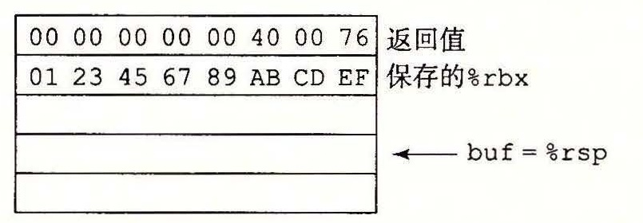
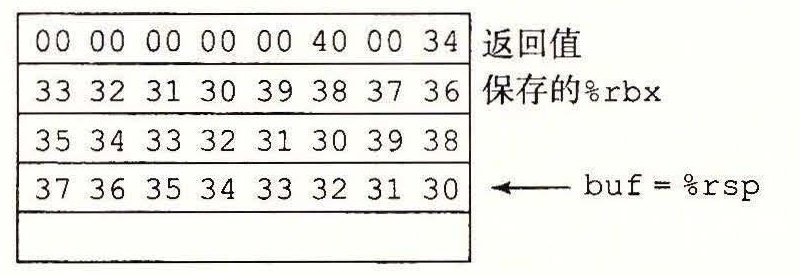

# 练习题答案

> 编校提示（非原文）：本章可唯一确定的排印错误已更正，原书记录及其他疑点见[练习题答案编校说明](../答案编校说明.md)。

## 练习题 3.1

这个练习使你熟悉各种操作数格式。

| 操作数 | 值 | 注释 |
| --- | --- | --- |
| %rax | 0x100 | 寄存器 |
| 0x104 | 0xAB | 绝对地址 |
| $0x108 | 0x108 | 立即数 |
| (%rax) | 0xFF | 地址 0x100 |
| 4(%rax) | 0xAB | 地址 0x104 |
| 9(%rax,%rdx) | 0x11 | 地址 0x10C |
| 260(%rcx,%rdx) | 0x13 | 地址 0x108 |
| 0xFC(,%rcx,4) | 0xFF | 地址 0x100 |
| (%rax,%rdx,4) | 0x11 | 地址 0x10C |

## 练习题 3.2

正如我们已经看到的，GCC 产生的汇编代码指令上有后缀，而反汇编代码没有。能够在这两种形式之间转换是一种很重要的需要学习的技能。一个重要的特性就是，x86-64 中的内存引用总是用四字长寄存器给出，例如 %rax，哪怕操作数只是一个字节、一个字或是一个双字。

这里是带后缀的代码：

```asm
movl %eax, (%rsp)
movw (%rax), %dx
movb $0xFF, %bl
movb (%rsp,%rdx,4), %dl
movq (%rdx), %rax
movw %dx, (%rax)
```

## 练习题 3.3

由于我们会依赖 GCC 来产生大多数汇编代码，所以能够写正确的汇编代码并不是一项很关键的技能。但是，这个练习会帮助你熟悉不同的指令和操作数类型。

下面给出了有错误解释的代码：

```text
movb $0xF, (%ebx)       Cannot use %ebx as address register
movl %rax, (%rsp)       Mismatch between instruction suffix and register ID
movw (%rax),4(%rsp)     Cannot have both source and destination be memory references
movb %al,%sl            No register named %sl
movq %rax,$0x123        Cannot have immediate as destination
movl %eax,%rdx          Destination operand incorrect size
movb %si, 8(%rbp)       Mismatch between instruction suffix and register ID
```

## 练习题 3.4

这个练习给你更多经验，关于不同的数据传送指令，以及它们与 C 语言的数据类型和转换规则的关系。

| src_t | dest_t | 指令 | 注释 |
| --- | --- | --- | --- |
| long | long | `movq (%rdi),%rax`；`movq %rax,(%rsi)` | 读 8 个字节；存 8 个字节 |
| char | int | `movsbl (%rdi),%eax`；`movl %eax,(%rsi)` | 将 char 转换成 int；存 4 个字节 |
| char | unsigned | `movsbl (%rdi),%eax`；`movl %eax,(%rsi)` | 将 char 转换成 int；存 4 个字节 |
| unsigned char | long | `movzbl (%rdi),%eax`；`movq %rax,(%rsi)` | 读一个字节并零扩展；存 8 个字节 |
| int | char | `movl (%rdi),%eax`；`movb %al,(%rsi)` | 读 4 个字节；存低位字节 |
| unsigned | unsigned char | `movl (%rdi),%eax`；`movb %al,(%rsi)` | 读 4 个字节；存低位字节 |
| char | short | `movsbw (%rdi),%ax`；`movw %ax,(%rsi)` | 读一个字节并符号扩展；存 2 个字节 |

## 练习题 3.5

逆向工程是一种理解系统的好方法。在此，我们想要逆转 C 编译器的效果，来确定什么样的 C 代码会得到这样的汇编代码。最好的方法是进行“模拟”，从值 x、y 和 z 开始，它们分别在指针 xp、yp 和 zp 指定的位置。于是，我们可以得到下面这样的效果：

```text
void decode1(long *xp, long *yp, long *zp)
xp in %rdi, yp in %rsi, zp in %rdx
decode1:
    movq (%rdi), %r8     Get x = *xp
    movq (%rsi), %rcx    Get y = *yp
    movq (%rdx), %rax    Get z = *zp
    movq %r8, (%rsi)     Store x at yp
    movq %rcx, (%rdx)    Store y at zp
    movq %rax, (%rdi)    Store z at xp
    ret
```

由此可以产生下面这样的 C 代码：

```c
void decode1(long *xp, long *yp, long *zp)
{
    long x = *xp;
    long y = *yp;
    long z = *zp;

    *yp = x;
    *zp = y;
    *xp = z;
}
```

## 练习题 3.6

这个练习说明了 leaq 指令的多样性，同时也让你更多地练习解读各种操作数形式。虽然在图 3-3 中有的操作数格式被划分为“内存”类型，但是并没有访存发生。

| 指令 | 结果 |
| --- | --- |
| `leaq 6(%rax),%rdx` | 6 + x |
| `leaq (%rax,%rcx),%rdx` | x + y |
| `leaq (%rax,%rcx,4),%rdx` | x + 4y |
| `leaq 7(%rax,%rax,8),%rdx` | 7 + 9x |
| `leaq 0xA(,%rcx,4),%rdx` | 10 + 4y |
| `leaq 9(%rax,%rcx,2),%rdx` | 9 + x + 2y |

## 练习题 3.7

逆向工程再次被证明是学习 C 代码和生成的汇编代码之间关系的有用方式。

解决此类型问题的最好方式是为汇编代码行加注释，说明正在执行的操作信息。下面是一个例子：

```text
long scale2(long x, long y, long z)
x in %rdi, y in %rsi, z in %rdx
scale2:
    leaq (%rdi,%rdi,4), %rax    5 * x
    leaq (%rax,%rsi,2), %rax    5 * x + 2 * y
    leaq (%rax,%rdx,8), %rax    5 * x + 2 * y + 8 * z
    ret
```

由此很容易得到缺失的表达式：

```c
long t = 5 * x + 2 * y + 8 * z;
```

## 练习题 3.8

这个练习使你有机会检验对操作数和算术指令的理解。指令序列被设计成每条指令的结果都不会影响后续指令的行为。

| 指令 | 目的 | 值 |
| --- | --- | --- |
| `addq %rcx,(%rax)` | 0x100 | 0x100 |
| `subq %rdx,8(%rax)` | 0x108 | 0xA8 |
| `imulq $16,(%rax,%rdx,8)` | 0x118 | 0x110 |
| `incq 16(%rax)` | 0x110 | 0x14 |
| `decq %rcx` | %rcx | 0x0 |
| `subq %rdx,%rax` | %rax | 0xFD |

## 练习题 3.9

这个练习使你有机会生成一点汇编代码。答案的代码由 GCC 生成。将参数 n 加载到寄存器 %ecx 中，它可以用字节寄存器 %cl 来指定 sarq 指令的移位量。使用 movl 指令看上去有点儿奇怪，因为 n 的长度是 8 字节，但是要记住只有最低位的那个字节才指示着移位量。

```text
long shift_left4_rightn(long x, long n)
x in %rdi, n in %rsi
shift_left4_rightn:
    movq %rdi, %rax    Get x
    salq $4, %rax      x <<= 4
    movl %esi, %ecx    Get n (4 bytes)
    sarq %cl, %rax     x >>= n
```

## 练习题 3.10

这个练习比较简单，因为汇编代码基本上沿用了 C 代码的结构。

```c
long t1 = x | y;
long t2 = t1 >> 3;
long t3 = ~t2;
long t4 = z-t3;
```

## 练习题 3.11

A. 这个指令用来将寄存器 %rdx 设置为 0，运用了对任意 x，x ^ x = 0 这一属性。它对应于 C 语句 x=0。

B. 将寄存器 %rdx 设置为 0 的更直接的方法是用指令 `movq $0,%rdx`。

C. 不过，汇编和反汇编这段代码，我们发现使用 xorq 的版本只需要 3 个字节，而使用 movq 的版本需要 7 个字节。其他将 %rdx 设置为 0 的方法都依赖于这样一个属性，即任何更新低位 4 字节的指令都会把高位字节设置为 0。因此，我们可以使用 `xorl %edx,%edx`（2 字节）或 `movl $0,%edx`（5 字节）。

## 练习题 3.12

我们可以简单地把 cqto 指令替换为将寄存器 %rdx 设置为 0 的指令，并且用 divq 而不是 idivq 作为我们的除法指令，得到下面的代码：

```text
void uremdiv(unsigned long x, unsigned long y,
             unsigned long *qp, unsigned long *rp)
x in %rdi, y in %rsi, qp in %rdx, rp in %rcx
1 uremdiv:
2     movq %rdx, %r8       Copy qp
3     movq %rdi, %rax      Move x to lower 8 bytes of dividend
4     movl $0, %edx        Set upper 8 bytes of dividend to 0
5     divq %rsi            Divide by y
6     movq %rax, (%r8)     Store quotient at qp
7     movq %rdx, (%rcx)    Store remainder at rp
8     ret
```

## 练习题 3.13

汇编代码不会记录程序值的类型，理解这点这很重要。相反地，不同的指令确定操作数的大小以及是有符号的还是无符号的。当从指令序列映射回 C 代码时，我们必须做一点儿侦查工作，推断程序值的数据类型。

A. 后缀 ‘l’ 和寄存器指示符表明是 32 位操作数，而比较是对补码的 `<`。我们可以推断 data_t 一定是 int。

B. 后缀 ‘w’ 和寄存器指示符表明是 16 位操作数，而比较是对补码的 `>=`。我们可以推断 data_t 一定是 short。

C. 后缀 ‘b’ 和寄存器指示符表明是 8 位操作数，而比较是对无符号数的 `<=`。我们可以推断 data_t 一定是 unsigned char。

D. 后缀 ‘q’ 和寄存器指示符表明是 64 位操作数，而比较是 `!=`，有符号、无符号和指针参数都是一样的。我们可以推断 data_t 可以是 long、unsigned long 或者某种形式的指针。

## 练习题 3.14

这道题与练习题 3.13 类似，不同的是它使用了 TEST 指令而不是 CMP 指令。

A. 后缀 ‘q’ 和寄存器指示符表明是 64 位操作数，而比较是 `>=`，一定是有符号数。我们可以推断 data_t 一定是 long。

B. 后缀 ‘w’ 和寄存器指示符表明是 16 位操作数，而比较是 `==`，这个对有符号和无符号都是一样的。我们可以推断 data_t 一定是 short 或者 unsigned short。

C. 后缀 ‘b’ 和寄存器指示符表明是 8 位操作数，而比较是针对无符号数的 `>`。我们可以推断 data_t 一定是 unsigned char。

D. 后缀 ‘l’ 和寄存器指示符表明是 32 位操作数，而比较是 `<=`。我们可以推断 data_t 一定是 int。

## 练习题 3.15

这个练习要求你仔细检查反汇编代码，并推理跳转目标的编码。同时练习十六进制运算。

A. je 指令的目标为 0x4003fc + 0x02。如原始的反汇编代码所示，这就是 0x4003fe。

```asm
4003fa: 74 02                 je     4003fe
4003fc: ff d0                 callq  *%rax
```

B. je 指令的目标是 0x400431 - 12（由于 0xf4 是 -12 的一个字节的补码表示）。正如原始的反汇编代码所示，这就是 0x400425：

```asm
40042f: 74 f4                 je     400425
400431: 5d                    pop    %rbp
```

C. 根据反汇编器产生的注释，跳转目标是绝对地址 0x400547。根据字节编码，一定在距离 pop 指令 0x2 的地址处。减去这个值就得到地址 0x400545。注意，ja 指令的编码需要 2 个字节，它一定位于地址 0x400543 处。检查原始的反汇编代码也证实了这一点：

```asm
400543: 77 02                 ja     400547
400545: 5d                    pop    %rbp
```

D. 以相反的顺序来读这些字节，我们看到目标偏移量是 0xffffff73，或者十进制数 -141。0x4005ed（nop 指令的地址）加上这个值得到地址 0x400560：

```asm
4005e8: e9 73 ff ff ff        jmpq   400560
4005ed: 90                    nop
```

## 练习题 3.16

对汇编代码写注释，并且模仿它的控制流来编写 C 代码，是理解汇编语言程序很好的第一步。本题是一个具有简单控制流的示例，给你一个检查逻辑操作实现的机会。

A. 这里是 C 代码：

```c
void goto_cond(long a, long *p) {
    if (p == 0)
        goto done;
    if (*p >= a)
        goto done;
    *p = a;
done:
    return;
}
```

B. 第一个条件分支是 && 表达式实现的一部分。如果对 p 为非空的测试失败，代码会跳过对 `a>*p` 的测试。

## 练习题 3.17

这个练习帮助你思考一个通用的翻译规则的思想以及如何应用它。

A. 转换成这种替代的形式，只需要调换一下几行代码：

```c
long gotodiff_se_alt(long x, long y) {
    long result;
    if (x < y)
        goto x_lt_y;
    ge_cnt++;
    result = x - y;
    return result;
x_lt_y:
    lt_cnt++;
    result = y - x;
    return result;
}
```

B. 在大多数情况下，可以在这两种方式中任意选择。但是原来的方法对常见的没有 else 语句的情况更好一些。对于这种情况，我们只用简单地将翻译规则修改如下：

```text
    t = test-expr;
    if (!t)
        goto done;
    then-statement
done:
```

基于这种替代规则的翻译更麻烦一些。

## 练习题 3.18

这个题目要求你完成一个嵌套的分支结构，在此你会看到如何使用翻译 if 语句的规则。大部分情况下，机器代码就是 C 代码的直接翻译。

```c
long test(long x, long y, long z) {
    long val = x+y+z;
    if (x < -3) {
        if (y < z)
            val = x*y;
        else
            val = y*z;
    } else if (x > 2)
        val = x*z;
    return val;
}
```

## 练习题 3.19

这道题巩固加强了我们计算预测错误处罚的方法。

A. 可以直接应用公式得到 T<sub>MP</sub> = 2 × (31 - 16) = 30。

B. 当预测错误时，函数会需要大概 16 + 30 = 46 个周期。

## 练习题 3.20

这道题提供了研究条件传送使用的机会。

A. 运算符是 ‘/’。可以看到这是一个通过右移实现除以 2 的 3 次幂的例子（见 2.3.7 节）。在移位 k = 3 之前，如果被除数是负数的话，必须加上偏移量 2<sup>k</sup> - 1 = 7。

B. 下面是该汇编代码加上注释的一个版本：

```text
long arith(long x)
x in %rdi
arith:
    leaq   7(%rdi), %rax    temp = x+7
    testq  %rdi, %rdi      Test x
    cmovns %rdi, %rax      If x>= 0, temp = x
    sarq   $3, %rax        result = temp >> 3 (= x/8)
    ret
```

这个程序创建一个临时值等于 x + 7，预期 x 为负，需要加偏移量时使用。cmovns 指令在当 x ≥ 0 条件成立时把这个值修改为 x，然后再移动 3 位，得到 x/8。

## 练习题 3.21

这个题目类似于练习题 3.18，除了有些条件语句是用条件数据传送实现的。虽然将这段代码装进到原始的 C 代码中看起来有些令人惧怕，但是你会发现它相当严格地遵守了翻译规则。

```c
long test(long x, long y) {
    long val = 8*x;
    if (y > 0) {
        if (x < y)
            val = y-x;
        else
            val = x&y;
    } else if (y <= -2)
        val = x+y;
    return val;
}
```

## 练习题 3.22

A. 如果构建一张使用数据类型 int 来计算的阶乘表，得到下面这样的表：

| n | n! | OK? |
| --- | --- | --- |
| 1 | 1 | Y |
| 2 | 2 | Y |
| 3 | 6 | Y |
| 4 | 24 | Y |
| 5 | 120 | Y |
| 6 | 720 | Y |
| 7 | 5 040 | Y |
| 8 | 40 320 | Y |
| 9 | 362 880 | Y |
| 10 | 3 628 800 | Y |
| 11 | 39 916 800 | Y |
| 12 | 479 001 600 | Y |
| 13 | 1 932 053 504 | N |

我们可以看到，计算 13! 溢出了。正如在练习题 2.35 中学到的那样，还可以通过计算 x/n，看它是否等于 (n - 1)! 来测试 n! 的计算是否溢出了（假设我们已经能够保证 (n - 1)! 的计算没有溢出）。在此处，我们得到 1 932 053 504/13 = 161 004 458.667。另外有个测试方法，可以看到 10! 以上的阶乘数都必须是 100 的倍数，因此最后两位数字必然是 0。13! 的正确值应该是 6 227 020 800。

B. 用数据类型 long 来计算，直到 21! 才溢出；20! 的值为 2 432 902 008 176 640 000。

## 练习题 3.23

编译循环产生的代码可能会很难分析，因为编译器对循环代码可以执行许多不同的优化，也因为可能很难把程序变量和寄存器匹配起来。这个特殊的例子展示了几个汇编代码不仅仅是 C 代码直接翻译的地方。

A. 虽然参数 x 通过寄存器 %rdi 传递给函数，可以看到一旦进入循环就再也没有引用过该寄存器了。相反，我们看到第 2～5 行上寄存器 %rax、%rcx 和 %rdx 分别被初始化为 x、x*x 和 x+x。因此可以推断，这些寄存器包含着程序变量。

B. 编译器认为指针 p 总是指向 x，因此表达式 `(*p)++` 就能够实现 x 加一。代码通过第 7 行的 leaq 指令，把这个加一和加 y 组合起来。

C. 添加了注释的代码如下：

```text
long dw_loop(long x)
x initially in %rdi
 1 dw_loop:
 2     movq  %rdi, %rax             Copy x to %rax
 3     movq  %rdi, %rcx
 4     imulq %rdi, %rcx             Compute y = x*x
 5     leaq  (%rdi,%rdi), %rdx      Compute n = 2*x
 6 .L2:                        loop:
 7     leaq  1(%rcx,%rax), %rax     Compute x += y + 1
 8     subq  $1, %rdx               Decrement n
 9     testq %rdx, %rdx             Test n
10     jg    .L2                    If > 0, goto loop
11     rep; ret                     Return
```

## 练习题 3.24

这个汇编代码是用跳转到中间方法对循环的相当直接的翻译。完整的 C 代码如下：

```c
long loop_while(long a, long b)
{
    long result = 1;
    while (a < b) {
        result = result * (a+b);
        a = a+1;
    }
    return result;
}
```

## 练习题 3.25

这个汇编代码没有完全遵循 guarded-do 翻译的模式，可以看到它等价于下面的 C 代码：

```c
long loop_while2(long a, long b)
{
    long result = b;
    while (b > 0) {
        result = result * a;
        b = b-a;
    }
    return result;
}
```

我们会经常看到这样的情况，特别是用较高优化等级编译时，此时 GCC 会自作主张地修改生成代码的格式，同时又保留所要求的功能。

## 练习题 3.26

能够从汇编代码工作回 C 代码，是逆向工程的一个主要例子。

A. 可以看到这段代码使用的是跳转到中间翻译方法，在第 3 行使用了 jmp 指令。

B. 下面是原始的 C 代码：

```c
long fun_a(unsigned long x) {
    long val = 0;
    while (x) {
        val ^= x;
        x >>= 1;
    }
    return val & 0x1;
}
```

C. 这个代码计算参数 x 的奇偶性。也就是，如果 x 中有奇数个 1，就返回 1，如果有偶数个 1，就返回 0。

## 练习题 3.27

这道练习题意在加强你对如何实现循环的理解。

```c
long fact_for_gd_goto(long n)
{
    long i = 2;
    long result = 1;
    if (n <= 1)
        goto done;
loop:
    result *= i;
    i++;
    if (i <= n)
        goto loop;
done:
    return result;
}
```

## 练习题 3.28

这个问题比练习题 3.26 要难一些，因为循环中的代码更复杂，而整个操作也不那么熟悉。

A. 以下是原始的 C 代码：

```c
long fun_b(unsigned long x) {
    long val = 0;
    long i;
    for (i = 64; i != 0; i--) {
        val = (val << 1) | (x & 0x1);
        x >>= 1;
    }
    return val;
}
```

B. 这段代码是用 guarded-do 变换生成的，但是编译器发现因为 i 初始化成了 64，所以一定会满足测试 i ≠ 0，因此初始的测试是没必要的。

C. 这段代码把 x 中的位反过来，创造一个镜像。实现的方法是：将 x 的位从左往右移，然后再填入这些位，就像是把 val 从右往左移。

## 练习题 3.29

我们把 for 循环翻译成 while 循环的规则有些过于简单——这是唯一需要特殊考虑的方面。

A. 使用我们的翻译规则会得到下面的代码：

```c
/* Naive translation of for loop into while loop */
/* WARNING: This is buggy code */
long sum = 0;
long i = 0;
while (i < 10) {
    if (i & 1)
        /* This will cause an infinite loop */
        continue;
    sum += i;
    i++;
}
```

因为 continue 语句会阻止索引变量 i 被修改，所以这段代码是无限循环。

B. 通用的解决方法是用 goto 语句替代 continue 语句，它会跳过循环体中余下的部分，直接跳到 update 部分：

```c
/* Correct translation of for loop into while loop */
long sum = 0;
long i = 0;
while (i < 10) {
    if (i & 1)
        goto update;
    sum += i;
update:
    i++;
}
```

## 练习题 3.30

这个练习给你一个机会，推算出 switch 语句的控制流。要求你将汇编代码中的多处信息综合起来回答这些问题：

- 汇编代码的第 2 行将 x 加上 1，将情况（cases）的下界设置成 0。这就意味着最小的情况标号为 -1。
- 当调整过的情况值大于 8 时，第 3 行和第 4 行会导致程序跳转到默认情况。这就意味着最大情况标号为 -1 + 8 = 7。
- 在跳转表中，我们看到第 6 行的表项（情况值 3）与第 9 行的表项（情况值 6）都以第 4 行的跳转指令作为同样的目标（.L2），表明这是默认的情况行为。因此，在 switch 语句体中缺失了情况标号 3 和 6。
- 在跳转表中，我们看到第 3 行和第 10 行上的表项有相同的目的。这对应于情况标号 0 和 7。
- 在跳转表中，我们看到第 5 行和第 7 行上的表项有相同的目的。这对应于情况标号 2 和 4。

从上述推理，我们得出如下结论：

A. switch 语句体中的情况标号值为 -1、0、1、2、4、5 和 7。

B. 目标为 .L5 的情况标号为 0 和 7。

C. 目标为 .L7 的情况标号为 2 和 4。

## 练习题 3.31

逆向工程编译出 switch 语句，关键是将来自汇编代码和跳转表的信息结合起来，理清不同的情况。从 ja 指令（第 3 行）可知，默认情况的代码的标号是 .L2。我们可以看到，跳转表中只有另一个标号重复出现，就是 .L5，因此它一定是情况 C 和 D 的代码。代码在第 8 行落入下面的情况，因而标号 .L7 符合情况 A，标号 .L3 符合情况 B。只剩下标号 .L6，符合情况 E。

原始的 C 代码如下：

```c
void switcher(long a, long b, long c, long *dest)
{
    long val;
    switch(a) {
    case 5:
        c = b ^ 15;
        /* Fall through */
    case 0:
        val = c + 112;
        break;
    case 2:
    case 7:
        val = (c + b) << 2;
        break;
    case 4:
        val = a;
        break;
    default:
        val = b;
    }
    *dest = val;
}
```

## 练习题 3.32

追踪此等级上的程序的执行有助于理解过程调用和返回的很多方面。可以明确看到调用时控制是怎么传给过程的以及返回时调用函数如何继续执行的。还可以看到参数通过寄存器 %rdi 和 %rsi 传递，结果通过寄存器 %rax 返回。

| 指令 标号 | 指令 PC | 指令 | 状态值（指令开始执行前）%rdi | %rsi | %rax | %rsp | *%rsp | 描述 |
| --- | --- | --- | --- | --- | --- | --- | --- | --- |
| M1 | 0x400560 | callq | 10 | — | — | 0x7fffffffe820 | — | 调用 first(10) |
| F1 | 0x400548 | lea | 10 | — | — | 0x7fffffffe818 | 0x400565 | first 的入口 |
| F2 | 0x40054c | sub | 10 | 11 | — | 0x7fffffffe818 | 0x400565 | |
| F3 | 0x400550 | callq | 9 | 11 | — | 0x7fffffffe818 | 0x400565 | 调用 last(9,11) |
| L1 | 0x400540 | mov | 9 | 11 | — | 0x7fffffffe810 | 0x400555 | last 的入口 |
| L2 | 0x400543 | imul | 9 | 11 | 9 | 0x7fffffffe810 | 0x400555 | |
| L3 | 0x400547 | retq | 9 | 11 | 99 | 0x7fffffffe810 | 0x400555 | 从 last 返回 99 |
| F4 | 0x400555 | repz retq | 9 | 11 | 99 | 0x7fffffffe818 | 0x400565 | 从 first 返回 99 |
| M2 | 0x400565 | mov | 9 | 11 | 99 | 0x7fffffffe820 | — | 继续执行 main |

## 练习题 3.33

由于是多种数据大小混合在一起，这道题有点儿难。

让我们先描述第一种答案，再解释第二种可能性。如果假设第一个加（第 3 行）实现 `*u+=a`，第二个加（第 4 行）实现 `*v+=b`，然后我们可以看到 a 通过 %edi 作为第一个参数传递，把它从 4 个字节转换成 8 个字节，再加到 %rdx 指向的 8 个字节上。这就意味着 a 必定是 int 类型，u 一定是 long * 类型。还可以看到参数 b 的低位字节被加到了 %rcx 指向的字节。这就意味着 v 一定是 char *，但是 b 的类型是不确定的——它的大小可以是 1、2、4 或 8 字节。注意到返回值为 6 就能解决这种不确定性，这个返回值是 a 和 b 大小的和。因为我们知道 a 的大小是 4 字节，所以可以推断出 b 一定是 2 字节的。

该函数的一个加了注释的版本解释了这些细节：

```text
int procprob(int a, short b, long *u, char *v)
a in %edi, b in %si, u in %rdx, v in %rcx
1 procprob:
2     movslq %edi, %rdi      Convert a to long
3     addq   %rdi, (%rdx)    Add to *u (long)
4     addb   %sil, (%rcx)    Add low-order byte of b to *v
5     movl   $6, %eax        Return 4+2
6     ret
```

此外，我们可以看到如果以它们在 C 代码中出现相反的顺序在汇编代码中计算这两个和，这段汇编代码同样合法。这会导致交换参数 a 和 b，参数 u 和 v，得到如下原型：

```c
int procprob(int b, short a, long *v, char *u);
```

## 练习题 3.34

这个例子展示了被调用者保存寄存器的使用，以及保存局部数据的栈的使用。

A. 可以看到第 9～14 行将局部值 a0～a5 分别保存进被调用者保存寄存器 %rbx、%r15、%r14、%r13、%r12 和 %rbp。

B. 局部值 a6 和 a7 存放在栈中相对于栈指针偏移量为 0 和 8 的地方（第 16 和 18 行）。

C. 在存储完 6 个局部变量之后，这个程序用完了所有的被调用者保存寄存器，所以剩下的两个值保存在栈上。

## 练习题 3.35

这道题给了一个检查递归函数代码的机会。要学的一个很重要的内容就是，递归代码与我们看到的其他函数的结构一模一样。栈和寄存器保存规则足以让递归函数正确执行。

A. 寄存器 %rbx 保存参数 x 的值，所以它可以被用来计算结果表达式。

B. 汇编代码是由下面的 C 代码产生而来的：

```c
long rfun(unsigned long x) {
    if (x == 0)
        return 0;
    unsigned long nx = x>>2;
    long rv = rfun(nx);
    return x + rv;
}
```

## 练习题 3.36

这个练习测试你对数据大小和数组索引的理解。注意，任何类型的指针都是 8 个字节长。short 数据类型需要 2 个字节，而 int 需要 4 个。

| 数组 | 元素大小 | 总大小 | 起始地址 | 元素 i |
| --- | --- | --- | --- | --- |
| S | 2 | 14 | x<sub>S</sub> | x<sub>S</sub> + 2i |
| T | 8 | 24 | x<sub>T</sub> | x<sub>T</sub> + 8i |
| U | 8 | 48 | x<sub>U</sub> | x<sub>U</sub> + 8i |
| V | 4 | 32 | x<sub>V</sub> | x<sub>V</sub> + 4i |
| W | 8 | 32 | x<sub>W</sub> | x<sub>W</sub> + 8i |

## 练习题 3.37

这个练习是关于整数数组 E 的练习的一个变形。理解指针与指针指向的对象之间的区别是很重要的。因为数据类型 short 需要 2 个字节，所以所有的数组索引都将乘以因子 2。前面我们用的是 movl，现在用的则是 movw。

| 表达式 | 类型 | 值 | 汇编语句 |
| --- | --- | --- | --- |
| S+1 | short* | x<sub>S</sub> + 2 | `leaq 2(%rdx),%rax` |
| S[3] | short | M[x<sub>S</sub> + 6] | `movw 6(%rdx),%ax` |
| &S[i] | short* | x<sub>S</sub> + 2i | `leaq (%rdx,%rcx,2),%rax` |
| S[4*i+1] | short | M[x<sub>S</sub> + 8i + 2] | `movw 2(%rdx,%rcx,8),%ax` |
| S+i-5 | short* | x<sub>S</sub> + 2i - 10 | `leaq -10(%rdx,%rcx,2),%rax` |

## 练习题 3.38

这个练习要求你完成缩放操作，来确定地址的计算，并且应用行优先索引的公式（3.1）。第一步是注释汇编代码，来确定如何计算地址引用：

```text
long sum_element(long i, long j)
i in %rdi, j in %rsi
1 sum_element:
2     leaq 0(,%rdi,8), %rdx       Compute 8i
3     subq %rdi, %rdx             Compute 7i
4     addq %rsi, %rdx             Compute 7i + j
5     leaq (%rsi,%rsi,4), %rax    Compute 5j
6     addq %rax, %rdi             Compute i + 5j
7     movq Q(,%rdi,8), %rax       Retrieve M[x_Q + 8 (5j + i)]
8     addq P(,%rdx,8), %rax       Add M[x_P + 8 (7i + j)]
9     ret
```

我们可以看出，对矩阵 P 的引用是在字节偏移 8 × (7i + j) 的地方，而对矩阵 Q 的引用是在字节偏移 8 × (5j + i) 的地方。由此我们可以确定 P 有 7 列，而 Q 有 5 列，得到 M = 5 和 N = 7。

## 练习题 3.39

这些计算是公式（3.1）的直接应用：

- 对于 L = 4，C = 16 和 j = 0，指针 Aptr 等于 x<sub>A</sub> + 4 × (16i + 0) = x<sub>A</sub> + 64i。
- 对于 L = 4，C = 16，i = 0 和 j = k，指针 Bptr 等于 x<sub>B</sub> + 4 × (16 × 0 + k) = x<sub>B</sub> + 4k。
- 对于 L = 4，C = 16，i = 16 和 j = k，Bend 等于 x<sub>B</sub> + 4 × (16 × 16 + k) = x<sub>B</sub> + 1024 + 4k。

## 练习题 3.40

这个练习要求你能够研究编译产生的汇编代码，了解执行了哪些优化。在这个情况中，编译器做一些聪明的优化。

让我们先来研究一下 C 代码，然后看看如何从为原始函数产生的汇编代码推导出这个 C 代码。

```c
/* Set all diagonal elements to val */
void fix_set_diag_opt(fix_matrix A, int val) {
    int *Abase = &A[0][0];
    long i = 0;
    long iend = N*(N+1);
    do {
        Abase[i] = val;
        i += (N+1);
    } while (i != iend);
}
```

这个函数引入了一个变量 Abase，int * 类型的，指向数组 A 的起始位置。这个指针指向一个 4 字节整数序列，这个序列由按照行优先顺序存放的 A 的元素组成。我们引入一个整数变量 index，它一步一步经过 A 的对角线，它有一个属性，那就是对角线元素 i 和 i + 1 在序列中相隔 N + 1 个元素，而且一旦我们到达对角线元素 N（索引为 N(N + 1)），我们就超出了边界。

实际的汇编代码遵循这样的通用格式，但是现在指针的增加必须乘以因子 4。我们将寄存器 %rax 标记为存放值 index4，等于 C 版本中的 index，但是使用因子 4 进行伸缩。对于 N = 16，我们可以看到对于 index4 的停止点会是 4 · 16(16 + 1) = 1088。

```text
1 fix_set_diag:
  void fix_set_diag(fix_matrix A, int val)
  A in %rdi, val in %rsi
2     movl $0, %eax                 Set index4 = 0
3 .L13:                        loop:
4     movl %esi, (%rdi,%rax)        Set Abase[index4/4] to val
5     addq $68, %rax                Increment index4 += 4(N+1)
6     cmpq $1088, %rax              Compare index4: 4N(N+1)
7     jne  .L13                    If !=, goto loop
8     rep; ret                      Return
```

## 练习题 3.41

这个练习让你思考结构的布局，以及用来访问结构字段的代码。该结构声明是书中所示例子的一个变形。它表明嵌套的结构的分配是将内层结构嵌入到外层结构之中。

A. 该结构的布局图如下：

```text
偏移 0               8       12      16              24
     +---------------+-------+-------+---------------+
内容 |       p       |  s.x  |  s.y  |     next      |
     +---------------+-------+-------+---------------+
```

B. 它使用了 24 个字节。

C. 同平时一样，我们从给汇编代码加注释开始：

```text
void sp_init(struct prob *sp)
sp in %rdi
1 sp_init:
2     movl 12(%rdi), %eax    Get sp->s.y
3     movl %eax, 8(%rdi)     Save in sp->s.x
4     leaq 8(%rdi), %rax     Compute &(sp->s.x)
5     movq %rax, (%rdi)      Store in sp->p
6     movq %rdi, 16(%rdi)    Store sp in sp->next
7     ret
```

由此可以产生如下 C 代码：

```c
void sp_init(struct prob *sp)
{
    sp->s.x  = sp->s.y;
    sp->p    = &(sp->s.x);
    sp->next = sp;
}
```

## 练习题 3.42

这道题说明了一个非常普通的数据结构和对它的操作时如何在机器代码中实现。要解答这些问题，还是先对汇编代码加注释，确认出该结构的两个字段分别在偏移量 0（字段 v）和 8（字段 p）处。

```text
long fun(struct ELE *ptr)
ptr in %rdi
 1 fun:
 2     movl  $0, %eax         result = 0
 3     jmp   .L2             Goto middle
 4 .L3:                   loop:
 5     addq  (%rdi), %rax     result += ptr->v
 6     movq  8(%rdi), %rdi    ptr = ptr->p
 7 .L2:                   middle:
 8     testq %rdi, %rdi      Test ptr
 9     jne   .L3             If != NULL, goto loop
10     rep; ret
```

A. 根据加了注释的代码，可以得到 C 语言：

```c
long fun(struct ELE *ptr) {
    long val = 0;
    while (ptr) {
        val += ptr->v;
        ptr = ptr->p;
    }
    return val;
}
```

B. 可以看到每个结构都是一个单链表中的元素，字段 v 是元素的值，字段 p 是指向下一个元素的指针。函数 fun 计算列表中元素值的和。

## 练习题 3.43

结构和联合涉及的概念很简单，但是需要练习来习惯不同的引用模式和它们的实现。

| 表达式 | 类型 | 代码 |
| --- | --- | --- |
| up->t1.u | long | `movq (%rdi),%rax`；`movq %rax,(%rsi)` |
| up->t1.v | short | `movw 8(%rdi),%ax`；`movw %ax,(%rsi)` |
| &up->t1.w | char* | `addq $10,%rdi`；`movq %rdi,(%rsi)` |
| up->t2.a | int* | `movq %rdi,(%rsi)` |
| up->t2.a[up->t1.u] | int | `movq (%rdi),%rax`；`movl (%rdi,%rax,4),%eax`；`movl %eax,(%rsi)` |
| *up->t2.p | char | `movq 8(%rdi),%rax`；`movb (%rax),%al`；`movb %al,(%rsi)` |

## 练习题 3.44

想理解各种数据结构需要多少存储，以及编译器为访问这些结构产生的代码，理解结构的布局和对齐是非常重要的。这个练习让你看清楚一些示例结构的细节。

A. `struct P1 { int i; char c; int j; char d; };`

| i | c | j | d | 总共 | 对齐 |
| --- | --- | --- | --- | --- | --- |
| 0 | 4 | 8 | 12 | 16 | 4 |

B. `struct P2 { int i; char c; char d; long j; };`

| i | c | d | j | 总共 | 对齐 |
| --- | --- | --- | --- | --- | --- |
| 0 | 4 | 5 | 8 | 16 | 8 |

C. `struct P3 { short w[3]; char c[3]; };`

| w | c | 总共 | 对齐 |
| --- | --- | --- | --- |
| 0 | 6 | 10 | 2 |

D. `struct P4 { short w[5]; char *c[3]; };`

| w | c | 总共 | 对齐 |
| --- | --- | --- | --- |
| 0 | 16 | 40 | 8 |

E. `struct P5 { struct P3 a[2]; struct P2 t; };`

| a | t | 总共 | 对齐 |
| --- | --- | --- | --- |
| 0 | 24 | 40 | 8 |

## 练习题 3.45

这是一个理解结构的布局和对齐的练习。

A. 这里是对象大小和字节偏移量：

| 字段 | a | b | c | d | e | f | g | h |
| --- | --- | --- | --- | --- | --- | --- | --- | --- |
| 大小 | 8 | 2 | 8 | 1 | 4 | 1 | 8 | 4 |
| 偏移量 | 0 | 8 | 16 | 24 | 28 | 32 | 40 | 48 |

B. 这个结构一共是 56 个字节长。结构的结尾必须填充 4 个字节来满足 8 字节对齐的要求。

C. 当所有的数据元素的长度都是 2 的幂时，一种行之有效的策略是按照大小的降序排列结构的元素。导致声明如下：

```c
struct {
    char   *a;
    double  c;
    long    g;
    float   e;
    int     h;
    short   b;
    char    d;
    char    f;
} rec;
```

得到的偏移量如下：

| 字段 | a | c | g | e | h | b | d | f |
| --- | --- | --- | --- | --- | --- | --- | --- | --- |
| 大小 | 8 | 8 | 8 | 4 | 4 | 2 | 1 | 1 |
| 偏移量 | 0 | 8 | 16 | 24 | 28 | 32 | 34 | 35 |

这个结构要填充 4 个字节以满足 8 字节对齐的要求，所以总共是 40 个字节。

## 练习题 3.46

这个问题覆盖的话题比较广泛，例如栈帧、字符串表示、ASCII 码和字节顺序。它说明了越界的内存引用的危险性，以及缓冲区溢出背后的基本思想。

A. 执行了第 3 行后的栈：



B. 执行了第 5 行后的栈：



C. 这个程序试图返回到地址 0x040034。低位 2 字节被字符 ‘4’ 和结尾的空（null）字符覆盖了。

D. 寄存器 %rbx 的保存值被设置为 0x3332313039383736。在 get_line 返回前，这个值会被加载回这个寄存器中。

E. 对 malloc 的调用应该以 strlen(buf) + 1 作为它的参数，而且代码还应该检查返回值是否为 NULL。

## 练习题 3.47

A. 这对应于大约 2¹³ 个地址的范围。

B. 每次尝试，一个 128 字节的空操作 sled 会覆盖 2⁷ 个地址，因此我们只需要 2⁶ = 64 次尝试。

这个例子明确地表明了这个版本的 Linux 中的随机化程度只能很小地阻挡溢出攻击。

## 练习题 3.48

这道题让你看看 x86-64 代码如何管理栈，也让你更好地理解如何防卫缓冲区溢出攻击。

A. 对于没有保护的代码，第 4 行和第 5 行计算 v 和 buf 的地址为相对于 %rsp 偏移量为 24 和 0。在有保护的代码中，金丝雀被存放在偏移量为 40 的地方（第 4 行），而 v 和 buf 在偏移量为 8 和 16 的地方（第 7 行和第 8 行）。

B. 在有保护的代码中，局部变量 v 比 buf 更靠近栈顶，因此 buf 溢出就不会破坏 v 的值。

## 练习题 3.49

这段代码中包含许多我们已经见到过的执行位级运算的技巧。要仔细研究才能看得懂。

A. 第 5 行的 leaq 指令计算值 8n + 22，然后第 6 行的 andq 指令把它向下舍入到最接近的 16 的倍数。当 n 是奇数时，结果值会是 8n + 8，当 n 是偶数时，结果值会是 8n + 16；用 s<sub>1</sub> 减去这个值就得到 s<sub>2</sub>。

B. 该序列中的三条指令将 s<sub>2</sub> 舍入到最近的 8 的倍数。它们利用了 2.3.7 节中实现除以 2 的幂用到的偏移和移位的组合。

C. 这两个例子可以看做最小化和最大化 e<sub>1</sub> 和 e<sub>2</sub> 的情况。

| n | s<sub>1</sub> | s<sub>2</sub> | p | e<sub>1</sub> | e<sub>2</sub> |
| --- | --- | --- | --- | --- | --- |
| 5 | 2065 | 2017 | 2024 | 1 | 7 |
| 6 | 2064 | 2000 | 2000 | 16 | 0 |

D. 可以看到 s<sub>2</sub> 的计算方式会保留 s<sub>1</sub> 的偏移量为最接近的 16 的倍数。还可以看到 p 会以 8 的倍数对齐，正是对 8 字节元素数组建议使用的。

## 练习题 3.50

这道题要求你仔细检查代码，小心留意使用的转换和数据传送指令。可以看到取出的值和转换的情况如下：

- 取出位于 dp 的值，转换成 int（第 4 行），再存储到 ip。因此可以推断出 val1 是 d。
- 取出位于 ip 的值，转换成 float（第 6 行），再存储到 fp。因此可以推断出 val2 是 i。
- l 的值被转换成 double（第 8 行），并存储在 dp。因此可以推断出 val3 是 l。
- 第 3 行上取出位于 fp 的值。第 10 和 11 行的两条指令把它转换为双精度，值通过寄存器 %xmm0 返回。因此可以推断出 val4 是 f。

## 练习题 3.51

可以通过从图 3-47 和图 3-48 中选择适当的条目或者使用在浮点格式间转换的代码序列来处理这些情况。

| T<sub>x</sub> | T<sub>y</sub> | 指令 |
| --- | --- | --- |
| long | double | `vcvtsi2sdq %rdi,%xmm0,%xmm0` |
| double | int | `vcvttsd2si %xmm0,%eax` |
| double | float | `vunpcklpd %xmm0,%xmm0,%xmm0`；`vcvtpd2ps %xmm0,%xmm0` |
| long | float | `vcvtsi2ssq %rdi,%xmm0,%xmm0` |
| float | long | `vcvttss2siq %xmm0,%rax` |

## 练习题 3.52

映射参数到寄存器的基本规则非常简单（虽然随着有更多类型的参数出现，这些规则也变得越来越复杂 [77]）。

A. `double g1(double a, long b, float c, int d);`

寄存器：a 在 %xmm0 中，b 在 %rdi 中，c 在 %xmm1 中，d 在 %esi 中

B. `double g2(int a, double *b, float *c, long d);`

寄存器：a 在 %edi 中，b 在 %rsi 中，c 在 %rdx 中，d 在 %rcx 中

C. `double g3(double *a, double b, int c, float d);`

寄存器：a 在 %rdi 中，b 在 %xmm0 中，c 在 %esi 中，d 在 %xmm1 中

D. `double g4(float a, int *b, float c, double d);`

寄存器：a 在 %xmm0 中，b 在 %rdi 中，c 在 %xmm1 中，d 在 %xmm2 中

## 练习题 3.53

从这段汇编代码可以看出有两个整数参数，通过寄存器 %rdi 和 %rsi 传递，将其命名为 i1 和 i2。类似地，有两个浮点参数，通过寄存器 %xmm0 和 %xmm1 传递，将其命名为 f1 和 f2。

然后给汇编代码加注释：

```text
Refer to arguments as i1 (%rdi), i2 (%rsi)
                     f1 (%xmm0), and f2 (%xmm1)

double funct1(arg1_t p, arg2_t q, arg3_t r, arg4_t s)
1 funct1:
2     vcvtsi2ssq %rsi, %xmm2, %xmm2     Get i2 and convert from long to float
3     vaddss     %xmm0, %xmm2, %xmm0    Add f1 (type float)
4     vcvtsi2ss  %edi, %xmm2, %xmm2     Get i1 and convert from int to float
5     vdivss     %xmm0, %xmm2, %xmm0    Compute i1 / (i2 + f1)
6     vunpcklps  %xmm0, %xmm0, %xmm0
7     vcvtps2pd  %xmm0, %xmm0          Convert to double
8     vsubsd     %xmm1, %xmm0, %xmm0    Compute i1 / (i2 + f1) - f2 (double)
9     ret
```

由此可以看出这段代码计算值 i1/(i2+f1)-f2。还可以看到，i1 的类型为 int，i2 的类型为 long，f1 的类型为 float，而 f2 的类型为 double。将参数匹配到命名的值只有一个不确定的地方，来自于加法的交换性——得到两种可能的结果：

```c
double funct1a(int p, float q, long r, double s);
double funct1b(int p, long q, float r, double s);
```

## 练习题 3.54

一步步梳理汇编代码，确定每一步计算什么，就很容易找到这道题的答案，如下面的注释所示：

```text
double funct2(double w, int x, float y, long z)
w in %xmm0, x in %edi, y in %xmm1, z in %rsi
1 funct2:
2     vcvtsi2ss  %edi, %xmm2, %xmm2     Convert x to float
3     vmulss     %xmm1, %xmm2, %xmm1    Multiply by y
4     vunpcklps  %xmm1, %xmm1, %xmm1
5     vcvtps2pd  %xmm1, %xmm2          Convert x*y to double
6     vcvtsi2sdq %rsi, %xmm1, %xmm1     Convert z to double
7     vdivsd     %xmm1, %xmm0, %xmm0    Compute w/z
8     vsubsd     %xmm0, %xmm2, %xmm0    Subtract from x*y
9     ret                              Return
```

可以从分析得出结论，该函数计算 y*x-w/z。

## 练习题 3.55

这道题使用的推理与推断标号 .LC2 处声明的数字是 1.8 的编码一样，不过例子更简单。

我们看到两个值分别是 0 和 1077936128（0x40400000）。从高位字节可以抽取出指数字段 0x404（1028），减去偏移量 1023 得到指数为 5。连接两个值的小数位，得到小数字段为 0，加上隐含的开头的 1，得到 1.0。因此这个常数是 1.0 × 2⁵ = 32.0。

## 练习题 3.56

A. 在此可以看到从地址 .LC1 开始的 16 个字节是一个掩码，它的低 8 个字节是全 1，除了最高位，这是双精度值的符号位。计算这个掩码和 %xmm0 的 AND 值时，会清除 x 的符号位，得到绝对值。实际上，定义 EXPR(x) 为 fabs(x) 就能得到这段代码，fabs 是在 `<math.h>` 中定义的。

B. 可以看到 vxorpd 指令将整个寄存器设置为 0，所以这是一种产生浮点常数 0.0 的方法。

C. 可以看到从地址 .LC2 开始的 16 个字节是一个掩码，它只有一个 1 位，位于 XMM 寄存器中低位数值的符号位。计算这个掩码与 %xmm0 的 EXCLUSIVE-OR 值时，会改变 x 符号的值，计算出表达式 -x。

## 练习题 3.57

同样地，为代码加注释，包括处理条件分支：

```text
double funct3(int *ap, double b, long c, float *dp)
ap in %rdi, b in %xmm0, c in %rsi, dp in %rdx
 1 funct3:
 2     vmovss     (%rdx), %xmm1            Get d = *dp
 3     vcvtsi2sd  (%rdi), %xmm2, %xmm2     Get a = *ap and convert to double
 4     vucomisd   %xmm2, %xmm0            Compare b:a
 5     jbe        .L8                      If <=, goto lesseq
 6     vcvtsi2ssq %rsi, %xmm0, %xmm0      Convert c to float
 7     vmulss     %xmm1, %xmm0, %xmm1     Multiply by d
 8     vunpcklps  %xmm1, %xmm1, %xmm1
 9     vcvtps2pd  %xmm1, %xmm0           Convert to double
10     ret                                 Return
11 .L8:                                lesseq:
12     vaddss     %xmm1, %xmm1, %xmm1     Compute d+d = 2.0 * d
13     vcvtsi2ssq %rsi, %xmm0, %xmm0      Convert c to float
14     vaddss     %xmm1, %xmm0, %xmm0     Compute c + 2*d
15     vunpcklps  %xmm0, %xmm0, %xmm0
16     vcvtps2pd  %xmm0, %xmm0           Convert to double
17     ret                                 Return
```

由此，可以写出 funct3 的代码如下：

```c
double funct3(int *ap, double b, long c, float *dp) {
    int a = *ap;
    float d = *dp;
    if (a < b)
        return c*d;
    else
        return c+2*d;
}
```
