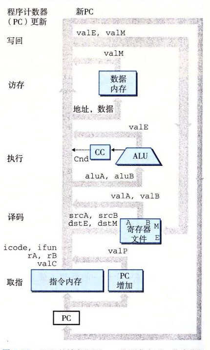
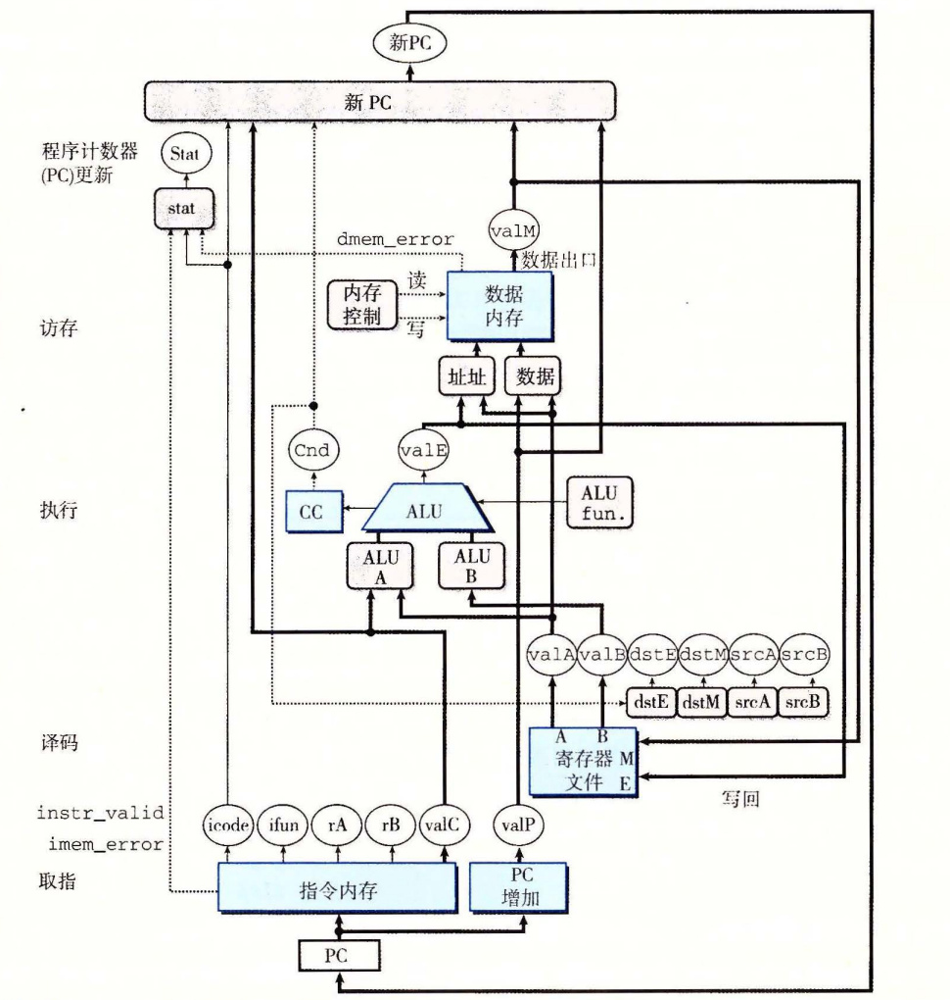

# 4.3.2 SEQ 硬件结构

实现所有 Y86-64 指令所需要的计算可以被组织成 6 个基本阶段：取指、译码、执行、访存、写回和更新 PC。图 4-22 给出了一个能执行这些计算的硬件结构的抽象表示。程序计数器放在寄存器中，在图中左下角（标明为“PC”）。然后，信息沿着线流动（多条线组合在一起就用宽一点的灰线来表示），先向上，再向右。同各个阶段相关的硬件单元（hardware units）负责执行这些处理。在右边，反馈线路向下，包括要写到寄存器文件的更新值，以及更新的程序计数器值。正如在 4.3.3 节中讨论的那样，在 SEQ 中，所有硬件单元的处理都在一个时钟周期内完成。这张图省略了一些小的组合逻辑块，还省略了所有用来操作各个硬件单元以及将相应的值路由到这些单元的控制逻辑。稍后会补充这些细节。我们从下往上画处理器和流程的方法似乎有点奇怪。在开始设计流水线化的处理器时，我们会解释这么画的原因。

*图 4-22　SEQ 的抽象视图，一种顺序实现。指令执行过程中的信息处理沿着顺时针方向的流程进行，从用程序计数器（PC）取指令开始，如图中左下角所示*

硬件单元与各个处理阶段相关联：

- **取指：** 将程序计数器寄存器作为地址，指令内存读取指令的字节。PC 增加器（PC incrementer）计算 `valP`，即增加了的程序计数器。
- **译码：** 寄存器文件有两个读端口 A 和 B，从这两个端口同时读寄存器值 `valA` 和 `valB`。
- **执行：** 执行阶段会根据指令的类型，将算术/逻辑单元（ALU）用于不同的目的。对整数操作，它要执行指令所指定的运算。对其他指令，它会作为一个加法器来计算增加或减少栈指针，或者计算有效地址，或者只是简单地加 0，将一个输入传递到输出。

条件码寄存器（CC）有三个条件码位。ALU 负责计算条件码的新值。当执行条件传送指令时，根据条件码和传送条件来计算决定是否更新目标寄存器。同样，当执行一条跳转指令时，会根据条件码和跳转类型来计算分支信号 `Cnd`。

- **访存：** 在执行访存操作时，数据内存读出或写入一个内存字。指令和数据内存访问的是相同的内存位置，但是用于不同的目的。
- **写回：** 寄存器文件有两个写端口。端口 E 用来写 ALU 计算出来的值，而端口 M 用来写从数据内存中读出的值。
- **PC 更新：** 程序计数器的新值选择自：`valP`，下一条指令的地址；`valC`，调用指令或跳转指令指定的目标地址；`valM`，从内存读取的返回地址。

图 4-23 更详细地给出了实现 SEQ 所需要的硬件（分析每个阶段时，我们会看到完整的细节）。我们看到一组和前面一样的硬件单元，但是现在线路看得更清楚了。这幅图以及其他的硬件图都使用的是下面的画图惯例。

*图 4-23　SEQ 的硬件结构，一种顺序实现。有些控制信号以及寄存器和控制字连接没有画出来*

- 白色方框表示时钟寄存器。程序计数器 PC 是 SEQ 中唯一的时钟寄存器。
- 浅蓝色方框表示硬件单元。这包括内存、ALU 等等。在我们所有的处理器实现中，都会使用这一组基本的单元。我们把这些单元当作“黑盒子”，不关心它们的细节设计。
- 控制逻辑块用灰色圆角矩形表示。这些块用来从一组信号源中进行选择，或者用来计算一些布尔函数。我们会非常详细地分析这些块，包括给出 HCL 描述。
- 线路的名字在白色圆圈中说明。它们只是线路的标识，而不是什么硬件单元。
- 宽度为字长的数据连接用中等粗度的线表示。每条这样的线实际上都代表一簇 64 根线，并列地连在一起，将一个字从硬件的一个部分传送到另一部分。
- 宽度为字节或更窄的数据连接用细线表示。根据线上要携带的值的类型，每条这样的线实际上都代表一簇 4 根或 8 根线。
- 单个位的连接用虚线来表示。这代表芯片上单元与块之间传递的控制值。

图 4-18～图 4-21 中所有的计算都有这样的性质，每一行都代表某个值的计算（如 `valP`），或者激活某个硬件单元（如内存）。图 4-24 的第二栏列出了这些计算和动作。除了我们已经讲过的那些信号以外，还列出了四个寄存器 ID 信号：`srcA`，`valA` 的源；`srcB`，`valB` 的源；`dstE`，写入 `valE` 的寄存器；以及 `dstM`，写入 `valM` 的寄存器。

| 阶段 | 计算 | `OPq rA, rB` | `mrmovq D(rB), rA` |
|---|---|---|---|
| 取指 | `icode, ifun`；`rA, rB`；`valC`；`valP` | `icode:ifun ← M₁[PC]`；`rA:rB ← M₁[PC+1]`；`valP ← PC+2` | `icode:ifun ← M₁[PC]`；`rA:rB ← M₁[PC+1]`；`valC ← M₈[PC+2]`；`valP ← PC+10` |
| 译码 | `valA, srcA`；`valB, srcB` | `valA ← R[rA]`；`valB ← R[rB]` | `valB ← R[rB]` |
| 执行 | `valE`；Cond. codes | `valE ← valB OP valA`；Set CC | `valE ← valB+valC` |
| 访存 | Read/write |  | `valM ← M₈[valE]` |
| 写回 | E port, `dstE`；M port, `dstM` | `R[rB] ← valE` | `R[rA] ← valM` |
| 更新 PC | PC | `PC ← valP` | `PC ← valP` |

*图 4-24　标识顺序实现中的不同计算步骤。第二栏标识出 SEQ 阶段中正在被计算的值，或正在被执行的操作。以指令 `OPq` 和 `mrmovq` 的计算作为示例*

图中，右边两栏给出的是指令 `OPq` 和 `mrmovq` 的计算，来说明要计算的值。要将这些计算映射到硬件上，我们要实现控制逻辑，它能在不同硬件单元之间传送数据，以及操作这些单元，使得对每个不同的指令执行指定的运算。这就是控制逻辑块的目标，控制逻辑块在图 4-23 中用灰色圆角方框表示。我们的任务就是依次经过每个阶段，创建这些块的详细设计。
