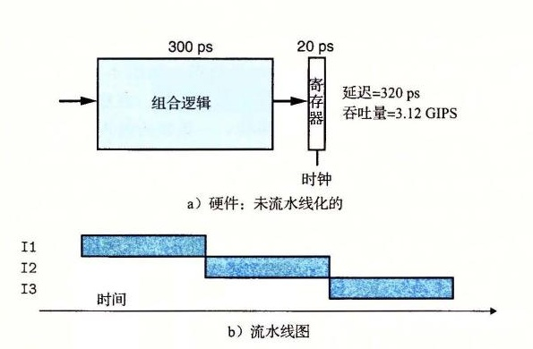
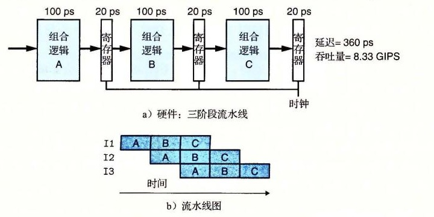

# 4.4.1 计算流水线

让我们把注意力放到计算流水线上来，这里的“顾客”就是指令，每个阶段完成指令执行的一部分。图 4-32a 给出了一个很简单的非流水线化的硬件系统例子。它是由一些执行计算的逻辑以及一个保存计算结果的寄存器组成的。时钟信号控制在每个特定的时间间隔加载寄存器。CD 播放器中的译码器就是这样的一个系统。输入信号是从 CD 表面读出的位，逻辑电路对这些位进行译码，产生音频信号。图中的计算块是用组合逻辑来实现的，意味着信号会穿过一系列逻辑门，在一定时间的延迟之后，输出就成为了输入的某个函数。

*图 4-32　非流水线化的计算硬件。每个 320ps 的周期内，系统用 300ps 计算组合逻辑函数，20ps 将结果存到输出寄存器中*

在现代逻辑设计中，电路延迟以微微秒或皮秒（picosecond，简写成“ps”），也就是 10-12 秒为单位来计算。在这个例子中，我们假设组合逻辑需要 300ps，而加载寄存器需要 20ps。图 4-32 还给出了一种时序图，称为流水线图（pipeline diagram）。在图中，时间从左向右流动。从上到下写着一组操作（在此称为 I1、I2 和 I3）。实心的长方形表示这些指令执行的时间。这个实现中，在开始下一条指令之前必须完成前一个。因此，这些方框在垂直方向上并没有相互重叠。下面这个公式给出了运行这个系统的最大吞吐量：

> 吞吐量 = 1 条指令 / ((20 + 300) ps) · 1000 ps / 1 ns ≈ 3.12 GIPS

我们以每秒千兆条指令（GIPS），也就是每秒十亿条指令，为单位来描述吞吐量。从头到尾执行一条指令所需要的时间称为延迟（latency）。在此系统中，延迟为 320ps，也就是吞吐量的倒数。

> ① 1ns = 10-9s。

假设将系统执行的计算分成三个阶段（A、B 和 C），每个阶段需要 100ps，如图 4-33 所示。

*图 4-33　三阶段流水线的计算硬件。计算被划分为三个阶段 A、B 和 C。每经过一个 120ps 的周期，每条指令就行进通过一个阶段*

然后在各个阶段之间放上流水线寄存器（pipeline register），这样每条指令都会按照三步经过这个系统，从头到尾需要三个完整的时钟周期。如图 4-33 中的流水线图所示，只要 I1 从 A 进入 B，就可以让 I2 进入阶段 A 了，依此类推。在稳定状态下，三个阶段都应该是活动的，每个时钟周期，一条指令离开系统，一条新的进入。从流水线图中第三个时钟周期就能看出这一点，此时，I1 是在阶段 C，I2 在阶段 B，而 I3 是在阶段 A。在这个系统中，我们将时钟周期设为 100 + 20 = 120ps，得到的吞吐量大约为 8.33 GIPS。因为处理一条指令需要 3 个时钟周期，所以这条流水线的延迟就是 3 × 120 = 360ps。我们将系统吞吐量提高到原来的 8.33/3.12 = 2.67 倍，代价是增加了一些硬件，以及延迟的少量增加（360/320 = 1.12）。延迟变大是由于增加的流水线寄存器的时间开销。
