# 第 4 章 处理器体系结构

[返回总目录](../README.md) · [上一章](../第03章-程序的机器级表示/README.md) · [下一章](../第05章-优化程序性能/README.md) · [按小节阅读](README.md) · [练习题答案](练习题答案.md)

## 本章目录

- [第 4 章 处理器体系结构](#第-4-章-处理器体系结构)
  - [4.1 Y86-64 指令集体系结构](#41-y86-64-指令集体系结构)
    - [4.1.1 程序员可见的状态](#411-程序员可见的状态)
    - [4.1.2 Y86-64 指令](#412-y86-64-指令)
    - [4.1.3 指令编码](#413-指令编码)
    - [4.1.4 Y86-64 异常](#414-y86-64-异常)
    - [4.1.5 Y86-64 程序](#415-y86-64-程序)
    - [4.1.6 一些 Y86-64 指令的详情](#416-一些-y86-64-指令的详情)
  - [4.2 逻辑设计和硬件控制语言 HCL](#42-逻辑设计和硬件控制语言-hcl)
    - [4.2.1 逻辑门](#421-逻辑门)
    - [4.2.2 组合电路和 HCL 布尔表达式](#422-组合电路和-hcl-布尔表达式)
    - [4.2.3 字级的组合电路和 HCL 整数表达式](#423-字级的组合电路和-hcl-整数表达式)
    - [4.2.4 集合关系](#424-集合关系)
    - [4.2.5 存储器和时钟](#425-存储器和时钟)
  - [4.3 Y86-64 的顺序实现](#43-y86-64-的顺序实现)
    - [4.3.1 将处理组织成阶段](#431-将处理组织成阶段)
    - [4.3.2 SEQ 硬件结构](#432-seq-硬件结构)
    - [4.3.3 SEQ 的时序](#433-seq-的时序)
    - [4.3.4 SEQ 阶段的实现](#434-seq-阶段的实现)
  - [4.4 流水线的通用原理](#44-流水线的通用原理)
    - [4.4.1 计算流水线](#441-计算流水线)
    - [4.4.2 流水线操作的详细说明](#442-流水线操作的详细说明)
    - [4.4.3 流水线的局限性](#443-流水线的局限性)
    - [4.4.4 带反馈的流水线系统](#444-带反馈的流水线系统)
  - [4.5 Y86-64 的流水线实现](#45-y86-64-的流水线实现)
    - [4.5.1 SEQ+：重新安排计算阶段](#451-seq重新安排计算阶段)
    - [4.5.2 插入流水线寄存器](#452-插入流水线寄存器)
    - [4.5.3 对信号进行重新排列和标号](#453-对信号进行重新排列和标号)
    - [4.5.4 预测下一个 PC](#454-预测下一个-pc)
    - [4.5.5 流水线冒险](#455-流水线冒险)
    - [4.5.6 异常处理](#456-异常处理)
    - [4.5.7 PIPE 各阶段的实现](#457-pipe-各阶段的实现)
    - [4.5.8 流水线控制逻辑](#458-流水线控制逻辑)
    - [4.5.9 性能分析](#459-性能分析)
    - [4.5.10 未完成的工作](#4510-未完成的工作)
  - [4.6 小结](#46-小结)
- [参考文献说明](#参考文献说明)
- [第 4 章家庭作业：4.45～4.50](#第-4-章家庭作业445450)
- [第 4 章家庭作业：4.51～4.57](#第-4-章家庭作业451457)
- [第 4 章家庭作业：4.58～4.59](#第-4-章家庭作业458459)

## 第 4 章 处理器体系结构

现代微处理器可以称得上是人类创造出的最复杂的系统之一。一块手指甲大小的硅片上，可以容纳一个完整的高性能处理器、大的高速缓存，以及用来连接到外部设备的逻辑电路。从性能上来说，今天在一块芯片上实现的处理器已经使 20 年前价值 1000 万美元、房间那么大的超级计算机相形见绌了。即使是在像手机、导航系统和可编程恒温器这样的日常设备中的嵌入式处理器，也比早期计算机开发者所能想到的强大得多。

到目前为止，我们看到的计算机系统只限于机器语言程序级。我们知道处理器必须执行一系列指令，每条指令执行某个简单操作，例如两个数相加。指令被编码为由一个或多个字节序列组成的二进制格式。一个处理器支持的指令和指令的字节级编码称为它的指令集体系结构（Instruction-Set Architecture，ISA）。不同的处理器“家族”，例如 Intel IA32 和 x86-64、IBM/Freescale Power 和 ARM 处理器家族，都有不同的 ISA。一个程序编译成在一种机器上运行，就不能在另一种机器上运行。另外，同一个家族里也有很多不同型号的处理器。虽然每个厂商制造的处理器性能和复杂性不断提高，但是不同的型号在 ISA 级别上都保持着兼容。一些常见的处理器家族（例如 x86-64）中的处理器分别由多个厂商提供。因此，ISA 在编译器编写者和处理器设计人员之间提供了一个概念抽象层，编译器编写者只需要知道允许哪些指令，以及它们是如何编码的；而处理器设计者必须建造出执行这些指令的处理器。

本章将简要介绍处理器硬件的设计。我们将研究一个硬件系统执行某种 ISA 指令的方式。这会使你能更好地理解计算机是如何工作的，以及计算机制造商们面临的技术挑战。一个很重要的概念是，现代处理器的实际工作方式可能跟 ISA 隐含的计算模型大相径庭。ISA 模型看上去应该是顺序指令执行，也就是先取出一条指令，等到它执行完毕，再开始下一条。然而，与一个时刻只执行一条指令相比，通过同时处理多条指令的不同部分，处理器可以获得更高的性能。为了保证处理器能得到同顺序执行相同的结果，人们采用了一些特殊的机制。在计算机科学中，用巧妙的方法在提高性能的同时又保持一个更简单、更抽象模型的功能，这种思想是众所周知的。在 Web 浏览器或平衡二叉树和哈希表这样的信息检索数据结构中使用缓存，就是这样的例子。

你很可能永远都不会自己设计处理器。这是专家们的任务，他们工作在全球不到 100 家的公司里。那么为什么你还应该了解处理器设计呢？

- 从智力方面来说，处理器设计是非常有趣而且很重要的。学习事物是怎样工作的有其内在价值。了解作为计算机科学家和工程师日常生活一部分的一个系统的内部工作原理（特别是对很多人来说这还是个谜），是件格外有趣的事情。处理器设计包括许多好的工程实践原理。它需要完成复杂的任务，而结构又要尽可能简单和规则。
- 理解处理器如何工作能帮助理解整个计算机系统如何工作。在第 6 章，我们将讲述存储器系统，以及用来创建很大的内存映像同时又有快速访问时间的技术。看看处理器端的处理器—内存接口，会使那些讲述更加完整。
- 虽然很少有人设计处理器，但是许多人设计包含处理器的硬件系统。将处理器嵌入到现实世界的系统中，如汽车和家用电器，已经变得非常普通了。嵌入式系统的设计者必须了解处理器是如何工作的，因为这些系统通常在比桌面和基于服务器的系统更低抽象级别上进行设计和编程。
- 你的工作可能就是处理器设计。虽然生产处理器的公司很少，但是研究处理器的设计人员队伍已经非常巨大了，而且还在壮大。一个主要的处理器设计的各个方面大约涉及 1000 多人。

本章首先定义一个简单的指令集，作为我们处理器实现的运行示例。因为受 x86-64 指令集的启发，它被俗称为“x86”，所以我们称我们的指令集为“Y86-64”指令集。与 x86-64 相比，Y86-64 指令集的数据类型、指令和寻址方式都要少一些。它的字节级编码也比较简单，机器代码没有相应的 x86-64 代码紧凑，不过设计它的 CPU 译码逻辑也要简单一些。虽然 Y86-64 指令集很简单，它仍然足够完整，能让我们写一些处理整数的程序。设计一个实现 Y86-64 的处理器要求我们解决许多处理器设计者同样会面对的问题。

接下来会提供一些数字硬件设计的背景。我们会描述处理器中使用的基本构件块，以及它们如何连接起来和操作。这些介绍是建立在第 2 章对布尔代数和位级操作的讨论的基础上的。我们还将介绍一种描述硬件系统控制部分的简单语言，HCL（Hardware Control Language，硬件控制语言）。然后，用它来描述我们的处理器设计。即使你已经有了一些逻辑设计的背景知识，也应该读读这个部分以了解我们的特殊符号表示方法。

作为设计处理器的第一步，我们给出一个基于顺序操作、功能正确但是有点不实用的 Y86-64 处理器。这个处理器每个时钟周期执行一条完整的 Y86-64 指令。所以它的时钟必须足够慢，以允许在一个周期内完成所有的动作。这样一个处理器是可以实现的，但是它的性能远远低于同样的硬件应该能达到的性能。

以这个顺序设计为基础，我们进行一系列的改造，创建一个流水线化的处理器（pipelined processor）。这个处理器将每条指令的执行分解成五步，每个步骤由一个独立的硬件部分或阶段（stage）来处理。指令步经流水线的各个阶段，且每个时钟周期有一条新指令进入流水线。所以，处理器可以同时执行五条指令的不同阶段。为了使这个处理器保留 Y86-64 ISA 的顺序行为，就要求处理很多冒险或冲突（hazard）情况，冒险就是一条指令的位置或操作数依赖于其他仍在流水线中的指令。

我们设计了一些工具来研究和测试处理器设计。其中包括 Y86-64 的汇编器、在你的机器上运行 Y86-64 程序的模拟器，还有针对两个顺序处理器设计和一个流水线化处理器设计的模拟器。这些设计的控制逻辑用 HCL 符号表示的文件描述。通过编辑这些文件和重新编译模拟器，你可以改变和扩展模拟器行为。我们还提供许多练习，包括实现新的指令和修改机器处理指令的方式。还提供测试代码以帮助你评价修改的正确性。这些练习将极大地帮助你理解所有这些内容，也能使你更理解处理器设计者面临的许多不同的设计选择。

> **网络旁注 ARCH:VLOG**
>
> 网络旁注 ARCH:VLOG 给出了用 Verilog 硬件描述语言描述的流水线化的 Y86-64 处理器。其中包括为基本的硬件构建块和整个的处理器结构创建模块。我们自动地将控制逻辑的 HCL 描述翻译成 Verilog。首先用我们的模拟器调试 HCL 描述，能消除很多在硬件设计中会出现的棘手的问题。给定一个 Verilog 描述，有商业和开源工具来支持模拟和逻辑合成（logic synthesis），产生实际的微处理器电路设计。因此，虽然我们在此花费大部分精力创建系统的图形和文字描述，写软件的时候也会花费同样的精力，但是这些设计能够自动地合成，这表明我们确实在创建一个能够用硬件实现的系统。

### 4.1 Y86-64 指令集体系结构

定义一个指令集体系结构（例如 Y86-64）包括定义各种状态单元、指令集和它们的编码、一组编程规范和异常事件处理。

#### 4.1.1 程序员可见的状态

如图 4-1 所示，Y86-64 程序中的每条指令都会读取或修改处理器状态的某些部分。这称为程序员可见状态，这里的“程序员”既可以是用汇编代码写程序的人，也可以是产生机器级代码的编译器。在处理器实现中，只要我们保证机器级程序能够访问程序员可见状态，就不需要完全按照 ISA 暗示的方式来表示和组织这个处理器状态。Y86-64 的状态类似于 x86-64。有 15 个程序寄存器：`%rax`、`%rcx`、`%rdx`、`%rbx`、`%rsp`、`%rbp`、`%rsi`、`%rdi` 和 `%r8` 到 `%r14`。（我们省略了 x86-64 的寄存器 `%r15` 以简化指令的编码。）每个程序寄存器存储一个 64 位的字。寄存器 `%rsp` 被入栈、出栈、调用和返回指令作为栈指针。除此之外，寄存器没有固定的含义或固定值。有 3 个一位的条件码：ZF、SF 和 OF，它们保存着最近的算术或逻辑指令所造成影响的有关信息。程序计数器（PC）存放当前正在执行指令的地址。

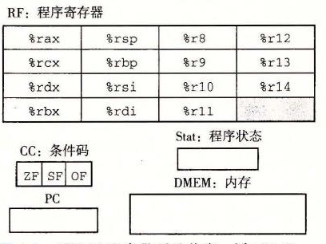

*图 4-1　Y86-64 程序员可见状态。同 x86-64 一样，Y86-64 的程序可以访问和修改程序寄存器、条件码、程序计数器（PC）和内存。状态码指明程序是否运行正常，或者发生了某个特殊事件*

内存从概念上来说就是一个很大的字节数组，保存着程序和数据。Y86-64 程序用虚拟地址来引用内存位置。硬件和操作系统软件联合起来将虚拟地址翻译成实际或物理地址，指明数据实际存在内存中哪个地方。第 9 章将更详细地研究虚拟内存。现在，我们只认为虚拟内存系统向 Y86-64 程序提供了一个单一的字节数组映像。

程序状态的最后一个部分是状态码 `Stat`，它表明程序执行的总体状态。它会指示是正常运行，还是出现了某种异常，例如当一条指令试图去读非法的内存地址时。在 4.1.4 节中会讲述可能的状态码以及异常处理。

#### 4.1.2 Y86-64 指令

图 4-2 给出了 Y86-64 ISA 中各个指令的简单描述。这个指令集就是我们处理器实现的目标。Y86-64 指令集基本上是 x86-64 指令集的一个子集。它只包括 8 字节整数操作，寻址方式较少，操作也较少。因为我们只有 8 字节数据，所以称之为“字（word）”不会有任何歧义。在这个图中，左边是指令的汇编代码表示，右边是字节编码。图 4-3 给出了其中一些指令更详细的内容。汇编代码格式类似于 x86-64 的 ATT 格式。

下面是 Y86-64 指令的一些细节。

- x86-64 的 `movq` 指令分成了 4 个不同的指令：`irmovq`、`rrmovq`、`mrmovq` 和 `rmmovq`，分别显式地指明源和目的的格式。源可以是立即数（i）、寄存器（r）或内存（m）。指令名字的第一个字母就表明了源的类型。目的可以是寄存器（r）或内存（m）。指令名字的第二个字母指明了目的的类型。在决定如何实现数据传送时，显式地指明数据传送的这 4 种类型是很有帮助的。

  两个内存传送指令中的内存引用方式是简单的基址和偏移量形式。在地址计算中，我们不支持第二变址寄存器（second index register）和任何寄存器值的伸缩（scaling）。

  同 x86-64 一样，我们不允许从一个内存地址直接传送到另一个内存地址。另外，也不允许将立即数传送到内存。

- 有 4 个整数操作指令，如图 4-2 中的 `OPq`。它们是 `addq`、`subq`、`andq` 和 `xorq`。它们只对寄存器数据进行操作，而 x86-64 还允许对内存数据进行这些操作。这些指令会设置 3 个条件码 ZF、SF 和 OF（零、符号和溢出）。
- 7 个跳转指令（图 4-2 中的 `jXX`）是 `jmp`、`jle`、`jl`、`je`、`jne`、`jge` 和 `jg`。根据分支指令的类型和条件代码的设置来选择分支。分支条件和 x86-64 的一样（见图 3-15）。
- 有 6 个条件传送指令（图 4-2 中的 `cmovXX`）：`cmovle`、`cmovl`、`cmove`、`cmovne`、`cmovge` 和 `cmovg`。这些指令的格式与寄存器—寄存器传送指令 `rrmovq` 一样，但是只有当条件码满足所需要的约束时，才会更新目的寄存器的值。
- `call` 指令将返回地址入栈，然后跳到目的地址。`ret` 指令从这样的调用中返回。
- `pushq` 和 `popq` 指令实现了入栈和出栈，就像在 x86-64 中一样。
- `halt` 指令停止指令的执行。x86-64 中有一个与之相当的指令 `hlt`。x86-64 的应用程序不允许使用这条指令，因为它会导致整个系统暂停运行。对于 Y86-64 来说，执行 `halt` 指令会导致处理器停止，并将状态码设置为 HLT（参见 4.1.4 节）。

| 汇编代码 | 指令指示符（1 字节） | 寄存器指示符（1 字节） | 常数字（8 字节） | 总长度 |
| --- | --- | --- | --- | ---: |
| `halt` | `0:0` |  |  | 1 |
| `nop` | `1:0` |  |  | 1 |
| `rrmovq rA, rB` | `2:0` | `rA:rB` |  | 2 |
| `irmovq V, rB` | `3:0` | `F:rB` | `V` | 10 |
| `rmmovq rA, D(rB)` | `4:0` | `rA:rB` | `D` | 10 |
| `mrmovq D(rB), rA` | `5:0` | `rA:rB` | `D` | 10 |
| `OPq rA, rB` | `6:fn` | `rA:rB` |  | 2 |
| `jXX Dest` | `7:fn` |  | `Dest`（紧随指令指示符） | 9 |
| `cmovXX rA, rB` | `2:fn` | `rA:rB` |  | 2 |
| `call Dest` | `8:0` |  | `Dest`（紧随指令指示符） | 9 |
| `ret` | `9:0` |  |  | 1 |
| `pushq rA` | `A:0` | `rA:F` |  | 2 |
| `popq rA` | `B:0` | `rA:F` |  | 2 |

*图 4-2　Y86-64 指令集。指令编码长度从 1 个字节到 10 个字节不等。一条指令含有一个单字节的指令指示符，可能含有一个单字节的寄存器指示符，还可能含有一个 8 字节的常数字。字段 `fn` 指明是某个整数操作（`OPq`）、数据传送条件（`cmovXX`）或是分支条件（`jXX`）。所有的数值都用十六进制表示*

#### 4.1.3 指令编码

图 4-2 还给出了指令的字节级编码。每条指令需要 1～10 个字节不等，这取决于需要哪些字段。每条指令的第一个字节表明指令的类型。这个字节分为两个部分，每部分 4 位：高 4 位是代码（code）部分，低 4 位是功能（function）部分。如图 4-2 所示，代码值为 0～`0xB`。功能值只有在一组相关指令共用一个代码时才有用。图 4-3 给出了整数操作、分支和条件传送指令的具体编码。可以观察到，`rrmovq` 与条件传送有同样的指令代码。可以把它看作是一个“无条件传送”，就好像 `jmp` 指令是无条件跳转一样，它们的功能代码都是 0。

| 类别 | 指令 | 代码 | 功能 |
| --- | --- | --- | --- |
| 整数操作指令 | `addq` | `6` | `0` |
| 整数操作指令 | `subq` | `6` | `1` |
| 整数操作指令 | `andq` | `6` | `2` |
| 整数操作指令 | `xorq` | `6` | `3` |
| 分支指令 | `jmp` | `7` | `0` |
| 分支指令 | `jle` | `7` | `1` |
| 分支指令 | `jl` | `7` | `2` |
| 分支指令 | `je` | `7` | `3` |
| 分支指令 | `jne` | `7` | `4` |
| 分支指令 | `jge` | `7` | `5` |
| 分支指令 | `jg` | `7` | `6` |
| 传送指令 | `rrmovq` | `2` | `0` |
| 传送指令 | `cmovle` | `2` | `1` |
| 传送指令 | `cmovl` | `2` | `2` |
| 传送指令 | `cmove` | `2` | `3` |
| 传送指令 | `cmovne` | `2` | `4` |
| 传送指令 | `cmovge` | `2` | `5` |
| 传送指令 | `cmovg` | `2` | `6` |

*图 4-3　Y86-64 指令集的功能码。这些代码指明是某个整数操作、分支条件还是数据传送条件。这些指令是图 4-2 中所示的 `OPq`、`jXX` 和 `cmovXX`*

如图 4-4 所示，15 个程序寄存器中每个都有一个相对应的范围在 0 到 `0xE` 之间的寄存器标识符（register ID）。Y86-64 中的寄存器编号跟 x86-64 中的相同。程序寄存器存在 CPU 中的一个寄存器文件中，这个寄存器文件就是一个小的、以寄存器 ID 作为地址的随机访问存储器。在指令编码中以及在我们的硬件设计中，当需要指明不应访问任何寄存器时，就用 ID 值 `0xF` 来表示。

| 数字 | 寄存器名字 | 数字 | 寄存器名字 |
| --- | --- | --- | --- |
| `0` | `%rax` | `8` | `%r8` |
| `1` | `%rcx` | `9` | `%r9` |
| `2` | `%rdx` | `A` | `%r10` |
| `3` | `%rbx` | `B` | `%r11` |
| `4` | `%rsp` | `C` | `%r12` |
| `5` | `%rbp` | `D` | `%r13` |
| `6` | `%rsi` | `E` | `%r14` |
| `7` | `%rdi` | `F` | 无寄存器 |

*图 4-4　Y86-64 程序寄存器标识符。15 个程序寄存器中每个都有一个相对应的标识符（ID），范围为 0～`0xE`。如果指令中某个寄存器字段的 ID 值为 `0xF`，就表明此处没有寄存器操作数*

有的指令只有一个字节长，而有的需要操作数的指令编码就更长一些。首先，可能有附加的寄存器指示符字节（register specifier byte），指定一个或两个寄存器。在图 4-2 中，这些寄存器字段称为 `rA` 和 `rB`。从指令的汇编代码表示中可以看到，根据指令类型，指令可以指定用于数据源和目的的寄存器，或是用于地址计算的基址寄存器。没有寄存器操作数的指令，例如分支指令和 `call` 指令，就没有寄存器指示符字节。那些只需要一个寄存器操作数的指令（`irmovq`、`pushq` 和 `popq`）将另一个寄存器指示符设为 `0xF`。这种约定在我们的处理器实现中非常有用。

有些指令需要一个附加的 8 字节常数字（constant word）。这个字能作为 `irmovq` 的立即数数据，`rmmovq` 和 `mrmovq` 的地址指示符的偏移量，以及分支指令和调用指令的目的地址。注意，分支指令和调用指令的目的是一个绝对地址，而不像 IA32 中那样使用 PC（程序计数器）相对寻址方式。处理器使用 PC 相对寻址方式，分支指令的编码会更简洁，同时这样也能允许代码从内存的一部分复制到另一部分而不需要更新所有的分支目标地址。因为我们更关心描述的简单性，所以就使用了绝对寻址方式。同 IA32 一样，所有整数采用小端法编码。当指令按照反汇编格式书写时，这些字节就以相反的顺序出现。

例如，用十六进制来表示指令 `rmmovq %rsp, 0x123456789abcd(%rdx)` 的字节编码。从图 4-2 我们可以看到，`rmmovq` 的第一个字节为 `40`。源寄存器 `%rsp` 应该编码放在 `rA` 字段中，而基址寄存器 `%rdx` 应该编码放在 `rB` 字段中。根据图 4-4 中的寄存器编号，我们得到寄存器指示符字节 `42`。最后，偏移量编码放在 8 字节的常数字中。首先在 `0x123456789abcd` 的前面填充上 0 变成 8 个字节，变成字节序列 `00 01 23 45 67 89 ab cd`。写成按字节反序就是 `cd ab 89 67 45 23 01 00`。将它们都连接起来就得到指令的编码：

```text
4042cdab896745230100
```

指令集的一个重要性质就是字节编码必须有唯一的解释。任意一个字节序列要么是一个唯一的指令序列的编码，要么就不是一个合法的字节序列。Y86-64 就具有这个性质，因为每条指令的第一个字节有唯一的代码和功能组合，给定这个字节，我们就可以决定所有其他附加字节的长度和含义。这个性质保证了处理器可以无二义性地执行目标代码程序。即使代码嵌入在程序的其他字节中，只要从序列的第一个字节开始处理，我们仍然可以很容易地确定指令序列。反过来说，如果不知道一段代码序列的起始位置，我们就不能准确地确定怎样将序列划分成单独的指令。对于试图直接从目标代码字节序列中抽取出机器级程序的反汇编程序和其他一些工具来说，这就带来了问题。

**练习题 4.1** 确定下面的 Y86-64 指令序列的字节编码。“`.pos 0x100`”那一行表明这段目标代码的起始地址应该是 `0x100`。

```asm
.pos 0x100       # Start code at address 0x100
    irmovq $15,%rbx
    rrmovq %rbx,%rcx
loop:
    rmmovq %rcx,-3(%rbx)
    addq %rbx,%rcx
    jmp loop
```

**练习题 4.2** 确定下列每个字节序列所编码的 Y86-64 指令序列。如果序列中有不合法的字节，指出指令序列中不合法值出现的位置。每个序列都先给出了起始地址，冒号，然后是字节序列。

```text
A. 0x100: 30f3fcffffffffffffff40630008000000000000
B. 0x200: a06f800c020000000000000030f30a0000000000000090
C. 0x300: 5054070000000000000010f0b01f
D. 0x400: 611373000400000000000000
E. 0x500: 6362a0f0
```

> **旁注　比较 x86-64 和 Y86-64 的指令编码**
>
> 同 x86-64 中的指令编码相比，Y86-64 的编码简单得多，但是没那么紧凑。在所有的 Y86-64 指令中，寄存器字段的位置都是固定的，而在不同的 x86-64 指令中，它们的位置是不一样的。x86-64 可以将常数值编码成 1、2、4 或 8 个字节，而 Y86-64 总是将常数值编码成 8 个字节。

> **旁注　RISC 和 CISC 指令集**
>
> x86-64 有时称为“复杂指令集计算机”（CISC，读作“sisk”），与“精简指令集计算机”（RISC，读作“risk”）相对。从历史上看，先出现了 CISC 机器，它从最早的计算机演化而来。到 20 世纪 80 年代早期，随着机器设计者加入了很多新指令来支持高级任务（例如处理循环缓冲区，执行十进制数计算，以及求多项式的值），大型机和小型机的指令集已经变得非常庞大了。最早的微处理器出现在 20 世纪 70 年代早期，因为当时的集成电路技术极大地制约了一块芯片上能实现些什么，所以它们的指令集非常有限。微处理器发展得很快，到 20 世纪 80 年代早期，大型机和小型机的指令集复杂度一直都在增加。x86 家族沿着这条道路发展到 IA32，最近是 x86-64。即使是 x86 系列也仍然在不断地变化，基于新出现的应用的需要，增加新的指令类。
>
> 20 世纪 80 年代早期，RISC 的设计理念是作为上述发展趋势的一种替代而发展起来的。IBM 的一组硬件和编译器专家受到 IBM 研究员 John Cocke 的很大影响，认为他们可以为更简单的指令集形式产生高效的代码。实际上，许多加到指令集中的高级指令很难被编译器产生，所以也很少被用到。一个较为简单的指令集可以用很少的硬件实现，能以高效的流水线结构组织起来，类似于本章后面描述的情况。直到多年以后 IBM 才将这个理念商品化，开发出了 Power 和 PowerPC ISA。
>
> 加州大学伯克利分校的 David Patterson 和斯坦福大学的 John Hennessy 进一步发展了 RISC 的概念。Patterson 将这种新的机器类型命名为 RISC，而将以前的那种称为 CISC，因为以前没有必要给一种几乎是通用的指令集格式起名字。
>
> 比较 CISC 和最初的 RISC 指令集，我们发现下面这些一般特性。
>
> | CISC | 早期的 RISC |
> | --- | --- |
> | 指令数量很多。Intel 描述全套指令的文档[51]有 1200 多页。 | 指令数量少得多。通常少于 100 个。 |
> | 有些指令的延迟很长。包括将一个整块从内存的一部分复制到另一部分的指令，以及其他一些将多个寄存器的值复制到内存或从内存复制到多个寄存器的指令。 | 没有较长延迟的指令。有些早期的 RISC 机器甚至没有整数乘法指令，要求编译器通过一系列加法来实现乘法。 |
> | 编码是可变长度的。x86-64 的指令长度可以是 1～15 个字节。 | 编码是固定长度的。通常所有的指令都编码为 4 个字节。 |
> | 指定操作数的方式很多样。在 x86-64 中，内存操作数指示符可以有许多不同的组合，这些组合由偏移量、基址和变址寄存器以及伸缩因子组成。 | 简单寻址方式。通常只有基址和偏移量寻址。 |
> | 可以对内存和寄存器操作数进行算术和逻辑运算。 | 只能对寄存器操作数进行算术和逻辑运算。允许使用内存引用的只有 `load` 和 `store` 指令，`load` 是从内存读到寄存器，`store` 是从寄存器写到内存。这种方法被称为 load/store 体系结构。 |
> | 对机器级程序来说实现细节是不可见的。ISA 提供了程序和如何执行程序之间的清晰的抽象。 | 对机器级程序来说实现细节是可见的。有些 RISC 机器禁止某些特殊的指令序列，而有些跳转要到下一条指令执行完了以后才会生效。编译器必须在这些约束条件下进行性能优化。 |
> | 有条件码。作为指令执行的副产品，设置了一些特殊的标志位，可以用于条件分支检测。 | 没有条件码。相反，对条件检测来说，要用明确的测试指令，这些指令会将测试结果放在一个普通的寄存器中。 |
> | 栈密集的过程链接。栈被用来存取过程参数和返回地址。 | 寄存器密集的过程链接。寄存器被用来存取过程参数和返回地址。因此有些过程能完全避免内存引用。通常处理器有更多的（最多的有 32 个）寄存器。 |
>
> Y86-64 指令集既有 CISC 指令集的属性，也有 RISC 指令集的属性。和 CISC 一样，它有条件码、长度可变的指令，并用栈来保存返回地址。和 RISC 一样的是，它采用 load/store 体系结构和规则编码，通过寄存器来传递过程参数。Y86-64 指令集可以看成是采用 CISC 指令集（x86），但又根据某些 RISC 的原理进行了简化。
>
> **RISC 与 CISC 之争**
>
> 20 世纪 80 年代，计算机体系结构领域里关于 RISC 指令集和 CISC 指令集优缺点的争论十分激烈。RISC 的支持者声称在给定硬件数量的情况下，通过结合简约式指令集设计、高级编译器技术和流水线化的处理器实现，他们能够得到更强的计算能力。而 CISC 的拥趸反驳说要完成一个给定的任务只需要用较少的 CISC 指令，所以他们的机器能够获得更高的总体性能。
>
> 大多数公司都推出了 RISC 处理器系列产品，包括 Sun Microsystems（SPARC）、IBM 和 Motorola（PowerPC），以及 Digital Equipment Corporation（Alpha）。一家英国公司 Acorn Computers Ltd. 提出了自己的体系结构——ARM（最开始是“Acorn RISC Machine”的首字母缩写），广泛应用在嵌入式系统中（比如手机）。
>
> 20 世纪 90 年代早期，争论逐渐平息，因为事实已经很清楚了。无论是单纯的 RISC 还是单纯的 CISC 都不如结合两者思想精华的设计。RISC 机器发展进化的过程中，引入了更多的指令，而许多这样的指令都需要执行多个周期。今天的 RISC 机器的指令表中有几百条指令，几乎与“精简指令集机器”的名称不相符了。那种将实现细节暴露给机器级程序的思想已经被证明是目光短浅的。随着使用更加高级硬件结构的新处理器模型的开发，许多实现细节已经变得很落后了，但它们仍然是指令集的一部分。不过，作为 RISC 设计的核心的指令集仍然是非常适合在流水线化的机器上执行的。
>
> 比较新的 CISC 机器也利用了高性能流水线结构。就像我们将在 5.7 节中讨论的那样，它们读取 CISC 指令，并动态地翻译成比较简单的、像 RISC 那样的操作的序列。例如，一条将寄存器和内存相加的指令被翻译成三个操作：一个是读原始的内存值，一个是执行加法运算，第三就是将和写回内存。由于动态翻译通常可以在实际指令执行前进行，处理器仍然可以保持很高的执行速率。
>
> 除了技术因素以外，市场因素也在决定不同指令集是否成功中起了很重要的作用。通过保持与现有处理器的兼容性，Intel 以及 x86 使得从一代处理器迁移到下一代变得很容易。由于集成电路技术的进步，Intel 和其他 x86 处理器制造商能够克服原来 8086 指令集设计造成的低效率，使用 RISC 技术产生出与最好的 RISC 机器相当的性能。正如我们在第 3.1 节中看到的那样，IA32 发展演变到 x86-64 提供了一个机会，使得能够将 RISC 的一些特性结合到 x86 中。在桌面、便携计算机和基于服务器的计算领域里，x86 已经占据了完全的统治地位。
>
> RISC 处理器在嵌入式处理器市场上表现得非常出色，嵌入式处理器负责控制移动电话、汽车刹车以及因特网电器等系统。在这些应用中，降低成本和功耗比保持后向兼容性更重要。就出卖的处理器数量来说，这是一个非常广阔而迅速成长着的市场。

#### 4.1.4 Y86-64 异常

对 Y86-64 来说，程序员可见的状态（图 4-1）包括状态码 `Stat`，它描述程序执行的总体状态。这个代码可能的值如图 4-5 所示。代码值 1，命名为 AOK，表示程序执行正常，而其他一些代码则表示发生了某种类型的异常。代码 2，命名为 HLT，表示处理器执行了一条 `halt` 指令。代码 3，命名为 ADR，表示处理器试图从一个非法内存地址读或者向一个非法内存地址写，可能是当取指令的时候，也可能是当读或者写数据的时候。我们会限制最大的地址（确切的限定值因实现而异），任何访问超出这个限定值的地址都会引发 ADR 异常。代码 4，命名为 INS，表示遇到了非法的指令代码。

| 值 | 名字 | 含义 |
| --- | --- | --- |
| 1 | AOK | 正常操作 |
| 2 | HLT | 遇到 `halt` 指令 |
| 3 | ADR | 遇到非法地址 |
| 4 | INS | 遇到非法指令 |

*图 4-5　Y86-64 状态码。在我们的设计中，任何 AOK 以外的代码都会使处理器停止*

对于 Y86-64，当遇到这些异常的时候，我们就简单地让处理器停止执行指令。在更完整的设计中，处理器通常会调用一个异常处理程序（exception handler），这个过程被指定用来处理遇到的某种类型的异常。就像在第 8 章中讲述的，异常处理程序可以被配置成不同的结果，例如，中止程序或者调用一个用户自定义的信号处理程序（signal handler）。

#### 4.1.5 Y86-64 程序

图 4-6 给出了下面这个 C 函数的 x86-64 和 Y86-64 汇编代码：

```c
long sum(long *start, long count)
{
    long sum = 0;
    while (count) {
        sum += *start;
        start++;
        count--;
    }
    return sum;
}
```

**x86-64 代码**

```asm
# long sum(long *start, long count)
# start in %rdi, count in %rsi
sum:
    movl    $0, %eax          # sum = 0
    jmp     .L2               # Goto test
.L3:                          # loop:
    addq    (%rdi), %rax      # Add *start to sum
    addq    $8, %rdi          # start++
    subq    $1, %rsi          # count--
.L2:                          # test:
    testq   %rsi, %rsi        # Test sum
    jne     .L3               # If !=0, goto loop
    rep; ret                  # Return
```

**Y86-64 代码**

```asm
# long sum(long *start, long count)
# start in %rdi, count in %rsi
sum:
    irmovq  $8, %r8           # Constant 8
    irmovq  $1, %r9           # Constant 1
    xorq    %rax, %rax        # sum = 0
    andq    %rsi, %rsi        # Set CC
    jmp     test              # Goto test
loop:
    mrmovq  (%rdi), %r10      # Get *start
    addq    %r10, %rax        # Add to sum
    addq    %r8, %rdi         # start++
    subq    %r9, %rsi         # count--. Set CC
test:
    jne     loop              # Stop when 0
    ret                       # Return
```

*图 4-6　Y86-64 汇编程序与 x86-64 汇编程序比较。Sum 函数计算一个整数数组的和。Y86-64 代码与 x86-64 代码遵循了相同的通用模式*

x86-64 代码是由 GCC 编译器产生的。Y86-64 代码与之类似，但有以下不同点：

- Y86-64 将常数加载到寄存器（第 2～3 行），因为它在算术指令中不能使用立即数。
- 要实现从内存读取一个数值并将其与一个寄存器相加，Y86-64 代码需要两条指令（第 8～9 行），而 x86-64 只需要一条 `addq` 指令（第 5 行）。
- 我们手工编写的 Y86-64 实现有一个优势，即 `subq` 指令（第 11 行）同时还设置了条件码，因此 GCC 生成代码中的 `testq` 指令（第 9 行）就不是必需的。不过为此，Y86-64 代码必须用 `andq` 指令（第 5 行）在进入循环之前设置条件码。

图 4-7 给出了用 Y86-64 汇编代码编写的一个完整的程序文件的例子。这个程序既包括数据，也包括指令。伪指令（directive）指明应该将代码或数据放在什么位置，以及如何对齐。这个程序详细说明了栈的放置、数据初始化、程序初始化和程序结束等问题。

```asm
# Execution begins at address 0
    .pos 0
    irmovq stack, %rsp        # Set up stack pointer
    call main                 # Execute main program
    halt                      # Terminate program

# Array of 4 elements
    .align 8
array:
    .quad 0x000d000d000d
    .quad 0x00c000c000c0
    .quad 0x0b000b000b00
    .quad 0xa000a000a000

main:
    irmovq array, %rdi
    irmovq $4, %rsi
    call sum                  # sum(array, 4)
    ret

# long sum(long *start, long count)
# start in %rdi, count in %rsi
sum:
    irmovq $8, %r8            # Constant 8
    irmovq $1, %r9            # Constant 1
    xorq %rax, %rax           # sum = 0
    andq %rsi, %rsi           # Set CC
    jmp test                  # Goto test
loop:
    mrmovq (%rdi), %r10       # Get *start
    addq %r10, %rax           # Add to sum
    addq %r8, %rdi            # start++
    subq %r9, %rsi            # count--. Set CC
test:
    jne loop                  # Stop when 0
    ret                       # Return

# Stack starts here and grows to lower addresses
    .pos 0x200
stack:
```

*图 4-7　用 Y86-64 汇编代码编写的一个例子程序。调用 `sum` 函数来计算一个具有 4 个元素的数组的和*

在这个程序中，以“`.`”开头的词是汇编器伪指令（assembler directives），它们告诉汇编器调整地址，以便在那里产生代码或插入一些数据。伪指令 `.pos 0`（第 2 行）告诉汇编器应该从地址 0 处开始产生代码。这个地址是所有 Y86-64 程序的起点。接下来的一条指令（第 3 行）初始化栈指针。我们可以看到程序结尾处（第 40 行）声明了标号 `stack`，并且用一个 `.pos` 伪指令（第 39 行）指明地址 `0x200`。因此栈会从这个地址开始，向低地址增长。我们必须保证栈不会增长得太大以至于覆盖了代码或者其他程序数据。

程序的第 8～13 行声明了一个 4 个字的数组，值分别为

```text
0x000d000d000d, 0x00c000c000c0
0x0b000b000b00, 0xa000a000a000
```

标号 `array` 表明了这个数组的起始，并且在 8 字节边界处对齐（用 `.align` 伪指令指定）。第 16～19 行给出了“main”过程，在过程中对那个四字数组调用了 `sum` 函数，然后停止。

正如例子所示，由于我们创建 Y86-64 代码的唯一工具是汇编器，程序员必须执行本来通常交给编译器、链接器和运行时系统来完成的任务。幸好我们只用 Y86-64 来写一些小的程序，对此一些简单的机制就足够了。

图 4-8 是 YAS 的汇编器对图 4-7 中代码进行汇编的结果。为了便于理解，汇编器的输出结果是 ASCII 码格式。汇编文件中有指令或数据的行上，目标代码包含一个地址，后面跟着 1～10 个字节的值。

我们实现了一个指令集模拟器，称为 YIS，它的目的是模拟 Y86-64 机器代码程序的执行，而不用试图去模拟任何具体处理器实现的行为。这种形式的模拟有助于在有实际硬件可用之前调试程序，也有助于检查模拟硬件或者在硬件上运行程序的结果。用 YIS 运行例子的目标代码，产生如下输出：

```text
Stopped in 34 steps at PC = 0x13.  Status 'HLT', CC Z=1 S=0 O=0
Changes to registers:
%rax:  0x0000000000000000    0x0000abcdabcdabcd
%rsp:  0x0000000000000000    0x0000000000000200
%rdi:  0x0000000000000000    0x0000000000000038
%r8:   0x0000000000000000    0x0000000000000008
%r9:   0x0000000000000000    0x0000000000000001
%r10:  0x0000000000000000    0x0000a000a000a000

Changes to memory:
0x01f0: 0x0000000000000000    0x0000000000000055
0x01f8: 0x0000000000000000    0x0000000000000013
```

模拟输出的第一行总结了执行以及 PC 和程序状态的结果值。模拟器只打印出在模拟过程中被改变了的寄存器或内存中的字。左边是原始值（这里都是 0），右边是最终的值。从输出中我们可以看到，寄存器 `%rax` 的值为 `0xabcdabcdabcd`，即传给子函数 `sum` 的四元素数组的和。另外，我们还能看到栈从地址 `0x200` 开始，向下增长，栈的使用导致内存地址 `0x1f0～0x1f8` 发生了变化。可执行代码的最大地址为 `0x090`，所以数值的入栈和出栈不会破坏可执行代码。

**练习题 4.3**　机器级程序中常见的模式之一是将一个常数值与一个寄存器相加。利用目前已给出的 Y86-64 指令，实现这个操作需要一条 `irmovq` 指令把常数加载到寄存器，然后一条 `addq` 指令把这个寄存器值与目标寄存器值相加。假设我们想增加一条新指令 `iaddq`，格式如下：

| 指令 | 字节 0 | 字节 1 | 字节 2～9 |
| --- | --- | --- | --- |
| `iaddq V, rB` | `C:0` | `F:rB` | `V` |

该指令将常数值 `V` 与寄存器 `rB` 相加。

使用 `iaddq` 指令重写图 4-6 的 Y86-64 `sum` 函数。在之前的代码中，我们用寄存器 `%r8` 和 `%r9` 来保存常数值。现在，我们完全可以避免使用这些寄存器。

```text
0x000:                      | # Execution begins at address 0
0x000:                      |     .pos 0
0x000: 30f40002000000000000 |     irmovq stack, %rsp       # Set up stack pointer
0x00a: 803800000000000000   |     call main                # Execute main program
0x013: 00                   |     halt                     # Terminate program
                            |
                            | # Array of 4 elements
0x018:                      |     .align 8
0x018:                      | array:
0x018: 0d000d000d000000     |     .quad 0x000d000d000d
0x020: c000c000c0000000     |     .quad 0x00c000c000c0
0x028: 000b000b000b0000     |     .quad 0x0b000b000b00
0x030: 00a000a000a00000     |     .quad 0xa000a000a000
                            |
0x038:                      | main:
0x038: 30f71800000000000000 |     irmovq array, %rdi
0x042: 30f60400000000000000 |     irmovq $4, %rsi
0x04c: 805600000000000000   |     call sum                 # sum(array, 4)
0x055: 90                   |     ret
                            |
                            | # long sum(long *start, long count)
                            | # start in %rdi, count in %rsi
0x056:                      | sum:
0x056: 30f80800000000000000 |     irmovq $8, %r8           # Constant 8
0x060: 30f90100000000000000 |     irmovq $1, %r9           # Constant 1
0x06a: 6300                 |     xorq %rax, %rax          # sum = 0
0x06c: 6266                 |     andq %rsi, %rsi          # Set CC
0x06e: 708700000000000000   |     jmp test                 # Goto test
0x077:                      | loop:
0x077: 50a70000000000000000 |     mrmovq (%rdi), %r10      # Get *start
0x081: 60a0                 |     addq %r10, %rax          # Add to sum
0x083: 6087                 |     addq %r8, %rdi           # start++
0x085: 6196                 |     subq %r9, %rsi           # count--. Set CC
0x087:                      | test:
0x087: 747700000000000000   |     jne loop                 # Stop when 0
0x090: 90                   |     ret                      # Return
                            |
                            | # Stack starts here and grows to lower addresses
0x200:                      |     .pos 0x200
0x200:                      | stack:
```

*图 4-8　YAS 汇编器的输出。每一行包含一个十六进制的地址，以及字节数在 1～10 之间的目标代码*

**练习题 4.4**　根据下面的 C 代码，用 Y86-64 代码来实现一个递归求和函数 `rsum`：

```c
long rsum(long *start, long count)
{
    if (count <= 0)
        return 0;
    return *start + rsum(start+1, count-1);
}
```

使用与 x86-64 代码相同的参数传递和寄存器保存方法。在一台 x86-64 机器上编译这段 C 代码，然后再把那些指令翻译成 Y86-64 的指令，这样做可能会很有帮助。

**练习题 4.5**　修改 `sum` 函数的 Y86-64 代码（图 4-6），实现函数 `absSum`，它计算一个数组的绝对值的和。在内循环中使用条件跳转指令。

**练习题 4.6**　修改 `sum` 函数的 Y86-64 代码（图 4-6），实现函数 `absSum`，它计算一个数组的绝对值的和。在内循环中使用条件传送指令。

#### 4.1.6 一些 Y86-64 指令的详情

大多数 Y86-64 指令是以一种直接明了的方式修改程序状态的，所以定义每条指令想要达到的结果并不困难。不过，两个特别的指令的组合需要特别注意一下。

`pushq` 指令会把栈指针减 8，并且将一个寄存器值写入内存中。因此，当执行 `pushq %rsp` 指令时，处理器的行为是不确定的，因为要入栈的寄存器会被同一条指令修改。通常有两种不同的约定：1）压入 `%rsp` 的原始值，2）压入减去 8 的 `%rsp` 的值。

对于 Y86-64 处理器来说，我们采用和 x86-64 一样的做法，就像下面这个练习题确定出的那样。

**练习题 4.7**　确定 x86-64 处理器上指令 `pushq %rsp` 的行为。我们可以通过阅读 Intel 关于这条指令的文档来了解它们的做法，但更简单的方法是在实际的机器上做个实验。C 编译器正常情况下是不会产生这条指令的，所以我们必须用手工生成的汇编代码来完成这一任务。下面是我们写的一个测试程序（网络旁注 ASM:EASM，描述如何编写 C 代码和手写汇编代码结合的程序）：

```asm
    .text
    .globl pushtest
pushtest:
    movq    %rsp, %rax       # Copy stack pointer
    pushq   %rsp             # Push stack pointer
    popq    %rdx             # Pop it back
    subq    %rdx, %rax       # Return 0 or 8
    ret
```

在实验中，我们发现函数 `pushtest` 总是返回 0，这表示在 x86-64 中 `pushq %rsp` 指令的行为是怎样的呢？

对 `popq %rsp` 指令也有类似的歧义。可以将 `%rsp` 置为从内存中读出的值，也可以置为加了增量后的栈指针。同练习题 4.7 一样，让我们做个实验来确定 x86-64 机器是怎么处理这条指令的，然后 Y86-64 机器就采用同样的方法。

**练习题 4.8**　下面这个汇编函数让我们确定 x86-64 上指令 `popq %rsp` 的行为：

```asm
    .text
    .globl poptest
poptest:
    movq    %rsp, %rdi       # Save stack pointer
    pushq   $0xabcd          # Push test value
    popq    %rsp             # Pop to stack pointer
    movq    %rsp, %rax       # Set popped value as return value
    movq    %rdi, %rsp       # Restore stack pointer
    ret
```

我们发现函数总是返回 `0xabcd`。这表示 `popq %rsp` 的行为是怎样的？还有什么其他 Y86-64 指令也会有相同的行为吗？

> **旁注　正确了解细节：x86 模型间的不一致**
>
> 练习题 4.7 和练习题 4.8 可以帮助我们确定对于压入和弹出栈指针指令的一致惯例。看上去似乎没有理由会执行这样两种操作，那么一个很自然的问题就是“为什么要担心这样一些吹毛求疵的细节呢？”
>
> 从下面 Intel 关于 PUSH 指令的文档 [51] 的节选中，可以学到关于这个一致性的重要性的有用的教训：
>
> 对于 IA-32 处理器，从 Intel 286 开始，PUSH ESP 指令将 ESP 寄存器的值压入栈中，就好像它存在于这条指令被执行之前。（对于 Intel 64 体系结构、IA-32 体系结构的实地址模式和虚 8086 模式来说也是这样。）对于 Intel® 8086 处理器，PUSH SP 将 SP 寄存器的新值压入栈中（也就是减去 2 之后的值）。（PUSH ESP 指令。Intel 公司。50。）
>
> 虽然这个说明的具体细节可能难以理解，但是我们可以看到这条注释说明的是当执行压入栈指针寄存器指令时，不同型号的 x86 处理器会做不同的事情。有些会压入原始的值，而有些会压入减去后的值。（有趣的是，对于弹出栈指针寄存器没有类似的歧义。）这种不一致有两个缺点：
>
> - 它降低了代码的可移植性。取决于处理器模型，程序可能会有不同的行为。虽然这样特殊的指令并不常见，但是即使是潜在的不兼容也可能带来严重的后果。
> - 它增加了文档的复杂性。正如在这里我们看到的那样，需要一个特别的说明来澄清这些不同之处。即使没有这样的特殊情况，x86 文档就已经够复杂的了。
>
> 因此我们的结论是，从长远来看，提前了解细节，力争保持完全的一致能够节省很多的麻烦。

### 4.2 逻辑设计和硬件控制语言 HCL

在硬件设计中，用电子电路来计算对位进行运算的函数，以及在各种存储器单元中存储位。大多数现代电路技术都是用信号线上的高电压或低电压来表示不同的位值。在当前的技术中，逻辑 1 是用 1.0 伏特左右的高电压表示的，而逻辑 0 是用 0.0 伏特左右的低电压表示的。要实现一个数字系统需要三个主要的组成部分：计算对位进行操作的函数的组合逻辑、存储位的存储器单元，以及控制存储器单元更新的时钟信号。

本节简要描述这些不同的组成部分。我们还将介绍 HCL（Hardware Control Language，硬件控制语言），用这种语言来描述不同处理器设计的控制逻辑。在此我们只是简略地描述 HCL，HCL 完整的参考请见网络旁注 ARCH:HCL。

> **旁注：现代逻辑设计**
>
> 曾经，硬件设计者通过描绘示意性的逻辑电路图来进行电路设计（最早是用纸和笔，后来是用计算机图形终端）。现在，大多数设计都是用硬件描述语言（Hardware Description Language，HDL）来表达的。HDL 是一种文本表示，看上去和编程语言类似，但是它是用来描述硬件结构而不是程序行为的。最常用的语言是 Verilog，它的语法类似于 C；另一种是 VHDL，它的语法类似于编程语言 Ada。这些语言本来都是用来表示数字电路的模拟模型的。20 世纪 80 年代中期，研究者开发出了逻辑合成（logic synthesis）程序，它可以根据 HDL 的描述生成有效的电路设计。现在有许多商用的合成程序，已经成为产生数字电路的主要技术。从手工设计电路到合成生成的转变就好像从写汇编程序到写高级语言程序，再用编译器来产生机器代码的转变一样。
>
> 我们的 HCL 语言只表达硬件设计的控制部分，只有有限的操作集合，也没有模块化。不过，正如我们会看到的那样，控制逻辑是设计微处理器中最难的部分。我们已经开发出了将 HCL 直接翻译成 Verilog 的工具，将这个代码与基本硬件单元的 Verilog 代码结合起来，就能产生 HDL 描述，根据这个 HDL 描述就可以合成实际能够工作的微处理器。通过小心地分离、设计和测试控制逻辑，再加上适当的努力，我们就能创建出一个可以工作的微处理器。网络旁注 ARCH:VLOG 描述了如何能产生 Y86-64 处理器的 Verilog 版本。

#### 4.2.1 逻辑门

逻辑门是数字电路的基本计算单元。它们产生的输出，等于它们输入位值的某个布尔函数。图 4-9 是布尔函数 AND、OR 和 NOT 的标准符号，C 语言中运算符（2.1.8 节）的逻辑门下面是对应的 HCL 表达式：AND 用 `&&` 表示，OR 用 `||` 表示，而 NOT 用 `!` 表示。我们用这些符号而不用 C 语言中的位运算符 `&`、`|` 和 `~`，这是因为逻辑门只对单个位的数进行操作，而不是整个字。虽然图中只说明了 AND 和 OR 门的两个输入的版本，但是常见的是它们作为 n 路操作，n > 2。不过，在 HCL 中我们还是把它们写作二元运算符，所以，三个输入的 AND 门，输入为 a、b 和 c，用 HCL 表示就是 `a && b && c`。


*图 4-9　逻辑门类型。每个门产生的输出等于它输入的某个布尔函数*

逻辑门总是活动的（active）。一旦一个门的输入变化了，在很短的时间内，输出就会相应地变化。

#### 4.2.2 组合电路和 HCL 布尔表达式

将很多的逻辑门组合成一个网，就能构建计算块（computational block），称为组合电路（combinational circuits）。如何构建这些网有几个限制：

- 每个逻辑门的输入必须连接到下述选项之一：1）一个系统输入（称为主输入），2）某个存储器单元的输出，3）某个逻辑门的输出。
- 两个或多个逻辑门的输出不能连接在一起。否则它们可能会使线上的信号矛盾，可能会导致一个不合法的电压或电路故障。
- 这个网必须是无环的。也就是在网中不能有路径经过一系列的门而形成一个回路，这样的回路会导致该网络计算的函数有歧义。

图 4-10 是一个我们觉得非常有用的简单组合电路的例子。它有两个输入 a 和 b，有唯一的输出 eq，当 a 和 b 都是 1（从上面的 AND 门可以看出）或都是 0（从下面的 AND 门可以看出）时，输出为 1。用 HCL 来写这个网的函数就是：

```hcl
bool eq = (a && b) || (!a && !b);
```

这段代码简单地定义了位级（数据类型 `bool` 表明了这一点）信号 eq，它是输入 a 和 b 的函数。从这个例子可以看出 HCL 使用了 C 语言风格的语法，`=` 将一个信号名与一个表达式联系起来。不过同 C 不一样，我们不把它看成执行了一次计算并将结果放入内存中某个位置。相反，它只是给表达式一个名字。

**练习题 4.9** 写出信号 xor 的 HCL 表达式，xor 就是异或，输入为 a 和 b。信号 xor 和上面定义的 eq 有什么关系？

图 4-11 给出了另一个简单但很有用的组合电路，称为多路复用器（multiplexor，通常称为 “MUX”）。多路复用器根据输入控制信号的值，从一组不同的数据信号中选出一个。在这个单个位的多路复用器中，两个数据信号是输入位 a 和 b，控制信号是输入位 s。当 s 为 1 时，输出等于 a；而当 s 为 0 时，输出等于 b。在这个电路中，我们可以看出两个 AND 门决定了是否将它们相对应的数据输入传送到 OR 门。当 s 为 0 时，上面的 AND 门将传送信号 b（因为这个门的另一个输入是 `!s`），而当 s 为 1 时，下面的 AND 门将传送信号 a。接下来，我们来写输出信号的 HCL 表达式，使用的就是组合逻辑中相同的操作：

```hcl
bool out = (s && a) || (!s && b);
```

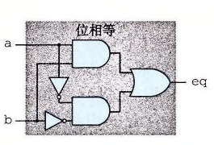

*图 4-10　检测位相等的组合电路。当输入都为 0 或都为 1 时，输出等于 1*

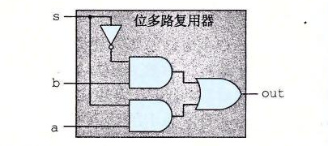

*图 4-11　单个位的多路复用器电路。如果控制信号 s 为 1，则输出等于输入 a；当 s 为 0 时，输出等于输入 b*

HCL 表达式很清楚地表明了组合逻辑电路和 C 语言中逻辑表达式的对应之处。它们都是用布尔操作来对输入进行计算的函数。值得注意的是，这两种表达计算的方法之间有以下区别：

- 因为组合电路是由一系列的逻辑门组成，它的属性是输出会持续地响应输入的变化。如果电路的输入变化了，在一定的延迟之后，输出也会相应地变化。相比之下，C 表达式只会在程序执行过程中被遇到时才进行求值。
- C 的逻辑表达式允许参数是任意整数，0 表示 FALSE，其他任何值都表示 TRUE。而逻辑门只对位值 0 和 1 进行操作。
- C 的逻辑表达式有个属性就是它们可能只被部分求值。如果一个 AND 或 OR 操作的结果只用对第一个参数求值就能确定，那么就不会对第二个参数求值了。例如下面的 C 表达式：

```c
(a && !a) && func(b,c)
```

这里函数 `func` 是不会被调用的，因为表达式 `(a && !a)` 求值为 0。而组合逻辑没有部分求值这条规则，逻辑门只是简单地响应输入的变化。

#### 4.2.3 字级的组合电路和 HCL 整数表达式

通过将逻辑门组合成大的网，可以构造出能计算更加复杂函数的组合电路。通常，我们设计能对数据字（word）进行操作的电路。有一些位级信号，代表一个整数或一些控制模式。例如，我们的处理器设计将包含有很多字，字的大小的范围为 4 位到 64 位，代表整数、地址、指令代码和寄存器标识符。

执行字级计算的组合电路根据输入字的各个位，用逻辑门来计算输出字的各个位。例如图 4-12 中的一个组合电路，它测试两个 64 位字 A 和 B 是否相等。也就是，当且仅当 A 的每一位都和 B 的相应位相等时，输出才为 1。这个电路是用 64 个图 4-10 中所示的单个位相等电路实现的。这些单个位电路的输出用一个 AND 门连起来，形成了这个电路的输出。


*图 4-12　字级相等测试电路。当字 A 的每一位与字 B 中相应的位均相等时，输出等于 1。字级相等是 HCL 中的一个操作*

在 HCL 中，我们将所有字级的信号都声明为 `int`，不指定字的大小。这样做是为了简单。在全功能的硬件描述语言中，每个字都可以声明为有特定的位数。HCL 允许比较字是否相等，因此图 4-12 所示的电路的函数可以在字级上表达成

```hcl
bool Eq = (A == B);
```

这里参数 A 和 B 是 `int` 型的。注意我们使用和 C 语言中一样的语法习惯，`=` 表示赋值，而 `==` 是相等运算符。

如图 4-12 中右边所示，在画字级电路的时候，我们用中等粗度的线来表示携带字的每个位的线路，而用虚线来表示布尔信号结果。

**练习题 4.10** 假设你用练习题 4.9 中的异或电路而不是位级的相等电路来实现一个字级的相等电路。设计一个 64 位字的相等电路需要 64 个位级的异或电路，另外还要两个逻辑门。

图 4-13 是字级的多路复用器电路。这个电路根据控制输入位 s，产生一个 64 位的字 Out，等于两个输入字 A 或者 B 中的一个。这个电路由 64 个相同的子电路组成，每个子电路的结构都类似于图 4-11 中的位级多路复用器。不过这个字级的电路并没有简单地复制 64 次位级多路复用器，它只产生一次 `!s`，然后在每个位的地方都重复使用它，从而减少反相器或非门（inverters）的数量。

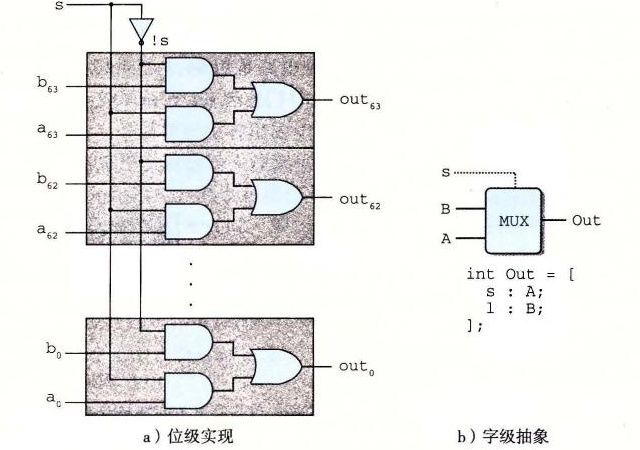

*图 4-13　字级多路复用器电路。当控制信号 s 为 1 时，输出会等于输入字 A，否则等于 B。HCL 中用情况（case）表达式来描述多路复用器*

处理器中会用到很多种多路复用器，使得我们能根据某些控制条件，从许多源中选出一个字。在 HCL 中，多路复用函数是用情况表达式（case expression）来描述的。情况表达式的通用格式如下：

```hcl
[
    select1 : expr1;
    select2 : expr2;
    ...
    selectk : exprk;
]
```

这个表达式包含一系列的情况，每种情况 i 都有一个布尔表达式 `select_i` 和一个整数表达式 `expr_i`，前者表明什么时候该选择这种情况，后者指明的是得到的值。

同 C 的 `switch` 语句不同，我们不要求不同的选择表达式之间互斥。从逻辑上讲，这些选择表达式是顺序求值的，且第一个求值为 1 的情况会被选中。例如，图 4-13 中的字级多路复用器用 HCL 来描述就是：

```hcl
word Out = [
    s : A;
    1 : B;
];
```

在这段代码中，第二个选择表达式就是 1，表明如果前面没有情况被选中，那就选择这种情况。这是 HCL 中一种指定默认情况的方法。几乎所有的情况表达式都是以此结尾的。

允许不互斥的选择表达式使得 HCL 代码的可读性更好。实际的硬件多路复用器的信号必须互斥，它们要控制哪个输入字应该被传送到输出，就像图 4-13 中的信号 s 和 `!s`。要将一个 HCL 情况表达式翻译成硬件，逻辑合成程序需要分析选择表达式集合，并解决任何可能的冲突，确保只有第一个满足的情况才会被选中。

选择表达式可以是任意的布尔表达式，可以有任意多的情况。这就使得情况表达式能描述带复杂选择标准的、多种输入信号的块。例如，考虑图 4-14 中所示的四路复用器的图。这个电路根据控制信号 s1 和 s0，从 4 个输入字 A、B、C 和 D 中选择一个，将控制信号看作一个两位的二进制数。我们可以用 HCL 来表示这个电路，用布尔表达式描述控制位模式的不同组合：


*图 4-14　四路复用器。控制信号 s1 和 s0 的不同组合决定了哪个数据输入会被传送到输出*

```hcl
word Out4 = [
    !s1 && !s0 : A; # 00
    !s1          : B; # 01
    !s0          : C; # 10
    1            : D; # 11
];
```

右边的注释（任何以 `#` 开头到行尾结束的文字都是注释）表明了 s1 和 s0 的什么组合会导致该种情况会被选中。可以看到选择表达式有时可以简化，因为只有第一个匹配的情况才会被选中。例如，第二个表达式可以写成 `!s1`，而不用写得更完整 `!s1 && s0`，因为另一种可能 s1 等于 0 已经出现在了第一个选择表达式中了。类似地，第三个表达式可以写作 `!s0`，而第四个可以简单地写成 1。

来看最后一个例子，假设我们想设计一个逻辑电路来找一组字 A、B 和 C 中的最小值，如下图所示：

```text
C ─┐
B ─┼─> [MIN3] ─> Min3
A ─┘
```

用 HCL 来表达就是：

```hcl
word Min3 = [
    A <= B && A <= C : A;
    B <= A && B <= C : B;
    1                : C;
];
```

**练习题 4.11** 计算三个字中最小值的 HCL 代码包含了 4 个形如 `X <= Y` 的比较表达式。重写代码计算同样的结果，但只使用三个比较。

**练习题 4.12** 写一个电路的 HCL 代码，对于输入字 A、B 和 C，选择中间值。也就是说，输出等于三个输入中居于最小值和最大值之间的那个字。

组合逻辑电路可以设计成在字级数据上执行许多不同类型的操作。具体的设计已经超出了我们讨论的范围。算术／逻辑单元（ALU）是一种很重要的组合电路，图 4-15 是它的一个抽象的图示。这个电路有三个输入：标号为 A 和 B 的两个数据输入，以及一个控制输入。根据控制输入的设置，电路会对数据输入执行不同的算术或逻辑操作。可以看到，这个 ALU 中画的四个操作对应于 Y86-64 指令集支持的四种不同的整数操作，而控制值和这些操作的功能码相对应（图 4-3）。我们还注意到减法的操作数顺序，是输入 B 减去输入 A。之所以这样做，是为了使这个顺序与 `subq` 指令的参数顺序一致。


*图 4-15　算术／逻辑单元（ALU）。根据函数输入的设置，该电路会执行四种算术和逻辑运算中的一种*

#### 4.2.4 集合关系

在处理器设计中，很多时候都需要将一个信号与许多可能匹配的信号做比较，以此来检测正在处理的某个指令代码是否属于某一类指令代码。下面来看一个简单的例子，假设想从一个两位信号 code 中选择高位和低位来为图 4-14 中的四路复用器产生信号 s1 和 s0，如下图所示：


在这个电路中，两位的信号 code 就可以用来控制对 4 个数据字 A、B、C 和 D 做选择。根据可能的 code 值，可以用相等测试来表示信号 s1 和 s0 的产生：

```hcl
bool s1 = code == 2 || code == 3;
bool s0 = code == 1 || code == 3;
```

还有一种更简洁的方式来表示这样的属性：当 code 在集合 {2, 3} 中时 s1 为 1，而 code 在集合 {1, 3} 中时 s0 为 1：

```hcl
bool s1 = code in { 2, 3 };
bool s0 = code in { 1, 3 };
```

判断集合关系的通用格式是：

```hcl
iexpr in { iexpr1, iexpr2, ..., iexprk }
```

这里被测试的值 `iexpr` 和待匹配的值 `iexpr1`～`iexprk` 都是整数表达式。

#### 4.2.5 存储器和时钟

组合电路从本质上讲，不存储任何信息。相反，它们只是简单地响应输入信号，产生等于输入的某个函数的输出。为了产生时序电路（sequential circuit），也就是有状态并且在这个状态上进行计算的系统，我们必须引入按位存储信息的设备。存储设备都是由同一个时钟控制的，时钟是一个周期性信号，决定什么时候要把新值加载到设备中。考虑两类存储器设备：

- 时钟寄存器（简称寄存器）存储单个位或字。时钟信号控制寄存器加载输入值。
- 随机访问存储器（简称内存）存储多个字，用地址来选择该读或该写哪个字。随机访问存储器的例子包括：1）处理器的虚拟内存系统，硬件和操作系统软件结合起来使处理器可以在一个很大的地址空间内访问任意的字；2）寄存器文件，在此，寄存器标识符作为地址。在 IA32 或 Y86-64 处理器中，寄存器文件有 15 个程序寄存器（`%rax`～`%r14`）。

正如我们看到的那样，在说到硬件和机器级编程时，“寄存器”这个词是两个有细微差别的事情。在硬件中，寄存器直接将它的输入和输出线连接到电路的其他部分。在机器级编程中，寄存器代表的是 CPU 中为数不多的可寻址的字，这里的地址是寄存器 ID。这些字通常都存在寄存器文件中，虽然我们会看到硬件有时可以直接将一个字从一个指令传送到另一个指令，以避免先写寄存器文件再读出来的延迟。需要避免歧义时，我们会分别称呼这两类寄存器为“硬件寄存器”和“程序寄存器”。

图 4-16 更详细地说明了一个硬件寄存器以及它是如何工作的。大多数时候，寄存器都保持在稳定状态（用 x 表示），产生的输出等于它的当前状态。信号沿着寄存器前面的组合逻辑传播，这时，产生了一个新的寄存器输入（用 y 表示），但只要时钟是低电位的，寄存器的输出就仍然保持不变。当时钟变成高电位的时候，输入信号就加载到寄存器中，成为下一个状态 y，直到下一个时钟上升沿，这个状态就一直是寄存器的新输出。关键是寄存器是作为电路不同部分中的组合逻辑之间的屏障。每当每个时钟到达上升沿时，值才会从寄存器的输入传送到输出。我们的 Y86-64 处理器会用时钟寄存器保存程序计数器（PC）、条件代码（CC）和程序状态（Stat）。


*图 4-16　寄存器操作。寄存器输出会一直保持在当前寄存器状态上，直到时钟信号上升。当时钟上升时，寄存器输入上的值会成为新的寄存器状态*

下面的图展示了一个典型的寄存器文件：


寄存器文件有两个读端口（A 和 B），还有一个写端口（W）。这样一个多端口随机访问存储器允许同时进行多个读和写操作。图中所示的寄存器文件中，电路可以读两个程序寄存器的值，同时更新第三个寄存器的状态。每个端口都有一个地址输入，表明该选择哪个程序寄存器，另外还有一个数据输出或对应该程序寄存器的输入值。地址是用图 4-4 中编码表示的寄存器标识符。两个读端口有地址输入 srcA 和 srcB（“source A” 和 “source B” 的缩写）和数据输出 valA 和 valB（“value A” 和 “value B” 的缩写）。写端口有地址输入 dstW（“destination W” 的缩写），以及数据输入 valW（“value W” 的缩写）。

虽然寄存器文件不是组合电路，因为它有内部存储。不过，在我们的实现中，从寄存器文件读数据就好像它是一个以地址为输入、数据为输出的一个组合逻辑块。当 srcA 或 srcB 被设成某个寄存器 ID 时，在一段延迟之后，存储在相应程序寄存器的值就会出现在 valA 或 valB 上。例如，将 srcA 设为 3，就会读出程序寄存器 `%rbx` 的值，然后这个值就会出现在输出 valA 上。

向寄存器文件写入字是由时钟信号控制的，控制方式类似于将值加载到时钟寄存器。每次时钟上升时，输入 valW 上的值会被写入输入 dstW 上的寄存器 ID 指示的程序寄存器。当 dstW 设为特殊的 ID 值 `0xF` 时，不会写任何程序寄存器。由于寄存器文件既可以读也可以写，一个很自然的问题就是“如果我们试图同时读和写同一个寄存器会发生什么？”答案简单明了：如果更新一个寄存器，同时在读端口上用同一个寄存器 ID，我们会看到一个从旧值到新值的变化。当我们把这个寄存器文件加入到处理器设计中，我们保证会考虑到这个属性的。

处理器有一个随机访问存储器来存储程序数据，如下图所示：

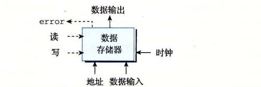

这个内存有一个地址输入，一个写的数据输入，以及一个读的数据输出。同寄存器文件一样，从内存中读的操作方式类似于组合逻辑：如果我们在输入 address 上提供一个地址，并将 write 控制信号设置为 0，那么在经过一些延迟之后，存储在那个地址上的值会出现在输出 data 上。如果地址超出了范围，error 信号会设置为 1，否则就设置为 0。写内存是由时钟控制的：我们将 address 设置为期望的地址，将 data in 设置为期望的值，而 write 设置为 1。然后当我们控制时钟时，只要地址是合法的，就会更新内存中指定的位置。对于读操作来说，如果地址是不合法的，error 信号会被设置为 1。这个信号是由组合逻辑产生的，因为所需要的边界检查纯粹就是地址输入的函数，不涉及保存任何状态。

> **旁注：现实的存储器设计**
>
> 真实微处理器中的存储器系统比我们在设计中假想的这个简单的存储器要复杂得多。它是由几种形式的硬件存储器组成的，包括几种随机访问存储器和磁盘，以及管理这些设备的各种硬件和软件机制。存储器系统的设计和特点在第 6 章中描述。
>
> 不过，我们简单的存储器设计可以用于较小的系统，它提供了更复杂系统的处理器和存储器之间接口的抽象。

我们的处理器还包括另外一个只读存储器，用来读指令。在大多数实际系统中，这两个存储器被合并为一个具有双端口的存储器：一个用来读指令，另一个用来读或者写数据。

### 4.3 Y86-64 的顺序实现

现在已经有了实现 Y86-64 处理器所需要的部件。首先，我们描述一个称为 SEQ（“sequential”，顺序的）的处理器。每个时钟周期上，SEQ 执行处理一条完整指令所需的所有步骤。不过，这需要一个很长的时钟周期时间，因此时钟周期频率会低到不可接受。我们开发 SEQ 的目标就是提供实现最终目的的第一步，我们的最终目的是实现一个高效的、流水线化的处理器。

#### 4.3.1 将处理组织成阶段

通常，处理一条指令包括很多操作。将它们组织成某个特殊的阶段序列，即使指令的动作差异很大，但所有的指令都遵循统一的序列。每一步的具体处理取决于正在执行的指令。创建这样一个框架，我们就能够设计一个充分利用硬件的处理器。下面是关于各个阶段以及各阶段内执行操作的简略描述：

- **取指（fetch）：** 取指阶段从内存读取指令字节，地址为程序计数器（PC）的值。从指令中抽取出指令指示符字节的两个四位部分，称为 `icode`（指令代码）和 `ifun`（指令功能）。它可能取出一个寄存器指示符字节，指明一个或两个寄存器操作数指示符 `rA` 和 `rB`。它还可能取出一个八字节常数字 `valC`。它按顺序方式计算当前指令的下一条指令的地址 `valP`。也就是说，`valP` 等于 PC 的值加上已取出指令的长度。
- **译码（decode）：** 译码阶段从寄存器文件读入最多两个操作数，得到值 `valA` 和/或 `valB`。通常，它读入指令 `rA` 和 `rB` 字段指明的寄存器，不过有些指令是读寄存器 `%rsp` 的。
- **执行（execute）：** 在执行阶段，算术/逻辑单元（ALU）要么执行指令指明的操作（根据 `ifun` 的值），计算内存引用的有效地址，要么增加或减少栈指针。得到的值我们称为 `valE`。在此，也可能设置条件码。对一条条件传送指令来说，这个阶段会检验条件码和传送条件（由 `ifun` 给出），如果条件成立，则更新目标寄存器。同样，对一条跳转指令来说，这个阶段会决定是不是应该选择分支。
- **访存（memory）：** 访存阶段可以将数据写入内存，或者从内存读出数据。读出的值为 `valM`。
- **写回（write back）：** 写回阶段最多可以写两个结果到寄存器文件。
- **更新 PC（PC update）：** 将 PC 设置成下一条指令的地址。

处理器无限循环，执行这些阶段。在我们简化的实现中，发生任何异常时，处理器就会停止：它执行 `halt` 指令或非法指令，或它试图读或者写非法地址。在更完整的设计中，处理器会进入异常处理模式，开始执行由异常的类型决定的特殊代码。

从前面的讲述可以看出，执行一条指令是需要进行很多处理的。我们不仅必须执行指令所表明的操作，还必须计算地址、更新栈指针，以及确定下一条指令的地址。幸好每条指令的整个流程都比较相似。因为我们想使硬件数量尽可能少，并且最终将把它映射到一个二维的集成电路芯片的表面，在设计硬件时，一个非常简单而一致的结构是非常重要的。降低复杂度的一种方法是让不同的指令共享尽量多的硬件。例如，我们的每个处理器设计都只含有一个算术/逻辑单元，根据所执行的指令类型的不同，它的使用方式也不同。在硬件上复制逻辑块的成本比软件中有重复代码的成本大得多。而且在硬件系统中处理许多特殊情况和特性要比用软件来处理困难得多。

我们面临的一个挑战是将每条不同指令所需要的计算放入到上述那个通用框架中。我们会使用图 4-17 中所示的代码来描述不同 Y86-64 指令的处理。图 4-18～图 4-21 中的表描述了不同 Y86-64 指令在各个阶段是怎样处理的。很值得仔细研究一下这些表。表中的这种格式很容易映射到硬件。表中的每一行都描述了一个信号或存储状态的分配（用分配操作 `←` 来表示）。阅读时可以把它看成是从上至下的顺序求值。当我们将这些计算映射到硬件时，会发现其实并不需要严格按照顺序来执行这些求值。

```text
1   0x000: 30f20900000000000000 | irmovq $9, %rdx
2   0x00a: 30f31500000000000000 | irmovq $21, %rbx
3   0x014: 6123                 | subq %rdx, %rbx       # subtract
4   0x016: 30f48000000000000000 | irmovq $128, %rsp     # Problem 4.13
5   0x020: 40436400000000000000 | rmmovq %rsp, 100(%rbx) # store
6   0x02a: a02f                 | pushq %rdx            # push
7   0x02c: b00f                 | popq %rax             # Problem 4.14
8   0x02e: 734000000000000000   | je done               # Not taken
9   0x037: 804100000000000000   | call proc             # Problem 4.18
10  0x040:                      | done:
11  0x040: 00                   |     halt
12  0x041:                      | proc:
13  0x041: 90                   |     ret               # Return
14                              |
```

*图 4-17　Y86-64 指令序列示例。我们会跟踪这些指令通过各个阶段的处理*

图 4-18 给出了对 `OPq`（整数和逻辑运算）、`rrmovq`（寄存器-寄存器传送）和 `irmovq`（立即数-寄存器传送）类型的指令所需的处理。让我们先来考虑一下整数操作。回顾图 4-2，可以看到我们小心地选择了指令编码，这样四个整数操作（`addq`、`subq`、`andq` 和 `xorq`）都有相同的 `icode` 值。我们可以以相同的步骤顺序来处理它们，除了 ALU 计算必须根据 `ifun` 中编码的具体的指令操作来设定。

| 阶段 | `OPq rA, rB` | `rrmovq rA, rB` | `irmovq V, rB` |
|---|---|---|---|
| 取指 | `icode:ifun ← M₁[PC]`；`rA:rB ← M₁[PC+1]`；`valP ← PC+2` | `icode:ifun ← M₁[PC]`；`rA:rB ← M₁[PC+1]`；`valP ← PC+2` | `icode:ifun ← M₁[PC]`；`rA:rB ← M₁[PC+1]`；`valC ← M₈[PC+2]`；`valP ← PC+10` |
| 译码 | `valA ← R[rA]`；`valB ← R[rB]` | `valA ← R[rA]` |  |
| 执行 | `valE ← valB OP valA`；Set CC | `valE ← 0+valA` | `valE ← 0+valC` |
| 访存 |  |  |  |
| 写回 | `R[rB] ← valE` | `R[rB] ← valE` | `R[rB] ← valE` |
| 更新 PC | `PC ← valP` | `PC ← valP` | `PC ← valP` |

*图 4-18　Y86-64 指令 `OPq`、`rrmovq` 和 `irmovq` 在顺序实现中的计算。这些指令计算了一个值，并将结果存放在寄存器中。符号 `icode:ifun` 表明指令字节的两个组成部分，而 `rA:rB` 表明寄存器指示符字节的两个组成部分。符号 `M₁[x]` 表示访问（读或者写）内存位置 x 处的一个字节，而 `M₈[x]` 表示访问八个字节*

整数操作指令的处理遵循上面列出的通用模式。在取指阶段，我们不需要常数字，所以 `valP` 就计算为 `PC+2`。在译码阶段，我们要读两个操作数。在执行阶段，它们和功能指示符 `ifun` 一起再提供给 ALU，这样一来 `valE` 就成为了指令结果。这个计算是用表达式 `valB OP valA` 来表达的，这里 `OP` 代表 `ifun` 指定的操作。要注意两个参数的顺序——这个顺序与 Y86-64（和 x86-64）的习惯是一致的。例如，指令 `subq %rax, %rdx` 计算的是 `R[%rdx]-R[%rax]` 的值。这些指令在访存阶段什么也不做，而在写回阶段，`valE` 被写入寄存器 `rB`，然后 PC 设为 `valP`，整个指令的执行就结束了。

> **旁注　跟踪 `subq` 指令的执行**
>
> 作为一个例子，让我们来看看一条 `subq` 指令的处理过程，这条指令是图 4-17 所示目标代码的第 3 行中的 `subq` 指令。可以看到前面两条指令分别将寄存器 `%rdx` 和 `%rbx` 初始化成 9 和 21。我们还能看到指令位于地址 `0x014`，由两个字节组成，值分别为 `0x61` 和 `0x23`。这条指令处理的各个阶段如下表所示，左边列出了处理一个 `OPq` 指令的通用的规则（图 4-18），而右边列出的是对这条具体指令的计算。
>
> | 阶段 | 通用：`OPq rA, rB` | 具体：`subq %rdx, %rbx` |
> |---|---|---|
> | 取指 | `icode:ifun ← M₁[PC]`；`rA:rB ← M₁[PC+1]`；`valP ← PC+2` | `icode:ifun ← M₁[0x014] = 6:1`；`rA:rB ← M₁[0x015] = 2:3`；`valP ← 0x014+2 = 0x016` |
> | 译码 | `valA ← R[rA]`；`valB ← R[rB]` | `valA ← R[%rdx] = 9`；`valB ← R[%rbx] = 21` |
> | 执行 | `valE ← valB OP valA`；Set CC | `valE ← 21-9 = 12`；`ZF ← 0, SF ← 0, OF ← 0` |
> | 访存 |  |  |
> | 写回 | `R[rB] ← valE` | `R[%rbx] ← valE = 12` |
> | 更新 PC | `PC ← valP` | `PC ← valP = 0x016` |
>
> 这个跟踪表明我们达到了理想的效果，寄存器 `%rbx` 设成了 12，三个条件码都设成了 0，而 PC 加了 2。

执行 `rrmovq` 指令和执行算术运算类似。不过，不需要取第二个寄存器操作数。我们将 ALU 的第二个输入设为 0，先把它和第一个操作数相加，得到 `valE=valA`，然后再把这个值写到寄存器文件。对 `irmovq` 的处理与此类似，除了 ALU 的第一个输入为常数值 `valC`。另外，因为是长指令格式，对于 `irmovq`，程序计数器必须加 10。所有这些指令都不改变条件码。

**练习题 4.13** 填写下表的右边一栏，这个表描述的是图 4-17 中目标代码第 4 行上的 `irmovq` 指令的处理情况：

| 阶段 | 通用：`irmovq V, rB` | 具体：`irmovq $128, %rsp` |
|---|---|---|
| 取指 | `icode:ifun ← M₁[PC]`；`rA:rB ← M₁[PC+1]`；`valC ← M₈[PC+2]`；`valP ← PC+10` |  |
| 译码 |  |  |
| 执行 | `valE ← 0+valC` |  |
| 访存 |  |  |
| 写回 | `R[rB] ← valE` |  |
| 更新 PC | `PC ← valP` |  |

这条指令的执行会怎样改变寄存器和 PC 呢？

图 4-19 给出了内存读写指令 `rmmovq` 和 `mrmovq` 所需要的处理。基本流程也和前面的一样，不过是用 ALU 来加 `valC` 和 `valB`，得到内存操作的有效地址（偏移量与基址寄存器值之和）。在访存阶段，会将寄存器值 `valA` 写到内存，或者从内存中读出 `valM`。

| 阶段 | `rmmovq rA, D(rB)` | `mrmovq D(rB), rA` |
|---|---|---|
| 取指 | `icode:ifun ← M₁[PC]`；`rA:rB ← M₁[PC+1]`；`valC ← M₈[PC+2]`；`valP ← PC+10` | `icode:ifun ← M₁[PC]`；`rA:rB ← M₁[PC+1]`；`valC ← M₈[PC+2]`；`valP ← PC+10` |
| 译码 | `valA ← R[rA]`；`valB ← R[rB]` | `valB ← R[rB]` |
| 执行 | `valE ← valB+valC` | `valE ← valB+valC` |
| 访存 | `M₈[valE] ← valA` | `valM ← M₈[valE]` |
| 写回 |  | `R[rA] ← valM` |
| 更新 PC | `PC ← valP` | `PC ← valP` |

*图 4-19　Y86-64 指令 `rmmovq` 和 `mrmovq` 在顺序实现中的计算。这些指令读或者写内存*

> **旁注　跟踪 `rmmovq` 指令的执行**
>
> 让我们来看看图 4-17 中目标代码的第 5 行 `rmmovq` 指令的处理情况。可以看到，前面的指令已将寄存器 `%rsp` 初始化成了 128，而 `%rbx` 仍然是 `subq` 指令（第 3 行）算出来的结果 12。我们还可以看到，指令位于地址 `0x020`，有 10 个字节。前两个的值为 `0x40` 和 `0x43`，后 8 个是数字 `0x0000000000000064`（十进制数 100）按字节反过来得到的数。各个阶段的处理如下：
>
> | 阶段 | 通用：`rmmovq rA, D(rB)` | 具体：`rmmovq %rsp, 100(%rbx)` |
> |---|---|---|
> | 取指 | `icode:ifun ← M₁[PC]`；`rA:rB ← M₁[PC+1]`；`valC ← M₈[PC+2]`；`valP ← PC+10` | `icode:ifun ← M₁[0x020] = 4:0`；`rA:rB ← M₁[0x021] = 4:3`；`valC ← M₈[0x022] = 100`；`valP ← 0x020+10 = 0x02a` |
> | 译码 | `valA ← R[rA]`；`valB ← R[rB]` | `valA ← R[%rsp] = 128`；`valB ← R[%rbx] = 12` |
> | 执行 | `valE ← valB+valC` | `valE ← 12+100 = 112` |
> | 访存 | `M₈[valE] ← valA` | `M₈[112] ← 128` |
> | 写回 |  |  |
> | 更新 PC | `PC ← valP` | `PC ← 0x02a` |
>
> 跟踪记录表明这条指令的效果就是将 128 写入内存地址 112，并将 PC 加 10。

图 4-20 给出了处理 `pushq` 和 `popq` 指令所需的步骤。它们可以算是最难实现的 Y86-64 指令了，因为它们既涉及访问内存，又要增加或减少栈指针。虽然这两条指令的流程比较相似，但是它们还是有很重要的区别。

| 阶段 | `pushq rA` | `popq rA` |
|---|---|---|
| 取指 | `icode:ifun ← M₁[PC]`；`rA:rB ← M₁[PC+1]`；`valP ← PC+2` | `icode:ifun ← M₁[PC]`；`rA:rB ← M₁[PC+1]`；`valP ← PC+2` |
| 译码 | `valA ← R[rA]`；`valB ← R[%rsp]` | `valA ← R[%rsp]`；`valB ← R[%rsp]` |
| 执行 | `valE ← valB+(-8)` | `valE ← valB+8` |
| 访存 | `M₈[valE] ← valA` | `valM ← M₈[valA]` |
| 写回 | `R[%rsp] ← valE` | `R[%rsp] ← valE`；`R[rA] ← valM` |
| 更新 PC | `PC ← valP` | `PC ← valP` |

*图 4-20　Y86-64 指令 `pushq` 和 `popq` 在顺序实现中的计算。这些指令将值压入或弹出栈*

`pushq` 指令开始时很像我们前面讲过的指令，但是在译码阶段，用 `%rsp` 作为第二个寄存器操作数的标识符，将栈指针赋值为 `valB`。在执行阶段，用 ALU 将栈指针减 8。减过 8 的值就是内存写的地址，在写回阶段还会存回到 `%rsp` 中。将 `valE` 作为写操作的地址，是遵循 Y86-64（和 x86-64）的惯例，也就是在写之前，`pushq` 应该先将栈指针减去 8，即使栈指针的更新实际上是在内存操作完成之后才进行的。

> **旁注　跟踪 `pushq` 指令的执行**
>
> 让我们来看看图 4-17 中目标代码的第 6 行 `pushq` 指令的处理情况。此时，寄存器 `%rdx` 的值为 9，而寄存器 `%rsp` 的值为 128。我们还可以看到指令是位于地址 `0x02a`，有两个字节，值分别为 `0xa0` 和 `0x2f`。各个阶段的处理如下：
>
> | 阶段 | 通用：`pushq rA` | 具体：`pushq %rdx` |
> |---|---|---|
> | 取指 | `icode:ifun ← M₁[PC]`；`rA:rB ← M₁[PC+1]`；`valP ← PC+2` | `icode:ifun ← M₁[0x02a] = a:0`；`rA:rB ← M₁[0x02b] = 2:f`；`valP ← 0x02a+2 = 0x02c` |
> | 译码 | `valA ← R[rA]`；`valB ← R[%rsp]` | `valA ← R[%rdx] = 9`；`valB ← R[%rsp] = 128` |
> | 执行 | `valE ← valB+(-8)` | `valE ← 128+(-8) = 120` |
> | 访存 | `M₈[valE] ← valA` | `M₈[120] ← 9` |
> | 写回 | `R[%rsp] ← valE` | `R[%rsp] ← 120` |
> | 更新 PC | `PC ← valP` | `PC ← 0x02c` |
>
> 跟踪记录表明这条指令的效果就是将 `%rsp` 设为 120，将 9 写入地址 120，并将 PC 加 2。

`popq` 指令的执行与 `pushq` 的执行类似，除了在译码阶段要读两次栈指针以外。这样做看上去很多余，但是我们会看到让 `valA` 和 `valB` 都存放栈指针的值，会使后面的流程跟其他的指令更相似，增强设计的整体一致性。在执行阶段，用 ALU 给栈指针加 8，但是用没加过 8 的原始值作为内存操作的地址。在写回阶段，要用加过 8 的栈指针更新栈指针寄存器，还要将寄存器 `rA` 更新为从内存中读出的值。用没加过 8 的值作为内存读地址，保持了 Y86-64（和 x86-64）的惯例，`popq` 应该首先读内存，然后再增加栈指针。

**练习题 4.14** 填写下表的右边一栏，这个表描述的是图 4-17 中目标代码第 7 行 `popq` 指令的处理情况：

| 阶段 | 通用：`popq rA` | 具体：`popq %rax` |
|---|---|---|
| 取指 | `icode:ifun ← M₁[PC]`；`rA:rB ← M₁[PC+1]`；`valP ← PC+2` |  |
| 译码 | `valA ← R[%rsp]`；`valB ← R[%rsp]` |  |
| 执行 | `valE ← valB+8` |  |
| 访存 | `valM ← M₈[valA]` |  |
| 写回 | `R[%rsp] ← valE`；`R[rA] ← valM` |  |
| 更新 PC | `PC ← valP` |  |

这条指令的执行会怎样改变寄存器和 PC 呢？

**练习题 4.15** 根据图 4-20 中列出的步骤，指令 `pushq %rsp` 会有什么样的效果？这与练习题 4.7 中确定的 Y86-64 期望的行为一致吗？

**练习题 4.16** 假设 `popq` 在写回阶段中的两个寄存器写操作按照图 4-20 列出的顺序进行。`popq %rsp` 执行的效果会是怎样的？这与练习题 4.8 中确定的 Y86-64 期望的行为一致吗？

图 4-21 表明了三类控制转移指令的处理：各种跳转、`call` 和 `ret`。可以看到，我们能用同前面指令一样的整体流程来实现这些指令。

| 阶段 | `jXX Dest` | `call Dest` | `ret` |
|---|---|---|---|
| 取指 | `icode:ifun ← M₁[PC]`；`valC ← M₈[PC+1]`；`valP ← PC+9` | `icode:ifun ← M₁[PC]`；`valC ← M₈[PC+1]`；`valP ← PC+9` | `icode:ifun ← M₁[PC]`；`valP ← PC+1` |
| 译码 |  | `valB ← R[%rsp]` | `valA ← R[%rsp]`；`valB ← R[%rsp]` |
| 执行 | `Cnd ← Cond(CC, ifun)` | `valE ← valB+(-8)` | `valE ← valB+8` |
| 访存 |  | `M₈[valE] ← valP` | `valM ← M₈[valA]` |
| 写回 |  | `R[%rsp] ← valE` | `R[%rsp] ← valE` |
| 更新 PC | `PC ← Cnd ? valC : valP` | `PC ← valC` | `PC ← valM` |

*图 4-21　Y86-64 指令 `jXX`、`call` 和 `ret` 在顺序实现中的计算。这些指令导致控制转移*

同对整数操作一样，我们能够以一种统一的方式处理所有的跳转指令，因为它们的不同只在于判断是否要选择分支的时候。除了不需要一个寄存器指示符字节以外，跳转指令在取指和译码阶段都和前面讲的其他指令类似。在执行阶段，检查条件码和跳转条件来确定是否要选择分支，产生出一个一位信号 `Cnd`。在更新 PC 阶段，检查这个标志，如果这个标志为 1，就将 PC 设为 `valC`（跳转目标），如果为 0，就设为 `valP`（下一条指令的地址）。我们的表示法 `x ? a : b` 类似于 C 语句中的条件表达式——当 x 非零时，它等于 a，当 x 为零时，等于 b。

> **旁注　跟踪 `je` 指令的执行**
>
> 让我们来看看图 4-17 中目标代码的第 8 行 `je` 指令的处理情况。`subq` 指令（第 3 行）已经将所有的条件码都置为了 0，所以不会选择分支。该指令位于地址 `0x02e`，有 9 个字节。第一个字节的值为 `0x73`，而剩下的 8 个字节是数字 `0x0000000000000040` 按字节反过来得到的数，也就是跳转的目标。各个阶段的处理如下：
>
> | 阶段 | 通用：`jXX Dest` | 具体：`je 0x040` |
> |---|---|---|
> | 取指 | `icode:ifun ← M₁[PC]`；`valC ← M₈[PC+1]`；`valP ← PC+9` | `icode:ifun ← M₁[0x02e] = 7:3`；`valC ← M₈[0x02f] = 0x040`；`valP ← 0x02e+9 = 0x037` |
> | 译码 |  |  |
> | 执行 | `Cnd ← Cond(CC, ifun)` | `Cnd ← Cond(⟨0, 0, 0⟩, 3) = 0` |
> | 访存 |  |  |
> | 写回 |  |  |
> | 更新 PC | `PC ← Cnd ? valC : valP` | `PC ← 0 ? 0x040 : 0x037 = 0x037` |
>
> 就像这个跟踪记录表明的那样，这条指令的效果就是将 PC 加 9。

**练习题 4.17** 从指令编码（图 4-2 和图 4-3）我们可以看出，`rrmovq` 指令是一类更通用的、包括条件传送在内的指令的无条件版本。请给出你要如何修改下面 `rrmovq` 指令的步骤，使之也能处理 6 个条件传送指令。看看 `jXX` 指令的实现（图 4-21）是如何处理条件行为的，可能会有所帮助。

| 阶段 | `cmovXX rA, rB` |
|---|---|
| 取指 | `icode:ifun ← M₁[PC]`；`rA:rB ← M₁[PC+1]`；`valP ← PC+2` |
| 译码 | `valA ← R[rA]` |
| 执行 | `valE ← 0+valA` |
| 访存 |  |
| 写回 | `R[rB] ← valE` |
| 更新 PC | `PC ← valP` |

指令 `call` 和 `ret` 与指令 `pushq` 和 `popq` 类似，除了我们要将程序计数器的值入栈和出栈以外。对指令 `call`，我们要将 `valP`，也就是 `call` 指令后紧跟着的那条指令的地址，压入栈中。在更新 PC 阶段，将 PC 设为 `valC`，也就是调用的目的地。对指令 `ret`，在更新 PC 阶段，我们将 `valM`，即从栈中取出的值，赋值给 PC。

**练习题 4.18** 填写下表的右边一栏，这个表描述的是图 4-17 中目标代码第 9 行 `call` 指令的处理情况：

| 阶段 | 通用：`call Dest` | 具体：`call 0x041` |
|---|---|---|
| 取指 | `icode:ifun ← M₁[PC]`；`valC ← M₈[PC+1]`；`valP ← PC+9` |  |
| 译码 | `valB ← R[%rsp]` |  |
| 执行 | `valE ← valB+(-8)` |  |
| 访存 | `M₈[valE] ← valP` |  |
| 写回 | `R[%rsp] ← valE` |  |
| 更新 PC | `PC ← valC` |  |

这条指令的执行会怎样改变寄存器、PC 和内存呢？

我们创建了一个统一的框架，能处理所有不同类型的 Y86-64 指令。虽然指令的行为大不相同，但是我们可以将指令的处理组织成 6 个阶段。现在我们的任务是创建硬件设计来实现这些阶段，并把它们连接起来。

> **旁注　跟踪 `ret` 指令的执行**
>
> 让我们来看看图 4-17 中目标代码的第 13 行 `ret` 指令的处理情况。指令的地址是 `0x041`，只有一个字节的编码，`0x90`。前面的 `call` 指令将 `%rsp` 置为了 120，并将返回地址 `0x040` 存放在了内存地址 120 中。各个阶段的处理如下：
>
> | 阶段 | 通用：`ret` | 具体：`ret` |
> |---|---|---|
> | 取指 | `icode:ifun ← M₁[PC]`；`valP ← PC+1` | `icode:ifun ← M₁[0x041] = 9:0`；`valP ← 0x041+1 = 0x042` |
> | 译码 | `valA ← R[%rsp]`；`valB ← R[%rsp]` | `valA ← R[%rsp] = 120`；`valB ← R[%rsp] = 120` |
> | 执行 | `valE ← valB+8` | `valE ← 120+8 = 128` |
> | 访存 | `valM ← M₈[valA]` | `valM ← M₈[120] = 0x040` |
> | 写回 | `R[%rsp] ← valE` | `R[%rsp] ← 128` |
> | 更新 PC | `PC ← valM` | `PC ← 0x040` |
>
> 跟踪记录表明这条指令的效果就是将 PC 设为 `0x040`，`halt` 指令的地址。同时也将 `%rsp` 置为了 128。

#### 4.3.2 SEQ 硬件结构

实现所有 Y86-64 指令所需要的计算可以被组织成 6 个基本阶段：取指、译码、执行、访存、写回和更新 PC。图 4-22 给出了一个能执行这些计算的硬件结构的抽象表示。程序计数器放在寄存器中，在图中左下角（标明为“PC”）。然后，信息沿着线流动（多条线组合在一起就用宽一点的灰线来表示），先向上，再向右。同各个阶段相关的硬件单元（hardware units）负责执行这些处理。在右边，反馈线路向下，包括要写到寄存器文件的更新值，以及更新的程序计数器值。正如在 4.3.3 节中讨论的那样，在 SEQ 中，所有硬件单元的处理都在一个时钟周期内完成。这张图省略了一些小的组合逻辑块，还省略了所有用来操作各个硬件单元以及将相应的值路由到这些单元的控制逻辑。稍后会补充这些细节。我们从下往上画处理器和流程的方法似乎有点奇怪。在开始设计流水线化的处理器时，我们会解释这么画的原因。


*图 4-22　SEQ 的抽象视图，一种顺序实现。指令执行过程中的信息处理沿着顺时针方向的流程进行，从用程序计数器（PC）取指令开始，如图中左下角所示*

硬件单元与各个处理阶段相关联：

- **取指：** 将程序计数器寄存器作为地址，指令内存读取指令的字节。PC 增加器（PC incrementer）计算 `valP`，即增加了的程序计数器。
- **译码：** 寄存器文件有两个读端口 A 和 B，从这两个端口同时读寄存器值 `valA` 和 `valB`。
- **执行：** 执行阶段会根据指令的类型，将算术/逻辑单元（ALU）用于不同的目的。对整数操作，它要执行指令所指定的运算。对其他指令，它会作为一个加法器来计算增加或减少栈指针，或者计算有效地址，或者只是简单地加 0，将一个输入传递到输出。

条件码寄存器（CC）有三个条件码位。ALU 负责计算条件码的新值。当执行条件传送指令时，根据条件码和传送条件来计算决定是否更新目标寄存器。同样，当执行一条跳转指令时，会根据条件码和跳转类型来计算分支信号 `Cnd`。

- **访存：** 在执行访存操作时，数据内存读出或写入一个内存字。指令和数据内存访问的是相同的内存位置，但是用于不同的目的。
- **写回：** 寄存器文件有两个写端口。端口 E 用来写 ALU 计算出来的值，而端口 M 用来写从数据内存中读出的值。
- **PC 更新：** 程序计数器的新值选择自：`valP`，下一条指令的地址；`valC`，调用指令或跳转指令指定的目标地址；`valM`，从内存读取的返回地址。

图 4-23 更详细地给出了实现 SEQ 所需要的硬件（分析每个阶段时，我们会看到完整的细节）。我们看到一组和前面一样的硬件单元，但是现在线路看得更清楚了。这幅图以及其他的硬件图都使用的是下面的画图惯例。


*图 4-23　SEQ 的硬件结构，一种顺序实现。有些控制信号以及寄存器和控制字连接没有画出来*

- 白色方框表示时钟寄存器。程序计数器 PC 是 SEQ 中唯一的时钟寄存器。
- 浅蓝色方框表示硬件单元。这包括内存、ALU 等等。在我们所有的处理器实现中，都会使用这一组基本的单元。我们把这些单元当作“黑盒子”，不关心它们的细节设计。
- 控制逻辑块用灰色圆角矩形表示。这些块用来从一组信号源中进行选择，或者用来计算一些布尔函数。我们会非常详细地分析这些块，包括给出 HCL 描述。
- 线路的名字在白色圆圈中说明。它们只是线路的标识，而不是什么硬件单元。
- 宽度为字长的数据连接用中等粗度的线表示。每条这样的线实际上都代表一簇 64 根线，并列地连在一起，将一个字从硬件的一个部分传送到另一部分。
- 宽度为字节或更窄的数据连接用细线表示。根据线上要携带的值的类型，每条这样的线实际上都代表一簇 4 根或 8 根线。
- 单个位的连接用虚线来表示。这代表芯片上单元与块之间传递的控制值。

图 4-18～图 4-21 中所有的计算都有这样的性质，每一行都代表某个值的计算（如 `valP`），或者激活某个硬件单元（如内存）。图 4-24 的第二栏列出了这些计算和动作。除了我们已经讲过的那些信号以外，还列出了四个寄存器 ID 信号：`srcA`，`valA` 的源；`srcB`，`valB` 的源；`dstE`，写入 `valE` 的寄存器；以及 `dstM`，写入 `valM` 的寄存器。

| 阶段 | 计算 | `OPq rA, rB` | `mrmovq D(rB), rA` |
|---|---|---|---|
| 取指 | `icode, ifun`；`rA, rB`；`valC`；`valP` | `icode:ifun ← M₁[PC]`；`rA:rB ← M₁[PC+1]`；`valP ← PC+2` | `icode:ifun ← M₁[PC]`；`rA:rB ← M₁[PC+1]`；`valC ← M₈[PC+2]`；`valP ← PC+10` |
| 译码 | `valA, srcA`；`valB, srcB` | `valA ← R[rA]`；`valB ← R[rB]` | `valB ← R[rB]` |
| 执行 | `valE`；Cond. codes | `valE ← valB OP valA`；Set CC | `valE ← valB+valC` |
| 访存 | Read/write |  | `valM ← M₈[valE]` |
| 写回 | E port, `dstE`；M port, `dstM` | `R[rB] ← valE` | `R[rA] ← valM` |
| 更新 PC | PC | `PC ← valP` | `PC ← valP` |

*图 4-24　标识顺序实现中的不同计算步骤。第二栏标识出 SEQ 阶段中正在被计算的值，或正在被执行的操作。以指令 `OPq` 和 `mrmovq` 的计算作为示例*

图中，右边两栏给出的是指令 `OPq` 和 `mrmovq` 的计算，来说明要计算的值。要将这些计算映射到硬件上，我们要实现控制逻辑，它能在不同硬件单元之间传送数据，以及操作这些单元，使得对每个不同的指令执行指定的运算。这就是控制逻辑块的目标，控制逻辑块在图 4-23 中用灰色圆角方框表示。我们的任务就是依次经过每个阶段，创建这些块的详细设计。

#### 4.3.3 SEQ 的时序

在介绍图 4-18～图 4-21 的表时，我们说过要把它们看成是用程序符号写的，那些赋值是从上到下顺序执行的。然而，图 4-23 中硬件结构的操作运行根本完全不同，一个时钟变化会引发一个经过组合逻辑的流，来执行整个指令。让我们来看看这些硬件怎样实现表中列出的这一行为。

SEQ 的实现包括组合逻辑和两种存储器设备：时钟寄存器（程序计数器和条件码寄存器），随机访问存储器（寄存器文件、指令内存和数据内存）。组合逻辑不需要任何时序或控制——只要输入变化了，值就通过逻辑门网络传播。正如提到过的那样，我们也将读随机访问存储器看成和组合逻辑一样的操作，根据地址输入产生输出字。对于较小的存储器来说（例如寄存器文件），这是一个合理的假设，而对于较大的电路来说，可以用特殊的时钟电路来模拟这个效果。由于指令内存只用来读指令，因此我们可以将这个单元看成是组合逻辑。

现在还剩四个硬件单元需要对它们的时序进行明确的控制——程序计数器、条件码寄存器、数据内存和寄存器文件。这些单元通过一个时钟信号来控制，它触发将新值装载到寄存器以及将值写到随机访问存储器。每个时钟周期，程序计数器都会装载新的指令地址。只有在执行整数运算指令时，才会装载条件码寄存器。只有在执行 `rmmovq`、`pushq` 或 `call` 指令时，才会写数据内存。寄存器文件的两个写端口允许每个时钟周期更新两个程序寄存器，不过我们可以用特殊的寄存器 ID `0xF` 作为端口地址，来表明在此端口不应该执行写操作。

要控制处理器中活动的时序，只需要寄存器和内存的时钟控制。硬件获得了如图 4-18～图 4-21 的表中所示的那些赋值顺序执行一样的效果，即使所有的状态更新实际上同时发生，且只在时钟上升开始下一个周期时。之所以能保持这样的等价性，是由于 Y86-64 指令集的本质，因为我们遵循以下原则组织计算：

> **原则：从不回读**
>
> 处理器从来不需要为了完成一条指令的执行而去读由该指令更新了的状态。

这条原则对实现的成功来说至关重要。为了说明问题，假设我们对 `pushq` 指令的实现是先将 `%rsp` 减 8，再将更新后的 `%rsp` 值作为写操作的地址。这种方法同前面所说的那个原则相违背。为了执行内存操作，它需要先从寄存器文件中读更新过的栈指针。然而，我们的实现（图 4-20）产生出减后的栈指针值，作为信号 `valE`，然后再用这个信号既作为寄存器写的数据，也作为内存写的地址。因此，在时钟上升开始下一个周期时，处理器就可以同时执行寄存器写和内存写了。

再举个例子来说明这条原则，我们可以看到有些指令（整数运算）会设置条件码，有些指令（跳转指令）会读取条件码，但没有指令必须既设置又读取条件码。虽然要到时钟上升开始下一个周期时，才会设置条件码，但是在任何指令试图读之前，它们都会更新。

以下是汇编代码，左边列出的是指令地址，图 4-25 给出了 SEQ 硬件如何处理其中第 3 和第 4 行指令：

```text
1  0x000:       irmovq $0x100, %rbx      # %rbx <-- 0x100
2  0x00a:       irmovq $0x200, %rdx      # %rdx <-- 0x200
3  0x014:       addq %rdx, %rbx          # %rbx <-- 0x300 CC <-- 000
4  0x016:       je dest                   # Not taken
5  0x01f:       rmmovq %rbx, 0(%rdx)     # M[0x200] <-- 0x300
6  0x029: dest: halt
```

标号为 1～4 的各个图给出了 4 个状态单元，还有组合逻辑，以及状态单元之间的连接。组合逻辑被条件码寄存器环绕着，因为有的组合逻辑（例如 ALU）产生输入到条件码寄存器，而其他部分（例如分支计算和 PC 选择逻辑）又将条件码寄存器作为输入。图中寄存器文件和数据内存有独立的读连接和写连接，因为读操作沿着这些单元传播，就好像它们是组合逻辑，而写操作是由时钟控制的。

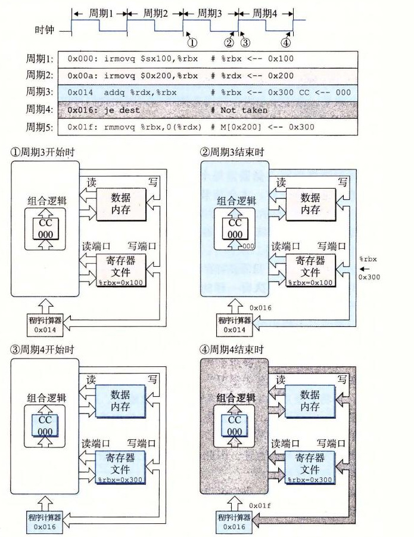

*图 4-25　跟踪 SEQ 的两个执行周期。每个周期开始时，状态单元（程序计数器、条件码寄存器、寄存器文件以及数据内存）是根据前一条指令设置的。信号传播通过组合逻辑，创建出新的状态单元的值。在下一个周期开始时，这些值会被加载到状态单元中*

图 4-25 中的不同颜色的代码表明电路信号是如何与正在被执行的不同指令相联系的。我们假设处理是从设置条件码开始的，按照 ZF、SF 和 OF 的顺序，设为 100。在时钟周期 3 开始的时候（点 1），状态单元保持的是第二条 `irmovq` 指令（表中第 2 行）更新过的状态，该指令用浅灰色表示。组合逻辑用白色表示，表明它还没有来得及对变化了的状态做出反应。时钟周期开始时，地址 `0x014` 载入程序计数器中。这样就会取出和处理 `addq` 指令（表中第 3 行）。值沿着组合逻辑流动，包括读随机访问存储器。在这个周期末尾（点 2），组合逻辑为条件码产生了新的值（000），程序寄存器 `%rbx` 的更新值，以及程序计数器的新值（`0x016`）。在此时，组合逻辑已经根据 `addq` 指令被更新了，但是状态还是保持着第二条 `irmovq` 指令（用浅灰色表示）设置的值。

当时钟上升开始周期 4 时（点 3），会更新程序计数器、寄存器文件和条件码寄存器，因此我们用蓝色来表示，但是组合逻辑还没有对这些变化做出反应，所以用白色表示。在这个周期内，会取出并执行 `je` 指令（表中第 4 行），在图中用深灰色表示。因为条件码 ZF 为 0，所以不会选择分支。在这个周期末尾（点 4），程序计数器已经产生了新值 `0x01f`。组合逻辑已经根据 `je` 指令（用深灰色表示）被更新过了，但是直到下个周期开始之前，状态还是保持着 `addq` 指令（用蓝色表示）设置的值。

如此例所示，用时钟来控制状态单元的更新，以及值通过组合逻辑来传播，足够控制我们 SEQ 实现中每条指令执行的计算了。每次时钟由低变高时，处理器开始执行一条新指令。

#### 4.3.4 SEQ 阶段的实现

本节会设计实现 SEQ 所需要的控制逻辑块的 HCL 描述。完整的 SEQ 的 HCL 描述请参见网络旁注 ARCH:HCL。在此，我们给出一些例子，而其他的作为练习题。建议你做做这些练习来检验你的理解，即这些块是如何与不同指令的计算需求相联系的。

我们没有讲的那部分 SEQ 的 HCL 描述，是不同整数和布尔信号的定义，它们可以作为 HCL 操作的参数。其中包括不同硬件信号的名字，以及不同指令代码、功能码、寄存器名字、ALU 操作和状态码的常数值。只列出了那些在控制逻辑中必须被显式引用的常数。图 4-26 列出了我们使用的常数。按照习惯，常数值都是大写的。

| 名称 | 值（十六进制） | 含义 |
|---|---:|---|
| `IHALT` | 0 | `halt` 指令的代码 |
| `INOP` | 1 | `nop` 指令的代码 |
| `IRRMOVQ` | 2 | `rrmovq` 指令的代码 |
| `IIRMOVQ` | 3 | `irmovq` 指令的代码 |
| `IRMMOVQ` | 4 | `rmmovq` 指令的代码 |
| `IMRMOVQ` | 5 | `mrmovq` 指令的代码 |
| `IOPQ` | 6 | 整数运算指令的代码 |
| `IJXX` | 7 | 跳转指令的代码 |
| `ICALL` | 8 | `call` 指令的代码 |
| `IRET` | 9 | `ret` 指令的代码 |
| `IPUSHQ` | A | `pushq` 指令的代码 |
| `IPOPQ` | B | `popq` 指令的代码 |
| `FNONE` | 0 | 默认功能码 |
| `RRSP` | 4 | `%rsp` 的寄存器 ID |
| `RNONE` | F | 表明没有寄存器文件访问 |
| `ALUADD` | 0 | 加法运算的功能 |
| `SAOK` | 1 | 正常操作状态码 |
| `SADR` | 2 | 地址异常状态码 |
| `SINS` | 3 | 非法指令异常状态码 |
| `SHLT` | 4 | `halt` 状态码 |

*图 4-26　HCL 描述中使用的常数值。这些值表示的是指令、功能码、寄存器 ID、ALU 操作和状态码的编码*

除了图 4-18～图 4-21 中所示的指令以外，还包括了对 `nop` 和 `halt` 指令的处理。`nop` 指令只是简单地经过各个阶段，除了要将 PC 加 1，不进行任何处理。`halt` 指令使得处理器状态被设置为 HLT，导致处理器停止运行。

##### 1. 取指阶段

如图 4-27 所示，取指阶段包括指令内存硬件单元。以 PC 作为第一个字节（字节 0）的地址，这个单元一次从内存读出 10 个字节。第一个字节被解释成指令字节，（标号为“Split”的单元）分为两个 4 位的数。然后，标号为“icode”和“ifun”的控制逻辑块计算指令和功能码，或者使之等于从内存读出的值，或者当指令地址不合法时（由信号 `imem_error` 指明），使这些值对应于 `nop` 指令。根据 `icode` 的值，我们可以计算三个一位的信号（用虚线表示）：

- `instr_valid`：这个字节对应于一个合法的 Y86-64 指令吗？这个信号用来发现不合法的指令。
- `need_regids`：这个指令包括一个寄存器指示符字节吗？
- `need_valC`：这个指令包括一个常数字吗？

（当指令地址越界时会产生的）信号 `instr_valid` 和 `imem_error` 在访存阶段被用来产生状态码。


*图 4-27　SEQ 的取指阶段。以 PC 作为起始地址，从指令内存中读出 10 个字节。根据这些字节，我们产生出各个指令字段。PC 增加模块计算信号 `valP`*

让我们再来看一个例子，`need_regids` 的 HCL 描述只是确定了 `icode` 的值是否为一条带有寄存器指示值字节的指令。

```hcl
bool need_regids =
    icode in { IRRMOVQ, IOPQ, IPUSHQ, IPOPQ,
               IIRMOVQ, IRMMOVQ, IMRMOVQ };
```

**练习题 4.19** 写出 SEQ 实现中信号 `need_valC` 的 HCL 代码。

如图 4-27 所示，从指令内存中读出的剩下 9 个字节是寄存器指示符字节和常数字的组合编码。标号为“Align”的硬件单元会处理这些字节，将它们放入寄存器字段和常数字中。当被计算出的信号 `need_regids` 为 1 时，字节 1 被分开装入寄存器指示符 `rA` 和 `rB` 中。否则，这两个字段会被设为 `0xF`（`RNONE`），表明这条指令没有指明寄存器。回想一下（图 4-2），任何只有一个寄存器操作数的指令，寄存器指示值字节的另一个字段都设为 `0xF`（`RNONE`）。因此，可以将信号 `rA` 和 `rB` 看成，要么放着我们想要访问的寄存器，要么表明不需要访问任何寄存器。这个标号为“Align”的单元还产生常数字 `valC`。根据信号 `need_regids` 的值，要么根据字节 1～8 来产生 `valC`，要么根据字节 2～9 来产生。

PC 增加器硬件单元根据当前的 PC 以及两个信号 `need_regids` 和 `need_valC` 的值，产生信号 `valP`。对于 PC 值 p、`need_regids` 值 r 以及 `need_valC` 值 i，增加器产生值

> p + 1 + r + 8i

##### 2. 译码和写回阶段

图 4-28 给出了 SEQ 中实现译码和写回阶段的逻辑的详细情况。把这两个阶段联系在一起是因为它们都要访问寄存器文件。

寄存器文件有四个端口。它支持同时进行两个读（在端口 A 和 B 上）和两个写（在端口 E 和 M 上）。每个端口都有一个地址连接和一个数据连接，地址连接是一个寄存器 ID，而数据连接是一组 64 根线路，既可以作为寄存器文件的输出字（对读端口来说），也可以作为它的输入字（对写端口来说）。两个读端口的地址输入为 `srcA` 和 `srcB`，而两个写端口的地址输入为 `dstE` 和 `dstM`。如果某个地址端口上的值为特殊标识符 `0xF`（`RNONE`），则表明不需要访问寄存器。


*图 4-28　SEQ 的译码和写回阶段。指令字段译码，产生寄存器文件使用的四个地址（两个读和两个写）的寄存器标识符。从寄存器文件中读出的值成为信号 `valA` 和 `valB`。两个写回值 `valE` 和 `valM` 作为写操作的数据*

根据指令代码 `icode` 以及寄存器指示值 `rA` 和 `rB`，可能还会根据执行阶段计算出的 `Cnd` 条件信号，图 4-28 底部的四个块产生出四个不同的寄存器文件的寄存器 ID。寄存器 ID `srcA` 表明应该读哪个寄存器以产生 `valA`。所需要的值依赖于指令类型，如图 4-18～图 4-21 中译码阶段第一行中所示。将所有这些条目都整合到一个计算中就得到下面的 `srcA` 的 HCL 描述（回想 `RRSP` 是 `%rsp` 的寄存器 ID）：

```hcl
word srcA = [
    icode in { IRRMOVQ, IRMMOVQ, IOPQ, IPUSHQ } : rA;
    icode in { IPOPQ, IRET } : RRSP;
    1 : RNONE;  # Don't need register
];
```

**练习题 4.20** 寄存器信号 `srcB` 表明应该读哪个寄存器以产生信号 `valB`。所需要的值如图 4-18～图 4-21 中译码阶段第二步所示。写出 `srcB` 的 HCL 代码。

寄存器 ID `dstE` 表明写端口 E 的目的寄存器，计算出来的值 `valE` 将放在那里。图 4-18～图 4-21 写回阶段第一步表明了这一点。如果我们暂时忽略条件移动指令，综合所有不同指令的目的寄存器，就得到下面的 `dstE` 的 HCL 描述：

```hcl
# WARNING: Conditional move not implemented correctly here
word dstE = [
    icode in { IRRMOVQ } : rB;
    icode in { IIRMOVQ, IOPQ } : rB;
    icode in { IPUSHQ, IPOPQ, ICALL, IRET } : RRSP;
    1 : RNONE;  # Don't write any register
];
```

我们查看执行阶段时，会重新审视这个信号，看看如何实现条件传送。

**练习题 4.21** 寄存器 ID `dstM` 表明写端口 M 的目的寄存器，从内存中读出来的值 `valM` 将放在那里，如图 4-18～图 4-21 中写回阶段第二步所示。写出 `dstM` 的 HCL 代码。

**练习题 4.22** 只有 `popq` 指令会同时用到寄存器文件的两个写端口。对于指令 `popq %rsp`，E 和 M 两个写端口会用到同一个地址，但是写入的数据不同。为了解决这个冲突，必须对两个写端口设立一个优先级，这样一来，当同一个周期内两个写端口都试图对一个寄存器进行写时，只有较高优先级端口上的写才会发生。那么要实现练习题 4.8 中确定的行为，哪个端口该具有较高的优先级呢？

##### 3. 执行阶段

执行阶段包括算术/逻辑单元（ALU）。这个单元根据 `alufun` 信号的设置，对输入 `aluA` 和 `aluB` 执行 ADD、SUBTRACT、AND 或 EXCLUSIVE-OR 运算。如图 4-29 所示，这些数据和控制信号是由三个控制块产生的。ALU 的输出就是 `valE` 信号。

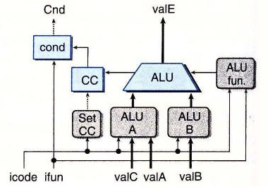

*图 4-29　SEQ 执行阶段。ALU 要么为整数运算指令执行操作，要么作为加法器。根据 ALU 的值，设置条件码寄存器。检测条件码的值，判断是否该选择分支*

在图 4-18～图 4-21 中，执行阶段的第一步就是每条指令的 ALU 计算。列出的操作数 `aluB` 在前面，后面是 `aluA`，这样是为了保证 `subq` 指令是 `valB` 减去 `valA`。可以看到，根据指令的类型，`aluA` 的值可以是 `valA`、`valC`，或者是 -8 或 +8。因此我们可以用下面的方式来表达产生 `aluA` 的控制块的行为：

```hcl
word aluA = [
    icode in { IRRMOVQ, IOPQ } : valA;
    icode in { IIRMOVQ, IRMMOVQ, IMRMOVQ } : valC;
    icode in { ICALL, IPUSHQ } : -8;
    icode in { IRET, IPOPQ } : 8;
    # Other instructions don't need ALU
];
```

**练习题 4.23** 根据图 4-18～图 4-21 中执行阶段第一步的第一个操作数，写出 SEQ 中信号 `aluB` 的 HCL 描述。

观察 ALU 在执行阶段执行的操作，可以看到它通常作为加法器来使用。不过，对于 `OPq` 指令，我们希望它使用指令 `ifun` 字段中编码的操作。因此，可以将 ALU 控制的 HCL 描述写成：

```hcl
word alufun = [
    icode == IOPQ : ifun;
    1 : ALUADD;
];
```

执行阶段还包括条件码寄存器。每次运行时，ALU 都会产生三个与条件码相关的信号——零、符号和溢出。不过，我们只希望在执行 `OPq` 指令时才设置条件码。因此产生了一个信号 `set_cc` 来控制是否该更新条件码寄存器：

```hcl
bool set_cc = icode in { IOPQ };
```

标号为“cond”的硬件单元会根据条件码和功能码来确定是否进行条件分支或者条件数据传送（图 4-3）。它产生信号 `Cnd`，用于设置条件传送的 `dstE`，也用在条件分支的下一个 PC 逻辑中。对于其他指令，取决于指令的功能码和条件码的设置，`Cnd` 信号可以被设置为 1 或者 0。但是控制逻辑会忽略它。我们省略这个单元的详细设计。

**练习题 4.24** 条件传送指令（简称 `cmovXX`）的指令代码为 `IRRMOVQ`。如图 4-28 所示，我们可以用执行阶段中产生的 `Cnd` 信号实现这些指令。修改 `dstE` 的 HCL 代码以实现这些指令。

##### 4. 访存阶段

访存阶段的任务就是读或者写程序数据。如图 4-30 所示，两个控制块产生内存地址和内存输入数据（为写操作）的值。另外两个块产生表明应该执行读操作还是写操作的控制信号。当执行读操作时，数据内存产生值 `valM`。

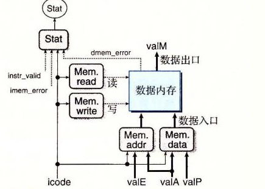

*图 4-30　SEQ 访存阶段。数据内存既可以写，也可以读内存的值。从内存中读出的值就形成了信号 `valM`*

图 4-18～图 4-21 的访存阶段给出了每个指令类型所需要的内存操作。可以看到内存读和写的地址总是 `valE` 或 `valA`。这个块用 HCL 描述就是：

```hcl
word mem_addr = [
    icode in { IRMMOVQ, IPUSHQ, ICALL, IMRMOVQ } : valE;
    icode in { IPOPQ, IRET } : valA;
    # Other instructions don't need address
];
```

**练习题 4.25** 观察图 4-18～图 4-21 所示的不同指令的访存操作，我们可以看到内存写的数据总是 `valA` 或 `valP`。写出 SEQ 中信号 `mem_data` 的 HCL 代码。

我们希望只为从内存读数据的指令设置控制信号 `mem_read`，用 HCL 代码表示就是：

```hcl
bool mem_read = icode in { IMRMOVQ, IPOPQ, IRET };
```

**练习题 4.26** 我们希望只为向内存写数据的指令设置控制信号 `mem_write`。写出 SEQ 中信号 `mem_write` 的 HCL 代码。

访存阶段最后的功能是根据取指阶段产生的 `icode`、`imem_error`、`instr_valid` 值以及数据内存产生的 `dmem_error` 信号，从指令执行的结果来计算状态码 `Stat`。

**练习题 4.27** 写出 `Stat` 的 HCL 代码，产生四个状态码 `SAOK`、`SADR`、`SINS` 和 `SHLT`（参见图 4-26）。

##### 5. 更新 PC 阶段

SEQ 中最后一个阶段会产生程序计数器的新值（见图 4-31）。如图 4-18～图 4-21 中最后步骤所示，依据指令的类型和是否要选择分支，新的 PC 可能是 `valC`、`valM` 或 `valP`。用 HCL 来描述这个选择就是：

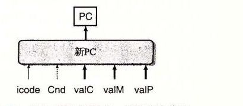

*图 4-31　SEQ 更新 PC 阶段。根据指令代码和分支标志，从信号 `valC`、`valM` 和 `valP` 中选出下一个 PC 的值*

```hcl
word new_pc = [
    # Call. Use instruction constant
    icode == ICALL : valC;
    # Taken branch. Use instruction constant
    icode == IJXX && Cnd : valC;
    # Completion of RET instruction. Use value from stack
    icode == IRET : valM;
    # Default: Use incremented PC
    1 : valP;
];
```

##### 6. SEQ 小结

现在我们已经浏览了 Y86-64 处理器的一个完整的设计。可以看到，通过将执行每条不同指令所需的步骤组织成一个统一的流程，就可以用很少量的各种硬件单元以及一个时钟来控制计算的顺序，从而实现整个处理器。不过这样一来，控制逻辑就必须要在这些单元之间路由信号，并根据指令类型和分支条件产生适当的控制信号。

SEQ 唯一的问题就是它太慢了。时钟必须非常慢，以使信号能在一个周期内传播所有的阶段。让我们来看看处理一条 `ret` 指令的例子。在时钟周期起始时，从更新过的 PC 开始，要从指令内存中读出指令，从寄存器文件中读出栈指针，ALU 将栈指针加 8，为了得到程序计数器的下一个值，还要从内存中读出返回地址。所有这一切都必须在这个周期结束之前完成。

这种实现方法不能充分利用硬件单元，因为每个单元只在整个时钟周期的一部分时间内才被使用。我们会看到引入流水线能获得更好的性能。

### 4.4 流水线的通用原理

在试图设计一个流水线化的 Y86-64 处理器之前，让我们先来看看流水线化的系统的一些通用属性和原理。对于曾经在自助餐厅的服务线上工作过或者开车通过自动汽车清洗线的人，都会非常熟悉这种系统。在流水线化的系统中，待执行的任务被划分成了若干个独立的阶段。在自助餐厅，这些阶段包括提供沙拉、主菜、甜点以及饮料。在汽车清洗中，这些阶段包括喷水和打肥皂、擦洗、上蜡和烘干。通常都会允许多个顾客同时经过系统，而不是要等到一个用户完成了所有从头至尾的过程才让下一个开始。在一个典型的自助餐厅流水线上，顾客按照相同的顺序经过各个阶段，即使他们并不需要某些菜。在汽车清洗的情况中，当前面一辆汽车从喷水阶段进入擦洗阶段时，下一辆就可以进入喷水阶段了。通常，汽车必须以相同的速度通过这个系统，避免撞车。

流水线化的一个重要特性就是提高了系统的吞吐量（throughput），也就是单位时间内服务的顾客总数，不过它也会轻微地增加延迟（latency），也就是服务一个用户所需要的时间。例如，自助餐厅里的一个只需要甜点的顾客，能很快通过一个非流水线化的系统，只在甜点阶段停留。但是在流水线化的系统中，这个顾客如果试图直接去甜点阶段就有可能招致其他顾客的愤怒了。

#### 4.4.1 计算流水线

让我们把注意力放到计算流水线上来，这里的“顾客”就是指令，每个阶段完成指令执行的一部分。图 4-32a 给出了一个很简单的非流水线化的硬件系统例子。它是由一些执行计算的逻辑以及一个保存计算结果的寄存器组成的。时钟信号控制在每个特定的时间间隔加载寄存器。CD 播放器中的译码器就是这样的一个系统。输入信号是从 CD 表面读出的位，逻辑电路对这些位进行译码，产生音频信号。图中的计算块是用组合逻辑来实现的，意味着信号会穿过一系列逻辑门，在一定时间的延迟之后，输出就成为了输入的某个函数。


*图 4-32　非流水线化的计算硬件。每个 320ps 的周期内，系统用 300ps 计算组合逻辑函数，20ps 将结果存到输出寄存器中*

在现代逻辑设计中，电路延迟以微微秒或皮秒（picosecond，简写成“ps”），也就是 10<sup>-12</sup> 秒为单位来计算。在这个例子中，我们假设组合逻辑需要 300ps，而加载寄存器需要 20ps。图 4-32 还给出了一种时序图，称为流水线图（pipeline diagram）。在图中，时间从左向右流动。从上到下写着一组操作（在此称为 I1、I2 和 I3）。实心的长方形表示这些指令执行的时间。这个实现中，在开始下一条指令之前必须完成前一个。因此，这些方框在垂直方向上并没有相互重叠。下面这个公式给出了运行这个系统的最大吞吐量：

> 吞吐量 = 1 条指令 / ((20 + 300) ps) · 1000 ps / 1 ns ≈ 3.12 GIPS

我们以每秒千兆条指令（GIPS），也就是每秒十亿条指令，为单位来描述吞吐量。从头到尾执行一条指令所需要的时间称为延迟（latency）。在此系统中，延迟为 320ps，也就是吞吐量的倒数。

> ① 1ns = 10<sup>-9</sup>s。

假设将系统执行的计算分成三个阶段（A、B 和 C），每个阶段需要 100ps，如图 4-33 所示。


*图 4-33　三阶段流水线的计算硬件。计算被划分为三个阶段 A、B 和 C。每经过一个 120ps 的周期，每条指令就行进通过一个阶段*

然后在各个阶段之间放上流水线寄存器（pipeline register），这样每条指令都会按照三步经过这个系统，从头到尾需要三个完整的时钟周期。如图 4-33 中的流水线图所示，只要 I1 从 A 进入 B，就可以让 I2 进入阶段 A 了，依此类推。在稳定状态下，三个阶段都应该是活动的，每个时钟周期，一条指令离开系统，一条新的进入。从流水线图中第三个时钟周期就能看出这一点，此时，I1 是在阶段 C，I2 在阶段 B，而 I3 是在阶段 A。在这个系统中，我们将时钟周期设为 100 + 20 = 120ps，得到的吞吐量大约为 8.33 GIPS。因为处理一条指令需要 3 个时钟周期，所以这条流水线的延迟就是 3 × 120 = 360ps。我们将系统吞吐量提高到原来的 8.33/3.12 = 2.67 倍，代价是增加了一些硬件，以及延迟的少量增加（360/320 = 1.12）。延迟变大是由于增加的流水线寄存器的时间开销。

#### 4.4.2 流水线操作的详细说明

为了更好地理解流水线是怎样工作的，让我们来详细看看流水线计算的时序和操作。图 4-34 给出了前面我们看到过的三阶段流水线（图 4-33）的流水线图。就像流水线图上方指明的那样，流水线阶段之间的指令转移是由时钟信号来控制的。每隔 120ps，信号从 0 上升至 1，开始下一组流水线阶段的计算。

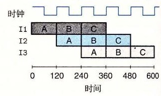

*图 4-34　三阶段流水线的时序。时钟信号的上升沿控制指令从一个流水线阶段移动到下一个阶段*

图 4-35 跟踪了时刻 240～360 之间的电路活动，指令 I1 经过阶段 C，I2 经过阶段 B，而 I3 经过阶段 A。就在时刻 240（点 1）时钟上升之前，阶段 A 中计算的指令 I2 的值已经到达第一个流水线寄存器的输入，但是该寄存器的状态和输出还保持为指令 I1 在阶段 A 中计算的值。指令 I1 在阶段 B 中计算的值已经到达第二个流水线寄存器的输入。当时钟上升时，这些输入被加载到流水线寄存器中，成为寄存器的输出（点 2）。另外，阶段 A 的输入被设置成发起指令 I3 的计算。然后信号传播通过各个阶段的组合逻辑（点 3）。就像图中点 3 处的曲线化的波阵面（curved wavefront）表明的那样，信号可能以不同的速率通过各个不同的部分。在时刻 360 之前，结果值到达流水线寄存器的输入（点 4）。当时刻 360 时钟上升时，各条指令会前进经过一个流水线阶段。

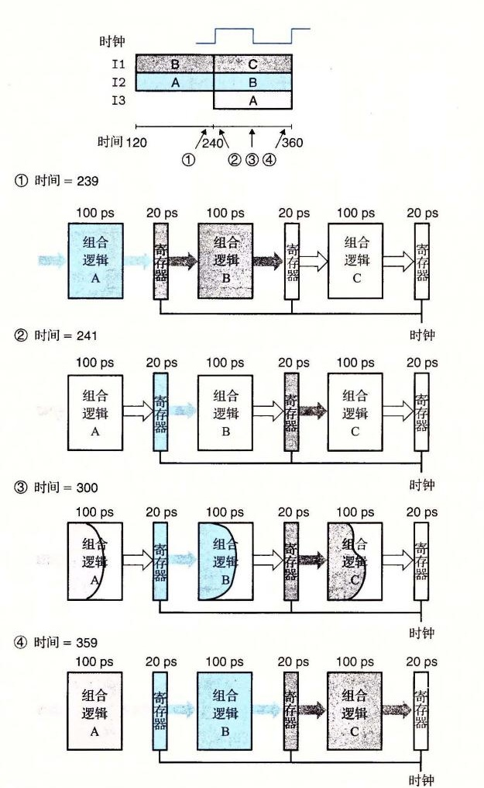

*图 4-35　流水线操作的一个时钟周期。在时刻 240（点 1）时钟上升之前，指令 I1 和 I2 已经完成了阶段 B 和 A。在时钟上升后，这些指令开始传送到阶段 C 和 B，而指令 I3 开始经过阶段 A（点 2 和 3）。就在时钟开始再次上升之前，这些指令的结果就会传到流水线寄存器的输入（点 4）*

从这个对流水线操作详细的描述中，我们可以看到减缓时钟不会影响流水线的行为。信号传播到流水线寄存器的输入，但是直到时钟上升时才会改变寄存器的状态。另一方面，如果时钟运行得太快，就会有灾难性的后果。值可能会来不及通过组合逻辑，因此当时钟上升时，寄存器的输入还不是合法的值。

根据对 SEQ 处理器时序的讨论（4.3.3 节），我们看到这种在组合逻辑块之间采用时钟寄存器的简单机制，足够控制流水线中的指令流。随着时钟周而复始地上升和下降，不同的指令就会通过流水线的各个阶段，不会相互干扰。

#### 4.4.3 流水线的局限性

图 4-33 的例子给出了一个理想的流水线化的系统，在这个系统中，我们可以将计算分成三个相互独立的阶段，每个阶段需要的时间是原来逻辑需要时间的三分之一。不幸的是，会出现其他一些因素，降低流水线的效率。

##### 1. 不一致的划分

图 4-36 展示的系统中和前面一样，我们将计算划分为了三个阶段，但是通过这些阶段的延迟从 50ps 到 150ps 不等。通过所有阶段的延迟和仍然为 300ps。不过，运行时钟的速率是由最慢的阶段的延迟限制的。流水线图表明，每个时钟周期，阶段 A 都会空闲（用白色方框表示）100ps，而阶段 C 会空闲 50ps。只有阶段 B 会一直处于活动状态。我们必须将时钟周期设为 150 + 20 = 170ps，得到吞吐量为 5.88 GIPS。另外，由于时钟周期减慢了，延迟也增加到了 510ps。

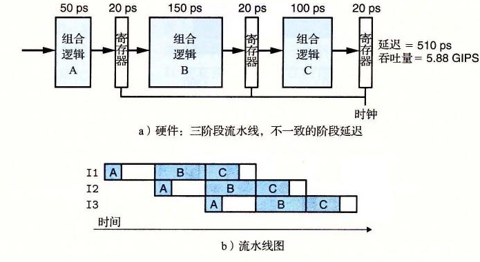

*图 4-36　由不一致的阶段延迟造成的流水线技术的局限性。系统的吞吐量受最慢阶段的速度所限制*

对硬件设计者来说，将系统计算设计划分成一组具有相同延迟的阶段是一个严峻的挑战。通常，处理器中的某些硬件单元，如 ALU 和内存，是不能被划分成多个延迟较小的单元的。这就使得创建一组平衡的阶段非常困难。在设计流水线化的 Y86-64 处理器中，我们不会过于关注这一层次的细节，但是理解时序优化在实际系统设计中的重要性还是非常重要的。

**练习题 4.28** 假设我们分析图 4-32 中的组合逻辑，认为它可以分成 6 个块，依次命名为 A～F，延迟分别为 80、30、60、50、70 和 10ps，如下图所示：

输入 → A → B → C → D → E → F → 寄存器

| 组件 | A | B | C | D | E | F | 寄存器 |
| --- | ---: | ---: | ---: | ---: | ---: | ---: | ---: |
| 延迟（ps） | 80 | 30 | 60 | 50 | 70 | 10 | 20 |

时钟 → 寄存器

在这些块之间插入流水线寄存器，就得到这一设计的流水线化的版本。根据在哪里插入流水线寄存器，会出现不同的流水线深度（有多少个阶段）和最大吞吐量的组合。假设每个流水线寄存器的延迟为 20ps。

A. 只插入一个寄存器，得到一个两阶段的流水线。要使吞吐量最大化，该在哪里插入寄存器呢？吞吐量和延迟是多少？

B. 要使一个三阶段的流水线的吞吐量最大化，该将两个寄存器插在哪里呢？吞吐量和延迟是多少？

C. 要使一个四阶段的流水线的吞吐量最大化，该将三个寄存器插在哪里呢？吞吐量和延迟是多少？

D. 要得到一个吞吐量最大的设计，至少要有几个阶段？描述这个设计及其吞吐量和延迟。

##### 2. 流水线过深，收益反而下降

图 4-37 说明了流水线技术的另一个局限性。在这个例子中，我们把计算分成了 6 个阶段，每个阶段需要 50ps。在每对阶段之间插入流水线寄存器就得到了一个六阶段流水线。这个系统的最小时钟周期为 50 + 20 = 70ps，吞吐量为 14.29 GIPS。因此，通过将流水线的阶段数加倍，我们将性能提高了 14.29/8.33 = 1.71。虽然我们将每个计算时钟的时间缩短了两倍，但是由于通过流水线寄存器的延迟，吞吐量并没有加倍。这个延迟成了流水线吞吐量的一个制约因素。在我们的新设计中，这个延迟占到了整个时钟周期的 28.6%。

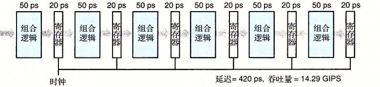

*图 4-37　由开销造成的流水线技术的局限性。在组合逻辑被分成较小的块时，由寄存器更新引起的延迟就成为了一个限制因素*

为了提高时钟频率，现代处理器采用了很深的（15 或更多的阶段）流水线。处理器架构师将指令的执行划分成很多非常简单的步骤，这样一来每个阶段的延迟就很小。电路设计者小心地设计流水线寄存器，使其延迟尽可能地小。芯片设计者也必须小心地设计时钟传播网络，以保证时钟在整个芯片上同时改变。所有这些都是设计高速微处理器面临的挑战。

**练习题 4.29** 让我们来看看图 4-32 中的系统，假设将它划分成任意数量的流水线阶段 k，每个阶段有相同的延迟 300/k，每个流水线寄存器的延迟为 20ps。

A. 系统的延迟和吞吐量写成 k 的函数是什么？

B. 吞吐量的上限等于多少？

#### 4.4.4 带反馈的流水线系统

到目前为止，我们只考虑一种系统，其中传过流水线的对象，无论是汽车、人或者指令，相互都是完全独立的。但是，对于像 x86-64 或 Y86-64 这样执行机器程序的系统来说，相邻指令之间很可能是相关的。例如，考虑下面这个 Y86-64 指令序列：

```asm
1   irmovq $50,%rax
2   addq %rax,%rbx
3   mrmovq 100(%rbx),%rdx
```

在这个包含三条指令的序列中，每对相邻的指令之间都有数据相关（data dependency），用带圈的寄存器名字和它们之间的箭头来表示。`irmovq` 指令（第 1 行）将它的结果存放在 `%rax` 中，然后 `addq` 指令（第 2 行）要读这个值；而 `addq` 指令将它的结果存放在 `%rbx` 中，`mrmovq` 指令（第 3 行）要读这个值。

另一种相关是由于指令控制流造成的顺序相关。来看看下面这个 Y86-64 指令序列：

```asm
1   loop:
2       subq %rdx,%rbx
3       jne targ
4       irmovq $10,%rdx
5       jmp loop
6   targ:
7       halt
```

`jne` 指令（第 3 行）产生了一个控制相关（control dependency），因为条件测试的结果会决定要执行的新指令是 `irmovq` 指令（第 4 行）还是 `halt` 指令（第 7 行）。在我们的 SEQ 设计中，这些相关都是由反馈路径来解决的，如图 4-22 的右边所示。这些反馈将更新了的寄存器值向下传送到寄存器文件，将新的 PC 值向下传送到 PC 寄存器。

图 4-38 举例说明了将流水线引入含有反馈路径的系统中的危险。在原来的系统（图 4-38a）中，每条指令的结果都反馈给下一条指令。流水线图（图 4-38b）就说明了这个情况，I1 的结果成为 I2 的输入，依此类推。如果试图以最直接的方式将它转换成一个三阶段流水线（图 4-38c），我们将改变系统的行为。如图 4-38c 所示，I1 的结果成为 I4 的输入。为了通过流水线技术加速系统，我们改变了系统的行为。

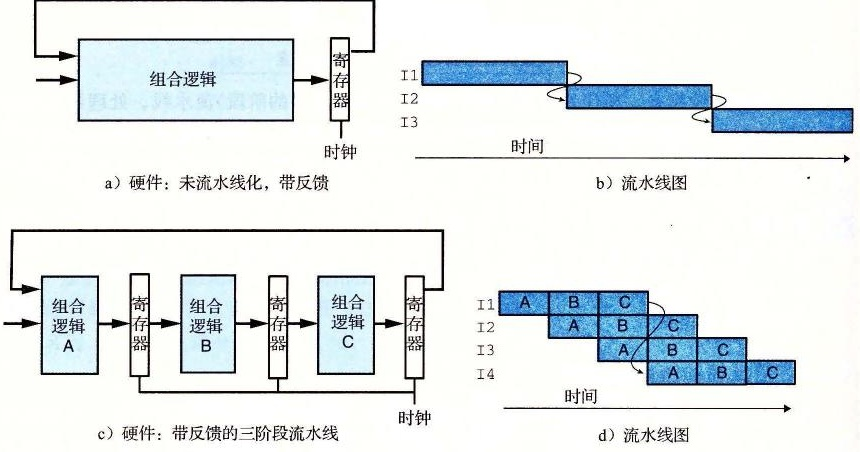

*图 4-38　由逻辑相关造成的流水线技术的局限性。在从未流水线化的带反馈的系统 a 转化到流水线化的系统 c 的过程中，我们改变了它的计算行为，可以从两个流水线图（b 和 d）中看出来*

当我们将流水线技术引入 Y86-64 处理器时，必须正确处理反馈的影响。很明显，像图 4-38 中的例子那样改变系统的行为是不可接受的。我们必须以某种方式来处理指令间的数据和控制相关，以使得到的行为与 ISA 定义的模型相符。

### 4.5 Y86-64 的流水线实现

我们终于准备好要开始本章的主要任务——设计一个流水线化的 Y86-64 处理器。首先，对顺序的 SEQ 处理器做一点小的改动，将 PC 的计算挪到取指阶段。然后，在各个阶段之间加上流水线寄存器。到这个时候，我们的尝试还不能正确处理各种数据和控制相关。不过，做一些修改，就能实现我们的目标——一个高效的、流水线化的实现 Y86-64 ISA 的处理器。

#### 4.5.1 SEQ+：重新安排计算阶段

作为实现流水线化设计的一个过渡步骤，我们必须稍微调整一下 SEQ 中五个阶段的顺序，使得更新 PC 阶段在一个时钟周期开始时执行，而不是结束时才执行。只需要对整体硬件结构做最小的改动，对于流水线阶段中的活动的时序，它能工作得更好。我们称这种修改过的设计为“SEQ+”。

我们移动 PC 阶段，使得它的逻辑在时钟周期开始时活动，使它计算当前指令的 PC 值。图 4-39 给出了 SEQ 和 SEQ+ 在 PC 计算上的不同之处。在 SEQ 中（图 4-39a），PC 计算发生在时钟周期结束的时候，根据当前时钟周期内计算出的信号值来计算 PC 寄存器的新值。在 SEQ+ 中（图 4-39b），我们创建状态寄存器来保存在一条指令执行过程中计算出来的信号。然后，当一个新的时钟周期开始时，这些信号值通过同样的逻辑来计算当前指令的 PC。我们将这些寄存器标号为“pIcode”、“pCnd”等等，来指明在任一给定的周期，它们保存的是前一个周期中产生的控制信号。

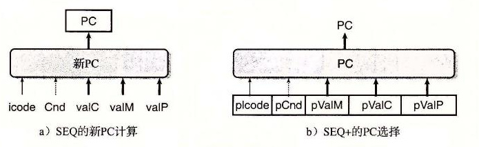

**图 4-39　移动计算 PC 的时间。** 在 SEQ+ 中，我们将计算当前状态的程序计数器的值作为指令执行的第一步。

图 4-40 给出了 SEQ+ 硬件的一个更为详细的说明。可以看到，其中的硬件单元和控制块与我们在 SEQ 中用到的（图 4-23）一样，只不过 PC 逻辑从上面（在时钟周期结束时活动）移到了下面（在时钟周期开始时活动）。

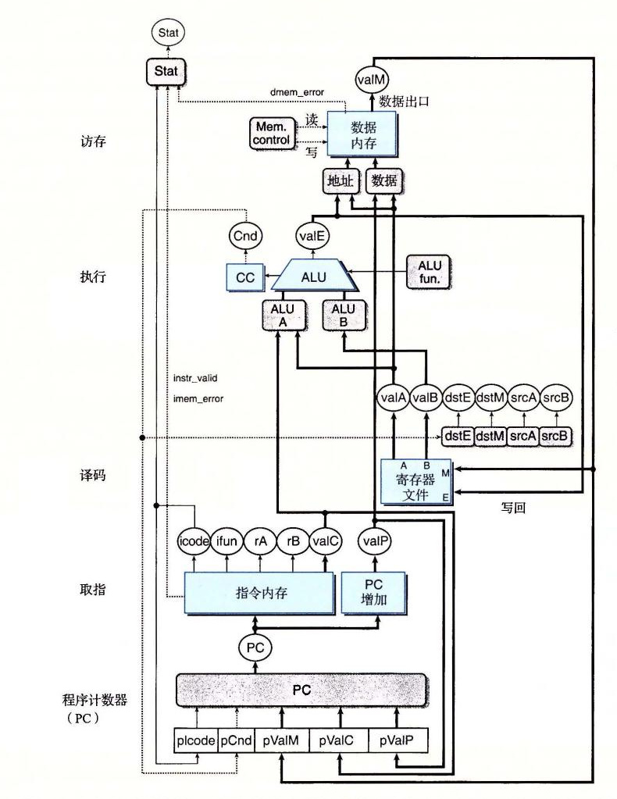

**图 4-40　SEQ+ 的硬件结构。** 将 PC 计算从时钟周期结束时移到了开始时，使之更适合于流水线。

> **旁注：SEQ+ 中的 PC 在哪里**
>
> SEQ+ 有一个很奇怪的特色，那就是没有硬件寄存器来存放程序计数器。而是根据从前一条指令保存下来的一些状态信息动态地计算 PC。这就是一个小小的证明——我们可以以一种与 ISA 隐含着的概念模型不同的方式来实现处理器，只要处理器能正确执行任意的机器语言程序。我们不需要将状态编码成程序员可见的状态指定的形式，只要处理器能够为任意的程序员可见状态（例如程序计数器）产生正确的值。在创建流水线化的设计中，我们会更多地使用到这条原则。5.7 节中描述的乱序（out-of-order）处理技术，以一种完全不同于机器级程序中出现的顺序的次序来执行指令，将这一思想发挥到了极致。

SEQ 到 SEQ+ 中对状态单元的改变是一种很通用的改进的例子，这种改进称为电路重定时（circuit retiming）[68]。重定时改变了一个系统的状态表示，但是并不改变它的逻辑行为。通常用它来平衡一个流水线系统中各个阶段之间的延迟。

#### 4.5.2 插入流水线寄存器

在创建一个流水线化的 Y86-64 处理器的最初尝试中，我们要在 SEQ+ 的各个阶段之间插入流水线寄存器，并对信号重新排列，得到 PIPE− 处理器，这里的“−”代表这个处理器和最终的处理器设计相比，性能要差一点。PIPE− 的抽象结构如图 4-41 所示。流水线寄存器在该图中用黑色方框表示，每个寄存器包括不同的字段，用白色方框表示。正如多个字段表明的那样，每个流水线寄存器可以存放多个字节和字。同两个顺序处理器的硬件结构（图 4-23 和图 4-40）中的圆角方框不同，这些白色的方框表示实际的硬件组成。

可以看到，PIPE− 使用了与顺序设计 SEQ+（图 4-40）几乎一样的硬件单元，但是有流水线寄存器分隔开这些阶段。两个系统中信号的不同之处在 4.5.3 节中讨论。

流水线寄存器按如下方式标号：

- **F**　保存程序计数器的预测值，稍后讨论。
- **D**　位于取指和译码阶段之间。它保存关于最新取出的指令的信息，即将由译码阶段进行处理。
- **E**　位于译码和执行阶段之间。它保存关于最新译码的指令和从寄存器文件读出的值的信息，即将由执行阶段进行处理。
- **M**　位于执行和访存阶段之间。它保存最新执行的指令的结果，即将由访存阶段进行处理。它还保存关于用于处理条件转移的分支条件和分支目标的信息。
- **W**　位于访存阶段和反馈路径之间，反馈路径将计算出来的值提供给寄存器文件写，而当完成 `ret` 指令时，它还要向 PC 选择逻辑提供返回地址。


**图 4-41　PIPE− 的硬件结构，一个初始的流水线化实现。** 通过往 SEQ+（图 4-40）中插入流水线寄存器，我们创建了一个五阶段的流水线。这个版本有几个缺陷，稍后就会解决这些问题。

图 4-42 表明以下代码序列如何通过我们的五阶段流水线，其中注释将各条指令标识为 I1～I5 以便引用：

```asm
irmovq $1,%rax    # I1
irmovq $2,%rbx    # I2
irmovq $3,%rcx    # I3
irmovq $4,%rdx    # I4
halt              # I5
```


**图 4-42　指令流通过流水线的示例。**

图中右边给出了这个指令序列的流水线图。同 4.4 节中简单流水线化的计算单元的流水线图一样，这个图描述了每条指令通过流水线各个阶段的行进过程，时间从左往右增大。上面一排数字表明各个阶段发生的时钟周期。例如，在周期 1 取出指令 I1，然后它开始通过流水线各个阶段，到周期 5 结束后，其结果写入寄存器文件。在周期 2 取出指令 I2，到周期 6 结束后，其结果写回，以此类推。在最下面，我们给出了当周期为 5 时的流水线的扩展图。此时，每个流水线阶段中各有一条指令。

从图 4-42 中还可以判断我们画处理器的习惯是合理的，这样，指令是自底向上的流动的。周期 5 时的扩展图表明的流水线阶段，取指阶段在底部，写回阶段在最上面，同流水线硬件图（图 4-41）表明的一样。如果看看流水线各个阶段中指令的顺序，就会发现它们出现的顺序与在程序中列出的顺序一样。因为正常的程序是从上到下列出的，我们保留这种顺序，让流水线从下到上进行。在使用本书附带的模拟器时，这个习惯会特别有用。

#### 4.5.3 对信号进行重新排列和标号

顺序实现 SEQ 和 SEQ+ 在一个时刻只处理一条指令，因此诸如 `valC`、`srcA` 和 `valE` 这样的信号值有唯一的值。在流水线化的设计中，与各个指令相关联的这些值有多个版本，会随着指令一起流过系统。例如，在 PIPE− 的详细结构中，有 4 个标号为“Stat”的白色方框，保存着 4 条不同指令的状态码（参见图 4-41）。我们需要很小心以确保使用的是正确版本的信号，否则会有很严重的错误，例如将一条指令计算出的结果存放到了另一条指令指定的目的寄存器。我们采用的命名机制，通过在信号名前面加上大写的流水线寄存器名字作为前缀，存储在流水线寄存器中的信号可以唯一地被标识。例如，4 个状态码可以被命名为 `D_stat`、`E_stat`、`M_stat` 和 `W_stat`。我们还需要引用某些在一个阶段内刚刚计算出来的信号。它们的命名是在信号名前面加上小写的阶段名的第一个字母作为前缀。以状态码为例，可以看到在取指和访存阶段中标号为“Stat”的控制逻辑块。因而，这些块的输出被命名为 `f_stat` 和 `m_stat`。我们还可以看到整个处理器的实际状态 `Stat` 是根据流水线寄存器 W 中的状态值，由写回阶段中的块计算出来的。

> **旁注：信号 `M_stat` 和 `m_stat` 的差别**
>
> 在命名系统中，大写的前缀“D”、“E”、“M”和“W”指的是流水线寄存器，所以 `M_stat` 指的是流水线寄存器 M 的状态码字段。小写的前缀“f”、“d”、“e”、“m”和“w”指的是流水线阶段，所以 `m_stat` 指的是在访存阶段中由控制逻辑块产生出的状态信号。
>
> 理解这个命名规则对理解我们的流水线化处理器的操作是至关重要的。

SEQ+ 和 PIPE− 的译码阶段都产生信号 `dstE` 和 `dstM`，它们指明值 `valE` 和 `valM` 的目的寄存器。在 SEQ+ 中，我们可以将这些信号直接连到寄存器文件写端口的地址输入。在 PIPE− 中，会在流水线中一直携带这些信号穿过执行和访存阶段，直到写回阶段才送到寄存器文件（如各个阶段的详细描述所示）。我们这样做是为了确保写端口的地址和数据输入是来自同一条指令。否则，会将处于写回阶段的指令的值写入，而寄存器 ID 却来自于处于译码阶段的指令。作为一条通用原则，我们要保存处于一个流水线阶段中的指令的所有信息。

PIPE− 中有一个块在相同表示形式的 SEQ+ 中是没有的，那就是译码阶段中标号为“Select A”的块。我们可以看出，这个块会从来自流水线寄存器 D 的 `valP` 或从寄存器文件 A 端口中读出的值中选择一个，作为流水线寄存器 E 的值 `valA`。包括这个块是为了减少要携带给流水线寄存器 E 和 M 的状态数量。在所有的指令中，只有 `call` 在访存阶段需要 `valP` 的值。只有跳转指令在执行阶段（当不需要进行跳转时）需要 `valP` 的值。而这些指令又都不需要从寄存器文件中读出的值。因此我们合并这两个信号，将它们作为信号 `valA` 携带穿过流水线，从而可以减少流水线寄存器的状态数量。这样做就消除了 SEQ（图 4-23）和 SEQ+（图 4-40）中标号为“Data”的块，这个块完成的是类似的功能。在硬件设计中，像这样仔细确认信号是如何使用的，然后通过合并信号来减少寄存器状态和线路的数量，是很常见的。

如图 4-41 所示，我们的流水线寄存器包括一个状态码 `stat` 字段，开始时是在取指阶段计算出来的，在访存阶段有可能会被修改。在讲完正常指令执行的实现之后，我们会在 4.5.6 节中讨论如何实现异常事件的处理。到目前为止我们可以说，最系统的方法就是让与每条指令关联的状态码与指令一起通过流水线，就像图中表明的那样。

#### 4.5.4 预测下一个 PC

在 PIPE− 设计中，我们采取了一些措施来正确处理控制相关。流水线化设计的目的就是每个时钟周期都发射一条新指令，也就是说每个时钟周期都有一条新指令进入执行阶段并最终完成。要是达到这个目的也就意味着吞吐量是每个时钟周期一条指令。要做到这一点，我们必须在取出当前指令之后，马上确定下一条指令的位置。不幸的是，如果取出的指令是条件分支指令，要到几个周期后，也就是指令通过执行阶段之后，我们才能知道是否要选择分支。类似地，如果取出的指令是 `ret`，要到指令通过访存阶段，才能确定返回地址。

除了条件转移指令和 `ret` 以外，根据取指阶段中计算出的信息，我们能够确定下一条指令的地址。对于 `call` 和 `jmp`（无条件转移）来说，下一条指令的地址是指令中的常数字 `valC`，而对于其他指令来说就是 `valP`。因此，通过预测 PC 的下一个值，在大多数情况下，我们能达到每个时钟周期发射一条新指令的目的。对大多数指令类型来说，我们的预测是完全可靠的。对条件转移来说，我们既可以预测选择了分支，那么新 PC 值应为 `valC`，也可以预测没有选择分支，那么新 PC 值应为 `valP`。无论哪种情况，我们都必须以某种方式来处理预测错误的情况，因为此时已经取出并部分执行了错误的指令。我们会在 4.5.8 节中再讨论这个问题。

猜测分支方向并根据猜测开始取指的技术称为分支预测。实际上所有的处理器都采用了某种形式的此类技术。对于预测是否选择分支的有效策略已经进行了广泛的研究 [46, 2.3 节]。有的系统花费了大量硬件来解决这个任务。我们的设计只使用了简单的策略，即总是预测选择了条件分支，因而预测 PC 的新值为 `valC`。

> **旁注：其他的分支预测策略**
>
> 我们的设计使用总是选择（always taken）分支的预测策略。研究表明这个策略的成功率大约为 60%[44, 122]。相反，从不选择（never taken，NT）策略的成功率大约为 40%。稍微复杂一点的是反向选择、正向不选择（backward taken, forward not-taken，BTFNT）的策略，当分支地址比下一条地址低时就预测选择分支，而分支地址比较高时，就预测不选择分支。这种策略的成功率大约为 65%。这种改进源自一个事实，即循环是由后向分支结束的，而循环通常会执行多次。前向分支用于条件操作，而这种选择的可能性较小。在家庭作业 4.55 和 4.56 中，你可以修改 Y86-64 流水线处理器来实现 NT 和 BTFNT 分支预测策略。
>
> 正如我们在 3.6.6 节中看到的，分支预测错误会极大地降低程序的性能，因此这就促使我们在可能的时候，要使用条件数据传送而不是条件控制转移。

我们还没有讨论预测 `ret` 指令的新 PC 值。同条件转移不同，此时可能的返回值几乎是无限的，因为返回地址是位于栈顶的字，其内容可以是任意的。在设计中，我们不会试图对返回地址做任何预测。只是简单地暂停处理新指令，直到 `ret` 指令通过写回阶段。在 4.5.8 节中，我们将回过来讨论这部分的实现。

> **旁注：使用栈的返回地址预测**
>
> 对大多数程序来说，预测返回值很容易，因为过程调用和返回是成对出现的。大多数函数调用，会返回到调用后的那条指令。高性能处理器中运用了这个属性，在取指单元中放入一个硬件栈，保存过程调用指令产生的返回地址。每次执行过程调用指令时，都将其返回地址压入栈中。当取出一个返回指令时，就从这个栈中弹出顶部的值，作为预测的返回值。同分支预测一样，在预测错误时必须提供一个恢复机制，因为还是有调用和返回不匹配的时候。通常，这种预测很可靠。这个硬件栈对程序员来说是不可见的。

PIPE− 的取指阶段，如图 4-41 底部所示，负责预测 PC 的下一个值，以及为取指选择实际的 PC。我们可以看到，标号为“Predict PC”的块会从 PC 增加器计算出的 `valP` 和取出的指令中得到的 `valC` 中进行选择。这个值存放在流水线寄存器 F 中，作为程序计数器的预测值。标号为“Select PC”的块类似于 SEQ+ 的 PC 选择阶段中标号为“PC”的块（图 4-40）。它从三个值中选择一个作为指令内存的地址：预测的 PC；对于到达流水线寄存器 M 的不选择分支的指令来说，是 `valP` 的值（存储在寄存器 `M_valA` 中）；或是当 `ret` 指令到达流水线寄存器 W 时的返回地址的值（存储在 `W_valM` 中）。

#### 4.5.5 流水线冒险

PIPE− 结构是创建一个流水线化的 Y86-64 处理器的好开端。不过，回忆 4.4.4 节中的讨论，将流水线技术引入一个带反馈的系统，当相邻指令间存在相关时会导致出现问题。在完成我们的设计之前，必须解决这个问题。这些相关有两种形式：1）数据相关，下一条指令会用到这一条指令计算出的结果；2）控制相关，一条指令要确定下一条指令的位置，例如在执行跳转、调用或返回指令时。这些相关可能会导致流水线产生计算错误，称为冒险（hazard）。同相关一样，冒险也可以分为两类：数据冒险（data hazard）和控制冒险（control hazard）。我们首先关心的是数据冒险，然后再考虑控制冒险。

图 4-43 描述的是 PIPE− 处理器处理 `prog1` 指令序列的情况。假设在这个例子以及后面的例子中，程序寄存器初始时值都为 0。这段代码将值 10 和 3 放入程序寄存器 `%rdx` 和 `%rax`，执行三条 `nop` 指令，然后将寄存器 `%rdx` 加到 `%rax`。我们重点关注两条 `irmovq` 指令和 `addq` 指令之间的数据相关造成的可能数据冒险。图的右边是这个指令序列的流水线图。图中突出显示了周期 6 和 7 的流水线阶段。流水线图的下面是周期 6 中写回活动和周期 7 中译码活动的扩展说明。在周期 7 开始以后，两条 `irmovq` 都已经通过了写回阶段，所以寄存器文件保存着更新过的 `%rdx` 和 `%rax` 的值。因此，`addq` 指令在周期 7 经过译码阶段时，它可以读到源操作数的正确值。在此例中，两条 `irmovq` 指令和 `addq` 指令之间的数据相关没有造成数据冒险。

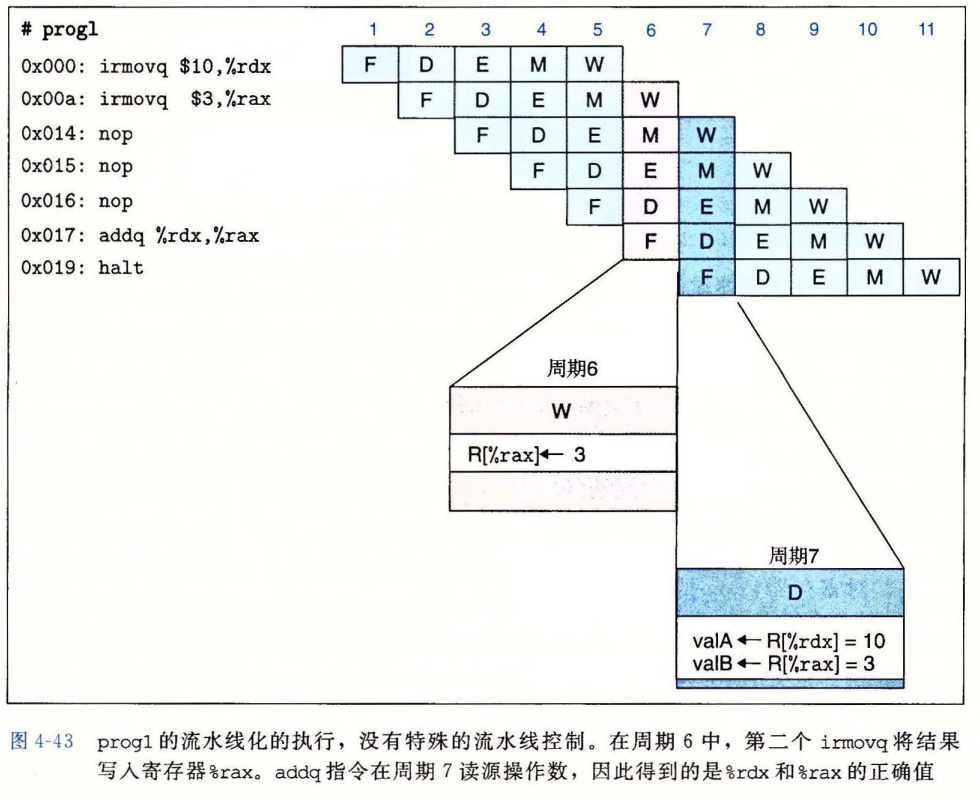

**图 4-43　`prog1` 的流水线化的执行，没有特殊的流水线控制。** 在周期 6 中，第二个 `irmovq` 将结果写入寄存器 `%rax`。`addq` 指令在周期 7 读源操作数，因此得到的是 `%rdx` 和 `%rax` 的正确值。

我们看到 `prog1` 通过流水线并得到正确的结果，因为 3 条 `nop` 指令在有数据相关的指令之间创造了一些延迟。让我们来看看如果去掉这些 `nop` 指令会发生些什么。图 4-44 描述的是 `prog2` 程序的流水线流程，在两条产生寄存器 `%rdx` 和 `%rax` 值的 `irmovq` 指令和以这两个寄存器作为操作数的 `addq` 指令之间有两条 `nop` 指令。在这种情况下，关键步骤发生在周期 6，此时 `addq` 指令从寄存器文件中读取它的操作数。该图底部是这个周期内流水线活动的扩展描述。第一条 `irmovq` 指令已经通过了写回阶段，因此程序寄存器 `%rdx` 已经在寄存器文件中更新过了。在该周期内，第二条 `irmovq` 指令处于写回阶段，因此对程序寄存器 `%rax` 的写要到周期 7 开始、时钟上升时，才会发生。结果，会读出 `%rax` 的错误值（回想一下，我们假设所有的寄存器的初始值为 0），因为对该寄存器的写还未发生。很明显，我们必须改进流水线让它能够正确处理这样的冒险。

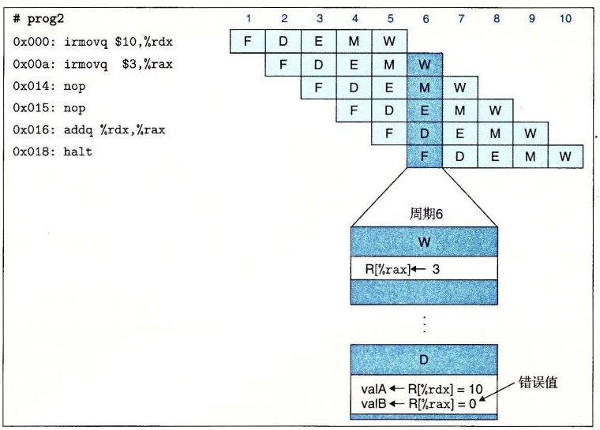

**图 4-44　`prog2` 的流水线化的执行，没有特殊的流水线控制。** 直到周期 7 结束时，对寄存器 `%rax` 的写才发生，所以 `addq` 指令在译码阶段读出的是该寄存器的错误值。

图 4-45 是当 `irmovq` 指令和 `addq` 指令之间只有一条 `nop` 指令，即为程序 `prog3` 时，发生的情况。现在我们必须检查周期 5 内流水线的行为，此时 `addq` 指令通过译码阶段。不幸的是，对寄存器 `%rdx` 的写仍处在写回阶段，而对寄存器 `%rax` 的写还处在访存阶段。因此，`addq` 指令会得到两个错误的操作数。

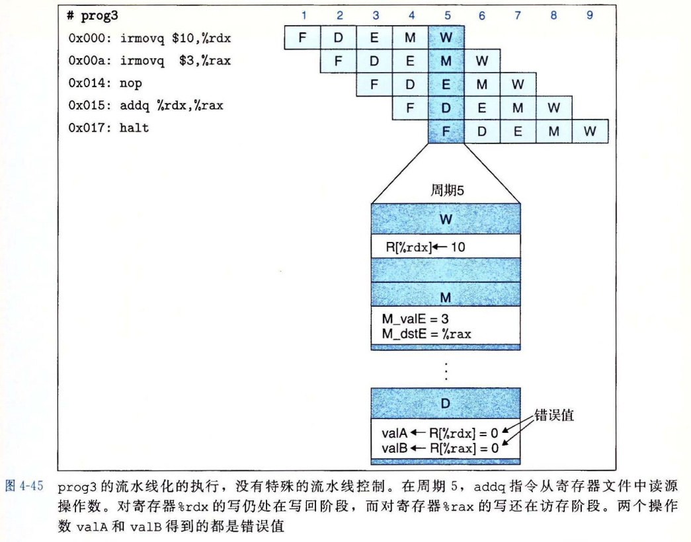

**图 4-45　`prog3` 的流水线化的执行，没有特殊的流水线控制。** 在周期 5，`addq` 指令从寄存器文件中读源操作数。对寄存器 `%rdx` 的写仍处在写回阶段，而对寄存器 `%rax` 的写还在访存阶段。两个操作数 `valA` 和 `valB` 得到的都是错误值。

图 4-46 是当去掉 `irmovq` 指令和 `addq` 指令间的所有 `nop` 指令，即为程序 `prog4` 时，发生的情况。现在我们必须检查周期 4 内流水线的行为，此时 `addq` 指令通过译码阶段。不幸的是，对寄存器 `%rdx` 的写仍处在访存阶段，而执行阶段正在计算寄存器 `%rax` 的新值。因此，`addq` 指令的两个操作数都是不正确的。

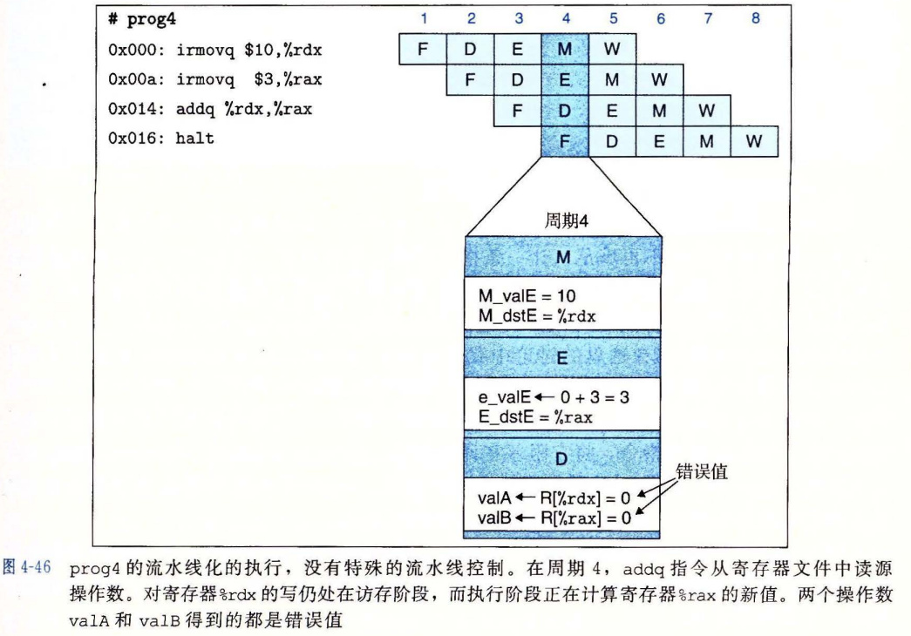

**图 4-46　`prog4` 的流水线化的执行，没有特殊的流水线控制。** 在周期 4，`addq` 指令从寄存器文件中读源操作数。对寄存器 `%rdx` 的写仍处在访存阶段，而执行阶段正在计算寄存器 `%rax` 的新值。两个操作数 `valA` 和 `valB` 得到的都是错误值。

这些例子说明，如果一条指令的操作数被它前面三条指令中的任意一条改变的话，都会出现数据冒险。之所以会出现这些冒险，是因为我们的流水线化的处理器是在译码阶段从寄存器文件中读取指令的操作数，而要到三个周期以后，指令经过写回阶段时，才会将指令的结果写到寄存器文件。

> **旁注：列举数据冒险的类型**
>
> 当一条指令更新后面指令会读到的那些程序状态时，就有可能出现冒险。对于 Y86-64 来说，程序状态包括程序寄存器、程序计数器、内存、条件码寄存器和状态寄存器。让我们来看看在提出的设计中每类状态出现冒险的可能性。
>
> **程序寄存器：** 我们已经认识这种冒险了。出现这种冒险是因为寄存器文件的读写是在不同的阶段进行的，导致不同指令之间可能出现不希望的相互作用。
>
> **程序计数器：** 更新和读取程序计数器之间的冲突导致了控制冒险。当我们的取指阶段逻辑在取下一条指令之前，正确预测了程序计数器的新值时，就不会产生冒险。预测错误的分支和 `ret` 指令需要特殊的处理，会在 4.5.5 节中讨论。
>
> **内存：** 对数据内存的读和写都发生在访存阶段。在一条读内存的指令到达这个阶段之前，前面所有要写内存的指令都已经完成这个阶段了。另外，在访存阶段中写数据的指令和在取指阶段中读指令之间也有冲突，因为指令和数据内存访问的是同一个地址空间。只有包含自我修改代码的程序才会发生这种情况，在这样的程序中，指令写内存的一部分，过后会从中取出指令。有些系统有复杂的机制来检测和避免这种冒险，而有些系统只是简单地强制要求程序不应该使用自我修改代码。为了简便，假设程序不能修改自身，因此我们不需要采取特殊的措施，根据在程序执行过程中对数据内存的修改来修改指令内存。
>
> **条件码寄存器：** 在执行阶段中，整数操作会写这些寄存器。条件传送指令会在执行阶段以及条件转移会在访存阶段读这些寄存器。在条件传送或转移到执行阶段之前，前面所有的整数操作都已经完成这个阶段了。所以不会发生冒险。
>
> **状态寄存器：** 指令流经流水线的时候，会影响程序状态。我们采用流水线中的每条指令都与一个状态码相关联的机制，使得当异常发生时，处理器能够有条理地停止，就像在 4.5.6 节中会讲到的那样。
>
> 这些分析表明我们只需要处理寄存器数据冒险、控制冒险，以及确保能够正确处理异常。当设计一个复杂系统时，这样的分类分析是很重要的。这样做可以确认出系统实现中可能的困难，还可以指导生成用于检查系统正确性的测试程序。

##### 1. 用暂停来避免数据冒险

暂停（stalling）是避免冒险的一种常用技术，暂停时，处理器会停止流水线中一条或多条指令，直到冒险条件不再满足。让一条指令停顿在译码阶段，直到产生它的源操作数的指令通过了写回阶段，这样我们的处理器就能避免数据冒险。这种机制的细节会在 4.5.8 节中讨论。它对流水线控制逻辑做了一些简单的加强。图 4-47（`prog2`）和图 4-48（`prog4`）中画出了暂停的效果。（在这里的讨论中我们省略了 `prog3`，因为它的运行类似于其他两个例子。）当指令 `addq` 处于译码阶段时，流水线控制逻辑发现执行、访存或写回阶段中至少有一条指令会更新寄存器 `%rdx` 或 `%rax`。处理器不会让 `addq` 指令带着不正确的结果通过这个阶段，而是会暂停指令，将它阻塞在译码阶段，时间为一个周期（对 `prog2` 来说）或者三个周期（对 `prog4` 来说）。对所有这三个程序来说，`addq` 指令最终都会在周期 7 中得到两个源操作数的正确值，然后继续沿着流水线进行下去。

将 `addq` 指令阻塞在译码阶段时，我们还必须将紧跟其后的 `halt` 指令阻塞在取指阶段。通过将程序计数器保持不变就能做到这一点，这样一来，会不断地对 `halt` 指令进行取指，直到暂停结束。

暂停技术就是让一组指令阻塞在它们所处的阶段，而允许其他指令继续通过流水线。那么在本该正常处理 `addq` 指令的阶段中，我们该做些什么呢？我们使用的处理方法是：每次要把一条指令阻塞在译码阶段，就在执行阶段插入一个气泡。气泡就像一个自动产生的 `nop` 指令——它不会改变寄存器、内存、条件码或程序状态。在图 4-47 和图 4-48 的流水线图中，白色方框表示的就是气泡。在这些图中，我们用一个 `addq` 指令的标号为“D”的方框到标号为“E”的方框之间的箭头来表示一个流水线气泡，这些箭头表明，在执行阶段中插入气泡是为了替代 `addq` 指令，它本来应该经过译码阶段进入执行阶段。在 4.5.8 节中，我们将看到使流水线暂停以及插入气泡的详细机制。

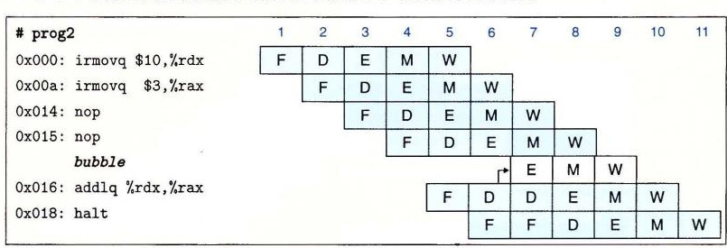

**图 4-47　`prog2` 使用暂停的流水线化的执行。** 在周期 6 中对 `addq` 指令译码之后，暂停控制逻辑发现一个数据冒险，它是由写回阶段中对寄存器 `%rax` 未进行的写造成的。它在执行阶段中插入一个气泡，并在周期 7 中重复对指令 `addq` 的译码。实际上，机器是动态地插入一条 `nop` 指令，得到的执行流类似于 `prog1` 的执行流（图 4-43）。

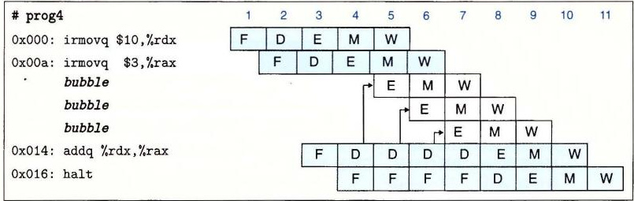

**图 4-48　`prog4` 使用暂停的流水线化的执行。** 在周期 4 中对 `addq` 指令译码之后，暂停控制逻辑发现了对两个源寄存器的数据冒险。它在执行阶段中插入一个气泡，并在周期 5 中重复对指令 `addq` 的译码。它再次发现对两个源寄存器的冒险，就在执行阶段中插入一个气泡，并在周期 6 中重复对指令 `addq` 的译码。它再次发现对寄存器 `%rax` 的冒险，就在执行阶段中插入一个气泡，并在周期 7 中重复对指令 `addq` 的译码。实际上，机器是动态地插入三条 `nop` 指令，得到的执行流类似于 `prog1` 的执行流（图 4-43）。

在使用暂停技术来解决数据冒险的过程中，我们通过动态地产生和 `prog1` 流（图 4-43）一样的流水线流，有效地执行了程序 `prog2` 和 `prog4`。为 `prog2` 插入 1 个气泡，为 `prog4` 插入 3 个气泡，与在第 2 条 `irmovq` 指令和 `addq` 指令之间有 3 条 `nop` 指令，有相同的效果。虽然实现这一机制相当容易（参考家庭作业 4.53），但是得到的性能并不很好。一条指令更新一个寄存器，紧跟其后的指令就使用被更新的寄存器，像这样的情况不胜枚举。这会导致流水线暂停长达三个周期，严重降低了整体的吞吐量。

##### 2. 用转发来避免数据冒险

PIPE− 的设计是在译码阶段从寄存器文件中读入源操作数，但是对这些源寄存器的写有可能要在写回阶段才能进行。与其暂停直到写完成，不如简单地将要写的值传到流水线寄存器 E 作为源操作数。图 4-49 用 `prog2` 周期 6 的流水线图的扩展描述来说明了这一策略。译码阶段逻辑发现，寄存器 `%rax` 是操作数 `valB` 的源寄存器，而在写端口 E 上还有一个对 `%rax` 的未进行的写。它只要简单地将提供到端口 E 的数据字（信号 `W_valE`）作为操作数 `valB` 的值，就能避免暂停。这种将结果值直接从一个流水线阶段传到较早阶段的技术称为数据转发（data forwarding，或简称转发，有时称为旁路（bypassing））。它使得 `prog2` 的指令能通过流水线而不需要任何暂停。数据转发需要在基本的硬件结构中增加一些额外的数据连接和控制逻辑。

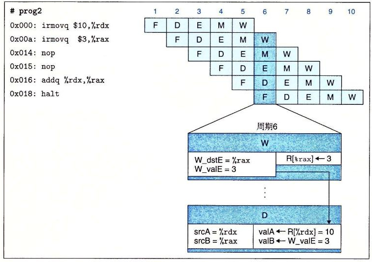

**图 4-49　`prog2` 使用转发的流水线化的执行。** 在周期 6 中，译码阶段逻辑发现在写回阶段中对寄存器 `%rax` 有未进行的写。它用这个值，而不是从寄存器文件中读出的值，作为源操作数 `valB`。

如图 4-50 所示，当访存阶段中有对寄存器未进行的写时，也可以使用数据转发，以避免程序 `prog3` 中的暂停。在周期 5 中，译码阶段逻辑发现，在写回阶段中端口 E 上有对寄存器 `%rdx` 未进行的写，以及在访存阶段中有会在端口 E 上对寄存器 `%rax` 未进行的写。它不会暂停直到这些写真正发生，而是用写回阶段中的值（信号 `W_valE`）作为操作数 `valA`，用访存阶段中的值（信号 `M_valE`）作为操作数 `valB`。

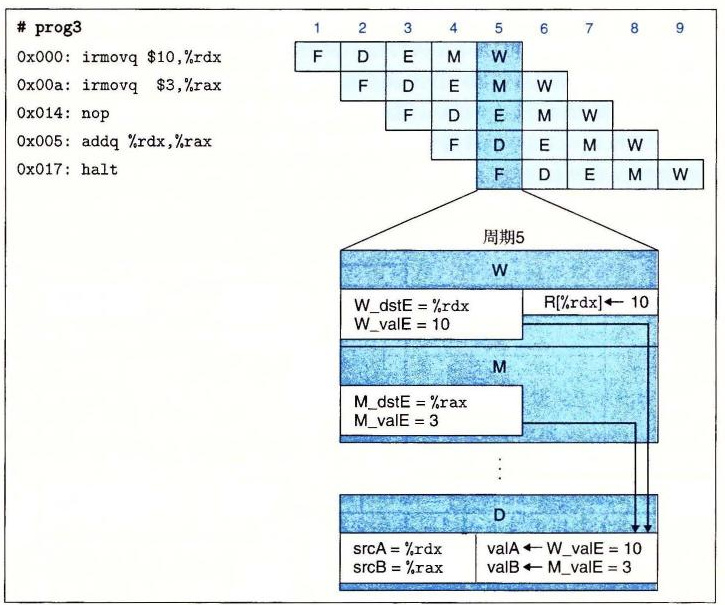

**图 4-50　`prog3` 使用转发的流水线化的执行。** 在周期 5 中，译码阶段逻辑发现在写回阶段中对寄存器 `%rdx` 有未进行的写，以及在访存阶段中对寄存器 `%rax` 有未进行的写。它用这些值，而不是从寄存器文件中读出的值，作为 `valA` 和 `valB` 的值。

为了充分利用数据转发技术，我们还可以将新计算出来的值从执行阶段传到译码阶段，以避免程序 `prog4` 所需要的暂停，如图 4-51 所示。在周期 4 中，译码阶段逻辑发现在访存阶段中有对寄存器 `%rdx` 未进行的写，而且执行阶段中 ALU 正在计算的值稍后也会写入寄存器 `%rax`。它可以将访存阶段中的值（信号 `M_valE`）作为操作数 `valA`，也可以将 ALU 的输出（信号 `e_valE`）作为操作数 `valB`。注意，使用 ALU 的输出不会造成任何时序问题。译码阶段只要在时钟周期结束之前产生信号 `valA` 和 `valB`，这样在时钟上升开始下一个周期时，流水线寄存器 E 就能装载来自译码阶段的值了。而在此之前 ALU 的输出已经是合法的了。


**图 4-51　`prog4` 使用转发的流水线化的执行。** 在周期 4 中，译码阶段逻辑发现在访存阶段中对寄存器 `%rdx` 有未进行的写，还发现在执行阶段中正在计算寄存器 `%rax` 的新值。它用这些值，而不是从寄存器文件中读出的值，作为 `valA` 和 `valB` 的值。

程序 `prog2`～`prog4` 中描述的转发技术的使用都是将 ALU 产生的以及其目标为写端口 E 的值进行转发，其实也可以转发从内存中读出的以及其目标为写端口 M 的值。从访存阶段，我们可以转发刚刚从数据内存中读出的值（信号 `m_valM`）。从写回阶段，我们可以转发对端口 M 未进行的写（信号 `W_valM`）。这样一共就有五个不同的转发源（`e_valE`、`m_valM`、`M_valE`、`W_valM` 和 `W_valE`），以及两个不同的转发目的（`valA` 和 `valB`）。

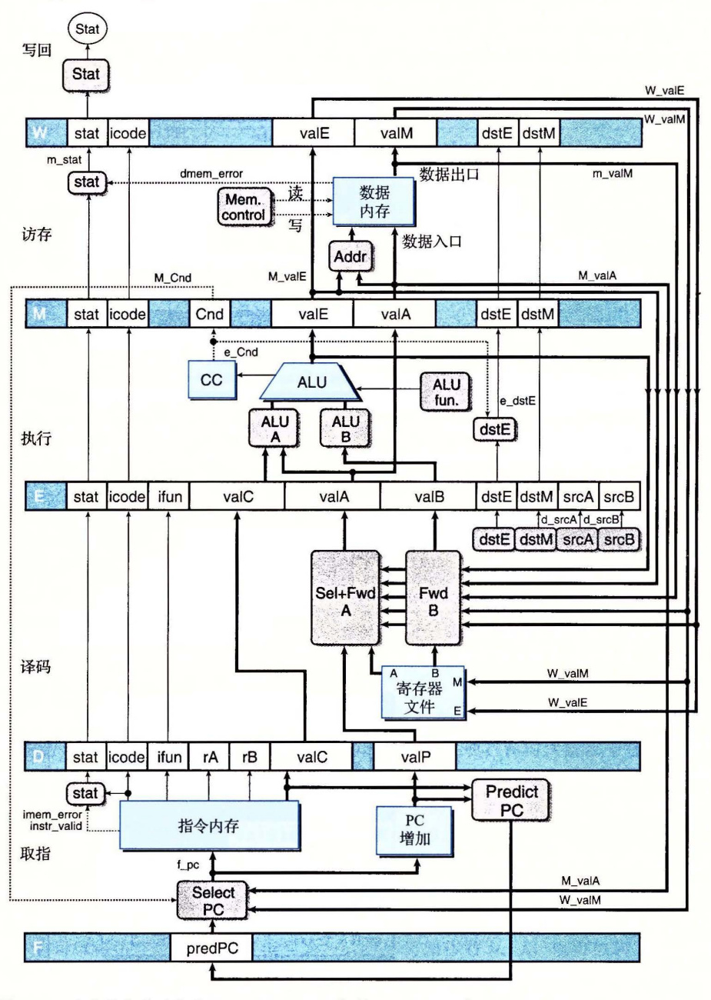

**图 4-52　流水线化的最终实现——PIPE 的硬件结构。** 添加的旁路路径能够转发前面三条指令的结果。这使得我们能够不暂停流水线就处理大多数形式的数据冒险。

图 4-49～图 4-51 的扩展图还表明译码阶段逻辑能够确定是使用来自寄存器文件的值，还是要用转发过来的值。与每个要写回寄存器文件的值相关的是目的寄存器 ID。逻辑会将这些 ID 与源寄存器 ID `srcA` 和 `srcB` 相比较，以此来检测是否需要转发。可能有多个目的寄存器 ID 与一个源 ID 相等。要解决这样的情况，我们必须在各个转发源中建立起优先级关系。在学习转发逻辑的详细设计时，我们会讨论这个内容。

图 4-52 给出的是 PIPE 的结构，它是 PIPE− 的扩展，能通过转发处理数据冒险。将这幅图与 PIPE− 的结构（图 4-41）相比，我们可以看到来自五个转发源的值反馈到译码阶段中两个标号为“Sel+Fwd A”和“Fwd B”的块。标号为“Sel+Fwd A”的块是 PIPE− 中标号为“Select A”的块的功能与转发逻辑的结合。它允许流水线寄存器 E 的 `valA` 为已增加的程序计数器值 `valP`，从寄存器文件 A 端口读出的值，或者某个转发过来的值。标号为“Fwd B”的块实现的是源操作数 `valB` 的转发逻辑。

##### 3. 加载/使用数据冒险

有一类数据冒险不能单纯用转发来解决，因为内存读在流水线发生的比较晚。图 4-53 举例说明了加载/使用冒险（load/use hazard），其中一条指令（位于地址 `0x028` 的 `mrmovq`）从内存中读出寄存器 `%rax` 的值，而下一条指令（位于地址 `0x032` 的 `addq`）需要该值作为源操作数。图的下部是周期 7 和 8 的扩展说明，在此假设所有的程序寄存器都初始化为 0。`addq` 指令在周期 7 中需要该寄存器的值，但是 `mrmovq` 指令直到周期 8 才产生出这个值。为了从 `mrmovq`“转发到”`addq`，转发逻辑不得不将值送回到过去的时间！这显然是不可能的，我们必须找到其他机制来解决这种形式的数据冒险。（位于地址 `0x01e` 的 `irmovq` 指令产生的寄存器 `%rbx` 的值，会被位于地址 `0x032` 的 `addq` 指令使用，转发能够处理这种数据冒险。）

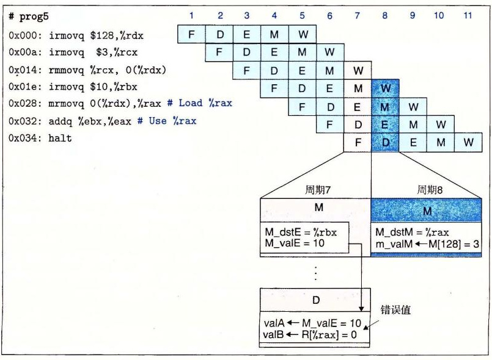

**图 4-53　加载/使用数据冒险的示例。** `addq` 指令在周期 7 译码阶段中需要寄存器 `%rax` 的值。前面的 `mrmovq` 指令在周期 8 访存阶段中读出这个寄存器的新值，这对于 `addq` 指令来说太迟了。

如图 4-54 所示，我们可以将暂停和转发结合起来，避免加载/使用数据冒险。这个需要修改控制逻辑，但是可以使用现有的旁路路径。当 `mrmovq` 指令通过执行阶段时，流水线控制逻辑发现译码阶段中的指令（`addq`）需要从内存中读出的结果。它会将译码阶段中的指令暂停一个周期，导致执行阶段中插入一个气泡。如周期 8 的扩展说明所示，从内存中读出的值可以从访存阶段转发到译码阶段中的 `addq` 指令。寄存器 `%rbx` 的值也可以从访存阶段转发到译码阶段。就像流水线图，从周期 7 中标号为“D”的方框到周期 8 中标号为“E”的方框的箭头表明的那样，插入的气泡代替了正常情况下本来应该继续通过流水线的 `addq` 指令。

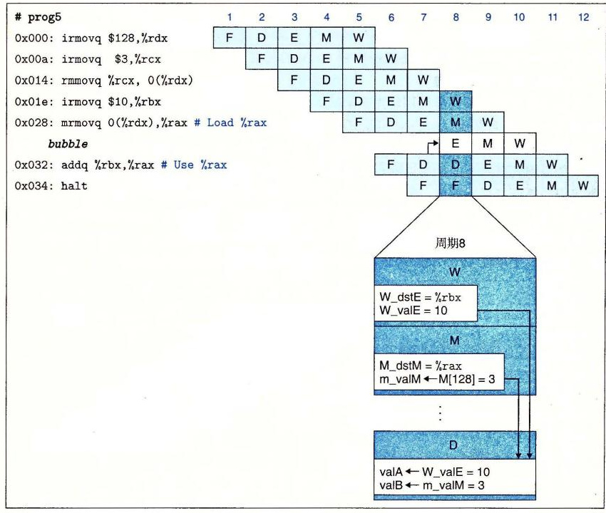

**图 4-54　用暂停来处理加载/使用冒险。** 通过将 `addq` 指令在译码阶段暂停一个周期，就可以将 `valB` 的值从访存阶段中的 `mrmovq` 指令转发到译码阶段中的 `addq` 指令。

这种用暂停来处理加载/使用冒险的方法称为加载互锁（load interlock）。加载互锁和转发技术结合起来足以处理所有可能类型的数据冒险。因为只有加载互锁会降低流水线的吞吐量，我们几乎可以实现每个时钟周期发射一条新指令的吞吐量目标。

##### 4. 避免控制冒险

当处理器无法根据处于取指阶段的当前指令来确定下一条指令的地址时，就会出现控制冒险。如同在 4.5.4 节讨论过的，在我们的流水线化处理器中，控制冒险只会发生在 `ret` 指令和跳转指令。而且，后一种情况只有在条件跳转方向预测错误时才会造成麻烦。在本小节中，我们概括介绍如何来处理这些冒险。作为对流水线控制更一般性讨论的一部分，其详细实现在 4.5.8 节给出。

对于 `ret` 指令，考虑下面的示例程序。这个程序是用汇编代码表示的，左边是各个指令的地址，以供参考：

```asm
0x000: irmovq stack,%rsp        # Initialize stack pointer
0x00a: call proc                # Procedure call
0x013: irmovq $10,%rdx          # Return point
0x01d: halt
0x020: .pos 0x20
0x020: proc:                    # proc:
0x020: ret                      # Return immediately
0x021: rrmovq %rdx,%rbx         # Not executed
0x030: .pos 0x30
0x030: stack:                   # stack: Stack pointer
```

图 4-55 给出了我们希望流水线如何来处理 `ret` 指令。同前面的流水线图一样，这幅图展示了流水线的活动，时间从左向右增加。与前面不同的是，指令列出的顺序与它们在程序中出现的顺序并不相同，这是因为这个程序的控制流中指令并不是按线性顺序执行的。看看指令的地址就能看出它们在程序中的位置。


**图 4-55　`ret` 指令处理的简化视图。** 当 `ret` 经过译码、执行和访存阶段时，流水线应该暂停，在处理过程中插入三个气泡。一旦 `ret` 指令到达写回阶段（周期 7），PC 选择逻辑就会选择返回地址作为指令的取指地址。

如这张图所示，在周期 3 中取出 `ret` 指令，并沿着流水线前进，在周期 7 进入写回阶段。在它经过译码、执行和访存阶段时，流水线不能做任何有用的活动。我们只能在流水线中插入三个气泡。一旦 `ret` 指令到达写回阶段，PC 选择逻辑就会将程序计数器设为返回地址，然后取指阶段就会取出位于返回点（地址 `0x013`）处的 `irmovq` 指令。

要处理预测错误的分支，考虑下面这个用汇编代码表示的程序，左边是各个指令的地址，以供参考：

```asm
0x000: xorq %rax,%rax
0x002: jne target               # Not taken
0x00b: irmovq $1,%rax           # Fall through
0x015: halt
0x016: target:
0x016: irmovq $2,%rdx           # Target
0x020: irmovq $3,%rbx           # Target+1
0x02a: halt
```

图 4-56 表明是如何处理这些指令的。同前面一样，指令是按照它们进入流水线的顺序列出的，而不是按照它们出现在程序中的顺序。因为预测跳转指令会选择分支，所以周期 3 中会取出位于跳转目标处的指令，而周期 4 中会取出该指令后的那条指令。在周期 4，分支逻辑发现不应该选择分支之前，已经取出了两条指令，它们不应该继续执行下去了。幸运的是，这两条指令都没有导致程序员可见的状态发生改变。只有到指令到达执行阶段时才会发生那种情况，在执行阶段中，指令会改变条件码。我们只要在下一个周期往译码和执行阶段中插入气泡，并同时取出跳转指令后面的指令，这样就能取消（有时也称为指令排除（instruction squashing））那两条预测错误的指令。这样一来，两条预测错误的指令就会简单地从流水线中消失，因此不会对程序员可见的状态产生影响。唯一的缺点是两个时钟周期的指令处理能力被浪费了。

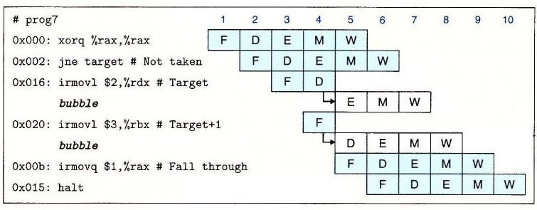

**图 4-56　处理预测错误的分支指令。** 流水线预测会选择分支，所以开始取跳转目标处的指令。在周期 4 发现预测错误之前，已经取出了两条指令，此时，跳转指令正在通过执行阶段。在周期 5 中，流水线往译码和执行阶段中插入气泡，取消了两条目标指令，同时还取出跳转后面的那条指令。

对控制冒险的讨论表明，通过慎重考虑流水线的控制逻辑，控制冒险是可以被处理的。在出现特殊情况时，暂停和往流水线中插入气泡的技术可以动态调整流水线的流程。如同我们将在 4.5.8 节中讨论的一样，对基本时钟寄存器设计的简单扩展就可以让我们暂停流水段，并向作为流水线控制逻辑一部分的流水线寄存器中插入气泡。

#### 4.5.6 异常处理

正如第 8 章中将讨论的，处理器中很多事情都会导致异常控制流，此时，程序执行的正常流程被破坏掉。异常可以由程序执行从内部产生，也可以由某个外部信号从外部产生。我们的指令集体系结构包括三种不同的内部产生的异常：1）`halt` 指令，2）有非法指令和功能码组合的指令，3）取指或数据读写试图访问一个非法地址。一个更完整的处理器设计应该也能处理外部异常，例如当处理器收到一个网络接口收到新包的信号，或是一个用户点击鼠标按钮的信号。正确处理异常是任何微处理器设计中很有挑战性的一方面。异常可能出现在不可预测的时间，需要明确地中断通过处理器流水线的指令流。我们对这三种内部异常的处理只是让你对正确发现和处理异常的真实复杂性略有了解。

我们把导致异常的指令称为异常指令（excepting instruction）。在使用非法指令地址的情况中，没有实际的异常指令，但是想象在非法地址处有一种“虚拟指令”会有所帮助。在简化的 ISA 模型中，我们希望当处理器遇到异常时，会停止，设置适当的状态码，如图 4-5 所示。看上去应该是到异常指令之前的所有指令都已经完成，而其后的指令都不应该对程序员可见的状态产生任何影响。在一个更完整的设计中，处理器会继续调用异常处理程序（exception handler），这是操作系统的一部分，但是实现异常处理的这部分超出了本书讲述的范围。

在一个流水线化的系统中，异常处理包括一些细节问题。首先，可能同时有多条指令会引起异常。例如，在一个流水线操作的周期内，取指阶段中有 `halt` 指令，而数据内存会报告访存阶段中的指令数据地址越界。我们必须确定处理器应该向操作系统报告哪个异常。基本原则是：由流水线中最深的指令引起的异常，优先级最高。在上面那个例子中，应该报告访存阶段中指令的地址越界。就机器语言程序来说，访存阶段中的指令本来应该在取指阶段中的指令开始之前就结束的，所以，只应该向操作系统报告这个异常。

第二个细节问题是，当首先取出一条指令，开始执行时，导致了一个异常，而后来由于分支预测错误，取消了该指令。下面就是一个程序示例的目标代码：

```text
0x000: 6300                  |    xorq %rax,%rax
0x002: 741600000000000000    |    jne target        # Not taken
0x00b: 30f00100000000000000  |    irmovq $1,%rax    # Fall through
0x015: 00                    |    halt
0x016:                       | target:
0x016: ff                    |    .byte 0xFF        # Invalid instruction code
```

在这个程序中，流水线会预测选择分支，因此它会取出并以一个值为 `0xFF` 的字节作为指令（由汇编代码中 `.byte` 伪指令产生的）。译码阶段会因此发现一个非法指令异常。稍后，流水线会发现不应该选择分支，因此根本就不应该取出位于地址 `0x016` 的指令。流水线控制逻辑会取消该指令，但是我们想要避免出现异常。

第三个细节问题的产生是因为流水线化的处理器会在不同的阶段更新系统状态的不同部分。有可能会出现这样的情况，一条指令导致了一个异常，它后面的指令在异常指令完成之前改变了部分状态。比如说，考虑下面的代码序列，其中假设不允许用户程序访问 64 位范围的高端地址：

```text
1  irmovq $1,%rax
2  xorq %rsp,%rsp     # Set stack pointer to 0 and CC to 100
3  pushq %rax         # Attempt to write to 0xfffffffffffffff8
4  addq %rax,%rax     # (Should not be executed) Would set CC to 000
```

`pushq` 指令导致一个地址异常，因为减小栈指针会导致它绕回到 `0xfffffffffffffff8`。访存阶段中会发现这个异常。在同一周期中，`addq` 指令处于执行阶段，而它会将条件码设置成新的值。这就会违反异常指令之后的所有指令都不能影响系统状态的要求。

一般地，通过在流水线结构中加入异常处理逻辑，我们既能够从各个异常中做出正确的选择，也能够避免出现由于分支预测错误取出的指令造成的异常。这就是为什么我们会在每个流水线寄存器中包括一个状态码 `stat`（图 4-41 和图 4-52）。如果一条指令在其处理中于某个阶段产生了一个异常，这个状态字段就被设置成指示异常的种类。异常状态和该指令的其他信息一起沿着流水线传播，直到它到达写回阶段。在此，流水线控制逻辑发现出现了异常，并停止执行。

为了避免异常指令之后的指令更新任何程序员可见的状态，当处于访存或写回阶段中的指令导致异常时，流水线控制逻辑必须禁止更新条件码寄存器或是数据内存。在上面的示例程序中，控制逻辑会发现访存阶段中的 `pushq` 导致了异常，因此应该禁止 `addq` 指令更新条件码寄存器。

让我们来看看这种处理异常的方法是怎样解决刚才提到的那些细节问题的。当流水线中有一个或多个阶段出现异常时，信息只是简单地存放在流水线寄存器的状态字段中。异常事件不会对流水线中的指令流有任何影响，除了会禁止流水线中后面的指令更新程序员可见的状态（条件码寄存器和内存），直到异常指令到达最后的流水线阶段。因为指令到达写回阶段的顺序与它们在非流水线化的处理器中执行的顺序相同，所以我们可以保证第一条遇到异常的指令会第一个到达写回阶段，此时程序执行会停止，流水线寄存器 W 中的状态码会被记录为程序状态。如果取出了某条指令，过后又取消了，那么所有关于这条指令的异常状态信息也都会被取消。所有导致异常的指令后面的指令都不能改变程序员可见的状态。携带指令的异常状态以及所有其他信息通过流水线的简单原则是处理异常的简单而可靠的机制。

#### 4.5.7 PIPE 各阶段的实现

现在我们已经创建了 PIPE 的整体结构，PIPE 是我们使用了转发技术的流水线化的 Y86-64 处理器。它使用了一组与前面顺序设计相同的硬件单元，另外增加了一些流水线寄存器、一些重新配置了的逻辑块，以及增加的流水线控制逻辑。在本节中，我们将浏览各个逻辑块的设计，而将流水线控制逻辑的设计放到下一节中介绍。许多逻辑块与 SEQ 和 SEQ+ 中相应部件完全相同，除了我们必须从来自不同流水线寄存器（用大写的流水线寄存器的名字作为前缀）或来自各个阶段计算（用小写的阶段名字的第一个字母作为前缀）的信号中选择适当的值。

作为一个示例，比较一下 SEQ 中产生 `srcA` 信号的逻辑的 HCL 代码与 PIPE 中相应的代码：

```text
# Code from SEQ
word srcA = [
    icode in { IRRMOVQ, IRMMOVQ, IOPQ, IPUSHQ } : rA;
    icode in { IPOPQ, IRET } : RRSP;
    1 : RNONE; # Don't need register
];

# Code from PIPE
word d_srcA = [
    D_icode in { IRRMOVQ, IRMMOVQ, IOPQ, IPUSHQ } : D_rA;
    D_icode in { IPOPQ, IRET } : RRSP;
    1 : RNONE; # Don't need register
];
```

它们的不同之处只在于 PIPE 信号都加上了前缀：“`D_`”表示源值，以表明信号是来自流水线寄存器 D，而“`d_`”表示结果值，以表明它是在译码阶段中产生的。为了避免重复，我们在此就不列出那些与 SEQ 中代码只有名字前缀不同的块的 HCL 代码。网络旁注 ARCH:HCL 中列出了完整的 PIPE 的 HCL 代码。

##### 1. PC 选择和取指阶段

图 4-57 提供了 PIPE 取指阶段逻辑的一个详细描述。像前面讨论过的那样，这个阶段必须选择程序计数器的当前值，并且预测下一个 PC 值。用于从内存中读取指令和抽取不同指令字段的硬件单元与 SEQ 中考虑的那些一样（参见 4.3.4 节中的取指阶段）。

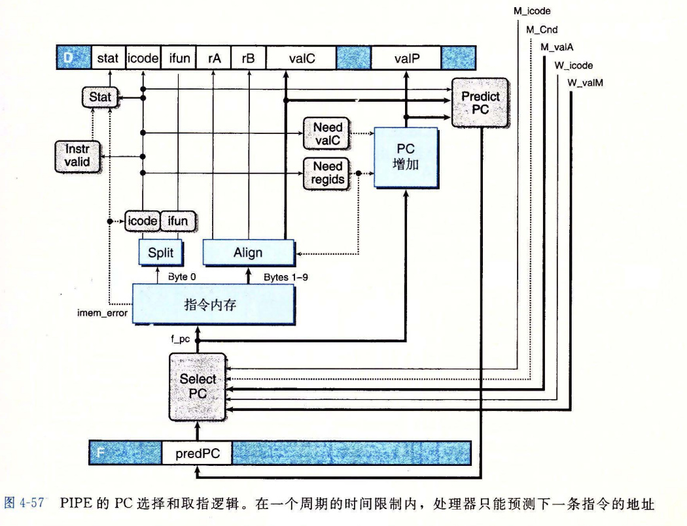

*图 4-57　PIPE 的 PC 选择和取指逻辑。在一个周期的时间限制内，处理器只能预测下一条指令的地址*

PC 选择逻辑从三个程序计数器源中进行选择。当一条预测错误的分支进入访存阶段时，会从流水线寄存器 M（信号 `M_valA`）中读出该指令 `valP` 的值（指明下一条指令的地址）。当 `ret` 指令进入写回阶段时，会从流水线寄存器 W（信号 `W_valM`）中读出返回地址。其他情况会使用存放在流水线寄存器 F（信号 `F_predPC`）中的 PC 的预测值：

```text
word f_pc = [
    # Mispredicted branch. Fetch at incremented PC
    M_icode == IJXX && !M_Cnd : M_valA;
    # Completion of RET instruction
    W_icode == IRET : W_valM;
    # Default: Use predicted value of PC
    1 : F_predPC;
];
```

当取出的指令为函数调用或跳转时，PC 预测逻辑会选择 `valC`，否则就会选择 `valP`：

```text
word f_predPC = [
    f_icode in { IJXX, ICALL } : f_valC;
    1 : f_valP;
];
```

标号为“Instr valid”、“Need regids”和“Need valC”的逻辑块和 SEQ 中的一样，使用了适当命名的源信号。

同 SEQ 中不一样，我们必须将指令状态的计算分成两个部分。在取指阶段，可以测试由于指令地址越界引起的内存错误，还可以发现非法指令或 `halt` 指令。必须推迟到访存阶段才能发现非法数据地址。

**练习题 4.30** 写出信号 `f_stat` 的 HCL 代码，提供取出的指令的临时状态。

##### 2. 译码和写回阶段

图 4-58 是 PIPE 的译码和写回逻辑的详细说明。标号为“dstE”、“dstM”、“srcA”和“srcB”的块非常类似于它们在 SEQ 的实现中的相应部件。我们观察到，提供给写端口的寄存器 ID 来自于写回阶段（信号 `W_dstE` 和 `W_dstM`），而不是来自于译码阶段。这是因为我们希望进行写的目的寄存器是由写回阶段中的指令指定的。

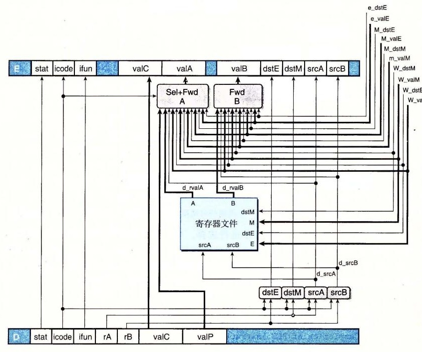

*图 4-58　PIPE 的译码和写回阶段逻辑。没有指令既需要 `valP` 又需要来自寄存器端口 A 中读出的值，因此对后面的阶段来说，这两者可以合并为信号 `valA`。标号为“Sel+Fwd A”的块执行该任务，并实现源操作数 `valA` 的转发逻辑。标号为“Fwd B”的块实现源操作数 `valB` 的转发逻辑。寄存器写的位置是由来自写回阶段的 `dstE` 和 `dstM` 信号指定的，而不是来自于译码阶段，因为它要写的是当前正在写回阶段中的指令的结果*

**练习题 4.31** 译码阶段中标号为“dstE”的块根据来自流水线寄存器 D 中取出的指令的各个字段，产生寄存器文件 E 端口的寄存器 ID。在 PIPE 的 HCL 描述中，得到的信号命名为 `d_dstE`。根据 SEQ 信号 `dstE` 的 HCL 描述，写出这个信号的 HCL 代码。（参考 4.3.4 节中的译码阶段。）目前还不用关心实现条件传送的逻辑。

这个阶段的复杂性主要是跟转发逻辑相关。就像前面提到的那样，标号为“Sel+Fwd A”的块扮演两个角色。它为后面的阶段将 `valP` 信号合并到 `valA` 信号，这样可以减少流水线寄存器中状态的数量。它还实现了源操作数 `valA` 的转发逻辑。

合并信号 `valA` 和 `valP` 的依据是，只有 `call` 和跳转指令在后面的阶段中需要 `valP` 的值，而这些指令并不需要从寄存器文件 A 端口中读出的值。这个选择是由该阶段的 `icode` 信号来控制的。当信号 `D_icode` 与 `call` 或 `jXX` 的指令代码相匹配时，这个块就会选择 `D_valP` 作为它的输出。

4.5.5 节中提到有 5 个不同的转发源，每个都有一个数据字和一个目的寄存器 ID：

| 数据字 | 寄存器 ID | 源描述 |
| --- | --- | --- |
| `e_valE` | `e_dstE` | ALU 输出 |
| `m_valM` | `M_dstM` | 内存输出 |
| `M_valE` | `M_dstE` | 访存阶段中对端口 E 未进行的写 |
| `W_valM` | `W_dstM` | 写回阶段中对端口 M 未进行的写 |
| `W_valE` | `W_dstE` | 写回阶段中对端口 E 未进行的写 |

如果不满足任何转发条件，这个块就应该选择 `d_rvalA` 作为它的输出，也就是从寄存器端口 A 中读出的值。

综上所述，我们得到以下流水线寄存器 E 的 `valA` 新值的 HCL 描述：

```text
word d_valA = [
    D_icode in { ICALL, IJXX } : D_valP; # Use incremented PC
    d_srcA == e_dstE : e_valE;           # Forward valE from execute
    d_srcA == M_dstM : m_valM;           # Forward valM from memory
    d_srcA == M_dstE : M_valE;           # Forward valE from memory
    d_srcA == W_dstM : W_valM;           # Forward valM from write back
    d_srcA == W_dstE : W_valE;           # Forward valE from write back
    1 : d_rvalA;                          # Use value read from register file
];
```

上述 HCL 代码中赋予这 5 个转发源的优先级是非常重要的。这种优先级是由 HCL 代码中检测 5 个目的寄存器 ID 的顺序来确定的。如果选择了其他任何顺序，对某些程序来说，流水线就会出错。图 4-59 给出了一个程序示例，要求对执行和访存阶段中的转发源设置正确的优先级。在这个程序中，前两条指令写寄存器 `%rdx`，而第三条指令用这个寄存器作为它的源操作数。当指令 `rrmovq` 在周期 4 到达译码阶段时，转发逻辑必须在两个都以该源寄存器为目的的值中选择一个。它应该选择哪一个呢？为了设定优先级，我们必须考虑当一次执行一条指令时，机器语言程序的行为。第一条 `irmovq` 指令会将寄存器 `%rdx` 设为 10，第二条 `irmovq` 指令会将之设为 3，然后 `rrmovq` 指令会从 `%rdx` 中读出 3。为了模拟这种行为，流水线化的实现应该总是给处于最早流水线阶段中的转发源以较高的优先级，因为它保持着程序序列中设置该寄存器的最近的指令。因此，上述 HCL 代码中的逻辑首先会检测执行阶段中的转发源，然后是访存阶段，最后才是写回阶段。只有指令 `popq %rsp` 会关心在访存或写回阶段中的两个源之间的转发优先级，因为只有这条指令能同时写两个寄存器。

**练习题 4.32** 假设 `d_valA` 的 HCL 代码中第三和第四种情况（来自访存阶段的两个转发源）的顺序是反过来的。请描述下列程序中 `rrmovq` 指令（第 5 行）造成的行为：

```text
1  irmovq $5,%rdx
2  irmovq $0x100,%rsp
3  rmmovq %rdx,0(%rsp)
4  popq %rsp
5  rrmovq %rsp,%rax
```


*图 4-59　转发优先级的说明。在周期 4 中，`%rdx` 的值既可以从执行阶段也可以从访存阶段得到。转发逻辑应该选择执行阶段中的值，因为它代表最近产生的该寄存器的值*

**练习题 4.33** 假设 `d_valA` 的 HCL 代码中第五和第六种情况（来自写回阶段的两个转发源）的顺序是反过来的。写出一个会运行错误的 Y86-64 程序。请描述错误是如何发生的，以及它对程序行为的影响。

**练习题 4.34** 根据提供到流水线寄存器 E 的源操作数 `valB` 的值，写出信号 `d_valB` 的 HCL 代码。

写回阶段的一小部分是保持不变的。如图 4-52 所示，整个处理器的状态 `Stat` 是一个块根据流水线寄存器 W 中的状态值计算出来的。回想一下 4.1.1 节，状态码应该指明是正常操作（AOK），还是三种异常条件中的一种。由于流水线寄存器 W 保存着最近完成的指令的状态，很自然地要用这个值来表示整个处理器状态。唯一要考虑的特殊情况是当写回阶段有气泡时。这是正常操作的一部分，因此对于这种情况，我们也希望状态码是 AOK：

```text
word Stat = [
    W_stat == SBUB : SAOK;
    1 : W_stat;
];
```

##### 3. 执行阶段

图 4-60 展现的是 PIPE 执行阶段的逻辑。这些硬件单元和逻辑块同 SEQ 中的相同，使用的信号做适当的重命名。我们可以看到信号 `e_valE` 和 `e_dstE` 作为转发源，指向译码阶段。一个区别是标号为“Set CC”的逻辑以信号 `m_stat` 和 `W_stat` 作为输入，这个逻辑决定了是否要更新条件码。这些信号被用来检查一条导致异常的指令正在通过后面的流水线阶段的情况，因此，任何对条件码的更新都会被禁止。这部分设计在 4.5.8 节中讨论。

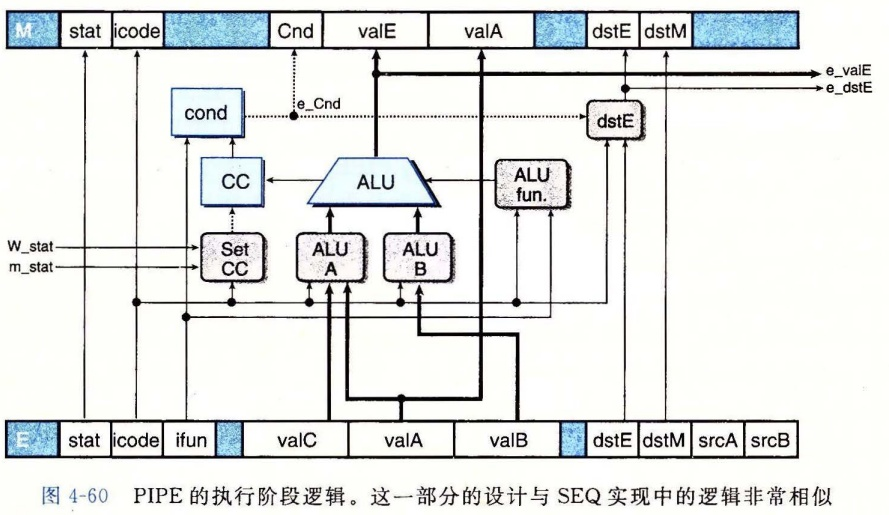

*图 4-60　PIPE 的执行阶段逻辑。这一部分的设计与 SEQ 实现中的逻辑非常相似*

**练习题 4.35** `d_valA` 的 HCL 代码中的第二种情况使用了信号 `e_dstE`，来判断是否要选择 ALU 的输出 `e_valE` 作为转发源。假设我们用 `E_dstE`，也就是流水线寄存器 E 中的目的寄存器 ID，来作为这个选择。写出一个采用这个修改过的转发逻辑就会产生错误结果的 Y86-64 程序。

##### 4. 访存阶段

图 4-61 是 PIPE 的访存阶段逻辑。将这个逻辑与 SEQ 的访存阶段（图 4-30）相比较，我们看到，正如前面提到的那样，PIPE 中没有 SEQ 中标号为“Data”的块。这个块是用来在数据源 `valP`（对 `call` 指令来说）和 `valA` 中进行选择的，但是这个选择现在由译码阶段中标号为“Sel+Fwd A”的块来执行。这个阶段中的其他块都和 SEQ 中相应的部件相同，采用的信号做适当的重命名。在图中，你还可以看到许多流水线寄存器 M 和 W 中的值作为转发和流水线控制逻辑的一部分，提供给电路中其他部分。


*图 4-61　PIPE 的访存阶段逻辑。许多从流水线寄存器 M 和 W 来的信号被传递到较早的阶段，以提供写回的结果、指令地址以及转发的结果*

**练习题 4.36** 在这个阶段中，通过检查数据内存的非法地址情况，我们能够完成状态码 `Stat` 的计算。写出信号 `m_stat` 的 HCL 代码。

#### 4.5.8 流水线控制逻辑

现在准备创建流水线控制逻辑，完成我们的 PIPE 设计。这个逻辑必须处理下面 4 种控制情况，这些情况是其他机制（例如数据转发和分支预测）不能处理的：

**加载/使用冒险：** 在一条从内存中读出一个值的指令和一条使用该值的指令之间，流水线必须暂停一个周期。

**处理 `ret`：** 流水线必须暂停直到 `ret` 指令到达写回阶段。

**预测错误的分支：** 在分支逻辑发现不应该选择分支之前，分支目标处的几条指令已经进入流水线了。必须取消这些指令，并从跳转指令后面的那条指令开始取指。

**异常：** 当一条指令导致异常，我们想要禁止后面的指令更新程序员可见的状态，并且在异常指令到达写回阶段时，停止执行。

我们先浏览每种情况所期望的行为，然后再设计处理这些情况的控制逻辑。

##### 1. 特殊控制情况所期望的处理

在 4.5.5 节中，我们已经描述了对加载/使用冒险所期望的流水线操作，如图 4-54 所示。只有 `mrmovq` 和 `popq` 指令会从内存中读数据。当这两条指令中的任一条处于执行阶段，并且需要该目的寄存器的指令正处在译码阶段时，我们要将第二条指令阻塞在译码阶段，并在下一个周期往执行阶段中插入一个气泡。此后，转发逻辑会解决这个数据冒险。可以将流水线寄存器 D 保持为固定状态，从而将一个指令阻塞在译码阶段。这样做还可以保证流水线寄存器 F 保持为固定状态，由此下一条指令会被再取一次。总之，实现这个流水线流需要发现冒险的情况，保持流水线寄存器 F 和 D 固定不变，并且在执行阶段中插入气泡。

对 `ret` 指令的处理，我们已经在 4.5.5 节中描述了所需的流水线操作。流水线要停顿 3 个时钟周期，直到 `ret` 指令经过访存阶段，读出返回地址。通过图 4-55 中下面程序的处理的简化流水线图，说明了这种情况：

```text
0x000: irmovq stack,%rsp    # Initialize stack pointer
0x00a: call proc            # Procedure call
0x013: irmovq $10,%rdx      # Return point
0x01d: halt
0x020: .pos 0x20
0x020: proc:                # proc:
0x020: ret                  # Return immediately
0x021: rrmovq %rdx,%rbx     # Not executed
0x030: .pos 0x30
0x030: stack:               # stack: Stack pointer
```

图 4-62 是示例程序中 `ret` 指令的实际处理过程。在此可以看到，没有办法在流水线的取指阶段中插入气泡。每个周期，取指阶段从指令内存中读出一条指令。看看 4.5.7 节中实现 PC 预测逻辑的 HCL 代码，我们可以看到，对 `ret` 指令来说，PC 的新值被预测成 `valP`，也就是下一条指令的地址。在我们的示例程序中，这个地址会是 `0x021`，即 `ret` 后面 `rrmovq` 指令的地址。对这个例子来说，这种预测是不对的，即使对大部分情况来说，也是不对的，但是在设计中，我们并不试图正确预测返回地址。取指阶段会暂停 3 个时钟周期，导致取出 `rrmovq` 指令，但是在译码阶段就被替换成了气泡。这个过程在图 4-62 中的表示为，3 个取指用箭头指向下面的气泡，气泡会经过剩下的流水线阶段。最后，在周期 7 取出 `irmovq` 指令。比较图 4-62 和图 4-55，可以看到，我们的实现达到了期望的效果，只不过连续 3 个周期取出了不正确的指令。

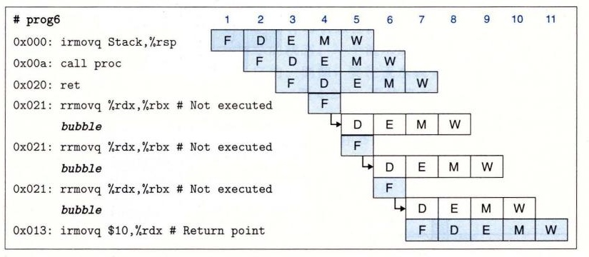

*图 4-62　`ret` 指令的详细处理过程。取指阶段反复取出 `ret` 指令后面的 `rrmovq` 指令，但是流水线控制逻辑在译码阶段中插入气泡，而不是让 `rrmovq` 指令继续下去。由此得到的行为与图 4-55 所示的等价*

当分支预测错误发生时，我们已经在 4.5.5 节中描述了所需的流水线操作，并用图 4-56 进行了说明。当跳转指令到达执行阶段时就可以检测到预测错误。然后在下一个时钟周期，控制逻辑就会在译码和执行段插入气泡，取消两条不正确的已取指令。在同一个时钟周期，流水线将正确的指令读取到取指阶段。

对于导致异常的指令，我们必须使流水线化的实现符合期望的 ISA 行为，也就是在前面所有的指令结束前，后面的指令不能影响程序的状态。一些因素会使得想达到这些效果比较麻烦：1）异常在程序执行的两个不同阶段（取指和访存）被发现的，2）程序状态在三个不同阶段（执行、访存和写回）被更新。

在我们的阶段设计中，每个流水线寄存器中会包含一个状态码 `stat`，随着每条指令经过流水线阶段，它会记录指令的状态。当异常发生时，我们将这个信息作为指令状态的一部分记录下来，并且继续取指、译码和执行指令，就好像什么都没有出错似的。当异常指令到达访存阶段时，我们会采取措施防止后面的指令修改程序员可见的状态：1）禁止执行阶段中的指令设置条件码，2）向内存阶段中插入气泡，以禁止向数据内存中写入，3）当写回阶段中有异常指令时，暂停写回阶段，因而暂停了流水线。

图 4-63 中的流水线图说明了我们的流水线控制如何处理导致异常的指令后面跟着一条会改变条件码的指令的情况。在周期 6，`pushq` 指令到达访存阶段，产生一个内存错误。在同一个周期，执行阶段中的 `addq` 指令产生新的条件码的值。当访存或者写回阶段中有异常指令时（通过检查信号 `m_stat` 和 `W_stat`，然后将信号 `set_cc` 设置为 0），禁止设置条件码。在图 4-63 的例子中，我们还可以看到既向访存阶段插入了气泡，也在写回阶段暂停了异常指令——`pushq` 指令在写回阶段保持暂停，后面的指令都没有通过执行阶段。

对状态信号流水线化，控制条件码的设置，以及控制流水线阶段——将这些结合起来，我们实现了对异常的期望的行为：异常指令之前的指令都完成了，而后面的指令对程序员可见的状态都没有影响。

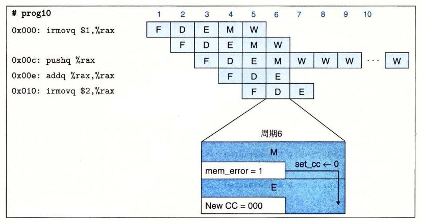

*图 4-63　处理非法内存引用异常。在周期 6，`pushq` 指令的非法内存引用导致禁止更新条件码。流水线开始往访存阶段插入气泡，并在写回阶段暂停异常指令*

##### 2. 发现特殊控制条件

图 4-64 总结了需要特殊流水线控制的条件。它给出的表达式描述了在哪些条件下会出现这三种特殊情况。一些简单的组合逻辑块实现了这些表达式，为了在时钟上升开始下一个周期时控制流水线寄存器的活动，这些块必须在时钟周期结束之前产生出结果。在一个时钟周期内，流水线寄存器 D、E 和 M 分别保持着处于译码、执行和访存阶段中的指令的状态。在到达时钟周期末尾时，信号 `d_srcA` 和 `d_srcB` 会被设置为译码阶段中指令的源操作数的寄存器 ID。当 `ret` 指令通过流水线时，要想发现它，只要检查译码、执行和访存阶段中指令的指令码。发现加载/使用冒险要检查执行阶段中的指令类型（`mrmovq` 或 `popq`），并把它的目的寄存器与译码阶段中指令的源寄存器相比较。当跳转指令在执行阶段时，流水线控制逻辑应该能发现预测错误的分支，这样当指令进入访存阶段时，它就能设置从错误预测中恢复所需要的条件。当跳转指令处于执行阶段时，信号 `e_Cnd` 指明是否要选择分支。通过检查访存和写回阶段中的指令状态值，就能发现异常指令。对于访存阶段，我们使用在这个阶段中计算出来的信号 `m_stat`，而不是使用流水线寄存器的 `M_stat`。这个内部信号包含着可能的数据内存地址错误。

| 条件 | 触发条件 |
| --- | --- |
| 处理 `ret` | `IRET ∈ { D_icode, E_icode, M_icode }` |
| 加载/使用冒险 | `E_icode ∈ { IMRMOVQ, IPOPQ } && E_dstM ∈ { d_srcA, d_srcB }` |
| 预测错误的分支 | `E_icode == IJXX && !e_Cnd` |
| 异常 | `m_stat ∈ { SADR, SINS, SHLT } \|\| W_stat ∈ { SADR, SINS, SHLT }` |

*图 4-64　流水线控制逻辑的检查条件。四种不同的条件要求改变流水线，暂停流水线或者取消已经部分执行的指令*

##### 3. 流水线控制机制

图 4-65 是一些低级机制，它们使得流水线控制逻辑能将指令阻塞在流水线寄存器中，或是往流水线中插入一个气泡。这些机制包括对 4.2.5 节中描述的基本时钟寄存器的小扩展。假设每个流水线寄存器有两个控制输入：暂停（stall）和气泡（bubble）。这些信号的设置决定了当时钟上升时该如何更新流水线寄存器。在正常操作下（图 4-65a），这两个输入都设为 0，使得寄存器加载它的输入作为新的状态。当暂停信号设为 1 时（图 4-65b），禁止更新状态。相反，寄存器会保持它以前的状态。这使得它可以将指令阻塞在某个流水线阶段中。当气泡信号设置为 1 时（图 4-65c），寄存器状态会设置成某个固定的复位配置（reset configuration），得到一个等效于 `nop` 指令的状态。一个流水线寄存器的复位配置的 0、1 模式是由流水线寄存器中字段的集合决定的。例如，要往流水线寄存器 D 中插入一个气泡，我们要将 `icode` 字段设置为常数值 `INOP`（图 4-26）。要往流水线寄存器 E 中插入一个气泡，我们要将 `icode` 字段设为 `INOP`，并将 `dstE`、`dstM`、`srcA` 和 `srcB` 字段设为常数 `RNONE`。确定复位配置是硬件设计师在设计流水线寄存器时的任务之一。在此我们不讨论细节。我们会将气泡和暂停信号都设为 1 看成是出错。

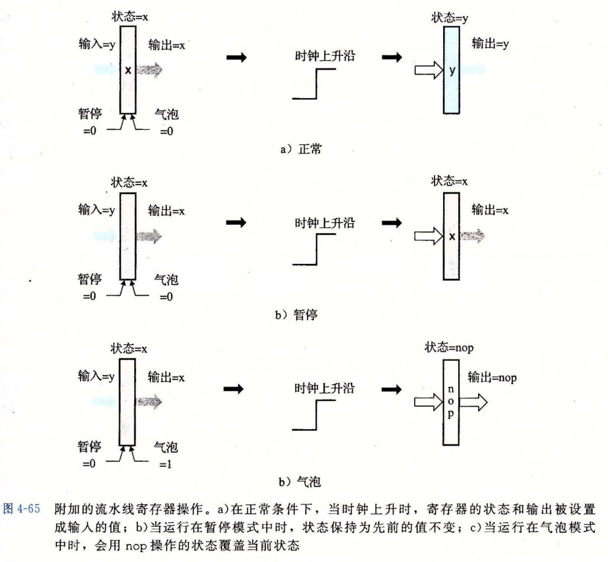

*图 4-65　附加的流水线寄存器操作。a）在正常条件下，当时钟上升时，寄存器的状态和输出被设置成输入的值；b）当运行在暂停模式中时，状态保持为先前的值不变；c）当运行在气泡模式中时，会用 `nop` 操作的状态覆盖当前状态*

图 4-66 中的表给出了各个流水线寄存器在三种特殊情况下应该采取的行动。对每种情况的处理都是对流水线寄存器正常、暂停和气泡操作的某个组合。在时序方面，流水线寄存器的暂停和气泡控制信号是由组合逻辑块产生的。当时钟上升时，这些值必须是合法的，使得当下一个时钟周期开始时，每个流水线寄存器要么加载，要么暂停，要么产生气泡。有了这个对流水线寄存器设计的小扩展，我们就能用组合逻辑、时钟寄存器和随机访问存储器这样的基本构建块，来实现一个完整的、包括所有控制的流水线。

| 条件 | F | D | E | M | W |
| --- | --- | --- | --- | --- | --- |
| 处理 `ret` | 暂停 | 气泡 | 正常 | 正常 | 正常 |
| 加载/使用冒险 | 暂停 | 暂停 | 气泡 | 正常 | 正常 |
| 预测错误的分支 | 正常 | 气泡 | 气泡 | 正常 | 正常 |

*图 4-66　流水线控制逻辑的动作。不同的条件需要改变流水线流，或者会暂停流水线，或者会取消部分已执行的指令*

##### 4. 控制条件的组合

到目前为止，在我们对特殊流水线控制条件的讨论中，假设在任意一个时钟周期内，最多只能出现一个特殊情况。在设计系统时，一个常见的缺陷是不能处理同时出现多个特殊情况的情形。现在来分析这些可能性。我们不需要担心多个程序异常的组合情况，因为已经很小心地设计了异常处理机制，它能够考虑流水线中其他指令的情况。图 4-67 画出了导致其他三种特殊控制条件的流水线状态。图中所示的是译码、执行和访存阶段的块。暗色的方框代表要出现这种条件必须要满足的特别限制。加载/使用冒险要求执行阶段中的指令将一个值从内存读到寄存器中，同时译码阶段中的指令要以该寄存器作为源操作数。预测错误的分支要求执行阶段中的指令是一个跳转指令。对 `ret` 来说有三种可能的情况——指令可以处在译码、执行或访存阶段。当 `ret` 指令通过流水线时，前面的流水线阶段都是气泡。


*图 4-67　特殊控制条件的流水线状态。图中标明的两对情况可能同时出现*

从这些图中我们可以看出，大多数控制条件是互斥的。例如，不可能同时既有加载/使用冒险又有预测错误的分支，因为加载/使用冒险要求执行阶段中是加载指令（`mrmovq` 或 `popq`），而预测错误的分支要求执行阶段中是一条跳转指令。类似地，第二个和第三个 `ret` 组合也不可能与加载/使用冒险或预测错误的分支同时出现。只有用箭头标明的两种组合可能同时出现。

组合 A 中执行阶段中有一条不选择分支的跳转指令，而译码阶段中有一条 `ret` 指令。出现这种组合要求 `ret` 位于不选择分支的目标处。流水线控制逻辑应该发现分支预测错误，因此要取消 `ret` 指令。

**练习题 4.37** 写一个 Y86-64 汇编语言程序，它能导致出现组合 A 的情况，并判断控制逻辑是否处理正确。

合并组合 A 条件的控制动作（图 4-66），我们得到以下流水线控制动作（假设气泡或暂停会覆盖正常的情况）：

| 条件 | F | D | E | M | W |
| --- | --- | --- | --- | --- | --- |
| 处理 `ret` | 暂停 | 气泡 | 正常 | 正常 | 正常 |
| 预测错误的分支 | 正常 | 气泡 | 气泡 | 正常 | 正常 |
| 组合 | 暂停 | 气泡 | 气泡 | 正常 | 正常 |

也就是说，组合情况 A 的处理与预测错误的分支相似，只不过在取指阶段是暂停。幸运的是，在下一个周期，PC 选择逻辑会选择跳转后面那条指令的地址，而不是预测的程序计数器值，所以流水线寄存器 F 发生了什么是没有关系的。因此我们得出结论，流水线能正确处理这种组合情况。

组合 B 包括一个加载/使用冒险，其中加载指令设置寄存器 `%rsp`，然后 `ret` 指令用这个寄存器作为源操作数，因为它必须从栈中弹出返回地址。流水线控制逻辑应该将 `ret` 指令阻塞在译码阶段。

**练习题 4.38** 写一个 Y86-64 汇编语言程序，它能导致出现组合 B 的情况，如果流水线运行正确，以 `halt` 指令结束。

合并组合 B 条件的控制动作（图 4-66），我们得到以下流水线控制动作：

| 条件 | F | D | E | M | W |
| --- | --- | --- | --- | --- | --- |
| 处理 `ret` | 暂停 | 气泡 | 正常 | 正常 | 正常 |
| 加载/使用冒险 | 暂停 | 暂停 | 气泡 | 正常 | 正常 |
| 组合 | 暂停 | 气泡+暂停 | 气泡 | 正常 | 正常 |
| 期望的情况 | 暂停 | 暂停 | 气泡 | 正常 | 正常 |

如果同时触发两组动作，控制逻辑会试图暂停 `ret` 指令来避免加载/使用冒险，同时又会因为 `ret` 指令而在译码阶段中插入一个气泡。显然，我们不希望流水线同时执行这两组动作。相反，我们希望它只采取针对加载/使用冒险的动作。处理 `ret` 指令的动作应该推迟一个周期。

这些分析表明组合 B 需要特殊处理。实际上，PIPE 控制逻辑原来的实现并没有正确处理这种组合情况。即使设计已经通过了许多模拟测试，它还是有细节问题，只有通过刚才那样的分析才能发现。当执行一个含有组合 B 的程序时，控制逻辑会将流水线寄存器 D 的气泡和暂停信号都置为 1。这个例子表明了系统分析的重要性。只运行正常的程序是很难发现这个问题的。如果没有发现这个问题，流水线就不能忠实地实现 ISA 的行为。

##### 5. 控制逻辑实现

图 4-68 是流水线控制逻辑的整体结构。根据来自流水线寄存器和流水线阶段的信号，控制逻辑产生流水线寄存器的暂停和气泡控制信号，同时也决定是否要更新条件码寄存器。我们可以将图 4-64 的发现条件和图 4-66 的动作结合起来，产生各个流水线控制信号的 HCL 描述。

遇到加载/使用冒险或 `ret` 指令，流水线寄存器 F 必须暂停：

```text
bool F_stall =
    # Conditions for a load/use hazard
    E_icode in { IMRMOVQ, IPOPQ } &&
    E_dstM in { d_srcA, d_srcB } ||
    # Stalling at fetch while ret passes through pipeline
    IRET in { D_icode, E_icode, M_icode };
```

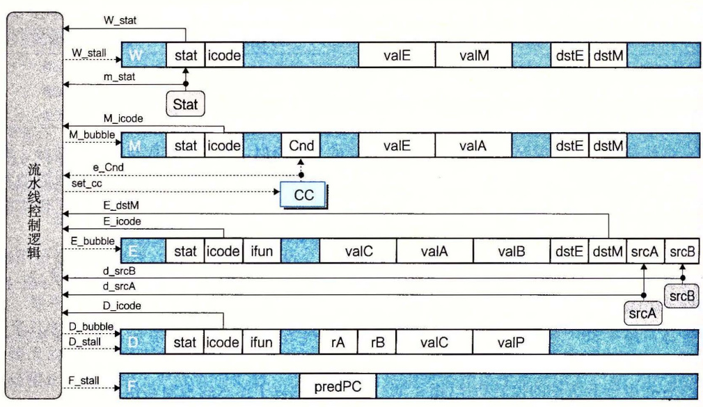

*图 4-68　PIPE 流水线控制逻辑。这个逻辑覆盖了通过流水线的正常指令流，以处理特殊条件，例如过程返回、预测错误的分支、加载/使用冒险和程序异常*

**练习题 4.39** 写出 PIPE 实现中信号 `D_stall` 的 HCL 代码。

遇到预测错误的分支或 `ret` 指令，流水线寄存器 D 必须设置为气泡。不过，正如前面一节中的分析所示，当遇到加载/使用冒险和 `ret` 指令组合时，不应该插入气泡：

```text
bool D_bubble =
    # Mispredicted branch
    (E_icode == IJXX && !e_Cnd) ||
    # Stalling at fetch while ret passes through pipeline
    # but not condition for a load/use hazard
    !(E_icode in { IMRMOVQ, IPOPQ } &&
      E_dstM in { d_srcA, d_srcB }) &&
    IRET in { D_icode, E_icode, M_icode };
```

**练习题 4.40** 写出 PIPE 实现中信号 `E_bubble` 的 HCL 代码。

**练习题 4.41** 写出 PIPE 实现中信号 `set_cc` 的 HCL 代码。该信号只有对 `OPq` 指令才出现，应该考虑程序异常的影响。

**练习题 4.42** 写出 PIPE 实现中信号 `M_bubble` 和 `W_stall` 的 HCL 代码。后一个信号需要修改图 4-64 中列出的异常条件。

现在我们讲完了所有的特殊流水线控制信号的值。在 PIPE 的完整 HCL 代码中，所有其他的流水线控制信号都设为 0。

> **旁注　测试设计**
>
> 正如我们看到的，即使是对于一个很简单的微处理器，设计中还是有很多地方会出现问题。使用流水线，处于不同流水线阶段的指令之间有许多不易察觉的交互。我们看到一些设计上的挑战来自于不常见的指令（例如弹出值到栈指针），或是不常见的指令组合（例如不选择分支的跳转指令后面跟一条 `ret` 指令）。还看到异常处理增加了一类全新的可能的流水线行为。那么怎样确定我们的设计是正确的呢？对于硬件制造者来说，这是主要关心的问题，因为他们不能简单地报告一个错误，让用户通过 Internet 下载代码补丁。即使是简单的逻辑设计错误都可能有很严重的后果，特别是随着微处理器越来越多地用于对我们的生命和健康至关重要的系统的运行中，例如汽车防抱死制动系统、心脏起搏器以及航空控制系统。
>
> 简单地模拟设计，运行一些“典型的”程序，不足以用来测试一个系统。相反，全面的测试需要设计一些方法，系统地产生许多测试尽可能多地使用不同指令和指令组合。在创建 Y86-64 处理器的过程中，我们还设计了很多测试脚本，每个脚本都产生出很多不同的测试，运行处理器模拟，并且比较得到的寄存器和内存值和我们 YIS 指令集模拟器产生的值。以下是这些脚本的简要介绍：
>
> `optest`：运行 49 个不同的 Y86-64 指令测试，具有不同的源和目的寄存器。  
> `jtest`：运行 64 个不同的跳转和函数调用指令的测试，具有不同的是否选择分支的组合。  
> `cmtest`：运行 28 个不同的条件传送指令的测试，具有不同的控制组合。  
> `htest`：运行 600 个不同的数据冒险可能性的测试，具有不同的源和目的的指令的组合，在这些指令对之间有不同数量的 `nop` 指令。  
> `ctest`：测试 22 个不同的控制组合，基于类似 4.5.8 节中我们做的那样的分析。  
> `etest`：测试 12 种不同的导致异常的指令和跟在后面可能改变程序员可见状态的指令组合。
>
> 这种测试方法的关键思想是我们想要尽量的系统化，生成的测试会创建出不同的可能导致流水线错误的条件。

> **旁注　形式化地验证我们的设计**
>
> 即使一个设计通过了广泛的测试，我们也不能保证对于所有可能的程序，它都能正确运行。即使只考虑由短的代码段组成的测试，可以测试的可能的程序的数量也大得难以想象。不过，形式化验证（formal verification）的新方法能够保证有工具能够严格地考虑一个系统所有可能的行为，并确定是否有设计错误。
>
> 我们能够形式化验证 Y86-64 处理器较早的一个版本 [13]。建立一个框架，比较流水线化的设计 PIPE 和非流水线化的版本 SEQ。也就是，它能够证明对于任意 Y86-64 程序，两个处理器对程序员可见的状态有完全一样的影响。当然，我们的验证器不可能真的运行所有可能的程序，因为这样的程序的数量是无穷大的。相反，它使用了归纳法来证明，表明两个处理器之间在一个周期到一个周期的基础上都是一致的。进行这种分析要求用符号方法（symbolic methods）来推导硬件，在符号方法中，我们认为所有的程序值都是任意的整数，将 ALU 抽象成某种“黑盒子”，根据它的参数计算某个未指定的函数。我们只假设 SEQ 和 PIPE 的 ALU 计算相同的函数。
>
> 用控制逻辑的 HCL 描述来产生符号处理器模型的控制逻辑，因此我们能发现 HCL 代码中的问题。能够证明 SEQ 和 PIPE 是完全相同的，也不能保证它们忠实地实现了 Y86-64 指令集体系结构。不过，它能够发现任何由于不正确的流水线设计导致的错误，这是设计错误的主要来源。
>
> 在实验中，我们不仅验证了在本章中考虑的 PIPE 版本，还验证了作为家庭作业的几个变种，其中，我们增加了更多的指令，修改了硬件的能力，或是使用了不同的分支预测策略。有趣的是，在所有的设计中，只发现了一个错误，涉及家庭作业 4.58 中描述的变种的答案中的控制组合 B（在 4.5.8 节中讲述的）。这暴露出测试体制中的一个弱点，导致我们在 `ctest` 测试脚本中增加了附加的情况。
>
> 形式化验证仍然处在发展的早期阶段。工具往往很难使用，而且还不能验证大规模的设计。我们能够验证 Y86-64 处理器的部分原因就是因为它们相对比较简单。即使如此，也需要几周的时间和精力，多次运行那些工具，每次最多需要 8 个小时的计算机时间。这是一个活跃的研究领域，有些工具成为可用的商业版本，有些在 Intel、AMD 和 IBM 这样的公司使用。

> **网络旁注 ARCH:VLOG　流水线化的 Y86-64 处理器的 Verilog 实现**
>
> 正如我们提到过的，现代的逻辑设计包括用硬件描述语言书写硬件设计的文本表示。然后，可以通过模拟和各种形式化验证工具来测试设计。一旦对设计有了信心，我们就可以使用逻辑合成（logic synthesis）工具将设计翻译成实际的逻辑电路。
>
> 我们用 Verilog 硬件描述语言开发了 Y86-64 处理器设计的模型。这些设计将实现处理器基本构造块的模块和直接从 HCL 描述产生出来的控制逻辑结合了起来。我们能够合成这些设计的一些，将逻辑电路描述下载到字段可编程的门阵列（FPGA）硬件上，可以在这些处理器上运行实际的 Y86-64 程序。

#### 4.5.9 性能分析

我们可以看到，所有需要流水线控制逻辑进行特殊处理的条件，都会导致流水线不能够实现每个时钟周期发射一条新指令的目标。我们可以通过确定往流水线中插入气泡的频率，来衡量这种效率的损失，因为插入气泡会导致未使用的流水线周期。一条返回指令会产生三个气泡，一个加载/使用冒险会产生一个，而一个预测错误的分支会产生两个。我们可以通过计算 PIPE 执行一条指令所需要的平均时钟周期数的估计值，来量化这些处罚对整体性能的影响，这种衡量方法称为 CPI（Cycles Per Instruction，每指令周期数）。这种衡量值是流水线平均吞吐量的倒数，不过时间单位是时钟周期，而不是微微秒。这是一个设计体系结构效率的很有用的衡量标准。

如果我们忽略异常带来的性能损失（异常的定义表明它是很少出现的），另一种思考 CPI 的方法是，假设我们在处理器上运行某个基准程序，并观察执行阶段的运行。每个周期，执行阶段要么会处理一条指令，然后这条指令继续通过剩下的阶段，直到完成；要么会处理一个由于三种特殊情况之一而插入的气泡。如果这个阶段一共处理了 C<sub>i</sub> 条指令和 C<sub>b</sub> 个气泡，那么处理器总共需要大约 C<sub>i</sub> + C<sub>b</sub> 个时钟周期来执行 C<sub>i</sub> 条指令。我们说“大约”是因为忽略了启动指令通过流水线的周期。于是，可以用如下方法来计算这个基准程序的 CPI：

> CPI = (C<sub>i</sub> + C<sub>b</sub>) / C<sub>i</sub> = 1.0 + C<sub>b</sub> / C<sub>i</sub>

也就是说，CPI 等于 1.0 加上一个处罚项 C<sub>b</sub> / C<sub>i</sub>，这个项表明执行一条指令平均要插入多少个气泡。因为只有三种指令类型会导致插入气泡，我们可以将这个处罚项分解成三个部分：

> CPI = 1.0 + lp + mp + rp

这里，*lp*（load penalty，加载处罚）是当由于加载/使用冒险造成暂停时插入气泡的平均数，*mp*（mispredicted branch penalty，预测错误分支处罚）是当由于预测错误取消指令时插入气泡的平均数，而 *rp*（return penalty，返回处罚）是当由于 `ret` 指令造成暂停时插入气泡的平均数。每种处罚都是由该种原因引起的插入气泡的总数（C<sub>b</sub> 的一部分）除以执行指令的总数（C<sub>i</sub>）。

为了估计每种处罚，我们需要知道相关指令（加载、条件转移和返回）的出现频率，以及对每种指令特殊情况出现的频率。对 CPI 的计算，我们使用下面这组频率（等同于 [44] 和 [46] 中报告的测量值）：

- 加载指令（`mrmovq` 和 `popq`）占所有执行指令的 25%。其中 20% 会导致加载/使用冒险。
- 条件分支指令占所有执行指令的 20%。其中 60% 会选择分支，而 40% 不选择分支。
- 返回指令占所有执行指令的 2%。

因此，我们可以估计每种处罚，它是指令类型频率、条件出现频率和当条件出现时插入气泡数的乘积：

| 原因 | 名称 | 指令频率 | 条件频率 | 气泡 | 乘积 |
| --- | --- | ---: | ---: | ---: | ---: |
| 加载/使用 | *lp* | 0.25 | 0.20 | 1 | 0.05 |
| 预测错误 | *mp* | 0.20 | 0.40 | 2 | 0.16 |
| 返回 | *rp* | 0.02 | 1.00 | 3 | 0.06 |
| 总处罚 |  |  |  |  | 0.27 |

三种处罚的总和是 0.27，所以得到 CPI 为 1.27。

我们的目标是设计一个每个周期发射一条指令的流水线，也就是 CPI 为 1.0。虽然没有完全达到目标，但是整体性能已经很不错了。我们还能看到，要想进一步降低 CPI，就应该集中注意力预测错误的分支。它们占到了整个处罚 0.27 中的 0.16，因为条件转移非常常见，我们的预测策略又经常出错，而每次预测错误都要取消两条指令。

**练习题 4.43** 假设我们使用了一种成功率可以达到 65% 的分支预测策略，例如后向分支选择、前向分支就不选择（BTFNT），如 4.5.4 节中描述的那样。那么对 CPI 有什么样的影响呢？假设其他所有频率都不变。

**练习题 4.44** 让我们来分析你为练习题 4.4 和练习题 4.5 写的程序中使用条件数据传送和条件控制转移的相对性能。假设用这些程序计算一个非常长的数组的绝对值的和，所以整体性能主要是由内循环所需要的周期数决定的。假设跳转指令预测为选择分支，而大约 50% 的数组值为正。

A. 平均来说，这两个程序的内循环中执行了多少条指令？

B. 平均来说，这两个程序的内循环中插入了多少个气泡？

C. 对这两个程序来说，每个数组元素平均需要多少个时钟周期？

#### 4.5.10 未完成的工作

我们已经创建了 PIPE 流水线化的微处理器结构，设计了控制逻辑块，并实现了处理普通流水线流不足以处理的特殊情况的流水线控制逻辑。不过，PIPE 还是缺乏一些实际微处理器设计中所必需的关键特性。我们会强调其中一些，并讨论要增加这些特性需要些什么。

##### 1. 多周期指令

Y86-64 指令集中的所有指令都包括一些简单的操作，例如数字加法。这些操作可以在执行阶段中一个周期内处理完。在一个更完整的指令集中，我们还将实现一些需要更为复杂操作的指令，例如，整数乘法和除法，以及浮点运算。在一个像 PIPE 这样性能中等的处理器中，这些操作的典型执行时间从浮点加法的 3 或 4 个周期到整数除法的 64 个周期。为了实现这些指令，我们既需要额外的硬件来执行这些计算，还需要一种机制来协调这些指令的处理与流水线其他部分之间的关系。

实现多周期指令的一种简单方法就是简单地扩展执行阶段逻辑的功能，添加一些整数和浮点算术运算单元。一条指令在执行阶段中逗留它所需要的多个时钟周期，会导致取指和译码阶段暂停。这种方法实现起来很简单，但是得到的性能并不是太好。

通过采用独立于主流水线的特殊硬件功能单元来处理较为复杂的操作，可以得到更好的性能。通常，有一个功能单元来执行整数乘法和除法，还有一个来执行浮点操作。当一条指令进入译码阶段时，它可以被发射到特殊单元。在这个特殊单元执行该操作时，流水线会继续处理其他指令。通常，浮点单元本身也是流水线化的，因此多条指令可以在主流水线和各个单元中并发执行。

不同单元的操作必须同步，以避免出错。比如说，如果在不同单元执行的各个指令之间有数据相关，控制逻辑可能需要暂停系统的某个部分，直到由系统其他某个部分处理的操作的结果完成。经常使用各种形式的转发，将结果从系统的一个部分传递到其他部分，这和前面 PIPE 各个阶段之间的转发一样。虽然与 PIPE 相比，整个设计变得更为复杂，但还是可以使用暂停、转发以及流水线控制等同样的技术来使整体行为与顺序的 ISA 模型相匹配。

##### 2. 与存储系统的接口

在对 PIPE 的描述中，我们假设取指单元和数据内存都可以在一个时钟周期内读或是写内存中任意的位置。我们还忽略了由自我修改代码造成的可能冒险，在自我修改代码中，一条指令对一个存储区域进行写，而后面又从这个区域中读取指令。进一步说，我们是以存储器位置的虚拟地址来引用它们的，这要求在执行实际的读或写操作之前，要将虚拟地址翻译成物理地址。显然，要在一个时钟周期内完成所有这些处理是不现实的。更糟糕的是，要访问的存储器的值可能位于磁盘上，这会需要上百万个时钟周期才能把数据读入到处理器内存中。

正如将在第 6 章和第 9 章中讲述的那样，处理器的存储系统是由多种硬件存储器和管理虚拟内存的操作系统软件共同组成的。存储系统被组织成一个层次结构，较快但是较小的存储器保持着存储器的一个子集，而较慢但是较大的存储器作为它的后备。最靠近处理器的一层是高速缓存（cache）存储器，它提供对最常使用的存储器位置的快速访问。一个典型的处理器有两个第一层高速缓存——一个用于读指令，一个用于读和写数据。另一种类型的高速缓存存储器，称为翻译后备缓冲器（Translation Look-aside Buffer，TLB），它提供了从虚拟地址到物理地址的快速翻译。将 TLB 和高速缓存结合起来使用，在大多数时候，确实可能在一个时钟周期内读指令并读或是写数据。因此，我们的处理器对访问存储器的简化看法实际上是很合理的。

虽然高速缓存中保存有最常引用的存储器位置，但是有时候还会出现高速缓存不命中（miss），也就是有些引用的位置不在高速缓存中。在最好的情况中，可以从较高层的高速缓存或处理器的主存中找到不命中的数据，这需要 3～20 个时钟周期。同时，流水线会简单地暂停，将指令保持在取指或访存阶段，直到高速缓存能够执行读或写操作。至于流水线设计，通过添加更多的暂停条件到流水线控制逻辑，就能实现这个功能。高速缓存不命中以及随之而来的与流水线的同步都完全是由硬件来处理的，这样能使所需的时间尽可能地缩短到很少数量的时钟周期。

在有些情况中，被引用的存储器位置实际上是存储在磁盘存储器上的。此时，硬件会产生一个缺页（page fault）异常信号。同其他异常一样，这个异常会导致处理器调用操作系统的异常处理程序代码。然后这段代码会发起一个从磁盘到主存的传送操作。一旦完成，操作系统会返回到原来的程序，而导致缺页的指令会被重新执行。这次，存储器引用将成功，虽然可能会导致高速缓存不命中。让硬件调用操作系统例程，然后操作系统例程又会将控制返回给硬件，这就使得硬件和系统软件在处理缺页时能协同工作。因为访问磁盘需要数百万个时钟周期，OS 缺页中断处理程序执行的处理所需的几百个时钟周期对性能的影响可以忽略不计。

从处理器的角度来看，将用暂停来处理短时间的高速缓存不命中和用异常处理来处理长时间的缺页结合起来，能够顾及到存储器访问时由于存储器层次结构引起的所有不可预测性。

> **旁注　当前的微处理器设计**
>
> 一个五阶段流水线，例如已经讲过的 PIPE 处理器，代表了 20 世纪 80 年代中期的处理器设计水平。Berkeley 的 Patterson 研究组开发的 RISC 处理器原型是第一个 SPARC 处理器的基础，它是 Sun Microsystems 在 1987 年开发的。Stanford 的 Hennessy 研究组开发的处理器由 MIPS Technologies（一个由 Hennessy 成立的公司）在 1986 年商业化了。这两种处理器都使用的是五阶段流水线。Intel 的 i486 处理器用的也是五阶段流水线，只不过阶段之间的职责划分不太一样，它有两个译码阶段和一个合并的执行/访存阶段 [27]。
>
> 这些流水线化的设计的吞吐量都限制在最多一个时钟周期一条指令。4.5.9 小节中描述的 CPI（Cycles Per Instruction，每指令周期）测量值不可能小于 1.0。不同的阶段一次只能处理一条指令。较新的处理器支持超标量（superscalar）操作，意味着它们通过并行地取指、译码和执行多条指令，可以实现小于 1.0 的 CPI。当超标量处理器已经广泛使用时，性能测量标准已经从 CPI 转化成了它的倒数——每周期执行指令的平均数，即 IPC。对超标量处理器来说，IPC 可以大于 1.0。最先进的设计使用了一种称为乱序（out-of-order）执行的技术来并行地执行多条指令，执行的顺序也可能完全不同于它们在程序中出现的顺序，但是保留了顺序 ISA 模型蕴含的整体行为。作为对程序优化的讨论的一部分，我们将会在第 5 章中讨论这种形式的执行。
>
> 不过，流水线化的处理器并不只有传统的用途。现在出售的大部分处理器都用在嵌入式系统中，控制着汽车运行、消费产品，以及其他一些系统用户不能直接看到处理器的设备。在这些应用中，与性能较高的模型相比，流水线化的处理器的简单性（比如说像我们在本章中讨论的这样）会降低成本和功耗需求。
>
> 最近，随着多核处理器受到追捧，有些人声称通过在一个芯片上集成许多简单的处理器，比使用少量更复杂的处理器能获得更多的整体计算能力。这种策略有时被称为“多核”处理器 [10]。

### 4.6 小结

我们已经看到，指令集体系结构，即 ISA，在处理器行为（就指令集合及其编码而言）和如何实现处理器之间提供了一层抽象。ISA 提供了程序执行的一种顺序说明，也就是一条指令执行完了，下一条指令才会开始。

从 IA32 指令开始，大大简化数据类型、地址模式和指令编码，我们定义了 Y86-64 指令集。得到的 ISA 既有 RISC 指令集的属性，也有 CISC 指令集的属性。然后，将不同指令组织放到五个阶段中处理，在此，根据被执行的指令的不同，每个阶段中的操作也不相同。据此，我们构造了 SEQ 处理器，其中每个时钟周期执行一条指令，它会通过所有五个阶段。

流水线化通过让不同的阶段并行操作，改进了系统的吞吐性能。在任意一个给定的时刻，多条指令被不同的阶段处理。在引入这种并行性的过程中，我们必须非常小心，以提供与程序的顺序执行相同的程序级行为。通过重新调整 SEQ 各个部分的顺序，引入流水线，我们得到 SEQ+，接着添加流水线寄存器，创建出 PIPE− 流水线。然后，添加了转发逻辑，加速了将结果从一条指令发送到另一条指令，从而提高了流水线的性能。有几种特殊情况需要额外的流水线控制逻辑来暂停或取消一些流水线阶段。

我们的设计中包括了一些基本的异常处理机制，在此，保证只有到异常指令之前的指令会影响程序员可见的状态。实现完整的异常处理远比此更具挑战性。在采用了更深流水线和更多并行性的系统中，要想正确处理异常就更加复杂了。

在本章中，我们学习了有关处理器设计的几个重要经验：

- 管理复杂性是首要问题。想要优化使用硬件资源，在最小的成本下获得最大的性能。为了实现这个目的，我们创建了一个非常简单而一致的框架，来处理所有不同的指令类型。有了这个框架，就能够在处理不同指令类型的逻辑中共享硬件单元。
- 我们不需要直接实现 ISA。ISA 的直接实现意味着一个顺序的设计。为了获得更高的性能，我们想运用硬件能力以同时执行许多操作，这就导致要使用流水线化的设计。通过仔细的设计和分析，我们能够处理各种流水线冒险，因此运行一个程序的整体效果，同用 ISA 模型获得的效果完全一致。
- 硬件设计人员必须非常谨慎小心。一旦芯片被制造出来，就几乎不可能改正任何错误了。一开始就使设计正确是非常重要的。这就意味着要仔细地分析各种指令类型和组合，甚至于那些看上去没有意义的情况，例如弹出值到栈指针。必须用系统的模拟测试程序彻底地测试设计。在开发 PIPE 的控制逻辑中，我们的设计有个细微的错误，只有通过对控制组合的仔细而系统的分析才能发现。

> **网络旁注 ARCH:HCL：Y86-64 处理器的 HCL 描述**
>
> 本章已经介绍几个简单的逻辑设计，以及 Y86-64 处理器 SEQ 和 PIPE 的控制逻辑的部分 HCL 代码。我们提供了 HCL 语言的文档和这两个处理器的控制逻辑的完整 HCL 描述。这些描述每个都只需要 5～7 页 HCL 代码，完整地研究它们是很值得的。

#### Y86-64 模拟器

本章的实验资料包括 SEQ 和 PIPE 处理器的模拟器。每个模拟器都有两个版本：

- GUI（图形用户界面）版本在图形窗口中显示内存、程序代码以及处理器状态。它提供了一种方式简便地查看指令如何通过处理器。控制面板还允许你交互式地重启动、单步或运行模拟器。
- 文本版本运行的是相同的模拟器，但是它显示信息的唯一方式是打印到终端上。对调试来讲，这个版本不是很有用，但是它允许处理器的自动测试。

这些模拟器的控制逻辑是通过将逻辑块的 HCL 声明翻译成 C 代码产生的。然后，编译这些代码并与模拟代码的其他部分进行链接。这样的结合使得你可以用这些模拟器测试原始设计的各种变种。提供的测试脚本，它们全面地测试各种指令以及各种冒险的可能性。

## 参考文献说明

对于那些有兴趣更多地学习逻辑设计的人来说，Katz 的逻辑设计教科书 [58] 是标准的入门教材，它强调了硬件描述语言的使用。Hennessy 和 Patterson 的计算机体系结构教科书 [46] 覆盖了处理器设计的广泛内容，包括这里讲述的简单流水线，还有并行执行更多指令的更高级的处理器。Shriver 和 Smith [101] 详细介绍了 AMD 制造的与 Intel 兼容的 IA32 处理器。

## 第 4 章家庭作业：4.45～4.50

**家庭作业 4.45**（★）在 3.4.2 节中，x86-64 `pushq` 指令被描述成要减少栈指针，然后将寄存器存储在栈指针的位置。因此，如果我们有一条指令形如对于某个寄存器 `REG`，`pushq REG`，它等价于下面的代码序列：

```asm
subq $8,%rsp          # Decrement stack pointer
movq REG,(%rsp)       # Store REG on stack
```

A. 借助于练习题 4.7 中所做的分析，这段代码序列正确地描述了指令 `pushq %rsp` 的行为吗？请解释。

B. 你该如何改写这段代码序列，使得它能够像对 `REG` 是其他寄存器时一样，正确地描述 `REG` 是 `%rsp` 的情况？

**家庭作业 4.46**（★）在 3.4.2 节中，x86-64 `popq` 指令被描述为将来自栈顶的结果复制到目的寄存器，然后将栈指针减少。因此，如果我们有一条指令形如 `popq REG`，它等价于下面的代码序列：

```asm
movq (%rsp),REG       # Read REG from stack
addq $8,%rsp          # Increment stack pointer
```

A. 借助于练习题 4.8 中所做的分析，这段代码序列正确地描述了指令 `popq %rsp` 的行为吗？请解释。

B. 你该如何改写这段代码序列，使得它能够像对 `REG` 是其他寄存器时一样，正确地描述 `REG` 是 `%rsp` 的情况？

**家庭作业 4.47**（★★）你的作业是写一个执行冒泡排序的 Y86-64 程序。下面这个 C 函数用数组引用实现冒泡排序，供你参考：

```text
 1  /* Bubble sort: Array version */
 2  void bubble_a(long *data, long count) {
 3      long i, last;
 4      for (last = count-1; last > 0; last--) {
 5          for (i = 0; i < last; i++)
 6              if (data[i+1] < data[i]) {
 7                  /* Swap adjacent elements */
 8                  long t = data[i+1];
 9                  data[i+1] = data[i];
10                  data[i] = t;
11              }
12      }
13  }
```

A. 书写并测试一个 C 版本，它用指针引用数组元素，而不是用数组索引。

B. 书写并测试一个由这个函数和测试代码组成的 Y86-64 程序。你会发现模仿编译你的 C 代码产生的 x86-64 代码来做实现会很有帮助。虽然指针比较通常是用无符号算术运算来实现的，但是在这个练习中，你可以使用有符号算术运算。

**家庭作业 4.48**（★★）修改对家庭作业 4.47 所写的代码，实现冒泡排序函数的测试和交换（6～11 行），要求不使用跳转，且最多使用 3 次条件传送。

**家庭作业 4.49**（★★）修改对家庭作业 4.47 所写的代码，实现冒泡排序函数的测试和交换（6～11 行），要求不使用跳转，且只使用 1 次条件传送。

**家庭作业 4.50**（★★）在 3.6.8 节中，我们看到实现 `switch` 的一种常见方法是创建一组代码块，再用跳转表对这些块进行索引。考虑图 4-69 中给出的函数 `switchv` 的 C 代码，以及相应的测试代码。

用跳转表以 Y86-64 实现 `switchv`。虽然 Y86-64 指令集不包含间接跳转指令，但是，你可以通过把计算好的地址入栈，再执行 `ret` 指令来获得同样的效果。实现类似于 C 语言所示的测试代码，证明你的 `switchv` 实现可以处理触发 `default` 的情况以及两个显式处理的情况。

```c
#include <stdio.h>

/* Example use of switch statement */
long switchv(long idx) {
    long result = 0;
    switch (idx) {
    case 0:
        result = 0xaaa;
        break;
    case 2:
    case 5:
        result = 0xbbb;
        break;
    case 3:
        result = 0xccc;
        break;
    default:
        result = 0xddd;
    }
    return result;
}

/* Testing Code */
#define CNT 8
#define MINVAL -1

int main() {
    long vals[CNT];
    long i;
    for (i = 0; i < CNT; i++) {
        vals[i] = switchv(i + MINVAL);
        printf("idx = %ld, val = 0x%lx\n", i + MINVAL, vals[i]);
    }
    return 0;
}
```

**图 4-69** `switch` 语句可以翻译成 Y86-64 代码。这要求实现一个跳转表。

## 第 4 章家庭作业：4.51～4.57

**家庭作业 4.51**（★）练习题 4.3 介绍了 `iaddq` 指令，即将立即数与寄存器相加。描述实现该指令所执行的计算。参考 `irmovq` 和 `OPq` 指令的计算（图 4-18）。

**家庭作业 4.52**（★★）文件 `seq-full.hcl` 包含 SEQ 的 HCL 描述，并将常数 `IIADDQ` 声明为十六进制值 `C`，也就是 `iaddq` 的指令代码。修改实现 `iaddq` 指令的控制逻辑块的 HCL 描述，就像练习题 4.3 和家庭作业 4.51 中描述的那样。可以参考实验资料获得如何为你的解答生成模拟器以及如何测试模拟器的指导。

**家庭作业 4.53**（★★★）假设要创建一个较低成本的、基于我们为 PIPE− 设计的结构（图 4-41）的流水线化的处理器，不使用旁路技术。这个设计用暂停来处理所有的数据相关，直到产生所需值的指令已经通过了写回阶段。

文件 `pipe-stall.hcl` 包含一个对 PIPE 的 HCL 代码的修改版，其中禁止了旁路逻辑。也就是，信号 `e_valA` 和 `e_valB` 只是简单地声明如下：

```hcl
## DO NOT MODIFY THE FOLLOWING CODE.
## No forwarding. valA is either valP or value from register file
word d_valA = [
    D_icode in { ICALL, IJXX } : D_valP;  # Use incremented PC
    1 : d_rvalA;                          # Use value read from register file
];

## No forwarding. valB is value from register file
word d_valB = d_rvalB;
```

修改文件结尾处的流水线控制逻辑，使之能正确处理所有可能的控制和数据冒险。作为设计工作的一部分，你应该分析各种控制情况的组合，就像我们在 PIPE 的流水线控制逻辑设计中做的那样。你会发现有许多不同的组合，因为有更多的情况需要流水线暂停。要确保你的控制逻辑能正确处理每种组合情况。可以参考实验资料指导你如何为解答生成模拟器以及如何测试模拟器的。

**家庭作业 4.54**（★★）文件 `pipe-full.hcl` 包含一份 PIPE 的 HCL 描述，以及常数值 `IIADDQ` 的声明。修改该文件以实现指令 `iaddq`，就像练习题 4.3 和家庭作业 4.51 中描述的那样。可以参考实验资料获得如何为你的解答生成模拟器以及如何测试模拟器的指导。

**家庭作业 4.55**（★★★）文件 `pipe-nt.hcl` 包含一份 PIPE 的 HCL 描述，并将常数 `J_YES` 声明为值 0，即无条件转移指令的功能码。修改分支预测逻辑，使之对条件转移预测为不选择分支，而对无条件转移和 `call` 预测为选择分支。你需要设计一种方法来得到跳转目标地址 `valC`，并送到流水线寄存器 M，以便从错误的分支预测中恢复。可以参考实验资料获得如何为你的解答生成模拟器以及如何测试模拟器的指导。

**家庭作业 4.56**（★★★）文件 `pipe-btfnt.hcl` 包含一份 PIPE 的 HCL 描述，并将常数 `J_YES` 声明为值 0，即无条件转移指令的功能码。修改分支预测逻辑，使得当 `valC<valP` 时（后向分支），就预测条件转移为选择分支，当 `valC>=valP` 时（前向分支），就预测为不选择分支。（由于 Y86-64 不支持无符号运算，你应该使用有符号比较来实现这个测试。）并且将无条件转移和 `call` 预测为选择分支。你需要设计一种方法来得到 `valC` 和 `valP`，并送到流水线寄存器 M，以便从错误的分支预测中恢复。可以参考实验资料获得如何为你的解答生成模拟器以及如何测试模拟器的指导。

**家庭作业 4.57**（★★★）在我们的 PIPE 的设计中，只要一条指令执行了 `load` 操作，从内存中读一个值到寄存器，并且下一条指令要用这个寄存器作为源操作数，就会产生一个暂停。如果要在执行阶段中使用这个源操作数，暂停是避免冒险的唯一方法。对于第二条指令将源操作数存储到内存的情况，例如 `rmmovq` 或 `pushq` 指令，是不需要这样的暂停的。考虑下面这段代码示例：

```asm
1  mrmovq 0(%rcx),%rdx        # Load 1
2  pushq %rdx                 # Store 1
3  nop
4  popq %rdx                  # Load 2
5  rmmovq %rax,0(%rdx)        # Store 2
```

在第 1 行和第 2 行，`mrmovq` 指令从内存读一个值到 `%rdx`，然后 `pushq` 指令将这个值压入栈中。我们的 PIPE 设计会让 `pushq` 指令暂停，以避免加载/使用冒险。不过，可以看到，`pushq` 指令要到访存阶段才会需要 `%rdx` 的值。我们可以再添加一条旁路通路，如图 4-70 所示，将内存输出（信号 `m_valM`）转发到流水线寄存器 M 中的 `valA` 字段。在下一个时钟周期，被传送的值就能写入内存了。这种技术称为加载转发（load forwarding）。

注意，上述代码序列中的第二个例子（第 4 行和第 5 行）不能利用加载转发。`popq` 指令加载的值是作为下一条指令地址计算的一部分的，而在执行阶段而非访存阶段就需要这个值了。

A. 写出描述发现加载/使用冒险条件的逻辑公式，类似于图 4-64 所示，除了能用加载转发时不会导致暂停以外。

B. 文件 `pipe-lf.hcl` 包含一个 PIPE 控制逻辑的修改版。它含有信号 `e_valA` 的定义，用来实现图 4-70 中标号为 “Fwd A” 的块。它还将流水线控制逻辑中的加载/使用冒险的条件设置为 0，因此流水线控制逻辑将不会发现任何形式的加载/使用冒险。修改这个 HCL 描述以实现加载转发。可以参考实验资料获得如何为你的解答生成模拟器以及如何测试模拟器的指导。

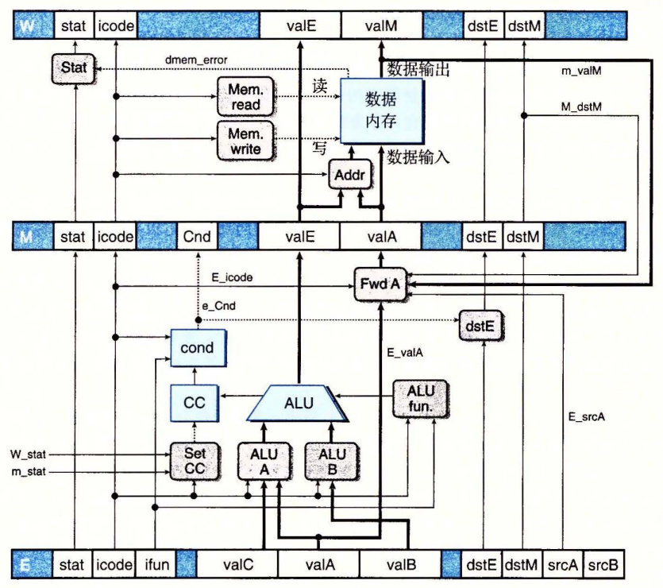

**图 4-70** 能够进行加载转发的执行和访存阶段。通过添加一条从内存输出到流水线寄存器 M 中 `valA` 的源的旁路通路，对于这种形式的加载/使用冒险，我们可以使用转发而不必暂停。这是家庭作业 4.57 的主旨。

## 第 4 章家庭作业：4.58～4.59

**家庭作业 4.58**（★★★）我们的流水线化的设计有点不太现实，因为寄存器文件有两个写端口，然而只有 `popq` 指令需要对寄存器文件同时进行两个写操作。因此，其他指令只使用一个写端口，共享这个端口来写 `valE` 和 `valM`。下面这个图是一个对写回逻辑的修改版，其中，我们将写回寄存器 ID（`W_dstE` 和 `W_dstM`）合并成一个信号 `w_dstE`，同时也将写回值（`W_valE` 和 `W_valM`）合并成一个信号 `w_valE`：

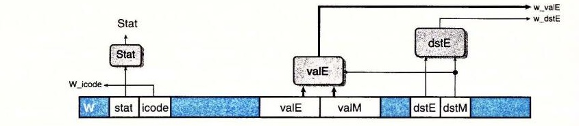

用 HCL 写执行这些合并的逻辑，如下所示：

```hcl
## Set E port register ID
word w_dstE = [
    ## writing from valM
    W_dstM != RNONE : W_dstM;
    1 : W_dstE;
];

## Set E port value
word w_valE = [
    W_dstM != RNONE : W_valM;
    1 : W_valE;
];
```

对这些多路复用器的控制是由 `dstE` 确定的——当它表明有某个寄存器时，就选择端口 E 的值，否则就选择端口 M 的值。

在模拟模型中，我们可以禁止寄存器端口 M，如下面这段 HCL 代码所示：

```hcl
## Disable register port M
## Set M port register ID
word w_dstM = RNONE;

## Set M port value
word w_valM = 0;
```

接下来的问题就是要设计处理 `popq` 的方法。一种方法是用控制逻辑动态地处理指令 `popq rA`，使之与下面两条指令序列有一样的效果：

```asm
iaddq $8,%rsp
mrmovq -8(%rsp),rA
```

（关于指令 `iaddq` 的描述，请参考练习题 4.3。）要注意两条指令的顺序，以保证 `popq %rsp` 能正确工作。要达到这个目的，可以让译码阶段的逻辑对上面列出的 `popq` 指令和 `iaddq` 指令一视同仁，除了它会预测下一个 PC 与当前 PC 相等以外。在下一个周期，再次取出了 `popq` 指令，但是指令代码变成了特殊的值 `IPOP2`。它会被当作一条特殊的指令来处理，行为与上面列出的 `mrmovq` 指令一样。

文件 `pipe-lw.hcl` 包含上面讲的修改过的写端口逻辑。它将常数 `IPOP2` 声明为十六进制值 `E`。还包括信号 `f_icode` 的定义，它产生流水线寄存器 D 的 `icode` 字段。可以修改这个定义，使得当第二次取出 `popq` 指令时，插入指令代码 `IPOP2`。这个 HCL 文件还包含信号 `f_pc` 的声明，也就是标号为 “Select PC” 的块（图 4-57）在取指阶段产生的程序计数器的值。

修改该文件中的控制逻辑，使之按照我们描述的方式来处理 `popq` 指令。可以参考实验资料获得如何为你的解答生成模拟器以及如何测试模拟器的指导。

**家庭作业 4.59**（★★）比较三个版本的冒泡排序的性能（家庭作业 4.47、4.48 和 4.49）。解释为什么一个版本的性能比其他两个的好。

---

[返回总目录](../README.md) · [上一章](../第03章-程序的机器级表示/README.md) · [下一章](../第05章-优化程序性能/README.md) · [按小节阅读](README.md) · [练习题答案](练习题答案.md)
