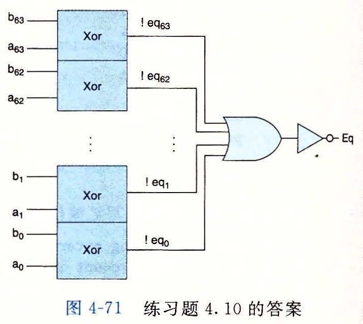

# 练习题答案

## 练习题 4.1

手工对指令编码是非常乏味的，但是它将巩固你对汇编器将汇编代码变成字节序列的理解。在下面这段 Y86-64 汇编器的输出中，每一行都给出了一个地址和一个从该地址开始的字节序列：

```text
1 0x100:                      | .pos 0x100  # Start code at address 0x100
2 0x100: 30f30f00000000000000 |     irmovq $15,%rbx
3 0x10a: 2031                 |     rrmovq %rbx,%rcx
4 0x10c:                      | loop:
5 0x10c: 4013fdffffffffffffff |     rmmovq %rcx,-3(%rbx)
6 0x116: 6031                 |     addq   %rbx,%rcx
7 0x118: 700c01000000000000   |     jmp loop
```

这段编码有些地方值得注意：

- 十进制的 15（第 2 行）的十六进制表示为 `0x000000000000000f`。以反向顺序来写就是 `0f 00 00 00 00 00 00 00`。
- 十进制 −3（第 5 行）的十六进制表示为 `0xfffffffffffffffd`。以反向顺序来写就是 `fd ff ff ff ff ff ff ff`。
- 代码从地址 `0x100` 开始。第一条指令需要 10 个字节，而第二条需要 2 个字节。因此，循环的目标地址为 `0x0000010c`。以反向顺序来写就是 `0c 01 00 00 00 00 00 00`。

## 练习题 4.2

手工对一个字节序列进行译码能帮助你理解处理器面临的任务。它必须读入字节序列，并确定要执行什么指令。接下来，我们给出的是用来产生每个字节序列的汇编代码。在汇编代码的左边，你可以看到每条指令的地址和字节序列。

A. 一些带立即数和地址偏移量的操作：

```text
0x100: 30f3fcffffffffffffff |     irmovq $-4,%rbx
0x10a: 40630008000000000000 |     rmmovq %rsi,0x800(%rbx)
0x114: 00                   |     halt
```

B. 包含一个函数调用的代码：

```text
0x200: a06f                 |     pushq %rsi
0x202: 800c02000000000000   |     call proc
0x20b: 00                   |     halt
0x20c:                      | proc:
0x20c: 30f30a00000000000000 |     irmovq $10,%rbx
0x216: 90                   |     ret
```

C. 包含非法指令指示字节 `0xf0` 的代码：

```text
0x300: 50540700000000000000 |     mrmovq 7(%rsp),%rbp
0x30a: 10                   |     nop
0x30b: f0                   | .byte 0xf0  # Invalid instruction code
0x30c: b01f                 |     popq %rcx
```

D. 包含一个跳转操作的代码：

```text
0x400:                      | loop:
0x400: 6113                 |     subq %rcx, %rbx
0x402: 730004000000000000   |     je loop
0x40b: 00                   |     halt
```

E. `pushq` 指令中第二个字节非法的代码。

```text
0x500: 6362                 |     xorq %rsi,%rdx
0x502: a0                   |     .byte 0xa0  # pushq instruction code
0x503: f0                   |     .byte 0xf0  # Invalid register specifier byte
```

## 练习题 4.3

使用 `iaddq` 指令，我们将 `sum` 函数重新编写为

```asm
# long sum(long *start, long count)
# start in %rdi, count in %rsi
sum:
    xorq %rax,%rax       # sum = 0
    andq %rsi,%rsi       # Set condition codes
    jmp  test
loop:
    mrmovq (%rdi),%r10   # Get *start
    addq %r10,%rax       # Add to sum
    iaddq $8,%rdi        # start++
    iaddq $-1,%rsi       # count--
test:
    jne  loop            # Stop when 0
    ret
```

## 练习题 4.4

在 x86-64 机器上运行时，GCC 生成如下 `rsum` 代码：

```asm
# long rsum(long *start, long count)
# start in %rdi, count in %rsi
rsum:
    movl $0, %eax
    testq %rsi, %rsi
    jle .L9
    pushq %rbx
    movq (%rdi), %rbx
    subq $1, %rsi
    addq $8, %rdi
    call rsum
    addq %rbx, %rax
    popq %rbx
.L9:
    rep; ret
```

上述代码很容易改编为 Y86-64 代码：

```asm
# long rsum(long *start, long count)
# start in %rdi, count in %rsi
rsum:
    xorq %rax,%rax       # Set return value to 0
    andq %rsi,%rsi       # Set condition codes
    je   return          # If count == 0, return 0
    pushq %rbx           # Save callee-saved register
    mrmovq (%rdi),%rbx   # Get *start
    irmovq $-1,%r10
    addq %r10,%rsi       # count--
    irmovq $8,%r10
    addq %r10,%rdi       # start++
    call rsum
    addq %rbx,%rax       # Add *start to sum
    popq %rbx            # Restore callee-saved register
return:
    ret
```

## 练习题 4.5

这道题给了你一个练习写汇编代码的机会。

```asm
 1 # long absSum(long *start, long count)
 2 # start in %rdi, count in %rsi
 3 absSum:
 4     irmovq $8,%r8         # Constant 8
 5     irmovq $1,%r9         # Constant 1
 6     xorq %rax,%rax        # sum = 0
 7     andq %rsi,%rsi        # Set condition codes
 8     jmp  test
 9 loop:
10     mrmovq (%rdi),%r10    # x = *start
11     xorq %r11,%r11        # Constant 0
12     subq %r10,%r11        # -x
13     jle pos               # Skip if -x <= 0
14     rrmovq %r11,%r10      # x = -x
15 pos:
16     addq %r10,%rax        # Add to sum
17     addq %r8,%rdi         # start++
18     subq %r9,%rsi         # count--
19 test:
20     jne  loop             # Stop when 0
21     ret
```

## 练习题 4.6

这道题给了你一个练习写带条件传送汇编代码的机会。我们只给出循环的代码。剩下的部分与练习题 4.5 的一样。

```asm
 9 loop:
10     mrmovq (%rdi),%r10    # x = *start
11     xorq %r11,%r11        # Constant 0
12     subq %r10,%r11        # -x
13     cmovg %r11,%r10       # If -x > 0 then x = -x
14     addq %r10,%rax        # Add to sum
15     addq %r8,%rdi         # start++
16     subq %r9,%rsi         # count--
17 test:
18     jne  loop             # Stop when 0
```

## 练习题 4.7

虽然难以想象这条特殊的指令有什么实际的用处，但是在设计一个系统时，在描述中避免任何歧义是很重要的。我们想要为这条指令的行为确定一个合理的规则，并且保证每个实现都遵循这个规则。

在这个测试中，`subq` 指令将 `%rsp` 的起始值与压入栈中的值进行了比较。这个减法的结果为 0，表明压入的是 `%rsp` 的旧值。

## 练习题 4.8

更难以想象为什么会有人想要把值弹出到栈指针。我们还是应该确定一个规则，并且坚持它。这段代码序列将 `0xabcd` 压入栈中，弹出到 `%rsp`，然后返回弹出的值。由于结果等于 `0xabcd`，我们可以推断出 `popq %rsp` 将栈指针设置为从内存中读出来的那个值。因此，它等价于指令 `mrmovq (%rsp), %rsp`。

## 练习题 4.9

EXCLUSIVE-OR 函数要求两个位有相反的值：

```hcl
bool xor = (!a && b) || (a && !b);
```

通常，信号 `eq` 和 `xor` 是互补的。也就是，一个等于 1，另一个就等于 0。

## 练习题 4.10

EXCLUSIVE-OR 电路的输出是位相等值的补。根据德摩根定律（网络旁注 DATA:BOOL），我们能用 OR 和 NOT 实现 AND，得到如图 4-71 所示的电路：



## 练习题 4.11

我们可以看到情况表达式的第二部分可以写为

```hcl
B <= C : B;
```

由于第一行将检测出 A 为最小元素的情况，因此第二行就只需要确定 B 还是 C 是最小元素。

## 练习题 4.12

这个设计只是对从三个输入中找出最小值的简单改变。

```hcl
word Med3 = [
    A <= B && B <= C : B;
    C <= B && B <= A : B;
    B <= A && A <= C : A;
    C <= A && A <= B : A;
    1               : C;
];
```

## 练习题 4.13

这些练习使各个阶段的计算更加具体。从目标代码中我们可以看到，指令位于地址 `0x016`。它由 10 个字节组成，前两个字节为 `0x30` 和 `0xf4`。后八个字节是 `0x0000000000000080`（十进制 128）按字节反过来的形式。

| 阶段 | 通用：`irmovq V, rB` | 具体：`irmovq $128, %rsp` |
| --- | --- | --- |
| 取指 | icode:ifun ← M₁[PC]；rA:rB ← M₁[PC+1]；valC ← M₈[PC+2]；valP ← PC+10 | icode:ifun ← M₁[0x016] = 3:0；rA:rB ← M₁[0x017] = f:4；valC ← M₈[0x018] = 128；valP ← 0x016+10 = 0x020 |
| 译码 | | |
| 执行 | valE ← 0+valC | valE ← 0+128 = 128 |
| 访问 | | |
| 写回 | R[rB] ← valE | R[%rsp] ← valE = 128 |
| 更新 PC | PC ← valP | PC ← valP = 0x020 |

这个指令将寄存器 `%rsp` 设为 128，并将 PC 加 10。

## 练习题 4.14

我们可以看到指令位于地址 `0x02c`，由两个字节组成，值分别为 `0xb0` 和 `0x00f`。`pushq` 指令（第 6 行）将寄存器 `%rsp` 设为了 120，并且将 9 存放在了这个内存位置。

| 阶段 | 通用：`popq rA` | 具体：`popq %rax` |
| --- | --- | --- |
| 取指 | icode:ifun ← M₁[PC]；rA:rB ← M₁[PC+1]；valP ← PC+2 | icode:ifun ← M₁[0x02c] = b:0；rA:rB ← M₁[0x02d] = 0:f；valP ← 0x02c+2 = 0x02e |
| 译码 | valA ← R[%rsp]；valB ← R[%rsp] | valA ← R[%rsp] = 120；valB ← R[%rsp] = 120 |
| 执行 | valE ← valB+8 | valE ← 120+8 = 128 |
| 访存 | valM ← M₈[valA] | valM ← M₈[120] = 9 |
| 写回 | R[%rsp] ← valE；R[rA] ← valM | R[%rsp] ← 128；R[%rsp] ← 9 |
| 更新 PC | PC ← valP | PC ← 0x02e |

该指令将 `%rax` 设为 9，将 `%rsp` 设为 128，并将 PC 加 2。

## 练习题 4.15

沿着图 4-20 中列出的步骤，这里 `rA` 等于 `%rsp`，我们可以看到，在访存阶段，指令会将 `valA`（即栈指针的原始值）存放到内存中，与我们在 x86-64 中发现的一样。

## 练习题 4.16

沿着图 4-20 中列出的步骤，这里 `rA` 等于 `%rsp`，我们可以看到，两个写回操作都会更新 `%rsp`。因为写 `valM` 的操作后发生，指令的最终效果会是将从内存中读出的值写入 `%rsp`，就像在 x86-64 中看到的一样。

## 练习题 4.17

实现条件传送只需要对寄存器到寄存器的传送做很小的修改。我们简单地以条件测试的结果作为写回步骤的条件：

| 阶段 | `cmovXX rA, rB` |
| --- | --- |
| 取指 | icode:ifun ← M₁[PC]；rA:rB ← M₁[PC+1]；valP ← PC+2 |
| 译码 | valA ← R[rA] |
| 执行 | valE ← 0+valA；Cnd ← Cond(CC, ifun) |
| 访存 | |
| 写回 | if(Cnd) R[rB] ← valE |
| 更新 PC | PC ← valP |

## 练习题 4.18

我们可以看到这条指令位于地址 `0x037`，长度为 9 个字节。第一个字节值为 `0x80`，而后面 8 个字节是 `0x0000000000000041` 按字节反过来的形式，即调用的目标地址。`popq` 指令（第 7 行）将栈指针设为 128。

| 阶段 | 通用：`call Dest` | 具体：`call 0x041` |
| --- | --- | --- |
| 取指 | icode:ifun ← M₁[PC]；valC ← M₈[PC+1]；valP ← PC+9 | icode:ifun ← M₁[0x037] = 8:0；valC ← M₈[0x038] = 0x041；valP ← 0x037+9 = 0x040 |
| 译码 | valB ← R[%rsp] | valB ← R[%rsp] = 128 |
| 执行 | valE ← valB+−8 | valE ← 128+−8 = 120 |
| 访存 | M₈[valE] ← valP | M₈[120] ← 0x040 |
| 写回 | R[%rsp] ← valE | R[%rsp] ← 120 |
| 更新 PC | PC ← valC | PC ← 0x041 |

这条指令的效果就是将 `%rsp` 设为 120，将 `0x040`（返回地址）存放到该内存地址，并将 PC 设为 `0x041`（调用的目标地址）。

## 练习题 4.19

练习题中所有的 HCL 代码都很简单明了，但是试着自己写会帮助你思考各个指令，以及如何处理它们。对于这个问题，我们只要看看 Y86-64 的指令集（图 4-2），确定哪些有常数字段。

```hcl
bool need_valC =
    icode in { IIRMOVQ, IRMMOVQ, IMRMOVQ, IJXX, ICALL };
```

## 练习题 4.20

这段代码类似于 `srcA` 的代码：

```hcl
word srcB = [
    icode in { IOPQ, IRMMOVQ, IMRMOVQ } : rB;
    icode in { IPUSHQ, IPOPQ, ICALL, IRET } : RRSP;
    1 : RNONE; # Don't need register
];
```

## 练习题 4.21

这段代码类似于 `dstE` 的代码：

```hcl
word dstM = [
    icode in { IMRMOVQ, IPOPQ } : rA;
    1 : RNONE; # Don't write any register
];
```

## 练习题 4.22

像在练习题 4.16 中发现的那样，为了将从内存中读出的值存放到 `%rsp`，我们想让通过 M 端口写的优先级高于通过 E 端口写。

## 练习题 4.23

这段代码类似于 `aluA` 的代码：

```hcl
word aluB = [
    icode in { IRMMOVQ, IMRMOVQ, IOPQ, ICALL,
               IPUSHQ, IRET, IPOPQ } : valB;
    icode in { IRRMOVQ, IIRMOVQ } : 0;
    # Other instructions don't need ALU
];
```

## 练习题 4.24

实现条件传送令人吃惊的简单：当条件不满足时，通过将目的寄存器设置为 `RNONE` 禁止写寄存器文件。

```hcl
word dstE = [
    icode in { IRRMOVQ } && Cnd : rB;
    icode in { IIRMOVQ, IOPQ } : rB;
    icode in { IPUSHQ, IPOPQ, ICALL, IRET } : RRSP;
    1 : RNONE; # Don't write any register
];
```

## 练习题 4.25

这段代码类似于 `mem_addr` 的代码：

```hcl
word mem_data = [
    # Value from register
    icode in { IRMMOVQ, IPUSHQ } : valA;
    # Return PC
    icode == ICALL : valP;
    # Default: Don't write anything
];
```

## 练习题 4.26

这段代码类似于 `mem_read` 的代码：

```hcl
bool mem_write = icode in { IRMMOVQ, IPUSHQ, ICALL };
```

## 练习题 4.27

计算 `Stat` 字段需要从几个阶段收集状态信息：

```hcl
## Determine instruction status
word Stat = [
    imem_error || dmem_error : SADR;
    !instr_valid: SINS;
    icode == IHALT : SHLT;
    1 : SAOK;
];
```

## 练习题 4.28

这个题目非常有趣，它试图在一组划分中找到优化平衡。它提供了大量的机会来计算许多流水线的吞吐量和延迟。

A. 对一个两阶段流水线来说，最好的划分是块 A、B 和 C 在第一阶段，块 D、E 和 F 在第二阶段。第一阶段的延迟为 170ps，所以整个周期的时长为 170+20=190ps。因此吞吐量为 5.26 GIPS，而延迟为 380ps。

B. 对一个三阶段流水线来说，应该使块 A 和 B 在第一阶段，块 C 和 D 在第二阶段，而块 E 和 F 在第三阶段。前两个阶段的延迟均为 110ps，所以整个周期时长为 130ps，而吞吐量为 7.69 GIPS。延迟为 390ps。

C. 对一个四阶段流水线来说，块 A 为第一阶段，块 B 和 C 在第二阶段，块 D 是第三阶段，而块 E 和 F 在第四阶段。第二阶段需要 90ps，所以整个周期时长为 110ps，而吞吐量为 9.09 GIPS。延迟为 440ps。

D. 最优的设计应该是五阶段流水线，除了 E 和 F 处于第五阶段以外，其他每个块是一个阶段。周期时长为 80+20=100ps，吞吐量为大约 10.00 GIPS，而延迟为 500ps。变成更多的阶段也不会有帮助了，因为不可能使流水线运行得比以 100ps 为一周期还要快了。

## 练习题 4.29

每个阶段的组合逻辑都需要 300/k ps，而流水线寄存器需要 20ps。

A. 整个的延迟应该是 300+20k ps，而吞吐量（以 GIPS 为单位）应该是

```text
1000 / (300/k + 20) = 1000k / (300 + 20k)
```

B. 当 k 趋近于无穷大，吞吐量变为 1000/20=50 GIPS。当然，这也使得延迟为无穷大。

这个练习题量化了很深的流水线引起的收益下降。当我们试图将逻辑分割为很多阶段时，流水线寄存器的延迟成为了一个制约因素。

## 练习题 4.30

这段代码非常类似于 SEQ 中相应的代码，除了我们还不能确定数据内存是否会为这条指令产生一个错误信号。

```hcl
# Determine status code for fetched instruction
word f_stat = [
    imem_error: SADR;
    !instr_valid : SINS;
    f_icode == IHALT : SHLT;
    1 : SAOK;
];
```

## 练习题 4.31

这段代码只是简单地给 SEQ 代码中的信号名前加上前缀 “d_” 和 “D_”。

```hcl
word d_dstE = [
    D_icode in { IRRMOVQ, IIRMOVQ, IOPQ } : D_rB;
    D_icode in { IPUSHQ, IPOPQ, ICALL, IRET } : RRSP;
    1 : RNONE; # Don't write any register
];
```

## 练习题 4.32

由于 `popq` 指令（第 4 行）造成的加载/使用冒险，`rrmovq` 指令（第 5 行）会暂停一个周期。当它进入译码阶段，`popq` 指令处于访存阶段，使 `M_dstE` 和 `M_dstM` 都等于 `%rsp`。如果两种情况反过来，那么来自 `M_valE` 的写回优先级较高，导致增加了的栈指针被传送到 `rrmovq` 指令作为参数。这与练习题 4.8 中确定的处理 `popq %rsp` 的惯例不一致。

## 练习题 4.33

这个问题让你体验一下处理器设计中一个很重要的任务——为一个新处理器设计测试程序。通常，我们的测试程序应该能测试所有的冒险可能性，而且一旦有相关不能被正确处理，就会产生错误的结果。

对于此例，我们可以使用对练习题 4.32 中所示的程序稍微修改的版本：

```asm
1 irmovq $5, %rdx
2 irmovq $0x100,%rsp
3 rmmovq %rdx,0(%rsp)
4 popq %rsp
5 nop
6 nop
7 rrmovq %rsp,%rax
```

两个 `nop` 指令会导致当 `rrmovq` 指令在译码阶段中时，`popq` 指令处于写回阶段。如果给予处于写回阶段中的两个转发源错误的优先级，那么寄存器 `%rax` 会设置成增加了的程序计数器，而不是从内存中读出的值。

## 练习题 4.34

这个逻辑只需要检查 5 个转发源：

```hcl
word d_valB = [
    d_srcB == e_dstE : e_valE;   # Forward valE from execute
    d_srcB == M_dstM : m_valM;   # Forward valM from memory
    d_srcB == M_dstE : M_valE;   # Forward valE from memory
    d_srcB == W_dstM : W_valM;   # Forward valM from write back
    d_srcB == W_dstE : W_valE;   # Forward valE from write back
    1 : d_rvalB; # Use value read from register file
];
```

## 练习题 4.35

这个改变不会处理条件传送不满足条件的情况，因此将 `dstE` 设置为 `RNONE`。即使条件传送并没有发生，结果值还是会被转发到下一条指令。

```asm
1     irmovq $0x123,%rax
2     irmovq $0x321,%rdx
3     xorq %rcx,%rcx       # CC = 100
4     cmovne %rax,%rdx     # Not transferred
5     addq %rdx,%rdx       # Should be 0x642
6     halt
```

这段代码将寄存器 `%rdx` 初始化为 `0x321`。条件数据传送没有发生，所以最后的 `addq` 指令应该把 `%rdx` 中的值翻倍，得到 `0x642`。不过，在修改过的版本中，条件传送源值 `0x123` 被转发到 ALU 的输入 `valA`，而 `valB` 正确地得到了操作数值 `0x321`。两个输入加起来就得到结果 `0x444`。

## 练习题 4.36

这段代码完成了对这条指令的状态码的计算。

```hcl
## Update the status
word m_stat = [
    dmem_error : SADR;
    1 : M_stat;
];
```

## 练习题 4.37

设计下面这个测试程序来建立控制组合 A（图 4-67），并探测是否出了错：

```asm
 1 # Code to generate a combination of not-taken branch and ret
 2         irmovq Stack, %rsp
 3         irmovq rtnp,%rax
 4         pushq %rax       # Set up return pointer
 5         xorq %rax,%rax    # Set Z condition code
 6         jne target       # Not taken (First part of combination)
 7         irmovq $1,%rax    # Should execute this
 8         halt
 9 target: ret              # Second part of combination
10         irmovq $2,%rbx    # Should not execute this
11         halt
12 rtnp:   irmovq $3,%rdx    # Should not execute this
13         halt
14 .pos 0x40
15 Stack:
```

设计这个程序是为了出错（例如如果实际上执行了 `ret` 指令）时，程序会执行一条额外的 `irmovq` 指令，然后停止。因此，流水线中的错误会导致某个寄存器更新错误。这段代码说明实现测试程序需要非常小心。它必须建立起可能的错误条件，然后再探测是否有错误发生。

## 练习题 4.38

设计下面这个测试程序用来建立控制组合 B（图 4-67）。模拟器会发现流水线寄存器的气泡和暂停控制信号都设置成 0 的情况，因此我们的测试程序只需要建立它需要发现的组合情况。最大的挑战在于当处理正确时，程序要做正确的事情。

```asm
 1 # Test instruction that modifies %esp followed by ret
 2         irmovq mem,%rbx
 3         mrmovq 0(%rbx),%rsp # Sets %rsp to point to return point
 4         ret                # Returns to return point
 5         halt               #
 6 rtnpt:  irmovq $5,%rsi      # Return point
 7         halt
 8 .pos 0x40
 9 mem:    .quad stack        # Holds desired stack pointer
10 .pos 0x50
11 stack:  .quad rtnpt        # Top of stack: Holds return point
```

这个程序使用了内存中两个初始化了的字。第一个字（`mem`）保存着第二个字（`stack`——期望的栈指针）的地址。第二个字保存着 `ret` 指令期望的返回点的地址。这个程序将栈指针加载到 `%rsp`，并执行 `ret` 指令。

## 练习题 4.39

从图 4-66 我们可以看到，由于加载/使用冒险，流水线寄存器 D 必须暂停。

```hcl
bool D_stall =
    # Conditions for a load/use hazard
    E_icode in { IMRMOVQ, IPOPQ } &&
    E_dstM in { d_srcA, d_srcB };
```

## 练习题 4.40

从图 4-66 中可以看到，由于加载/使用冒险，或者由于分支预测错误，流水线寄存器 E 必须设置成气泡：

```hcl
bool E_bubble =
    # Mispredicted branch
    (E_icode == IJXX && !e_Cnd) ||
    # Conditions for a load/use hazard
    E_icode in { IMRMOVQ, IPOPQ } &&
    E_dstM in { d_srcA, d_srcB };
```

## 练习题 4.41

这个控制需要检查正在执行的指令的代码，还需要检查流水线中更后面阶段中的异常。

```hcl
## Should the condition codes be updated?
bool set_cc = E_icode == IOPQ &&
    # State changes only during normal operation
    !m_stat in { SADR, SINS, SHLT } && !W_stat in { SADR, SINS, SHLT };
```

## 练习题 4.42

在下一个周期向访存阶段插入气泡需要检查当前周期中访存或者写回阶段中是否有异常。

```hcl
# Start injecting bubbles as soon as exception passes through memory stage
bool M_bubble = m_stat in { SADR, SINS, SHLT } || W_stat in { SADR, SINS, SHLT };
```

对于暂停写回阶段，只用检查这个阶段中的指令的状态。如果当访存阶段中有异常指令时我们也暂停了，那么这条指令就不能进入写回阶段。

```hcl
bool W_stall = W_stat in { SADR, SINS, SHLT };
```

## 练习题 4.43

此时，预测错误的频率是 0.35，得到 *mp* = 0.20 × 0.35 × 2 = 0.14，而整个 CPI 为 1.25。看上去收获非常小，但是如果实现新的分支预测策略的成本不是很高的话，这样做还是值得的。

## 练习题 4.44

在这个简化的分析中，我们把注意力放在了内循环上，这是估计程序性能的一种很有用的方法。只要数组足够大，花在代码其他部分的时间可以忽略不计。

A. 使用条件转移的代码的内循环有 9 条指令，当数组元素是 0 或者为负时，这些指令都要执行，当数组元素为正时，要执行其中的 8 条。平均是 8.5 条。使用条件传送的代码的内循环有 8 条指令，每次都必须执行。

B. 用来实现循环闭合的跳转除了当循环中止时之外，都能预测正确。对于非常长的数组，这个预测错误对性能的影响可以忽略不计。对于基于跳转的代码，其他唯一可能引起气泡的源取决于数组元素是否为正的条件转移。这会导致两个气泡，但是只在 50% 的时间里会出现，所以平均值是 1.0。在条件传送代码中，没有气泡。

C. 我们的条件转移代码对于每个元素平均需要 8.5+1.0=9.5 个周期（最好情况要 9 个周期，最差情况要 10 个周期），而条件传送代码对于所有的情况都需要 8.0 个周期。

我们的流水线的分支预测错误处罚只有两个周期——远比对性能更高的处理器中很深的流水线造成的处罚要小得多。因此，使用条件传送对程序性能的影响不是很大。
